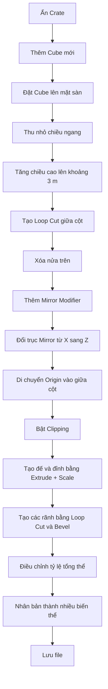

# 026 — Creating a Pillar

| Thuộc tính       | Nội dung                              |
| ---------------- | ------------------------------------- |
| **Module**       | Module 02 — Modular Dungeon           |
| **Bài học**      | Creating a Pillar                     |
| **Thời lượng**   | 11:30                                 |
| **Chủ đề chính** | Tạo cột đá và sử dụng Mirror Modifier |

---

## 1. Mục tiêu bài học

Sau bài học này, bạn có thể:

* Dựng một cột đá phong cách dungeon từ **Cube**.
* Thiết lập chiều cao cột khoảng **3 mét**.
* Hiểu cách hoạt động của **Mirror Modifier**.
* Thay đổi trục đối xứng từ `X` sang `Z`.
* Di chuyển **Object Origin** để xác định đúng mặt phẳng đối xứng.
* Sử dụng **Clipping** để gắn hai nửa mô hình lại với nhau.
* Kết hợp `Loop Cut`, `Extrude`, `Scale` và `Bevel` để tạo các tầng đá.
* Nhân bản và chỉnh sửa để tạo nhiều biến thể cột khác nhau.

---

## 2. Cấu trúc tổng thể của cột

Cột được tạo từ một khối lập phương và chia thành nhiều tầng đá:

```text
        ┌───────────────┐
        │   Đỉnh cột    │
        │   loe rộng    │
        ├───────────────┤
        │  Khối đá trên │
        ├───────────────┤
        │               │
        │   Thân cột    │
        │               │
        ├───────────────┤
        │  Khối đá dưới │
        ├───────────────┤
        │    Đế cột     │
        │   loe rộng    │
        └───────────────┘
```

Cột có tính đối xứng theo chiều dọc:

```text
         Phần trên
             ▲
             │
     ───── Mặt phẳng Mirror ─────
             │
             ▼
         Phần dưới
```

Thay vì chỉnh sửa cả phần trên và dưới, ta chỉ dựng một nửa rồi để **Mirror Modifier** tự tạo nửa còn lại.

---

## 3. Chuẩn bị scene

### 3.1. Đổi tên và ẩn thùng gỗ

Object được tạo ở bài trước cần được đổi tên thành:

```text
Crate
```

Sau đó nhấn biểu tượng con mắt trong **Outliner** để tạm ẩn thùng gỗ, giúp dễ tập trung vào việc dựng cột.

### 3.2. Thêm Cube mới

Thêm một Cube:

```text
Shift + A → Mesh → Cube
```

Chuyển sang Front View:

```text
Numpad 1
```

---

## 4. Thiết lập kích thước ban đầu

### 4.1. Đặt Cube lên trên mặt sàn

Cube mặc định cao `2 m`, tâm nằm tại gốc tọa độ nên một nửa đang chìm dưới sàn.

Di chuyển Cube lên `1 m`:

```text
G → Z → 1 → Enter
```

Sau thao tác này, đáy Cube nằm đúng trên mặt sàn.

### 4.2. Thu nhỏ chiều ngang

Cột cần khá dày nhưng không rộng bằng Cube mặc định.

Scale theo mặt phẳng `X–Y`, giữ nguyên chiều cao:

```text
S → Shift + Z
```

Kích thước chiều ngang trong bài khoảng:

```text
0,7 m × 0,7 m
```

Có thể kiểm tra kích thước trong bảng Item:

```text
N → Item → Dimensions
```

> Không cần nhập kích thước chính xác tuyệt đối. Quan trọng là cột có tỷ lệ phù hợp với dungeon.

---

## 5. Tăng chiều cao cột trong Edit Mode

Chiều cao mục tiêu của cột là khoảng:

```text
3 m
```

Nếu scale cả object theo trục `Z` trong Object Mode, đáy cột sẽ di chuyển khỏi mặt sàn. Vì vậy, bài học sử dụng Edit Mode để chỉ kéo mặt trên lên.

### Quy trình

1. Nhấn `Tab` để vào **Edit Mode**.
2. Chuyển sang **Face Select** bằng phím `3`.
3. Chuyển sang Front View bằng `Numpad 1`.
4. Bật Wireframe:

```text
Z → Wireframe
```

5. Bỏ chọn tất cả:

```text
Alt + A
```

6. Box Select các đỉnh hoặc mặt ở phía trên.
7. Di chuyển lên thêm `1 m`:

```text
G → Z → 1 → Enter
```

Cột lúc này có chiều cao tổng cộng khoảng `3 m`.

### Vì sao cần Wireframe?

Trong Solid Mode, khi box select từ góc nhìn phía trước, Blender thường chỉ chọn các thành phần đang nhìn thấy.

Trong Wireframe Mode, có thể chọn xuyên qua toàn bộ mesh:

```text
Solid Mode
    ↓
Chỉ chọn mặt phía trước

Wireframe Mode
    ↓
Chọn cả mặt trước và mặt sau
```

---

## 6. Chuẩn bị hình học cho Mirror Modifier

Cột đối xứng giữa phần trên và phần dưới. Ta sẽ giữ lại một nửa và dùng Mirror Modifier để tạo nửa còn lại.

### 6.1. Tạo đường cắt chính giữa

Trong Edit Mode, thêm một Loop Cut ngang qua giữa cột:

```text
Ctrl + R
```

Nhấp chuột trái để xác nhận đường cắt, sau đó nhấp thêm lần nữa để đặt nó chính giữa.

### 6.2. Xóa nửa trên

1. Chuyển sang Face Select:

```text
3
```

2. Bật Wireframe.
3. Chọn toàn bộ phần phía trên đường cắt.
4. Xóa các mặt:

```text
X hoặc Delete → Faces
```

Sau thao tác này, mesh chỉ còn lại nửa dưới của cột.

---

## 7. Thêm Mirror Modifier

Mở tab **Modifier Properties**, có biểu tượng cờ lê, sau đó chọn:

```text
Add Modifier → Generate → Mirror
```

### 7.1. Thay đổi trục Mirror

Mặc định, Mirror Modifier đối xứng theo trục `X`. Tuy nhiên, cột cần đối xứng theo chiều cao, tức là theo trục `Z`.

Thiết lập:

```text
X: Tắt
Z: Bật
```

| Trục | Kết quả              |
| ---- | -------------------- |
| `X`  | Đối xứng trái ↔ phải |
| `Y`  | Đối xứng trước ↔ sau |
| `Z`  | Đối xứng dưới ↔ trên |

Trong bài này cần sử dụng:

```text
Mirror Axis = Z
```

---

## 8. Object Origin và mặt phẳng đối xứng

Mirror Modifier sử dụng **Object Origin** làm tâm đối xứng.

Nếu Object Origin nằm ở đáy cột, phần được mirror sẽ xuất hiện quanh đáy thay vì xuất hiện ở phía trên.

```text
Object Origin ở đáy
        ↓
Mirror sai vị trí

Object Origin ở giữa cột
        ↓
Mirror đúng vị trí
```

### 8.1. Di chuyển Origin

Thao tác di chuyển Origin chỉ thực hiện được trong **Object Mode**.

1. Nhấn `Tab` để về Object Mode.
2. Mở menu:

```text
Options → Affect Only → Origins
```

3. Di chuyển Origin lên giữa chiều cao cột:

```text
G → Z
```

4. Đặt Origin gần đường Loop Cut giữa cột.
5. Tắt lại:

```text
Options → Affect Only → Origins
```

> Khi **Affect Only Origins** đang bật, lệnh Move chỉ di chuyển Origin, không di chuyển mesh.

### Lưu ý

Nếu vào Edit Mode, menu Options sẽ hiển thị các tùy chọn khác. Vì vậy, phải trở về Object Mode trước khi bật **Affect Only Origins**.

---

## 9. Bật Clipping

Trong Mirror Modifier, bật:

```text
Clipping
```

Clipping giúp các đỉnh nằm tại mặt phẳng đối xứng dính chặt với nhau.

### Khi chưa bật Clipping

Các đỉnh giữa có thể bị kéo tách ra:

```text
┌─────┐   ┌─────┐
│     │   │     │
│     │   │     │
└─────┘   └─────┘
        ↑
   Xuất hiện khe hở
```

### Khi bật Clipping

Các đỉnh giữa không thể đi xuyên qua mặt phẳng Mirror:

```text
┌─────┬─────┐
│     │     │
│     │     │
└─────┴─────┘
      ↑
Hai nửa được gắn liền
```

Sau khi bật Clipping, mọi chỉnh sửa ở phần dưới sẽ tự động được phản chiếu lên phần trên.

---

## 10. Tạo phần đế và đỉnh cột

### 10.1. Thêm Loop Cut gần đáy

Thêm một Loop Cut quanh phần dưới:

```text
Ctrl + R
```

Di chuyển đường cắt xuống gần đáy cột.

### 10.2. Tạo phần thân thụt vào

Chọn vòng mặt nằm phía trên đế.

Nếu chỉ scale vào trong, phần chuyển tiếp sẽ không tạo được gờ rõ ràng. Vì vậy, cần extrude trước:

```text
E
```

Sau đó scale theo `X–Y`, giữ nguyên chiều cao:

```text
S → Shift + Z
```

Kết quả:

```text
Trước Extrude              Sau Extrude + Scale

┌──────────────┐           ┌──────────────┐
│              │           │              │
│              │           │   ┌──────┐   │
│              │           │   │      │   │
└──────────────┘           └───┴──────┴───┘
                                 ↑
                              Có gờ đá
```

Do Mirror Modifier hoạt động theo trục `Z`, phần đế được tạo ở dưới cũng tự động tạo thành phần đỉnh ở trên.

---

## 11. Chia thân cột thành các khối đá

Mục tiêu tiếp theo là tạo cảm giác cột được ghép từ khoảng ba khối đá lớn.

### 11.1. Tạo đường phân chia

Thêm Loop Cut:

```text
Ctrl + R
```

Đặt đường cắt tại vị trí phù hợp trên thân cột.

### 11.2. Tạo một rãnh nhỏ bằng Bevel

Chọn cạnh vòng vừa tạo, sau đó dùng:

```text
Ctrl + B
```

Lăn con lăn chuột để thêm một đường cạnh ở giữa vùng Bevel.

Điều này tạo ra một dải mặt nhỏ quanh thân cột.

### 11.3. Thu dải mặt vào trong

Chuyển sang Edge Select:

```text
2
```

Chọn Edge Loop:

```text
Alt + Left Click
```

Sau đó scale vào trong theo mặt phẳng ngang:

```text
S → Shift + Z
```

Kết quả là một rãnh phân cách giữa hai khối đá.

---

## 12. Tạo thêm đường phân cách đá

Một số Edge Loop nằm gần phần gờ có thể chạy theo hướng không mong muốn. Trong trường hợp đó, cách đơn giản hơn là thêm một Loop Cut mới.

### Quy trình

1. Chuyển sang Front View:

```text
Numpad 1
```

2. Thêm Loop Cut:

```text
Ctrl + R
```

3. Đặt đường cắt tại vị trí cần phân chia.
4. Chọn Edge Loop:

```text
Alt + Left Click
```

5. Scale vào trong:

```text
S → Shift + Z
```

Cột lúc này trông giống nhiều khối đá lớn xếp chồng lên nhau.

---

## 13. Điều chỉnh độ dày của cột

Sau khi xem trong Solid Mode, cột ban đầu có thể hơi mảnh.

Để làm toàn bộ cột dày hơn:

1. Chuyển sang Edit Mode.
2. Bật Wireframe.
3. Chọn toàn bộ mesh:

```text
A
```

4. Scale theo `X–Y`:

```text
S → Shift + Z
```

Mục tiêu là đưa chiều rộng cột lên gần:

```text
1 m
```

> Vì đang scale trong Edit Mode nên Object Scale bên ngoài không bị thay đổi.

---

## 14. Thêm chi tiết cho phần chân cột

Để phần đế bớt đơn giản, thêm một bậc đá loe rộng.

### Quy trình

1. Thêm Loop Cut gần đáy:

```text
Ctrl + R
```

2. Chuyển sang Face Select:

```text
3
```

3. Chọn các mặt phía dưới.
4. Extrude:

```text
E
```

5. Scale rộng ra theo mặt phẳng ngang:

```text
S → Shift + Z
```

Kết quả là một phần đế nhô rộng hơn thân cột.

Do Mirror Modifier đang bật, chi tiết này cũng xuất hiện đối xứng ở phần đỉnh cột.

---

## 15. Điều chỉnh vùng chọn bằng Grow Selection

Nếu phần đế và đỉnh cột quá dày, có thể mở rộng vùng chọn rồi scale nhỏ lại.

Mở rộng vùng chọn:

```text
Ctrl + Numpad +
```

Lệnh tương đương trong menu:

```text
Select → More/Less → More
```

Sau đó scale vào trong:

```text
S → Shift + Z
```

Cách này giúp điều chỉnh nhiều vòng mặt liên tiếp mà không phải chọn thủ công từng mặt.

---

## 16. Tạo nhiều biến thể cột

Một dungeon sẽ tự nhiên hơn nếu các cột không hoàn toàn giống nhau.

### 16.1. Nhân bản cột đầu tiên

Trở về Object Mode:

```text
Tab
```

Nhân bản và di chuyển sang bên phải `2 m`:

```text
Shift + D → X → 2 → Enter
```

### 16.2. Chỉnh sửa biến thể thứ hai

Vào Edit Mode và chọn các vòng mặt phân chia giữa những khối đá.

Di chuyển chúng theo trục `Z`:

```text
G → Z
```

Có thể làm các khối đá ngắn hơn hoặc thay đổi tỷ lệ giữa các tầng.

### 16.3. Tạo biến thể thứ ba

Nhân bản thêm một lần:

```text
Shift + D → X → 2
```

Sau đó chỉnh sửa:

* Làm khối đá giữa rộng hơn.
* Di chuyển các đường phân chia lên cao hơn.
* Thay đổi chiều cao của từng tầng đá.
* Làm phần thân giữa dày hoặc mỏng hơn.

Kết quả cuối cùng là ba cột có cùng phong cách nhưng khác nhau về tỷ lệ.

```text
Cột 1               Cột 2               Cột 3

┌────────┐          ┌────────┐          ┌────────┐
│        │          │        │          │        │
├────────┤          ├────────┤          ├────────┤
│        │          │        │          │        │
│        │          ├────────┤          │        │
├────────┤          │        │          ├────────┤
│        │          ├────────┤          │        │
└────────┘          └────────┘          └────────┘
Cân đối              Khối ngắn hơn       Khối giữa lớn hơn
```

---

## 17. Quy trình thực hành tổng quát



---

## 18. Phím tắt và công cụ quan trọng

| Phím tắt/Công cụ   | Chức năng                       |
| ------------------ | ------------------------------- |
| `Shift + A`        | Thêm object mới                 |
| `Numpad 1`         | Front View                      |
| `Tab`              | Chuyển Object Mode/Edit Mode    |
| `1`                | Vertex Select trong Edit Mode   |
| `2`                | Edge Select trong Edit Mode     |
| `3`                | Face Select trong Edit Mode     |
| `G`                | Di chuyển                       |
| `G, Z`             | Di chuyển theo trục Z           |
| `S`                | Scale                           |
| `S, Shift + Z`     | Scale theo X và Y, giữ nguyên Z |
| `E`                | Extrude                         |
| `Ctrl + R`         | Loop Cut                        |
| `Ctrl + B`         | Bevel cạnh                      |
| `Alt + Left Click` | Chọn Edge Loop                  |
| `A`                | Chọn toàn bộ                    |
| `Alt + A`          | Bỏ chọn toàn bộ                 |
| `Ctrl + Numpad +`  | Mở rộng vùng chọn               |
| `Shift + D`        | Duplicate object                |
| `Z → Wireframe`    | Chuyển sang Wireframe           |
| `Z → Solid`        | Chuyển về Solid Mode            |
| `N`                | Mở bảng Sidebar                 |
| `Delete → Faces`   | Xóa các mặt được chọn           |

---

## 19. Mirror Modifier: các thiết lập quan trọng

| Thiết lập         | Ý nghĩa                                            |
| ----------------- | -------------------------------------------------- |
| **Axis X**        | Đối xứng trái và phải                              |
| **Axis Y**        | Đối xứng trước và sau                              |
| **Axis Z**        | Đối xứng trên và dưới                              |
| **Clipping**      | Không cho các đỉnh đi xuyên qua mặt phẳng đối xứng |
| **Merge**         | Gộp các đỉnh nằm gần mặt phẳng đối xứng            |
| **Object Origin** | Xác định vị trí mặt phẳng đối xứng                 |

Trong bài này:

```text
Axis X: Off
Axis Z: On
Clipping: On
Origin: Đặt tại giữa chiều cao cột
```

---

## 20. Lưu ý và lỗi thường gặp

### 20.1. Mirror xuất hiện sai hướng

**Nguyên nhân:** Mirror Modifier vẫn đang sử dụng trục `X`.

**Cách khắc phục:**

```text
Tắt X → Bật Z
```

---

### 20.2. Phần mirror xuất hiện ở đáy cột

**Nguyên nhân:** Object Origin vẫn nằm ở vị trí cũ gần mặt sàn.

**Cách khắc phục:**

1. Về Object Mode.
2. Bật `Options → Affect Only → Origins`.
3. Di chuyển Origin lên giữa cột.

---

### 20.3. Hai nửa cột bị tách rời

**Nguyên nhân:** Chưa bật Clipping hoặc các đỉnh giữa chưa nằm đúng mặt phẳng Mirror.

**Cách khắc phục:**

* Bật `Clipping`.
* Di chuyển các đỉnh giữa về sát mặt phẳng đối xứng.

---

### 20.4. Box Select chỉ chọn mặt phía trước

**Nguyên nhân:** Đang ở Solid Mode.

**Cách khắc phục:**

```text
Z → Wireframe
```

Sau đó thực hiện Box Select lại.

---

### 20.5. Scale làm thay đổi chiều cao cột

**Nguyên nhân:** Dùng `S` thông thường nên cả ba trục cùng thay đổi.

**Cách khắc phục:**

```text
S → Shift + Z
```

Thao tác này chỉ scale theo `X` và `Y`.

---

### 20.6. Scale không tạo được gờ đá

**Nguyên nhân:** Chỉ scale các mặt hiện có mà chưa tạo thêm hình học.

**Cách khắc phục:**

```text
E → S → Shift + Z
```

Phải Extrude trước để tạo thêm một vòng mặt, sau đó mới scale.

---

### 20.7. Quên tắt Affect Only Origins

Nếu tùy chọn này vẫn bật, khi dùng `G` trong Object Mode, chỉ Origin di chuyển còn mesh đứng yên.

Sau khi đặt Origin xong, cần tắt:

```text
Options → Affect Only → Origins
```

---

## 21. Checklist thực hành

* [ ] Đã đổi tên object bài trước thành `Crate`.
* [ ] Đã ẩn Crate trước khi dựng cột.
* [ ] Đã tạo cột từ một Cube.
* [ ] Đáy cột nằm đúng trên mặt sàn.
* [ ] Chiều cao cột khoảng `3 m`.
* [ ] Chiều rộng ban đầu khoảng `0,7 m`.
* [ ] Đã thêm Loop Cut ở giữa cột.
* [ ] Đã xóa một nửa mesh.
* [ ] Đã thêm Mirror Modifier.
* [ ] Đã tắt trục `X` và bật trục `Z`.
* [ ] Đã di chuyển Object Origin vào giữa cột.
* [ ] Đã bật Clipping.
* [ ] Đã tạo phần đế và đỉnh loe rộng.
* [ ] Đã tạo các rãnh phân chia khối đá.
* [ ] Đã điều chỉnh cột dày gần `1 m`.
* [ ] Đã tạo thêm chi tiết ở chân cột.
* [ ] Đã nhân bản thành ba biến thể.
* [ ] Đã lưu file trước khi kết thúc bài học.

---

## 22. Tóm tắt

Trong bài học này, cột đá dungeon được dựng từ một **Cube** cao khoảng `3 m`. Mesh được cắt đôi theo chiều cao, sau đó sử dụng **Mirror Modifier theo trục Z** để tạo phần trên đối xứng với phần dưới.

Điểm quan trọng nhất là Mirror Modifier phản chiếu quanh **Object Origin**. Vì vậy, Origin phải được di chuyển vào giữa cột. Tùy chọn **Clipping** được bật để giữ các đỉnh ở mặt phẳng đối xứng dính liền với nhau.

Sau khi hoàn thành cấu trúc đối xứng, cột được tạo hình bằng:

```text
Loop Cut
   ↓
Extrude
   ↓
Scale theo X–Y
   ↓
Bevel và tạo rãnh
   ↓
Điều chỉnh tỷ lệ
   ↓
Duplicate thành nhiều biến thể
```

Kết quả cuối cùng là ba mẫu cột đá có cùng ngôn ngữ thiết kế nhưng khác nhau về chiều cao và tỷ lệ các khối đá, giúp dungeon có cảm giác đa dạng và tự nhiên hơn.

---

# Bài luyện tập

## Mục tiêu


## Đề bài


## Yêu cầu hoàn thành

- [ ] 
- [ ] 
- [ ] 

## Kết quả / lời giải


## Ghi chú
