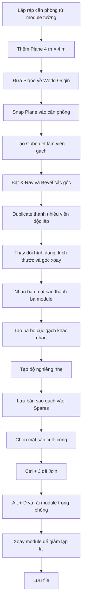

# 036 — Creating the Floor Modules

| Thuộc tính       | Nội dung                           |
| ---------------- | ---------------------------------- |
| **Module**       | Module 02 — Modular Dungeon        |
| **Bài học**      | Creating the Floor Modules         |
| **Thời lượng**   | 11:41                              |
| **Chủ đề chính** | Tạo module sàn và các mảnh gạch vỡ |

---

## 1. Mục tiêu bài học

Sau bài học này, bạn có thể:

* Ghép các module tường thành một căn phòng thử nghiệm.
* Sử dụng **Linked Duplicate** để lắp ráp scene nhanh hơn.
* Dùng `Shift + R` để lặp lại thao tác vừa thực hiện.
* Tạo một module sàn kích thước **4 m × 4 m**.
* Đưa object về World Origin bằng cách xóa giá trị Location.
* Tạo các mảnh gạch vỡ từ Cube dẹt.
* Dùng `Ctrl + B` để tạo các góc gạch bị sứt mẻ.
* Tạo nhiều biến thể gạch bằng `Shift + D`.
* Giữ nguyên độ dày khi scale bằng `S, Shift + Z`.
* Tạo ba module sàn có bố cục gạch vỡ khác nhau.
* Lưu các object dự phòng trong collection **Spares**.
* Join các mảnh gạch với mặt sàn nhưng vẫn giữ đúng Origin để snapping.
* Rải các module sàn trong căn phòng, xoay chúng để giảm cảm giác lặp lại.

---

## 2. Kết quả cuối cùng

Bài học tạo ra hai loại module chính:

1. **Module sàn trống** — một Plane phẳng kích thước `4 m × 4 m`.
2. **Module sàn có gạch vỡ** — mặt sàn cơ bản kết hợp với nhiều mảnh đá nhỏ nằm phía trên.

```text
Module sàn trống             Module có gạch vỡ

┌──────────────┐             ┌──────────────┐
│              │             │   ▱      ▰   │
│              │             │      ▱       │
│              │             │  ▰       ▱   │
│              │             │       ▰      │
└──────────────┘             └──────────────┘
```

Khi được sắp xếp và xoay theo nhiều hướng, các module tạo thành một mặt sàn dungeon có độ biến thiên tự nhiên hơn.

---

# Phần A — Dựng căn phòng thử nghiệm

## 3. Tại sao cần dựng một căn phòng trước?

Trước khi tạo module sàn, nên lắp ráp một căn phòng nhỏ để:

* Kiểm tra kích thước các module.
* Quan sát cách sàn khớp với tường.
* Biết cần bao nhiêu module sàn.
* Kiểm tra độ lặp lại của các mảnh gạch vỡ.
* Có môi trường trực quan để bố trí các biến thể.

Căn phòng có thể sử dụng bất kỳ module tường và cột nào đã tạo ở các bài trước.

---

## 4. Nhân bản các module tường

Chuyển sang Top View:

```text
Numpad 7
```

Tạo Linked Duplicate:

```text
Alt + D
```

Di chuyển object vào vị trí bằng snapping:

```text
Alt + D → di chuyển → giữ Ctrl → Left Click
```

Ngoài việc giữ `Ctrl`, có thể bật Snapping trên thanh công cụ để các object tự động bám vào lưới.

### Linked Duplicate và Duplicate thông thường

| Lệnh        | Loại bản sao     | Khi chỉnh sửa mesh                 |
| ----------- | ---------------- | ---------------------------------- |
| `Shift + D` | Bản sao độc lập  | Chỉ object đang chỉnh sửa thay đổi |
| `Alt + D`   | Bản sao liên kết | Các bản sao cùng dùng chung mesh   |

Với module tường, `Alt + D` phù hợp vì các đoạn tường nên duy trì cùng một hình học.

---

## 5. Xoay module để tạo góc phòng

Để xoay một đoạn tường quanh góc:

```text
R → 90 → Enter
```

Trong Top View, thao tác này xoay object `90°` quanh trục `Z`.

Để đảo hướng module:

```text
R → 180 → Enter
```

Ví dụ quy trình tạo một góc:

```text
Chọn module tường
       ↓
Alt + D
       ↓
Di chuyển và snap
       ↓
R → 90
       ↓
Hình thành góc phòng
```

---

## 6. Lặp lại thao tác bằng Shift + R

Nếu thao tác cuối cùng là nhân bản rồi di chuyển một module theo một khoảng cố định, có thể lặp lại toàn bộ thao tác đó bằng:

```text
Shift + R
```

Ví dụ:

```text
Alt + D → X → di chuyển 4 m
Shift + R
Shift + R
Shift + R
```

Các đoạn tường sẽ được tiếp tục nhân bản theo đúng khoảng cách trước đó.

> `Shift + R` chỉ lặp lại thao tác gần nhất. Nếu bạn chọn object khác hoặc thực hiện một lệnh mới, thao tác cần lặp sẽ bị thay thế.

---

## 7. Bố trí căn phòng

Căn phòng trong bài học gồm:

* Các đoạn tường nối tiếp nhau.
* Nhiều loại cột khác nhau để tạo biến thể.
* Hai cửa ra vào.
* Không gian đủ lớn để thử nhiều module sàn.

Sơ đồ minh họa:

```text
              Cửa ra vào
                  ↓
┌──────┬──────┬──────────┬──────┐
│      │      │          │      │
│                              │
│                              │
│                              │
│                              │
│      │      │          │      │
└──────┴──────┴─────  ───┴──────┘
                      ↑
                 Cửa ra vào
```

Không bắt buộc phải đặt cửa giống hệt bài giảng, nhưng căn phòng cần đủ rộng để quan sát sự phân bố của các module sàn.

---

# Phần B — Tạo module sàn cơ bản

## 8. Thêm Plane làm mặt sàn

Quay lại **Layout Workspace**, sau đó chuyển sang Top View:

```text
Numpad 7
```

Thêm Plane:

```text
Shift + A → Mesh → Plane
```

Trong bảng tùy chọn ngay sau khi thêm Plane, đặt kích thước:

```text
Size = 4 m
```

Kết quả là một mặt sàn:

```text
4 m × 4 m
```

Kích thước này được lựa chọn để khớp với hệ thống module tường và grid của dungeon.

---

## 9. Vấn đề vị trí của 3D Cursor

Object mới luôn được tạo tại vị trí của **3D Cursor**.

Nếu 3D Cursor không nằm ở World Origin, Plane có thể xuất hiện lệch khỏi lưới. Khi đó, dù bật snapping, tâm object vẫn giữ một khoảng lệch so với các giao điểm grid.

```text
3D Cursor bị lệch
        ↓
Plane được tạo ở vị trí lệch
        ↓
Origin của Plane không khớp grid
        ↓
Snapping trở nên khó căn chính xác
```

---

## 10. Đưa 3D Cursor về World Origin

Có thể đưa 3D Cursor về gốc tọa độ bằng:

```text
Shift + S → Cursor to World Origin
```

Sau đó, mọi object mới được thêm sẽ xuất hiện tại:

```text
X = 0
Y = 0
Z = 0
```

---

## 11. Xóa giá trị Location của Plane

Nếu Plane đã được tạo, không nhất thiết phải xóa và tạo lại.

Mở Sidebar:

```text
N
```

Trong:

```text
Item → Transform → Location
```

Chọn ba giá trị `X`, `Y`, `Z`, sau đó nhập:

```text
0
```

Kết quả:

```text
Location X = 0
Location Y = 0
Location Z = 0
```

Đây không phải là Apply Transform. Thao tác này **xóa vị trí dịch chuyển**, đưa object trở lại World Origin.

### Phân biệt hai thao tác

| Thao tác              | Kết quả                                                             |
| --------------------- | ------------------------------------------------------------------- |
| Đặt Location về `0`   | Đưa object về gốc tọa độ                                            |
| `Ctrl + A → Location` | Giữ object ở nguyên vị trí nhưng đặt vị trí đó thành tọa độ gốc mới |

Trong bài này cần **đặt Location về `0`**, không phải Apply Location.

---

## 12. Đặt module sàn vào căn phòng

Sau khi Plane nằm đúng grid:

1. Chuyển sang Top View.
2. Bật Snapping.
3. Nhấn `G`.
4. Di chuyển Plane vào một góc của căn phòng.
5. Nhấp chuột trái để xác nhận.

```text
Plane tại World Origin
        ↓
Bật Snapping
        ↓
G để di chuyển
        ↓
Đặt vào góc phòng
```

Module sàn bây giờ khớp với kích thước và vị trí của các module tường.

---

# Phần C — Tạo các mảnh gạch vỡ

## 13. Tạo mảnh gạch đầu tiên

Đưa 3D Cursor về World Origin nếu cần:

```text
Shift + S → Cursor to World Origin
```

Thêm Cube:

```text
Shift + A → Mesh → Cube
```

Scale Cube mỏng theo trục `Z`:

```text
S → Z
```

Tiếp tục thu nhỏ toàn bộ Cube để tạo một mảnh gạch nhỏ:

```text
S
```

Hình dạng ban đầu:

```text
Cube mặc định              Mảnh gạch dẹt

┌─────────┐                ┌─────────┐
│         │                └─────────┘
│         │
│         │
└─────────┘
```

Mảnh gạch nên:

* Có độ dày nhỏ.
* Nhỏ hơn nhiều so với module sàn.
* Không cần có kích thước hoàn toàn chính xác.
* Có tỷ lệ hơi bất quy tắc để phù hợp với dungeon.

---

## 14. Chỉnh sửa gạch trong X-Ray Mode

Vào Edit Mode:

```text
Tab
```

Chuyển sang Top View:

```text
Numpad 7
```

Bật X-Ray:

```text
Alt + Z
```

Hoặc nhấn biểu tượng X-Ray trên thanh Viewport.

### Tại sao cần X-Ray?

Mảnh gạch vẫn là một Cube có mặt trên và mặt dưới. Nếu chỉ chọn cạnh nhìn thấy, bạn có thể bỏ sót cạnh nằm phía dưới.

X-Ray cho phép chọn xuyên qua toàn bộ object:

```text
Không bật X-Ray          Bật X-Ray

Chỉ chọn cạnh trên       Chọn cả cạnh trên và dưới
        ↓                         ↓
Mesh có thể bị lệch      Hình dạng giữ thẳng đứng
```

---

## 15. Tạo góc gạch bị sứt bằng Bevel

Chuyển sang Edge Select:

```text
2
```

Box Select một cạnh dọc tại góc viên gạch, sau đó dùng:

```text
Ctrl + B
```

Kéo chuột để cắt vát góc.

Lặp lại với nhiều góc khác nhau:

```text
Góc 1 → Bevel nhỏ
Góc 2 → Bevel lớn
Góc 3 → Bevel vừa
Góc 4 → Bevel bất đối xứng
```

Kết quả:

```text
Trước Bevel               Sau Bevel

┌────────────┐             ╱───────────╲
│            │            │             ╲
│            │            │             │
└────────────┘             ╲────────────╱
```

Không nên bevel tất cả các góc giống nhau. Độ lệch khác nhau giúp viên gạch có cảm giác bị vỡ tự nhiên hơn.

---

## 16. Điều chỉnh thủ công các đỉnh

Sau khi Bevel, có thể chọn một nhóm đỉnh và di chuyển bằng:

```text
G
```

Nếu Snapping đang làm việc chỉnh sửa trở nên khó khăn, hãy tắt Snapping trước.

Có thể chuyển sang Vertex Select để dễ quan sát hơn:

```text
1
```

Sau đó Box Select cả đỉnh trên và dưới của một góc:

```text
B → kéo vùng chọn
```

Di chuyển chúng:

```text
G
```

Cách này giúp:

* Làm một cạnh nghiêng hơn.
* Kéo dài hoặc thu ngắn một góc.
* Tạo silhouette bất đối xứng.
* Tránh hình dạng quá vuông vức.

---

# Phần D — Tạo nhiều biến thể gạch

## 17. Sử dụng Shift + D thay vì Alt + D

Để tạo một mảnh gạch mới dựa trên mảnh đầu tiên:

```text
Shift + D
```

Không nên dùng `Alt + D` trong trường hợp này.

### Lý do

Các viên gạch cần có hình dạng riêng biệt. Nếu dùng Linked Duplicate, chỉnh sửa một viên sẽ làm các viên liên kết thay đổi theo.

| Lệnh        | Phù hợp với                        |
| ----------- | ---------------------------------- |
| `Alt + D`   | Module tường giống nhau            |
| `Shift + D` | Các viên gạch cần chỉnh hình riêng |

---

## 18. Thay đổi hình dạng từng viên

Sau khi Duplicate:

1. Di chuyển viên gạch sang bên cạnh.
2. Vào Edit Mode.
3. Bật X-Ray.
4. Chọn các đỉnh hoặc cạnh.
5. Di chuyển chúng để tạo silhouette mới.

```text
Shift + D
    ↓
Di chuyển
    ↓
Tab vào Edit Mode
    ↓
Chỉnh các góc
    ↓
Tạo viên gạch khác biệt
```

---

## 19. Scale mà không thay đổi độ dày

Khi scale mảnh gạch theo chiều ngang, cần giữ nguyên độ dày trên trục `Z`.

Sử dụng:

```text
S → Shift + Z
```

Thao tác này scale theo `X` và `Y`, nhưng loại trừ trục `Z`.

```text
S
↓
Thay đổi X, Y và Z
↓
Gạch có thể mỏng hoặc dày hơn

S → Shift + Z
↓
Chỉ thay đổi X và Y
↓
Giữ nguyên độ dày
```

Đây là thao tác quan trọng để tất cả các viên gạch có cùng độ dày.

---

## 20. Tạo các kiểu gạch khác nhau

Có thể biến đổi các bản sao bằng nhiều cách:

### Gạch lớn

```text
Shift + D
S → Shift + Z
```

Scale rộng hơn theo cả `X` và `Y`.

### Gạch dài và hẹp

```text
Shift + D
S → X
```

Hoặc:

```text
S → Y
```

### Gạch xoay chéo

```text
R
```

### Gạch có góc vỡ lớn

Vào Edit Mode và Bevel một góc mạnh hơn:

```text
Ctrl + B
```

### Gạch bất đối xứng

Chọn các đỉnh riêng lẻ rồi dùng:

```text
G
```

Một nhóm gạch cơ bản có thể gồm khoảng 4–6 mảnh với kích thước và hình dạng khác nhau.

---

# Phần E — Tạo module sàn có gạch vỡ

## 21. Nhân bản mặt sàn cơ bản

Chọn module sàn trống và tạo một bản sao độc lập:

```text
Shift + D → X → -4 → Enter
```

Mặt sàn mới được đặt cách mặt sàn cũ `4 m` theo trục `X`.

Dùng `Shift + D`, không dùng `Alt + D`, vì mỗi module sau đó sẽ được join với một nhóm gạch khác nhau.

---

## 22. Đặt các viên gạch lên mặt sàn

Chọn toàn bộ các viên gạch nhưng bỏ chọn mặt sàn.

Di chuyển nhóm gạch:

```text
G
```

Đặt chúng phía trên module sàn.

Nếu Transform Pivot Point đang đặt là **Individual Origins**, hãy đổi về:

```text
Median Point
```

### Khác biệt giữa hai Pivot Point

| Pivot Point            | Khi Rotate/Scale                 |
| ---------------------- | -------------------------------- |
| **Individual Origins** | Mỗi viên tự xoay quanh tâm riêng |
| **Median Point**       | Cả nhóm xoay quanh tâm chung     |

Để xoay toàn bộ nhóm gạch như một bố cục thống nhất, dùng **Median Point**.

```text
Chọn nhóm gạch
      ↓
Pivot Point: Median Point
      ↓
R để xoay cả bố cục
      ↓
G để đặt vào giữa module
```

---

## 23. Giữ lại bản sao trước khi Join

Trước khi join các viên gạch với mặt sàn, nên tạo một bản sao của nhóm gạch để tiếp tục chỉnh sửa.

Chọn toàn bộ các viên gạch:

```text
Shift + D → X → -4
```

Nhóm mới được đặt sang bên cạnh.

Lợi ích:

* Giữ nguyên nhóm gạch gốc.
* Có thể nhanh chóng tạo bố cục mới.
* Không cần dựng lại từng mảnh.
* Dễ tạo thêm module sàn về sau.

---

# Phần F — Tạo ba bố cục sàn khác nhau

## 24. Biến thể thứ nhất

Bố cục đầu tiên có thể đặt các viên gạch tương đối tập trung gần giữa mặt sàn.

```text
┌──────────────┐
│              │
│    ▱   ▰     │
│      ▰  ▱    │
│    ▱         │
│              │
└──────────────┘
```

Nên thay đổi:

* Hướng xoay.
* Kích thước.
* Khoảng cách giữa các viên.
* Hình dạng từng mảnh.

---

## 25. Biến thể thứ hai

Từ nhóm gạch đã Duplicate:

* Scale một số viên theo `Y`.
* Di chuyển các góc trong Edit Mode.
* Xoay các viên theo hướng khác.
* Thay đổi vị trí từng viên.
* Đặt một số viên lệch khỏi trung tâm.

```text
┌──────────────┐
│  ▱           │
│       ▰      │
│    ▱         │
│          ▰   │
│       ▱      │
└──────────────┘
```

Bố cục này nên khác rõ ràng với bố cục thứ nhất.

---

## 26. Biến thể thứ ba

Duplicate nhóm gạch thêm một lần:

```text
Shift + D → X → -4
```

Sau đó:

* Xóa bớt một vài viên.
* Scale nhỏ một số viên.
* Đặt gạch rải rác hơn.
* Tránh sắp xếp thành hàng.
* Tránh để khoảng cách giữa các viên quá đều nhau.

```text
┌──────────────┐
│         ▰    │
│              │
│   ▱          │
│        ▱     │
│              │
└──────────────┘
```

Biến thể này có thể có ít gạch hơn để tạo những vùng sàn tương đối trống.

---

## 27. Nguyên tắc tạo sự ngẫu nhiên

Một bố cục tự nhiên nên thay đổi ít nhất bốn yếu tố:

```text
Vị trí
  +
Góc xoay
  +
Kích thước
  +
Hình dạng
  =
Bố cục ít lặp lại
```

### Nên tránh

* Các viên nằm trên một đường thẳng.
* Khoảng cách giữa các viên bằng nhau.
* Tất cả viên cùng kích thước.
* Tất cả viên cùng hướng.
* Tất cả bố cục đều nằm giữa module.
* Mỗi module có cùng số lượng viên.

### Nên áp dụng

* Một số module có nhiều gạch.
* Một số module có ít gạch.
* Có viên lớn và viên nhỏ.
* Có bố cục nằm giữa và bố cục lệch sang cạnh.
* Có một vài viên nằm tách khỏi nhóm chính.

---

## 28. Tạo độ nghiêng nhẹ cho các viên gạch

Để gạch không nằm hoàn toàn phẳng, có thể xoay nhẹ một số viên theo nhiều hướng.

Chọn một viên và dùng:

```text
R
```

Khi nhìn từ góc phối cảnh, xoay sao cho một cạnh hơi nhô lên.

Có thể thay đổi góc nhìn để trục xoay dễ kiểm soát hơn.

```text
Mặt sàn phẳng             Gạch nghiêng nhẹ

──────────────            ─────╱────────
                              ↑
                       Một cạnh nhô lên
```

Độ nghiêng chỉ nên rất nhỏ. Nếu xoay quá mạnh, viên gạch sẽ trông như đang lơ lửng hoặc cắm sâu vào sàn.

---

# Phần G — Lưu các mảnh gạch vào Spares

## 29. Tại sao cần giữ bản sao dự phòng?

Sau khi Join, các viên gạch và mặt sàn sẽ trở thành một object. Việc chỉnh sửa hoặc tái sử dụng từng viên riêng lẻ sẽ khó hơn.

Vì vậy, trước khi Join:

1. Chọn toàn bộ các nhóm gạch.
2. Duplicate chúng.
3. Di chuyển bản sao ra ngoài khu vực làm việc.
4. Chuyển chúng vào collection **Spares**.

Ví dụ:

```text
Shift + D → Y → -4
```

Sau đó dùng Outliner hoặc lệnh chuyển Collection để đưa chúng vào:

```text
Spares
```

Collection này có thể được ẩn khi không sử dụng.

---

## 30. Tổ chức collection

Cấu trúc Outliner có thể như sau:

```text
Scene Collection
├── Walls
├── Doors
├── Pillars
├── Floor Modules
└── Spares
    └── Floor Tiles
```

Nếu project lớn hơn, có thể tạo thêm collection con:

```text
Spares
└── Floor Tiles
```

Điều này giúp dễ tìm lại các viên gạch gốc khi cần tạo thêm module.

---

# Phần H — Join gạch với mặt sàn

## 31. Active Object là gì?

Khi chọn nhiều object, Blender phân biệt:

* **Selected Objects**: tất cả object đang được chọn.
* **Active Object**: object được chọn cuối cùng, thường có viền sáng hơn.

Khi dùng:

```text
Ctrl + J
```

Các object khác sẽ được join vào **Active Object**.

Một số thuộc tính của object kết quả được lấy từ Active Object, gồm:

* Tên object.
* Origin.
* Một số thiết lập object.
* Modifier hoặc vật liệu tùy trường hợp.

---

## 32. Vì sao phải chọn mặt sàn cuối cùng?

Mặt sàn có Origin nằm đúng vị trí để snapping theo grid.

Nếu chọn một viên gạch cuối cùng, object sau khi Join có thể sử dụng Origin của viên gạch đó. Khi ấy, module sàn sẽ khó căn chính xác vào dungeon.

Quy trình đúng:

1. Chọn tất cả các viên gạch.
2. Giữ `Shift`.
3. Nhấp vào mặt sàn để chọn nó cuối cùng.
4. Kiểm tra mặt sàn là Active Object.
5. Nhấn:

```text
Ctrl + J
```

```text
Các viên gạch được chọn
        ↓
Shift + Click mặt sàn
        ↓
Mặt sàn trở thành Active Object
        ↓
Ctrl + J
        ↓
Module giữ Origin của mặt sàn
```

---

## 33. Trường hợp không có Active Object

Nếu chọn nhiều object bằng Box Select, đôi khi Blender không xác định rõ object nào là Active Object.

Khi đó:

```text
Shift + Click một object
```

để đặt object đó thành Active Object.

Trong bài này, object cần chọn cuối cùng là **mặt sàn**.

Lặp lại quy trình cho cả ba module:

```text
Nhóm gạch 1 + Floor 1 → Ctrl + J
Nhóm gạch 2 + Floor 2 → Ctrl + J
Nhóm gạch 3 + Floor 3 → Ctrl + J
```

---

# Phần I — Rải module sàn trong căn phòng

## 34. Đưa module vào vị trí

Tắt X-Ray nếu đang bật:

```text
Alt + Z
```

Chuyển sang Top View:

```text
Numpad 7
```

Bật Snapping và di chuyển từng module:

```text
G
```

Đặt chúng vào các ô lưới bên trong căn phòng.

---

## 35. Sử dụng Linked Duplicate cho module hoàn chỉnh

Sau khi module đã hoàn thiện, có thể dùng:

```text
Alt + D
```

để tạo các bản sao liên kết.

Các bản sao này cùng dùng một mesh, giúp:

* Tiết kiệm bộ nhớ.
* Chỉnh sửa đồng bộ.
* Dễ thay đổi toàn bộ loại module.
* Phù hợp với hệ thống modular.

Có thể kết hợp:

```text
Alt + D → G → đặt vào grid
```

---

## 36. Xoay module để tạo thêm biến thể

Ngay cả khi dùng cùng một module, chỉ cần xoay nó cũng tạo ra cảm giác khác.

```text
R → 90
R → 180
R → 270
```

Ví dụ một module có thể xuất hiện theo bốn hướng:

```text
0°          90°         180°        270°

▱   ▰       ▰            ▱        ▰   ▱
  ▱         ▱  ▱       ▰             ▰
```

Nhờ đó, ba module có gạch vỡ có thể tạo ra nhiều bố cục thị giác hơn mà không cần dựng thêm nhiều mesh mới.

---

## 37. Kết hợp module trống và module có gạch

Không nên phủ mọi ô sàn bằng gạch vỡ. Hãy xen kẽ:

* Module trống.
* Module có nhiều gạch.
* Module có ít gạch.
* Module được xoay `90°`.
* Module được xoay `180°`.

Ví dụ:

```text
┌──────┬──────┬──────┬──────┐
│ Trống│ Gạch │ Trống│ Gạch │
├──────┼──────┼──────┼──────┤
│ Gạch │ Trống│ Gạch │ Trống│
├──────┼──────┼──────┼──────┤
│ Trống│ Gạch │ Gạch │ Trống│
└──────┴──────┴──────┴──────┘
```

Mục tiêu là tạo độ ngẫu nhiên có kiểm soát, không phải rải gạch đều trên toàn bộ mặt sàn.

---

## 38. Quy trình tổng quát



---

## 39. Phím tắt và công cụ quan trọng

| Phím tắt/Công cụ     | Chức năng                            |
| -------------------- | ------------------------------------ |
| `Numpad 7`           | Top View                             |
| `Shift + A`          | Thêm object                          |
| `Alt + D`            | Tạo Linked Duplicate                 |
| `Shift + D`          | Tạo bản sao độc lập                  |
| `Shift + R`          | Lặp lại thao tác gần nhất            |
| `R, 90`              | Xoay `90°`                           |
| `R, 180`             | Xoay `180°`                          |
| `G`                  | Di chuyển                            |
| `S`                  | Scale                                |
| `S, Z`               | Scale theo trục Z                    |
| `S, X`               | Scale theo trục X                    |
| `S, Y`               | Scale theo trục Y                    |
| `S, Shift + Z`       | Scale theo X và Y, giữ nguyên độ dày |
| `Tab`                | Chuyển Object Mode/Edit Mode         |
| `1`                  | Vertex Select                        |
| `2`                  | Edge Select                          |
| `Ctrl + B`           | Bevel cạnh                           |
| `Alt + Z`            | Bật/tắt X-Ray                        |
| `Shift + S`          | Mở Snap Pie Menu                     |
| `Ctrl + J`           | Join các object                      |
| `N`                  | Mở Sidebar                           |
| `0` trong Location   | Đưa object về gốc tọa độ             |
| `Ctrl` khi di chuyển | Tạm thời snap vào lưới               |
| Snapping             | Bật chế độ bám lưới liên tục         |

---

## 40. Lưu ý và lỗi thường gặp

### 40.1. Plane không bám đúng vào grid

**Nguyên nhân:** Plane được tạo tại một 3D Cursor đang bị lệch.

**Cách khắc phục:**

```text
Shift + S → Cursor to World Origin
```

Hoặc đặt Location của Plane về:

```text
X = 0
Y = 0
Z = 0
```

---

### 40.2. Dùng Alt + D khi tạo các viên gạch

**Nguyên nhân:** Nhầm Linked Duplicate với Duplicate độc lập.

Nếu dùng `Alt + D`, chỉnh Edit Mode trên một viên có thể làm tất cả viên liên kết thay đổi.

**Cách khắc phục:**

```text
Dùng Shift + D cho các viên gạch cần hình dạng khác nhau
```

---

### 40.3. Scale làm viên gạch mỏng hơn

**Nguyên nhân:** Dùng `S` nên scale cả trục `Z`.

**Cách khắc phục:**

```text
S → Shift + Z
```

Thao tác này giữ nguyên độ dày.

---

### 40.4. Chỉ chỉnh được mặt trên của viên gạch

**Nguyên nhân:** Chưa bật X-Ray nên các đỉnh hoặc cạnh phía dưới không được chọn.

**Cách khắc phục:**

```text
Alt + Z
```

Sau đó Box Select xuyên qua toàn bộ viên gạch.

---

### 40.5. Bevel tạo quá nhiều cạnh

**Nguyên nhân:** Con lăn chuột đã tăng số Segments trong lúc Bevel.

Với gạch vỡ low-poly, thường chỉ cần một đoạn vát đơn giản.

Có thể giảm:

```text
Segments = 1
```

---

### 40.6. Các viên gạch trông quá đồng đều

**Nguyên nhân:**

* Cùng kích thước.
* Cùng hướng.
* Cùng số lượng trên mỗi module.
* Đều nằm giữa mặt sàn.
* Khoảng cách giống nhau.

**Cách khắc phục:** Thay đổi đồng thời vị trí, góc xoay, kích thước và hình dạng.

---

### 40.7. Module bị sai Origin sau khi Join

**Nguyên nhân:** Viên gạch được chọn cuối cùng nên trở thành Active Object.

**Cách khắc phục:**

1. Chọn các viên gạch.
2. `Shift + Click` mặt sàn.
3. Đảm bảo mặt sàn là Active Object.
4. Nhấn `Ctrl + J`.

---

### 40.8. Không thể xoay cả nhóm quanh tâm chung

**Nguyên nhân:** Pivot Point đang là **Individual Origins**.

**Cách khắc phục:**

```text
Transform Pivot Point → Median Point
```

---

### 40.9. Gạch bị chìm hoặc lơ lửng

**Nguyên nhân:** Vị trí hoặc góc xoay theo trục ngang quá lớn.

**Cách khắc phục:**

* Quan sát từ Side View hoặc Perspective View.
* Chỉ xoay nhẹ.
* Bảo đảm phần lớn đáy gạch vẫn tiếp xúc với mặt sàn.

---

### 40.10. Mất các viên gạch gốc sau khi Join

**Nguyên nhân:** Không tạo bản sao dự phòng.

**Cách khắc phục:** Trước khi Join, Duplicate các nhóm gạch và chuyển chúng vào collection `Spares`.

---

## 41. Checklist thực hành

### Căn phòng thử nghiệm

* [ ] Đã dùng các module tường để tạo một căn phòng.
* [ ] Đã sử dụng `Alt + D` cho các bản sao liên kết.
* [ ] Đã bật Snapping hoặc giữ `Ctrl` khi di chuyển.
* [ ] Đã sử dụng `R, 90` và `R, 180` để tạo góc.
* [ ] Đã thử `Shift + R` để lặp lại thao tác.

### Module sàn

* [ ] Đã tạo Plane kích thước `4 m × 4 m`.
* [ ] Đã đưa Plane về đúng World Origin.
* [ ] Đã snap module sàn vào grid của căn phòng.
* [ ] Đã giữ một module sàn trống.

### Mảnh gạch vỡ

* [ ] Đã tạo gạch từ Cube dẹt.
* [ ] Đã bật X-Ray trước khi chỉnh các góc.
* [ ] Đã dùng `Ctrl + B` để tạo góc sứt.
* [ ] Đã dùng `Shift + D` để tạo các viên độc lập.
* [ ] Đã giữ nguyên độ dày bằng `S, Shift + Z`.
* [ ] Đã tạo nhiều hình dạng và kích thước khác nhau.
* [ ] Đã xoay nhẹ một số viên để tạo độ lồi lõm.

### Các biến thể module

* [ ] Đã tạo ít nhất ba module có gạch vỡ.
* [ ] Mỗi module có bố cục khác biệt rõ ràng.
* [ ] Có module nhiều gạch và module ít gạch.
* [ ] Các viên không được sắp xếp quá đều.
* [ ] Đã lưu bản sao gạch vào collection `Spares`.

### Join và lắp ráp

* [ ] Đã chọn mặt sàn cuối cùng trước khi Join.
* [ ] Đã dùng `Ctrl + J` để tạo module hoàn chỉnh.
* [ ] Origin của module vẫn nằm đúng vị trí snapping.
* [ ] Đã dùng `Alt + D` để nhân bản module hoàn chỉnh.
* [ ] Đã xoay module `90°` hoặc `180°` để tạo thêm biến thể.
* [ ] Đã kết hợp module trống và module có gạch.
* [ ] Đã lưu file trước khi kết thúc bài học.

---

## 42. Bài tập thực hành

### Bài tập cơ bản

Tạo:

* Một module sàn trống.
* Ba module sàn có gạch vỡ.
* Mỗi module sử dụng từ 3–6 mảnh gạch.
* Ít nhất ba hình dạng gạch khác nhau.

### Bài tập mở rộng

Tạo thêm các biến thể:

* Một module chỉ có một mảnh gạch lớn.
* Một module có nhiều mảnh nhỏ tập trung gần góc.
* Một module có đường gạch vỡ dẫn về phía cửa.
* Một module gần như trống, chỉ có hai mảnh nhỏ.
* Một module có các viên gạch nhô lên ở độ cao khác nhau.

### Yêu cầu

* Không để hai module có bố cục giống hệt nhau.
* Không thay đổi độ dày gạch khi scale.
* Giữ Origin của module sàn ở đúng vị trí grid.
* Sử dụng Linked Duplicate khi rải module trong scene.

---

## 43. Tóm tắt

Bài học bắt đầu bằng việc sử dụng các module tường đã có để dựng một căn phòng thử nghiệm. Các đoạn tường được nhân bản bằng `Alt + D`, căn chỉnh bằng Snapping và xoay bằng `R, 90` hoặc `R, 180`. Lệnh `Shift + R` giúp lặp lại thao tác nhân bản và di chuyển trên những đoạn tường dài.

Module sàn được tạo từ một Plane có kích thước:

```text
4 m × 4 m
```

Plane cần nằm đúng World Origin để có thể snap chính xác vào grid.

Các mảnh gạch vỡ được tạo từ Cube dẹt. Trong Edit Mode, X-Ray được bật để chọn cả phần trên và dưới của mesh. Các góc được làm sứt bằng `Ctrl + B`, sau đó nhiều bản sao độc lập được tạo bằng `Shift + D`.

Khi thay đổi kích thước viên gạch, sử dụng:

```text
S → Shift + Z
```

để giữ nguyên độ dày.

Ba nhóm gạch có bố cục khác nhau được đặt lên ba module sàn. Trước khi Join, một bản sao của các viên gạch được lưu trong collection `Spares`. Khi Join, mặt sàn phải được chọn cuối cùng để giữ đúng Origin:

```text
Chọn các viên gạch
        ↓
Shift + Click mặt sàn
        ↓
Ctrl + J
```

Cuối cùng, các module được rải trong căn phòng bằng `Alt + D` và xoay theo nhiều hướng. Việc kết hợp module trống, module có nhiều gạch, module có ít gạch và các góc xoay khác nhau giúp mặt sàn dungeon bớt đơn điệu và trông tự nhiên hơn.
