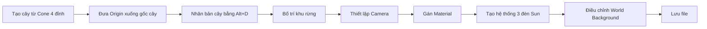
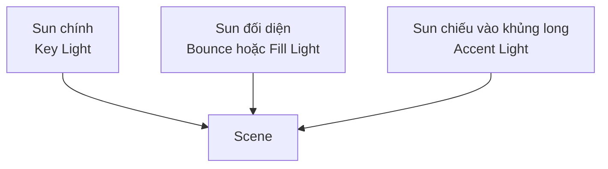

# 049 — Trees, Lights & Colours

| Thuộc tính       | Nội dung                                              |
| ---------------- | ----------------------------------------------------- |
| **Module**       | Module 03 — Low-Poly Dinosaur                         |
| **Bài học**      | Trees, Lights & Colours                               |
| **Thời lượng**   | 11:33                                                 |
| **Chủ đề chính** | Tạo cây, bố cục camera, vật liệu, ánh sáng và màu nền |

---

## 1. Mục tiêu bài học

Sau bài học này, chúng ta có thể:

* Tạo cây low-poly đơn giản từ một khối **Cone 4 đỉnh**.
* Điều chỉnh **Object Origin** để cây scale từ phần gốc.
* Dùng **Alt+D — Linked Duplicate** để tạo một khu rừng nhỏ.
* Sắp xếp camera theo nguyên tắc **Rule of Thirds**.
* Gán vật liệu màu cơ bản cho cây, khủng long và núi.
* Thiết lập hệ thống ánh sáng gồm:

  * Key Light.
  * Bounce/Fill Light.
  * Light chiếu bổ sung vào khủng long.
* Điều chỉnh **World Background** để tạo bầu không khí cho cảnh.

---

## 2. Tổng quan quy trình



---

# 3. Tạo cây low-poly

## 3.1. Hình dạng của cây

Cây trong bài học được tạo rất đơn giản:

* Không có thân cây riêng.
* Không cần ghép Cylinder và Cone.
* Toàn bộ cây là một khối **Cone kéo dài**, có hình dạng giống kim tự tháp.

Thao tác:

1. Nhấn `Shift + A`.
2. Chọn:

```text
Mesh → Cone
```

3. Trong bảng **Add Cone**, giảm:

```text
Vertices = 4
```

Khi Cone chỉ có 4 đỉnh, nó sẽ trở thành một khối kim tự tháp vuông.

4. Nhấn:

```text
S → Z
```

để kéo cây cao theo trục Z.

5. Nhấn:

```text
G → Z
```

để đưa cây lên trên bề mặt địa hình.

---

## 3.2. Di chuyển Object Origin xuống gốc cây

Theo mặc định, Object Origin nằm ở giữa khối Cone.

Điều này khiến cây scale từ tâm:

```text
        ↑
     mở rộng
       /\
      /  \
-----●-----  Origin ở giữa
    /    \
   /______\
```

Trong khi đó, ta muốn cây scale từ phần gốc:

```text
       /\
      /  \
     /    \
    /______\
        ●      Origin ở đáy
```

### Cách thực hiện trong bài

1. Chọn cây.
2. Nhấn `Tab` để vào **Edit Mode**.
3. Nhấn `A` để chọn toàn bộ mesh.
4. Nhấn:

```text
G → Z
```

5. Di chuyển toàn bộ mesh lên trên, trong khi Object Origin vẫn giữ nguyên vị trí.

6. Nhấn `Tab` để quay về **Object Mode**.

> Nếu xuất hiện vòng tròn ảnh hưởng lớn khi di chuyển, có thể **Proportional Editing** đang được bật. Nhấn `O` để tắt.

---

## 3.3. Điều chỉnh chiều cao cây

Sau khi Object Origin nằm ở gốc, ta có thể dùng:

```text
S → Z
```

để thay đổi chiều cao cây mà không làm phần gốc bị dịch chuyển khỏi mặt đất.

Chiều cao cây trong bài được đặt gần tương đương hoặc cao hơn khủng long một chút.

---

# 4. Tạo khu rừng bằng Linked Duplicate

## 4.1. Tạo biến thể đầu tiên

Chuyển sang góc nhìn từ trên xuống:

```text
Numpad 7
```

Nhân bản cây bằng:

```text
Alt + D
```

Sau đó thay đổi nhẹ:

* Vị trí.
* Góc xoay.
* Chiều cao.
* Kích thước tổng thể.

Ví dụ:

```text
Alt + D
R
S
```

Điều này giúp các cây không hoàn toàn giống nhau.

---

## 4.2. Tại sao dùng Alt+D?

| Phím tắt    | Loại bản sao     | Đặc điểm                        |
| ----------- | ---------------- | ------------------------------- |
| `Shift + D` | Duplicate        | Tạo mesh độc lập                |
| `Alt + D`   | Linked Duplicate | Các object dùng chung mesh data |

Với `Alt + D`:

* Các cây có thể có vị trí, góc xoay và scale khác nhau.
* Khi chỉnh sửa mesh gốc trong Edit Mode, các cây liên kết cũng thay đổi.
* Tiết kiệm bộ nhớ hơn khi tạo nhiều object giống nhau.

---

## 4.3. Xoay nhiều cây theo từng tâm riêng

Sau khi chọn nhiều cây, đổi **Transform Pivot Point** thành:

```text
Individual Origins
```

Khi đó, mỗi cây sẽ xoay quanh Object Origin của chính nó thay vì xoay quanh tâm chung của cả nhóm.

```text
Median Point:
      ↺
  🌲 🌲 🌲
  Cả nhóm xoay quanh một tâm

Individual Origins:
  ↺   ↺   ↺
  🌲  🌲  🌲
  Mỗi cây xoay riêng
```

---

## 4.4. Rải cây trong cảnh

Quy trình được sử dụng:

1. Tạo hai cây có kích thước khác nhau.
2. Chọn cả hai.
3. Nhấn `Alt + D` để nhân bản thành một nhóm mới.
4. Scale nhóm cây lớn hoặc nhỏ hơn.
5. Tiếp tục chọn bốn cây và nhân bản.
6. Di chuyển các cụm cây sang hai bên phía sau khủng long.
7. Loại bỏ các cây bị chồng lên nhau quá rõ ràng.

Mục tiêu không phải tạo một khu rừng dày đặc, mà chỉ cần một số cây phía sau để cảnh có chiều sâu.

---

## 4.5. Bố trí cây gợi ý

```text
Góc nhìn từ trên xuống

                Núi
          ▲ ▲ ▲ ▲ ▲

     🌲 🌲 🌲       🌲 🌲
   🌲 🌲 🌲 🌲   🌲 🌲 🌲

             🦖
          Khủng long

              Camera
                ▼
```

Cây nên:

* Nằm chủ yếu phía sau khủng long.
* Không che hoàn toàn đường viền của nhân vật chính.
* Có kích thước và góc xoay khác nhau.
* Tránh đặt thành hàng thẳng hoặc khoảng cách quá đều.

---

# 5. Thiết lập camera và bố cục

## 5.1. Chuyển sang Camera View

Nhấn:

```text
Numpad 0
```

để chuyển sang góc nhìn của camera.

Mở bảng bên phải bằng:

```text
N
```

Sau đó bật:

```text
View → Lock Camera to View
```

Khi tùy chọn này được bật, ta có thể điều khiển camera giống như đang điều khiển viewport.

---

## 5.2. Điều chỉnh bố cục cảnh

Trong bài, camera được điều chỉnh để:

* Nhìn thấy khủng long.
* Nhìn thấy phần lớn ngọn núi.
* Có cây ở lớp trung cảnh.
* Tạo khoảng trống hợp lý giữa nhân vật và hậu cảnh.

Có thể điều chỉnh thêm:

* Vị trí của khủng long.
* Góc xoay của khủng long.
* Scale của khủng long.
* Vị trí của ngọn núi.

---

## 5.3. Quy tắc một phần ba

Bố cục được xây dựng dựa trên **Rule of Thirds — Quy tắc một phần ba**.

Khung hình được chia thành chín phần:

```text
┌─────────┬─────────┬─────────┐
│         │         │         │
│   🦖    │         │    ▲    │
├─────────┼─────────┼─────────┤
│         │         │         │
│         │         │         │
├─────────┼─────────┼─────────┤
│         │         │         │
│         │         │         │
└─────────┴─────────┴─────────┘
```

Trong bố cục của bài:

* Khủng long nằm ở phía bên trái.
* Ngọn núi nằm ở phía bên phải.
* Đầu khủng long nằm gần đường một phần ba phía trên.

Cách sắp xếp này tạo cảm giác cân bằng hơn so với việc đặt tất cả đối tượng vào chính giữa.

> Các nguyên tắc bố cục trong nhiếp ảnh cũng có thể áp dụng trực tiếp vào dựng cảnh 3D.

---

# 6. Sửa phần địa hình giao với khủng long

Nếu chân hoặc thân khủng long bị chìm xuống mặt đất, có hai cách:

1. Di chuyển khủng long lên trên.
2. Chỉnh lại địa hình.

Trong bài, tác giả giữ nguyên vị trí khủng long và hạ các vertex của địa hình:

1. Chọn Landscape.
2. Nhấn `Tab` vào Edit Mode.
3. Chọn các vertex gần chân khủng long.
4. Nhấn:

```text
G → Z
```

5. Kéo các vertex xuống thấp hơn.

Cách này giúp giữ nguyên bố cục camera đã được thiết lập.

---

# 7. Gán vật liệu và màu sắc

Chuyển sang workspace:

```text
Shading
```

Sau đó thu gọn hoặc gộp các cửa sổ không cần thiết để có không gian làm việc lớn hơn.

---

## 7.1. Material cho cây

1. Chọn một cây.
2. Chọn **New Material**.
3. Đặt tên:

```text
Green
```

4. Điều chỉnh **Base Color** sang màu xanh lá tương đối đậm và rực.

Do các cây được tạo bằng `Alt + D`, chúng dùng chung mesh và thường có thể dùng chung material.

---

## 7.2. Material cho khủng long

1. Chọn khủng long.
2. Tạo Material mới.
3. Đặt tên:

```text
Red
```

4. Chọn màu đỏ pha nâu hoặc cam đất.

Mục tiêu là tạo màu sắc nổi bật nhưng vẫn phù hợp với cảnh thiên nhiên.

---

## 7.3. Material cho núi

1. Chọn núi.
2. Tạo Material mới.
3. Đặt tên:

```text
Mountain
```

4. Chọn màu trắng hơi ngả xám hoặc màu trắng không hoàn toàn tinh khiết.

Trong bài học sau, vật liệu của núi sẽ được bổ sung **Gradient Texture**. Ở bài này chỉ cần sử dụng Base Color đơn giản.

---

## 7.4. Bảng màu tham khảo

| Đối tượng  | Material   | Màu gợi ý           |
| ---------- | ---------- | ------------------- |
| Cây        | Green      | Xanh lá đậm         |
| Khủng long | Red        | Đỏ nâu hoặc cam đất |
| Núi        | Mountain   | Trắng xám           |
| World      | Background | Xanh hoặc tím nhạt  |

---

# 8. Chuyển sang Rendered View

Khi sử dụng Material Preview, cảnh thường nhận ánh sáng từ HDRI mặc định nên ánh sáng khá đều.

Chuyển sang **Rendered View** để xem ánh sáng thực tế trong scene:

```text
Z → Rendered
```

Lúc này, cảnh có thể trở nên:

* Tối hơn.
* Tương phản mạnh hơn.
* Xuất hiện nhiều vùng sáng và bóng đổ.

Đây là nền tảng để bắt đầu thiết kế ánh sáng có chủ đích.

---

# 9. Hệ thống ánh sáng

## 9.1. Chuyển đèn hiện tại thành Sun Light

Chọn nguồn sáng đang có và đổi loại đèn thành:

```text
Sun
```

Nguồn sáng ban đầu có Strength rất lớn do trước đó là Point Light. Sau khi chuyển sang Sun, giảm:

```text
Strength = 1
```

> Với Sun Light, vị trí của đèn không quyết định hướng chiếu. Góc xoay của object mới là yếu tố quan trọng.

---

## 9.2. Điều chỉnh hướng của Sun

Có thể chia viewport thành hai cửa sổ:

* Một cửa sổ giữ **Camera View**.
* Một cửa sổ dùng góc nhìn Top hoặc Perspective để xoay đèn.

Dùng:

```text
R
```

để thay đổi góc chiếu.

Có thể kết hợp:

```text
R → Z
```

để xoay nguồn sáng quanh trục Z.

Một góc chiếu thấp và xiên sẽ tạo:

* Bóng dài hơn.
* Nhiều độ tương phản hơn.
* Cảm giác không gian rõ hơn.
* Bề mặt low-poly nổi bật hơn.

---

## 9.3. Chiaroscuro

Việc sử dụng vùng sáng mạnh đối lập với vùng tối được gọi là:

```text
Chiaroscuro
```

Đây là kỹ thuật thường được sử dụng trong:

* Hội họa.
* Nhiếp ảnh.
* Điện ảnh.
* Thiết kế ánh sáng 3D.

Trong scene này, nguồn Sun chính tạo ra các mảng sáng tối rõ ràng trên khủng long, núi và địa hình.

---

## 9.4. Bật hiệu ứng hỗ trợ trong Render Settings

Trong Render Properties, bật:

* **Ambient Occlusion**.
* **Screen Space Reflections**.

Các tùy chọn này có thể không thay đổi cảnh quá mạnh, nhưng giúp:

* Tăng bóng tiếp xúc giữa các đối tượng.
* Làm rõ các khe và vùng giao nhau.
* Tăng cảm giác chiều sâu.

> Tên và vị trí của các tùy chọn có thể khác nhau tùy phiên bản Blender và render engine đang sử dụng.

---

# 10. Thiết lập hệ thống ba đèn

Bài học sử dụng ba nguồn **Sun Light** để giữ hệ thống đơn giản.



---

## 10.1. Đèn số 1 — Key Light

Đây là nguồn sáng chính, mô phỏng ánh sáng mặt trời.

Thiết lập tham khảo:

```text
Type: Sun
Strength: khoảng 2
```

Đặc điểm:

* Là nguồn sáng mạnh nhất.
* Chiếu từ một bên của scene.
* Tạo hướng bóng chính.
* Quyết định cảm giác thời gian trong ngày.

---

## 10.2. Đèn số 2 — Bounce/Fill Light

Nhân bản đèn chính bằng:

```text
Shift + D
```

Sau đó xoay đèn sang hướng đối diện.

Thiết lập tham khảo:

```text
Strength: khoảng 0.3
```

Đèn này mô phỏng ánh sáng đã chiếu vào môi trường và phản xạ ngược trở lại.

Tác dụng:

* Làm sáng nhẹ vùng tối.
* Giảm các vùng đen hoàn toàn.
* Giữ được bóng đổ nhưng tăng khả năng quan sát chi tiết.
* Tạo thêm bầu không khí cho cảnh.

Có thể đổi màu Fill Light sang màu vàng nhẹ.

---

## 10.3. Đèn số 3 — Accent Light cho khủng long

Nhân bản thêm một Sun Light.

Xoay nguồn sáng để nó chiếu nhiều hơn vào phần trên của khủng long.

Thiết lập tham khảo:

```text
Strength: khoảng 1
```

Tác dụng:

* Làm khủng long nổi bật khỏi hậu cảnh.
* Tạo highlight quanh mắt.
* Làm sáng phần đầu và lưng.
* Hướng sự chú ý của người xem vào nhân vật chính.

---

## 10.4. Sơ đồ ánh sáng đơn giản

```text
Nhìn từ trên xuống

       Fill Light
          ↘
           \
            🦖  ← Accent Light
           /
          ↗
      Key Light

             ▼
           Camera
```

Không cần hệ thống ánh sáng phải đúng vật lý hoàn toàn. Mục tiêu là làm cho hình ảnh:

* Dễ đọc.
* Có chiều sâu.
* Có điểm nhấn.
* Truyền tải được bầu không khí mong muốn.

---

# 11. Sử dụng màu ánh sáng

Có thể tạo tương phản màu bằng cách sử dụng hai nguồn sáng có nhiệt độ màu khác nhau.

Ví dụ:

| Nguồn sáng   | Màu gợi ý                | Tác dụng                   |
| ------------ | ------------------------ | -------------------------- |
| Key Light    | Xanh nhẹ hoặc trung tính | Tạo cảm giác lạnh, rõ khối |
| Fill Light   | Vàng nhẹ                 | Làm vùng tối ấm hơn        |
| Accent Light | Trắng hoặc vàng nhạt     | Làm nổi bật khủng long     |

Sự kết hợp giữa ánh sáng lạnh và ánh sáng ấm giúp cảnh có chiều sâu màu sắc tốt hơn.

Không nên tăng độ bão hòa quá mạnh vì màu vật liệu có thể bị biến đổi và mất tự nhiên.

---

# 12. Thiết lập World Background

Nền mặc định của scene có màu xám, khiến hình ảnh trông thiếu sức sống.

Trong Shader Editor:

1. Chuyển chế độ từ:

```text
Object
```

sang:

```text
World
```

2. Chọn node **Background**.
3. Điều chỉnh:

   * Color.
   * Strength.

Thiết lập tham khảo trong bài:

```text
Strength ≈ 0.6
```

World Strength không nên quá cao vì nó sẽ:

* Làm toàn cảnh sáng đều.
* Giảm độ tương phản.
* Làm bóng đổ kém rõ.
* Làm hệ thống ánh sáng ba đèn mất tác dụng.

Màu World có thể chọn xanh, tím hoặc màu trung tính nhạt để tạo cảm giác bầu trời.

---

# 13. Quan hệ giữa World và các nguồn sáng

```text
World Background
       │
       ├── Cung cấp ánh sáng môi trường tổng thể
       │
       └── Quyết định màu nền

Sun Lights
       │
       ├── Tạo hướng ánh sáng
       ├── Tạo bóng đổ
       ├── Tạo highlight
       └── Tạo chiều sâu
```

Cân bằng tốt giữa World và Sun Lights sẽ giúp cảnh:

* Không quá tối.
* Không quá phẳng.
* Có bóng đổ rõ.
* Giữ được màu sắc vật liệu.

---

# 14. Quy trình thực hành đầy đủ

## Bước 1 — Tạo cây mẫu

```text
Shift + A → Mesh → Cone
Vertices = 4
S → Z
```

## Bước 2 — Đưa Origin xuống gốc

```text
Tab
A
G → Z
Tab
```

## Bước 3 — Rải cây

```text
Numpad 7
Alt + D
G
R
S
```

Đổi Pivot Point thành **Individual Origins** khi xoay nhiều cây.

## Bước 4 — Thiết lập camera

```text
Numpad 0
N → View → Lock Camera to View
```

Sắp xếp khủng long và ngọn núi theo quy tắc một phần ba.

## Bước 5 — Sửa địa hình

```text
Chọn Landscape
Tab
Chọn vertex
G → Z
```

## Bước 6 — Gán vật liệu

* Cây: xanh lá.
* Khủng long: đỏ nâu.
* Núi: trắng xám.

## Bước 7 — Tạo ánh sáng chính

```text
Light Type → Sun
Strength ≈ 2
```

## Bước 8 — Tạo Fill Light

```text
Shift + D
Xoay sang hướng đối diện
Strength ≈ 0.3
```

## Bước 9 — Tạo Accent Light

```text
Shift + D
Xoay về phía khủng long
Strength ≈ 1
```

## Bước 10 — Điều chỉnh World

```text
Shader Editor → World
Background Strength ≈ 0.6
```

## Bước 11 — Kiểm tra và lưu file

Quan sát scene trong Camera View và Rendered View, sau đó lưu file để tiếp tục ở bài sau.

---

# 15. Phím tắt và công cụ quan trọng

| Phím tắt    | Chức năng                         |
| ----------- | --------------------------------- |
| `Shift + A` | Thêm Mesh, Light hoặc Object      |
| `Alt + D`   | Tạo Linked Duplicate              |
| `Shift + D` | Tạo bản sao độc lập               |
| `G`         | Di chuyển                         |
| `G → Z`     | Di chuyển theo trục Z             |
| `R`         | Xoay                              |
| `R → Z`     | Xoay quanh trục Z                 |
| `S`         | Scale                             |
| `S → Z`     | Scale theo trục Z                 |
| `A`         | Chọn tất cả                       |
| `Tab`       | Chuyển Object Mode/Edit Mode      |
| `O`         | Bật hoặc tắt Proportional Editing |
| `Numpad 7`  | Top View                          |
| `Numpad 0`  | Camera View                       |
| `N`         | Mở Sidebar                        |
| `Z`         | Mở Pie Menu chọn chế độ hiển thị  |
| `F12`       | Render ảnh                        |

---

# 16. Lỗi thường gặp

## 16.1. Cây scale lên cả hai phía

**Nguyên nhân:** Object Origin vẫn nằm ở giữa cây.

**Cách sửa:** Vào Edit Mode và di chuyển toàn bộ mesh lên trên để Origin nằm ở đáy.

---

## 16.2. Nhiều cây xoay quanh một tâm chung

**Nguyên nhân:** Pivot Point đang đặt thành Median Point.

**Cách sửa:**

```text
Transform Pivot Point → Individual Origins
```

---

## 16.3. Cây trông quá giống nhau

**Nguyên nhân:** Các bản sao có cùng scale, hướng xoay và khoảng cách.

**Cách sửa:**

* Xoay nhẹ từng cây.
* Thay đổi chiều cao.
* Thay đổi khoảng cách.
* Tạo các cụm cây lớn nhỏ khác nhau.

---

## 16.4. Cây bị chồng lên nhau

Kiểm tra scene từ:

* Camera View.
* Top View.
* Perspective View.

Di chuyển hoặc xóa các cây bị trùng hình quá rõ.

---

## 16.5. Khủng long quá tối

Có thể:

* Tăng nhẹ Fill Light.
* Thêm Accent Light chiếu vào khủng long.
* Xoay Key Light sang góc khác.
* Tăng World Strength một lượng nhỏ.

Không nên chỉ tăng toàn bộ World Strength vì cảnh sẽ trở nên phẳng.

---

## 16.6. Cảnh quá sáng và thiếu bóng

**Nguyên nhân có thể:**

* World Strength quá cao.
* Fill Light quá mạnh.
* Ba nguồn sáng có cường độ gần bằng nhau.

**Cách sửa:**

* Giữ Key Light mạnh nhất.
* Fill Light chỉ nên hỗ trợ vùng tối.
* Accent Light chỉ tập trung vào nhân vật chính.

---

## 16.7. Camera bố cục thiếu cân bằng

Tránh:

* Đặt khủng long đúng giữa khung hình.
* Để ngọn núi mọc trực tiếp từ đầu nhân vật.
* Để cây che mất đường viền của khủng long.
* Cắt mất chân, đầu hoặc đuôi không có chủ đích.

---

# 17. Thử thách thực hành

## Thử thách 1 — Tạo cây

* [ ] Tạo Cone có 4 vertices.
* [ ] Kéo dài khối theo trục Z.
* [ ] Đưa Object Origin xuống đáy.
* [ ] Đặt cây trên bề mặt địa hình.

## Thử thách 2 — Tạo khu rừng

* [ ] Dùng Alt+D để nhân bản cây.
* [ ] Tạo ít nhất ba kích thước cây.
* [ ] Xoay cây theo Individual Origins.
* [ ] Loại bỏ các vị trí bị chồng lấn.

## Thử thách 3 — Thiết lập camera

* [ ] Khủng long nằm lệch về một bên.
* [ ] Núi nằm ở phía đối diện.
* [ ] Đầu khủng long gần đường một phần ba phía trên.
* [ ] Không có đối tượng quan trọng bị che khuất.

## Thử thách 4 — Thiết kế ánh sáng

* [ ] Tạo Key Light.
* [ ] Tạo Fill/Bounce Light.
* [ ] Tạo Accent Light cho khủng long.
* [ ] Thử thay đổi màu và góc của từng đèn.
* [ ] Giữ vùng bóng nhưng vẫn nhìn thấy chi tiết.

---

# 18. Checklist hoàn thành bài học

* [ ] Đã tạo cây bằng Cone 4 đỉnh.
* [ ] Object Origin của cây nằm ở phần gốc.
* [ ] Đã dùng Alt+D để tạo các cây liên kết.
* [ ] Các cây có sự khác biệt về scale và rotation.
* [ ] Đã bố trí cây phía sau khủng long.
* [ ] Camera nhìn thấy khủng long, cây và núi.
* [ ] Bố cục áp dụng Rule of Thirds.
* [ ] Địa hình không xuyên qua khủng long.
* [ ] Cây có material màu xanh.
* [ ] Khủng long có material đỏ nâu.
* [ ] Núi có material trắng xám.
* [ ] Key Light đã được thiết lập.
* [ ] Fill Light có cường độ thấp hơn Key Light.
* [ ] Accent Light làm nổi bật khủng long.
* [ ] World Background đã được đổi màu.
* [ ] World Strength không làm mất độ tương phản.
* [ ] File Blender đã được lưu.

---

# 19. Tóm tắt bài học

Trong bài này, chúng ta hoàn thiện thêm phần trình bày hình ảnh của cảnh low-poly.

Cây được tạo bằng một **Cone chỉ có 4 đỉnh**, sau đó kéo dài thành hình kim tự tháp. Object Origin được đưa xuống đáy để cây có thể thay đổi chiều cao mà vẫn bám trên mặt đất. Nhiều cây được tạo nhanh bằng **Alt+D**, sau đó thay đổi vị trí, góc xoay và kích thước để hình thành một khu rừng đơn giản.

Camera được bố trí theo **quy tắc một phần ba**, với khủng long và ngọn núi nằm ở hai phía khác nhau của khung hình. Các đối tượng chính được gán material màu cơ bản trước khi thiết lập hệ thống ánh sáng.

Hệ thống ánh sáng gồm ba Sun Light:

1. **Key Light** tạo hướng sáng và bóng đổ chính.
2. **Fill/Bounce Light** làm sáng nhẹ vùng tối.
3. **Accent Light** giúp khủng long nổi bật hơn.

Cuối cùng, World Background được đổi màu và giảm cường độ phù hợp để tạo bầu không khí mà không làm cảnh trở nên quá sáng hoặc thiếu tương phản.

Đây là bước quan trọng để biến một scene chỉ có mô hình thành một hình ảnh có bố cục, màu sắc, chiều sâu và cảm xúc rõ ràng.

---

# Bài luyện tập

## Mục tiêu


## Đề bài


## Yêu cầu hoàn thành

- [ ] 
- [ ] 
- [ ] 

## Kết quả / lời giải


## Ghi chú
