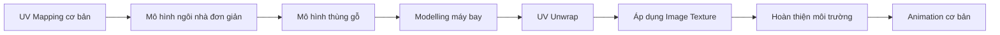

# 054 — Giới thiệu UV Mapping

## Section Intro – UV Mapping

| Thuộc tính       | Nội dung                                            |
| ---------------- | --------------------------------------------------- |
| **Module**       | Module 04 — UV Mapping                              |
| **Bài học**      | Section Intro – UV Mapping                          |
| **Thời lượng**   | 0:46                                                |
| **Chủ đề chính** | Giới thiệu tổng quan về UV Mapping và Image Texture |

---

## 1. Mục tiêu bài học

Sau bài học này, bạn sẽ:

* Nắm được nội dung tổng quan của Module 04.
* Hiểu sự chuyển đổi từ phong cách **low-poly** sang phong cách có mức độ chân thực cao hơn.
* Biết vai trò của **UV Mapping** trong việc đưa hình ảnh texture lên bề mặt mô hình 3D.
* Hình dung được lộ trình thực hành từ các bài tập đơn giản đến dự án máy bay hoàn chỉnh.
* Làm quen với định hướng học animation cơ bản ở cuối module.

---

## 2. Tổng quan Module 04

Trong module này, mức độ thiết kế sẽ được nâng lên một bước mới.

Thay vì chỉ sử dụng màu sắc và vật liệu đơn giản như trong các mô hình low-poly, chúng ta sẽ bắt đầu sử dụng **hình ảnh thực tế làm texture** cho các mô hình 3D.

Phong cách kết quả sẽ gần với đồ họa trong những trò chơi điện tử đời cũ, nơi các mô hình không có quá nhiều polygon nhưng vẫn tạo được cảm giác chi tiết nhờ hình ảnh texture.

Dự án chính của module là xây dựng và hoàn thiện một **mô hình máy bay**, bao gồm:

* Modelling hình dạng máy bay.
* Sử dụng ảnh tham chiếu.
* UV unwrap mô hình.
* Áp dụng texture ảnh lên thân máy bay.
* Tạo môi trường và các công trình xung quanh.
* Thực hiện một số animation cơ bản.

---

## 3. UV Mapping là gì?

**UV Mapping** là quá trình trải bề mặt của mô hình 3D thành một mặt phẳng 2D để có thể đặt hình ảnh texture lên mô hình một cách chính xác.

Có thể hình dung UV Mapping giống như việc tháo một hộp giấy ra và trải phẳng toàn bộ các mặt của hộp.

```text
Mô hình 3D
    │
    ▼
Đánh dấu đường cắt — Seams
    │
    ▼
Trải bề mặt — UV Unwrap
    │
    ▼
Các vùng UV — UV Islands
    │
    ▼
Đặt lên hình ảnh Texture
    │
    ▼
Texture hiển thị trên mô hình 3D
```

Trong đó:

* **U** và **V** là hai trục tọa độ trên hình ảnh 2D.
* **Seam** là đường cắt giúp Blender biết vị trí cần mở mô hình.
* **UV Island** là một phần bề mặt mô hình sau khi được trải phẳng.
* **Texture** là hình ảnh được đặt lên bề mặt mô hình.

---

## 4. Sự chuyển đổi phong cách thiết kế

### Giai đoạn trước: Low-poly

Trong các module trước, mô hình chủ yếu sử dụng:

* Hình khối đơn giản.
* Số lượng polygon thấp.
* Màu sắc phẳng.
* Vật liệu đơn giản.
* Ít hoặc không sử dụng ảnh texture.

### Giai đoạn này: Image Texture

Trong Module 04, mô hình sẽ sử dụng:

* Ảnh chụp hoặc hình ảnh thiết kế làm texture.
* UV Mapping để kiểm soát vị trí của texture.
* Nhiều chi tiết bề mặt hơn.
* Phong cách gần với các trò chơi 3D cổ điển.
* Sự kết hợp giữa modelling và texturing.

| Low-poly                | Image Texture                |
| ----------------------- | ---------------------------- |
| Màu đơn giản            | Sử dụng hình ảnh             |
| Ít chi tiết bề mặt      | Có nhiều chi tiết thị giác   |
| Không cần UV phức tạp   | Cần UV Mapping               |
| Tập trung vào hình khối | Kết hợp hình khối và texture |
| Phong cách cách điệu    | Chân thực hơn                |

---

## 5. Lộ trình học trong module

Module bắt đầu bằng những bài tập đơn giản để người học làm quen với UV Mapping, sau đó mới chuyển sang dự án phức tạp hơn.



### Giai đoạn 1 — Bài tập UV cơ bản

Người học sẽ bắt đầu bằng những mô hình đơn giản như:

* Ngôi nhà.
* Thùng gỗ.
* Các vật thể có hình dạng dễ unwrap.

Mục tiêu của giai đoạn này là làm quen với:

* Cách đánh dấu seam.
* Cách unwrap mô hình.
* Cách chỉnh sửa UV.
* Cách áp dụng hình ảnh texture.

### Giai đoạn 2 — Dự án máy bay

Sau khi nắm được kiến thức cơ bản, người học sẽ áp dụng toàn bộ quy trình vào mô hình máy bay:

1. Tạo hình dạng cơ bản.
2. Chỉnh sửa topology.
3. Chuẩn bị ảnh texture.
4. Đánh dấu seam.
5. UV unwrap mô hình.
6. Căn chỉnh UV với hình ảnh.
7. Kiểm tra và sửa lỗi texture.
8. Hoàn thiện cảnh vật xung quanh.

### Giai đoạn 3 — Animation cơ bản

Ở cuối module, khóa học sẽ giới thiệu một số kỹ thuật animation đơn giản.

Phần này đóng vai trò chuẩn bị cho module tiếp theo, nơi animation sẽ trở thành chủ đề chính.

---

## 6. Quy trình thực hành tổng quát

Quy trình làm việc trong module có thể được tóm tắt như sau:

```text
Ảnh tham chiếu
      │
      ▼
Modelling mô hình
      │
      ▼
Kiểm tra topology và transform
      │
      ▼
Đánh dấu UV Seams
      │
      ▼
UV Unwrap
      │
      ▼
Căn chỉnh UV với texture
      │
      ▼
Tạo material và kết nối Image Texture
      │
      ▼
Kiểm tra texture trên mô hình
      │
      ▼
Ánh sáng, môi trường và animation
      │
      ▼
Render kết quả
```

---

## 7. Kiến thức sẽ được sử dụng

Trong module này, người học sẽ làm việc với những nội dung chính sau:

| Nhóm kiến thức       | Nội dung                             |
| -------------------- | ------------------------------------ |
| **Modelling**        | Tạo và chỉnh sửa hình dạng mô hình   |
| **Reference Images** | Sử dụng ảnh tham chiếu khi dựng hình |
| **UV Mapping**       | Seam, unwrap và UV island            |
| **Texturing**        | Đưa hình ảnh lên bề mặt mô hình      |
| **Materials**        | Tạo material sử dụng Image Texture   |
| **Environment**      | Xây dựng công trình và bối cảnh      |
| **Animation**        | Tạo chuyển động cơ bản               |
| **Rendering**        | Hoàn thiện và xuất kết quả           |

---

## 8. Công cụ và khu vực làm việc liên quan

Bài giới thiệu chưa có thao tác thực hành cụ thể, nhưng trong các bài tiếp theo sẽ thường xuyên sử dụng:

* **3D Viewport**
* **Edit Mode**
* **UV Editing Workspace**
* **UV Editor**
* **Shader Editor**
* **Material Properties**
* **Image Texture Node**
* **Timeline**
* **Dope Sheet**
* **Render Properties**

---

## 9. Thuật ngữ quan trọng

| Thuật ngữ           | Ý nghĩa                                           |
| ------------------- | ------------------------------------------------- |
| **UV Mapping**      | Quá trình ánh xạ bề mặt 3D lên không gian 2D      |
| **UV Unwrap**       | Trải bề mặt mô hình thành các vùng phẳng          |
| **Seam**            | Đường cắt được đánh dấu trên mô hình              |
| **UV Island**       | Một vùng bề mặt sau khi được unwrap               |
| **Texture**         | Hình ảnh dùng để tạo chi tiết bề mặt              |
| **Image Texture**   | Node hoặc hình ảnh được dùng làm texture          |
| **Reference Image** | Ảnh tham khảo dùng trong quá trình modelling      |
| **Animation**       | Quá trình tạo chuyển động cho vật thể             |
| **Keyframe**        | Điểm lưu trạng thái của vật thể tại một thời điểm |

---

## 10. Lưu ý quan trọng

* Không nên bỏ qua các bài tập UV cơ bản dù mô hình có vẻ đơn giản.
* UV Mapping tốt sẽ giúp texture hiển thị đúng vị trí và ít bị kéo giãn.
* Modelling và UV Mapping có quan hệ chặt chẽ với nhau.
* Topology không hợp lý có thể khiến việc unwrap trở nên khó khăn.
* Cần áp dụng transform của mô hình trước khi unwrap trong nhiều trường hợp.
* Nên kiểm tra texture trên mô hình thường xuyên thay vì đợi đến khi hoàn thành toàn bộ UV.
* Không cần lo lắng nếu kết quả ban đầu chưa hoàn toàn giống bài mẫu; kỹ năng UV cần thời gian luyện tập.

---

## 11. Chuẩn bị trước khi thực hành

Trước khi chuyển sang các bài tiếp theo, nên chuẩn bị cấu trúc thư mục project rõ ràng:

```text
UV_Mapping_Project/
├── blender/
│   └── uv_mapping_project.blend
├── references/
│   ├── plane_front.png
│   ├── plane_side.png
│   └── buildings.png
├── textures/
│   ├── plane_texture.png
│   ├── building_texture.png
│   └── barrel_texture.png
├── renders/
└── animation/
```

Việc tổ chức file ngay từ đầu giúp tránh lỗi Blender không tìm thấy texture khi chuyển project sang máy khác hoặc thay đổi vị trí thư mục.

---

## 12. Checklist bài học

* [ ] Hiểu mục tiêu tổng quan của Module 04.
* [ ] Biết UV Mapping dùng để đặt hình ảnh texture lên mô hình.
* [ ] Phân biệt được modelling, UV unwrap và texturing.
* [ ] Biết dự án chính của module là mô hình máy bay.
* [ ] Hiểu rằng module bắt đầu bằng các bài tập nhà và thùng gỗ đơn giản.
* [ ] Biết cuối module sẽ có phần animation cơ bản.
* [ ] Đã tạo thư mục riêng cho file Blender, reference, texture và render.
* [ ] Sẵn sàng chuyển sang bài thực hành UV Mapping đầu tiên.

---

## 13. Tóm tắt

Bài học mở đầu giới thiệu Module 04 về **UV Mapping** và **Image Texture**. Nội dung khóa học bắt đầu chuyển từ phong cách low-poly đơn giản sang phong cách chi tiết và chân thực hơn, tương tự đồ họa trong các trò chơi 3D đời cũ.

Người học sẽ bắt đầu với các bài tập UV đơn giản trên mô hình ngôi nhà và thùng gỗ, sau đó áp dụng toàn bộ quy trình modelling, UV unwrap và texturing vào dự án máy bay. Cuối module, một số kỹ thuật animation cơ bản cũng sẽ được giới thiệu để chuẩn bị cho phần học chuyên sâu về animation tiếp theo.

> **Trọng tâm của module:** Không chỉ tạo được hình dạng của mô hình, mà còn phải biết cách trải UV và đặt hình ảnh texture lên đúng vị trí trên bề mặt mô hình.
