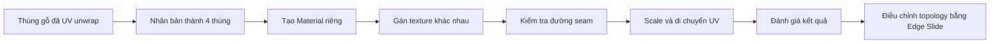
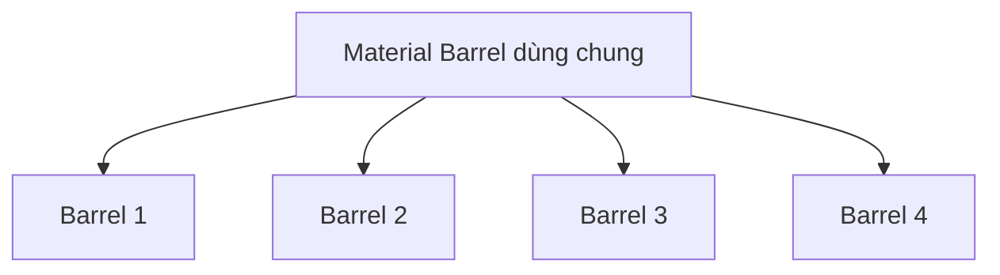
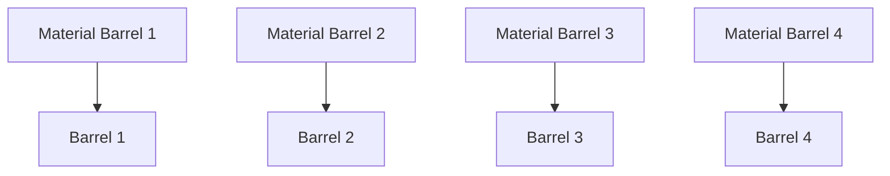

# 058 — Tạo nhiều thùng gỗ với các texture khác nhau

## Lots of Barrels

| Thuộc tính       | Nội dung                                                                          |
| ---------------- | --------------------------------------------------------------------------------- |
| **Module**       | Module 04 — UV Mapping                                                            |
| **Bài học**      | Lots of Barrels                                                                   |
| **Thời lượng**   | 11:15                                                                             |
| **Chủ đề chính** | Nhân bản vật thể, tạo Material độc lập, lặp texture bằng UV và sử dụng Edge Slide |

---

## 1. Mục tiêu bài học

Sau bài học này, bạn có thể:

* Nhân bản một vật thể đã UV unwrap để tạo nhiều biến thể.
* Hiểu sự khác nhau giữa việc nhân bản object và việc dùng chung Material.
* Tạo một Material độc lập cho từng thùng gỗ.
* Thay đổi `Image Texture` mà không làm ảnh hưởng đến các object khác.
* Nhận biết texture phù hợp hoặc không phù hợp để bao quanh vật thể.
* Điều chỉnh kích thước UV để texture lặp lại nhiều lần.
* Hiểu cách UV hoạt động khi vượt ra ngoài vùng tọa độ chuẩn.
* Sử dụng `Edge Slide` để thay đổi topology mà hạn chế làm biến dạng UV.
* Tắt giới hạn `Clamp` khi cần trượt cạnh ra ngoài phạm vi ban đầu.

---

## 2. Tổng quan quy trình

Trong bài học, một thùng gỗ đã hoàn thành UV Mapping được nhân bản thành bốn thùng. Mỗi thùng sau đó được gán một texture khác nhau để kiểm tra:

* Texture nào phù hợp với hình dạng thùng.
* Texture nào làm lộ đường nối UV.
* Cách làm cho các tấm gỗ trông nhỏ và tự nhiên hơn.
* Cách tận dụng texture không được thiết kế riêng cho thùng gỗ.



---

# 3. Nhân bản thùng gỗ

## 3.1. Tạo bốn thùng

Từ thùng gỗ ban đầu:

1. Chuyển về **Object Mode**.
2. Chọn thùng gỗ.
3. Nhấn:

```text
Shift + D
```

4. Nhấn `X` để giới hạn chuyển động theo trục X.
5. Đặt bản sao bên cạnh thùng ban đầu.
6. Nhấn:

```text
Shift + R
```

hai lần để lặp lại thao tác nhân bản và di chuyển trước đó.

Kết quả là có tổng cộng bốn thùng:

```text
Barrel 1 ── Barrel 2 ── Barrel 3 ── Barrel 4
```

> `Shift + R` thực hiện lại thao tác cuối cùng, bao gồm cả khoảng cách di chuyển của lần nhân bản trước.

---

## 3.2. Vì sao các thùng vẫn có texture giống nhau?

Mặc dù đã dùng `Shift + D`, các thùng vẫn có thể tham chiếu đến cùng một Material.

Do đó, nếu thay đổi `Image Texture` bên trong Material đang dùng chung, tất cả các thùng sử dụng Material đó đều thay đổi theo.

Quan hệ ban đầu có thể được hình dung như sau:



Muốn mỗi thùng sử dụng một texture khác nhau, cần tạo một bản sao độc lập của Material cho từng thùng.

---

# 4. Tránh cảm giác texture bị lặp

Khi nhiều object sử dụng cùng một texture, người xem có thể nhanh chóng nhận ra sự lặp lại.

Ví dụ, nếu texture có một đường màu trắng rất nổi bật, đường này sẽ xuất hiện giống hệt nhau trên tất cả các thùng.

## 4.1. Cách giảm cảm giác lặp

Có thể áp dụng một số biện pháp đơn giản:

* Xoay mỗi thùng một góc nhỏ quanh trục Z.
* Đặt mặt có đường seam quay về phía tường.
* Che đường seam bằng cây cỏ, hộp, đá hoặc các vật thể khác.
* Tránh sử dụng texture có dấu vết quá đặc trưng.
* Ưu tiên texture có độ sáng và màu sắc đồng đều.
* Sử dụng nhiều biến thể texture cho các object đặt gần nhau.

Ví dụ:

```text
Thùng 1: R Z 0°
Thùng 2: R Z 25°
Thùng 3: R Z -40°
Thùng 4: R Z 90°
```

Việc xoay nhẹ object không thay đổi texture, nhưng làm vị trí các chi tiết trên texture xuất hiện khác nhau từ góc nhìn của camera.

---

# 5. Tạo Material riêng cho từng thùng

## 5.1. Hiện tượng Material dùng chung

Khi chọn thùng thứ hai và nối một texture khác vào cổng `Base Color`, tất cả các thùng đều đổi texture.

Điều này xảy ra vì chúng vẫn đang dùng chung một Material datablock.

## 5.2. Tạo bản sao độc lập

Thực hiện với thùng thứ hai:

1. Chọn thùng thứ hai.
2. Mở **Material Properties** hoặc **Shader Editor**.
3. Nhấn nút số người dùng nằm cạnh tên Material để tạo bản sao độc lập.
4. Đổi tên Material mới:

```text
Barrel 2
```

5. Gán texture thứ hai vào `Base Color`.

Lặp lại với các thùng còn lại:

```text
Barrel 1 → Material Barrel 1
Barrel 2 → Material Barrel 2
Barrel 3 → Material Barrel 3
Barrel 4 → Material Barrel 4
```

Sau khi tách Material:



> Chỉ đổi tên object không làm Material trở nên độc lập. Cần tạo một Material datablock mới cho object đó.

---

# 6. Thùng thứ nhất — Texture tương đối đồng đều

Texture của thùng đầu tiên có độ sáng và màu sắc khá nhất quán trên toàn ảnh.

Khi texture được quấn quanh thân thùng:

* Đường seam khó nhận biết hơn.
* Phần kim loại không thay đổi độ sáng đột ngột.
* Vùng tiếp giáp giữa hai đầu texture tương đối tự nhiên.

Đây là loại texture phù hợp cho các vật thể có bề mặt bao quanh như:

* Thùng gỗ.
* Cột trụ.
* Ống nước.
* Thân cây.
* Chai và lọ.

## Đặc điểm của texture phù hợp

| Đặc điểm                   | Lợi ích                                 |
| -------------------------- | --------------------------------------- |
| Màu sắc đồng đều           | Hạn chế sự khác biệt tại đường nối      |
| Ánh sáng ít thay đổi       | Tránh một bên quá sáng, một bên quá tối |
| Chi tiết không quá nổi bật | Khó nhận ra texture bị lặp              |
| Có khả năng tile           | Có thể lặp texture trên diện tích lớn   |

---

# 7. Thùng thứ hai — Đường seam dễ nhận thấy

Texture thứ hai có phần kim loại tối ở một phía nhưng sáng hơn ở phía còn lại.

Khi hai đầu ảnh gặp nhau tại đường seam:

```text
Vùng kim loại tối │ Seam │ Vùng kim loại sáng
```

Sự thay đổi độ sáng đột ngột làm đường nối trở nên rất rõ.

## 7.1. Đường seam không phải lúc nào cũng tránh được

Trong nhiều mô hình, đặc biệt là vật thể dạng trụ, cần có ít nhất một đường cắt để trải bề mặt 3D thành mặt phẳng UV.

Do đó, giải pháp thực tế thường là:

* Đặt seam ở phía sau object.
* Quay seam về phía tường.
* Che seam bằng foliage hoặc vật thể khác.
* Chọn texture có hai mép gần giống nhau.
* Sử dụng seamless texture.

---

# 8. Thùng thứ ba — Lặp texture bằng cách scale UV

Texture thứ ba chỉ chứa các tấm ván gỗ và không có đai thùng.

Khi UV thân thùng phủ toàn bộ chiều rộng hoặc chiều cao của texture, các tấm ván xuất hiện quá lớn.

## 8.1. Kiểm tra UV Island

1. Chọn thùng thứ ba.
2. Chuyển sang **Edit Mode**.
3. Nhấn `A` để chọn toàn bộ mesh.
4. Trong UV Editor, chọn UV Island của phần thân thùng.

UV Island lớn ở giữa thường tương ứng với các mặt chạy quanh thân thùng.

---

## 8.2. Scale UV vượt ra ngoài ảnh

Trong bài, UV được scale theo trục Y:

```text
S → Y
```

Khi UV Island lớn hơn phạm vi ảnh, Blender sẽ lặp lại texture.

Ví dụ:

```text
Trước khi scale:

┌──────────── Texture ────────────┐
│       ┌──── UV Island ────┐     │
│       └───────────────────┘     │
└─────────────────────────────────┘


Sau khi scale:

          ┌────── UV Island ──────┐
┌─────────┼──── Texture ──────────┼───────┐
│         │                        │       │
└─────────┼────────────────────────┼───────┘
          └────────────────────────┘
```

Khi UV vượt khỏi vùng từ `0` đến `1`, texture được lặp lại theo chế độ mặc định của node `Image Texture`.

---

## 8.3. Tại sao scale UV làm tấm ván nhỏ hơn?

Giả sử một texture có tám tấm ván:

* Nếu UV chỉ bao phủ texture một lần, thân thùng hiển thị tám tấm ván.
* Nếu UV bao phủ texture hai lần, thân thùng hiển thị khoảng mười sáu tấm ván.
* Nếu UV bao phủ texture ba lần, các tấm ván càng nhỏ và dày hơn.

```text
UV nhỏ  → Texture phóng lớn trên object
UV lớn  → Texture thu nhỏ và lặp nhiều lần
```

Sau khi scale UV, texture ván gỗ trông phù hợp với kích thước thùng hơn.

---

# 9. Seamless texture

## 9.1. Seamless texture là gì?

**Seamless texture** là ảnh được thiết kế sao cho:

* Mép trái nối tự nhiên với mép phải.
* Mép trên nối tự nhiên với mép dưới.
* Khi ảnh được lặp lại, người xem khó nhận ra vị trí tiếp giáp.

```text
Texture A │ Texture A │ Texture A
──────────┼───────────┼──────────
Không xuất hiện đường nối rõ ràng
```

Texture ván gỗ trong bài chưa hoàn toàn seamless, nhưng hai mép khá giống nhau nên đường lặp rất khó nhận biết.

## 9.2. Dấu hiệu texture không seamless

* Vân gỗ bị ngắt đột ngột.
* Có một đường sáng hoặc tối tại vị trí lặp.
* Một chi tiết xuất hiện ở mép này nhưng không tiếp tục ở mép kia.
* Màu sắc hai đầu ảnh không giống nhau.

---

# 10. Thùng thứ tư — Tận dụng một texture khác

Texture thứ tư không được thiết kế riêng cho thùng gỗ. Tuy nhiên, bằng cách điều chỉnh UV, nó vẫn có thể tạo ra một kết quả tương đối thuyết phục.

## 10.1. Điều chỉnh phần thân thùng

1. Chọn thùng thứ tư.
2. Tạo Material riêng, ví dụ:

```text
Barrel 4
```

3. Gắn texture được yêu cầu vào `Base Color`.
4. Chuyển sang **Edit Mode**.
5. Chọn UV Island của thân thùng.
6. Scale theo trục phù hợp:

```text
S → Y
```

Mục tiêu là làm các tấm gỗ hoặc thanh ngang có tỷ lệ phù hợp với hình dạng thùng.

---

## 10.2. Điều chỉnh phần nắp

Nếu texture trên mặt nắp bị kéo giãn:

1. Chuyển sang **Face Select**.
2. Chọn mặt nắp trên mô hình.
3. Chọn UV Island tương ứng trong UV Editor.
4. Scale theo trục X:

```text
S → X
```

5. Di chuyển UV đến vùng texture phù hợp:

```text
G
```

6. Scale toàn bộ UV Island nếu cần:

```text
S
```

Mục tiêu là:

* Hạn chế texture bị kéo giãn.
* Đặt phần nắp vào khu vực texture có chi tiết phù hợp.
* Làm cho họa tiết lặp lại tự nhiên trên bề mặt.

---

# 11. Không nhất thiết phải dùng texture đúng tên vật thể

Một bài học quan trọng là không phải lúc nào cũng cần tìm kiếm đúng cụm từ:

```text
barrel texture
```

Một texture ván gỗ, sàn gỗ hoặc tường gỗ vẫn có thể dùng cho thùng nếu:

* Hướng vân gỗ phù hợp.
* Tỷ lệ các tấm gỗ có thể điều chỉnh bằng UV.
* Màu sắc tương đối đồng nhất.
* Texture lặp lại tốt.
* Các chi tiết phù hợp với hình dáng của vật thể.

Ví dụ:

| Texture ban đầu | Có thể dùng cho             |
| --------------- | --------------------------- |
| Ván sàn gỗ      | Thùng, tường, hộp gỗ        |
| Tấm kim loại    | Ống, máy móc, cửa           |
| Đá lát đường    | Tường đá, nền, cột          |
| Vải thô         | Bao tải, ghế, rèm           |
| Da              | Túi, ghế, trang bị nhân vật |

Khả năng tái sử dụng texture sẽ tăng dần theo kinh nghiệm của người làm 3D.

---

# 12. Thay đổi topology bằng Edge Slide

## 12.1. Di chuyển cạnh thông thường

Nếu chọn một edge loop và nhấn:

```text
G
```

sau đó di chuyển cạnh lên hoặc xuống, topology thay đổi nhưng texture có thể bị kéo giãn.

Nguyên nhân là cạnh trên mô hình di chuyển, trong khi UV không được điều chỉnh tương ứng theo cấu trúc bề mặt.

---

## 12.2. Edge Slide với `G`, `G`

Chọn một cạnh hoặc edge loop, sau đó nhấn:

```text
G → G
```

Lệnh này kích hoạt **Edge Slide**.

Edge Slide cho phép cạnh trượt dọc theo các cạnh lân cận thay vì di chuyển tự do trong không gian 3D.

```text
Di chuyển thông thường:

      ↑
──────●──────
      │
      │

Edge Slide:

────────●────
         ↔
Cạnh trượt dọc theo topology
```

Trong bài học, khi dùng Edge Slide:

* Cạnh trên mesh di chuyển.
* UV tương ứng cũng được cập nhật.
* Texture ít bị biến dạng hơn so với thao tác `G` thông thường.

---

## 12.3. Chọn cả edge loop

Để chọn một vòng cạnh:

```text
Alt + Left Click
```

Sau đó sử dụng:

```text
G → G
```

để trượt toàn bộ edge loop.

---

# 13. Edge Slide trên tòa nhà

Kỹ thuật Edge Slide cũng được áp dụng cho mô hình tòa nhà đã UV unwrap.

## 13.1. Làm tòa nhà cao hơn

1. Hiện lại object tòa nhà.
2. Chọn tòa nhà.
3. Chuyển sang **Edit Mode**.
4. Chọn cạnh ngang cần điều chỉnh.
5. Nhấn:

```text
G → G
```

6. Trượt cạnh lên trên.

Theo mặc định, Edge Slide bị giới hạn trong phạm vi của các cạnh lân cận. Đây là chế độ **Clamp**.

---

## 13.2. Tắt Clamp

Trong khi đang dùng Edge Slide, nhấn:

```text
C
```

để bật hoặc tắt Clamp.

Khi Clamp được tắt, cạnh có thể trượt ra ngoài giới hạn ban đầu của topology.

```text
G → G → C
```

Quy trình này cho phép kéo cạnh lên cao hơn và tận dụng phần texture còn lại phía trên.

---

## 13.3. Ảnh hưởng lên UV

Khi cạnh được trượt, UV cũng được kéo dài hoặc mở rộng tương ứng.

Nếu UV vượt ra ngoài giới hạn ảnh, texture sẽ lặp lại:

```text
UV nằm trong ảnh   → Texture xuất hiện một lần
UV vượt khỏi ảnh   → Texture tự động lặp lại
```

Vì vậy, khi làm tòa nhà cao hơn, một số cửa sổ hoặc tầng có thể bị lặp lại từ phần dưới của texture.

Cần kiểm tra kỹ để tránh:

* Cửa sổ bị cắt đôi.
* Một tầng bắt đầu lặp lại ở vị trí không hợp lý.
* Chi tiết kiến trúc không khớp giữa các mặt.
* Texture bị kéo giãn quá mức.

---

# 14. So sánh các thao tác quan trọng

| Thao tác                 | Kết quả trên mesh               | Ảnh hưởng đến UV                                   |
| ------------------------ | ------------------------------- | -------------------------------------------------- |
| `G`                      | Di chuyển cạnh tự do            | Dễ làm texture bị kéo giãn                         |
| `G`, `G`                 | Trượt cạnh theo topology        | UV được điều chỉnh phù hợp hơn                     |
| `G`, `G`, `C`            | Edge Slide không giới hạn Clamp | Có thể mở rộng mesh và UV ra ngoài phạm vi ban đầu |
| `S`, `Y` trong UV Editor | Scale UV theo trục Y            | Texture nhỏ lại hoặc lặp nhiều lần                 |
| `S`, `X` trong UV Editor | Scale UV theo trục X            | Điều chỉnh độ rộng texture                         |
| `G` trong UV Editor      | Di chuyển UV Island             | Chọn khu vực khác của texture                      |

---

# 15. Phím tắt quan trọng

| Phím tắt           | Chức năng                                                      |
| ------------------ | -------------------------------------------------------------- |
| `Tab`              | Chuyển giữa Object Mode và Edit Mode                           |
| `Shift + D`        | Nhân bản object                                                |
| `Shift + R`        | Lặp lại thao tác cuối                                          |
| `A`                | Chọn toàn bộ                                                   |
| `Alt + A`          | Bỏ chọn toàn bộ                                                |
| `1`                | Vertex Select                                                  |
| `2`                | Edge Select                                                    |
| `3`                | Face Select                                                    |
| `Alt + Left Click` | Chọn edge loop                                                 |
| `G`                | Di chuyển                                                      |
| `G`, `G`           | Edge Slide                                                     |
| `C` khi Edge Slide | Bật hoặc tắt Clamp                                             |
| `S`                | Scale                                                          |
| `S`, `X`           | Scale theo trục X                                              |
| `S`, `Y`           | Scale theo trục Y                                              |
| `R`, `Z`           | Xoay quanh trục Z                                              |
| `Numpad .`         | Frame Selected, tập trung vào object hoặc thành phần được chọn |
| `Ctrl + Z`         | Hoàn tác                                                       |

---

# 16. Các lỗi thường gặp

## 16.1. Đổi texture làm tất cả các thùng thay đổi

**Nguyên nhân:** Các thùng đang sử dụng chung một Material.

**Khắc phục:**

* Chọn object cần chỉnh.
* Tạo bản sao độc lập của Material.
* Đổi tên Material.
* Sau đó mới thay `Image Texture`.

---

## 16.2. Đường seam quá rõ

**Nguyên nhân:**

* Hai đầu texture có màu sắc khác nhau.
* Ánh sáng được vẽ trực tiếp trên texture.
* Chi tiết ở hai mép không nối tiếp nhau.

**Khắc phục:**

* Chọn texture đồng đều hơn.
* Sử dụng seamless texture.
* Quay seam về phía khuất.
* Che seam bằng object khác.

---

## 16.3. Các tấm gỗ quá rộng

**Nguyên nhân:** UV Island chỉ phủ texture một lần nên texture bị phóng lớn trên mô hình.

**Khắc phục:**

```text
Chọn UV Island → S → trục phù hợp
```

Scale UV lớn hơn để texture lặp lại nhiều lần.

---

## 16.4. Texture bị kéo giãn trên nắp

**Nguyên nhân:** Tỷ lệ UV Island không phù hợp với vùng ảnh được chọn.

**Khắc phục:**

* Chọn riêng mặt nắp.
* Scale UV theo X hoặc Y.
* Di chuyển UV sang vùng texture phù hợp.
* Kiểm tra trong 3D Viewport sau mỗi thay đổi.

---

## 16.5. Cửa sổ của tòa nhà bị lặp sai vị trí

**Nguyên nhân:** Sau khi Edge Slide, UV vượt ra ngoài vùng texture và ảnh bắt đầu lặp lại.

**Khắc phục:**

* Kiểm tra UV Island sau khi chỉnh topology.
* Di chuyển hoặc scale UV lại.
* Chỉ mở rộng tòa nhà trong phạm vi texture cho phép.
* Sử dụng texture có khả năng tile nếu cần nhiều tầng lặp lại.

---

# 17. Bài thực hành

## Bài tập 1 — Tạo bốn thùng

* Nhân bản thùng ban đầu thành bốn object.
* Đặt các thùng thành một hàng.
* Xoay nhẹ từng thùng quanh trục Z.

## Bài tập 2 — Material độc lập

* Tạo một Material riêng cho mỗi thùng.
* Đặt tên lần lượt:

```text
Barrel 1
Barrel 2
Barrel 3
Barrel 4
```

* Gán một texture khác nhau cho mỗi Material.

## Bài tập 3 — Lặp texture ván gỗ

* Chọn UV Island của thân thùng.
* Scale UV vượt ra ngoài giới hạn ảnh.
* Quan sát texture lặp lại.
* Điều chỉnh đến khi kích thước các tấm ván hợp lý.

## Bài tập 4 — Điều chỉnh topology

* Chọn một edge loop trên thùng.
* Thử di chuyển bằng `G`.
* Hoàn tác.
* Thử lại bằng `G`, `G`.
* So sánh mức độ biến dạng của texture.

## Bài tập 5 — Làm tòa nhà cao hơn

* Chọn cạnh ngang của tòa nhà.
* Sử dụng:

```text
G → G → C
```

* Kéo cạnh lên trên.
* Kiểm tra cách UV và texture thay đổi.

---

# 18. Checklist hoàn thành

* [ ] Đã nhân bản thùng thành bốn object.
* [ ] Đã hiểu rằng các object có thể vẫn dùng chung Material.
* [ ] Đã tạo Material độc lập cho từng thùng.
* [ ] Đã gán các texture khác nhau cho từng Material.
* [ ] Đã kiểm tra đường seam của từng texture.
* [ ] Đã scale UV để texture lặp lại.
* [ ] Đã điều chỉnh riêng UV của thân và nắp thùng.
* [ ] Đã thử chọn edge loop bằng `Alt + Left Click`.
* [ ] Đã sử dụng `G`, `G` để Edge Slide.
* [ ] Đã thử tắt Clamp bằng phím `C`.
* [ ] Đã thay đổi chiều cao tòa nhà bằng Edge Slide.
* [ ] Đã lưu file trước khi chuyển sang bài tiếp theo.

---

# 19. Tóm tắt bài học

Bài học mở rộng kiến thức UV Mapping thông qua việc tạo bốn thùng gỗ sử dụng các texture khác nhau.

Các nội dung quan trọng gồm:

1. Các object được nhân bản có thể vẫn tham chiếu đến cùng một Material.
2. Muốn thay texture riêng cho từng thùng, cần tạo Material độc lập.
3. Texture đồng đều sẽ giúp che giấu đường seam tốt hơn.
4. UV có thể được scale ra ngoài giới hạn ảnh để texture tự động lặp lại.
5. Không nhất thiết phải sử dụng texture được tạo riêng cho đúng loại object.
6. `Edge Slide` bằng `G`, `G` giúp thay đổi topology mà hạn chế phá vỡ UV.
7. Phím `C` cho phép tắt Clamp để cạnh có thể trượt ra ngoài giới hạn ban đầu.

> Ý tưởng cốt lõi: **UV Mapping không chỉ là trải mô hình lên texture, mà còn là quá trình chủ động scale, di chuyển và tái sử dụng texture sao cho phù hợp nhất với hình dạng của object.**
