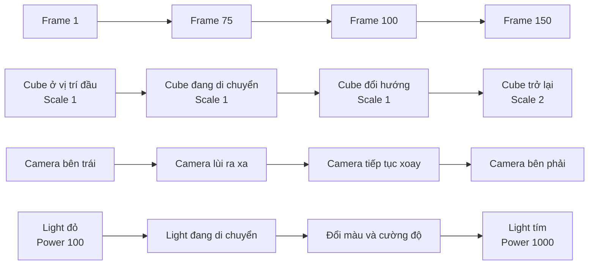

# 074 — Nút Record và Auto Keying trong Blender

| Thuộc tính              | Nội dung                                    |
| ----------------------- | ------------------------------------------- |
| **Module**              | Module 05 — Rigging & Animation             |
| **Bài học**             | The Record Button                           |
| **Thời lượng**          | 11:32                                       |
| **Chủ đề chính**        | Sử dụng Auto Keying để tự động tạo keyframe |
| **Phần mềm**            | Blender                                     |
| **Đối tượng thực hành** | Cube, Camera và Light                       |

---

## 1. Mục tiêu bài học

Sau bài học này, bạn sẽ có thể:

* Phân biệt **Timeline** và **Dope Sheet**.
* Sử dụng nút **Record / Auto Keying** để tạo keyframe tự động.
* Hiểu vì sao một animation cần keyframe ở cả điểm bắt đầu và kết thúc.
* Tạo khoảng thời gian mà một thuộc tính được giữ nguyên.
* Sao chép keyframe bằng `Shift + D`.
* Animate chuyển động và góc xoay của Camera.
* Animate vị trí, màu sắc và công suất của đèn.
* Nhận biết trạng thái keyframe thông qua màu sắc của các trường thuộc tính.
* Tránh việc Auto Keying ghi lại nhiều thuộc tính hơn mức cần thiết.

---

## 2. Timeline và Dope Sheet

Trong workspace **Animation**, Blender thường hiển thị cả Timeline và Dope Sheet.

### Timeline

Timeline cung cấp cái nhìn tổng quát về animation:

* Hiển thị vị trí các keyframe.
* Điều khiển playhead.
* Phát hoặc dừng animation.
* Chuyển đến đầu hoặc cuối animation.
* Bật hoặc tắt Auto Keying.
* Chuyển nhanh giữa các keyframe.

Timeline không hiển thị chi tiết từng thuộc tính đang được animate.

### Dope Sheet

Dope Sheet hiển thị chi tiết hơn:

* Object nào đang có animation.
* Thuộc tính nào đang được animate.
* Keyframe của Location, Rotation và Scale.
* Keyframe của các thuộc tính khác như màu sắc và công suất đèn.
* Các kênh animation riêng biệt của từng object.

### So sánh nhanh

| Công cụ          | Đặc điểm                                                            |
| ---------------- | ------------------------------------------------------------------- |
| **Timeline**     | Đơn giản, phù hợp để điều khiển thời gian và xem tổng quan keyframe |
| **Dope Sheet**   | Chi tiết, cho phép xem và chỉnh sửa từng kênh animation             |
| **Graph Editor** | Chuyên sâu hơn, dùng để điều chỉnh đường cong và tốc độ chuyển động |

```text
Timeline
└── Cho biết frame nào có keyframe

Dope Sheet
├── Cube
│   ├── Location X
│   ├── Location Y
│   ├── Rotation Z
│   └── Scale
├── Camera
│   ├── Location
│   └── Rotation
└── Light
    ├── Location
    ├── Color
    └── Power
```

---

## 3. Mở rộng thời lượng animation

Animation hiện tại kết thúc tại frame `100`.

Trong bài học, phạm vi animation được mở rộng đến frame `150`:

1. Tìm trường **End** trên Timeline.
2. Thay giá trị `100` bằng `150`.
3. Thu nhỏ Timeline hoặc Dope Sheet để xem toàn bộ phạm vi frame.

Trong thiết lập của bài học:

* Frame `100` tương đương khoảng 4 giây.
* Frame `150` tương đương khoảng 6 giây.
* Vì vậy, scene đang sử dụng tốc độ khoảng 25 FPS.

---

## 4. Nút Record — Auto Keying

Nút Record là biểu tượng hình tròn trên Timeline. Trong Blender, chức năng này thường được gọi là **Auto Keying**.

Khi Auto Keying được bật, Blender có thể tự động chèn keyframe tại frame hiện tại khi người dùng thay đổi thuộc tính của object.

Ví dụ:

1. Bật Auto Keying.
2. Di chuyển playhead đến frame `150`.
3. Chọn Cube.
4. Nhấn `G`, sau đó `X`.
5. Di chuyển Cube về vị trí ban đầu.
6. Nhấn chuột trái để xác nhận.

Blender sẽ tự động tạo keyframe mới.

```text
Frame 1                  Frame 100                 Frame 150
Cube bên trái  ───────▶  Cube bên phải  ───────▶  Cube trở về trái
```

### Ưu điểm

* Tạo keyframe nhanh.
* Không phải nhấn `I` sau mỗi lần thay đổi.
* Thuận tiện khi liên tục chỉnh sửa animation.
* Phù hợp khi thử nghiệm nhiều tư thế hoặc vị trí.

### Hạn chế

Auto Keying có thể tạo nhiều keyframe hơn mong muốn.

Ví dụ, khi chỉ di chuyển object, Blender có thể ghi lại:

* Location
* Rotation
* Scale

Điều này phụ thuộc vào:

* Keying Set đang được sử dụng.
* Cấu hình Auto Keying.
* Các kênh đã có animation.
* Cách người dùng thực hiện thao tác.

> Nên kiểm tra Dope Sheet sau khi sử dụng Auto Keying để chắc chắn Blender chỉ ghi lại những thuộc tính cần thiết.

---

## 5. Nguyên tắc: Animation cần ít nhất hai trạng thái

Giả sử tại frame `150`, Cube được scale lớn gấp đôi.

Nếu chỉ có một keyframe Scale tại frame `150`, Cube có thể giữ nguyên kích thước lớn trong toàn bộ animation. Blender không có trạng thái Scale trước đó để nội suy.

### Trường hợp chưa đúng

```text
Frame 1                                      Frame 150
Không có keyframe Scale  ─────────────────▶  Scale = 2
```

Blender không biết Cube phải bắt đầu với kích thước nào.

### Trường hợp đúng

```text
Frame 1                                      Frame 150
Scale = 1               ─────────────────▶  Scale = 2
```

Blender sẽ nội suy giá trị Scale từ `1` đến `2`.

### Quy tắc cần nhớ

Để một thuộc tính thay đổi theo thời gian, cần xác định ít nhất:

1. Trạng thái ban đầu.
2. Trạng thái kết thúc.

```text
Keyframe đầu + Keyframe cuối
              ↓
       Blender nội suy
              ↓
       Tạo ra chuyển động
```

---

## 6. Nhận biết trạng thái keyframe qua màu sắc

Khi mở bảng Transform bằng phím `N`, các trường Location, Rotation và Scale có thể được tô màu.

### Màu vàng

Màu vàng cho biết:

* Thuộc tính có keyframe tại đúng frame hiện tại.
* Giá trị hiện tại đang được ghi lại trong animation.

Ví dụ:

```text
Frame hiện tại có keyframe Location
Location X: màu vàng
```

### Màu xanh lá

Màu xanh lá cho biết:

* Thuộc tính đang có animation.
* Nhưng frame hiện tại không có keyframe cho thuộc tính đó.

```text
Frame 1              Frame 30              Frame 50
Keyframe              Không có              Keyframe
Vàng        ───────▶  Xanh lá   ───────▶   Vàng
```

### Không có màu đặc biệt

Thông thường điều này cho biết thuộc tính chưa được animate.

| Màu hiển thị                     | Ý nghĩa                                                                  |
| -------------------------------- | ------------------------------------------------------------------------ |
| **Vàng**                         | Có keyframe tại frame hiện tại                                           |
| **Xanh lá**                      | Thuộc tính có animation nhưng frame hiện tại không có keyframe           |
| **Màu mặc định**                 | Thuộc tính chưa có animation                                             |
| **Cam hoặc trạng thái thay đổi** | Giá trị đã thay đổi nhưng chưa được xác nhận hoặc chưa khớp với keyframe |

---

## 7. Điều chỉnh Scale từ 1 đến 2

### Thiết lập frame đầu

1. Chuyển đến frame đầu tiên.
2. Chọn Cube.
3. Mở bảng Item bằng `N`.
4. Đặt:

```text
Scale X = 1
Scale Y = 1
Scale Z = 1
```

5. Khi Auto Keying đang bật, Blender sẽ ghi lại các giá trị Scale tại frame này.

Nếu Auto Keying không ghi lại đúng thuộc tính:

* Di chuột lên trường Scale.
* Nhấn `I`.
* Hoặc nhấp chuột phải và chọn **Insert Keyframe**.

### Thiết lập frame cuối

1. Chuyển đến frame `150`.
2. Đặt:

```text
Scale X = 2
Scale Y = 2
Scale Z = 2
```

Kết quả:

```text
Frame 1                                            Frame 150
Scale = 1          ─────────────────────────────▶  Scale = 2
Kích thước gốc                                   Lớn gấp đôi
```

Cube sẽ lớn dần trong toàn bộ animation.

---

## 8. Chỉ Scale trong hai giây cuối

Yêu cầu mới:

* Cube giữ nguyên Scale bằng `1` trong 4 giây đầu.
* Chỉ tăng lên Scale `2` trong 2 giây cuối.

Với thiết lập 25 FPS:

* 4 giây tương ứng frame `100`.
* 6 giây tương ứng frame `150`.

Cần có ba trạng thái:

| Frame | Scale |
| ----: | ----: |
|     1 |     1 |
|   100 |     1 |
|   150 |     2 |

```text
Frame 1                  Frame 100                 Frame 150
Scale = 1  ────────────  Scale = 1  ────────────  Scale = 2
       Giữ nguyên kích thước               Bắt đầu phóng lớn
```

### Cách 1: Nhập lại giá trị

1. Chuyển đến frame `100`.
2. Đặt Scale X, Y và Z bằng `1`.
3. Chèn keyframe Scale.

### Cách 2: Sao chép keyframe

1. Trong Dope Sheet, chọn các keyframe Scale tại frame đầu.
2. Nhấn `Shift + D`.
3. Di chuyển bản sao đến frame `100`.
4. Nhấn chuột trái để xác nhận.

Cách sao chép keyframe đảm bảo giá trị tại frame `100` giống chính xác frame đầu.

> Sao chép keyframe đặc biệt hữu ích khi nhiều kênh cần giữ nguyên giá trị trong một khoảng thời gian.

---

## 9. Sao chép keyframe trong Dope Sheet

### Phím tắt

```text
Shift + D
```

### Quy trình

1. Chọn một hoặc nhiều keyframe.
2. Nhấn `Shift + D`.
3. Di chuyển keyframe đến frame mong muốn.
4. Nhấn chuột trái hoặc `Enter` để xác nhận.

Có thể giới hạn chuyển động theo trục thời gian bằng cách nhấn:

```text
Shift + D → X
```

Trong Dope Sheet, trục X đại diện cho thời gian.

### Ứng dụng

* Giữ object đứng yên.
* Giữ nguyên Scale.
* Giữ nguyên Rotation.
* Tạo khoảng dừng trước khi chuyển động tiếp.
* Lặp lại một tư thế.
* Sao chép một nhóm keyframe sang thời điểm khác.

---

## 10. Các nút điều hướng animation

Timeline cung cấp các nút giúp di chuyển nhanh giữa những vị trí quan trọng.

| Nút               | Chức năng                              |
| ----------------- | -------------------------------------- |
| Jump to Start     | Đi đến frame đầu của phạm vi animation |
| Jump to End       | Đi đến frame cuối                      |
| Previous Keyframe | Đi đến keyframe trước                  |
| Next Keyframe     | Đi đến keyframe tiếp theo              |
| Play/Pause        | Phát hoặc tạm dừng animation           |

Các nút này hữu ích hơn việc kéo playhead bằng tay, đặc biệt khi animation có nhiều keyframe.

---

## 11. Animate Camera

Không chỉ mesh mới có thể được animate. Camera cũng là một object và có thể animate:

* Location
* Rotation
* Scale
* Lens
* Depth of Field
* Các thuộc tính Camera khác

### Mục tiêu

Di chuyển Camera từ một phía của scene sang phía còn lại, đồng thời luôn hướng về Cube.

```text
Camera đầu                                  Camera cuối
     \                                           /
      \                                         /
       └──────────────▶ Cube ◀──────────────────┘
```

### Bước 1: Tạo keyframe đầu

1. Chọn Camera.
2. Chuyển đến frame đầu.
3. Đảm bảo Camera đang ở vị trí và góc nhìn ban đầu.
4. Di chuột vào 3D Viewport.
5. Nhấn `I`.
6. Chọn:

```text
Location & Rotation
```

Có thể sử dụng một trong các cách khác:

* Chèn keyframe trực tiếp trong bảng Transform.
* Với Auto Keying bật, thực hiện một thay đổi nhỏ rồi xác nhận.
* Nhấp chuột phải vào thuộc tính và chọn **Insert Keyframe**.

### Bước 2: Tạo keyframe cuối

1. Chuyển đến frame cuối.
2. Nhấn `G`, sau đó chọn trục cần di chuyển.
3. Di chuyển Camera sang phía đối diện.
4. Nhấn `R`, sau đó `Z` để xoay Camera.
5. Giữ Camera hướng về vùng trung tâm của scene.

### Bước 3: Kiểm tra đường đi

Kéo playhead qua Timeline để xem chuyển động.

Nếu Camera di chuyển theo đường thẳng, khung hình giữa animation có thể tiến quá gần Cube.

```text
Đường thẳng:
Camera A ───────────▶ Camera B
          Đi quá gần Cube

Đường cong:
Camera A ─────╮
              ╰────▶ Camera B
        Giữ khoảng cách tốt hơn
```

### Bước 4: Thêm keyframe trung gian

1. Chuyển đến khoảng frame `75`.
2. Di chuyển Camera lùi ra xa một chút, chẳng hạn bằng `G`, sau đó `Y`.
3. Auto Keying sẽ tạo một keyframe trung gian.

Kết quả là Camera di chuyển theo một đường cong nhẹ, giúp Cube luôn nằm trong khung hình.

---

## 12. Animate vị trí của Light

Light cũng là một object và có thể được di chuyển giống Cube hoặc Camera.

### Mục tiêu

Di chuyển đèn từ một góc scene sang góc đối diện.

### Quy trình

1. Chọn Light.
2. Nhấn `Numpad 7` để chuyển sang Top View.
3. Chuyển đến frame đầu.
4. Nhấn `G` và đặt đèn vào góc bắt đầu.
5. Chuyển đến frame cuối.
6. Nhấn `G` và di chuyển đèn sang góc đối diện.

Top View giúp quan sát vị trí đèn theo mặt phẳng X–Y rõ ràng hơn.

```text
Top View

Light A ● ─────────────────────▶ ● Light B

               □ Cube
```

---

## 13. Animate màu sắc và công suất đèn

Ngoài Transform, Blender còn cho phép animate hầu hết các thuộc tính số và màu sắc.

Đối với Light, có thể animate:

* Color
* Power
* Radius
* Size
* Exposure
* Spot Size
* Spot Blend

### Keyframe màu sắc ban đầu

1. Chuyển đến frame đầu.
2. Chọn Light.
3. Mở **Light Properties**.
4. Đặt màu đèn thành đỏ.
5. Nhấp chuột phải vào trường Color.
6. Chọn **Insert Keyframe**.

### Keyframe công suất ban đầu

1. Đặt Power bằng `100`.
2. Nhấp chuột phải vào trường Power.
3. Chọn **Insert Keyframe**.

### Keyframe tại frame cuối

1. Chuyển đến frame cuối.
2. Đổi màu đèn thành tím.
3. Đặt Power thành `1000`.

Sau khi thuộc tính đã được thiết lập để animate, Auto Keying thường có thể ghi lại các thay đổi tiếp theo tại frame mới.

```text
Frame đầu                                    Frame cuối
Màu đỏ                                       Màu tím
Power = 100      ─────────────────────────▶  Power = 1000
```

### Kết quả

Trong quá trình animation:

* Đèn di chuyển qua scene.
* Màu chuyển dần từ đỏ sang tím.
* Cường độ tăng dần từ 100 lên 1000.

---

## 14. Vì sao Color và Power đôi khi cần keyframe thủ công?

Auto Keying thường hoạt động trực tiếp với các phép biến đổi của object như:

* Location
* Rotation
* Scale

Tuy nhiên, với một số thuộc tính trong Properties Editor như Color hoặc Power, có thể cần chèn keyframe đầu tiên bằng tay.

Quy trình an toàn:

```text
Thuộc tính chưa có animation
           ↓
Nhấp chuột phải → Insert Keyframe
           ↓
Thuộc tính trở thành animated property
           ↓
Auto Keying có thể ghi lại thay đổi tại các frame sau
```

Điều này cũng giúp Blender biết chính xác thuộc tính nào người dùng muốn animate.

---

## 15. Các kênh màu RGB trong Dope Sheet

Khi màu của Light được animate, Dope Sheet có thể xuất hiện các kênh riêng:

* Red
* Green
* Blue
* Power

Màu sắc trên máy tính thường được biểu diễn bằng ba thành phần:

```text
Color
├── R — Red
├── G — Green
└── B — Blue
```

Blender nội suy từng thành phần màu giữa các keyframe để tạo ra quá trình đổi màu liên tục.

Ví dụ:

```text
Đỏ → Tím

Red:   giữ ở mức cao
Green: giữ ở mức thấp
Blue:  tăng dần
```

---

## 16. Thêm một Light thứ hai

Có hai cách thêm đèn thứ hai.

### Cách 1: Tạo Light mới

```text
Shift + A → Light → Chọn loại đèn
```

### Cách 2: Nhân bản Light hiện tại

1. Chọn Light.
2. Nhấn `Shift + D`.
3. Di chuyển bản sao đến vị trí mới.

### Lưu ý khi nhân bản object đã có animation

Khi nhân bản một object đang có animation, object mới có thể mang theo:

* Các keyframe Location.
* Keyframe Rotation.
* Keyframe Color.
* Keyframe Power.
* Các kênh animation khác của object gốc.

Do đó, sau khi nhân bản cần kiểm tra Dope Sheet và điều chỉnh lại các keyframe.

---

## 17. Animate Light thứ hai

Ví dụ thiết lập Light thứ hai:

### Frame đầu

* Vị trí: góc dưới của scene.
* Màu: xanh lá.
* Power: `2000`.

### Frame cuối

* Vị trí: góc đối diện.
* Màu: vàng.
* Power: giá trị tùy chọn.

```text
Light 1:
Đỏ, 100 ─────────────────▶ Tím, 1000

Light 2:
Xanh lá, 2000 ───────────▶ Vàng, giá trị tùy chọn
```

Khi phát animation, scene có thể đồng thời xuất hiện:

* Cube di chuyển và thay đổi kích thước.
* Camera di chuyển quanh Cube.
* Light thứ nhất di chuyển và đổi màu.
* Light thứ hai di chuyển theo hướng khác.
* Cường độ của cả hai nguồn sáng thay đổi.

---

## 18. Sơ đồ tổng thể animation



---

## 19. Auto Keying và Insert Keyframe thủ công

| Tiêu chí      | Auto Keying                     | Insert Keyframe thủ công      |
| ------------- | ------------------------------- | ----------------------------- |
| Tốc độ        | Nhanh                           | Chậm hơn                      |
| Mức kiểm soát | Có thể ghi thừa thuộc tính      | Kiểm soát chính xác           |
| Phù hợp       | Chỉnh sửa animation liên tục    | Tạo keyframe quan trọng       |
| Nguy cơ       | Vô tình tạo keyframe            | Dễ quên chèn keyframe         |
| Phương pháp   | Bật Record rồi thay đổi giá trị | Nhấn `I` hoặc Insert Keyframe |

### Cách sử dụng kết hợp

Quy trình hiệu quả thường là:

1. Chèn keyframe đầu tiên bằng `I`.
2. Bật Auto Keying.
3. Tạo và chỉnh sửa các keyframe tiếp theo.
4. Kiểm tra Dope Sheet.
5. Tắt Auto Keying khi không còn animate.

---

## 20. Lỗi thường gặp

### 20.1. Chỉ tạo keyframe ở frame cuối

**Hiện tượng:** Object giữ nguyên trạng thái cuối trong toàn bộ animation.

**Nguyên nhân:** Không có keyframe ban đầu để Blender nội suy.

**Khắc phục:** Tạo keyframe cho trạng thái bắt đầu.

---

### 20.2. Object thay đổi trong toàn bộ animation

**Hiện tượng:** Cube bắt đầu phóng lớn ngay từ frame đầu, trong khi mong muốn chỉ phóng lớn ở hai giây cuối.

**Nguyên nhân:** Chỉ có keyframe Scale tại frame đầu và frame cuối.

**Khắc phục:** Thêm keyframe Scale bằng `1` tại frame `100`.

---

### 20.3. Auto Keying tạo cả Rotation và Scale

**Hiện tượng:** Người dùng chỉ di chuyển object nhưng Dope Sheet xuất hiện thêm nhiều kênh.

**Nguyên nhân:** Keying Set đang ghi lại toàn bộ Transform hoặc nhiều kênh cùng lúc.

**Khắc phục:**

* Kiểm tra Active Keying Set.
* Xóa các keyframe không cần thiết.
* Chỉ chọn Location khi chèn keyframe thủ công.
* Kiểm tra Dope Sheet ngay sau khi ghi.

---

### 20.4. Thay đổi Color nhưng không có keyframe

**Nguyên nhân:** Thuộc tính Color chưa được thiết lập để animate.

**Khắc phục:**

1. Nhấp chuột phải vào Color.
2. Chọn **Insert Keyframe**.
3. Sau đó tiếp tục sử dụng Auto Keying ở các frame khác.

---

### 20.5. Camera không giữ Cube trong khung hình

**Nguyên nhân:** Camera di chuyển theo đường thẳng quá gần Cube hoặc góc xoay chưa phù hợp.

**Khắc phục:**

* Thêm keyframe trung gian.
* Di chuyển Camera lùi ra xa.
* Điều chỉnh cả Location và Rotation.
* Kiểm tra trong Camera View.

---

### 20.6. Light nhân bản có animation giống Light cũ

**Nguyên nhân:** Object mới được sao chép cùng với dữ liệu animation.

**Khắc phục:**

* Kiểm tra các keyframe của Light mới.
* Di chuyển hoặc xóa keyframe không cần thiết.
* Thay đổi Color và Power tại từng frame.
* Kiểm tra object nào đang được chọn trước khi sửa keyframe.

---

### 20.7. Quên tắt Auto Keying

**Hiện tượng:** Các thay đổi không chủ ý bị ghi thành keyframe.

**Khắc phục:** Tắt Auto Keying ngay khi hoàn tất phần animation.

> Hãy coi nút Record giống như chế độ ghi hình: chỉ bật khi thực sự cần ghi lại thay đổi.

---

## 21. Phím tắt và công cụ liên quan

| Phím tắt / Công cụ | Chức năng                                          |
| ------------------ | -------------------------------------------------- |
| `I`                | Mở menu Insert Keyframe                            |
| `Alt + I`          | Xóa keyframe khỏi thuộc tính hoặc object           |
| `G`                | Di chuyển object                                   |
| `G`, `X`           | Di chuyển theo trục X                              |
| `G`, `Y`           | Di chuyển theo trục Y                              |
| `G`, `Z`           | Di chuyển theo trục Z                              |
| `R`                | Xoay object                                        |
| `R`, `Z`           | Xoay theo trục Z                                   |
| `S`                | Thay đổi kích thước                                |
| `Shift + D`        | Nhân bản object hoặc keyframe                      |
| `Shift + D`, `X`   | Sao chép và di chuyển keyframe theo trục thời gian |
| `N`                | Mở hoặc đóng Sidebar                               |
| `Numpad 7`         | Top View                                           |
| Nút Record         | Bật hoặc tắt Auto Keying                           |
| Insert Keyframe    | Chèn keyframe thủ công                             |
| Replace Keyframe   | Ghi đè keyframe hiện có                            |
| Dope Sheet         | Quản lý keyframe theo từng kênh                    |

---

## 22. Bài thực hành

### Bài 1: Di chuyển Cube

* Đặt Cube tại vị trí đầu ở frame `1`.
* Di chuyển Cube sang vị trí khác ở frame `100`.
* Đưa Cube trở lại vị trí ban đầu ở frame `150`.
* Sử dụng Auto Keying cho frame cuối.

### Bài 2: Animate Scale

* Frame `1`: Scale bằng `1`.
* Frame `100`: Scale bằng `1`.
* Frame `150`: Scale bằng `2`.
* Sao chép keyframe frame `1` sang frame `100`.

### Bài 3: Animate Camera

* Camera bắt đầu ở bên trái.
* Camera kết thúc ở bên phải.
* Camera luôn hướng về Cube.
* Thêm keyframe trung gian để tạo đường chuyển động cong.

### Bài 4: Animate Light

* Di chuyển Light từ một góc sang góc đối diện.
* Đổi màu từ đỏ sang tím.
* Đổi Power từ `100` lên `1000`.

### Bài 5: Light thứ hai

* Nhân bản Light hiện có.
* Cho đèn di chuyển theo hướng khác.
* Sử dụng màu và Power khác.
* Kiểm tra xem Light mới có sao chép keyframe của Light cũ hay không.

---

## 23. Checklist thực hành

### Cube

* [ ] Đã mở rộng animation đến frame `150`.
* [ ] Đã bật Auto Keying.
* [ ] Đã tạo thêm chuyển động cho Cube.
* [ ] Đã đặt Scale bằng `1` ở frame đầu.
* [ ] Đã giữ Scale bằng `1` đến frame `100`.
* [ ] Đã đặt Scale bằng `2` tại frame `150`.
* [ ] Đã thử sao chép keyframe bằng `Shift + D`.

### Camera

* [ ] Đã tạo keyframe Location và Rotation tại frame đầu.
* [ ] Đã di chuyển Camera sang phía đối diện.
* [ ] Đã xoay Camera để luôn nhìn về Cube.
* [ ] Đã thêm keyframe trung gian để cải thiện đường đi.
* [ ] Cube vẫn nằm trong khung hình trong phần lớn animation.

### Light

* [ ] Đã animate vị trí Light.
* [ ] Đã chèn keyframe đầu tiên cho Color.
* [ ] Đã chèn keyframe đầu tiên cho Power.
* [ ] Đã thay đổi màu và công suất tại frame cuối.
* [ ] Đã thêm hoặc nhân bản Light thứ hai.
* [ ] Đã kiểm tra các kênh RGB và Power trong Dope Sheet.

### Hoàn thiện

* [ ] Đã kiểm tra toàn bộ animation trong Rendered View.
* [ ] Đã xóa các keyframe không cần thiết.
* [ ] Đã tắt Auto Keying sau khi hoàn thành.
* [ ] Đã lưu file Blender trước khi render.

---

## 24. Ghi nhớ nhanh

```text
1. Không có hai trạng thái → Không có sự thay đổi rõ ràng.

2. Muốn giữ nguyên giá trị:
   Sao chép keyframe đến thời điểm bắt đầu thay đổi.

3. Auto Keying:
   Nhanh nhưng có thể ghi thừa thuộc tính.

4. Thuộc tính đặc biệt như Color và Power:
   Có thể cần Insert Keyframe thủ công lần đầu.

5. Camera và Light cũng là object:
   Có thể animate giống như mesh.

6. Luôn kiểm tra Dope Sheet:
   Để phát hiện keyframe thừa hoặc sai vị trí.

7. Tắt Record sau khi animate:
   Tránh tạo keyframe ngoài ý muốn.
```

---

## 25. Tóm tắt bài học

Nút **Record / Auto Keying** giúp tăng tốc quy trình animation bằng cách tự động tạo keyframe khi object hoặc thuộc tính được thay đổi tại một frame mới.

Tuy nhiên, để sử dụng hiệu quả, cần hiểu rõ các nguyên tắc:

* Mỗi chuyển động phải có trạng thái bắt đầu và kết thúc.
* Có thể sao chép keyframe để giữ nguyên giá trị trong một khoảng thời gian.
* Auto Keying có thể ghi lại nhiều kênh hơn mong muốn.
* Camera, Light và gần như mọi thuộc tính trong Blender đều có thể được animate.
* Các thuộc tính như màu sắc và công suất đèn có thể cần keyframe thủ công lần đầu.
* Dope Sheet là công cụ quan trọng để kiểm tra và quản lý keyframe.
* Cần tắt Auto Keying sau khi hoàn thành để tránh ghi lại thay đổi không chủ ý.

Bài học này mở rộng animation từ một Cube đơn giản thành một scene hoàn chỉnh có chuyển động của **object, Camera, ánh sáng, màu sắc và cường độ chiếu sáng**.
