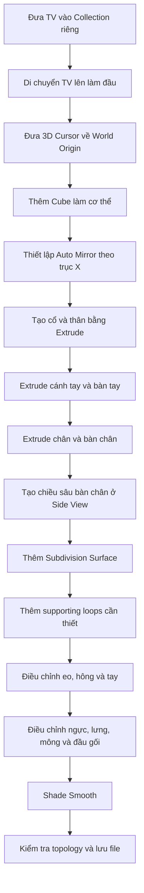

# 080 — Blob Man: Dựng cơ thể nhân vật cơ bản

| Thuộc tính       | Nội dung                                                         |
| ---------------- | ---------------------------------------------------------------- |
| **Module**       | Module 05 — Rigging & Animation                                  |
| **Bài học**      | Blob Man                                                         |
| **Thời lượng**   | 9:50                                                             |
| **Chủ đề chính** | Dựng cơ thể nhân vật Blob Man bằng Mirror và Subdivision Surface |

---

## 1. Mục tiêu bài học

Trong bài học này, chúng ta sẽ:

* Dựng một cơ thể nhân vật hoạt hình đơn giản từ **Cube**.
* Sử dụng **Auto Mirror/Mirror Modifier** để giữ nhân vật đối xứng.
* Tạo thân, tay, chân và bàn chân bằng kỹ thuật **Extrude**.
* Sử dụng **Subdivision Surface** để làm mềm hình dạng.
* Thêm một số **Loop Cut hỗ trợ** để kiểm soát độ bo tròn.
* Điều chỉnh hình dáng nhân vật ở cả mặt trước và mặt bên.
* Chuẩn bị một mesh đơn giản, phù hợp cho quá trình tạo xương và animation ở các bài sau.

> Trong bài này, chiếc TV đã dựng ở bài trước sẽ được sử dụng làm **đầu nhân vật**. Phần được dựng mới chủ yếu là cổ, thân, tay và chân.

---

## 2. Kết quả cần đạt

Sau khi hoàn thành, mô hình sẽ có cấu trúc cơ bản như sau:

```text
             ┌───────────────┐
             │    TV Head    │
             └───────┬───────┘
                     │
                    Cổ
             ┌───────┴───────┐
        Tay trái             Tay phải
             \               /
              \───── Thân ───/
                    / \
              Chân trái Chân phải
                 │       │
              Bàn chân Bàn chân
```

Nhân vật có phong cách đơn giản, tròn trịa và hơi mũm mĩm — phù hợp để thực hành rigging và tạo walk cycle.

---

## 3. Chuẩn bị mô hình TV

Chiếc TV được hoàn thiện ở bài trước sẽ đóng vai trò là đầu nhân vật.

### Các bước thực hiện

1. Chọn toàn bộ các bộ phận của TV.
2. Di chuyển chúng vào một Collection mới.
3. Đặt tên Collection là:

```text
TV
```

4. Chuyển sang góc nhìn chính diện.
5. Di chuyển TV lên trên theo trục Z để dành không gian cho cơ thể.

```text
G → Z
```

Nhân vật trong bài đang có chiều cao khoảng 6 mét theo đơn vị mặc định của Blender. Kích thước này không quan trọng ở giai đoạn thực hành và có thể được thu nhỏ sau này khi cần export.

---

## 4. Tạo mesh cơ thể

### 4.1. Đưa 3D Cursor về tâm thế giới

Đưa 3D Cursor về tọa độ gốc:

```text
Shift + S → Cursor to World Origin
```

Sau đó thêm một Cube mới:

```text
Shift + A → Mesh → Cube
```

Cube này sẽ là điểm khởi đầu để dựng toàn bộ cơ thể.

### Vì sao nên đặt Origin ở tâm thế giới?

Origin của mesh nằm chính giữa thế giới giúp:

* Mirror hoạt động chính xác.
* Hai bên cơ thể luôn đối xứng.
* Dễ đặt Armature ở giữa nhân vật.
* Thuận lợi khi Weight Paint.
* Dễ sử dụng tính năng đối xứng trong các bước rigging sau.

---

## 5. Thiết lập đối xứng bằng Auto Mirror

Mở Sidebar bằng:

```text
N
```

Trong tab **Edit**, sử dụng công cụ **Auto Mirror** với thiết lập:

* Trục đối xứng: `X`
* Hướng giữ lại: Positive X
* Bật `Clipping`

Sau khi Auto Mirror được áp dụng, Blender sẽ:

1. Chia mesh theo tâm trục X.
2. Xóa một nửa mesh.
3. Thêm Mirror Modifier.
4. Giữ các vertex ở đường giữa không tách khỏi nhau.

### Cấu trúc modifier

```text
Cube
  └── Mirror Modifier
        ├── Axis: X
        └── Clipping: Enabled
```

> `Clipping` rất quan trọng vì nó ngăn các vertex ở đường giữa vượt qua hoặc tách khỏi mặt phẳng đối xứng.

---

## 6. Tạo cổ và thân

### 6.1. Tạo phần cổ

Chuyển sang Edit Mode:

```text
Tab
```

Chọn toàn bộ mesh, thu nhỏ và di chuyển về gần tâm:

```text
S
G → X
```

Sau đó di chuyển Cube lên trên và đặt một phần của nó vào bên trong đầu TV:

```text
G → Z
```

Cube nhỏ này sẽ trở thành phần cổ.

---

### 6.2. Tạo thân trên

Bật chế độ X-Ray để có thể chọn cả vertex phía trước và phía sau:

```text
Alt + Z
```

Chuyển sang Vertex Select:

```text
1
```

Lần lượt extrude từ cổ xuống dưới:

1. Extrude một đoạn ngắn để tạo phần vai và ngực trên.
2. Extrude tiếp để tạo vùng lồng ngực.
3. Extrude thêm xuống vùng bụng.
4. Extrude đến khoảng giữa cơ thể để tạo vùng hông và đáy thân.

```text
E → kéo xuống
```

Tiếp theo, chọn các vertex bên ngoài của thân, không chọn phần cổ, rồi kéo ngang ra ngoài:

```text
E → kéo theo trục X
```

Phần thân nên có chiều rộng gần tương đương với màn hình TV.

### Cấu trúc thân ban đầu

```text
      Cổ
       │
   ┌───┴───┐
   │  Vai  │
   ├───────┤
   │ Ngực  │
   ├───────┤
   │ Bụng  │
   └───┬───┘
      Hông
```

---

## 7. Tạo cánh tay

Chọn các vertex bên ngoài ở khu vực vai. Vì X-Ray đang bật nên các vertex phía sau cũng sẽ được chọn.

Extrude nhiều lần theo chiều ngang:

### Lần 1 — Tạo vai

```text
E → kéo ra ngoài
```

Tạo một đoạn ngắn để hình thành phần vai.

### Lần 2 — Tạo cánh tay trên

```text
E → kéo ra ngoài
```

Kéo đến chiều dài mong muốn, sau đó thu nhỏ nhẹ:

```text
S
```

### Lần 3 — Tạo cẳng tay

```text
E → kéo ra ngoài
S
```

Phần cẳng tay có thể nhỏ hơn cánh tay trên một chút.

### Lần 4 — Tạo bàn tay

```text
E → kéo ra ngoài
```

Bàn tay của Blob Man được làm khá lớn để tạo phong cách hoạt hình.

```text
Vai → Cánh tay trên → Cẳng tay → Bàn tay
```

Không cần tạo ngón tay vì nhân vật được thiết kế đơn giản để phục vụ việc rigging cơ bản.

---

## 8. Tạo chân

Không chọn toàn bộ phần đáy thân để extrude cùng lúc, vì điều đó sẽ làm hai chân dính liền và không có khoảng trống ở giữa.

Thay vào đó:

1. Chỉ chọn các vertex ở một bên của phần hông.
2. Extrude xuống dưới để tạo đùi.
3. Extrude tiếp để tạo cẳng chân.
4. Extrude thêm lần nữa để tạo bàn chân.

```text
E → kéo xuống
E → kéo xuống
E → kéo xuống
```

Mirror Modifier sẽ tự động tạo chân còn lại.

### Cấu trúc chân

```text
      Hông
       │
      Đùi
       │
    Đầu gối
       │
    Cẳng chân
       │
    Bàn chân
```

---

## 9. Tạo chiều sâu cho bàn chân

Ở góc nhìn chính diện, bàn chân mới chỉ có chiều cao và chiều rộng nhưng chưa có chiều dài.

Chuyển sang góc nhìn bên:

```text
Numpad 3
```

Bật X-Ray nếu cần:

```text
Alt + Z
```

Chọn các face hoặc vertex phía trước của bàn chân và extrude ra phía trước:

```text
E → kéo theo trục Y
```

Sau bước này, nhân vật đã có hình dạng blocky cơ bản.

---

## 10. Sử dụng hai góc nhìn cùng lúc

Khi dựng nhân vật, cần thường xuyên kiểm tra cả:

* Front View.
* Side View.

Có thể chia giao diện thành hai Viewport:

```text
┌──────────────────────┬──────────────────────┐
│                      │                      │
│      Front View      │      Side View       │
│                      │                      │
│  Kiểm tra chiều rộng │  Kiểm tra chiều sâu │
│  và độ đối xứng      │  và dáng cơ thể      │
│                      │                      │
└──────────────────────┴──────────────────────┘
```

Có thể ẩn Sidebar và Toolbar để tăng diện tích làm việc:

| Phím | Chức năng       |
| ---- | --------------- |
| `N`  | Ẩn/hiện Sidebar |
| `T`  | Ẩn/hiện Toolbar |

Việc sử dụng hai góc nhìn cùng lúc đặc biệt hữu ích khi điều chỉnh ngực, lưng, mông, đầu gối và bàn chân.

---

## 11. Thêm Subdivision Surface

Khi mô hình blocky đã hoàn thành, thêm **Subdivision Surface Modifier**.

Có thể sử dụng menu:

```text
Modifier Properties
→ Add Modifier
→ Subdivision Surface
```

Hoặc dùng phím tắt:

```text
Ctrl + 2
```

Thiết lập gợi ý:

| Thuộc tính      | Giá trị |
| --------------- | ------: |
| Viewport Levels |       2 |
| Render Levels   |       3 |

### Thứ tự modifier

```text
Mesh gốc
   ↓
Mirror Modifier
   ↓
Subdivision Surface
   ↓
Nhân vật đối xứng và bo tròn
```

Subdivision Surface làm nhân vật mềm mại hơn, nhưng cũng khiến các phần như tay, chân và bàn chân bị bo tròn quá mức. Vì vậy cần thêm supporting loop hoặc điều chỉnh các vertex.

---

## 12. Điều chỉnh cánh tay và bàn tay

### 12.1. Thêm cấu trúc ở bàn tay

Thêm một Loop Cut gần đầu bàn tay:

```text
Ctrl + R
```

Loop Cut này giúp đầu bàn tay giữ được hình dạng rõ ràng hơn sau khi subdivision.

---

### 12.2. Làm bàn tay dẹt

Bàn tay nên có lòng bàn tay hướng xuống đất thay vì dựng đứng.

Điều chỉnh theo các trục:

```text
S → Z
```

Làm bàn tay mỏng hơn theo chiều cao.

```text
S → Y
```

Điều chỉnh chiều dày khi nhìn từ bên cạnh.

```text
G → X
```

Kéo dài bàn tay nếu cần.

---

### 12.3. Thu nhỏ cẳng tay

Nếu cánh tay quá dày:

* Chọn các vertex ở cẳng tay.
* Di chuyển chúng vào trong.
* Kiểm tra cả Front View và Side View.

Có thể thu nhỏ độ dày mà không thay đổi chiều dài theo trục X bằng:

```text
S → Shift + X
```

Lệnh này scale theo trục Y và Z, nhưng không scale theo trục X.

---

## 13. Điều chỉnh eo và hông

Để tạo eo:

1. Chọn các vertex ở vùng bụng.
2. Di chuyển nhẹ vào trong theo trục X.

```text
G → X
```

Để hai chân không cách nhau quá xa:

1. Chọn các vertex của chân.
2. Di chuyển chúng gần đường giữa hơn.

```text
G → X
```

Điều chỉnh vùng hông để chân nối với thân tự nhiên hơn:

* Một số vertex gần háng được di chuyển xuống.
* Một số vertex phía ngoài hông được đưa lên nhẹ.

Điều này tạo độ nghiêng tự nhiên giữa hông và đùi.

```text
        Thân
      ┌───────┐
      │       │
      └─╲   ╱─┘
         ╲ ╱
         Chân
```

Cấu trúc này giúp việc rigging vùng hông và chân trông giống cơ thể người hơn.

---

## 14. Tạo cấu trúc cho chân và bàn chân

### 14.1. Thêm Loop Cut ở cẳng chân

Nếu chân bị cong hoặc bo tròn quá mức, thêm một Loop Cut:

```text
Ctrl + R
```

Di chuyển loop xuống gần phần dưới của cẳng chân để tăng khả năng kiểm soát hình dạng.

Có thể scale loop nhẹ vào trong để cẳng chân có cấu trúc rõ hơn.

---

### 14.2. Làm đầu bàn chân rõ hơn

Thêm một Loop Cut gần đầu bàn chân:

```text
Ctrl + R
```

Loop này giúp đầu bàn chân không bị biến thành một khối tròn hoàn toàn.

---

### 14.3. Làm đế bàn chân phẳng

Subdivision Surface thường khiến đáy bàn chân bị tròn, khiến nhân vật giống như đang đứng trên một bề mặt cong.

Để làm đế bàn chân phẳng:

1. Thêm một Loop Cut gần đáy bàn chân.
2. Di chuyển loop xuống sát mặt đất.

```text
Ctrl + R
G → Z
```

Khoảng cách giữa supporting loop và cạnh đáy càng nhỏ thì phần đáy càng phẳng.

```text
Loop xa cạnh đáy       Loop gần cạnh đáy
      ↓                       ↓

   Bo tròn nhiều             Phẳng hơn
     ╭───╮                   ╭─────╮
    ╱     ╲                  │     │
   ╰───────╯                 ╰─────╯
```

---

## 15. Tránh lỗi nhân vật quá phẳng

Một lỗi phổ biến của người mới là chỉ chỉnh nhân vật ở Front View. Kết quả là mô hình có chiều rộng nhưng gần như không có chiều sâu.

```text
Sai: chỉ chỉnh Front View

Front View              Side View
 ┌───────┐                   │
 │       │                   │
 │       │                   │
 └───────┘                   │
```

Cơ thể người cần có một số đường cong cơ bản khi nhìn từ bên cạnh:

* Ngực nhô nhẹ về phía trước.
* Lưng và mông nhô về phía sau.
* Đầu gối hơi đưa về phía trước.
* Cổ nằm cân đối phía trên thân.
* Chân có độ cong nhẹ thay vì hoàn toàn thẳng đứng.

---

## 16. Điều chỉnh dáng người ở Side View

Bật X-Ray trong Side View và điều chỉnh từng vùng.

### 16.1. Đầu gối

Chọn các vertex ở đầu gối và đẩy nhẹ về phía trước:

```text
G → Y
```

Một độ cong nhỏ ở đầu gối giúp việc rigging chân dễ hơn so với chân hoàn toàn thẳng.

---

### 16.2. Ngực

Chọn vùng ngực và kéo nhẹ về phía trước:

```text
G → Y
```

---

### 16.3. Lưng và mông

Chọn vùng phía sau hông và kéo về phía sau:

```text
G → Y
```

Nếu phần mông chưa đủ rõ:

1. Thêm một Loop Cut ở vùng hông.
2. Di chuyển các vertex phía sau ra ngoài.
3. Điều chỉnh đường cong giữa lưng, hông và đùi.

---

### 16.4. Cổ

Sau khi điều chỉnh ngực và lưng, cổ có thể trở nên quá lớn hoặc nằm quá xa phía sau.

Có thể:

* Di chuyển cổ về phía trước.
* Thu nhỏ chiều sâu của cổ.
* Thêm một Loop Cut để phân biệt rõ cổ với thân trên.

---

## 17. Silhouette cơ thể ở Side View

Dáng nhân vật nên có đường cong nhẹ như sau:

```text
                 Đầu TV
               ┌────────┐
               │        │
               └───┬────┘
                   │ Cổ
                  ╱
          Ngực → ╱
                │
                │
                ╲ ← Lưng
                 ╲
                  ╲ ← Mông
                   │
        Đầu gối →  ╲
                    │
                    └──→ Bàn chân
```

Không cần đạt tỷ lệ cơ thể thực tế hoàn hảo. Mục tiêu là tránh một silhouette hoàn toàn phẳng và tạo đủ hình khối để animation trông tự nhiên hơn.

---

## 18. Tạo phong cách cho nhân vật

Sau khi cấu trúc cơ bản hoàn thành, có thể thay đổi hình dáng tùy theo phong cách mong muốn.

Trong video, nhân vật được làm mũm mĩm hơn bằng cách:

* Kéo phần bụng và hông rộng ra.
* Tăng độ dày cánh tay.
* Làm bàn tay dài và lớn hơn.
* Tạo đường cong rõ hơn ở hông.
* Giữ chân tương đối ngắn.

### Một số biến thể có thể thử

| Phong cách         | Điều chỉnh                         |
| ------------------ | ---------------------------------- |
| Nhân vật mũm mĩm   | Tăng chiều rộng thân, tay và chân  |
| Nhân vật cao gầy   | Kéo dài chân, thu nhỏ thân         |
| Nhân vật hoạt hình | Bàn tay và bàn chân lớn            |
| Nhân vật robot     | Giữ hình dáng vuông và các khớp rõ |
| Nhân vật trẻ em    | Đầu lớn, thân ngắn, tay chân nhỏ   |
| Nhân vật lực lưỡng | Vai rộng, eo nhỏ, tay dày          |

> Có thể thay đổi tỷ lệ cơ thể, nhưng nên giữ topology cơ bản để thuận lợi cho quá trình rigging.

---

## 19. Shade Smooth

Khi hình dáng đã ổn định:

1. Chuyển sang Object Mode.
2. Nhấp chuột phải lên nhân vật.
3. Chọn:

```text
Shade Smooth
```

Shade Smooth kết hợp với Subdivision Surface sẽ tạo bề mặt tròn và mềm hơn.

---

## 20. Topology cần giữ lại

Giảng viên khuyến nghị không thêm quá nhiều Loop Cut ngoài những vị trí thực sự cần thiết.

### Lý do

Mesh quá dày sẽ:

* Làm việc chỉnh sửa hình dáng khó hơn.
* Làm Weight Paint phức tạp.
* Tăng nguy cơ tạo deformation không đều.
* Làm khó kiểm soát vùng vai, hông và đầu gối.
* Tăng số lượng vertex không cần thiết.

### Nguyên tắc

```text
Ít geometry
    +
Supporting loop đúng chỗ
    +
Subdivision Surface
    =
Mesh mềm, sạch và dễ rig
```

Các loop được thêm trong bài chủ yếu dùng để:

* Giữ hình dạng bàn tay.
* Tạo cấu trúc cẳng chân.
* Giữ đầu bàn chân.
* Làm phẳng đế bàn chân.
* Tạo đường cong cổ, lưng và mông.

---

## 21. Quy trình thực hành hoàn chỉnh



---

## 22. Phím tắt và công cụ quan trọng

| Phím tắt        | Chức năng                                 |
| --------------- | ----------------------------------------- |
| `Shift + A`     | Mở menu Add                               |
| `Shift + S`     | Mở menu Snap                              |
| `Tab`           | Chuyển Object Mode/Edit Mode              |
| `N`             | Ẩn/hiện Sidebar                           |
| `T`             | Ẩn/hiện Toolbar                           |
| `Numpad 1`      | Front View                                |
| `Numpad 3`      | Side View                                 |
| `Alt + Z`       | Bật/tắt X-Ray                             |
| `1`             | Vertex Select trong Edit Mode             |
| `E`             | Extrude                                   |
| `G`             | Di chuyển                                 |
| `S`             | Scale                                     |
| `Ctrl + R`      | Thêm Loop Cut                             |
| `Ctrl + 2`      | Thêm Subdivision Surface cấp 2            |
| `G → X`         | Di chuyển theo trục X                     |
| `G → Y`         | Di chuyển theo trục Y                     |
| `G → Z`         | Di chuyển theo trục Z                     |
| `S → Z`         | Scale theo chiều cao                      |
| `S → Y`         | Scale theo chiều sâu                      |
| `S → Shift + X` | Scale theo Y và Z, giữ nguyên chiều dài X |

---

## 23. Lưu ý quan trọng

### 23.1. Không dựng nhân vật quá phẳng

Luôn kiểm tra Side View để tạo chiều sâu cho:

* Ngực.
* Lưng.
* Mông.
* Đầu gối.
* Bàn chân.

---

### 23.2. Giữ Origin ở tâm thế giới

Origin nằm giữa nhân vật giúp:

* Mirror chính xác.
* Armature dễ căn giữa.
* Weight Paint dễ đối xứng.
* Hai bên cơ thể không bị lệch.

---

### 23.3. Không extrude toàn bộ đáy thân

Nếu chọn toàn bộ đáy thân rồi extrude xuống, hai chân sẽ bị nối thành một khối.

Cần chọn riêng phần geometry của một chân, sau đó để Mirror Modifier tạo chân còn lại.

---

### 23.4. Bật X-Ray khi chọn xuyên mesh

Nếu không bật X-Ray, bạn có thể chỉ chọn vertex ở mặt trước. Điều này làm phần phía trước và phía sau của cơ thể bị lệch nhau.

---

### 23.5. Không áp dụng Subdivision Modifier quá sớm

Nên giữ modifier ở trạng thái chưa Apply để:

* Tiếp tục chỉnh sửa mesh low-poly.
* Giảm số lượng vertex phải thao tác.
* Dễ thay đổi tỷ lệ cơ thể.
* Giữ workflow không phá hủy.

---

### 23.6. Không cần kích thước thực tế ngay lúc này

Nhân vật có thể cao khoảng 6 mét trong bài học. Điều này không ảnh hưởng đến việc học modelling và rigging.

Kích thước có thể được điều chỉnh sau nếu cần đưa mô hình sang game engine hoặc phần mềm khác.

---

## 24. Lỗi thường gặp và cách khắc phục

| Lỗi                                 | Nguyên nhân                        | Cách khắc phục                              |
| ----------------------------------- | ---------------------------------- | ------------------------------------------- |
| Hai nửa thân bị tách                | Chưa bật Clipping                  | Bật Clipping trong Mirror Modifier          |
| Không có khoảng trống giữa hai chân | Extrude toàn bộ đáy thân           | Chỉ chọn vùng vertex của một chân           |
| Bàn chân quá tròn                   | Thiếu supporting loop ở đáy        | Thêm Loop Cut gần mặt đất                   |
| Đầu bàn chân bị co lại              | Thiếu Loop Cut ở phía trước        | Thêm một loop gần đầu bàn chân              |
| Nhân vật quá phẳng                  | Chỉ chỉnh trong Front View         | Kiểm tra và chỉnh thêm trong Side View      |
| Tay giống một ống tròn              | Bàn tay chưa được scale            | Làm bàn tay dẹt theo Z và điều chỉnh theo Y |
| Cổ quá lớn                          | Cube ban đầu hoặc vùng cổ quá rộng | Thu nhỏ và điều chỉnh ở Side View           |
| Hông nối với chân không tự nhiên    | Các vertex vùng háng nằm ngang     | Tạo độ nghiêng giữa hông và đùi             |
| Mesh quá khó chỉnh                  | Thêm quá nhiều Loop Cut            | Chỉ giữ các loop thực sự cần thiết          |

---

## 25. Checklist thực hành

### Chuẩn bị

* [ ] Đã đưa các bộ phận TV vào Collection riêng.
* [ ] Đã di chuyển TV lên trên để làm đầu.
* [ ] Đã đưa 3D Cursor về World Origin.
* [ ] Đã thêm Cube làm cơ thể.
* [ ] Origin của cơ thể nằm ở tâm thế giới.

### Dựng hình

* [ ] Đã thiết lập Auto Mirror theo trục X.
* [ ] Đã bật Clipping.
* [ ] Đã tạo cổ.
* [ ] Đã tạo ngực, bụng và hông.
* [ ] Đã tạo vai, cánh tay, cẳng tay và bàn tay.
* [ ] Đã tạo đùi, cẳng chân và bàn chân.
* [ ] Đã tạo chiều sâu cho bàn chân ở Side View.

### Hoàn thiện hình dáng

* [ ] Đã thêm Subdivision Surface.
* [ ] Viewport Levels được đặt khoảng 2.
* [ ] Render Levels được đặt khoảng 3.
* [ ] Đã làm bàn tay dẹt.
* [ ] Đã thêm supporting loop cho tay, chân và bàn chân.
* [ ] Đế bàn chân tương đối phẳng.
* [ ] Ngực hơi nhô về phía trước.
* [ ] Lưng và mông hơi nhô về phía sau.
* [ ] Đầu gối có độ cong nhẹ.
* [ ] Nhân vật không bị quá phẳng khi nhìn từ bên cạnh.

### Kiểm tra cuối

* [ ] Hai bên nhân vật đối xứng.
* [ ] Đường giữa mesh không bị hở.
* [ ] Không có quá nhiều Loop Cut thừa.
* [ ] Đã bật Shade Smooth.
* [ ] Đã kiểm tra mô hình từ nhiều góc nhìn.
* [ ] Đã lưu file để tiếp tục ở bài sau.

---

## 26. Bài tập tự luyện

Sau khi hoàn thành phiên bản trong video, hãy thử tạo một biến thể khác nhưng vẫn giữ topology cơ bản.

Có thể thay đổi:

* Chiều dài chân.
* Chiều dài tay.
* Độ lớn của bàn tay.
* Độ rộng của vai.
* Độ lớn của bụng.
* Độ cong của lưng.
* Chiều cao tổng thể của nhân vật.

Không nên:

* Thêm ngón tay phức tạp.
* Thêm quá nhiều loop.
* Thay đổi topology vùng khớp quá mạnh.
* Làm hai bên cơ thể mất đối xứng.

---

## 27. Tóm tắt bài học

Trong bài **Blob Man**, chúng ta sử dụng một Cube kết hợp với **Auto Mirror**, **Extrude** và **Subdivision Surface** để dựng cơ thể cho nhân vật có đầu là một chiếc TV.

Quá trình chính gồm:

1. Đặt mesh ở tâm thế giới.
2. Dựng một nửa cơ thể với Mirror Modifier.
3. Extrude để tạo cổ, thân, tay và chân.
4. Thêm Subdivision Surface để làm mềm hình dạng.
5. Dùng supporting loop để kiểm soát các vùng cần phẳng hoặc rõ nét.
6. Điều chỉnh cơ thể ở cả Front View và Side View.
7. Giữ topology đơn giản để chuẩn bị cho rigging.

Điểm quan trọng nhất của bài không phải là tạo một nhân vật hoàn hảo, mà là xây dựng một mesh:

* Đối xứng.
* Có hình khối rõ ràng.
* Có topology đơn giản.
* Có đủ cấu trúc để biến dạng.
* Sẵn sàng cho quá trình tạo Armature và animation ở các bài tiếp theo.

---

# Bài luyện tập

## Mục tiêu


## Đề bài


## Yêu cầu hoàn thành

- [ ] 
- [ ] 
- [ ] 

## Kết quả / lời giải


## Ghi chú
