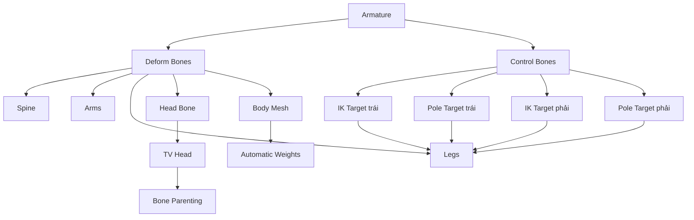
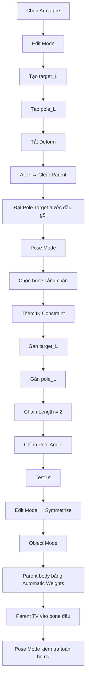

# 083 — IK & Parenting

| Thuộc tính       | Nội dung                        |
| ---------------- | ------------------------------- |
| **Module**       | Module 05 — Rigging & Animation |
| **Bài học**      | IK & Parenting                  |
| **Thời lượng**   | 10:38                           |
| **Chủ đề chính** | Inverse Kinematics và Parenting |
| **Phần mềm**     | Blender                         |
| **Mức độ**       | Cơ bản                          |

---

## 1. Mục tiêu bài học

Sau bài học này, anh có thể:

* Phân biệt **Forward Kinematics — FK** và **Inverse Kinematics — IK**.
* Hiểu vì sao IK thường được sử dụng cho chân nhân vật.
* Tạo **IK Target** để điều khiển vị trí bàn chân.
* Tạo **Pole Target** để kiểm soát hướng đầu gối.
* Thiết lập **IK Constraint** cho chuỗi xương chân.
* Đối xứng hệ thống IK sang chân còn lại bằng `Symmetrize`.
* Gắn cơ thể nhân vật vào Armature bằng **Automatic Weights**.
* Gắn một vật thể cứng, chẳng hạn đầu TV, trực tiếp vào một bone cụ thể.

---

## 2. Tổng quan FK và IK

### 2.1. Forward Kinematics — FK

**Forward Kinematics** là phương pháp điều khiển xương theo hướng từ bone cha đến bone con.

Khi tạo tư thế cho chân bằng FK, người dùng phải lần lượt:

1. Xoay bone đùi.
2. Xoay bone cẳng chân.
3. Xoay bone bàn chân.
4. Quay lại điều chỉnh các bone trước đó nếu tư thế chưa đúng.

```text
Hông
 └── Đùi
      └── Cẳng chân
           └── Bàn chân
```

Mỗi bone con chịu ảnh hưởng từ bone cha. Vì vậy, khi xoay bone đùi, toàn bộ cẳng chân và bàn chân cũng di chuyển theo.

### Ưu điểm của FK

* Dễ hiểu và dễ thiết lập.
* Phù hợp với chuyển động theo cung tròn tự nhiên.
* Rất hữu ích cho tay trong các chuyển động đi bộ hoặc chạy.
* Cho phép kiểm soát chính xác góc xoay của từng khớp.

### Hạn chế của FK

* Phải điều chỉnh nhiều bone.
* Khó giữ bàn chân hoặc bàn tay cố định tại một vị trí.
* Việc tạo tư thế chân có thể mất nhiều thời gian.
* Dễ phải quay lại chỉnh sửa các bone trước đó.

---

### 2.2. Inverse Kinematics — IK

**Inverse Kinematics** hoạt động theo chiều ngược lại.

Thay vì xoay từng bone trong chuỗi, người dùng chỉ cần di chuyển một bone điều khiển ở cuối chuỗi. Blender sẽ tự động tính toán góc xoay của các bone phía trên.

Ví dụ với chân:

```text
IK Target di chuyển
        ↓
Blender tính góc cẳng chân
        ↓
Blender tính góc đùi
        ↓
Bàn chân đến đúng vị trí Target
```

Chuỗi điều khiển thường có dạng:

```text
Đùi ── Cẳng chân ── Bàn chân
          ↑
     IK Constraint

IK Target     → Điều khiển vị trí bàn chân
Pole Target   → Điều khiển hướng đầu gối
```

### Ưu điểm của IK

* Dễ đặt bàn chân vào đúng vị trí.
* Có thể giữ bàn chân cố định trên mặt đất.
* Di chuyển cơ thể lên xuống mà bàn chân vẫn đứng yên.
* Tạo tư thế chân nhanh hơn FK.
* Rất hữu ích cho walk cycle, run cycle và các tư thế tiếp xúc với mặt đất.

### Hạn chế của IK

* Cần thêm các bone điều khiển.
* Phải thiết lập Pole Target đúng cách.
* Có thể xuất hiện hiện tượng khớp lật hoặc cong sai hướng.
* Không phải lúc nào cũng phù hợp với chuyển động xoay tự do.

---

## 3. So sánh FK và IK

| Tiêu chí                      | FK                             | IK                                  |
| ----------------------------- | ------------------------------ | ----------------------------------- |
| **Cách điều khiển**           | Xoay từng bone từ gốc đến ngọn | Di chuyển target ở cuối chuỗi       |
| **Hướng tính toán**           | Bone cha → Bone con            | Bone cuối → Tính ngược lên bone cha |
| **Điều khiển chân**           | Khó hơn                        | Dễ hơn                              |
| **Giữ bàn chân trên sàn**     | Khó                            | Dễ                                  |
| **Điều khiển tay khi đi bộ**  | Tự nhiên, dễ sử dụng           | Có thể không cần thiết              |
| **Tay tựa vào tường**         | Khó giữ cố định                | IK rất hữu ích                      |
| **Số bone cần thao tác**      | Nhiều                          | Ít                                  |
| **Độ phức tạp khi thiết lập** | Thấp                           | Cao hơn                             |

### Lựa chọn thường gặp

* **Chân:** sử dụng IK.
* **Tay trong walk cycle:** sử dụng FK.
* **Tay chống lên bàn hoặc tựa vào tường:** sử dụng IK.
* **Rig nâng cao:** cho phép chuyển đổi giữa FK và IK.

---

## 4. Vì sao chân thường sử dụng IK?

Trong walk cycle, bàn chân cần có những thời điểm đứng yên trên mặt đất.

Nếu sử dụng FK, người làm animation phải liên tục điều chỉnh:

* Đùi.
* Cẳng chân.
* Bàn chân.
* Vị trí hông.
* Độ tiếp xúc giữa bàn chân và mặt đất.

Nếu sử dụng IK, chỉ cần đặt **IK Target** tại vị trí bàn chân. Khi di chuyển phần thân xuống thấp hoặc lên cao, hệ thống chân sẽ tự động gập lại trong khi bàn chân vẫn giữ nguyên vị trí.

```text
          Thân hạ xuống
               ↓
             Hông
              │
             Đùi
              │
          Cẳng chân
              │
Bàn chân ─────┴───── IK Target cố định trên sàn
```

Đây là lý do các rig nhân vật hình người thường sử dụng IK cho chân.

---

# Phần I — Tạo IK Target và Pole Target

## 5. Tạo bone Target cho bàn chân

Bone Target là bone điều khiển vị trí cuối của chuỗi IK.

### Các bước thực hiện

1. Chọn **Armature**.
2. Chuyển sang **Edit Mode**.
3. Chuyển sang góc nhìn cạnh để dễ quan sát.
4. Chọn khớp tại mắt cá chân.
5. Nhấn `E` để Extrude một bone mới.
6. Di chuyển bone mới ra phía sau theo trục `Y`.
7. Đổi tên bone thành:

```text
target_L
```

Trong đó:

* `target` cho biết đây là IK Target.
* `_L` cho biết bone thuộc bên trái — Left.

Bone này sẽ được sử dụng để điều khiển vị trí chân trái.

---

## 6. Tạo Pole Target

Pole Target xác định hướng mà đầu gối sẽ chĩa tới.

### Các bước thực hiện

1. Vẫn trong **Edit Mode**.
2. Extrude thêm một bone từ khu vực chân.
3. Đưa bone này ra phía trước đầu gối.
4. Đổi tên bone thành:

```text
pole_L
```

### Vai trò của Pole Target

Một chuỗi IK gồm đùi và cẳng chân có thể gập theo nhiều hướng khác nhau mà bàn chân vẫn chạm đúng IK Target.

```text
Không có Pole Target:

        Đùi
         │
        Gối  ← Có thể quay nhiều hướng
         │
      Cẳng chân
         │
      Bàn chân
```

Pole Target giải quyết vấn đề này bằng cách chỉ định hướng đầu gối:

```text
Pole Target
     ●
     ↑
Đầu gối luôn hướng về đây
```

---

## 7. Tắt Deform cho các control bone

Các bone `target_L` và `pole_L` chỉ được dùng để điều khiển rig. Chúng không nên trực tiếp làm biến dạng mesh.

### Cách thực hiện

1. Chọn bone `target_L`.
2. Mở **Bone Properties**.
3. Bỏ chọn:

```text
Deform
```

4. Thực hiện tương tự với bone `pole_L`.

### Tại sao phải tắt Deform?

Khi sử dụng **Automatic Weights**, Blender sẽ tạo các Vertex Group dựa trên những bone có khả năng biến dạng.

Nếu không tắt Deform:

* Mesh có thể bị hút về phía IK Target.
* Đầu gối có thể bị biến dạng theo Pole Target.
* Automatic Weights có thể tạo thêm các Vertex Group không cần thiết.

> Control bone dùng để điều khiển rig, không dùng để trực tiếp biến dạng mesh.

---

## 8. Gỡ quan hệ Parent của control bone

IK Target và Pole Target cần di chuyển độc lập. Vì vậy, chúng không được tiếp tục kế thừa chuyển động từ chuỗi xương chân.

### Các bước thực hiện

1. Chọn `target_L`.
2. Nhấn:

```text
Alt + P
```

3. Chọn:

```text
Clear Parent
```

4. Thực hiện tương tự với `pole_L`.

### Kết quả mong muốn

```text
Armature
├── Chuỗi xương cơ thể
│   ├── Đùi
│   ├── Cẳng chân
│   └── Bàn chân
│
├── target_L    ← Độc lập
└── pole_L      ← Độc lập
```

Bone vẫn thuộc cùng Armature, nhưng không còn là bone con của chuỗi chân.

> `Clear Parent` không có nghĩa là tách bone khỏi Armature. Nó chỉ xóa quan hệ cha–con giữa các bone.

---

## 9. Đặt vị trí Pole Target

Sau khi gỡ Parent, chọn `pole_L` và di chuyển nó ra phía trước đầu gối.

Ví dụ:

```text
G → Y
```

Pole Target nên:

* Nằm phía trước đầu gối.
* Có khoảng cách đủ xa để hệ thống ổn định.
* Nằm gần mặt phẳng chuyển động của chân.
* Không nằm quá sát đầu gối.
* Không lệch quá nhiều sang trái hoặc phải.

### Góc nhìn cạnh

```text
               pole_L
                  ●
                  |
                  |
        Đùi     Đầu gối
          \       ●
           \     /
            \   /
          Cẳng chân
                \
                 ● Bàn chân
```

---

# Phần II — Thiết lập IK Constraint

## 10. Chuyển sang Pose Mode

IK Constraint được thiết lập trong **Pose Mode**, không phải Edit Mode.

1. Chọn Armature.
2. Chuyển từ Edit Mode sang:

```text
Pose Mode
```

3. Chọn bone cẳng chân — bone thứ hai trong chuỗi chân.

Chuỗi chân được tính như sau:

```text
Bone 1: Đùi
Bone 2: Cẳng chân
Bone 3: Bàn chân
```

Trong bài học này, IK Constraint được đặt trên bone cẳng chân. Bone bàn chân sẽ được xoay độc lập khi cần.

---

## 11. Thêm IK Constraint

Khi bone cẳng chân đang được chọn:

1. Mở **Bone Constraints Properties**.
2. Chọn:

```text
Add Bone Constraint
```

3. Trong nhóm Tracking, chọn:

```text
Inverse Kinematics
```

Sau khi thêm constraint, bone có thể đổi màu và xuất hiện đường nét đứt biểu thị liên kết với target.

### Phím tắt

Có thể dùng:

```text
Shift + Ctrl + C
```

để mở menu thêm constraint nhanh trong Pose Mode.

Tuy nhiên, dùng Bone Constraints Properties thường dễ kiểm tra đầy đủ các tham số hơn.

---

## 12. Gán IK Target

Trong IK Constraint:

### Target

Chọn object Armature hiện tại:

```text
Target: Armature
```

Target ở đây là **object chứa bone**, không phải tên bone điều khiển.

### Bone hoặc Subtarget

Chọn bone:

```text
target_L
```

Sau bước này, khi di chuyển `target_L`, chuỗi chân sẽ cố gắng di chuyển theo target.

---

## 13. Gán Pole Target

Trong cùng IK Constraint:

### Pole Target

Chọn Armature:

```text
Pole Target: Armature
```

### Pole Bone hoặc Pole Subtarget

Chọn:

```text
pole_L
```

Sau khi thiết lập Pole Target, hệ thống chân có thể tạm thời bị xoắn hoặc quay sai hướng. Đây thường không phải lỗi rig mà là do Pole Angle chưa đúng.

---

## 14. Thiết lập Chain Length

`Chain Length` xác định số bone phía trên chịu ảnh hưởng của IK Constraint.

Trong bài học, chân có hai bone chính cần được giải IK:

1. Cẳng chân.
2. Đùi.

Do đó đặt:

```text
Chain Length = 2
```

### Minh họa

```text
Hông                Không bị IK điều khiển
 │
Đùi       ← Bone thứ hai trong chuỗi IK
 │
Cẳng chân ← Bone chứa IK Constraint
 │
Bàn chân  ← Điều khiển riêng
```

### Nếu đặt sai Chain Length

| Giá trị | Kết quả có thể xảy ra                      |
| ------: | ------------------------------------------ |
|     `0` | IK có thể ảnh hưởng toàn bộ chuỗi bone cha |
|     `1` | Chỉ cẳng chân bị ảnh hưởng                 |
|     `2` | Đùi và cẳng chân bị ảnh hưởng              |
|    `3+` | Có thể ảnh hưởng cả hông hoặc cơ thể       |

Với cấu trúc chân hai đoạn, `Chain Length = 2` thường là lựa chọn phù hợp.

---

## 15. Điều chỉnh Pole Angle

Sau khi thêm Pole Target, đầu gối có thể:

* Quay ra phía sau.
* Chĩa sang bên.
* Xoắn bất thường.
* Không hướng về Pole Target.

Khi đó, điều chỉnh:

```text
Pole Angle
```

Các giá trị thường gặp:

```text
90°
-90°
180°
-180°
```

Giá trị chính xác phụ thuộc vào:

* Bone Roll.
* Hướng bone được tạo.
* Trục local của bone.
* Cách Armature được đối xứng.

> Không có một giá trị Pole Angle cố định cho mọi rig.

Mục tiêu không phải là sử dụng đúng một con số cụ thể, mà là làm cho đầu gối hướng đúng về phía `pole_L`.

---

## 16. Bone Roll và Pole Angle

Bone Roll xác định hướng xoay cục bộ quanh trục dài của bone.

Hai rig nhìn giống nhau từ bên ngoài vẫn có thể cần Pole Angle khác nhau nếu Bone Roll khác nhau.

```text
Bone giống vị trí
      +
Bone Roll khác
      ↓
Pole Angle cần thiết khác
```

Nếu Bone Roll đã được thiết lập tương đối phẳng và đồng nhất, Pole Angle thường là bội số của `90°`.

---

## 17. Kiểm tra hệ thống IK

Sau khi thiết lập xong:

### Kiểm tra IK Target

1. Chọn `target_L`.
2. Nhấn `G`.
3. Di chuyển target.

Kết quả mong muốn:

* Đùi và cẳng chân tự động xoay.
* Bàn chân đi theo target.
* Chuỗi chân không kéo theo toàn bộ cơ thể.
* Đầu gối cong đúng hướng.

### Kiểm tra Pole Target

1. Chọn `pole_L`.
2. Nhấn `G`.
3. Di chuyển sang trái hoặc phải.

Kết quả mong muốn:

* Hướng đầu gối thay đổi theo Pole Target.
* Bàn chân vẫn giữ gần vị trí IK Target.
* Chuỗi chân không bị lật bất thường.

### Kiểm tra phần thân

1. Chọn bone gốc hoặc bone hông.
2. Di chuyển cơ thể lên xuống.

Kết quả mong muốn:

* Cơ thể hạ xuống thì đầu gối gập lại.
* Cơ thể nâng lên thì chân duỗi ra.
* Bàn chân vẫn được giữ ở vị trí target.

---

# Phần III — Đối xứng hệ thống IK

## 18. Symmetrize sang chân phải

Sau khi hoàn thành IK cho chân trái, có thể tạo hệ thống tương ứng cho chân phải bằng `Symmetrize`.

### Điều kiện đặt tên

Bone bên trái cần có hậu tố:

```text
.L
```

hoặc tùy quy ước:

```text
_L
```

Tuy nhiên, quy tắc tên chuẩn của Blender thường là:

```text
target.L
pole.L
```

Blender có thể tự chuyển thành:

```text
target.R
pole.R
```

### Các bước thực hiện

1. Chuyển về **Edit Mode**.
2. Chọn các bone thuộc hệ thống bên trái.
3. Nhấp chuột phải.
4. Chọn:

```text
Symmetrize
```

### Lưu ý

Không thể thực hiện Symmetrize bone trong Pose Mode. Cần chuyển sang Edit Mode trước.

---

## 19. Kiểm tra chân đối xứng

Sau khi Symmetrize:

1. Chuyển sang Pose Mode.
2. Chọn Pole Target bên phải.
3. Di chuyển để kiểm tra hướng đầu gối.
4. Chọn IK Target bên phải.
5. Di chuyển để kiểm tra chuỗi chân.

Cần kiểm tra:

* Target bên phải điều khiển đúng chân phải.
* Pole Target không điều khiển nhầm chân trái.
* Chain Length đúng bằng `2`.
* Pole Angle tạo hướng gập tự nhiên.
* Tên bone bên trái và bên phải không bị trùng.

---

# Phần IV — Parenting cơ thể với Armature

## 20. Parenting là gì?

**Parenting** tạo mối quan hệ phụ thuộc giữa các object hoặc giữa object với bone.

Trong rigging, Parenting thường được sử dụng theo hai cách:

### Mesh biến dạng theo nhiều bone

```text
Mesh → Armature → Automatic Weights
```

Phù hợp với:

* Cơ thể.
* Tay.
* Chân.
* Quần áo mềm.
* Những vật thể cần uốn cong theo nhiều khớp.

### Object cứng đi theo một bone

```text
Object → Bone cụ thể
```

Phù hợp với:

* Đầu TV.
* Mũ bảo hiểm.
* Thanh kiếm.
* Ba lô.
* Phụ kiện cứng.
* Đạo cụ cầm trên tay.

---

## 21. Parent cơ thể bằng Automatic Weights

### Thứ tự chọn rất quan trọng

1. Chọn mesh cơ thể trước.
2. Giữ `Shift`.
3. Chọn Armature sau cùng.

Armature phải là **Active Object**.

Thông thường, Active Object được hiển thị bằng viền sáng hơn các object còn lại.

### Thực hiện Parenting

Nhấn:

```text
Ctrl + P
```

Chọn:

```text
Armature Deform
└── With Automatic Weights
```

Blender sẽ:

1. Thêm **Armature Modifier** vào mesh.
2. Tạo Vertex Group tương ứng với các deform bone.
3. Tự động tính trọng số ảnh hưởng.
4. Cho phép mesh biến dạng khi bone di chuyển.

---

## 22. Automatic Weights hoạt động như thế nào?

Mỗi vertex trên mesh có thể chịu ảnh hưởng từ một hoặc nhiều bone.

Ví dụ một vertex ở đầu gối:

```text
Thigh.L = 0.45
Shin.L  = 0.55
```

Tổng trọng số thường bằng:

```text
0.45 + 0.55 = 1.00
```

Khi đùi và cẳng chân xoay, vertex sẽ di chuyển theo tỉ lệ ảnh hưởng của từng bone.

### Dữ liệu được tạo

```text
Mesh
├── Armature Modifier
└── Vertex Groups
    ├── spine
    ├── head
    ├── upper_arm.L
    ├── forearm.L
    ├── thigh.L
    ├── shin.L
    └── ...
```

Control bone đã tắt `Deform` sẽ không được dùng để làm biến dạng mesh.

---

## 23. Kiểm tra mesh sau khi Parent

Sau khi sử dụng Automatic Weights:

1. Chọn Armature.
2. Chuyển sang Pose Mode.
3. Xoay một bone tay.
4. Di chuyển IK Target của chân.
5. Di chuyển bone thân hoặc bone hông.

Kiểm tra các vùng:

* Vai.
* Nách.
* Khuỷu tay.
* Hông.
* Đầu gối.
* Mắt cá chân.
* Phần giao nhau giữa tay và thân.

### Kết quả tốt

* Mesh đi theo bone.
* Các khớp gập tương đối tự nhiên.
* Không có phần mesh bị bỏ lại.
* Không có vùng mesh bị kéo sang bên đối diện.
* Control bone không kéo mesh.

---

# Phần V — Parent đầu TV vào một bone

## 24. Vì sao không dùng Automatic Weights cho đầu TV?

Đầu TV là một vật thể cứng. Nó không cần:

* Uốn cong.
* Co giãn theo nhiều bone.
* Chia trọng số giữa các khớp.
* Weight Painting.

Do đó, đầu TV nên được Parent trực tiếp vào bone đầu hoặc bone cổ.

```text
Bone đầu xoay
      ↓
Toàn bộ TV xoay theo như một khối cứng
```

---

## 25. Chọn bone làm Parent

Blender ghi nhớ bone đang được chọn trong Armature.

Quy trình:

1. Chọn Armature.
2. Chuyển sang Pose Mode.
3. Chọn bone đầu.
4. Chuyển về Object Mode.

Bone đầu vừa chọn sẽ vẫn là **active bone** của Armature.

---

## 26. Parent đầu TV vào bone

Trong Object Mode:

1. Chọn object TV.
2. Giữ `Shift`.
3. Chọn Armature.
4. Đảm bảo bone đầu đã được chọn trước đó.
5. Nhấn:

```text
Ctrl + P
```

6. Chọn:

```text
Bone
```

Sau khi Parent, TV sẽ đi theo bone đầu.

### Kiểm tra

1. Chọn Armature.
2. Chuyển sang Pose Mode.
3. Chọn bone đầu.
4. Nhấn `R` để xoay.

Kết quả mong muốn:

* TV xoay theo bone đầu.
* TV không bị biến dạng.
* TV giữ nguyên hình dạng.
* Vị trí tương đối giữa TV và cổ không thay đổi.

---

## 27. Sơ đồ toàn bộ hệ thống



---

## 28. Quy trình thực hành hoàn chỉnh



---

## 29. Phím tắt và công cụ liên quan

| Phím tắt hoặc thao tác     | Chức năng                                        |
| -------------------------- | ------------------------------------------------ |
| `Tab`                      | Chuyển giữa Object Mode và Edit Mode             |
| `Ctrl + Tab`               | Mở menu chuyển Pose Mode hoặc các mode liên quan |
| `E`                        | Extrude bone mới                                 |
| `G`                        | Di chuyển bone                                   |
| `R`                        | Xoay bone                                        |
| `G`, `Y`                   | Di chuyển theo trục Y                            |
| `G`, `Z`                   | Di chuyển theo trục Z                            |
| `Alt + P`                  | Xóa quan hệ Parent của bone hoặc object          |
| `Ctrl + P`                 | Tạo Parenting                                    |
| `Shift + Ctrl + C`         | Mở menu thêm Bone Constraint                     |
| **Bone Constraints**       | Quản lý IK và các constraint của bone            |
| **Inverse Kinematics**     | Constraint điều khiển chuỗi bone bằng target     |
| **Chain Length**           | Số bone chịu ảnh hưởng từ IK                     |
| **Pole Target**            | Xác định hướng gập của đầu gối hoặc khuỷu tay    |
| **Pole Angle**             | Hiệu chỉnh hướng xoay quanh chuỗi IK             |
| **Symmetrize**             | Sao chép và đối xứng bone sang phía còn lại      |
| **With Automatic Weights** | Parent mesh và tự động tính trọng số             |
| **Bone**                   | Parent object cứng vào một bone cụ thể           |

---

## 30. Lỗi thường gặp và cách khắc phục

### 30.1. Đầu gối cong sai hướng

**Nguyên nhân:**

* Chưa có Pole Target.
* Pole Target đặt sai vị trí.
* Pole Angle chưa đúng.
* Bone Roll khác với rig mẫu.

**Cách khắc phục:**

* Đưa Pole Target ra phía trước đầu gối.
* Thử các giá trị `90°`, `-90°`, `180°`.
* Kiểm tra Bone Roll.
* Tránh đặt Pole Target quá gần đầu gối.

---

### 30.2. IK kéo cả cơ thể

**Nguyên nhân:**

* Chain Length bằng `0`.
* Chain Length quá lớn.
* Cấu trúc Parent của chuỗi bone chưa đúng.

**Cách khắc phục:**

```text
Chain Length = 2
```

Sau đó kiểm tra lại quan hệ cha–con của đùi, cẳng chân và hông.

---

### 30.3. Control bone làm biến dạng mesh

**Nguyên nhân:**

* Bone `target` hoặc `pole` vẫn bật Deform.
* Mesh đã được Parent trước khi tắt Deform.

**Cách khắc phục:**

1. Tắt `Deform` cho control bone.
2. Xóa Vertex Group thừa nếu cần.
3. Parent lại bằng Automatic Weights.

---

### 30.4. Target di chuyển theo cơ thể

**Nguyên nhân:**

* IK Target vẫn còn Parent với một bone trong chuỗi chân.

**Cách khắc phục:**

```text
Edit Mode
→ Chọn Target
→ Alt + P
→ Clear Parent
```

---

### 30.5. Automatic Weights báo lỗi

Một lỗi phổ biến là:

```text
Bone Heat Weighting: failed to find solution
```

**Nguyên nhân có thể gồm:**

* Mesh có topology lỗi.
* Có vertex hoặc face trùng nhau.
* Mesh quá mỏng hoặc có phần giao nhau.
* Scale chưa được Apply.
* Bone nằm ngoài mesh.
* Mesh có nhiều phần rời không hợp lý.

**Cách xử lý:**

1. Chọn mesh và Armature.
2. Nhấn `Ctrl + A`.
3. Apply Rotation và Scale.
4. Kiểm tra duplicate vertex bằng Merge by Distance.
5. Recalculate Normals.
6. Kiểm tra vị trí bone.
7. Thử Parent lại.

---

### 30.6. Tay hoặc chân bên này làm biến dạng bên kia

**Nguyên nhân:**

Automatic Weights phân bố trọng số không chính xác, đặc biệt khi:

* Hai chân đặt quá gần nhau.
* Hai tay áp sát thân.
* Các phần mesh giao nhau.
* Mesh có topology chưa phù hợp.

**Cách khắc phục:**

* Chỉnh sửa bằng Weight Paint.
* Xóa trọng số khỏi Vertex Group sai.
* Sử dụng chế độ đối xứng khi Weight Paint.
* Tạm thời đưa tay và chân ra xa thân trước khi Parent.

---

### 30.7. TV không đi theo bone đầu

**Nguyên nhân:**

* Chọn sai thứ tự object.
* Armature không phải Active Object.
* Bone đầu chưa là active bone.
* Đã chọn `Object` thay vì `Bone` trong menu Parent.

**Cách khắc phục:**

1. Trong Pose Mode, chọn bone đầu.
2. Quay về Object Mode.
3. Chọn TV trước.
4. Shift chọn Armature sau.
5. `Ctrl + P` → `Bone`.

---

### 30.8. TV bị biến dạng

**Nguyên nhân:**

TV được Parent bằng Automatic Weights thay vì Bone Parenting.

**Cách khắc phục:**

* Xóa Parent cũ bằng `Alt + P`.
* Xóa Armature Modifier nếu không cần.
* Parent lại bằng tùy chọn `Bone`.

---

## 31. Thứ tự chọn khi Parenting

### Parent mesh biến dạng vào Armature

```text
1. Chọn Mesh
2. Shift + chọn Armature
3. Ctrl + P
4. With Automatic Weights
```

### Parent object cứng vào Bone

```text
1. Trong Pose Mode, chọn Bone
2. Quay về Object Mode
3. Chọn Object cứng
4. Shift + chọn Armature
5. Ctrl + P
6. Bone
```

---

## 32. Checklist thực hành

### Thiết lập IK

* [ ] Đã tạo bone `target_L`.
* [ ] Đã tạo bone `pole_L`.
* [ ] Đã tắt Deform cho hai control bone.
* [ ] Đã Clear Parent cho Target và Pole Target.
* [ ] Pole Target nằm phía trước đầu gối.
* [ ] Đã thêm IK Constraint vào bone cẳng chân.
* [ ] Target Object được đặt thành Armature.
* [ ] Subtarget được đặt thành `target_L`.
* [ ] Pole Target Object được đặt thành Armature.
* [ ] Pole Subtarget được đặt thành `pole_L`.
* [ ] Chain Length được đặt bằng `2`.
* [ ] Pole Angle đã được điều chỉnh.
* [ ] Đầu gối cong đúng hướng.

### Đối xứng rig

* [ ] Đã Symmetrize hệ thống IK sang chân phải.
* [ ] Target bên phải điều khiển đúng chân phải.
* [ ] Pole Target bên phải điều khiển đúng đầu gối phải.
* [ ] Tên bone trái và phải chính xác.

### Parenting

* [ ] Đã Apply Rotation và Scale cho mesh và Armature.
* [ ] Đã Parent cơ thể bằng Automatic Weights.
* [ ] Mesh biến dạng theo các deform bone.
* [ ] Control bone không làm biến dạng mesh.
* [ ] Đã Parent đầu TV trực tiếp vào bone đầu.
* [ ] TV chuyển động như một vật thể cứng.
* [ ] Đã kiểm tra rig trong Pose Mode.
* [ ] Đã lưu file Blender.

---

## 33. Bài tập thực hành

### Bài tập 1 — Kiểm tra bàn chân cố định

1. Đặt hai IK Target trên mặt đất.
2. Di chuyển bone hông xuống thấp.
3. Quan sát hai chân tự động gập lại.
4. Kiểm tra bàn chân có giữ nguyên vị trí hay không.

### Bài tập 2 — Điều khiển hướng đầu gối

1. Chọn Pole Target.
2. Di chuyển sang trái và phải.
3. Quan sát hướng đầu gối.
4. Đưa Pole Target về vị trí tự nhiên phía trước chân.

### Bài tập 3 — So sánh FK và IK

Tạo cùng một tư thế chân bằng hai cách:

* Lần thứ nhất dùng FK.
* Lần thứ hai dùng IK.

So sánh:

* Số bone phải thao tác.
* Thời gian tạo tư thế.
* Khả năng giữ bàn chân trên mặt đất.
* Mức độ dễ sửa tư thế.

### Bài tập 4 — Kiểm tra Parenting

Trong Pose Mode, thử:

* Xoay bone đầu.
* Xoay hai cánh tay.
* Di chuyển hai IK Target.
* Hạ thấp phần thân.
* Di chuyển Pole Target.

Ghi lại những vùng mesh bị biến dạng chưa tốt để chuẩn bị cho bước Weight Painting.

---

## 34. Kiến thức cốt lõi

### Công thức tư duy FK

```text
Xoay bone cha
→ Bone con di chuyển theo
→ Tiếp tục xoay từng bone
→ Tạo được tư thế cuối
```

### Công thức tư duy IK

```text
Đặt vị trí cuối chuỗi
→ Blender tính ngược góc các khớp
→ Pole Target xác định hướng gập
→ Chuỗi bone đạt tới vị trí mục tiêu
```

### Công thức Parenting cơ thể

```text
Mesh + Armature
→ Automatic Weights
→ Vertex Groups
→ Armature Modifier
→ Mesh biến dạng theo bone
```

### Công thức Parenting vật thể cứng

```text
Object cứng + Bone
→ Bone Parenting
→ Object đi theo bone
→ Không bị biến dạng
```

---

## 35. Tóm tắt bài học

**Forward Kinematics — FK** điều khiển chuyển động bằng cách xoay từng bone từ gốc đến ngọn. Phương pháp này đơn giản, trực quan và phù hợp với nhiều chuyển động của tay.

**Inverse Kinematics — IK** cho phép di chuyển một target ở cuối chuỗi bone. Blender sẽ tự động tính toán góc của các bone phía trên. IK đặc biệt hữu ích cho chân vì giúp giữ bàn chân cố định trên mặt đất.

Một hệ thống IK chân cơ bản gồm:

* Chuỗi bone đùi và cẳng chân.
* Một IK Target điều khiển vị trí bàn chân.
* Một Pole Target điều khiển hướng đầu gối.
* Một IK Constraint với `Chain Length = 2`.
* Pole Angle được điều chỉnh theo Bone Roll.

Sau khi hoàn thành Armature:

* Cơ thể được Parent bằng **With Automatic Weights** để có thể biến dạng theo nhiều bone.
* Đầu TV được Parent trực tiếp vào bone đầu vì đây là một vật thể cứng, không cần Weight Painting.

Quy trình này tạo nền tảng để tiếp tục chỉnh sửa trọng số, hoàn thiện bộ điều khiển và tạo walk cycle cho nhân vật.
