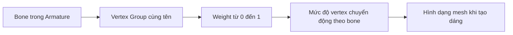
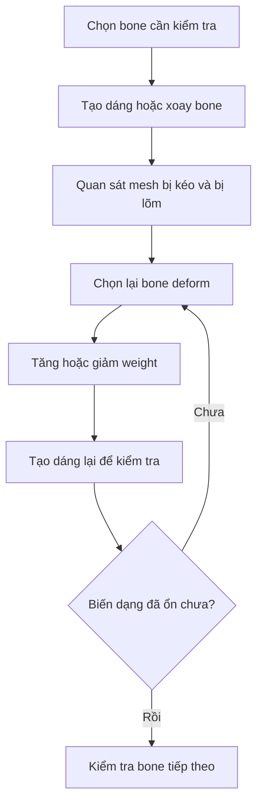
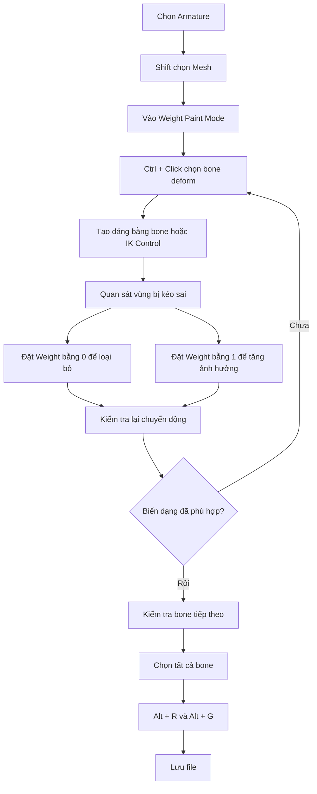

# 084 — Weight Painting

| Thuộc tính       | Nội dung                                      |
| ---------------- | --------------------------------------------- |
| **Module**       | Module 05 — Rigging & Animation               |
| **Bài học**      | Weight Painting                               |
| **Thời lượng**   | 7:31                                          |
| **Chủ đề chính** | Tinh chỉnh mức độ ảnh hưởng của bone lên mesh |

---

## 1. Mục tiêu bài học

Sau bài học này, chúng ta có thể:

* Hiểu ý nghĩa của màu sắc trong chế độ **Weight Paint**.
* Chọn bone trực tiếp khi đang Weight Painting.
* Kiểm tra biến dạng của nhân vật bằng cách tạo dáng cho armature.
* Loại bỏ ảnh hưởng không mong muốn của bone lên phần thân.
* Tinh chỉnh trọng số tại vai và hông.
* Kiểm tra nhanh toàn bộ hệ thống rig trước khi bắt đầu animation.
* Đưa nhân vật trở về tư thế ban đầu sau khi kiểm tra.

---

## 2. Weight Painting là gì?

**Weight Painting** là phương pháp xác định mức độ ảnh hưởng của từng bone lên các vertex của mesh.

Mỗi vertex có thể chịu ảnh hưởng từ một hoặc nhiều bone với giá trị trọng số nằm trong khoảng:

```text
0.0 ───────────────────────────── 1.0
Không ảnh hưởng             Ảnh hưởng hoàn toàn
```

Khi một bone chuyển động:

* Vertex có weight bằng `1` sẽ chuyển động hoàn toàn theo bone.
* Vertex có weight bằng `0` sẽ không chịu ảnh hưởng.
* Vertex có weight ở giữa `0` và `1` sẽ chỉ chuyển động một phần.

### Quan hệ giữa các thành phần



Weight thường được tạo tự động khi sử dụng:

```text
Parent → With Automatic Weights
```

Tuy nhiên, kết quả tự động không phải lúc nào cũng chính xác. Các vùng dễ gặp lỗi nhất gồm:

* Vai và nách.
* Hông và háng.
* Khuỷu tay.
* Đầu gối.
* Cổ tay và bàn tay.
* Những khu vực nằm gần nhiều bone.

---

## 3. Ý nghĩa của thang màu Weight Paint

Khi chọn một bone trong Weight Paint Mode, mesh sẽ được hiển thị bằng một dải màu nhiệt.

| Màu sắc        | Weight gần đúng | Ý nghĩa                       |
| -------------- | --------------: | ----------------------------- |
| Đỏ             |           `1.0` | Bone ảnh hưởng hoàn toàn      |
| Cam            |      `0.75–1.0` | Ảnh hưởng rất mạnh            |
| Vàng           |      `0.5–0.75` | Ảnh hưởng trung bình đến mạnh |
| Xanh lá        |    Khoảng `0.5` | Ảnh hưởng trung bình          |
| Xanh nhạt      |       `0.0–0.5` | Ảnh hưởng yếu                 |
| Xanh dương đậm |           `0.0` | Không chịu ảnh hưởng          |

```text
Không ảnh hưởng                                Ảnh hưởng hoàn toàn
      0.0                                                1.0
       │                                                   │
       ▼                                                   ▼
Xanh dương ── Xanh nhạt ── Xanh lá ── Vàng ── Cam ── Đỏ
```

Mục tiêu không phải là làm mọi vùng chuyển màu đỏ. Mỗi bone chỉ nên ảnh hưởng đến đúng phần cơ thể mà nó điều khiển.

---

## 4. Thiết lập để chọn bone trong Weight Paint Mode

Nếu chỉ chọn mesh rồi vào Weight Paint Mode, chúng ta có thể nhìn thấy trọng số nhưng khó chuyển nhanh giữa các bone.

Để vừa Weight Painting vừa chọn được bone:

1. Chuyển armature từ **Pose Mode** về **Object Mode**.
2. Chọn **Armature trước**.
3. Giữ `Shift` và chọn **mesh sau**.
4. Mesh phải là **active object**.
5. Nhấn `Ctrl + Tab`.
6. Chọn **Weight Paint** trong Pie Menu.

Thứ tự lựa chọn:

```text
Armature trước
      ↓
Shift + chọn Mesh sau
      ↓
Mesh trở thành Active Object
      ↓
Vào Weight Paint Mode
```

Sau khi thiết lập đúng, có thể giữ:

```text
Ctrl + Left Click
```

lên một bone để xem và chỉnh weight của bone đó.

> Các bone điều khiển không deform, chẳng hạn IK Control hoặc Pole Target, thường không có trọng số trên mesh. Tuy nhiên, chúng vẫn có thể được chọn và di chuyển để kiểm tra tư thế nhân vật.

---

## 5. Kiểm tra biến dạng bằng cách tạo dáng

Không nên chỉnh weight khi nhân vật chỉ đứng ở tư thế mặc định.

Một vùng weight có thể trông bình thường ở tư thế nghỉ nhưng bị lỗi khi bone xoay hoặc di chuyển.

Quy trình kiểm tra nên là:



### Với bone thuộc IK Chain

Một số bone không thể xoay trực tiếp vì chúng đang nằm trong hệ thống **Inverse Kinematics – IK**.

Ví dụ với chân:

* Không xoay trực tiếp từng bone chân.
* Chọn bone điều khiển bàn chân.
* Nhấn `G` để di chuyển IK Control.
* Toàn bộ chân sẽ thay đổi tư thế theo chuỗi IK.

Điều này giúp kiểm tra vùng hông, đùi và đầu gối trong tư thế thực tế hơn.

---

# 6. Thực hành 1 — Sửa weight ở vai và cánh tay

## 6.1. Phát hiện lỗi

Khi xoay bone cánh tay trên vào phía thân, phần thân có thể bị kéo theo, tạo thành:

* Một khoảng hở ở nách.
* Một vùng lõm không tự nhiên.
* Phần ngực hoặc lưng bị kéo về phía cánh tay.
* Một vài vertex ở thân chuyển động dù không nên chịu ảnh hưởng.

Nguyên nhân là bone cánh tay trên có weight dư trên phần thân.

---

## 6.2. Chọn bone cánh tay trên

Giữ:

```text
Ctrl + Left Click
```

vào bone cánh tay trên.

Mesh sẽ hiển thị trọng số của bone này.

Nếu thấy màu xanh nhạt, xanh lá hoặc vàng lan quá sâu vào phần thân, bone đang có ảnh hưởng không cần thiết tại đó.

---

## 6.3. Đặt Weight bằng 0

Để loại bỏ ảnh hưởng khỏi phần thân:

1. Đặt giá trị **Weight** của brush thành `0`.
2. Giữ chuột trái và tô lên vùng cần loại bỏ ảnh hưởng.
3. Tiếp tục tô đến khi khu vực đó chuyển thành xanh dương đậm.
4. Kiểm tra cả mặt trước, bên hông và phía sau nhân vật.

```text
Weight = 0
     ↓
Tô lên vùng thân bị ảnh hưởng sai
     ↓
Vùng màu chuyển dần sang xanh dương
     ↓
Bone tay không còn kéo phần thân
```

---

## 6.4. Điều chỉnh kích thước cọ

Nhấn:

```text
F
```

sau đó di chuyển chuột để thay đổi kích thước brush.

* Brush lớn phù hợp với vùng rộng.
* Brush nhỏ phù hợp với mép vai, nách và các vertex riêng lẻ.
* Không nên sử dụng brush quá lớn gần những vùng giao nhau giữa tay và thân.

---

## 6.5. Vì sao việc tô weight có thể khó?

Weight không thực sự được gán lên bề mặt liên tục. Nó được lưu trên từng **vertex**.

Nếu nhân vật có ít topology:

* Mỗi nét cọ chỉ tác động lên một số lượng nhỏ vertex.
* Chuyển tiếp weight có thể không mượt.
* Việc điều chỉnh từng vùng sẽ khó chính xác hơn.
* Mesh dễ xuất hiện nếp gấp hoặc hiện tượng pinching.

```text
Ít vertex
   ↓
Ít điểm để lưu weight
   ↓
Chuyển tiếp trọng số kém mượt
   ↓
Khớp dễ bị lõm hoặc gấp
```

Đây là lý do topology tốt rất quan trọng đối với deformation.

---

## 6.6. Loại bỏ ảnh hưởng dư quanh thân

Quan sát kỹ quanh:

* Phần ngực.
* Mặt sau vai.
* Vùng dưới nách.
* Phần thân phía dưới cánh tay.

Một vùng xanh nhạt rất nhỏ vẫn có thể làm mesh bị kéo khi bone xoay mạnh.

Sau khi tô weight về `0`, nhấn:

```text
R
```

để xoay thử bone.

Có thể giới hạn theo trục, ví dụ:

```text
R → Y
```

để xoay theo trục `Y` mà không cần thay đổi góc nhìn.

---

## 6.7. Tăng lại ảnh hưởng trên phần cánh tay

Sau khi loại bỏ weight khỏi thân, cần kiểm tra xem phần cánh tay có còn chịu ảnh hưởng đầy đủ không.

Đặt:

```text
Weight = 1
```

sau đó tô lên các vùng đáng lẽ phải chuyển động hoàn toàn theo bone cánh tay trên.

Mục tiêu:

* Phần giữa cánh tay có thể gần màu đỏ.
* Vùng vai có thể chuyển tiếp qua vàng, xanh lá hoặc xanh nhạt.
* Phần thân nên chủ yếu là xanh dương.
* Không nên có đường phân cách quá đột ngột nếu nó làm vai bị gãy.

### Phân bố weight gợi ý

```text
Thân                  Khớp vai                  Cánh tay trên
Weight 0       →      Weight trung gian    →     Weight 1
Xanh dương            Xanh lá/vàng               Đỏ
```

---

## 6.8. Kiểm tra phía sau

Không chỉ chỉnh weight ở góc nhìn phía trước.

Cần xoay viewport và kiểm tra:

* Sau vai.
* Xương bả vai.
* Vùng lưng gần nách.
* Mặt dưới cánh tay.

Một vùng nhìn tốt ở phía trước vẫn có thể bị kéo sai ở phía sau.

---

## 7. Weight và Mirror Modifier

Trong thiết lập của bài học, nhân vật vẫn sử dụng các modifier:

1. **Mirror**
2. **Subdivision Surface**
3. **Armature**

```text
Mesh gốc
   ↓
Mirror Modifier
   ↓
Subdivision Surface
   ↓
Armature Modifier
   ↓
Mesh hiển thị và biến dạng
```

Nhờ thiết lập đối xứng, việc chỉnh ở một bên có thể được phản chiếu sang phía còn lại, tùy thuộc vào cấu hình mirror và vertex group của model.

Điều này giúp:

* Giảm thời gian chỉnh weight.
* Giữ hai bên cơ thể cân đối.
* Hạn chế sai lệch giữa tay trái và tay phải.

Tuy nhiên, sau khi chỉnh vẫn nên kiểm tra trực tiếp cả hai bên.

---

# 8. Thực hành 2 — Sửa weight ở đùi và hông

## 8.1. Đưa chân vào tư thế kiểm tra

Để nhìn rõ biến dạng vùng hông:

1. Giữ `Ctrl`.
2. Click vào IK Control của bàn chân.
3. Nhấn `G`.
4. Di chuyển chân lên cao.
5. Đưa chân về phía trước hoặc sang bên để tạo độ gập tại hông.

Khi chân nâng lên, các lỗi weight ở vùng háng sẽ dễ nhận thấy hơn.

---

## 8.2. Chọn bone đùi trên

Giữ:

```text
Ctrl + Left Click
```

vào bone đùi trên.

Quan sát khu vực mà bone đang ảnh hưởng.

Nếu màu lan quá cao lên phần bụng hoặc sang phía thân, cần giảm weight tại các vùng đó.

---

## 8.3. Loại bỏ ảnh hưởng không cần thiết

Đặt:

```text
Weight = 0
```

sau đó tô bớt ở:

* Phần thân phía trên hông.
* Bụng dưới nếu bị kéo theo chân.
* Vùng quá xa khỏi đùi.
* Những vertex tạo ra vết lõm rộng khi chân di chuyển.

Sau mỗi lần chỉnh:

1. Chọn lại IK Control.
2. Di chuyển chân.
3. Quan sát nếp gấp ở hông.
4. Tiếp tục sửa nếu cần.

---

## 8.4. Pinching không phải lúc nào cũng xấu

Khi chân nâng lên, mesh có thể xuất hiện một đường gấp ở hông.

Đây không nhất thiết là lỗi nghiêm trọng.

Một nếp gấp nhỏ có thể giúp mô phỏng:

* Đường gập tự nhiên của hông.
* Vùng háng khi chân co lên.
* Sự nén của cơ thể khi khớp xoay.

Điều quan trọng là nếp gấp không được:

* Quá sâu.
* Quá rộng.
* Làm mesh xuyên qua nhau nghiêm trọng.
* Kéo cả bụng hoặc thân trên theo chân.
* Tạo ra hình dạng bất thường khi animation chạy.

Với model đơn giản và ít polygon, một chút pinching có thể chấp nhận được.

---

## 9. Kiểm tra các bone còn lại

Sau khi sửa vai và hông, lần lượt kiểm tra:

* Cánh tay trên.
* Cẳng tay.
* Bàn tay.
* Đùi.
* Cẳng chân.
* Bàn chân.
* Thân người.
* Bone gốc hoặc bone điều khiển toàn bộ cơ thể.

### Bone gốc

Khi di chuyển bone gốc, toàn bộ mesh deform nên chuyển động theo.

Các control bone không deform có thể vẫn giữ nguyên tương quan với mặt đất tùy cách rig được thiết lập.

Điều này hữu ích khi:

* Nâng hoặc hạ toàn bộ cơ thể.
* Tạo chuyển động nhún trong walk cycle.
* Giữ IK Control của chân gần mặt đất.
* Điều khiển trọng tâm nhân vật.

---

## 10. Đưa nhân vật về tư thế ban đầu

Sau khi kiểm tra và chỉnh weight:

1. Chọn các bone bằng `A`.
2. Nhấn `Alt + R` để xóa toàn bộ rotation.
3. Nhấn `Alt + G` để xóa toàn bộ translation.

```text
A        → Chọn tất cả bone
Alt + R  → Reset Rotation
Alt + G  → Reset Location
```

Nhân vật sẽ trở lại tư thế rig ban đầu.

> Trong transcript, câu cuối bị ghi nhầm thành “reset your pose with Alt and Alt G”. Thao tác đúng là `Alt + R` và `Alt + G`.

---

## 11. Phím tắt quan trọng

| Phím tắt                     | Chức năng                                   |
| ---------------------------- | ------------------------------------------- |
| `Ctrl + Tab`                 | Mở Pie Menu để chuyển chế độ                |
| `Ctrl + Left Click` lên bone | Chọn bone khi đang Weight Paint             |
| Giữ chuột trái               | Tô weight lên mesh                          |
| `F`                          | Thay đổi kích thước brush                   |
| `R`                          | Xoay bone để kiểm tra deformation           |
| `R`, sau đó `Y`              | Xoay bone theo trục `Y`                     |
| `G`                          | Di chuyển bone hoặc IK Control              |
| `A`                          | Chọn tất cả bone                            |
| `Alt + R`                    | Xóa rotation, đưa bone về góc xoay mặc định |
| `Alt + G`                    | Xóa location, đưa bone về vị trí mặc định   |
| `Shift + Click`              | Chọn thêm object                            |

---

## 12. Quy trình Weight Painting hoàn chỉnh



---

## 13. Lỗi thường gặp

### 13.1. Không chọn được bone trong Weight Paint Mode

**Nguyên nhân:** Chỉ chọn mesh trước khi vào Weight Paint Mode.

**Cách khắc phục:**

```text
Chọn Armature trước
→ Shift chọn Mesh sau
→ Vào Weight Paint Mode
```

---

### 13.2. Tô nhầm weight bằng 1

**Biểu hiện:** Mesh bị kéo mạnh hơn và biến dạng nghiêm trọng.

**Nguyên nhân:** Muốn xóa ảnh hưởng nhưng brush vẫn đang có Weight bằng `1`.

**Cách khắc phục:**

* Nhấn Undo.
* Đặt Weight về `0`.
* Tô lại vùng cần loại bỏ ảnh hưởng.

---

### 13.3. Bone tay kéo cả phần thân

**Nguyên nhân:** Upper-arm bone có weight dư ở ngực, lưng hoặc nách.

**Cách khắc phục:**

* Chọn upper-arm bone.
* Đặt Weight bằng `0`.
* Tô sạch các vùng trên thân.
* Xoay bone để kiểm tra lại.

---

### 13.4. Không xoay được bone chân

**Nguyên nhân:** Bone đang nằm trong IK Chain.

**Cách khắc phục:**

* Chọn IK Control ở bàn chân.
* Nhấn `G` để tạo dáng chân.
* Chọn lại bone deform để chỉnh weight.

---

### 13.5. Weight thay đổi theo từng mảng lớn

**Nguyên nhân:** Mesh có quá ít vertex.

**Cách khắc phục lâu dài:**

* Cải thiện topology quanh khớp.
* Thêm edge loop hợp lý.
* Tránh chỉ tăng polygon một cách ngẫu nhiên.
* Đặt edge loop theo hướng biến dạng của khớp.

---

### 13.6. Chỉ kiểm tra ở một góc nhìn

**Biểu hiện:** Phía trước trông ổn nhưng phía sau bị lõm hoặc kéo sai.

**Cách khắc phục:**

* Kiểm tra mặt trước.
* Kiểm tra mặt bên.
* Kiểm tra phía sau.
* Thử nhiều tư thế khác nhau.

---

### 13.7. Quên reset pose

**Biểu hiện:** Nhân vật vẫn ở tư thế kiểm tra khi bắt đầu bài animation tiếp theo.

**Cách khắc phục:**

```text
A → Alt + R → Alt + G
```

---

## 14. Nguyên tắc chỉnh weight hiệu quả

### Nguyên tắc 1: Tạo dáng trước, chỉnh sau

Không thể đánh giá deformation tốt khi nhân vật chỉ đứng thẳng.

Hãy chủ động:

* Nâng tay.
* Gập khuỷu tay.
* Nâng chân.
* Gập đầu gối.
* Xoay hông.
* Kiểm tra tư thế cực hạn.

---

### Nguyên tắc 2: Loại bỏ ảnh hưởng sai trước

Khi một vùng biến dạng bất thường, hãy kiểm tra bone nào đang tác động sai và giảm weight của bone đó trước.

Ví dụ:

```text
Tay kéo ngực
→ Giảm weight của bone tay trên ngực
```

Không nên tăng weight của nhiều bone khác một cách ngẫu nhiên để che lỗi.

---

### Nguyên tắc 3: Kiểm tra cả vùng chuyển tiếp

Một khớp tốt thường có:

* Vùng chính chịu weight cao.
* Vùng khớp có weight trung gian.
* Vùng lân cận có weight thấp.
* Phần không liên quan có weight bằng `0`.

---

### Nguyên tắc 4: Không cần hoàn hảo tuyệt đối

Đối với nhân vật đơn giản:

* Một chút pinching có thể chấp nhận được.
* Một vài nếp gấp nhỏ sẽ khó nhận thấy trong animation.
* Chất lượng chuyển động tổng thể quan trọng hơn việc sửa từng biến dạng cực nhỏ.

Tuy nhiên, những lỗi rõ ràng như kéo sai cả phần thân vẫn cần được xử lý.

---

## 15. Checklist thực hành

### Thiết lập

* [ ] Armature đã được chọn trước.
* [ ] Mesh được `Shift + Click` chọn sau và là active object.
* [ ] Đã chuyển sang Weight Paint Mode.
* [ ] Có thể dùng `Ctrl + Left Click` để chọn bone.

### Vùng vai

* [ ] Đã tạo dáng cánh tay để kiểm tra.
* [ ] Bone cánh tay không kéo quá nhiều phần thân.
* [ ] Đã kiểm tra vùng trước và sau vai.
* [ ] Phần cánh tay vẫn chịu đủ ảnh hưởng từ bone.
* [ ] Vùng vai có chuyển tiếp weight phù hợp.

### Vùng hông

* [ ] Đã dùng IK Control để nâng chân.
* [ ] Bone đùi không kéo phần bụng quá cao.
* [ ] Nếp gấp tại hông không quá sâu.
* [ ] Đã kiểm tra cả mặt trước và phía sau.
* [ ] Chân chuyển động tương đối tự nhiên.

### Kiểm tra cuối

* [ ] Đã kiểm tra các bone tay.
* [ ] Đã kiểm tra các bone chân.
* [ ] Đã kiểm tra bone gốc.
* [ ] Đã reset pose bằng `Alt + R`.
* [ ] Đã reset vị trí bằng `Alt + G`.
* [ ] Đã lưu file trước khi chuyển sang bài tiếp theo.

---

## 16. Bài tập thực hành

### Bài tập 1 — Chỉnh vai

1. Nâng một cánh tay lên.
2. Chọn upper-arm bone.
3. Tìm vùng thân bị bone tay kéo theo.
4. Đặt Weight bằng `0`.
5. Tô loại bỏ ảnh hưởng khỏi thân.
6. Đặt Weight bằng `1`.
7. Bổ sung lại ảnh hưởng trên phần cánh tay nếu cần.
8. Xoay tay nhiều lần để kiểm tra.

### Bài tập 2 — Chỉnh hông

1. Chọn IK Control của bàn chân.
2. Nâng chân lên cao.
3. Chọn bone đùi trên.
4. Loại bỏ weight quá cao trên bụng và thân.
5. Di chuyển chân để kiểm tra nếp gấp.
6. Tinh chỉnh cho đến khi vùng hông biến dạng chấp nhận được.

### Bài tập 3 — Kiểm tra toàn thân

Lần lượt tạo dáng:

* Hai tay đưa lên.
* Một tay gập vào.
* Một chân nâng cao.
* Một chân đưa ra sau.
* Toàn thân nâng lên và hạ xuống bằng bone gốc.

Quan sát xem bone nào đang kéo nhầm các vùng không liên quan.

---

## 17. Tóm tắt bài học

Weight Painting là bước tinh chỉnh mối quan hệ giữa armature và mesh trước khi animation.

Trong bài học này, quy trình chính là:

```text
Chọn Armature và Mesh
        ↓
Vào Weight Paint Mode
        ↓
Chọn bone cần kiểm tra
        ↓
Tạo dáng nhân vật
        ↓
Tìm vùng biến dạng sai
        ↓
Dùng Weight 0 để loại bỏ ảnh hưởng
        ↓
Dùng Weight 1 để bổ sung ảnh hưởng
        ↓
Kiểm tra lại chuyển động
        ↓
Reset pose và lưu file
```

Hai vùng trọng tâm của bài là:

* **Vai:** loại bỏ ảnh hưởng của bone cánh tay trên phần thân.
* **Hông:** giảm ảnh hưởng của bone đùi tại vùng bụng và thân trên.

Weight Painting không nhất thiết phải hoàn hảo tuyệt đối đối với một nhân vật đơn giản. Mục tiêu quan trọng nhất là tránh các biến dạng rõ ràng, giữ chuyển động dễ nhìn và chuẩn bị một rig đủ tốt để xây dựng **walk cycle** trong các bài tiếp theo.

---

# Bài luyện tập

## Mục tiêu


## Đề bài


## Yêu cầu hoàn thành

- [ ] 
- [ ] 
- [ ] 

## Kết quả / lời giải


## Ghi chú
