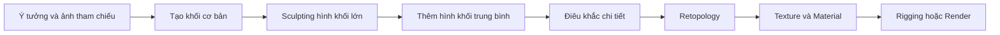
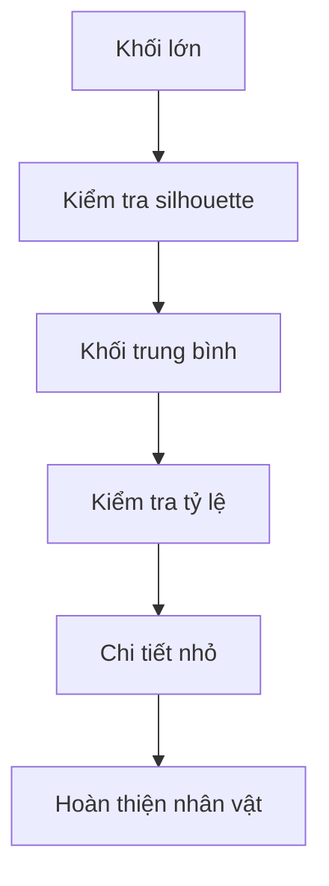

# 088 — Section Intro: Sculpting a Head

| Thuộc tính        | Nội dung                                    |
| ----------------- | ------------------------------------------- |
| **Module**        | Module 06 — Sculpting a Cartoon Head        |
| **Bài học**       | Section Intro – Sculpting a Head            |
| **Thời lượng**    | 1 phút 08 giây                              |
| **Chủ đề chính**  | Giới thiệu kỹ thuật Sculpting               |
| **Sản phẩm cuối** | Tượng bán thân nhân vật phản diện cách điệu |

---

## 1. Mục tiêu bài học

Sau bài học này, bạn sẽ:

* Hiểu khái quát về **Sculpting** trong Blender.
* Nhận biết sự khác nhau giữa sculpting và các phương pháp modelling cơ bản.
* Hiểu vai trò của sculpting trong ngành công nghiệp game và đồ họa 3D.
* Biết được sản phẩm sẽ thực hiện trong Module 06.
* Chuẩn bị công cụ và tâm lý phù hợp trước khi bắt đầu quá trình điêu khắc.

---

## 2. Sculpting là gì?

Sau khi đã làm quen với các kỹ thuật modelling cơ bản, chúng ta sẽ chuyển sang một phương pháp nâng cao hơn: **Sculpting**, hay còn gọi là **điêu khắc kỹ thuật số**.

Thay vì trực tiếp chỉnh sửa từng:

* Vertex — đỉnh;
* Edge — cạnh;
* Face — mặt;

người dùng sẽ sử dụng các loại brush để đẩy, kéo, làm phẳng hoặc tạo thêm khối trên mô hình, tương tự như đang nặn đất sét ngoài đời thực.

```text
Modelling truyền thống
        │
        ├── Chỉnh sửa vertex
        ├── Chỉnh sửa edge
        └── Chỉnh sửa face
                │
                ▼
        Kiểm soát hình học chính xác

Sculpting
        │
        ├── Dùng brush để đẩy và kéo mesh
        ├── Tập trung vào hình khối
        └── Tạo hình theo cảm giác nghệ thuật
                │
                ▼
        Tự do và trực quan hơn
```

Sculpting là một cách tiếp cận có tính nghệ thuật và tự do hơn so với nhiều phương pháp modelling truyền thống.

---

## 3. Vai trò của Sculpting trong ngành công nghiệp 3D

Sculpting là một kỹ thuật quan trọng và được sử dụng rộng rãi trong ngành công nghiệp đồ họa.

Nhiều trò chơi **AAA** sử dụng sculpting để xây dựng:

* Nhân vật;
* Khuôn mặt;
* Sinh vật;
* Quái vật;
* Trang phục;
* Đạo cụ;
* Cảnh quan;
* Các chi tiết bề mặt phức tạp.

Sculpting đặc biệt phù hợp với những đối tượng có hình dạng tự nhiên hoặc hữu cơ như con người, động vật và sinh vật giả tưởng.

### Quy trình sản xuất phổ biến



Trong module này, trọng tâm chính sẽ là làm quen với quá trình tạo hình bằng sculpting.

---

## 4. Sculpting có khó không?

Sculpting vẫn yêu cầu một số kiến thức kỹ thuật, nhưng thường mang lại cảm giác tự do hơn so với các phương pháp modelling phải kiểm soát topology ngay từ đầu.

Tuy nhiên, để tạo ra những mô hình có chất lượng cao, người học cần:

* Khả năng quan sát hình khối;
* Cảm nhận về tỷ lệ;
* Kiến thức giải phẫu cơ bản;
* Khả năng kiểm soát brush;
* Nhiều thời gian luyện tập.

> Sculpting là kỹ năng có thể tiến bộ khá chậm. Điều này hoàn toàn bình thường.

Bạn không cần phải có trình độ cao ngay từ đầu. Ngay cả với kỹ năng cơ bản, bạn vẫn có thể tạo ra những mô hình thú vị và có cá tính.

Điều quan trọng nhất là:

1. Bắt đầu từ những hình khối đơn giản.
2. Không quá tập trung vào chi tiết nhỏ.
3. Thường xuyên quan sát mô hình từ nhiều góc.
4. Kiên trì luyện tập.

---

## 5. Chuột, bảng vẽ và màn hình vẽ

Các nghệ sĩ sculpting chuyên nghiệp thường sử dụng một trong hai thiết bị sau:

### Graphics Tablet — bảng vẽ đồ họa

Người dùng vẽ bằng bút trên bảng cảm ứng, trong khi hình ảnh được hiển thị trên màn hình máy tính.

### Display Tablet — màn hình vẽ

Người dùng có thể sử dụng bút và thao tác trực tiếp trên màn hình hiển thị mô hình.

```text
Chuột
├── Có thể thực hiện toàn bộ bài học
├── Không cần mua thêm thiết bị
└── Khó kiểm soát lực và nét cọ hơn

Bảng vẽ
├── Điều khiển brush tự nhiên hơn
├── Có thể hỗ trợ cảm ứng lực
└── Cần thời gian làm quen

Màn hình vẽ
├── Vẽ trực tiếp lên màn hình
├── Trải nghiệm trực quan
└── Chi phí thường cao hơn
```

Trong toàn bộ module này, giảng viên sẽ sử dụng **chuột**. Vì vậy, bảng vẽ không phải là thiết bị bắt buộc.

Nếu đã có bảng vẽ, đây là thời điểm phù hợp để bắt đầu làm quen với thiết bị đó.

---

## 6. Dự án của Module 06

Sản phẩm chính của module là một **tượng bán thân nhân vật phản diện**.

Nhân vật được mô tả theo phong cách:

* Ác quỷ;
* Phản diện;
* Đầu não tội phạm;
* Hoạt hình và cách điệu.

Tượng bán thân sẽ bao gồm:

* Đầu;
* Khuôn mặt;
* Cổ;
* Vai;
* Phần thân trên.

```text
Tượng bán thân nhân vật phản diện
│
├── Hình dáng tổng thể
├── Đầu và khuôn mặt
│   ├── Trán
│   ├── Mắt
│   ├── Mũi
│   ├── Miệng
│   └── Hàm
├── Tai và các đặc điểm phụ
├── Cổ
├── Vai
└── Chi tiết tạo tính cách nhân vật
```

Mục tiêu không phải là tạo một khuôn mặt người hoàn toàn chân thực, mà là xây dựng một nhân vật có:

* Silhouette rõ ràng;
* Biểu cảm mạnh;
* Tỷ lệ thú vị;
* Cá tính dễ nhận biết.

---

## 7. Tư duy quan trọng khi Sculpting

Khi sculpting, hãy làm việc theo thứ tự từ lớn đến nhỏ.

### Cấp độ 1 — Hình khối lớn

Xác định:

* Kích thước đầu;
* Chiều rộng khuôn mặt;
* Chiều dài hộp sọ;
* Kích thước cổ và vai;
* Silhouette tổng thể.

### Cấp độ 2 — Hình khối trung bình

Xây dựng:

* Hốc mắt;
* Gò má;
* Mũi;
* Hàm;
* Miệng;
* Tai.

### Cấp độ 3 — Chi tiết nhỏ

Sau khi hình khối tổng thể đã ổn định, mới bổ sung:

* Nếp nhăn;
* Rãnh da;
* Chi tiết môi;
* Chi tiết quanh mắt;
* Các dấu hiệu đặc trưng của nhân vật.



> Không nên thêm chi tiết nhỏ khi hình khối lớn và tỷ lệ tổng thể vẫn chưa chính xác.

---

## 8. Chuẩn bị trước khi thực hành

Trước khi bắt đầu bài tiếp theo, nên:

* Chuẩn bị chuột hoặc bảng vẽ.
* Đảm bảo có thể xoay và quan sát mô hình dễ dàng.
* Làm quen với các thao tác điều hướng trong Viewport.
* Tìm một số ảnh tham chiếu về nhân vật phản diện hoặc đầu nhân vật hoạt hình.
* Chuẩn bị tinh thần thử nghiệm và sửa đổi nhiều lần.

Sculpting không phải quá trình tạo đúng ngay từ lần đầu. Người học thường xuyên phải:

```text
Tạo khối
   ↓
Quan sát
   ↓
Phát hiện vấn đề
   ↓
Chỉnh sửa
   ↓
Quan sát lại
   ↓
Tiếp tục hoàn thiện
```

---

## 9. Lưu ý quan trọng

### Không cần thiết bị chuyên nghiệp

Bạn hoàn toàn có thể hoàn thành module bằng chuột. Bảng vẽ chỉ là công cụ hỗ trợ nâng cao trải nghiệm.

### Không nên kỳ vọng kết quả hoàn hảo ngay lập tức

Sculpting là một kỹ năng cần nhiều thời gian luyện tập. Mô hình đầu tiên có thể chưa cân đối hoặc chưa giống sản phẩm mẫu.

### Tập trung vào hình khối trước

Đừng để các chi tiết nhỏ làm bạn phân tâm khỏi tỷ lệ và silhouette của nhân vật.

### Quan sát mô hình từ nhiều góc

Một khuôn mặt có thể trông đẹp ở góc chính diện nhưng mất cân đối khi nhìn từ bên cạnh.

Hãy thường xuyên kiểm tra:

* Góc chính diện;
* Góc nghiêng;
* Góc ba phần tư;
* Góc nhìn từ trên;
* Góc nhìn từ dưới.

---

## 10. Tóm tắt bài học

* Sculpting là một kỹ thuật điêu khắc kỹ thuật số quan trọng trong ngành công nghiệp 3D.
* Phương pháp này có tính nghệ thuật, trực quan và tự do hơn modelling truyền thống.
* Sculpting được sử dụng rộng rãi để tạo nhân vật, sinh vật, cảnh quan và nhiều loại tài sản trong game AAA.
* Kỹ năng sculpting cần thời gian và sự luyện tập để phát triển.
* Có thể sử dụng bảng vẽ hoặc màn hình vẽ, nhưng chúng không bắt buộc.
* Toàn bộ nội dung trong module có thể được thực hiện bằng chuột.
* Dự án cuối module là một tượng bán thân nhân vật phản diện mang phong cách hoạt hình.
* Khi sculpting, cần ưu tiên hình khối lớn trước, sau đó mới chuyển sang các chi tiết nhỏ.

---

## 11. Kết luận

Bài học này đánh dấu bước chuyển từ các kỹ thuật modelling cơ bản sang một phương pháp tạo hình nâng cao và tự do hơn.

Trong những bài tiếp theo, chúng ta sẽ bắt đầu xây dựng hình khối cho đầu nhân vật, từng bước biến một khối đơn giản thành một nhân vật phản diện có hình dáng và cá tính rõ ràng.

> Hãy bắt đầu sculpting với tinh thần thử nghiệm. Mỗi lần chỉnh sửa mô hình đều là một bước giúp bạn hiểu hình khối tốt hơn.
