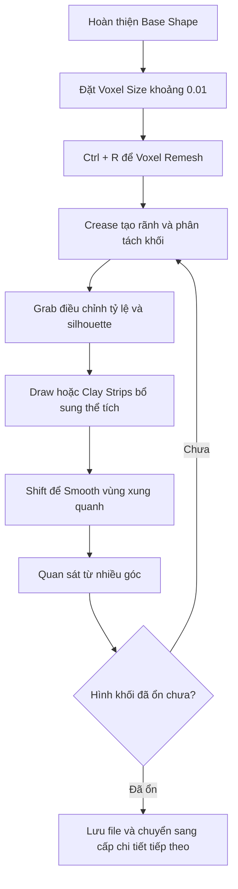

# 094 — Details Level 1

## Thêm lớp chi tiết cấp độ 1

| Thuộc tính       | Nội dung                                                           |
| ---------------- | ------------------------------------------------------------------ |
| **Module**       | Module 06 — Sculpting a Cartoon Head                               |
| **Bài học**      | Details Level 1                                                    |
| **Thời lượng**   | 16:41                                                              |
| **Phần mềm**     | Blender 4.3 trở lên                                                |
| **Chủ đề chính** | Tăng mật độ mesh và tạo các khối chi tiết trung bình cho khuôn mặt |

---

## 1. Mục tiêu bài học

Sau khi hoàn thiện hình khối cơ bản của đầu nhân vật, bài học này chuyển sang **lớp chi tiết đầu tiên**.

Các mục tiêu chính gồm:

* Tăng mật độ lưới bằng **Voxel Remesh** để có đủ hình học cho việc điêu khắc.
* Làm rõ các bộ phận quan trọng:

  * Lỗ mũi và cánh mũi.
  * Môi trên, môi dưới và khóe miệng.
  * Cằm và đường viền hàm.
  * Gò má.
  * Mí mắt và hốc mắt.
  * Cung mày và các nếp lớn trên trán.
* Luyện cách phối hợp các brush:

  * **Crease**
  * **Grab**
  * **Draw**
  * **Clay Strips**
  * **Smooth**
* Học cách liên tục quan sát, thử nghiệm và điều chỉnh hình khối.
* Sử dụng ảnh tham chiếu để kiểm soát tỷ lệ và cấu trúc khuôn mặt.

> Đây mới chỉ là lớp chi tiết trung bình. Những đường nét sắc, nếp da nhỏ và chi tiết bề mặt sẽ được hoàn thiện ở các cấp độ sau.

---

## 2. Tư duy quan trọng khi sculpt

Giai đoạn này tương đối khó hướng dẫn theo một công thức cố định, bởi kết quả phụ thuộc nhiều vào:

* Khả năng quan sát.
* Cảm nhận hình khối.
* Kích thước brush.
* Góc nhìn.
* Mức độ cách điệu của nhân vật.
* Thời gian luyện tập.

Nhân vật của anh không nhất thiết phải giống hoàn toàn với mẫu trong video. Mục tiêu quan trọng hơn là:

1. Hiểu chức năng của từng brush.
2. Biết vùng nào cần đắp thêm và vùng nào cần khoét bớt.
3. Duy trì được hình khối tổng thể.
4. Tạo ra một thiết kế có cá tính riêng.

Có thể thay đổi hình dáng mũi, miệng, cằm hoặc biểu cảm để nhân vật mang phong cách riêng.

---

## 3. Ảnh tham chiếu

Trong suốt quá trình sculpt, nên để ảnh tham chiếu trên một màn hình riêng hoặc đặt cạnh cửa sổ Blender.

Một số cách bố trí:

* Dùng màn hình thứ hai.
* Thu nhỏ cửa sổ Blender và mở ảnh tham chiếu bên cạnh.
* Dùng cửa sổ Image Editor trong Blender.
* Sử dụng phần mềm như PureRef để gom nhiều ảnh tham chiếu.

Ảnh tham chiếu đặc biệt hữu ích khi kiểm tra:

* Độ nhô của mũi.
* Hình dạng lỗ mũi.
* Vị trí gò má.
* Cấu trúc mí mắt.
* Độ dày của môi.
* Góc nghiêng của trán.
* Đường chuyển tiếp từ cằm xuống cổ.

---

## 4. Tăng mật độ mesh bằng Voxel Remesh

Ở cuối giai đoạn tạo khối cơ bản, mesh có khoảng:

* **125.000 faces**

Mật độ này vẫn còn khá thấp đối với sculpting chi tiết.

Các mô hình sculpt chuyên nghiệp có thể đạt:

* Khoảng 3–4 triệu polygon.
* Hàng chục triệu polygon đối với những mô hình rất chi tiết.

Tuy nhiên, nhân vật trong bài không cần mật độ quá cao.

### Thiết lập Voxel Size

1. Trong Sculpt Mode, nhấn:

```text
Shift + R
```

2. Di chuyển chuột để điều chỉnh kích thước voxel.
3. Đặt giá trị gần:

```text
Voxel Size ≈ 0.01
```

4. Thực hiện remesh bằng:

```text
Ctrl + R
```

Sau khi remesh, mô hình có thể tăng lên khoảng:

```text
500.000 faces
```

Máy tính có thể tạm dừng trong vài giây khi Blender tính toán lại topology.

### Ý nghĩa của Voxel Size

| Voxel Size  | Kết quả                                  |
| ----------- | ---------------------------------------- |
| Giá trị lớn | Ít polygon, bề mặt thô, xử lý nhanh      |
| Giá trị nhỏ | Nhiều polygon, giữ được chi tiết tốt hơn |
| Quá nhỏ     | Mesh rất nặng, dễ làm chậm máy           |

> Chỉ giảm Voxel Size khi mô hình thực sự cần thêm độ phân giải.

---

## 5. Quy trình tổng thể



Nguyên tắc lặp lại xuyên suốt bài học:

```text
Crease → Smooth → Grab → Quan sát → Điều chỉnh
```

---

# 6. Các brush được sử dụng

## 6.1. Crease Brush

Crease là brush quan trọng nhất trong bài học này.

Nó được sử dụng để:

* Tạo rãnh lỗ mũi.
* Tách môi khỏi vùng da xung quanh.
* Làm rõ đường viền hàm.
* Tạo rãnh dưới cằm.
* Định hình mí mắt.
* Tạo nếp quanh cung mày.
* Nhấn các đường lớn trên trán.

### Kích thước brush

* Brush nhỏ tạo đường crease mảnh và sắc.
* Brush lớn tạo vùng lõm rộng và chuyển tiếp mềm hơn.

### Đảo chiều Crease

Giữ:

```text
Ctrl
```

để đảo chiều tác động của brush.

Tùy thiết lập brush, thao tác đảo chiều có thể:

* Đẩy phần giữa đường stroke ra ngoài.
* Tạo hiệu ứng pinch.
* Làm nổi khối gò má, môi hoặc mí mắt.

---

## 6.2. Smooth

Giữ:

```text
Shift
```

để tạm thời sử dụng Smooth Brush.

Smooth được dùng để:

* Giảm bề mặt gồ ghề.
* Làm mềm hai bên đường crease.
* Kết nối các khối với nhau tự nhiên hơn.
* Xử lý các vùng bị lumpy sau khi kéo bằng Grab.

### Nguyên tắc sử dụng

Không nên Smooth trực tiếp quá nhiều lên đường crease vừa tạo.

Thay vào đó:

```text
Smooth hai bên đường crease
```

Điều này giúp đường rãnh vẫn rõ nhưng vùng chuyển tiếp trở nên mềm mại hơn.

> Smooth quá mạnh có thể làm mất cấu trúc, làm phẳng môi, mí mắt hoặc đường viền hàm.

---

## 6.3. Grab Brush

Grab được sử dụng để thay đổi hình dáng lớn mà không cần tạo thêm thể tích.

Các ứng dụng trong bài:

* Kéo cổ ra đúng vị trí.
* Làm cổ mỏng hơn.
* Chỉnh yết hầu.
* Thay đổi độ móc của mũi.
* Mở rộng hoặc thu hẹp cánh mũi.
* Điều chỉnh môi trên và môi dưới.
* Tạo biểu cảm cười, cau có hoặc nham hiểm.
* Kéo cằm dài hơn, ngắn hơn hoặc vuông hơn.
* Hạ thấp cung mày.
* Điều chỉnh hình dạng mí mắt.

Grab Brush phù hợp với:

```text
Thay đổi tỷ lệ và silhouette
```

Nó không thích hợp để tạo các nếp nhỏ hoặc chi tiết sắc.

---

## 6.4. Draw Brush

Draw Brush được dùng để:

* Đắp thêm thể tích.
* Làm môi đầy hơn.
* Bổ sung khối quanh cung mày.
* Tăng thể tích phần trước của mũi.
* Bù lại vùng bị phẳng sau khi Smooth.

Giữ:

```text
Ctrl
```

để đảo chiều và khoét bề mặt vào trong.

---

## 6.5. Clay Strips

Clay Strips phù hợp để lấp đầy các vùng thiếu thể tích.

Trong bài, brush này được dùng để:

* Bổ sung khối quanh mắt.
* Lấp vùng lõm không mong muốn.
* Tạo các mảng khối lớn trước khi Smooth.
* Kết nối cung mày, gò má và hốc mắt.

Sau khi dùng Clay Strips, thường cần Smooth nhẹ để hòa các nét brush vào bề mặt.

---

# 7. Tạo chi tiết cho từng vùng

## 7.1. Lỗ mũi và cánh mũi

Bắt đầu bằng Crease Brush với kích thước nhỏ.

### Các bước

1. Vẽ crease quanh phần dưới của cánh mũi.
2. Dùng brush nhỏ hơn khi tiến gần phần trên của lỗ mũi.
3. Smooth nhẹ vùng bên cạnh.
4. Dùng Draw Brush ở chế độ đảo chiều để khoét lỗ mũi.
5. Thả chuột và thực hiện nhiều stroke ngắn thay vì giữ một stroke quá lâu.
6. Dùng Grab để chỉnh:

   * Độ rộng đầu mũi.
   * Độ xòe của cánh mũi.
   * Độ móc của sống mũi.
   * Vị trí lỗ mũi.
7. Smooth nhẹ để giảm bề mặt gồ ghề.

### Lưu ý giải phẫu

Khi nhìn trực diện hoặc từ dưới lên, có thể thấy phần vách ngăn nằm giữa hai lỗ mũi. Đây là hiện tượng bình thường.

Không nên khoét hai lỗ mũi như hai lỗ tròn độc lập hoàn toàn. Chúng cần kết nối tự nhiên với:

* Cánh mũi.
* Đầu mũi.
* Vách ngăn.
* Phần má bên cạnh.

---

## 7.2. Định hình mũi

Sau khi tạo lỗ mũi, dùng Grab Brush để hoàn thiện khối mũi.

Có thể thử nghiệm:

* Làm mũi móc xuống.
* Làm đầu mũi to hơn.
* Thu hẹp phần sống mũi.
* Mở rộng phần trước.
* Nâng cánh mũi để tạo cảm giác dữ tợn.
* Kéo đầu mũi xuống để nhân vật có vẻ già hoặc nham hiểm hơn.

### Kiểm tra từ nhiều góc

Luôn kiểm tra mũi từ:

* Chính diện.
* Góc nghiêng.
* Góc ba phần tư.
* Góc nhìn từ dưới lên.

Một chiếc mũi có thể trông tốt ở chính diện nhưng quá dài hoặc quá phẳng khi nhìn nghiêng.

---

## 7.3. Đường viền hàm

Dùng Crease Brush với kích thước lớn hơn để định nghĩa:

* Đường từ gò má xuống hàm.
* Góc hàm.
* Đường dưới cằm.
* Vùng chuyển tiếp từ hàm xuống cổ.

### Quy trình

1. Vẽ một đường crease dọc theo đường viền hàm.
2. Smooth nhẹ hai bên.
3. Dùng Grab để kéo phần hàm ra sau hoặc vào trong.
4. Kiểm tra silhouette.
5. Lặp lại Crease nếu đường hàm bị mềm sau khi Smooth.

Có thể giữ `Ctrl` với Crease để làm phần xương hàm nổi rõ hơn.

---

## 7.4. Cổ và yết hầu

Sau khi tạo đường hàm, vùng cổ có thể chưa khớp với đầu.

Dùng Grab Brush để:

* Kéo cổ ra phía sau.
* Làm cổ mỏng hơn.
* Điều chỉnh độ cong ở phần trước cổ.
* Gợi ý khối yết hầu.
* Tạo chuyển tiếp tự nhiên từ cằm xuống cổ.

Sau những thay đổi lớn, có thể cần:

```text
Ctrl + R
```

để remesh lại topology.

> Remesh sau khi thay đổi hình khối lớn giúp mật độ polygon phân bố đều hơn.

---

## 7.5. Miệng và khóe miệng

Dùng Crease Brush với kích thước nhỏ để xác định đường phân chia giữa hai môi.

### Các bước

1. Vẽ đường giữa môi.
2. Làm rõ phần giữa miệng.
3. Tạo một vùng lõm nhỏ tại hai khóe miệng.
4. Dùng `Ctrl` với Crease để đẩy phần môi ra ngoài.
5. Smooth nhẹ hai bên đường môi.
6. Lặp lại:

```text
Crease → Smooth → Crease → Smooth
```

Quy trình này giúp hình dạng môi rõ hơn mà không tạo đường rãnh quá cứng.

### Khóe miệng

Khóe miệng thường có một vùng lõm nhỏ, không nên chỉ kết thúc bằng một đường thẳng sắc.

Có thể tạo:

* Khóe miệng hướng lên để nhân vật cười nham hiểm.
* Khóe miệng hướng xuống để nhân vật cau có.
* Một bên cao, một bên thấp khi bỏ symmetry ở giai đoạn cuối.

---

## 7.6. Tạo thể tích cho môi

Sau khi Crease, môi có thể bị quá phẳng.

Dùng Draw Brush để:

* Đắp thêm môi trên.
* Đắp môi dưới.
* Làm đầy vùng quanh miệng.
* Khôi phục thể tích bị mất do Smooth.

Sau đó Smooth nhẹ theo chiều dài của môi.

### Quan hệ giữa môi trên và môi dưới

Khi nhìn nghiêng:

* Môi trên thường nhô ra một chút.
* Môi dưới nằm lùi nhẹ hơn.
* Vùng dưới môi dưới lõm vào trước khi chuyển sang cằm.

Tuy nhiên, vì đây là nhân vật cartoon, anh có thể phóng đại các tỷ lệ này.

---

## 7.7. Biểu cảm miệng

Dùng Grab Brush để chỉnh khóe miệng.

### Một số lựa chọn

| Biểu cảm     | Cách điều chỉnh                            |
| ------------ | ------------------------------------------ |
| Vui vẻ       | Kéo hai khóe miệng lên                     |
| Cau có       | Kéo khóe miệng xuống                       |
| Nham hiểm    | Kéo khóe miệng lên nhẹ và ép phần giữa môi |
| Khinh thường | Kéo một bên miệng cao hơn bên còn lại      |
| Căng thẳng   | Ép môi mỏng và kéo ngang                   |

Trong video, biểu cảm được điều chỉnh theo hướng hơi nham hiểm, phù hợp với thiết kế nhân vật phản diện.

---

## 7.8. Cằm

Cằm ảnh hưởng rất mạnh đến cá tính của nhân vật.

Dùng Grab Brush để thử nghiệm:

* Kéo cằm xuống.
* Đẩy cằm ra trước.
* Thu cằm vào trong.
* Làm cằm rộng hơn.
* Tạo cằm vuông.
* Làm cằm nhọn.
* Tạo rãnh giữa cằm.

Dùng Crease Brush kích thước lớn để:

* Làm rõ cạnh dưới của cằm.
* Tách cằm khỏi vùng cổ.
* Tạo rãnh hoặc nếp trên cằm.

Sau đó Smooth để cằm trông hữu cơ hơn.

### Kiểm tra silhouette

Cằm cần được quan sát đặc biệt từ góc nghiêng:

```text
Trán → Mũi → Môi → Cằm
```

Bốn vùng này tạo nên đường nét nhận diện chính của khuôn mặt.

---

## 7.9. Mí mắt

Chi tiết quanh mắt có thể bị mất sau khi remesh hoặc Smooth.

Dùng Crease Brush để phục hồi:

* Đường mí trên.
* Đường mí dưới.
* Khóe mắt trong.
* Vùng tuyến lệ.
* Rãnh giữa mí mắt và cung mày.

### Quy trình tạo mí

1. Dùng Crease Brush nhỏ.
2. Giữ `Ctrl` để làm phần mí nổi ra.
3. Đi theo đường cong của nhãn cầu.
4. Tạo vùng tuyến lệ ở khóe mắt trong.
5. Dùng Grab để chỉnh lại độ mở của mắt.
6. Smooth nhẹ nếu bề mặt quá gồ ghề.

Mí mắt cần ôm theo hình cầu của mắt, không nên nằm như một mặt phẳng trên khuôn mặt.

---

## 7.10. Tạo hốc mắt

Để mắt có chiều sâu hơn, dùng Crease Brush tạo các đường ngắn quanh mắt.

Có thể hình dung vùng hốc mắt như một hình tam giác hoặc khung bao quanh nhãn cầu:

```text
      Cung mày
       /    \
Khóe mắt    Đuôi mắt
       \    /
        Mí dưới
```

Thực hiện các stroke ngắn:

* Phía trên mí mắt.
* Ở đuôi mắt.
* Phía dưới mắt.
* Sát vùng sống mũi.

Điều này làm mí mắt lùi vào trong và nhãn cầu có cảm giác được đặt trong hốc mắt.

---

## 7.11. Cung mày

Cung mày là vùng rất quan trọng để tạo biểu cảm.

Dùng Grab Brush để:

* Hạ cung mày xuống.
* Làm cung mày rộng hơn.
* Kéo phần giữa xuống gần mũi.
* Tạo độ dốc về phía sau của trán.

Dùng Draw hoặc Clay Strips để bổ sung thể tích nếu cung mày bị phẳng.

Dùng Crease để làm rõ:

* Rãnh giữa sống mũi và cung mày.
* Đường phía dưới cung mày.
* Nếp phía trên trán.

### Biểu cảm phản diện

Để tạo vẻ dữ hoặc nham hiểm:

* Hạ thấp phần trong của cung mày.
* Đẩy cung mày ra trước.
* Làm phần xương phía trên mắt lớn hơn.
* Thu hẹp khoảng cách giữa cung mày và mí trên.

---

## 7.12. Nếp trán

Dùng Crease Brush tạo một số đường lớn:

* Nếp dọc giữa hai chân mày.
* Nếp chéo từ cung mày.
* Nếp ngang trên trán.

Ở cấp độ này, chỉ nên tạo các nếp lớn để định hướng hình khối.

Không nên đi quá sâu vào:

* Nếp da nhỏ.
* Lỗ chân lông.
* Vết nhăn li ti.
* Chi tiết bề mặt rất sắc.

Các chi tiết này sẽ được thực hiện ở cấp độ sau.

---

## 7.13. Gò má

Có thể dùng Crease đảo chiều hoặc Draw Brush để làm nổi gò má.

### Cách thực hiện

1. Dùng Crease Brush kích thước tương đối lớn.
2. Giữ `Ctrl` để đẩy phần giữa stroke ra ngoài.
3. Đi theo đường từ dưới mắt về phía tai.
4. Smooth nhẹ phía trên và phía dưới.
5. Dùng Grab nếu cần thay đổi vị trí gò má.

Gò má cao và rõ thường giúp nhân vật:

* Trông già hơn.
* Có vẻ gầy hơn.
* Mang cảm giác sắc sảo hoặc nguy hiểm hơn.

---

## 8. Khi nào cần Remesh lại?

Trong quá trình sculpt, topology có thể bị kéo giãn khi:

* Kéo cổ quá xa.
* Làm mũi dài hơn.
* Thay đổi cằm đáng kể.
* Hạ cung mày.
* Kéo môi hoặc hàm.
* Thay đổi silhouette lớn.

Khi đó có thể nhấn:

```text
Ctrl + R
```

để Voxel Remesh lại.

### Nhược điểm của remesh

Remesh có thể làm mất một phần:

* Đường crease nhỏ.
* Chi tiết sắc ở môi.
* Nếp mí mắt.
* Khóe miệng.
* Các đường nhăn nhỏ.

Do đó, quy trình phù hợp là:

```text
Thay đổi hình khối lớn
        ↓
Voxel Remesh
        ↓
Khôi phục các đường Crease
        ↓
Tiếp tục tinh chỉnh
```

Không nên dành quá nhiều thời gian làm sắc các nếp nhỏ trước khi chắc chắn rằng không cần remesh thêm.

---

## 9. Phím tắt và thao tác quan trọng

| Phím tắt / Công cụ    | Chức năng                                 |
| --------------------- | ----------------------------------------- |
| `Shift + R`           | Điều chỉnh Voxel Size                     |
| `Ctrl + R`            | Voxel Remesh                              |
| Giữ `Shift`           | Tạm thời sử dụng Smooth Brush             |
| Giữ `Ctrl` khi sculpt | Đảo chiều tác động của brush              |
| `Ctrl + Z`            | Hoàn tác                                  |
| **Crease**            | Tạo rãnh, pinch và làm rõ đường phân chia |
| **Grab**              | Kéo và thay đổi hình dáng lớn             |
| **Draw**              | Đắp hoặc khoét thể tích                   |
| **Clay Strips**       | Bổ sung các mảng khối                     |
| **Smooth**            | Làm mềm và kết nối bề mặt                 |
| **X Symmetry**        | Sculpt đối xứng theo trục X               |

> Phím tắt có thể thay đổi tùy keymap hoặc phiên bản Blender, nhưng trong bài giảng `Shift + R` và `Ctrl + R` được dùng cho Voxel Remesh.

---

## 10. Những lỗi thường gặp

### 10.1. Smooth quá nhiều

**Hiện tượng:**

* Môi bị biến mất.
* Mí mắt bị phẳng.
* Mũi mất cấu trúc.
* Đường hàm không còn rõ.

**Khắc phục:**

* Chỉ Smooth nhẹ hai bên vùng chi tiết.
* Dùng Draw để bổ sung lại thể tích.
* Crease lại những đường quan trọng.

---

### 10.2. Tạo crease quá sâu

**Hiện tượng:**

* Khuôn mặt giống bị cắt bằng dao.
* Nếp nhăn quá sắc.
* Các bộ phận không kết nối tự nhiên.

**Khắc phục:**

* Giảm Strength.
* Tăng kích thước brush.
* Smooth hai bên đường crease.
* Sử dụng nhiều stroke nhẹ thay vì một stroke mạnh.

---

### 10.3. Chỉ sculpt ở góc chính diện

**Hiện tượng:**

* Mũi quá dài khi nhìn nghiêng.
* Cằm bị nhô quá xa.
* Cổ không nối tự nhiên với đầu.
* Mí mắt không ôm nhãn cầu.

**Khắc phục:**

Thường xuyên xoay mô hình qua:

```text
Chính diện → Ba phần tư → Góc nghiêng → Từ dưới lên
```

---

### 10.4. Làm chi tiết nhỏ quá sớm

**Hiện tượng:**

* Mất thời gian sửa các đường nhỏ sau khi remesh.
* Mô hình có nhiều nếp nhưng hình khối tổng thể vẫn chưa đúng.

**Khắc phục:**

Ưu tiên theo thứ tự:

```text
Silhouette
→ Khối lớn
→ Khối trung bình
→ Đường phân chia chính
→ Chi tiết nhỏ
```

---

### 10.5. Voxel Size quá nhỏ

**Hiện tượng:**

* Blender phản hồi chậm.
* Brush bị lag.
* File nặng.
* Remesh mất nhiều thời gian.

**Khắc phục:**

* Chỉ dùng độ phân giải vừa đủ.
* Ẩn các đối tượng không cần thiết.
* Không giảm Voxel Size quá sớm.
* Lưu file trước khi remesh mật độ cao.

---

### 10.6. Mô hình quá đối xứng

Sculpt đối xứng rất hữu ích ở giai đoạn đầu, nhưng khuôn mặt hoàn toàn đối xứng có thể trông thiếu tự nhiên.

Ở giai đoạn cuối có thể tắt X Symmetry và thêm bất đối xứng nhẹ:

* Một bên cung mày cao hơn.
* Một khóe miệng nhếch hơn.
* Một mí mắt mở rộng hơn.
* Các nếp trán khác nhau.
* Mũi hơi lệch nhẹ.

Tuy nhiên, chưa cần thực hiện điều này khi hình khối cơ bản vẫn đang được hoàn thiện.

---

## 11. Quy trình thực hành chi tiết

### Giai đoạn A — Chuẩn bị mesh

1. Kiểm tra hình khối cơ bản.
2. Đặt Voxel Size khoảng `0.01`.
3. Nhấn `Ctrl + R` để remesh.
4. Thử Smooth nhẹ để kiểm tra mật độ mesh.
5. Lưu file trước khi tiếp tục.

### Giai đoạn B — Mũi

1. Dùng Crease tạo rãnh quanh cánh mũi.
2. Dùng Draw đảo chiều để khoét lỗ mũi.
3. Dùng Grab chỉnh đầu mũi và cánh mũi.
4. Smooth nhẹ.
5. Quan sát từ chính diện và góc nghiêng.

### Giai đoạn C — Hàm và cổ

1. Crease dọc đường viền hàm.
2. Smooth hai bên.
3. Grab chỉnh góc hàm.
4. Kéo cổ về đúng vị trí.
5. Gợi ý yết hầu.
6. Remesh nếu topology bị kéo giãn.

### Giai đoạn D — Miệng và cằm

1. Crease đường giữa môi.
2. Tạo khóe miệng.
3. Đắp thêm thể tích môi bằng Draw.
4. Dùng Grab tạo biểu cảm.
5. Điều chỉnh hình dạng cằm.
6. Crease dưới cằm và Smooth vùng chuyển tiếp.

### Giai đoạn E — Mắt và cung mày

1. Crease lại mí trên và mí dưới.
2. Tạo vùng tuyến lệ.
3. Dùng Grab chỉnh độ mở mắt.
4. Hạ cung mày.
5. Bổ sung thể tích bằng Draw hoặc Clay Strips.
6. Tạo nếp lớn quanh mắt và trên trán.
7. Smooth nhẹ để các khối kết nối tự nhiên.

---

## 12. Bài tập thực hành

Tạm dừng video tại từng giai đoạn và thực hiện lần lượt:

### Bài tập 1 — Crease Brush

* Tạo rãnh lỗ mũi.
* Định nghĩa đường hàm.
* Tạo rãnh dưới cằm.
* Smooth hai bên đường crease.

### Bài tập 2 — Mũi

* Khoét hai lỗ mũi.
* Điều chỉnh đầu mũi.
* Làm cánh mũi xòe hơn hoặc hẹp hơn.
* Thử tạo một chiếc mũi móc.

### Bài tập 3 — Miệng

* Tạo đường giữa môi.
* Tạo khóe miệng.
* Đắp thể tích môi.
* Thử ba biểu cảm:

  * Cau có.
  * Cười.
  * Cười nham hiểm.

### Bài tập 4 — Cằm

Thử ba biến thể:

1. Cằm dài và nhọn.
2. Cằm rộng, vuông.
3. Cằm ngắn và lùi vào trong.

Quan sát xem mỗi biến thể làm thay đổi tính cách nhân vật như thế nào.

### Bài tập 5 — Mắt và cung mày

* Tạo mí mắt ôm quanh nhãn cầu.
* Hạ cung mày để tăng vẻ dữ tợn.
* Tạo rãnh hốc mắt.
* Bổ sung khối bằng Clay Strips nếu vùng mắt bị lõm.

---

## 13. Checklist hoàn thành

### Mesh

* [ ] Đã giảm Voxel Size xuống khoảng `0.01`.
* [ ] Đã thực hiện Voxel Remesh.
* [ ] Mesh đủ mịn để tạo các chi tiết trung bình.
* [ ] Blender vẫn hoạt động ổn định, không bị lag quá mức.

### Mũi

* [ ] Đã tạo hai lỗ mũi.
* [ ] Cánh mũi có hình khối rõ.
* [ ] Đầu mũi có thể tích.
* [ ] Mũi trông hợp lý ở cả góc chính diện và góc nghiêng.

### Miệng và cằm

* [ ] Đã xác định đường phân chia môi.
* [ ] Đã tạo khóe miệng.
* [ ] Môi không bị quá phẳng.
* [ ] Biểu cảm phù hợp với nhân vật.
* [ ] Cằm có hình dạng rõ ràng.
* [ ] Vùng cằm chuyển tiếp tự nhiên xuống cổ.

### Mắt và cung mày

* [ ] Mí mắt ôm theo hình cầu của mắt.
* [ ] Có vùng tuyến lệ ở khóe mắt trong.
* [ ] Hốc mắt có chiều sâu.
* [ ] Cung mày tạo được biểu cảm.
* [ ] Các nếp lớn quanh mắt và trán đã được gợi ý.

### Tổng thể

* [ ] Đã kiểm tra mô hình từ nhiều góc.
* [ ] Không Smooth quá mức.
* [ ] Không tập trung quá sớm vào chi tiết rất nhỏ.
* [ ] Đã sử dụng ảnh tham chiếu.
* [ ] Đã lưu file trước khi kết thúc.

---

## 14. Tóm tắt bài học

Bài học **Details Level 1** chuyển mô hình từ hình khối cơ bản sang cấp độ chi tiết trung bình.

Quy trình chính là:

```text
Tăng mật độ mesh
→ Định nghĩa mũi
→ Tạo môi và biểu cảm
→ Làm rõ cằm và đường hàm
→ Chỉnh mí mắt và hốc mắt
→ Hạ cung mày
→ Smooth và kiểm tra tổng thể
```

Các brush được sử dụng nhiều nhất gồm:

* **Crease** để tạo rãnh và phân tách hình khối.
* **Grab** để thay đổi tỷ lệ và silhouette.
* **Draw** để thêm hoặc bớt thể tích.
* **Clay Strips** để bổ sung các vùng thiếu khối.
* **Smooth** để làm mềm và kết nối bề mặt.

Điều quan trọng nhất ở giai đoạn này không phải là tạo ra một khuôn mặt hoàn hảo ngay lập tức, mà là liên tục:

```text
Quan sát → Thử nghiệm → Hoàn tác → Điều chỉnh → So sánh tham chiếu
```

Sau khi hoàn thành, hãy lưu file để chuẩn bị cho bước tinh chỉnh và nâng cấp mức độ chi tiết tiếp theo.

---

# Bài luyện tập

## Mục tiêu


## Đề bài


## Yêu cầu hoàn thành

- [ ] 
- [ ] 
- [ ] 

## Kết quả / lời giải


## Ghi chú
