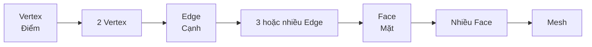
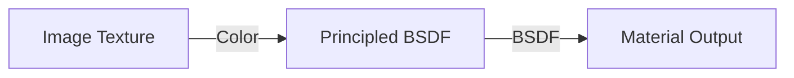
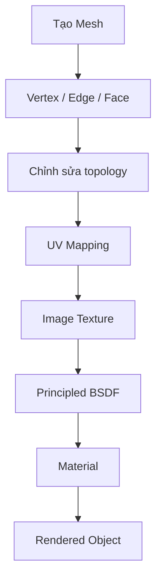
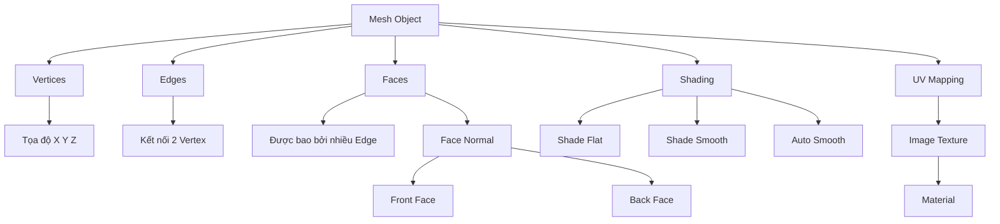
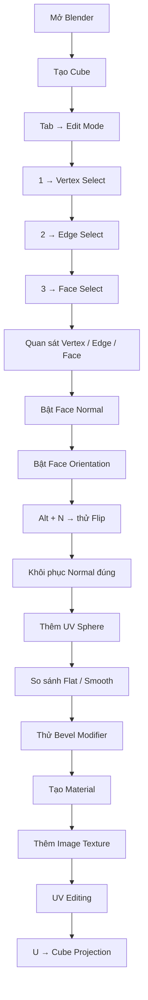

# 006 — Understanding Objects, Vertices, Edges & Faces

## Hiểu về Object, Vertex, Edge và Face trong Blender

| Thuộc tính        | Nội dung                                                        |
| ----------------- | --------------------------------------------------------------- |
| **Section**       | Section 02 — Your First Modeling Tools                          |
| **Bài học**       | Understanding Objects, Vertices, Edges & Faces                  |
| **Loại nội dung** | Video lecture                                                   |
| **Thời lượng**    | 13:51                                                           |
| **Ngôn ngữ**      | English                                                         |
| **Chủ đề chính**  | Object, Mesh, Vertex, Edge, Face, Normal, Shading, Material, UV |

---

## 1. Mục tiêu bài học

Sau bài học này, người học có thể:

* Hiểu **Object** và **Mesh** trong Blender là gì.
* Phân biệt ba thành phần cơ bản cấu tạo nên Mesh:

  * **Vertex** — đỉnh.
  * **Edge** — cạnh.
  * **Face** — mặt.
* Chuyển đổi giữa **Object Mode** và **Edit Mode**.
* Sử dụng các chế độ chọn:

  * Vertex Select.
  * Edge Select.
  * Face Select.
* Hiểu khái niệm **Edge Loop**.
* Hiểu **Face Normal**, mặt trước và mặt sau của polygon.
* Kiểm tra hướng mặt bằng **Face Orientation**.
* Hiển thị thông tin hình học như:

  * Edge Length.
  * Edge Angle.
  * Face Area.
  * Face Angle.
* Phân biệt:

  * Shade Flat.
  * Shade Smooth.
  * Shade Auto Smooth.
* Làm quen với **Bevel Modifier**.
* Tạo Material đơn giản.
* Gắn Image Texture vào shader.
* Hiểu khái niệm cơ bản về **UV Mapping** và **Cube Projection**.

---

# 2. Object và Mesh

Trong Blender, thứ chúng ta nhìn thấy trong Scene thường được quản lý dưới dạng **Object**.

Ví dụ:

* Cube
* Sphere
* Camera
* Light
* Curve
* Text

Tuy nhiên, một **Mesh Object** còn chứa dữ liệu hình học bên trong.

```text
Object
│
├── Transform
│   ├── Location
│   ├── Rotation
│   └── Scale
│
└── Mesh Data
    ├── Vertices
    ├── Edges
    └── Faces
```

Có thể hiểu đơn giản:

> **Object là "vỏ quản lý", còn Mesh là hình học nằm bên trong Object.**

---

# 3. Quản lý Object bằng Collection

Ở phần đầu bài học, giảng viên chuyển object hình hoa sang một Collection riêng.

## Tạo Collection

Trong **Outliner**:

1. Nhấp chuột phải.
2. Tạo **New Collection**.
3. Đổi tên thành:

```text
Flower
```

Có thể đổi tên bằng:

```text
F2
```

---

## Chuyển Object sang Collection

Chọn Object rồi nhấn:

```text
M
```

Sau đó chọn Collection đích.

Ví dụ:

```text
Flower Object
      │
      └── M
           │
           ▼
     Flower Collection
```

Ngoài ra có thể kéo Object trực tiếp trong **Outliner** sang Collection khác.

---

## Tác dụng của Collection

Collection giúp:

* Nhóm Object.
* Ẩn nhiều Object cùng lúc.
* Bật/tắt hiển thị.
* Quản lý Scene lớn dễ hơn.

Ví dụ:

```text
Scene Collection
│
├── Collection
│   ├── Cube
│   ├── Camera
│   └── Light
│
└── Flower
    └── Flower Object
```

---

# 4. Thêm Cube

Có hai cách phổ biến để thêm Cube.

### Cách 1 — Shortcut

```text
Shift + A
→ Mesh
→ Cube
```

### Cách 2 — Menu

```text
Add
→ Mesh
→ Cube
```

Cube này được sử dụng để minh họa cấu trúc Mesh.

---

# 5. Object Mode và Edit Mode

Đây là hai chế độ cực kỳ quan trọng khi modeling.

## Object Mode

Dùng để thao tác với **toàn bộ Object**.

Ví dụ:

* Di chuyển.
* Xoay.
* Scale.
* Duplicate.
* Xóa Object.
* Gắn Modifier.

---

## Edit Mode

Dùng để chỉnh sửa **hình học bên trong Mesh**.

Ví dụ:

* Vertex.
* Edge.
* Face.

---

## Chuyển đổi giữa hai Mode

```text
Tab
```

Sơ đồ:

```text
           Tab
Object Mode ─────────► Edit Mode
     ▲                    │
     └────────────────────┘
              Tab
```

### Quy tắc cần nhớ

> **Object Mode = chỉnh Object.**
> **Edit Mode = chỉnh Mesh.**

---

# 6. Cấu trúc của Mesh

Một Mesh được hình thành từ ba thành phần cơ bản:

```text
Vertex
  │
  ▼
 Edge
  │
  ▼
 Face
  │
  ▼
 Mesh
```

---

# 7. Vertex — Đỉnh

**Vertex** là một điểm trong không gian 3D.

Mỗi Vertex có tọa độ:

$$
V = (x,y,z)
$$

Ví dụ một Vertex trong bài:

```text
X = 1
Y = -1
Z = 1
```

hay:

$$
V=(1,-1,1)
$$

---

## Cube có bao nhiêu Vertex?

Một Cube mặc định có:

```text
8 Vertices
```

Có thể đánh số:

```text
Vertex 0
Vertex 1
Vertex 2
...
Vertex 7
```

---

## Spreadsheet

Giảng viên mở **Spreadsheet Editor** để xem dữ liệu Mesh.

Spreadsheet có thể hiển thị:

* Vertex index.
* Position.
* Edge.
* Face.
* Các thuộc tính hình học khác.

Ví dụ:

| Vertex |   X |   Y |   Z |
| -----: | --: | --: | --: |
|      0 |  -1 |  -1 |  -1 |
|      1 |  -1 |  -1 |   1 |
|    ... | ... | ... | ... |
|      7 |   1 |   1 |   1 |

> Đây là một cách trực quan để hiểu rằng Mesh thực chất là tập hợp dữ liệu hình học.

---

# 8. Edge — Cạnh

**Edge** là đoạn thẳng nối hai Vertex.

```text
Vertex A ●────────● Vertex B
             Edge
```

Hay:

$$
Edge = Vertex_A + Vertex_B
$$

Một Cube mặc định có:

```text
12 Edges
```

---

# 9. Face — Mặt

**Face** là bề mặt được tạo bởi nhiều Edge.

Ví dụ Triangle:

```text
      ●
     / \
    /   \
   ●─────●
```

Có:

```text
3 Vertex
3 Edge
1 Face
```

---

Ví dụ Quad:

```text
●────────●
│        │
│  Face  │
│        │
●────────●
```

Có:

```text
4 Vertex
4 Edge
1 Face
```

Cube mặc định có:

```text
6 Faces
```

---

# 10. Quan hệ Vertex → Edge → Face



Có thể ghi nhớ:

```text
2 Vertex
   ↓
1 Edge

3+ Edge
   ↓
1 Face

Nhiều Face
   ↓
Mesh
```

---

# 11. Chế độ chọn Vertex, Edge và Face

Trong **Edit Mode**, Blender có ba chế độ chọn chính.

| Phím | Chế độ        | Ý nghĩa     |
| ---- | ------------- | ----------- |
| `1`  | Vertex Select | Chọn Vertex |
| `2`  | Edge Select   | Chọn Edge   |
| `3`  | Face Select   | Chọn Face   |

> Các phím này thường là hàng số phía trên bàn phím, không phải Numpad.

---

## Vertex Select

```text
1
```

Cho phép chọn từng Vertex.

---

## Edge Select

```text
2
```

Cho phép chọn từng Edge.

---

## Face Select

```text
3
```

Cho phép chọn từng Face.

---

# 12. Select All

Trong Edit Mode:

```text
A
```

dùng để chọn toàn bộ geometry.

Ví dụ:

```text
A
→ toàn bộ Vertex / Edge / Face được chọn
```

Tùy Selection Mode đang sử dụng.

---

# 13. Edge Loop

Một khái niệm quan trọng trong modeling là **Edge Loop**.

Ví dụ:

```text
┌───────┬───────┐
│       │       │
├═══════╪═══════┤ ← Edge Loop
│       │       │
├───────┼───────┤
│       │       │
└───────┴───────┘
```

Edge Loop là một chuỗi các Edge chạy liên tục quanh topology của Mesh.

Edge Loop đặc biệt quan trọng khi:

* Modeling nhân vật.
* Subdivision.
* Tạo khớp.
* Bevel.
* Điều khiển topology.

---

# 14. Normal là gì?

Mỗi Face có một vector chỉ hướng gọi là **Normal**.

Normal xác định:

> **Mặt nào của polygon được xem là mặt trước.**

Ví dụ:

```text
             Normal
               ↑
               │
        ┌────────────┐
        │    Face    │
        └────────────┘
```

---

## Face có hai phía

```text
        Normal ↑

       FRONT FACE
════════════════════
       BACK FACE
```

Normal hướng ra khỏi **Front Face**.

---

# 15. Hiển thị Normal

Trong Edit Mode có thể bật hiển thị Normal để quan sát hướng của Face.

Blender có thể hiển thị:

* Vertex Normal.
* Split Normal.
* Face Normal.

Sau khi bật Face Normal, các đường nhỏ xuất hiện vuông góc với Face.

Ví dụ:

```text
      ↑
      │ Normal
┌──────────────┐
│     Face     │
└──────────────┘
```

---

# 16. Face Orientation

Một công cụ cực kỳ hữu ích để phát hiện Normal bị ngược:

```text
Viewport Overlays
→ Face Orientation
```

Thông thường:

| Màu      | Ý nghĩa    |
| -------- | ---------- |
| **Blue** | Front Face |
| **Red**  | Back Face  |

Nếu mặt ngoài Object hiện màu đỏ, Normal có thể đang bị đảo.

---

# 17. Flip Normal

Chọn Face rồi sử dụng:

```text
Alt + N
```

Menu Normal xuất hiện.

Có thể chọn:

```text
Flip
```

Ví dụ:

```text
Normal đúng:

      ↑
 ┌─────────┐
 │  Cube   │
 └─────────┘


Normal bị đảo:

      ↓
 ┌─────────┐
 │  Cube   │
 └─────────┘
```

---

## Tại sao Normal quan trọng?

Normal ảnh hưởng tới:

* Shading.
* Lighting.
* Texture.
* Rendering.
* Game Engine.
* Backface Culling.
* Export model.

Một model nhìn bình thường trong Blender nhưng lỗi khi đưa sang Unity/Unreal đôi khi là do **Normal bị đảo**.

---

# 18. Edge Length, Edge Angle và Face Area

Blender có thể hiển thị các thông tin trực tiếp trên Mesh.

Các thông tin gồm:

```text
Edge Length
Edge Angle
Face Area
Face Angle
```

---

## Edge Length

Hiển thị chiều dài của Edge.

Ví dụ:

```text
●────────────●
     2 m
```

Rất hữu ích khi modeling yêu cầu kích thước chính xác.

Ví dụ:

* Kiến trúc.
* Nội thất.
* Product modeling.
* Game environment theo tỷ lệ thực.

---

## Face Area

Hiển thị diện tích Face.

Ví dụ:

$$
A = 2m \times 2m = 4m^2
$$

---

## Lưu ý

Các thông số dạng này thường được hiển thị khi ở:

```text
Edit Mode
```

Khi trở về:

```text
Object Mode
```

chúng có thể không còn xuất hiện.

---

# 19. Shade Flat

Cube mặc định sử dụng shading dạng phẳng.

```text
Shade Flat
```

Mỗi polygon được hiển thị như một mặt phẳng riêng.

Phù hợp với:

* Cube.
* Low-poly object.
* Các bề mặt cần cạnh sắc.

Ví dụ:

```text
Cube

┌────────────┐
│            │
│   FLAT     │
│            │
└────────────┘
```

---

# 20. Shade Smooth

Với Object cong như UV Sphere, nếu để Shade Flat có thể thấy rõ từng polygon.

Ví dụ:

```text
Shade Flat Sphere

   /\/\
 /\/  \/\
|        |
 \/\/\/\/
```

Nhấp chuột phải:

```text
Shade Smooth
```

Blender nội suy Normal giữa các Face để tạo cảm giác bề mặt mượt hơn.

```text
Shade Smooth

    ______
  /        \
 /          \
|            |
 \          /
  \________/
```

---

## Quan trọng

**Shade Smooth không làm tăng số polygon.**

Nó chỉ thay đổi cách ánh sáng được nội suy.

```text
Geometry
   │
   ├── không đổi
   │
   ▼
Normal interpolation
   │
   ▼
Bề mặt trông mượt hơn
```

---

# 21. Shade Flat vs Shade Smooth

| Shade Flat            | Shade Smooth              |
| --------------------- | ------------------------- |
| Nhìn rõ từng polygon  | Bề mặt trông mượt         |
| Normal theo từng Face | Normal được nội suy       |
| Phù hợp Low-poly      | Phù hợp bề mặt cong       |
| Không giả smooth      | Tạo smooth về mặt shading |

---

# 22. Bevel Modifier

Giảng viên giới thiệu nhanh **Bevel Modifier**.

Đường dẫn:

```text
Modifier Properties
→ Add Modifier
→ Bevel
```

Bevel làm các cạnh sắc trở nên bo tròn.

---

## Trước Bevel

```text
┌────────────┐
│            │
│            │
└────────────┘
```

Cạnh hoàn toàn sắc.

---

## Sau Bevel

```text
 ╭──────────╮
 │          │
 │          │
 ╰──────────╯
```

---

## Các thông số quan trọng

Bevel cho phép điều chỉnh:

* **Amount / Width** — độ rộng bevel.
* **Segments** — số segment.
* Các điều kiện xác định Edge được bevel.

Số segment càng lớn:

```text
Segments thấp
     ↓
bo cạnh còn góc

Segments cao
     ↓
bo cạnh mượt hơn
```

---

# 23. Shade Auto Smooth

Đôi khi chúng ta muốn:

* Các mặt lớn vẫn phẳng.
* Các cạnh cong được smooth.

Đó là lúc sử dụng:

```text
Shade Auto Smooth
```

Blender dựa vào **góc giữa các Face** để xác định vùng nào smooth.

Ví dụ:

```text
Face A
─────────────
            \
             \ Face B
```

Nếu góc nhỏ hơn ngưỡng:

```text
Smooth
```

Nếu góc lớn hơn ngưỡng:

```text
Sharp
```

---

## So sánh

```text
Shade Flat
    ↓
Tất cả polygon trông phẳng

Shade Smooth
    ↓
Tất cả shading được làm mượt

Auto Smooth
    ↓
Smooth tùy theo góc
```

---

# 24. Material Preview

Sau phần geometry, bài học giới thiệu nhanh về Material.

Giảng viên chuyển Viewport từ:

```text
Solid View
```

sang:

```text
Material Preview
```

Material Preview cho phép quan sát:

* Material.
* Texture.
* Base Color.
* Shading.

---

# 25. Tạo Material mới

Đi tới:

```text
Material Properties
→ New
```

Đổi tên:

```text
Cube M
```

Material mặc định sử dụng shader vật lý của Blender.

Trong Shading Workspace có cấu trúc cơ bản:

```text
Principled BSDF
       │
       ▼
Material Output
```

---

# 26. Principled BSDF

**Principled BSDF** là shader vật lý tổng hợp được sử dụng phổ biến trong Blender.

Một số thuộc tính quan trọng:

```text
Base Color
Roughness
Metallic
IOR
Alpha
Normal
```

Trong bài này chủ yếu làm việc với:

```text
Base Color
```

---

# 27. Image Texture

Thay vì chỉ sử dụng một màu, có thể kết nối ảnh vào Base Color.

Node cơ bản:

```text
Image Texture
      │
      │ Color
      ▼
Principled BSDF
      │
      ▼
Material Output
```

---

## Sơ đồ Shader



---

# 28. Tại sao Texture bị sai trên Cube?

Khi thêm ảnh vào Cube, texture có thể:

* Bị kéo dãn.
* Sai hướng.
* Không phủ đúng từng Face.

Nguyên nhân là:

> **UV Mapping chưa phù hợp với Texture.**

---

# 29. UV Mapping là gì?

UV Mapping là quá trình ánh xạ bề mặt Mesh 3D sang mặt phẳng 2D.

Ví dụ Cube 3D:

```text
      ┌─────┐
     /     /|
    ┌─────┐ |
    │     │ |
    │     │/
    └─────┘
```

được "trải" thành UV 2D:

```text
        ┌─────┐
        │     │
┌─────┬─┼─────┼─────┐
│     │ │     │     │
└─────┴─┼─────┼─────┘
        │     │
        └─────┘
```

---

## UV có nghĩa gì?

Trong Texture Mapping:

```text
X → U
Y → V
```

Do `X`, `Y`, `Z` đã được dùng cho không gian 3D nên không gian texture dùng:

```text
U
V
```

---

# 30. UV Map của Cube

Cube mặc định đã có UV Map.

Có thể quan sát trong:

```text
UV Editing Workspace
```

Bên trái:

```text
UV Editor
```

Bên phải:

```text
3D Viewport
```

Khi chọn Face trên Mesh, vùng UV tương ứng có thể được quan sát trong UV Editor.

---

# 31. Cube Projection

Trong bài, giảng viên chọn toàn bộ Mesh:

```text
A
```

sau đó:

```text
U
```

và chọn:

```text
Cube Projection
```

Workflow:

```text
Edit Mode
   ↓
A
   ↓
U
   ↓
Cube Projection
```

Cube Projection phù hợp với Object dạng hộp.

---

# 32. Quy trình từ Mesh đến Texture



Đây là một pipeline cơ bản mà các bài tiếp theo sẽ mở rộng.

---

# 33. Tổng hợp kiến thức Mesh



---

# 34. Các phím tắt quan trọng

| Phím        | Chức năng                 |
| ----------- | ------------------------- |
| `Shift + A` | Add Object                |
| `Tab`       | Object Mode ↔ Edit Mode   |
| `M`         | Move Object to Collection |
| `F2`        | Rename                    |
| `A`         | Select All                |
| `1`         | Vertex Select             |
| `2`         | Edge Select               |
| `3`         | Face Select               |
| `Alt + N`   | Normal menu               |
| `U`         | UV Mapping menu           |

---

# 35. Các thuật ngữ quan trọng

| English             | Tiếng Việt         | Ý nghĩa                             |
| ------------------- | ------------------ | ----------------------------------- |
| **Object**          | Đối tượng          | Thành phần được quản lý trong Scene |
| **Mesh**            | Lưới hình học      | Dữ liệu hình học của Object         |
| **Vertex**          | Đỉnh               | Một điểm trong không gian           |
| **Edge**            | Cạnh               | Đường nối hai Vertex                |
| **Face**            | Mặt                | Polygon tạo bởi nhiều Edge          |
| **Edge Loop**       | Vòng cạnh          | Chuỗi Edge liên tục                 |
| **Normal**          | Pháp tuyến         | Vector biểu thị hướng của bề mặt    |
| **Front Face**      | Mặt trước          | Phía Normal hướng ra                |
| **Back Face**       | Mặt sau            | Phía ngược Normal                   |
| **Shade Flat**      | Tô bóng phẳng      | Giữ shading theo từng polygon       |
| **Shade Smooth**    | Tô bóng mượt       | Nội suy Normal                      |
| **Bevel**           | Bo cạnh            | Tạo thêm geometry quanh Edge        |
| **Material**        | Vật liệu           | Quy định cách bề mặt hiển thị       |
| **Texture**         | Kết cấu/ảnh bề mặt | Dữ liệu ảnh dùng cho Material       |
| **UV Map**          | Bản đồ UV          | Ánh xạ Mesh 3D sang 2D              |
| **Cube Projection** | Chiếu UV dạng khối | UV projection cho vật thể dạng hộp  |

---

# 36. Những điểm dễ nhầm

## Object không phải Vertex

Khi đang ở:

```text
Object Mode
```

bạn đang chọn:

```text
Cube Object
```

Khi vào:

```text
Edit Mode
```

bạn mới có thể chọn:

```text
Vertex
Edge
Face
```

---

## Shade Smooth không làm Mesh mịn hơn về hình học

Sai:

```text
Shade Smooth
→ thêm polygon
```

Đúng:

```text
Shade Smooth
→ thay đổi cách Normal được nội suy
→ geometry không thay đổi
```

---

## Bevel thì có thay đổi geometry

```text
Bevel Modifier
        ↓
tạo thêm Edge / Face
        ↓
geometry thực sự thay đổi
```

Đây là điểm khác biệt quan trọng:

```text
Shade Smooth
→ Shading

Bevel
→ Geometry
```

---

## Face đỏ không nhất thiết là Material đỏ

Nếu đang bật:

```text
Face Orientation
```

mà Face hiển thị đỏ thì thường có nghĩa:

```text
Back Face
```

không phải màu Material.

---

# 37. Workflow thực hành bài học



---

# 38. Thực hành đề xuất

## Bài 1 — Khám phá cấu trúc Cube

1. Tạo Cube.
2. Chuyển sang Edit Mode.
3. Chọn từng Vertex.
4. Quan sát tọa độ X/Y/Z.
5. Chuyển sang Edge Select.
6. Đếm số Edge.
7. Chuyển sang Face Select.
8. Đếm số Face.

Kết quả cần nhớ:

```text
Cube
├── 8 Vertices
├── 12 Edges
└── 6 Faces
```

---

## Bài 2 — Normal

1. Chọn Cube.
2. Vào Edit Mode.
3. Bật Face Orientation.
4. Chọn toàn bộ bằng `A`.
5. Nhấn `Alt + N`.
6. Chọn **Flip**.
7. Quan sát Cube chuyển sang Back Face.
8. Flip lại để sửa.

---

## Bài 3 — Shading

Tạo:

```text
Cube
+
UV Sphere
```

Thử lần lượt:

```text
Shade Flat
Shade Smooth
Shade Auto Smooth
```

Quan sát sự khác biệt.

---

## Bài 4 — Bevel

Thêm Bevel Modifier cho Cube.

Thử thay đổi:

```text
Amount
Segments
```

Quan sát:

```text
Cạnh sắc
→ cạnh bo nhẹ
→ cạnh bo tròn
```

---

## Bài 5 — Texture và UV

1. Tạo Material.
2. Mở Shading Workspace.
3. Thêm Image Texture.
4. Kết nối vào Base Color.
5. Sang UV Editing.
6. Chọn toàn bộ bằng `A`.
7. Nhấn `U`.
8. Chọn **Cube Projection**.
9. Quan sát Texture thay đổi trên Object.

---

# 39. Checklist

* [ ] Hiểu Object là gì.
* [ ] Hiểu Mesh là gì.
* [ ] Phân biệt Vertex, Edge và Face.
* [ ] Biết `Tab` để chuyển Object Mode/Edit Mode.
* [ ] Biết `1`, `2`, `3` để đổi Selection Mode.
* [ ] Biết `A` để Select All.
* [ ] Hiểu Edge Loop.
* [ ] Hiểu Face Normal.
* [ ] Biết kiểm tra Face Orientation.
* [ ] Biết sử dụng `Alt + N`.
* [ ] Hiểu Edge Length và Face Area.
* [ ] Phân biệt Shade Flat và Shade Smooth.
* [ ] Hiểu Shade Smooth không tăng polygon.
* [ ] Biết chức năng cơ bản của Bevel Modifier.
* [ ] Biết tạo Material.
* [ ] Biết kết nối Image Texture với Principled BSDF.
* [ ] Hiểu UV Mapping là gì.
* [ ] Biết sử dụng `U → Cube Projection`.
* [ ] Đã lưu file thực hành riêng.

---

# 40. Tóm tắt bài học

Cốt lõi của bài có thể ghi nhớ bằng sơ đồ:

```text
                      OBJECT
                         │
                         ▼
                       MESH
                         │
          ┌──────────────┼──────────────┐
          ▼              ▼              ▼
       VERTEX           EDGE           FACE
        Điểm           Cạnh            Mặt
          │              │              │
          │        2 Vertex/Edge        │
          │              │              ▼
          └──────────────┴──────► FACE NORMAL
                                      │
                              ┌───────┴───────┐
                              ▼               ▼
                         Front Face       Back Face
```

Sau khi có Mesh:

```text
Mesh
 ↓
Modeling
 ↓
Shading
 ↓
Material
 ↓
UV Mapping
 ↓
Texture
 ↓
Rendered Object
```

> **Kiến thức quan trọng nhất của bài:** mọi Mesh trong Blender cuối cùng đều được cấu thành từ **Vertex → Edge → Face**. Hiểu được ba thành phần này, cùng với **Normal**, **Shading** và **UV**, là nền tảng cho gần như toàn bộ quá trình modeling ở các bài tiếp theo.

---

# Bài luyện tập

## Mục tiêu


## Đề bài


## Yêu cầu hoàn thành

- [ ] 
- [ ] 
- [ ] 

## Kết quả / lời giải


## Ghi chú
