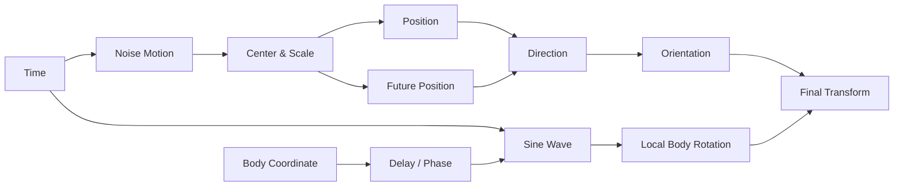

# KHÓA HỌC — PROCEDURAL FISH ANIMATION BẰNG BLENDER GEOMETRY NODES

## 1. Mục tiêu

Khóa học này dùng nội dung tutorial làm **context kỹ thuật**, sau đó giảng lại thành một lesson/course độc lập. Trọng tâm là tạo một chuyển động cá hoàn toàn procedural: vị trí thay đổi theo thời gian, thân và vây có độ trễ, cá tự xoay theo hướng đang bơi, và thân có dao động hình sin để tạo cảm giác tự đẩy trong nước.


*Ảnh tham khảo trực tuyến: [Procedural Goldfish Animations Created With Blender](https://80.lv/articles/procedural-goldfish-animations-created-with-blender/). Tham khảo hình ảnh một dự án animation cá procedural trong Blender. Không đóng gói lại ảnh; chỉ liên kết nguồn.*

## 2. Đối tượng

Phù hợp cho người đã biết giao diện Blender cơ bản và muốn học Geometry Nodes theo hướng animation/procedural motion.

## 3. Kết quả đầu ra

Sau khóa học, người học có thể:

1. Tạo quỹ đạo chuyển động không cần keyframe thủ công.
2. Dùng Noise Texture như một hàm tín hiệu theo thời gian.
3. Chuẩn hóa giá trị noise quanh tâm bằng phép trừ.
4. Điều khiển biên độ bằng Scale/Multiply.
5. Tạo độ trễ biến dạng theo vị trí dọc cơ thể.
6. Suy ra hướng chuyển động từ hai mẫu vị trí ở hai thời điểm gần nhau.
7. Căn rotation của cá theo vector vận tốc.
8. Tránh lật/xoắn sai trục bằng cách xử lý axis đúng.
9. Tạo body sway bằng `sin(time)`.
10. Đổi pattern bằng offset/seed mà không cần keyframe.
11. Chuyển workflow Blender 3.0 sang Blender mới.
12. Thiết kế một node graph sạch, có frame và nhóm tham số.

## 4. Cấu trúc

| Module | Chủ đề | Bài |
|---|---|---:|
| 01 | Nền tảng procedural motion | 2 |
| 02 | Quỹ đạo bằng Noise Texture | 2 |
| 03 | Time, speed và centering | 2 |
| 04 | Độ trễ thân/vây | 2 |
| 05 | Hướng bơi và rotation | 3 |
| 06 | Body wave và tuning | 2 |
| 07 | Migration Blender mới + project | 2 |

**Tổng: 15 bài.**

## 5. Ý tưởng toán học trung tâm

Ta xem vị trí cá là hàm của thời gian:

```text
P(t) = center + amplitude × centered_noise(t)
```

Hướng bơi xấp xỉ:

```text
D(t) = P(t + Δt) - P(t)
```

Dao động thân:

```text
wave(t, x) = A × sin(ωt + φ(x))
```

Trong đó `φ(x)` tạo độ lệch pha theo chiều dài thân, giúp đầu đi trước và đuôi/vây theo sau.

## 6. Cấu trúc thư mục

```text
khoa_hoc_geometry_nodes_ca_procedural/
├── 00_README.md
├── KHOA_HOC_GEOMETRY_NODES_CA_PROCEDURAL.md
├── IMAGE_SOURCES.md
├── REFERENCES.md
├── assets/
│   ├── gif/
│   │   └── procedural_fish_geometry_nodes.gif
│   └── images/
│       └── README.md
└── modules/
    ├── 01_nen_tang/
    ├── 02_noise_motion/
    ├── 03_time_centering/
    ├── 04_delay/
    ├── 05_orientation/
    ├── 06_body_wave/
    └── 07_modern_blender_project/
```


# TOÀN BỘ BÀI HỌC


---

# Bài 01 — Từ keyframe sang procedural animation

## 1. Mục tiêu học tập

Hiểu sự khác nhau giữa animation được vẽ bằng keyframe và animation được sinh bởi một hàm theo thời gian.

## 2. Keyframe và procedural

Trong animation truyền thống, animator xác định các trạng thái ở frame cụ thể. Procedural animation thay thế một phần công việc đó bằng hàm toán học.

Ví dụ:

```text
position = f(time)
rotation = g(position_now, position_future)
body_wave = h(time, position_along_body)
```

Nhờ vậy chuyển động có thể chạy rất dài mà không cần keyframe cho từng chu kỳ.

## 3. Tại sao Geometry Nodes phù hợp?

Geometry Nodes có thể thao tác trực tiếp với vị trí, rotation và thuộc tính của geometry bằng field. `Set Position` là node cốt lõi để thay đổi vị trí điểm/instance. Tài liệu Blender 3.0 mô tả `Position` là vị trí mới và `Offset` là phần dịch thêm.

Nguồn: https://docs.blender.org/manual/en/3.0/modeling/geometry_nodes/geometry/set_position.html

## 4. Giới hạn cần hiểu

Procedural không đồng nghĩa tự nhiên về mặt sinh học. Nếu chỉ dịch mesh và xoay cứng, cá có thể trông như một vật thể bay. Vì vậy cần thêm hướng bơi, delay dọc thân và wave.

## 5. Checkpoint

Nêu ba phần của chuyển động cá có thể procedural hóa và một phần vẫn nên dùng rig/shape deformation.


---

# Bài 02 — Kiến trúc node graph sạch

## 1. Mục tiêu học tập

Tổ chức graph thành các khối chức năng thay vì nối node thành một chuỗi khó bảo trì.

## 2. Các khối nên có



## 3. Frame hóa node

Nên tạo frame cho:

- TIME;
- PATH / POSITION;
- DELAY;
- DIRECTION;
- ORIENTATION;
- BODY WAVE;
- OUTPUT.

## 4. Nguyên tắc đặt tên

Không đặt tên kiểu `Math.003`. Hãy dùng tên mô tả như:

- `Speed`;
- `Path Amplitude`;
- `Look Ahead`;
- `Body Wave Strength`;
- `Body Wave Frequency`;
- `Tail Delay`.

## 5. Bài tập

Vẽ graph ở mức khái niệm trước khi mở Blender.


---

# Bài 03 — Noise Texture 1D làm quỹ đạo procedural

## 1. Mục tiêu học tập

Biến Noise Texture thành nguồn chuyển động theo thời gian.


*Ảnh tham khảo trực tuyến: [Blender Developer Forum — Geometry Nodes noise displacement](https://devtalk.blender.org/t/geometry-nodes/16108?page=149). Ảnh minh họa Noise Texture trong Geometry Nodes.*

## 2. Noise không chỉ để tạo texture

Noise Texture trả về tín hiệu pseudo-random liên tục. Khi đầu vào thay đổi theo thời gian, output thay đổi mượt, phù hợp để tạo một đường chuyển động hữu cơ.

Blender mô tả Noise Texture là fractal Perlin noise. Ở chế độ 1D, giá trị `W` là tọa độ dùng để lấy mẫu noise.

Nguồn Blender 3.0: https://docs.blender.org/manual/en/3.0/modeling/geometry_nodes/texture/noise.html

## 3. Thiết lập khởi đầu

Một cấu hình đơn giản:

```text
Noise Dimensions: 1D
Scale: 1
Detail: 0
W: time
```

`Detail = 0` tạo tín hiệu đơn giản hơn, dễ kiểm soát. Sau khi graph hoạt động mới tăng detail nếu cần.

## 4. Vì sao noise tốt hơn Random Value mỗi frame?

Random độc lập theo frame gây giật. Noise liên tục theo input nên vị trí chuyển mượt.

## 5. Checkpoint

Giải thích vì sao đổi `W` theo thời gian tạo animation dù không keyframe.


---

# Bài 04 — Center noise và điều khiển biên độ

## 1. Mục tiêu học tập

Biến output noise thành offset cân đối quanh vị trí gốc.

## 2. Vấn đề

Noise thường nằm trong miền dương. Nếu đưa thẳng vào Offset, cá có xu hướng bị đẩy về một phía.

## 3. Centering

Nếu noise nằm xấp xỉ `[0, 1]`, ta đưa nó về quanh 0:

```text
centered = noise - 0.5
```

Sau đó:

```text
offset = centered × amplitude
```

Ví dụ `amplitude = 10` cho phạm vi chuyển động lớn hơn.

## 4. Node graph khái niệm

```text
Noise Color/Fac
→ Subtract 0.5
→ Vector/Math Scale
→ Set Position : Offset
```

## 5. Vì sao nên expose `Amplitude`?

Không nên chôn giá trị 10, 15 hay 20 trong graph. Hãy đưa chúng thành Group Input để tái sử dụng.

## 6. Bài tập

Tạo ba preset: `Small Tank`, `Medium Tank`, `Open Water`.


---

# Bài 05 — Time, frame và speed

## 1. Mục tiêu học tập

Tách “thời gian scene” khỏi “tốc độ chuyển động”.

## 2. Workflow Blender 3.0 trong tutorial

Tutorial dùng một Value node có driver:

```text
#frame
```

rồi chia cho 24, 50 hoặc giá trị khác để làm chậm chuyển động.

## 3. Workflow Blender mới

`Scene Time` cung cấp trực tiếp:

- `Seconds`;
- `Frames`.

Do đó có thể dùng:

```text
Scene Time: Seconds
→ Multiply Speed
→ Noise W
```

hoặc:

```text
Scene Time: Frames
→ Divide FrameScale
→ Noise W
```

Nguồn: https://docs.blender.org/manual/en/3.5/modeling/geometry_nodes/input/scene/scene_time.html

## 4. Công thức

```text
t_effective = time × speed
```

hoặc tương đương:

```text
t_effective = frame / divisor
```

Divisor càng lớn thì chuyển động càng chậm.

## 5. Bài tập

Tạo Group Input `Speed` sao cho `1.0` là tốc độ cơ sở, `0.5` chậm một nửa, `2.0` nhanh gấp đôi.


---

# Bài 06 — Seed/offset để đổi pattern chuyển động

## 1. Mục tiêu học tập

Đổi “đường bơi” mà không thay cấu trúc graph.

## 2. Ý tưởng

Nếu:

```text
P(t) = Noise(t)
```

thì:

```text
P_seed(t) = Noise(t + seed)
```

sẽ lấy một đoạn khác trên cùng trường noise.

## 3. Ứng dụng

Một `Add` node trước input noise cho phép:

```text
time + 500
```

hoặc một Group Input `Seed`.

Điều này rất hữu ích khi tạo nhiều cá: mỗi cá dùng một seed khác nhau nên không bơi giống hệt nhau.

## 4. Cảnh báo

Seed chỉ đổi pattern; nó không tự tạo avoidance, schooling hay collision.

## 5. Checkpoint

Giải thích tại sao 20 con cá dùng cùng `time`, `speed`, `seed` sẽ trông nhân bản.


---

# Bài 07 — Dùng Position để tạo độ trễ dọc thân

## 1. Mục tiêu học tập

Tạo một mask/gradient biểu diễn vị trí từ đầu tới đuôi.

## 2. Vấn đề “cá như vật thể cứng”

Nếu toàn bộ vertex nhận cùng rotation/offset, đầu, thân và đuôi cùng chuyển một lúc.

## 3. Tạo gradient

Có thể dùng:

```text
Position
→ Distance / Map Range / Separate XYZ
→ Normalize
```

để tạo `body_factor` từ khoảng 0 ở đầu đến 1 ở đuôi.

Nếu mesh được định hướng dọc một trục rõ ràng, `Separate XYZ` thường ổn định hơn `Distance from origin`.

## 4. Body factor

```text
body_factor = normalized longitudinal coordinate
```

Từ đó:

```text
delay = body_factor × DelayStrength
```

## 5. Checkpoint

Khi origin của mesh không nằm ở đầu hoặc giữa thân, dùng Distance-from-origin có thể gây lỗi gì?


---

# Bài 08 — Phase delay: đầu đi trước, đuôi theo sau

## 1. Mục tiêu học tập

Biến gradient dọc thân thành độ trễ thời gian.

## 2. Hai cách tư duy

### 2.1 Delay trực tiếp

```text
local_time = time - body_factor × delay
```

### 2.2 Phase offset cho sóng

```text
phase = time × frequency - body_factor × phase_delay
```

## 3. Ý nghĩa

- đầu: `body_factor ≈ 0` → phản ứng sớm;
- thân giữa: trễ vừa;
- đuôi/vây sau: trễ lớn.

## 4. Tuning

Giá trị âm/dương phụ thuộc trục và hướng mesh. Không nên học thuộc “-50”; hãy kiểm tra bằng nguyên lý: **đầu phải thay đổi trước, đuôi phải theo sau**.

## 5. Bài tập

Tạo một viewer/debug color từ `body_factor` để chắc chắn gradient chạy đúng chiều.


---

# Bài 09 — Future position và vector hướng bơi

## 1. Mục tiêu học tập

Suy ra hướng bơi từ quỹ đạo procedural.

## 2. Ý tưởng đạo hàm số

Nếu biết vị trí hiện tại và vị trí tương lai rất gần:

```text
P0 = P(t)
P1 = P(t + Δt)
D = P1 - P0
```

`D` là xấp xỉ vector vận tốc.

## 3. Look Ahead

`Δt` nhỏ:

- hướng phản ứng nhanh;
- dễ rung nếu noise thay đổi mạnh.

`Δt` lớn:

- hướng mượt hơn;
- có thể “cắt góc” và phản ứng chậm.

Tutorial sử dụng một offset nhỏ; cách tốt hơn là expose `Look Ahead`.

## 4. Bài tập

Thử ba giá trị `Look Ahead` và ghi nhận độ mượt của rotation.


---

# Bài 10 — Căn rotation theo vector chuyển động

## 1. Mục tiêu học tập

Làm đầu cá hướng theo vector `D`.

## 2. Blender 3.0

Tutorial sử dụng `Align Euler to Vector`. Node này xoay Euler rotation để một local axis hướng về vector chỉ định.

Nguồn Blender 3.0: https://docs.blender.org/manual/en/3.0/modeling/geometry_nodes/utilities/align_euler_to_vector.html

## 3. Blender mới

Trong các bản mới, workflow tương đương dùng `Align Rotation to Vector`. `Align Euler to Vector` được đưa vào nhóm deprecated.

Nguồn mới: https://docs.blender.org/manual/en/5.2/modeling/geometry_nodes/utilities/rotation/align_rotation_to_vector.html

## 4. Chọn axis đúng

Nếu đầu cá trong local space hướng theo:

- +X → align X;
- +Y → align Y;
- +Z → align Z.

Sai axis là nguyên nhân phổ biến khiến cá đi ngang, dựng đứng hoặc quay ngược.

## 5. Checkpoint

Trước khi sửa node, làm cách nào xác định local forward axis của model?


---

# Bài 11 — Tránh flip, twist và lỗi thứ tự transform

## 1. Mục tiêu học tập

Chẩn đoán các lỗi rotation thường gặp.

## 2. Hai lớp rotation

Một con cá 3D thường cần:

1. **Heading rotation:** hướng toàn thân theo quỹ đạo.
2. **Local body rotation:** dao động thân quanh trục cục bộ.

Nếu trộn hai loại trong world space, cá dễ lật.

## 3. Trục phụ

Tutorial xử lý thêm một bước align trên trục thứ hai để giữ orientation ổn định. Trong workflow mới, tư duy tương đương là xây rotation từ forward vector cùng một up reference ổn định, hoặc dùng các rotation utilities phù hợp.

## 4. Position và Offset

`Set Position` tính `Position` và `Offset` trong cùng node theo quy tắc field của Blender; cần hiểu rõ đâu là vị trí mục tiêu và đâu là dịch chuyển bổ sung. Nguồn: https://docs.blender.org/manual/en/3.0/modeling/geometry_nodes/geometry/set_position.html

## 5. Debug checklist

- Apply Rotation/Scale nếu cần.
- Kiểm tra local axes.
- Visualize direction vector.
- Giảm look-ahead.
- Giảm body rotation strength.
- Kiểm tra dấu `P1 - P0` chứ không phải `P0 - P1`.

## 6. Bài tập

Tạo một Empty hoặc vector debug để hiển thị forward direction.


---

# Bài 12 — Sine wave cho chuyển động thân

## 1. Mục tiêu học tập

Tạo một dao động lặp có kiểm soát thay vì dùng noise cho mọi thứ.

## 2. Hàm cơ bản

```text
wave = sin(time × frequency) × strength
```

Sau đó áp wave vào rotation quanh trục uốn thân.

## 3. Thêm phase theo thân

```text
wave = sin(time × frequency - body_factor × phase) × strength
```

Đây là dạng phù hợp hơn vì sóng lan từ trước ra sau.

## 4. Local space

Body sway nên xảy ra trong local space của cá. Nếu dùng world Z cho mọi hướng, cá quay sang hướng khác sẽ uốn sai.

Ở Blender mới có nhiều utility rotation/vector rõ ràng hơn, bao gồm `Rotate Rotation` và `Rotate Vector`; manual mới liệt kê `Align Rotation to Vector` trong nhóm Rotation utilities.

Nguồn: https://docs.blender.org/manual/en/latest/modeling/geometry_nodes/utilities/vector/vector_rotate.html

## 5. Checkpoint

Phân biệt `frequency`, `strength` và `phase delay`.


---

# Bài 13 — Tuning để cá bớt “máy móc”

## 1. Mục tiêu học tập

Biết chỉnh tham số theo vai trò thay vì thử số ngẫu nhiên.

## 2. Bộ tham số nên expose

| Tham số | Chức năng |
|---|---|
| Speed | Tốc độ chạy qua trường noise |
| Path Scale | Độ lớn vùng bơi |
| Seed | Pattern quỹ đạo |
| Look Ahead | Độ mượt hướng quay |
| Body Frequency | Nhịp quẫy |
| Body Strength | Biên độ uốn |
| Tail Phase | Độ trễ đầu → đuôi |
| Turn Strength | Mức nghiêng khi đổi hướng |

## 3. Nguyên tắc phối hợp

Khi tốc độ tăng, thường cần tăng nhẹ frequency/amplitude của đuôi. Khi hover hoặc bơi chậm, thân ít uốn và vây ngực có thể đảm nhận phần lớn chuyển động.

## 4. Noise vs sine

- Noise: phù hợp cho quỹ đạo, drift, variation.
- Sine: phù hợp cho nhịp propulsion có chu kỳ.
- Noise nhẹ có thể modulate sine để tránh tuyệt đối đều.

## 5. Bài tập

Tạo ba preset: `Idle`, `Cruise`, `Fast Swim`.


---

# Bài 14 — Chuyển workflow Blender 3.0 sang Blender mới

## 1. Mục tiêu học tập

Không bị kẹt vì tên node cũ.

## 2. Mapping khái niệm

| Tutorial Blender 3.0 | Blender mới |
|---|---|
| Value + driver `#frame` | `Scene Time` |
| Align Euler to Vector | Align Rotation to Vector |
| Rotate Euler | Rotate Rotation / rotation utilities |
| Vector Math/Math | Vẫn dùng, socket/type có thể khác |
| Set Position | Vẫn là node nền tảng |
| Noise Texture | Vẫn dùng, nhiều tham số hơn |

`Scene Time` xuất thời gian theo giây hoặc frame. Trong manual Blender mới, `Align Euler to Vector` và `Rotate Euler` nằm trong nhóm deprecated, còn Rotation utilities mới gồm `Align Rotation to Vector`, `Axes to Rotation`, `Rotate Rotation` và `Rotate Vector`.

Nguồn:
- https://docs.blender.org/manual/en/3.5/modeling/geometry_nodes/input/scene/scene_time.html
- https://docs.blender.org/manual/en/5.2/modeling/geometry_nodes/utilities/rotation/align_rotation_to_vector.html
- https://docs.blender.org/manual/en/latest/modeling/geometry_nodes/texture/noise.html

## 3. Nguyên tắc migration

Không cố “dịch node từng cái”. Hãy dịch **ý nghĩa**:

```text
time → path → future sample → direction → orientation → local deformation
```

## 4. Checkpoint

Nếu một node tutorial biến mất, hãy xác định input/output mà nó thực hiện trước khi tìm node thay thế.


---

# Bài 15 — Project: cá bơi procedural vô hạn

## 1. Mục tiêu

Tạo một Geometry Nodes setup có thể chạy tùy ý lâu mà không keyframe thủ công.


*Ảnh tham khảo trực tuyến: [Blender Artists — fish tail Geometry Nodes troubleshooting](https://blenderartists.org/t/my-fish-tail-is-going-all-over-the-place-in-geometry-node/1467949). Ảnh giao diện Geometry Nodes có Noise Texture, Subtract và Set Position.*

## 2. Yêu cầu chức năng

### 2.1 Motion

- Noise-driven path.
- Centered around một vùng xác định.
- Speed điều chỉnh được.
- Seed điều chỉnh được.

### 2.2 Orientation

- Cá hướng theo `P(t + Δt) - P(t)`.
- Không lật ngược khi đổi hướng.
- Local forward axis được tài liệu hóa.

### 2.3 Body deformation

- Sine wave.
- Phase delay dọc thân.
- Tail mạnh hơn head.
- Có thể bật/tắt deformation.

### 2.4 Organization

Node graph bắt buộc chia frame:

1. TIME
2. PATH
3. CENTER/SCALE
4. DIRECTION
5. ORIENTATION
6. BODY MASK
7. BODY WAVE
8. OUTPUT

## 3. Deliverable

- `.blend`.
- 1 GIF/MP4 preview.
- Screenshot full node graph.
- Bảng thông số.
- README giải thích local axes.
- 3 preset: slow, normal, fast.

## 4. Rubric

| Tiêu chí | Điểm |
|---|---:|
| Procedural path | 15 |
| Speed/seed parameterization | 10 |
| Orientation chính xác | 20 |
| Không flip/twist nghiêm trọng | 15 |
| Body wave có phase delay | 20 |
| Node organization | 10 |
| Documentation | 5 |
| Preview | 5 |
| **Tổng** | **100** |

## 5. Mở rộng

Có thể phát triển tiếp sang:

- bể cá giới hạn;
- obstacle avoidance;
- nhiều cá với seed khác nhau;
- schooling;
- proximity steering;
- kết hợp Geometry Nodes với armature;
- điều khiển vây theo turning state.


---

# TÀI LIỆU THAM KHẢO

## 1. Blender 3.0

- Set Position: https://docs.blender.org/manual/en/3.0/modeling/geometry_nodes/geometry/set_position.html
- Noise Texture: https://docs.blender.org/manual/en/3.0/modeling/geometry_nodes/texture/noise.html
- Align Euler to Vector: https://docs.blender.org/manual/en/3.0/modeling/geometry_nodes/utilities/align_euler_to_vector.html

## 2. Blender mới

- Scene Time: https://docs.blender.org/manual/en/3.5/modeling/geometry_nodes/input/scene/scene_time.html
- Align Rotation to Vector: https://docs.blender.org/manual/en/5.2/modeling/geometry_nodes/utilities/rotation/align_rotation_to_vector.html
- Vector Rotate: https://docs.blender.org/manual/en/latest/modeling/geometry_nodes/utilities/vector/vector_rotate.html
- Noise Texture (latest): https://docs.blender.org/manual/en/latest/modeling/geometry_nodes/texture/noise.html

## 3. Tài liệu hình ảnh/tham khảo cộng đồng

- Procedural Goldfish Animations — 80 Level: https://80.lv/articles/procedural-goldfish-animations-created-with-blender/
- Fish tail Geometry Nodes troubleshooting — Blender Artists: https://blenderartists.org/t/my-fish-tail-is-going-all-over-the-place-in-geometry-node/1467949
- Geometry Nodes noise discussion — Blender Developer Forum: https://devtalk.blender.org/t/geometry-nodes/16108?page=149

## 4. Ghi chú phiên bản

Transcript gốc mô tả Blender 3.0. Khóa học giữ nguyên logic toán học nhưng bổ sung mapping sang node hiện đại. Khi tên node hoặc socket thay đổi, ưu tiên đọc manual đúng phiên bản Blender đang sử dụng.
