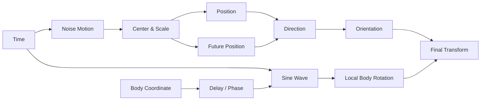

# Bài 02 — Kiến trúc node graph sạch

## 1. Mục tiêu học tập

Tổ chức graph thành các khối chức năng thay vì nối node thành một chuỗi khó bảo trì.

## 2. Các khối nên có

## 3. Frame hóa node

Nên tạo frame cho:

- TIME;
- PATH / POSITION;
- DELAY;
- DIRECTION;
- ORIENTATION;
- BODY WAVE;
- OUTPUT.

## 4. Nguyên tắc đặt tên

Không đặt tên kiểu `Math.003`. Hãy dùng tên mô tả như:

- `Speed`;
- `Path Amplitude`;
- `Look Ahead`;
- `Body Wave Strength`;
- `Body Wave Frequency`;
- `Tail Delay`.

## 5. Bài tập

Vẽ graph ở mức khái niệm trước khi mở Blender.
