# 01 — Chúng ta sẽ tạo ra sản phẩm gì?

| Thuộc tính            | Nội dung                                                                      |
| --------------------- | ----------------------------------------------------------------------------- |
| **Video**             | *Learn How to Animate and Render a Fish in Blender! — Beginner Friendly*      |
| **Chương**            | What We'll Be Creating                                                        |
| **Tên tiếng Việt**    | Chúng ta sẽ tạo ra sản phẩm gì?                                               |
| **Thời điểm bắt đầu** | 00:00:00                                                                      |
| **Thời lượng**        | 1 phút 19 giây                                                                |
| **Chủ đề chính**      | Giới thiệu sản phẩm cuối, phương pháp giảng dạy và phạm vi của khóa hướng dẫn |

---

## 1. Tổng quan chương

Đây là phần mở đầu của một **mega tutorial** về cách tạo hoạt ảnh và render một con cá trong Blender.

Khác với các video hướng dẫn ngắn chỉ tập trung vào một kỹ thuật riêng lẻ, video này ghi lại gần như toàn bộ quá trình làm việc thực tế, từ lúc bắt đầu với Blender ở trạng thái mặc định cho đến khi hoàn thành cảnh cá bơi và render sản phẩm cuối.

Tác giả nhấn mạnh rằng video được xây dựng theo hướng:

* Thân thiện với người mới bắt đầu.
* Không giả định người xem đã biết Blender.
* Giải thích cả những thao tác nhỏ.
* Không bỏ qua các bước cài đặt hoặc thiết lập.
* Trình bày cả quá trình thử nghiệm, điều chỉnh và sửa lỗi.
* Đi từ một tệp Blender mặc định đến sản phẩm hoàn chỉnh.

---

## 2. Mục tiêu bài học

Sau chương này, người học cần:

* Hình dung được sản phẩm cuối cùng sẽ tạo ra.
* Hiểu cấu trúc và phong cách giảng dạy của video.
* Biết rằng toàn bộ hoạt ảnh sẽ được xây dựng từ đầu.
* Nắm được các giai đoạn chính của quy trình làm hoạt ảnh cá.
* Chuẩn bị tâm lý cho một video dài, chi tiết và có nhiều bước thử nghiệm.
* Hiểu sự khác biệt giữa một hướng dẫn ngắn và một quy trình sản xuất thực tế.

---

## 3. Sản phẩm cuối cùng

Mục tiêu của video là tạo ra một cảnh hoạt ảnh có các thành phần chính sau:

* Một model cá 3D.
* Chuyển động bơi tự nhiên của thân cá.
* Chuyển động mềm mại của đuôi và các vây.
* Một đường bơi uốn lượn trong không gian 3D.
* Camera chuyển động theo cá.
* Texture và vật liệu phù hợp với môi trường dưới nước.
* Ánh sáng tạo cảm giác đang ở trong hồ hoặc đại dương.
* Motion blur ở các bộ phận chuyển động nhanh.
* Một cảnh render hoàn chỉnh có thể xuất thành video.

Sản phẩm cuối không chỉ là một vòng lặp đuôi cá đơn giản. Con cá sẽ đồng thời thực hiện hai loại chuyển động:

1. **Chuyển động cục bộ**

   Thân, đuôi và vây dao động để tạo cảm giác cá đang bơi.

2. **Chuyển động toàn cục**

   Toàn bộ con cá di chuyển dọc theo một đường bơi trong không gian.

Có thể hình dung cấu trúc chuyển động như sau:

```text
Chuyển động của cá
│
├── Chuyển động tại chỗ
│   ├── Thân uốn cong
│   ├── Đuôi dao động
│   ├── Vây chuyển động
│   └── Đầu điều chỉnh nhẹ
│
└── Chuyển động trong không gian
    ├── Bám theo đường Curve
    ├── Thay đổi hướng
    ├── Thay đổi độ cao
    └── Camera đi theo
```

---

## 4. Đặc điểm của mega tutorial

Tác giả gọi đây là **hướng dẫn lớn đầu tiên** của mình.

Mục tiêu không phải là tạo ra một video thật ngắn, mà là ghi lại đầy đủ quá trình tạo sản phẩm.

Tác giả không đặt giới hạn nghiêm ngặt cho độ dài của video. Thay vào đó, ưu tiên lớn nhất là giải thích rõ:

* Mỗi nút bấm dùng để làm gì.
* Mỗi thiết lập ảnh hưởng đến kết quả như thế nào.
* Tại sao phải thay đổi một thông số.
* Khi nào một kỹ thuật hoạt động không đúng.
* Cách sửa lỗi trong quá trình làm.
* Những công cụ hoặc tiện ích nào thực sự cần thiết.

Điều này đặc biệt hữu ích với người mới vì nhiều hướng dẫn Blender thường bỏ qua những bước nhỏ như:

* Chọn đúng đối tượng.
* Chuyển giữa Object Mode và Edit Mode.
* Áp dụng Transform.
* Thay đổi điểm gốc của đối tượng.
* Chọn đúng modifier.
* Thiết lập frame đầu và cuối.
* Bật hoặc tắt các tùy chọn render.
* Cài đặt add-on.
* Kiểm tra hướng trục của model.

Trong video này, tác giả cam kết sẽ không giả định rằng người xem đã biết sẵn những thao tác đó.

---

## 5. Điểm khác biệt so với video trước

Trước đó, tác giả đã thực hiện một video hướng dẫn ngắn hơn về animation cá.

Trong video ngắn, kỹ thuật có thể được trình bày theo hướng:

* Đi thẳng vào kết quả.
* Chỉ giữ lại các thao tác quan trọng nhất.
* Loại bỏ phần thử nghiệm.
* Không giải thích quá sâu từng cài đặt.
* Tập trung vào một mẹo hoặc kỹ thuật cốt lõi.

Tác giả cho rằng bản thân hoạt ảnh cá có thể được thực hiện trong khoảng 10 phút nếu người làm đã quen quy trình.

Tuy nhiên, video hiện tại không hướng tới việc hoàn thành nhanh nhất. Mục tiêu là giúp người mới hiểu toàn bộ quy trình.

| Video ngắn                   | Mega tutorial                    |
| ---------------------------- | -------------------------------- |
| Tập trung vào kỹ thuật chính | Trình bày toàn bộ quy trình      |
| Tốc độ nhanh                 | Giải thích chậm và chi tiết      |
| Có thể bỏ qua bước cơ bản    | Bắt đầu từ Blender mặc định      |
| Ít phần thử nghiệm           | Có cả thử sai và sửa lỗi         |
| Phù hợp để xem nhanh         | Phù hợp để học và thực hành theo |

---

## 6. Điểm bắt đầu của dự án

Tác giả bắt đầu bằng một tệp Blender hoàn toàn mặc định.

Thao tác được đề cập là:

```text
File → Defaults → Load Factory Settings
```

Hoặc tùy theo phiên bản Blender:

```text
File → Defaults → Load Factory Settings
```

Sau khi tải cài đặt gốc, Blender trở về trạng thái gần giống như khi mới được cài đặt:

* Giao diện mặc định.
* Scene mặc định.
* Cube mặc định.
* Camera mặc định.
* Light mặc định.
* Không phụ thuộc vào workspace cá nhân.
* Không phụ thuộc vào phím tắt đã chỉnh sửa.
* Không phụ thuộc vào add-on riêng của tác giả.

Điều này giúp người học dễ thực hiện theo vì giao diện của họ sẽ gần giống với giao diện trong video.

---

## 7. Vì sao nên bắt đầu từ cài đặt mặc định?

Bắt đầu từ cài đặt mặc định mang lại một số lợi ích:

### 7.1. Giảm sự khác biệt giữa người dạy và người học

Nếu tác giả sử dụng một giao diện đã tùy biến mạnh, người mới có thể không tìm thấy các nút hoặc bảng điều khiển tương ứng.

### 7.2. Tránh phụ thuộc vào add-on

Một số hướng dẫn sử dụng add-on nhưng không giải thích cách cài đặt. Điều này khiến người học không thể tiếp tục nếu máy chưa có công cụ đó.

### 7.3. Dễ xác định nguyên nhân lỗi

Khi mọi người bắt đầu từ cùng một trạng thái, việc tìm lỗi sẽ dễ hơn.

### 7.4. Phù hợp với người mới

Người mới có thể làm theo từng bước mà không cần chuẩn bị một project phức tạp từ trước.

---

## 8. Quy trình tổng thể của video

Quy trình dự kiến sẽ đi qua các giai đoạn sau:

```mermaid
flowchart LR
    A[Khởi tạo Blender mặc định] --> B[Tìm và nhập model cá]
    B --> C[Kiểm tra và tối ưu model]
    C --> D[Tạo đường bơi bằng Curve]
    D --> E[Tạo chuyển động bơi cơ bản]
    E --> F[Tinh chỉnh thân, đuôi và vây]
    F --> G[Tạo Shape Keys nếu cần]
    G --> H[Thiết lập texture và vật liệu]
    H --> I[Thiết lập ánh sáng dưới nước]
    I --> J[Thiết lập camera]
    J --> K[Thêm Motion Blur]
    K --> L[Render hoạt ảnh cuối]
```



Có thể chia quy trình thành bốn nhóm lớn.

### Giai đoạn 1 — Chuẩn bị

* Khởi tạo project.
* Tìm model cá.
* Nhập model vào Blender.
* Kiểm tra kích thước và hướng của model.
* Dọn dẹp scene.

### Giai đoạn 2 — Tạo chuyển động

* Tạo đường Curve.
* Cho cá bám theo Curve.
* Tạo vòng lặp bơi.
* Làm thân cá uốn cong.
* Điều khiển đuôi và vây.
* Tinh chỉnh tốc độ.

### Giai đoạn 3 — Hoàn thiện hình ảnh

* Thiết lập vật liệu.
* Chỉnh texture.
* Tạo ánh sáng.
* Tạo môi trường dưới nước.
* Thiết lập camera.

### Giai đoạn 4 — Render

* Bật motion blur.
* Kiểm tra frame.
* Thiết lập độ phân giải.
* Chọn định dạng đầu ra.
* Render animation.
* Xuất video cuối.

---

## 9. Cấu trúc chuyển động dự kiến

Một hoạt ảnh cá tự nhiên thường không được tạo bằng một animation duy nhất.

Thay vào đó, nó là sự kết hợp của nhiều lớp chuyển động.

```text
Animation cuối
│
├── Swim Cycle
│   ├── Thân lắc nhẹ
│   ├── Đuôi quẫy
│   ├── Vây ngực đập
│   └── Vây lưng và vây hậu môn rung nhẹ
│
├── Path Animation
│   ├── Di chuyển tiến về phía trước
│   ├── Rẽ trái hoặc phải
│   ├── Lên hoặc xuống
│   └── Thay đổi tốc độ
│
├── Secondary Motion
│   ├── Đầu nghiêng nhẹ
│   ├── Vây có độ trễ
│   ├── Thân phản ứng theo hướng rẽ
│   └── Đuôi follow-through
│
└── Camera Animation
    ├── Camera bám theo
    ├── Camera lia ngang
    ├── Điều chỉnh khoảng cách
    └── Motion blur
```

Điểm quan trọng là **vòng lặp bơi** và **đường di chuyển** nên được tách biệt.

Nhờ đó:

* Có thể thay đổi đường bơi mà không phải làm lại chuyển động đuôi.
* Có thể dùng lại một swim cycle cho nhiều cảnh.
* Có thể điều chỉnh tốc độ tiến riêng với tốc độ quẫy đuôi.
* Có thể tạo nhiều đường bơi khác nhau cho cùng một model.

---

## 10. Quy trình thực hành gợi ý

### Bước 1 — Xem trước kết quả cuối

Quan sát kỹ:

* Tốc độ bơi của cá.
* Mức độ uốn của thân.
* Độ mạnh của đuôi.
* Cách các vây phản ứng.
* Đường bơi.
* Chuyển động camera.
* Ánh sáng.
* Motion blur.

Không nên chỉ nhìn tổng thể. Hãy chú ý từng thành phần chuyển động riêng biệt.

### Bước 2 — Xác định mục tiêu cá nhân

Trước khi thực hành, cần quyết định:

* Sử dụng loại cá nào.
* Cá bơi chậm hay nhanh.
* Cảnh đặt trong hồ hay đại dương.
* Camera cố định hay đi theo cá.
* Render theo phong cách chân thực hay stylized.
* Hoạt ảnh dùng cho video, game hay ứng dụng mobile.

### Bước 3 — Chuẩn bị Blender

Nên sử dụng:

* Một phiên bản Blender ổn định.
* Phiên bản LTS nếu ưu tiên độ ổn định.
* Chuột có nút giữa để điều khiển viewport dễ hơn.
* Thư mục project riêng.
* Thư mục lưu texture.
* Thư mục render output.

Ví dụ cấu trúc thư mục:

```text
fish-animation/
├── blend/
│   └── fish_animation.blend
├── models/
│   └── fish_model.fbx
├── textures/
│   ├── fish_basecolor.png
│   ├── fish_normal.png
│   └── fish_roughness.png
├── references/
│   └── swimming_reference.mp4
└── renders/
    ├── frames/
    └── final/
```

### Bước 4 — Đọc trước danh sách chương

Việc xem trước các mốc thời gian giúp người học biết:

* Phần nào đang dựng model.
* Phần nào đang tạo animation.
* Phần nào đang xử lý texture.
* Phần nào đang render.
* Phần nào có thể tua nhanh.
* Phần nào cần dừng lại để thực hành.

---

## 11. Phím tắt và công cụ liên quan

Chương mở đầu chưa có nhiều thao tác Blender cụ thể.

Tuy nhiên, các thao tác cơ bản có thể được sử dụng ở các chương tiếp theo gồm:

| Phím tắt           | Chức năng                            |
| ------------------ | ------------------------------------ |
| `Ctrl + N`         | Tạo project Blender mới              |
| `Ctrl + Shift + S` | Save As                              |
| `Ctrl + S`         | Lưu project                          |
| `A`                | Chọn toàn bộ đối tượng               |
| `X` hoặc `Delete`  | Xóa đối tượng                        |
| `Shift + A`        | Thêm đối tượng mới                   |
| `G`                | Di chuyển                            |
| `R`                | Xoay                                 |
| `S`                | Thay đổi kích thước                  |
| `Tab`              | Chuyển giữa Object Mode và Edit Mode |
| `Numpad 0`         | Chuyển sang góc nhìn camera          |
| `Space`            | Phát hoặc dừng timeline              |
| `I`                | Thêm keyframe                        |
| `Ctrl + Z`         | Hoàn tác                             |
| `Ctrl + Shift + Z` | Làm lại thao tác                     |

---

## 12. Lưu ý quan trọng

### 12.1. Không cần sao chép chính xác mọi lựa chọn thẩm mỹ

Người học không bắt buộc phải sử dụng:

* Cùng một loại cá.
* Cùng màu sắc.
* Cùng texture.
* Cùng bố cục.
* Cùng đường Curve.
* Cùng góc camera.

Mục tiêu chính là hiểu kỹ thuật để áp dụng vào project riêng.

### 12.2. Video dài không có nghĩa là mọi phần đều quan trọng như nhau

Do đây là video raw hoặc ít chỉnh sửa, có thể xuất hiện:

* Những đoạn tác giả suy nghĩ.
* Những thử nghiệm không thành công.
* Những thao tác bị làm lại.
* Những khoảng thời gian tìm kiếm cài đặt.
* Những phần debug.

Nếu chỉ cần một kỹ thuật cụ thể, người xem có thể tua đến chương tương ứng.

Nếu muốn hiểu quy trình sản xuất thực tế, nên xem đầy đủ hơn.

### 12.3. Nên lưu project theo nhiều phiên bản

Không nên chỉ sử dụng một tệp duy nhất trong suốt quá trình.

Ví dụ:

```text
fish_animation_01_setup.blend
fish_animation_02_curve.blend
fish_animation_03_swim_cycle.blend
fish_animation_04_material.blend
fish_animation_05_camera.blend
fish_animation_06_final.blend
```

Cách này giúp quay lại phiên bản cũ khi project gặp lỗi.

### 12.4. Không nên làm chuyển động quá mạnh

Đối với model cá có vây dài hoặc mesh mỏng:

* Thân không nên uốn quá gắt.
* Đuôi không nên quẫy quá rộng.
* Vây không nên xoay quá nhanh.
* Curve không nên có góc gấp.
* Tốc độ không nên thay đổi đột ngột.

Chuyển động quá mạnh có thể gây:

* Méo mesh.
* Vây xuyên vào thân.
* Đuôi bị gãy hình.
* Cá rung giật.
* Motion blur quá lớn.
* Model trông giống đang vùng vẫy thay vì bơi.

---

## 13. Lỗi thường gặp

### Lỗi 1 — Giao diện không giống video

**Nguyên nhân:**

* Người học sử dụng workspace tùy chỉnh.
* Phiên bản Blender khác.
* Một số panel đang bị đóng.
* Add-on chưa được bật.

**Cách xử lý:**

* Chuyển về workspace Layout.
* Khôi phục cài đặt mặc định khi cần.
* Kiểm tra phiên bản Blender.
* Không xóa toàn bộ cài đặt cá nhân nếu chưa sao lưu.

---

### Lỗi 2 — Quá tập trung vào việc làm giống hệt sản phẩm mẫu

Điều này có thể khiến người học bỏ qua mục tiêu quan trọng hơn là hiểu kỹ thuật.

Nên tập trung vào:

* Cách tạo đường bơi.
* Cách tạo vòng lặp.
* Cách tách chuyển động cục bộ và toàn cục.
* Cách kiểm soát deformation.
* Cách thiết lập camera và render.

---

### Lỗi 3 — Không lưu project từ đầu

Blender có thể bị treo hoặc project có thể hỏng do modifier, simulation hoặc mesh phức tạp.

Nên lưu ngay khi bắt đầu:

```text
Ctrl + Shift + S
```

Sau đó tiếp tục lưu thường xuyên bằng:

```text
Ctrl + S
```

---

### Lỗi 4 — Không đặt mục tiêu đầu ra

Một model dùng cho video render có thể khác model dùng trong ứng dụng mobile.

Nếu sản phẩm dùng cho mobile, cần ưu tiên:

* Số polygon thấp hơn.
* Texture được tối ưu.
* Ít bone hơn.
* Ít Shape Key hơn.
* Animation loop ngắn.
* Không phụ thuộc simulation nặng.
* Có thể xuất sang GLB hoặc glTF.

---

## 14. Checklist thực hành

### Chuẩn bị

* [ ] Đã xem đoạn preview sản phẩm cuối.
* [ ] Đã xác định loại cá muốn sử dụng.
* [ ] Đã xác định phong cách chân thực hoặc stylized.
* [ ] Đã cài đặt một phiên bản Blender ổn định.
* [ ] Đã tạo thư mục project.
* [ ] Đã lưu tệp `.blend` đầu tiên.

### Hiểu quy trình

* [ ] Hiểu rằng video bắt đầu từ Blender mặc định.
* [ ] Hiểu sự khác biệt giữa swim cycle và path animation.
* [ ] Hiểu rằng tác giả sẽ trình bày cả phần thử nghiệm và sửa lỗi.
* [ ] Đã đọc trước danh sách chương.
* [ ] Biết các giai đoạn chính từ model đến render.

### Mục tiêu sản phẩm

* [ ] Cá có chuyển động thân và đuôi tự nhiên.
* [ ] Cá có thể bám theo một đường Curve.
* [ ] Đường bơi không quá cứng hoặc lặp máy móc.
* [ ] Camera có thể theo dõi cá.
* [ ] Cảnh có ánh sáng phù hợp.
* [ ] Có thể render thành video hoàn chỉnh.

---

## 15. Kết quả cần đạt sau chương

Sau khi hoàn thành chương mở đầu, người học chưa cần thực hiện animation ngay.

Kết quả quan trọng nhất là đã hiểu được:

1. Sản phẩm cuối sẽ trông như thế nào.
2. Video sẽ trình bày toàn bộ quy trình từ đầu.
3. Người học không cần có sẵn nhiều kiến thức Blender.
4. Hoạt ảnh cá sẽ bao gồm nhiều lớp chuyển động.
5. Quy trình sẽ bắt đầu từ một tệp Blender mặc định.
6. Mục tiêu là hiểu kỹ thuật, không phải sao chép chính xác sản phẩm mẫu.

---

## 16. Tóm tắt

Chương đầu tiên giới thiệu mục tiêu của toàn bộ video: tạo và render một con cá bơi trong Blender với chuyển động tự nhiên, đường bơi uốn lượn, vật liệu, ánh sáng, camera và motion blur.

Đây là một mega tutorial dành cho người mới, trong đó tác giả sẽ bắt đầu từ cài đặt Blender mặc định và giải thích gần như toàn bộ các bước cần thiết. Thay vì chỉ trình bày một kỹ thuật nhanh trong khoảng 10 phút, video ghi lại đầy đủ quá trình xây dựng sản phẩm, bao gồm cả thử nghiệm, điều chỉnh và sửa lỗi.

Sơ đồ tổng quát của bài học:

```text
Blender mặc định
        ↓
Chuẩn bị model cá
        ↓
Tạo chuyển động bơi
        ↓
Tạo đường di chuyển
        ↓
Tinh chỉnh thân và vây
        ↓
Texture và ánh sáng
        ↓
Camera và motion blur
        ↓
Render sản phẩm cuối
```
