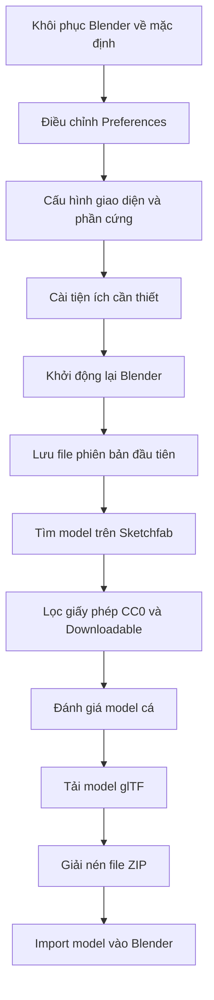
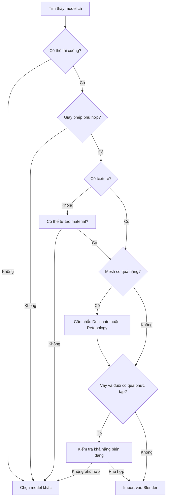

# 02 — Thiết lập Blender và tìm model cá

| Thuộc tính       | Nội dung                                                                        |
| ---------------- | ------------------------------------------------------------------------------- |
| **Video**        | Learn How to Animate and Render a Fish in Blender! (Beginner Friendly)          |
| **Chương**       | Finding a Fish Model                                                            |
| **Thời điểm**    | 00:01:19                                                                        |
| **Thời lượng**   | 14:51                                                                           |
| **Chủ đề chính** | Thiết lập Blender, lưu file theo phiên bản và tìm model cá có giấy phép phù hợp |

---

## 1. Mục tiêu bài học

Sau chương này, người học có thể:

* Điều chỉnh giao diện Blender để dễ quan sát và thao tác hơn.
* Bật quyền truy cập trực tuyến để cài đặt Blender Extensions.
* Chọn đúng công nghệ tăng tốc render cho GPU.
* Tăng số bước hoàn tác khi máy tính có đủ RAM.
* Tắt chế độ tự động tạo proxy video không cần thiết.
* Cài đặt tiện ích hiển thị phím bấm khi quay hướng dẫn.
* Lưu file Blender theo hệ thống phiên bản.
* Tìm model cá miễn phí trên Sketchfab.
* Kiểm tra giấy phép sử dụng trước khi tải model.
* Tải, giải nén và chuẩn bị import model định dạng glTF vào Blender.

---

## 2. Tổng quan quy trình



---

# Phần A — Thiết lập Blender

## 3. Khôi phục Blender về trạng thái mặc định

Video bắt đầu với Blender đã được khôi phục về cài đặt gốc.

Việc bắt đầu từ trạng thái mặc định giúp:

* Giảm sự khác biệt giữa giao diện của người hướng dẫn và người học.
* Tránh lỗi do các addon hoặc thiết lập cũ.
* Dễ theo dõi chính xác vị trí của từng tùy chọn.
* Tạo môi trường làm việc ổn định cho toàn bộ dự án.

Nếu Blender của bạn đã được tùy chỉnh nhiều, có thể cân nhắc sử dụng:

```text
File → Defaults → Load Factory Settings
```

> Không bắt buộc phải khôi phục Blender nếu môi trường hiện tại vẫn hoạt động ổn định.

---

## 4. Tăng kích thước giao diện

### 4.1. Mở Blender Preferences

Đi tới:

```text
Edit → Preferences
```

Sau đó chọn:

```text
Interface
```

### 4.2. Điều chỉnh Resolution Scale

Trong phần giao diện, tăng giá trị:

```text
Resolution Scale
```

Tác giả sử dụng:

```text
1.4
```

Giá trị này giúp:

* Chữ dễ đọc hơn.
* Các nút giao diện lớn hơn.
* Dễ quan sát khi làm việc trên màn hình độ phân giải cao.
* Người xem video dễ nhìn thấy các thao tác hơn.

### Gợi ý giá trị

| Độ phân giải màn hình | Resolution Scale gợi ý |
| --------------------- | ---------------------: |
| 1920 × 1080           |                1.0–1.2 |
| 2560 × 1440           |                1.2–1.5 |
| 3840 × 2160           |                1.5–2.0 |

Không có một giá trị bắt buộc. Hãy chọn mức giúp giao diện rõ ràng nhưng không chiếm quá nhiều không gian làm việc.

---

## 5. Cho phép Blender truy cập Internet

Trong Blender Preferences, mở phần:

```text
Get Extensions
```

Sau đó bật:

```text
Allow Online Access
```

Tùy chọn này cho phép Blender:

* Truy cập kho tiện ích trực tuyến.
* Tìm kiếm extension ngay trong Blender.
* Cài đặt các tiện ích bổ sung mà không cần tải file thủ công.
* Cập nhật extension thuận tiện hơn.

Blender Extensions có thể được hiểu là các công cụ bổ sung giúp mở rộng chức năng của Blender.

Ví dụ:

* Công cụ hỗ trợ modeling.
* Công cụ quản lý camera.
* Công cụ hỗ trợ animation.
* Công cụ hiển thị phím bấm.
* Công cụ import hoặc export định dạng đặc biệt.

> Không cần cài extension nào ngay lập tức. Trong phần này, mục tiêu chính là bật quyền truy cập trực tuyến để có thể sử dụng sau.

---

## 6. Phân biệt Extension và Add-on

Trong các phiên bản Blender mới, hai thuật ngữ thường xuất hiện:

| Thuật ngữ          | Ý nghĩa                                             |
| ------------------ | --------------------------------------------------- |
| **Add-on**         | Tên gọi truyền thống của các plugin mở rộng Blender |
| **Extension**      | Hệ thống phân phối tiện ích mới hơn của Blender     |
| **Get Extensions** | Khu vực tìm và cài extension trực tiếp từ Blender   |

Về mặt sử dụng, cả hai đều nhằm bổ sung chức năng cho Blender.

Người mới không cần quá lo lắng về sự khác biệt này. Trong thực tế, bạn chỉ cần xác định:

1. Công cụ có tương thích với phiên bản Blender đang dùng hay không.
2. Công cụ đến từ nguồn đáng tin cậy hay không.
3. Công cụ có thật sự cần thiết cho dự án hay không.

---

## 7. Cấu hình GPU cho Cycles

Đi tới:

```text
Edit → Preferences → System
```

Tìm phần:

```text
Cycles Render Devices
```

Blender cung cấp các lựa chọn khác nhau tùy theo GPU.

| Phần cứng            | Công nghệ thường sử dụng |
| -------------------- | ------------------------ |
| NVIDIA GPU           | CUDA hoặc OptiX          |
| AMD GPU              | HIP                      |
| Intel GPU            | oneAPI                   |
| Không có GPU phù hợp | CPU                      |

### 7.1. NVIDIA CUDA

CUDA có thể sử dụng trên nhiều GPU NVIDIA, bao gồm một số dòng GPU cũ.

### 7.2. NVIDIA OptiX

OptiX thường phù hợp với GPU NVIDIA RTX.

Trong video, tác giả sử dụng:

```text
OptiX
```

do máy có GPU:

```text
NVIDIA RTX 4090
```

### 7.3. AMD HIP

Nếu sử dụng GPU AMD tương thích, chọn:

```text
HIP
```

### 7.4. Intel oneAPI

Nếu sử dụng GPU Intel tương thích, chọn:

```text
oneAPI
```

### Lưu ý

GPU của tác giả rất mạnh nên viewport render có thể:

* Mượt hơn.
* Ít nhiễu hơn.
* Cập nhật ánh sáng nhanh hơn.
* Phản hồi nhanh hơn khi xem trước Cycles.

Nếu viewport của bạn có nhiều noise hơn video, điều đó không nhất thiết có nghĩa là thiết lập của bạn sai.

Video sau khi được YouTube nén cũng có thể làm noise trông ít rõ hơn so với khi quan sát trực tiếp trong Blender.

---

## 8. Chọn Graphics Backend

Trong phần System, Blender có thể cung cấp tùy chọn graphics backend như:

```text
OpenGL
```

hoặc:

```text
Vulkan
```

Trong video, tác giả chuyển từ OpenGL sang Vulkan vì muốn thử backend mới hơn.

### Lưu ý quan trọng

* Việc đổi graphics backend thường yêu cầu khởi động lại Blender.
* Vulkan không phải lúc nào cũng hoạt động tốt hơn trên mọi máy.
* Nếu gặp lỗi hiển thị, crash hoặc viewport bất thường, nên quay lại OpenGL.
* Không nên thay đổi tùy chọn này nếu Blender hiện tại đang hoạt động ổn định.

---

## 9. Tăng số bước Undo

Đi tới:

```text
Edit → Preferences → System
```

Cuộn xuống khu vực:

```text
Memory & Limits
```

Tìm tùy chọn:

```text
Undo Steps
```

Undo Steps xác định số thao tác Blender có thể quay lại khi nhấn:

```text
Ctrl + Z
```

Tác giả tăng số bước hoàn tác vì máy có nhiều RAM.

### Ví dụ

```text
Undo Steps: 64
```

### Lợi ích

* Có thể quay lại nhiều thao tác hơn.
* Giảm nguy cơ mất trạng thái trước đó.
* Hữu ích khi modeling, chỉnh mesh hoặc rigging.
* Dễ sửa lỗi khi đã thực hiện nhiều thay đổi liên tiếp.

### Đánh đổi

Undo Steps càng cao:

* Blender càng sử dụng nhiều RAM.
* File hoặc scene phức tạp có thể tiêu tốn bộ nhớ đáng kể.
* Máy ít RAM có thể bị chậm hoặc thiếu bộ nhớ.

### Gợi ý

| Dung lượng RAM |              Undo Steps gợi ý |
| -------------- | ----------------------------: |
| 8 GB           |                         16–32 |
| 16 GB          |                         32–64 |
| 32 GB          |                        64–128 |
| 64 GB trở lên  | Có thể tăng cao hơn tùy dự án |

Không cần đặt quá cao nếu máy không có nhiều RAM.

---

## 10. Cấu hình bộ nhớ cho Video Sequencer

Blender có Video Sequence Editor để xử lý video.

Trong Preferences, có thể tăng lượng bộ nhớ dành cho Video Sequencer nếu máy có nhiều RAM.

Tuy nhiên, dự án hiện tại chủ yếu tập trung vào:

* Animation cá.
* Camera.
* Ánh sáng.
* Rendering.

Do đó, phần Video Sequencer không phải trọng tâm chính, nhưng tác giả vẫn điều chỉnh trước để phòng trường hợp cần dùng ở cuối dự án.

---

## 11. Tắt tự động tạo Video Proxy

Proxy là các phiên bản video có độ phân giải thấp hơn, giúp Video Sequence Editor phát video mượt hơn.

Blender có thể được thiết lập để tự động tạo proxy khi đưa video vào timeline.

Trong video, tác giả chuyển:

```text
Proxy Setup: Automatic
```

thành:

```text
Proxy Setup: Manual
```

### Lý do

Chế độ tự động có thể:

* Tạo nhiều file proxy không cần thiết.
* Chiếm dung lượng ổ cứng.
* Làm thư mục dự án trở nên lộn xộn.
* Tốn thời gian xử lý ngay sau khi import video.

Chế độ Manual cho phép chỉ tạo proxy khi thật sự cần.

---

## 12. Lưu Blender Preferences

Sau khi hoàn thành các thay đổi, nhấn:

```text
Save Preferences
```

Preferences khác với file `.blend`.

| Thành phần       | Nội dung được lưu                                         |
| ---------------- | --------------------------------------------------------- |
| **Preferences**  | Giao diện, addon, GPU, undo, backend và thiết lập Blender |
| **File .blend**  | Model, vật liệu, animation, camera, ánh sáng và scene     |
| **Startup File** | Scene mặc định xuất hiện khi mở Blender                   |

Do đó, việc không lưu file `.blend` không nhất thiết làm mất các Preferences đã lưu.

---

# Phần B — Cài tiện ích hiển thị phím bấm

## 13. Screencast Keys

Tác giả sử dụng extension hoặc add-on:

```text
Screencast Keys
```

Công cụ này hiển thị các phím vừa được nhấn trên màn hình.

Ví dụ:

```text
G
R
S
Ctrl + Z
Shift + A
```

### Mục đích

* Hữu ích khi quay video hướng dẫn.
* Giúp người xem biết tác giả đang nhấn phím gì.
* Dễ học phím tắt Blender.
* Giảm nhu cầu giải thích từng thao tác bằng lời.

### Có bắt buộc không?

Không.

Screencast Keys chỉ cần thiết khi:

* Bạn quay video hướng dẫn.
* Bạn livestream Blender.
* Bạn muốn quan sát lại chuỗi phím đã sử dụng.
* Bạn đang dạy người khác thao tác Blender.

---

## 14. Mở bảng Screencast Keys

Sau khi cài và kích hoạt extension, trong 3D Viewport nhấn:

```text
N
```

Phím `N` mở Sidebar bên phải của Viewport.

Sau đó tìm tab:

```text
Screencast Keys
```

Bật chức năng hiển thị phím.

Tác giả cũng điều chỉnh kích thước chữ để phím bấm không quá nhỏ hoặc quá lớn.

---

## 15. Khởi động lại Blender

Do đã đổi graphics backend sang Vulkan, tác giả khởi động lại Blender.

Phím tắt thoát Blender:

```text
Ctrl + Q
```

Khi Blender hỏi có lưu file hiện tại hay không, tác giả chọn không lưu vì scene chưa có nội dung quan trọng.

Sau khi mở lại Blender:

* Kiểm tra Preferences đã được giữ lại.
* Kiểm tra graphics backend.
* Bật lại Screencast Keys nếu thiết lập của extension chưa được ghi nhớ.
* Điều chỉnh lại vị trí và kích thước chữ nếu cần.

---

# Phần C — Lưu file theo phiên bản

## 16. Lưu file trước khi bắt đầu

Trước khi tìm và import model, tác giả lưu file Blender.

Đi tới:

```text
File → Save As
```

Ví dụ đặt tên:

```text
fish_animation_v01.blend
```

hoặc:

```text
fish_animation_01.blend
```

### Tại sao nên lưu sớm?

* Blender có thể gặp lỗi hoặc crash.
* Tránh làm việc quá lâu trong file chưa được lưu.
* Xác định thư mục chính của dự án.
* Texture và file liên quan có thể được tổ chức dễ dàng hơn.
* Tạo điểm khôi phục ban đầu.

---

## 17. Quản lý phiên bản file

Thay vì liên tục ghi đè một file duy nhất, nên sử dụng hệ thống phiên bản:

```text
fish_animation_v01.blend
fish_animation_v02.blend
fish_animation_v03.blend
```

Mỗi phiên bản nên tương ứng với một thay đổi lớn.

Ví dụ:

| Phiên bản | Nội dung                        |
| --------- | ------------------------------- |
| `v01`     | Scene Blender ban đầu           |
| `v02`     | Đã import và dọn model cá       |
| `v03`     | Đã tối ưu mesh                  |
| `v04`     | Đã tạo Shape Keys               |
| `v05`     | Đã thêm Curve Path              |
| `v06`     | Đã hoàn thiện animation         |
| `v07`     | Đã thiết lập ánh sáng và render |

---

## 18. Save Incremental

Blender cung cấp chức năng:

```text
File → Save Incremental
```

Chức năng này tự động tăng số phiên bản trong tên file.

Ví dụ:

```text
fish_animation_01.blend
```

sẽ trở thành:

```text
fish_animation_02.blend
```

### Ưu điểm

* Không cần tự nhập lại tên file.
* Tránh ghi đè lên phiên bản ổn định.
* Có thể quay lại phiên bản cũ nếu thao tác mới bị lỗi.
* Không cần tạo các object backup thủ công trong scene.

### So sánh hai phương pháp backup

| Phương pháp                           | Nhược điểm                                |
| ------------------------------------- | ----------------------------------------- |
| Duplicate object rồi đặt tên “backup” | Làm Outliner lộn xộn, tăng độ nặng scene  |
| Lưu file phiên bản mới                | Sạch sẽ, dễ khôi phục, ít ảnh hưởng scene |

Đối với các thay đổi lớn, lưu một file phiên bản mới thường an toàn hơn việc nhân bản hàng loạt object trong cùng scene.

---

# Phần D — Tìm model cá

## 19. Chọn model có sẵn thay vì model từ đầu

Để tập trung vào animation và rendering, video sử dụng một model cá có sẵn.

Hai hướng tiếp cận phổ biến:

### Hướng 1 — Tự model cá

Ưu điểm:

* Kiểm soát hoàn toàn topology.
* Có thể tạo edge loop phù hợp với animation.
* Dễ tách các bộ phận như mắt và vây.
* Chủ động về phong cách hình ảnh.

Nhược điểm:

* Mất nhiều thời gian.
* Đòi hỏi kỹ năng organic modeling.
* Cần UV unwrap và tạo texture.
* Có thể làm lệch trọng tâm khỏi nội dung animation.

### Hướng 2 — Sử dụng model có sẵn

Ưu điểm:

* Có thể bắt đầu animation nhanh.
* Model scan thường có texture chân thực.
* Không cần tự sculpt và texture từ đầu.
* Phù hợp với video tập trung vào animation.

Nhược điểm:

* Topology có thể không phù hợp.
* Mesh thường rất dày.
* Nhiều model được triangulate.
* Texture scan có thể khó chỉnh sửa.
* Cần kiểm tra giấy phép kỹ.

Trong video, tác giả chọn hướng thứ hai.

---

## 20. Tìm model trên Sketchfab

Tác giả truy cập:

```text
Sketchfab
```

Đây là nền tảng có nhiều model 3D thuộc các nhóm:

* Model miễn phí.
* Model trả phí.
* Model có thể tải xuống.
* Model scan bằng photogrammetry.
* Model game-ready.
* Model phục vụ nghiên cứu và giáo dục.

Sau khi mở Sketchfab, tìm kiếm:

```text
fish
```

---

## 21. Lọc model có thể tải xuống

Bật bộ lọc:

```text
Downloadable
```

Bộ lọc này loại bỏ các model chỉ có thể xem trực tuyến nhưng không cho phép tải file.

Nếu không bật Downloadable, bạn có thể tìm thấy model đẹp nhưng không thể sử dụng trong Blender.

---

## 22. Lọc giấy phép Creative Commons Zero

Tác giả chọn giấy phép:

```text
Creative Commons Zero — CC0
```

CC0 thường cho phép sử dụng tài sản với ít hạn chế hơn các loại giấy phép Creative Commons khác.

### Một số loại giấy phép thường gặp

| Giấy phép         | Ý nghĩa cơ bản                                                          |
| ----------------- | ----------------------------------------------------------------------- |
| **CC0**           | Tác giả từ bỏ phần lớn quyền kiểm soát, thường có thể sử dụng rất tự do |
| **CC-BY**         | Được sử dụng nhưng phải ghi công tác giả                                |
| **CC-BY-SA**      | Phải ghi công và sản phẩm phái sinh cần chia sẻ cùng giấy phép          |
| **CC-BY-NC**      | Chỉ được dùng cho mục đích phi thương mại                               |
| **Royalty-free**  | Có thể sử dụng theo điều khoản cụ thể sau khi tải hoặc mua              |
| **Editorial use** | Chỉ dùng trong ngữ cảnh biên tập, tin tức hoặc giáo dục nhất định       |

> Luôn đọc điều khoản cụ thể trên trang model. Không nên chỉ dựa vào tên giấy phép.

---

## 23. Nguyên tắc sử dụng model miễn phí

Dù giấy phép cho phép sử dụng rộng rãi, không nên chỉ tải model rồi phân phối lại gần như nguyên trạng.

Một sản phẩm có giá trị nên bổ sung thêm công việc sáng tạo, chẳng hạn:

* Rigging.
* Animation.
* Thiết kế chuyển động.
* Ánh sáng.
* Camera.
* Môi trường.
* Hiệu ứng.
* Compositing.
* Tối ưu mesh.
* Hệ thống điều khiển procedural.
* Tài liệu hướng dẫn.

Ý tưởng chính là model cá chỉ đóng vai trò nguyên liệu trong một dự án lớn hơn.

---

## 24. Đánh giá model cá

Tác giả xem qua nhiều model khác nhau trước khi quyết định.

Một số đặc điểm được cân nhắc:

* Kích thước và hình dáng cá.
* Độ dài của thân.
* Hình dạng vây.
* Độ phức tạp của phần đuôi.
* Khả năng uốn cong tự nhiên.
* Số lượng vertex.
* Chất lượng texture.
* Tốc độ bơi dự kiến.

### Vì sao tác giả muốn chọn cá nhỏ?

Một con cá nhỏ có thể:

* Di chuyển nhanh mà vẫn hợp lý.
* Dễ thể hiện chuyển động linh hoạt.
* Phù hợp với đường bơi nhanh.
* Dễ áp dụng nguyên tắc animation trong hướng dẫn.

Ngược lại, cá lớn thường cần chuyển động:

* Chậm hơn.
* Nặng hơn.
* Có quán tính rõ ràng hơn.
* Biên độ uốn thân khác với cá nhỏ.

---

## 25. Kiểm tra phần vây

Khi chọn model, cần chú ý các vây quá dài hoặc quá mỏng.

Vây dài có thể:

* Xuyên vào thân khi cá uốn cong.
* Bị kéo giãn khi dùng modifier.
* Tạo ra biến dạng không tự nhiên.
* Khó kiểm soát bằng Shape Keys.
* Cần rig hoặc simulation riêng.

Một số model có cấu trúc vây phức tạp đẹp khi đứng yên nhưng khó animate.

Với dự án dành cho người mới, nên ưu tiên:

* Thân cá rõ ràng.
* Đuôi không quá phức tạp.
* Vây không quá dài.
* Silhouette dễ đọc.
* Texture đủ chi tiết nhưng mesh không quá nặng.

---

## 26. Model được chọn

Tác giả chọn model:

```text
Yachi Lake Minnow
```

Đây là một loại cá nhỏ với hình dạng phù hợp cho chuyển động nhanh.

Model có khoảng:

```text
160.000 vertices
```

Theo tác giả, mức độ chi tiết này vẫn có thể sử dụng được và có khả năng chưa cần Decimate ngay lập tức.

### Tuy nhiên, 160.000 vertex có nhẹ không?

Điều này phụ thuộc vào:

* GPU.
* CPU.
* RAM.
* Số modifier.
* Số lượng Shape Keys.
* Số object trong scene.
* Độ phức tạp của animation.
* Mục tiêu render.

Đối với một model duy nhất trên máy mạnh, 160.000 vertex có thể xử lý được.

Đối với mobile, game hoặc scene nhiều cá, con số này là khá cao và cần tối ưu mạnh hơn.

---

## 27. Kiểm tra model trước khi tải

Trước khi tải model, nên kiểm tra:

* Model có thể download hay không.
* Giấy phép có phù hợp không.
* Số polygon hoặc vertex.
* Có texture đi kèm hay không.
* Có animation hoặc rig sẵn không.
* Định dạng file được cung cấp.
* Phần mô tả của tác giả.
* Các bình luận hoặc vấn đề người dùng khác gặp phải.

### Checklist đánh giá nhanh

```text
[ ] Downloadable
[ ] Giấy phép rõ ràng
[ ] Có texture
[ ] Không quá nặng
[ ] Hình dạng phù hợp animation
[ ] Vây không quá phức tạp
[ ] Định dạng Blender hỗ trợ tốt
```

---

# Phần E — Tải và giải nén model

## 28. Chọn định dạng glTF

Tác giả tải model ở định dạng:

```text
glTF
```

glTF phù hợp với Blender vì có thể chứa:

* Mesh.
* Material.
* Texture.
* UV.
* Normal.
* Một số dữ liệu animation và rig.
* Cấu trúc scene.

So với OBJ, glTF thường giữ material và cấu trúc scene tốt hơn.

### So sánh định dạng

| Định dạng | Mesh | Material |         Texture | Rig/Animation |
| --------- | ---: | -------: | --------------: | ------------: |
| OBJ       |   Có |   Cơ bản | Có thể liên kết |         Không |
| FBX       |   Có |       Có |              Có |            Có |
| glTF/GLB  |   Có |      Tốt |             Tốt |            Có |
| STL       |   Có |    Không |           Không |         Không |

### glTF và GLB

| Định dạng | Đặc điểm                                                     |
| --------- | ------------------------------------------------------------ |
| `.gltf`   | File mô tả riêng, texture và dữ liệu có thể nằm ở nhiều file |
| `.glb`    | Toàn bộ dữ liệu thường được đóng trong một file nhị phân     |

Trong video, file tải về được đóng gói trong một file ZIP.

---

## 29. Giải nén file ZIP

Trên Windows, tác giả sử dụng:

```text
7-Zip
```

7-Zip là phần mềm dùng để:

* Nén file.
* Giải nén file ZIP.
* Mở các định dạng như `.7z`, `.zip`, `.rar`.
* Quản lý file nén.

### Quy trình

1. Nhấp chuột phải vào file ZIP.
2. Chọn `7-Zip`.
3. Chọn `Extract`.
4. Giải nén vào một thư mục riêng.

Ví dụ thư mục sau khi giải nén:

```text
yachi_lake_minnow/
├── scene.gltf
├── scene.bin
├── textures/
└── reference/
```

Trên macOS, hệ điều hành có thể giải nén file ZIP trực tiếp mà không cần cài thêm 7-Zip.

---

## 30. Kiểm tra thư mục texture

Sau khi giải nén, model có thư mục chứa texture.

Texture của model scan có thể trông rất lộn xộn khi mở riêng.

Điều này xảy ra vì:

* Texture được tạo từ ảnh chụp nhiều góc.
* Các vùng UV được sắp xếp để tận dụng diện tích ảnh.
* Texture không được thiết kế để con người dễ đọc.
* Nhiều phần cơ thể được đặt rời rạc trên UV map.
* Dữ liệu photogrammetry ưu tiên độ chính xác hơn tính thẩm mỹ của UV layout.

Một texture scan có thể trông như:

```text
Các mảng da cá rời rạc
Màu sắc không liên tục
Nhiều vùng nhỏ nằm xen kẽ
Một số vùng nền không liên quan
```

Điều này không có nghĩa texture bị lỗi.

Nếu UV của model vẫn đúng, Blender sẽ hiển thị texture chính xác trên mesh.

---

## 31. Color Reference Chart

Một số model scan có thể chứa:

* Bảng màu tham chiếu.
* Color checker.
* Vật thể đo kích thước.
* Marker phục vụ photogrammetry.
* Phần nền hoặc mặt phẳng không cần thiết.

Các object này được dùng trong quá trình scan để:

* Hiệu chỉnh màu sắc.
* Xác định kích thước.
* Căn chỉnh ảnh.
* So sánh ánh sáng.

Sau khi import vào Blender, các object không cần thiết có thể được xóa.

> Không nên xóa texture hoặc file dữ liệu trước khi xác nhận model đã import đúng.

---

# Phần F — Import model vào Blender

## 32. Import glTF

Trong Blender, đi tới:

```text
File → Import → glTF 2.0 (.glb/.gltf)
```

Sau đó chọn file `.gltf` hoặc `.glb` vừa giải nén.

Blender thường sẽ tự động:

* Tạo mesh.
* Tạo material.
* Kết nối texture.
* Khôi phục cấu trúc object.
* Đọc UV map.
* Đọc các node PBR cơ bản.

Do đó, thường không cần tự gắn từng texture ngay sau khi import.

---

## 33. Cấu trúc file glTF

Một gói glTF có thể gồm:

```text
model.gltf
model.bin
textures/
```

Trong đó:

| Thành phần  | Chức năng                                         |
| ----------- | ------------------------------------------------- |
| `.gltf`     | Mô tả scene, object, material và liên kết dữ liệu |
| `.bin`      | Chứa dữ liệu mesh dạng nhị phân                   |
| `textures/` | Chứa các ảnh texture                              |

Không nên di chuyển riêng file `.gltf` ra khỏi thư mục nếu chưa hiểu các đường dẫn liên kết.

Nếu thiếu file `.bin` hoặc texture, Blender có thể import mesh nhưng material bị mất.

---

## 34. Cấu trúc thư mục dự án đề xuất

Để tránh mất texture, nên sắp xếp dự án như sau:

```text
fish_animation_project/
├── blend/
│   ├── fish_animation_v01.blend
│   ├── fish_animation_v02.blend
│   └── fish_animation_v03.blend
├── models/
│   └── yachi_lake_minnow/
│       ├── scene.gltf
│       ├── scene.bin
│       └── textures/
├── references/
├── renders/
├── cache/
└── exports/
```

### Ý nghĩa

| Thư mục       | Nội dung                           |
| ------------- | ---------------------------------- |
| `blend/`      | Các phiên bản file Blender         |
| `models/`     | Model tải từ bên ngoài             |
| `textures/`   | Texture của model                  |
| `references/` | Ảnh hoặc video tham khảo           |
| `renders/`    | Frame hoặc video đã render         |
| `cache/`      | Simulation cache, temporary data   |
| `exports/`    | File GLB, FBX hoặc video xuất cuối |

---

# Phần G — Các bước nên thực hiện sau khi import

Transcript kết thúc khi tác giả chuẩn bị import glTF. Sau khi import, nên thực hiện quy trình kiểm tra sau.

## 35. Kiểm tra Outliner

Xác định:

* Có bao nhiêu object được import.
* Object nào là thân cá.
* Object nào là bảng màu tham chiếu.
* Có camera hoặc light thừa hay không.
* Có object rỗng hoặc Empty hay không.
* Mắt và vây có tách riêng hay không.

Không nên xóa object ngay nếu chưa xác định rõ chức năng.

---

## 36. Kiểm tra material

Chuyển Viewport Shading sang:

```text
Material Preview
```

Kiểm tra:

* Texture có xuất hiện không.
* Màu sắc có đúng không.
* Material có bị hồng hay không.
* Normal map có hoạt động không.
* Có vùng texture bị kéo giãn không.

### Material màu hồng

Nếu model xuất hiện màu hồng, Blender thường không tìm thấy texture.

Nguyên nhân phổ biến:

* Di chuyển file `.blend`.
* Di chuyển thư mục texture.
* Xóa file texture.
* Thay đổi cấu trúc thư mục.
* Import file `.gltf` nhưng thiếu thư mục ảnh.

---

## 37. Kiểm tra hướng của cá

Cần xác định cá đang hướng theo trục nào.

Ví dụ:

```text
Đầu cá hướng +X
Lưng cá hướng +Z
Hai bên thân theo ±Y
```

Cấu trúc này thuận tiện cho animation:

```text
X = tiến về phía trước
Y = trái/phải
Z = lên/xuống
```

Nếu model có hướng khác, có thể xoay về quy ước thống nhất trước khi rig hoặc tạo đường bơi.

---

## 38. Kiểm tra scale

Model scan có thể được import với kích thước:

* Quá lớn.
* Quá nhỏ.
* Không tương ứng với kích thước thực tế.
* Scale object khác `1, 1, 1`.

Trước khi thêm modifier hoặc rig, nên:

1. Điều chỉnh kích thước cá.
2. Xoay về đúng hướng.
3. Đặt cá gần World Origin.
4. Apply Transform.

Phím tắt:

```text
Ctrl + A → Rotation & Scale
```

Hoặc:

```text
Ctrl + A → All Transforms
```

---

## 39. Kiểm tra topology

Model photogrammetry thường có topology:

* Tam giác dày đặc.
* Edge flow không theo cơ thể.
* Mật độ polygon không đồng đều.
* Nhiều chi tiết nhỏ không cần thiết.
* Khó tạo Shape Keys mượt.

Đây là vấn đề quan trọng vì các chương sau sẽ làm thân cá uốn cong.

### Topology lý tưởng cho cá

```text
Đầu cá → thân trước → thân giữa → cuống đuôi → vây đuôi
```

Các edge loop nên chạy theo chiều dọc thân, giúp sóng uốn lan từ đầu đến đuôi.

### Topology scan thường gặp

```text
Các tam giác phân bố ngẫu nhiên
Không có loop rõ ràng
Mật độ lưới phụ thuộc chi tiết ảnh scan
```

Model scan vẫn có thể animate, nhưng có thể cần:

* Decimate.
* Smooth.
* Corrective Smooth.
* Surface Deform.
* Mesh Deform.
* Retopology.
* Chuyển động có biên độ nhỏ hơn.

---

# 40. Sơ đồ lựa chọn model phù hợp



---

# 41. Phím tắt và công cụ liên quan

| Thao tác                  | Phím tắt hoặc đường dẫn                   |
| ------------------------- | ----------------------------------------- |
| Mở Blender Preferences    | `Edit → Preferences`                      |
| Mở Sidebar trong Viewport | `N`                                       |
| Thoát Blender             | `Ctrl + Q`                                |
| Hoàn tác                  | `Ctrl + Z`                                |
| Lưu file                  | `Ctrl + Shift + S` hoặc `File → Save As`  |
| Lưu phiên bản tăng dần    | `File → Save Incremental`                 |
| Import glTF               | `File → Import → glTF 2.0`                |
| Apply Transform           | `Ctrl + A`                                |
| Mở Material Preview       | Nhấn biểu tượng Material Preview hoặc `Z` |
| Chuyển chế độ hiển thị    | `Z`                                       |
| Xóa object thừa           | `X` hoặc `Delete`                         |
| Mở Add menu               | `Shift + A`                               |

---

# 42. Lỗi thường gặp

## 42.1. Chọn sai GPU backend

### Hiện tượng

* Cycles render bằng CPU.
* Viewport chậm.
* GPU không xuất hiện.
* Blender crash khi render.

### Cách xử lý

* Kiểm tra driver GPU.
* Chọn đúng CUDA, OptiX, HIP hoặc oneAPI.
* Thử quay lại CPU để xác định nguyên nhân.
* Khởi động lại Blender sau khi đổi cấu hình.

---

## 42.2. Vulkan gây lỗi hiển thị

### Hiện tượng

* Viewport nhấp nháy.
* Giao diện bị mất.
* Blender crash.
* Một số vùng không được vẽ đúng.

### Cách xử lý

Chuyển lại:

```text
Vulkan → OpenGL
```

sau đó khởi động lại Blender.

---

## 42.3. Blender không nhớ cài đặt extension

### Nguyên nhân

* Chưa nhấn Save Preferences.
* Extension chưa hỗ trợ lưu toàn bộ thiết lập.
* Blender bị đóng trước khi ghi Preferences.
* Cấu hình extension chỉ được lưu trong file `.blend`.

### Cách xử lý

* Bật lại extension.
* Điều chỉnh lại thông số.
* Nhấn Save Preferences.
* Lưu Startup File nếu muốn thiết lập xuất hiện trong mọi project.

---

## 42.4. Không tìm thấy texture sau khi import

### Nguyên nhân

* Thiếu thư mục `textures`.
* File `.gltf` bị di chuyển.
* Đường dẫn texture bị hỏng.
* Chỉ copy file `.gltf` mà không copy các file đi kèm.

### Cách xử lý

Giữ nguyên toàn bộ thư mục đã giải nén, sau đó import lại.

Có thể thử:

```text
File → External Data → Find Missing Files
```

và chọn thư mục chứa texture.

---

## 42.5. Model quá nặng

### Hiện tượng

* Viewport giật.
* Blender phản hồi chậm.
* Shape Key cập nhật chậm.
* Modifier xử lý lâu.
* File `.blend` rất lớn.

### Hướng xử lý

* Ẩn các object không cần thiết.
* Dùng Decimate Modifier.
* Giảm texture resolution.
* Tạo proxy mesh.
* Retopology.
* Chỉ bật modifier nặng khi render.
* Chuyển sang Solid View khi animate.

---

## 42.6. Texture scan trông lộn xộn

Đây thường không phải lỗi.

Texture photogrammetry được thiết kế để khớp với UV của model, không phải để dễ đọc bằng mắt người.

Chỉ cần texture hiển thị đúng trên model thì có thể tiếp tục sử dụng.

---

## 42.7. Không kiểm tra giấy phép

Việc model có nút Download không đồng nghĩa với việc có thể dùng cho mọi mục đích.

Cần kiểm tra:

* Có cần ghi công không.
* Có được dùng thương mại không.
* Có được sửa đổi không.
* Có được phân phối lại không.
* Có được đưa vào asset pack hoặc project file không.

Nên lưu lại:

* Tên model.
* Tên tác giả.
* URL nguồn.
* Loại giấy phép.
* Ngày tải.

Ví dụ tạo file:

```text
ASSET_LICENSES.md
```

---

# 43. Checklist thực hành

## Thiết lập Blender

* [ ] Đã mở Blender Preferences.
* [ ] Đã điều chỉnh Resolution Scale phù hợp.
* [ ] Đã bật Allow Online Access nếu cần dùng Extensions.
* [ ] Đã chọn đúng Cycles Render Device.
* [ ] Đã tăng Undo Steps phù hợp với dung lượng RAM.
* [ ] Đã chuyển Video Proxy sang Manual nếu không cần tạo tự động.
* [ ] Đã lưu Preferences.
* [ ] Đã khởi động lại Blender nếu đổi graphics backend.

## Công cụ hướng dẫn

* [ ] Đã cài Screencast Keys nếu cần quay video.
* [ ] Đã bật hiển thị phím bấm.
* [ ] Đã điều chỉnh kích thước chữ hợp lý.

## Quản lý file

* [ ] Đã tạo thư mục dự án.
* [ ] Đã lưu file Blender phiên bản đầu tiên.
* [ ] Đã thống nhất cách đặt tên phiên bản.
* [ ] Biết cách sử dụng Save Incremental.

## Tìm model

* [ ] Model có thể tải xuống.
* [ ] Model có giấy phép rõ ràng.
* [ ] Đã đọc điều khoản sử dụng.
* [ ] Model có hình dáng phù hợp animation.
* [ ] Vây và đuôi không quá khó kiểm soát.
* [ ] Số lượng polygon phù hợp với máy.
* [ ] Model có texture đầy đủ.
* [ ] Đã lưu thông tin tác giả và giấy phép.

## Tải và import

* [ ] Đã tải đúng định dạng glTF hoặc GLB.
* [ ] Đã giải nén toàn bộ file ZIP.
* [ ] Không di chuyển riêng file `.gltf`.
* [ ] Đã kiểm tra thư mục texture.
* [ ] Đã import bằng `File → Import → glTF 2.0`.
* [ ] Texture hiển thị đúng trong Material Preview.

---

# 44. Kết quả sau chương

Sau khi hoàn thành chương này, dự án cần đạt trạng thái:

```text
Blender đã được cấu hình
        +
File dự án đã được lưu theo phiên bản
        +
Model cá đã được tải với giấy phép phù hợp
        +
File glTF và texture đã được giải nén
        +
Model đã sẵn sàng để import và tối ưu
```

Chưa cần thực hiện animation ở giai đoạn này.

Mục tiêu là xây dựng một nền tảng ổn định để những bước sau không gặp các lỗi như:

* Mất texture.
* GPU không hoạt động.
* Không thể Undo.
* Ghi đè mất phiên bản cũ.
* Model quá nặng.
* Chọn nhầm model khó biến dạng.
* Sử dụng asset không đúng giấy phép.

---

# 45. Tóm tắt

Chương này gồm hai phần lớn.

Phần đầu thiết lập môi trường Blender:

* Tăng kích thước giao diện.
* Bật quyền truy cập Blender Extensions.
* Chọn hệ thống tăng tốc Cycles phù hợp với GPU.
* Điều chỉnh graphics backend.
* Tăng Undo Steps.
* Tắt tự động tạo video proxy.
* Cài Screencast Keys.
* Lưu file theo hệ thống phiên bản.

Phần thứ hai tìm và tải model cá:

* Sử dụng Sketchfab.
* Lọc model Downloadable.
* Chọn giấy phép CC0.
* Đánh giá hình dáng, vây, texture và số lượng vertex.
* Chọn model Yachi Lake Minnow.
* Tải định dạng glTF.
* Giải nén file ZIP.
* Kiểm tra texture và dữ liệu photogrammetry.
* Chuẩn bị import model vào Blender.

Việc cấu hình Blender và quản lý file có thể trông không liên quan trực tiếp đến animation, nhưng đây là những bước giúp toàn bộ dự án ổn định, dễ phục hồi và ít gặp lỗi hơn trong các chương tiếp theo.

---

# Bài luyện tập

## Mục tiêu


## Đề bài


## Yêu cầu hoàn thành

- [ ] 
- [ ] 
- [ ] 

## Kết quả / lời giải


## Ghi chú
