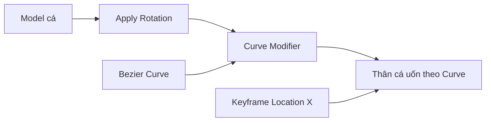
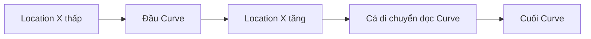
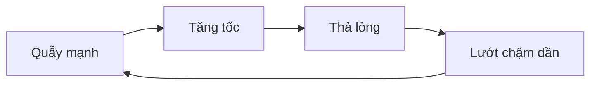

# 03 — Thiết lập đường cong chuyển động cho cá

| Thuộc tính            | Nội dung                                                                                |
| --------------------- | --------------------------------------------------------------------------------------- |
| **Video**             | Learn How to Animate and Render a Fish in Blender! — Beginner Friendly                  |
| **Chương**            | Curve Path Setup                                                                        |
| **Thời điểm bắt đầu** | 00:16:10                                                                                |
| **Thời lượng**        | 22:05                                                                                   |
| **Chủ đề chính**      | Tạo đường bơi bằng Curve Modifier và chuẩn bị quỹ đạo theo nguyên tắc “Burst and Coast” |

---

## 1. Mục tiêu bài học

Sau chương này, bạn có thể:

* Dọn dẹp model cá sau khi import vào Blender.
* Chuẩn hóa hướng xoay và hệ trục của model.
* Tạo một đường bơi bằng **Bezier Curve**.
* Vẽ Curve tự do trực tiếp trong viewport.
* Làm cho thân cá uốn cong theo đường bơi bằng **Curve Modifier**.
* Chỉnh đúng **Deform Axis** để cá không bị xoay ngang hoặc bơi ngược.
* Tăng độ phân giải Curve để hạn chế biến dạng gãy khúc.
* Tạo quỹ đạo tự nhiên dựa trên nguyên tắc **Burst and Coast**.
* Chuẩn bị Curve cho animation lặp liên tục.

---

## 2. Phân biệt Curve Modifier và Follow Path

Trong chương này, tác giả không sử dụng **Follow Path Constraint**.

Kỹ thuật chính là:

```text
Fish Mesh
    │
    ▼
Curve Modifier
    │
    ▼
Bezier Curve
```

### Curve Modifier

Curve Modifier làm hai việc:

1. Xác định đường mà model di chuyển theo.
2. Uốn cong trực tiếp mesh của cá theo hình dạng Curve.

Do đó, thân cá có thể cong theo đoạn đường đang đi qua.

### Follow Path Constraint

Follow Path thường chỉ:

* Di chuyển toàn bộ object dọc theo Curve.
* Xoay object theo tiếp tuyến của đường.
* Không tự động uốn cong mesh.

> Đối với một model cá có nhiều đỉnh và chiều dài thân phù hợp, Curve Modifier có thể tạo cảm giác thân cá uốn lượn theo đường bơi mà không cần rig xương ngay từ đầu.

---

## 3. Cấu trúc hệ thống



Trong thiết lập này:

* **Bezier Curve** định nghĩa hình dạng đường bơi.
* **Curve Modifier** biến dạng thân cá theo Curve.
* **Location X** của cá được dùng để điều khiển vị trí của cá trên đường.
* Animation được tạo bằng cách keyframe giá trị Location X.

---

## 4. Dọn dẹp scene sau khi import

Sau khi nhập model cá, cần loại bỏ các object không cần thiết.

### Các bước thực hiện

1. Chọn Cube mặc định.
2. Giữ `Shift` và chọn Camera cùng Light.
3. Nhấn `X`.
4. Chọn **Delete**.

Nếu scene có nhiều object phụ:

1. Chọn model cá.
2. Nhấn `Ctrl + I` để đảo vùng chọn.
3. Nhấn `X`.
4. Xóa toàn bộ object không cần thiết.

Kết quả cuối cùng chỉ nên giữ lại:

```text
Scene
└── Fish
```

---

## 5. Kiểm tra material và bề mặt model

### Làm mượt bề mặt

Chọn model cá, sau đó:

```text
Right Click → Shade Smooth
```

Thao tác này giúp loại bỏ cảm giác các mặt polygon bị gãy hoặc phẳng.

### Kiểm tra texture

Ở góc trên bên phải của viewport, chuyển từ:

```text
Solid
```

sang:

```text
Material Preview
```

Blender sẽ tải texture và hiển thị gần đúng vật liệu của model.

### Kiểm tra lỗi photogrammetry

Các model quét 3D có thể gặp lỗi như:

* Mắt bị lõm vào trong.
* Bề mặt bị chồng lấn.
* Texture tạo cảm giác phản chiếu giả.
* Một số chi tiết bị méo do quá trình quét.

Những lỗi này nên được ghi nhận trước khi bắt đầu animation.

---

## 6. Chuẩn hóa Rotation của model

Sau khi import, model có thể đang mang Rotation bất thường dù hướng hiển thị hiện tại trông đúng.

Điều này gây khó khăn khi:

* Di chuyển theo trục local.
* Sử dụng Curve Modifier.
* Thiết lập Deform Axis.
* Tạo animation theo Location.

### Cách áp dụng Rotation

1. Chọn model cá.
2. Nhấn:

```text
Ctrl + A
```

3. Chọn:

```text
Rotation
```

Sau khi áp dụng, Rotation của object nên trở về:

```text
X: 0°
Y: 0°
Z: 0°
```

Trong khi hướng nhìn thực tế của model vẫn được giữ nguyên.

### Vì sao cần Apply Rotation?

Trước khi áp dụng:

```text
Trục local của cá ≠ hướng hiển thị thực tế
```

Sau khi áp dụng:

```text
Trục local của cá = hướng chuẩn dùng cho modifier và animation
```

---

## 7. Tạo Bezier Curve

### Thêm Curve

Nhấn:

```text
Shift + A → Curve → Bezier
```

Curve mới có thể nằm bên trong model cá nên chưa nhìn thấy ngay.

### Cách quan sát Curve

Có thể sử dụng một trong các cách:

* Chuyển viewport sang **Wireframe**.
* Bật **X-Ray**.
* Ẩn model cá trong Outliner.
* Chọn Curve trực tiếp từ Outliner.

### Chuyển sang Edit Mode

Chọn Curve và nhấn:

```text
Tab
```

---

## 8. Vẽ đường bơi tự do

Tác giả sử dụng công cụ **Draw Freehand Spline** để vẽ đường trực tiếp bằng chuột.

### Các bước

1. Chọn Curve.
2. Nhấn `Tab` để vào Edit Mode.
3. Nhấn `A` để chọn toàn bộ điểm mặc định.
4. Nhấn `X`.
5. Chọn **Vertices** để xóa.
6. Chuyển sang góc nhìn từ trên xuống:

```text
Numpad 7
```

7. Chọn công cụ:

```text
Draw Freehand Spline
```

8. Nhấn và kéo chuột để vẽ đường bơi.

### Mở nhanh thanh công cụ

Có thể dùng:

```text
Shift + Space
```

Sau đó chọn công cụ Draw.

### Trở lại công cụ chọn

Nhấn:

```text
W
```

Nhấn `W` nhiều lần sẽ chuyển qua các chế độ chọn khác nhau.

---

## 9. Thiết lập công cụ Draw

Công cụ Draw có một số tùy chọn:

| Thiết lập            | Tác dụng                                  |
| -------------------- | ----------------------------------------- |
| **Tolerance**        | Kiểm soát số lượng điểm được tạo khi vẽ   |
| **Corners**          | Giữ hoặc làm mềm các góc                  |
| **Depth/Projection** | Xác định Curve được vẽ trên mặt phẳng nào |

### Tolerance thấp

Nếu đặt Tolerance gần `0 px`:

* Curve bám sát chuyển động chuột hơn.
* Có nhiều control point hơn.
* Đường bơi chi tiết hơn.
* Curve có thể trở nên khó chỉnh sửa.

### Thiết lập mặc định

Trong hầu hết trường hợp, thiết lập mặc định đã đủ tốt vì:

* Curve tương đối mượt.
* Không tạo quá nhiều điểm.
* Dễ sửa đường bơi về sau.

---

## 10. Đặt tên và tổ chức scene

Nên đổi tên object để dễ quản lý.

Ví dụ:

```text
Fish
Path.Fish
```

Sau đó tạo Collection:

```text
Fish Rig
├── Fish
└── Path.Fish
```

### Lợi ích

* Dễ tìm object trong Outliner.
* Dễ cô lập toàn bộ hệ thống cá.
* Thuận tiện khi scene có nhiều sinh vật.
* Người khác có thể tiếp tục chỉnh sửa project.
* Hạn chế chọn nhầm object.

---

## 11. Thêm Curve Modifier cho cá

### Các bước

1. Chọn model cá.
2. Mở tab **Modifier Properties**.
3. Chọn:

```text
Add Modifier → Deform → Curve
```

4. Trong trường **Curve Object**, chọn:

```text
Path.Fish
```

Sau khi gán Curve, model có thể:

* Di chuyển đến cuối đường.
* Quay ngược hướng.
* Xoay lệch 90 độ.
* Bị biến dạng theo trục không mong muốn.

Đây là hiện tượng phổ biến do hệ trục của model và Curve chưa khớp nhau.

---

## 12. Di chuyển cá dọc theo Curve

Curve Modifier không có một giá trị tiến độ từ `0` đến `1` giống Follow Path.

Thay vào đó, cá được di chuyển theo trục biến dạng.

Ví dụ khi dùng trục X:

```text
G → X
```

Khi Location X thay đổi, model sẽ trượt dọc theo Curve.



---

## 13. Chỉnh hướng cá và Deform Axis

Một trong những phần khó nhất là làm cho:

* Đầu cá hướng theo chiều đã vẽ.
* Cá không bị quay ngang.
* Trục di chuyển trong viewport có cảm giác hợp lý.
* Curve mới vẫn hoạt động đúng sau khi vẽ lại.

### Cách 1 — Xoay object 180 độ

Chọn cá và nhấn:

```text
R → Z → 180
```

Cách này có thể làm cá hướng đúng, nhưng hướng kéo Location X đôi khi trở nên ngược với cảm giác điều khiển.

### Cách 2 — Đổi Deform Axis

Trong Curve Modifier, thử:

```text
X
-X
Y
-Y
Z
-Z
```

Thông thường model cá dài theo trục X sẽ sử dụng:

```text
X hoặc -X
```

### Cách 3 — Chỉnh Tilt của Curve

Nếu cá đã đi đúng chiều nhưng bị xoay ngang:

1. Chọn Curve.
2. Nhấn `Tab`.
3. Nhấn `A`.
4. Nhấn:

```text
Ctrl + T
```

5. Chỉnh Tilt khoảng:

```text
-90°
```

Cũng có thể mở Sidebar bằng `N`, sau đó chỉnh:

```text
Item → Mean Tilt
```

### Hạn chế của cách chỉnh Tilt

Mỗi khi xóa Curve và vẽ một đường mới, Tilt có thể trở lại giá trị mặc định.

Bạn sẽ phải:

1. Chọn lại tất cả control point.
2. Đặt lại Mean Tilt.
3. Kiểm tra hướng cá một lần nữa.

---

## 14. Phương pháp ổn định hơn: xoay mesh trong Edit Mode

Nếu dự định thay đổi Curve nhiều lần, nên chỉnh hướng mesh thực sự trong Edit Mode.

### Các bước

1. Chọn model cá.
2. Nhấn `Tab` để vào Edit Mode.
3. Bật hiển thị modifier trong Edit Mode nếu cần.
4. Nhấn `A` để chọn toàn bộ mesh.
5. Xoay mesh đúng 90 độ theo trục phù hợp, ví dụ:

```text
R → X → 90
```

6. Nhấn `Tab` để trở lại Object Mode.

### Ưu điểm

* Không cần chỉnh Tilt cho từng Curve mới.
* Hệ trục object vẫn sạch.
* Curve Modifier hoạt động nhất quán hơn.
* Dễ tái sử dụng model với nhiều đường bơi khác nhau.

### Lưu ý

Chỉ xoay phần mesh trong Edit Mode, không xoay object trong Object Mode.

```text
Object Rotation: 0°, 0°, 0°
Mesh orientation: đã được căn chỉnh đúng
```

---

## 15. Tăng độ phân giải của Curve

Nếu Curve có độ phân giải thấp, thân cá có thể xuất hiện các đoạn gãy hoặc sọc đứng khi bị uốn cong.

### Cách chỉnh

1. Chọn Curve.
2. Mở **Object Data Properties**.
3. Tìm:

```text
Shape → Resolution Preview U
```

4. Tăng giá trị lên khoảng:

```text
64
```

### Trước và sau

```text
Resolution thấp
      ↓
Thân cá gãy theo từng đoạn
      ↓
Tăng Resolution Preview U
      ↓
Độ cong mượt hơn
```

Không cần đặt giá trị quá cao nếu model đơn giản hoặc thiết bị có hiệu năng thấp.

---

## 16. Tạo animation bằng Location X

Sau khi thiết lập Curve Modifier, có thể tạo animation bằng cách keyframe vị trí của cá.

### Tại frame đầu

1. Chọn cá.
2. Mở **Object Properties** hoặc bảng `N`.
3. Đặt Location X tại vị trí bắt đầu.
4. Nhấn biểu tượng hình thoi bên cạnh Location X.

Hoặc đưa chuột lên Location X và nhấn:

```text
I
```

### Tại frame cuối

1. Di chuyển timeline đến frame mới, ví dụ frame `60`.
2. Tăng Location X để cá đi xa hơn trên Curve.
3. Tạo keyframe thứ hai.

Ví dụ:

| Frame | Location X | Trạng thái             |
| ----: | ---------: | ---------------------- |
|     1 |        0 m | Cá ở đầu đoạn đường    |
|    30 |        3 m | Cá đang di chuyển      |
|    60 |        8 m | Cá đến cuối đoạn đường |

---

## 17. Nguyên tắc “Burst and Coast”

Cá ngoài tự nhiên thường không bơi với tốc độ đều liên tục.

Chuyển động phổ biến là:

1. **Burst:** cá quẫy thân và đuôi để tạo lực đẩy.
2. **Coast:** cá thả lỏng và lướt theo quán tính.
3. **Burst:** tiếp tục quẫy để tăng tốc hoặc đổi hướng.
4. **Coast:** lại lướt trong một khoảng ngắn.



### Ứng dụng vào hình dạng Curve

#### Đoạn Burst

* Curve có các dao động trái–phải.
* Độ cong xuất hiện liên tục.
* Thể hiện cá đang tạo lực đẩy.

#### Đoạn Coast

* Curve thẳng hơn.
* Ít dao động.
* Thể hiện cá đang lướt theo quán tính.

```text
BURST                  COAST
~ ~ ~ ~ ~ ~ ─────────────────
quẫy nhiều             lướt thẳng
```

Nguyên tắc này giúp quỹ đạo không giống một đường tròn máy móc hoặc một chuyển động lặp đều.

---

## 18. Thiết kế một quỹ đạo bơi tự nhiên

Một đường bơi tốt nên có:

* Những đoạn lắc nhẹ để tạo lực đẩy.
* Những đoạn dài và thoải để cá lướt.
* Các khúc rẽ có bán kính lớn.
* Biên độ dao động thay đổi.
* Khoảng cách giữa các lần đổi hướng không đều.
* Một số đoạn tăng tốc và giảm tốc.

### Mẫu quỹ đạo

```text
Bắt đầu
   │
   ▼
Lắc nhẹ ──► lắc mạnh ──► lướt dài
                              │
                              ▼
                        rẽ vòng rộng
                              │
                              ▼
lướt ngắn ◄── lắc nhẹ ◄── đổi hướng
```

### Tránh các quỹ đạo sau

```text
✗ Sóng sin hoàn hảo
✗ Vòng tròn đều
✗ Góc rẽ quá gấp
✗ Dao động cùng biên độ
✗ Tốc độ không đổi
✗ Quỹ đạo đối xứng tuyệt đối
```

---

## 19. Tạo Curve khép kín

Nếu điểm cuối của đường nằm gần điểm đầu, Blender có thể tạo một Curve dạng vòng lặp.

Có thể chuyển đổi giữa đường mở và đường khép kín bằng:

```text
Alt + C
```

### Curve mở

```text
A ───────────── B
```

Cá đi từ điểm A đến điểm B.

### Curve khép kín

```text
      ┌──────────┐
      │          │
      └──────────┘
```

Cá có thể tiếp tục bơi theo vòng lặp.

### Lưu ý

Ngay cả khi Curve khép kín, điểm nối đầu–cuối cần mượt. Nếu không:

* Cá có thể giật tại điểm nối.
* Thân cá đổi hướng đột ngột.
* Animation lộ rõ điểm lặp.

---

## 20. Làm mượt các control point

Sau khi vẽ bằng tay, các control point có thể tạo đường cong không đồng đều.

### Chuyển Handle Type sang Automatic

1. Chọn Curve.
2. Vào Edit Mode.
3. Nhấn `A`.
4. Nhấn:

```text
V
```

5. Chọn:

```text
Automatic
```

Handle tự động giúp Curve mượt hơn tại các điểm chuyển hướng.

### Khi nào không nên dùng Automatic?

Không nên dùng hoàn toàn Automatic nếu cần:

* Một góc đổi hướng có chủ đích.
* Một đoạn gần như thẳng tuyệt đối.
* Kiểm soát riêng từng phía của handle.
* Chỉnh điểm nối của Curve khép kín.

Trong các trường hợp đó, có thể dùng:

```text
Aligned
Free
Vector
```

---

## 21. Kiểm soát mức độ uốn cong của thân cá

Nếu Curve quá nhỏ hoặc các đoạn ngoặt quá gấp, thân cá sẽ bị:

* Bẻ cong quá mức.
* Méo mặt.
* Nén phần đầu.
* Kéo giãn phần đuôi.
* Làm vây xuyên qua thân.

### Cách xử lý

Chọn Curve, vào Edit Mode và:

```text
A → S
```

Phóng to toàn bộ Curve để tăng bán kính các khúc cong.

```text
Curve nhỏ
    ↓
Độ cong lớn trên chiều dài thân cá
    ↓
Mesh biến dạng mạnh

Curve lớn
    ↓
Khúc rẽ rộng hơn
    ↓
Mesh biến dạng nhẹ hơn
```

---

## 22. Các lỗi thường gặp

### 22.1. Cá bơi ngược chiều đã vẽ

**Nguyên nhân:**

* Deform Axis bị ngược.
* Hướng mesh không trùng trục local.
* Curve được vẽ theo chiều ngược.

**Cách sửa:**

* Đổi `X` thành `-X`.
* Xoay mesh trong Edit Mode.
* Đảo hướng Curve bằng:

```text
Curve → Segments → Switch Direction
```

---

### 22.2. Cá bị xoay ngang 90 độ

**Nguyên nhân:**

* Tilt của Curve không phù hợp.
* Trục “up” của mesh không khớp với Curve Modifier.

**Cách sửa:**

* Chỉnh Mean Tilt thành `-90°` hoặc `90°`.
* Xoay mesh đúng hướng trong Edit Mode.

---

### 22.3. Thân cá bị gãy thành từng đoạn

**Nguyên nhân:**

* Resolution Preview U của Curve quá thấp.
* Mesh cá có quá ít segment dọc theo thân.

**Cách sửa:**

* Tăng Curve Resolution lên khoảng `32–64`.
* Thêm edge loop dọc thân nếu topology quá thưa.

---

### 22.4. Mặt và vây cá bị méo mạnh

**Nguyên nhân:**

* Khúc rẽ quá gấp.
* Curve quá nhỏ so với chiều dài cá.
* Toàn bộ đầu cá đang bị Curve Modifier tác động.

**Cách sửa:**

* Mở rộng Curve.
* Giảm biên độ dao động.
* Tạo đoạn Curve thẳng hơn.
* Sử dụng Vertex Group để giới hạn vùng bị biến dạng nếu cần.

---

### 22.5. Di chuyển Location nhưng cá đi sai trục

**Nguyên nhân:**

Deform Axis và trục Location không khớp.

**Cách sửa:**

Nếu Modifier sử dụng:

```text
Deform Axis: X
```

hãy keyframe:

```text
Location X
```

Nếu sử dụng trục khác, keyframe Location tương ứng.

---

### 22.6. Vẽ Curve mới lại làm cá bị lệch

**Nguyên nhân:**

Phương pháp hiện tại phụ thuộc vào Tilt của từng Curve.

**Cách sửa lâu dài:**

* Căn chỉnh mesh trong Edit Mode.
* Giữ Rotation của object bằng 0.
* Thiết lập một Deform Axis cố định.

---

## 23. Phím tắt quan trọng

| Thao tác                 | Phím tắt                      |
| ------------------------ | ----------------------------- |
| Thêm Bezier Curve        | `Shift + A → Curve → Bezier`  |
| Vào hoặc thoát Edit Mode | `Tab`                         |
| Chọn toàn bộ             | `A`                           |
| Xóa điểm                 | `X`                           |
| Góc nhìn từ trên xuống   | `Numpad 7`                    |
| Chuyển công cụ chọn      | `W`                           |
| Mở nhanh thanh công cụ   | `Shift + Space`               |
| Di chuyển theo trục X    | `G`, sau đó `X`               |
| Xoay theo trục           | `R`, sau đó chọn `X/Y/Z`      |
| Apply Rotation           | `Ctrl + A → Rotation`         |
| Chỉnh Tilt               | `Ctrl + T`                    |
| Mở Sidebar               | `N`                           |
| Đổi Handle Type          | `V`                           |
| Đóng hoặc mở Curve       | `Alt + C`                     |
| Chèn keyframe            | `I`                           |
| Xóa keyframe thuộc tính  | Chuột phải → Delete Keyframes |
| Đảo vùng chọn            | `Ctrl + I`                    |
| Xóa Rotation             | `Alt + R`                     |

---

## 24. Quy trình thực hành đề xuất

### Giai đoạn 1 — Chuẩn bị model

* [ ] Xóa Cube, Camera, Light và object thừa.
* [ ] Đổi tên model thành `Fish`.
* [ ] Kiểm tra texture trong Material Preview.
* [ ] Bật Shade Smooth.
* [ ] Apply Rotation cho model.

### Giai đoạn 2 — Tạo đường bơi

* [ ] Thêm Bezier Curve.
* [ ] Đổi tên thành `Path.Fish`.
* [ ] Chuyển sang góc nhìn từ trên.
* [ ] Xóa các điểm mặc định.
* [ ] Dùng Draw Freehand Spline để vẽ đường.
* [ ] Chuyển handle sang Automatic.

### Giai đoạn 3 — Thiết lập modifier

* [ ] Thêm Curve Modifier cho cá.
* [ ] Gán `Path.Fish` làm Curve Object.
* [ ] Chọn đúng Deform Axis.
* [ ] Căn chỉnh hướng mesh.
* [ ] Tăng Resolution Preview U.

### Giai đoạn 4 — Kiểm tra chuyển động

* [ ] Thay đổi Location X.
* [ ] Kiểm tra cá có đi đúng chiều không.
* [ ] Kiểm tra đầu cá có bị méo không.
* [ ] Kiểm tra vây có xuyên mesh không.
* [ ] Điều chỉnh kích thước và độ cong của Curve.

### Giai đoạn 5 — Chuẩn bị animation

* [ ] Xác định các đoạn Burst.
* [ ] Xác định các đoạn Coast.
* [ ] Tạo keyframe Location X.
* [ ] Kiểm tra điểm nối nếu Curve khép kín.
* [ ] Chưa tinh chỉnh tốc độ cho đến chương animation tiếp theo.

---

## 25. Cấu trúc Outliner đề xuất

```text
Scene Collection
└── Fish Rig
    ├── Fish
    │   └── Modifier: Curve
    │       └── Object: Path.Fish
    └── Path.Fish
```

Nếu sau này thêm rig xương:

```text
Scene Collection
└── Fish Rig
    ├── CTRL_Fish
    ├── Armature.Fish
    ├── Fish
    └── Path.Fish
```

---

## 26. Tóm tắt

Trong chương này, model cá được làm cho uốn theo một **Bezier Curve** bằng **Curve Modifier**. Vị trí của cá trên đường được điều khiển bằng Location của object, thường là **Location X**, thay vì dùng Offset Factor của Follow Path.

Ba yếu tố quyết định hệ thống có hoạt động ổn định hay không là:

1. Model đã được **Apply Rotation**.
2. Mesh được căn đúng hướng với **Deform Axis**.
3. Curve có độ cong và độ phân giải phù hợp.

Sau khi thiết lập kỹ thuật hoàn tất, đường bơi được thiết kế theo nguyên tắc **Burst and Coast**: cá quẫy để tạo lực đẩy, sau đó thả lỏng và lướt. Sự xen kẽ giữa các đoạn cong dao động và các đoạn thẳng dài giúp chuyển động tự nhiên hơn, tránh cảm giác cá chỉ đang chạy theo một vòng tròn hoặc một đường sóng lặp máy móc.
