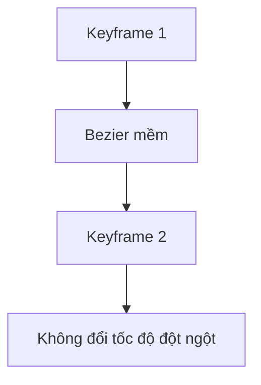
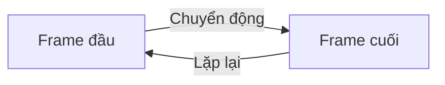
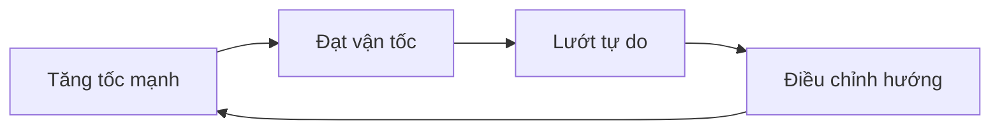
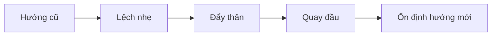
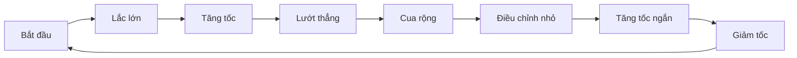

# 04 — Animation Part 1: Tạo quỹ đạo bơi tự nhiên

| Thuộc tính            | Nội dung                                                                                    |
| --------------------- | ------------------------------------------------------------------------------------------- |
| **Video**             | Learn How to Animate and Render a Fish in Blender! (Beginner Friendly)                      |
| **Chương**            | Animation Part 1                                                                            |
| **Thời điểm bắt đầu** | `00:38:15`                                                                                  |
| **Thời lượng**        | `26:51`                                                                                     |
| **Chủ đề chính**      | Thiết lập chuyển động lặp, chỉnh tốc độ trong Graph Editor và xây dựng quỹ đạo bơi tự nhiên |

---

## 1. Mục tiêu bài học

Sau chương này, chúng ta có thể:

* Tạo chuyển động cho cá chạy hết một vòng quỹ đạo trong khoảng thời gian xác định.
* Chỉnh keyframe trong **Graph Editor** thay vì kéo giá trị thủ công trong thời gian dài.
* Phân biệt:

  * **Linear Interpolation** — nội suy tuyến tính giữa các keyframe.
  * **Linear Extrapolation** — tiếp tục chuyển động tuyến tính ra ngoài phạm vi keyframe.
* Tạo vòng lặp có tốc độ ổn định tại điểm bắt đầu và kết thúc.
* Chỉnh hình dạng Curve để cá bơi theo nhịp:

  * tăng tốc;
  * lướt đi;
  * đổi hướng;
  * điều chỉnh nhẹ;
  * tiếp tục tăng tốc.
* Làm cho quỹ đạo không bị lặp đều, máy móc.
* Thêm chuyển động lên xuống nhẹ theo trục `Z`.
* Sửa hiện tượng cá bị nghiêng sai khi đi qua Curve 3D.

---

## 2. Tổng quan quy trình

```mermaid
flowchart LR
    A[Đặt cá ở vị trí đầu] --> B[Keyframe vị trí bắt đầu]
    B --> C[Đưa Timeline đến frame cuối]
    C --> D[Di chuyển cá về gần vị trí ban đầu]
    D --> E[Keyframe vị trí cuối]
    E --> F[Chỉnh F-Curve trong Graph Editor]
    F --> G[Thiết lập Linear Extrapolation]
    G --> H[Chỉnh hình dạng quỹ đạo]
    H --> I[Thêm nhịp tăng tốc và lướt]
    I --> J[Thêm chuyển động theo trục Z]
    J --> K[Sửa Tilt để cá luôn giữ lưng hướng lên]
```



Chương này gồm hai lớp chuyển động chính:

1. **Chuyển động theo thời gian**

   Quyết định cá đang ở đâu trên quỹ đạo tại mỗi frame.

2. **Hình dạng không gian của quỹ đạo**

   Quyết định cá sẽ bơi thẳng, lượn, vòng, tăng tốc hay đổi hướng như thế nào.

---

# Phần I — Thiết lập chuyển động lặp

## 3. Đặt keyframe đầu và cuối

Trong ví dụ, Timeline kết thúc ở khoảng:

```text
Frame 250
```

Tại frame đầu:

1. Đặt cá ở vị trí bắt đầu.
2. Di chuột lên giá trị vị trí đang dùng để điều khiển chuyển động.
3. Nhấn `I` hoặc bấm nút hình kim cương để tạo keyframe.

Tại frame cuối:

1. Di chuyển Playhead đến frame `250`.
2. Thay đổi giá trị vị trí cho đến khi cá quay lại gần vị trí bắt đầu.
3. Tạo keyframe thứ hai.

Không nhất thiết phải kéo giá trị thật chính xác trong bảng thuộc tính. Sau khi có keyframe, chúng ta có thể chỉnh chúng dễ dàng hơn trong Graph Editor.

---

## 4. Mở Graph Editor

Có hai cách phổ biến.

### Cách 1 — Đổi loại Editor

1. Chia vùng làm việc thành hai phần.
2. Bấm biểu tượng **Editor Type** ở góc trái của vùng mới.
3. Chọn **Graph Editor**.

### Cách 2 — Sử dụng phím tắt

Đưa con trỏ chuột vào vùng muốn chuyển đổi, sau đó nhấn:

```text
Shift + F6
```

Graph Editor cho phép chỉnh keyframe dưới dạng đường cong hai chiều:

* Trục ngang `X`: thời gian hoặc số frame.
* Trục dọc `Y`: giá trị của thuộc tính.
* Độ dốc đường cong: vận tốc thay đổi của chuyển động.

---

## 5. Điều chỉnh keyframe trong Graph Editor

Chọn keyframe cuối và sử dụng:

```text
G, Y
```

để chỉ di chuyển keyframe theo trục giá trị.

Mục tiêu là đưa giá trị cuối về vị trí phù hợp để cá kết thúc một vòng bơi tại nơi gần với vị trí xuất phát.

Một số thao tác cơ bản:

| Thao tác                   | Phím tắt    |
| -------------------------- | ----------- |
| Di chuyển keyframe         | `G`         |
| Di chuyển theo thời gian   | `G`, `X`    |
| Di chuyển theo giá trị     | `G`, `Y`    |
| Xoay handle                | `R`         |
| Scale khoảng cách keyframe | `S`         |
| Nhân đôi keyframe          | `Shift + D` |
| Chọn toàn bộ               | `A`         |

---

# Phần II — Interpolation và Extrapolation

## 6. Vì sao không nên dùng Linear Interpolation hoàn toàn?

Khi chọn keyframe và nhấn:

```text
T → Linear
```

Blender tạo đường thẳng giữa các keyframe.

Điều này khiến tốc độ thay đổi ngay lập tức tại mỗi keyframe:

```text
chậm → đổi tốc độ đột ngột → nhanh
```

Vấn đề là cá thật không thể thay đổi gia tốc ngay lập tức. Chuyển động sẽ có cảm giác:

* giật;
* cứng;
* giống robot;
* thiếu độ mềm của sinh vật sống.

Do đó, không nên biến toàn bộ các đoạn tăng tốc thành Linear Interpolation nếu muốn chuyển động hữu cơ.

---

## 7. Giữ Bezier và Auto Clamped

Thiết lập phù hợp hơn:

```text
T → Bezier
V → Auto Clamped
```

### Bezier

Cho phép chuyển tiếp tốc độ mềm giữa các keyframe.

### Auto Clamped

Tự động điều chỉnh handle để:

* giảm khả năng đường cong vượt quá giá trị keyframe;
* tránh các đoạn gãy;
* duy trì chuyển động tương đối mượt.



---

## 8. Sử dụng Linear Extrapolation

Linear Extrapolation khác với Linear Interpolation.

### Linear Interpolation

Tạo đường thẳng **giữa hai keyframe**.

### Linear Extrapolation

Tiếp tục kéo dài hướng chuyển động của F-Curve ra ngoài vùng keyframe.

Để thiết lập:

1. Chọn toàn bộ keyframe bằng `A`.
2. Nhấn:

```text
Shift + E
```

hoặc mở menu:

```text
Channel → Extrapolation Mode
```

3. Chọn:

```text
Linear Extrapolation
```

Kết quả:

* F-Curve vẫn có Bezier mềm giữa các điểm.
* Chuyển động tiếp tục với tốc độ phù hợp ngoài phạm vi keyframe.
* Vận tốc tại đầu và cuối vòng dễ khớp nhau hơn.
* Animation có thể lặp lại mà ít bị giật tại điểm nối.

> Không nên nhầm `Shift + E` của Extrapolation với các menu Easing khác trong những Editor hoặc phiên bản Blender khác.

---

## 9. Nguyên tắc của một vòng lặp mượt

Điểm cuối và điểm đầu cần khớp ở hai yếu tố:

1. **Vị trí**
2. **Vận tốc**

```text
Vị trí cuối ≈ Vị trí đầu
Vận tốc cuối ≈ Vận tốc đầu
```

Nếu vị trí khớp nhưng vận tốc không khớp, cá vẫn có thể giật khi animation quay lại frame đầu.



Một vòng lặp tốt phải khiến người xem khó nhận ra đâu là điểm animation bắt đầu lại.

---

# Phần III — Chỉnh hình dạng quỹ đạo

## 10. Chuyển sang Edit Mode của Curve

Sau khi tốc độ cơ bản đã ổn:

1. Chọn Curve.
2. Nhấn `Tab` để vào **Edit Mode**.
3. Chuyển sang góc nhìn từ trên xuống.
4. Di chuyển các control point bằng `G`.

Trong giai đoạn này, nên liên tục:

* chỉnh một vài điểm;
* chạy thử animation;
* quan sát;
* quay lại chỉnh tiếp.

Đây là quá trình thử nghiệm trực quan thay vì cố thiết kế toàn bộ quỹ đạo ngay từ đầu.

---

## 11. Tắt Overlay để quan sát cá rõ hơn

Để ẩn Curve và các thành phần hỗ trợ trong Viewport:

```text
Alt + Shift + Z
```

Hoặc tắt **Viewport Overlays** bằng biểu tượng ở góc trên bên phải.

Cách kiểm tra tốt:

```text
Chỉnh Curve
→ Tắt Overlay
→ Play animation
→ Quan sát cá
→ Bật lại Overlay
→ Tiếp tục chỉnh
```

---

## 12. Thêm control point bằng Subdivide

Nếu một đoạn Curve có quá ít điểm để kiểm soát:

1. Chọn hai control point liền nhau.
2. Nhấn chuột phải.
3. Chọn:

```text
Subdivide
```

Sau khi Subdivide, Blender thêm một điểm mới nằm giữa hai điểm cũ mà không làm thay đổi đáng kể hình dạng hiện tại của Curve.

Có thể tăng số lượng điểm trong bảng thao tác:

```text
Number of Cuts
```

Tuy nhiên, không nên thêm quá nhiều điểm vì Curve sẽ:

* khó chỉnh;
* dễ xuất hiện gợn nhỏ;
* dễ bị mất độ mượt;
* tạo chuyển động hỗn loạn.

---

## 13. Giữ handle ở chế độ Automatic khi có thể

Handle tự động giúp đường cong duy trì chuyển tiếp mượt.

Khi xoay hoặc kéo handle thủ công, handle có thể chuyển sang loại:

```text
Free
```

Free Handle hữu ích khi cần tạo một vòng cua đặc biệt, nhưng không nên sử dụng tràn lan.

### Automatic Handle

Phù hợp với:

* đoạn bơi mềm;
* đường cong liên tục;
* chuyển động hữu cơ;
* các khu vực không cần kiểm soát cực kỳ chính xác.

### Free Handle

Phù hợp với:

* vòng cua lớn;
* đoạn cần gần hình tròn;
* chuyển tiếp từ đường cong sang đường thẳng;
* khu vực Automatic Handle tạo hình không mong muốn.

---

# Phần IV — Nguyên tắc chuyển động tự nhiên

## 14. Không tạo đường lượn quá đều

Một lỗi phổ biến là thiết kế quỹ đạo như sau:

```text
nhanh → chậm → nhanh → chậm → nhanh → chậm
```

Mặc dù quỹ đạo mượt, nhịp chuyển động vẫn dễ bị nhận ra là lặp máy móc.

Cá ngoài tự nhiên có xu hướng bất quy tắc hơn:

```text
nhanh → nhanh → lướt → chỉnh hướng → chậm
→ tăng tốc mạnh → lướt dài → xoay nhẹ
```

Độ dài, biên độ và khoảng cách giữa các lần đổi hướng không nên bằng nhau.

---

## 15. Nguyên tắc “Burst and Coast”

Một chuyển động tự nhiên thường có hai giai đoạn.

### Burst — tăng tốc

Cá:

* vẫy thân mạnh hơn;
* đổi hướng rõ hơn;
* di chuyển nhanh trong thời gian ngắn.

### Coast — lướt

Sau khi tăng tốc, cá:

* giảm chuyển động thân;
* gần như đi thẳng;
* tận dụng quán tính để lướt.



Mô hình này tự nhiên hơn việc cá liên tục lắc thân với cùng một nhịp.

---

## 16. Lắc lớn trước, điều chỉnh nhỏ sau

Một nguyên tắc hữu ích:

```text
Lắc lớn → lắc nhỏ → ổn định → lướt
```

Cú lắc lớn tạo ra thay đổi chính về:

* vận tốc;
* phương hướng;
* góc quay.

Những lần lắc nhỏ phía sau đóng vai trò:

* sửa hướng;
* giữ thăng bằng;
* ổn định chuyển động.

Có thể hiểu giống hiệu ứng dây cao su:

```text
Biên độ lớn → biên độ nhỏ dần → ổn định
```

---

## 17. Xen kẽ đoạn cong và đoạn thẳng

Không nên để toàn bộ quỹ đạo đều là các đường uốn lượn.

Một quỹ đạo tốt có thể gồm:

1. Một đoạn tăng tốc uốn cong.
2. Một đoạn lướt thẳng.
3. Một vòng cua lớn.
4. Một đoạn chỉnh hướng nhỏ.
5. Một đoạn bơi thẳng nhanh.
6. Một đoạn giảm tốc để quay về điểm đầu.

```text
╭────╮
│ cua│─── đoạn lướt thẳng ───╮
╰────╯                        │
       ╭─ điều chỉnh nhỏ ─────╯
       ╰──── tăng tốc ───→
```

Đoạn thẳng giúp tạo cảm giác cá đang lướt nhanh như một “viên đạn” sau khi đã tạo đủ lực đẩy.

---

## 18. Cá không nên uốn như con rắn

Khi toàn bộ cá bị Curve Deform, mọi phần của cơ thể đều có xu hướng mềm và uốn theo Curve.

Điều này dễ khiến cá trông giống:

* con rắn;
* con sâu;
* một dải cao su.

Trong thực tế:

* đầu cá tương đối cứng;
* phần trước thân ít uốn;
* phần đuôi uốn mạnh hơn;
* biên độ chuyển động tăng dần từ đầu đến đuôi.

Nguyên tắc mong muốn:

```text
Đầu       Thân giữa          Đuôi
Cứng      Uốn vừa            Uốn mạnh
  0%  →     30–50%      →     100%
```

Ở giai đoạn hiện tại, Curve chủ yếu dùng để thiết kế chuyển động tổng thể. Việc hạn chế biến dạng đầu sẽ được giải quyết tốt hơn bằng rig, weight hoặc các hệ thống điều khiển bổ sung.

---

# Phần V — Thiết kế các vòng cua

## 19. Tạo một vòng cua tròn

Nếu cần tham chiếu cho một vòng cua tròn:

1. Vào Edit Mode của Curve.
2. Nhấn:

```text
Shift + A → Bezier Circle
```

3. Scale vòng tròn cho phù hợp.
4. Dùng nó làm hình tham chiếu khi chỉnh quỹ đạo.
5. Sau khi hoàn tất, chọn một điểm trên vòng tròn.
6. Nhấn `L` để chọn toàn bộ spline liên kết.
7. Nhấn `X` để xóa vòng tròn tham chiếu.

Vòng tròn không nhất thiết trở thành một phần của quỹ đạo. Nó chỉ giúp quan sát độ cong hợp lý.

---

## 20. Cách cá đổi hướng

Khi đổi hướng, cá thường không quay tức thời tại một điểm.

Thay vào đó, nó cần:

1. Lệch nhẹ sang phía đối diện.
2. Tạo lực đẩy.
3. Xoay thân.
4. Đi vào hướng mới.
5. Điều chỉnh lại sau khi quay.



Do đó, trước một góc cua lớn có thể thêm một đường lượn nhỏ để tạo cảm giác cá đang chuẩn bị đổi hướng.

---

# Phần VI — Thêm chuyển động theo chiều dọc

## 21. Vì sao cần chuyển động lên xuống?

Nếu toàn bộ Curve nằm trên một mặt phẳng, chuyển động sẽ có cảm giác giống một hình vẽ 2D.

Có thể thêm một lượng nhỏ chuyển động theo trục `Z` để cá:

* nổi lên;
* hạ xuống;
* tránh quỹ đạo quá phẳng;
* tạo cảm giác đang bơi trong không gian nước ba chiều.

Tuy nhiên, biên độ dọc nên nhỏ hơn biên độ ngang.

```text
Chuyển động ngang: chính
Chuyển động dọc: phụ
```

Không nên tạo các đoạn lên xuống quá dốc vì cá sẽ trông như:

* máy bay nhào lộn;
* tàu lượn;
* vật thể bay thay vì động vật dưới nước.

---

## 22. Sử dụng Proportional Editing

Trong Edit Mode của Curve:

1. Bật **Proportional Editing** bằng phím:

```text
O
```

2. Chọn một control point.
3. Nhấn:

```text
G, Z
```

4. Cuộn con lăn chuột để thay đổi phạm vi ảnh hưởng.

Vòng tròn xuất hiện quanh điểm được chọn thể hiện bán kính ảnh hưởng.

```text
Bán kính lớn  → nhiều control point bị tác động
Bán kính nhỏ  → chỉ khu vực gần điểm chọn bị tác động
```

---

## 23. Chỉ tác động lên các điểm được kết nối

Trong menu Proportional Editing, bật:

```text
Connected Only
```

Tùy chọn này ngăn các spline hoặc phần Curve không liên quan bị tác động chỉ vì chúng nằm gần nhau trong không gian.

Quy trình:

```text
Chọn điểm
→ Bật Proportional Editing
→ Bật Connected Only
→ G, Z
→ Cuộn chuột chỉnh phạm vi
```

Chỉ cần nâng hoặc hạ Curve một lượng nhỏ để tránh làm chuyển động quá mạnh.

---

# Phần VII — Sửa hiện tượng cá bị nghiêng

## 24. Nguyên nhân bị nghiêng

Khi Curve thay đổi theo cả ba chiều, Blender có thể tự xoay object theo hướng và độ nghiêng của Curve.

Kết quả là cá có thể:

* nghiêng quá nhiều;
* lật thân sang một bên;
* bơi với lưng không hướng lên trên;
* xoắn dần khi đi qua quỹ đạo.

Đây là vấn đề liên quan đến giá trị:

```text
Tilt
```

của các control point trên Curve.

---

## 25. Điều chỉnh Tilt

Trong Edit Mode:

1. Chọn control point cần sửa.
2. Nhấn:

```text
Ctrl + T
```

3. Di chuyển chuột để thay đổi Tilt.
4. Nhấn chuột trái để xác nhận.

Có thể kết hợp với Proportional Editing để thay đổi độ nghiêng mượt trên một vùng.

```text
O
Ctrl + T
Cuộn chuột để thay đổi phạm vi
```

Mục tiêu là để:

* lưng cá luôn tương đối hướng lên trên;
* thân có thể nghiêng nhẹ khi cua;
* không xuất hiện hiện tượng lật ngang bất thường.

---

## 26. Không nên khóa Tilt tuyệt đối ở mọi nơi

Một chút nghiêng khi vào cua có thể làm chuyển động tự nhiên hơn.

Tuy nhiên:

```text
Nghiêng nhẹ khi cua → tự nhiên
Nghiêng liên tục 90° → bất thường
Lật ngửa → sai chuyển động
```

Có thể áp dụng:

| Tình huống        | Góc nghiêng gợi ý |
| ----------------- | ----------------: |
| Bơi thẳng         |          Gần `0°` |
| Cua nhẹ           |     Khoảng `3–8°` |
| Cua mạnh          |    Khoảng `8–15°` |
| Vượt quá `20–25°` |  Cần kiểm tra lại |

Các giá trị trên chỉ là điểm bắt đầu. Góc thực tế còn phụ thuộc vào tốc độ, hình dạng cá và phong cách animation.

---

# Phần VIII — Quy trình thực hành đề xuất

## 27. Pass 1 — Thiết lập vòng lặp

1. Đặt frame bắt đầu.
2. Tạo keyframe vị trí đầu.
3. Đến frame cuối.
4. Di chuyển cá về gần điểm đầu.
5. Tạo keyframe cuối.
6. Mở Graph Editor.
7. Chỉnh giá trị keyframe cuối.
8. Dùng Bezier và Auto Clamped.
9. Thiết lập Linear Extrapolation.
10. Preview điểm nối giữa frame cuối và frame đầu.

---

## 28. Pass 2 — Chỉnh quỹ đạo ngang

1. Chuyển sang góc nhìn từ trên xuống.
2. Vào Edit Mode của Curve.
3. Chỉnh các đoạn lượn quá mạnh.
4. Subdivide nơi thiếu điểm điều khiển.
5. Tạo một vài đoạn cua lớn.
6. Thêm các đoạn điều chỉnh nhỏ.
7. Thêm ít nhất một đoạn thẳng để cá lướt.
8. Tránh khoảng cách đều giữa các lần đổi hướng.
9. Preview liên tục.

---

## 29. Pass 3 — Xây dựng nhịp tự nhiên

Sắp xếp chuyển động theo các cụm:

```text
Lắc lớn
→ tăng tốc
→ lắc nhỏ
→ lướt
→ chỉnh hướng
→ cua
→ lướt tiếp
```

Không cần lặp chính xác mô hình này ở mọi đoạn. Nên thay đổi:

* độ dài đoạn lướt;
* kích thước vòng cua;
* số lần điều chỉnh;
* thời gian giữa các nhịp tăng tốc.

---

## 30. Pass 4 — Thêm chiều sâu

1. Chọn một số control point.
2. Bật Proportional Editing.
3. Di chuyển nhẹ theo trục `Z`.
4. Kiểm tra đoạn dốc.
5. Sửa Tilt bằng `Ctrl + T`.
6. Preview từ nhiều góc camera.
7. Đảm bảo cá không bị lật thân.

---

# Phần IX — Phím tắt quan trọng

| Thao tác                                 | Phím tắt          |
| ---------------------------------------- | ----------------- |
| Play/Pause animation                     | `Spacebar`        |
| Chèn keyframe                            | `I`               |
| Mở Graph Editor                          | `Shift + F6`      |
| Di chuyển                                | `G`               |
| Di chuyển theo trục ngang Graph Editor   | `G`, `X`          |
| Di chuyển theo trục giá trị Graph Editor | `G`, `Y`          |
| Di chuyển Curve theo chiều cao           | `G`, `Z`          |
| Scale                                    | `S`               |
| Xoay                                     | `R`               |
| Nhân đôi                                 | `Shift + D`       |
| Chọn tất cả                              | `A`               |
| Chọn spline liên kết                     | `L`               |
| Mở Interpolation Mode                    | `T`               |
| Mở Handle Type                           | `V`               |
| Mở Extrapolation Mode                    | `Shift + E`       |
| Vào/thoát Edit Mode                      | `Tab`             |
| Bật/tắt Proportional Editing             | `O`               |
| Thay đổi Tilt của Curve                  | `Ctrl + T`        |
| Bật/tắt Viewport Overlay                 | `Alt + Shift + Z` |
| Xóa                                      | `X`               |
| Thêm Curve/Circle                        | `Shift + A`       |

---

# Phần X — Lỗi thường gặp

## 31. Quỹ đạo lượn quá nhiều

### Biểu hiện

* Cá liên tục đổi hướng.
* Không có đoạn nghỉ.
* Chuyển động giống rắn bò.
* Người xem dễ nhận ra nhịp lặp.

### Cách sửa

* Xóa bớt control point.
* Giảm biên độ các đoạn lượn nhỏ.
* Thêm đoạn thẳng.
* Tạo khoảng lướt dài hơn.

---

## 32. Mọi lần lắc đều giống nhau

### Biểu hiện

```text
lắc trái → lắc phải → lắc trái → lắc phải
```

với biên độ và thời gian bằng nhau.

### Cách sửa

Áp dụng bất đối xứng:

```text
Lắc mạnh → lắc nhỏ → nghỉ → lắc vừa → lướt dài
```

---

## 33. Sử dụng Linear Interpolation khiến cá bị giật

### Nguyên nhân

Mỗi keyframe tạo thay đổi vận tốc tức thời.

### Cách sửa

* Trả keyframe về Bezier.
* Dùng Auto Clamped Handle.
* Chỉ dùng đoạn gần tuyến tính ở nơi thật sự cần.
* Giữ phần chuyển tiếp tốc độ mềm.

---

## 34. Thêm quá nhiều control point

### Hậu quả

* Curve khó kiểm soát.
* Các gợn nhỏ xuất hiện.
* Cá rung nhẹ khi di chuyển.
* Việc sửa một đoạn ảnh hưởng khó đoán đến đoạn khác.

### Cách sửa

Chỉ Subdivide khi:

* cần thêm một vòng cua;
* một đoạn quá dài để chỉnh;
* Automatic Handle không thể tạo được hình mong muốn.

---

## 35. Chuyển động theo trục Z quá mạnh

### Biểu hiện

* Cá lao lên xuống.
* Góc dốc bất hợp lý.
* Cá bị lật hoặc nghiêng mạnh.
* Quỹ đạo giống tàu lượn.

### Cách sửa

* Giảm chiều cao các control point.
* Tăng phạm vi Proportional Editing để chuyển tiếp mềm hơn.
* Kiểm tra Tilt.
* Quan sát từ góc nhìn bên cạnh.

---

## 36. Cá không giữ được lưng hướng lên

### Nguyên nhân

* Tilt của Curve không phù hợp.
* Curve thay đổi độ cao quá nhanh.
* Object Axis hoặc Deform Axis chưa được thiết lập đúng.

### Cách sửa

* Chọn các control point lỗi.
* Nhấn `Ctrl + T`.
* Điều chỉnh Tilt.
* Kiểm tra toàn bộ đoạn bằng cách chạy animation chậm.
* Kiểm tra lại trục Forward/Up của hệ thống constraint hoặc Curve Modifier.

---

# Phần XI — Checklist thực hành

## Thiết lập chuyển động

* [ ] Đã tạo keyframe đầu.
* [ ] Đã tạo keyframe cuối.
* [ ] Cá quay về gần vị trí ban đầu ở cuối vòng.
* [ ] F-Curve đang dùng Bezier.
* [ ] Handle đang dùng Auto Clamped ở các đoạn thông thường.
* [ ] Đã kiểm tra Linear Extrapolation.
* [ ] Điểm nối giữa frame cuối và đầu không bị giật.

## Thiết kế quỹ đạo

* [ ] Quỹ đạo có cả đoạn cong và đoạn thẳng.
* [ ] Các lần đổi hướng không cách đều nhau.
* [ ] Có ít nhất một đoạn tăng tốc.
* [ ] Có ít nhất một đoạn lướt dài.
* [ ] Có cú lắc lớn và các điều chỉnh nhỏ phía sau.
* [ ] Không có quá nhiều control point.
* [ ] Cá không uốn toàn thân như con rắn.

## Chuyển động ba chiều

* [ ] Đã thêm một ít thay đổi theo trục `Z`.
* [ ] Các đoạn lên xuống không quá dốc.
* [ ] Đã bật Connected Only khi cần.
* [ ] Tilt đã được kiểm tra.
* [ ] Lưng cá luôn tương đối hướng lên trên.
* [ ] Cá chỉ nghiêng nhẹ khi vào cua.

---

# 37. Công thức quỹ đạo bơi gợi ý

Một chu kỳ chuyển động tự nhiên có thể được thiết kế như sau:

```text
Bắt đầu chậm
→ lắc thân lớn
→ tăng tốc
→ điều chỉnh nhỏ
→ lướt thẳng
→ cua rộng
→ giảm tốc
→ lắc ngắn
→ tăng tốc nhanh
→ quay về điểm đầu
```

Biểu diễn đơn giản:



---

# 38. Tóm tắt

Trong **Animation Part 1**, chúng ta xây dựng lớp chuyển động tổng thể cho cá.

Trọng tâm không chỉ là làm cho cá đi theo Curve mà còn phải kiểm soát:

* vị trí;
* vận tốc;
* gia tốc;
* nhịp tăng tốc;
* khoảng lướt;
* hướng cua;
* độ cao;
* độ nghiêng.

Một quỹ đạo tốt không nên là một đường sóng đều. Cá cần có các khoảng chuyển động bất quy tắc:

```text
tăng tốc → lướt → chỉnh hướng → đổi hướng → lướt tiếp
```

Graph Editor được dùng để thiết lập chuyển động lặp mượt, trong khi Edit Mode của Curve được dùng để tạo hình quỹ đạo. Sau đó, Proportional Editing và Tilt giúp biến đường bơi phẳng thành quỹ đạo ba chiều mà không khiến cá bị nghiêng hoặc lật bất thường.

Kết quả của chương này là một **quỹ đạo bơi nền tương đối tự nhiên**, sẵn sàng để bổ sung các lớp animation chi tiết hơn như:

* uốn thân;
* vẫy đuôi;
* chuyển động vây;
* Shape Keys;
* chuyển động camera;
* motion blur;
* ánh sáng và môi trường dưới nước.
