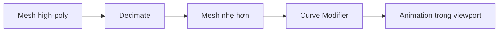
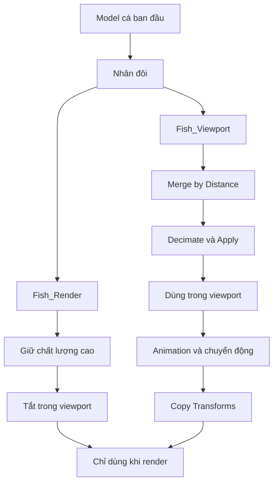
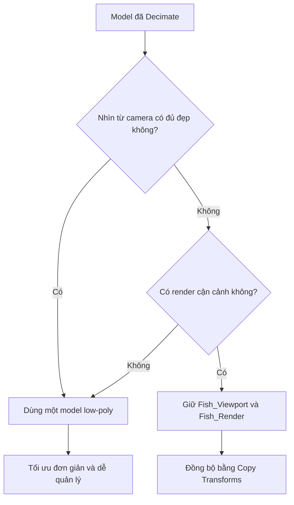
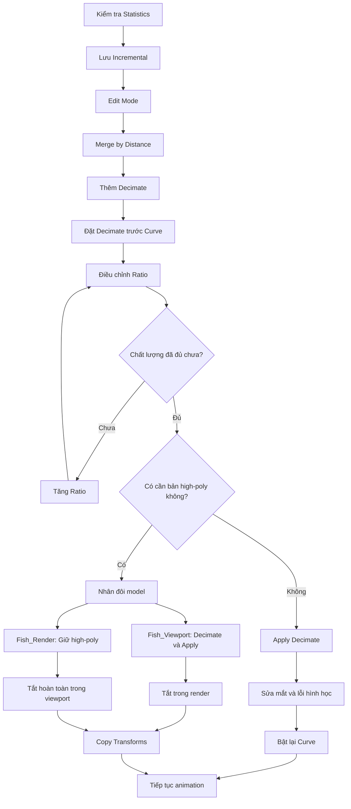

# 05 — Model Optimizations

| Thuộc tính       | Nội dung                                                                           |
| ---------------- | ---------------------------------------------------------------------------------- |
| **Video**        | Learn How to Animate and Render a Fish in Blender! (Beginner Friendly)             |
| **Chương**       | Model Optimizations                                                                |
| **Thời điểm**    | 01:05:06                                                                           |
| **Thời lượng**   | 17:29                                                                              |
| **Chủ đề chính** | Giảm độ nặng của model, tăng tốc viewport và xây dựng quy trình low-poly/high-poly |

---

## 1. Mục tiêu bài học

Sau chương này, bạn có thể:

* Xác định nguyên nhân khiến viewport bị giật, lag khi phát animation.
* Dùng **Merge by Distance** để loại bỏ lượng lớn vertex trùng.
* Dùng **Decimate Modifier** để giảm số lượng polygon.
* Sắp xếp Decimate đúng vị trí trong modifier stack.
* Hiểu vì sao Decimate chưa Apply đôi khi vẫn làm viewport chậm.
* Tạo hai phiên bản model:

  * Bản nhẹ để làm việc trong viewport.
  * Bản chất lượng cao để render cuối.
* Điều khiển khả năng hiển thị và tính toán của từng model trong Outliner.
* Đồng bộ chuyển động giữa hai model bằng **Copy Transforms Constraint**.
* Chỉnh sửa một số lỗi hình học nhỏ như vùng hốc mắt bị lõm hoặc méo.
* Lưu file theo phiên bản và ghi changelog ngay bên trong Blender.

---

## 2. Vấn đề chính: model quá nặng làm viewport bị lag

Model cá ban đầu có khoảng **160.000 vertex** và hơn **300.000 tam giác**. Đây là số lượng khá lớn đối với một model đang phải:

* Chạy animation.
* Di chuyển dọc theo đường Curve.
* Tính toán Curve Modifier ở mỗi frame.
* Hiển thị texture.
* Có thể phải tính thêm ánh sáng và vật liệu.

Khi phát animation hoặc di chuyển timeline, Blender phải xử lý toàn bộ số polygon này liên tục.

```text
Mesh nhiều polygon
        ↓
Curve Modifier phải biến dạng toàn bộ mesh
        ↓
Blender tính toán lại ở mỗi frame
        ↓
Viewport bị giật hoặc phản hồi chậm
```

Vì vậy, mục tiêu của chương này không chỉ là giảm dung lượng file mà còn là giảm lượng hình học Blender phải tính toán trong quá trình làm animation.

---

## 3. Kiểm tra số lượng polygon

Để xem model đang nặng đến mức nào:

1. Mở **Viewport Overlays**.
2. Bật tùy chọn **Statistics**.
3. Chọn model cá.
4. Quan sát các thông số:

```text
Vertices
Edges
Faces
Triangles
```

Trong chương này, model ban đầu có số lượng tam giác lớn hơn khoảng mười lần so với phiên bản đã tối ưu.

Ví dụ:

| Phiên bản         | Số tam giác ước tính | Mục đích                             |
| ----------------- | -------------------: | ------------------------------------ |
| Cá chất lượng cao |       Khoảng 320.000 | Render cận cảnh hoặc render cuối     |
| Cá tối ưu         |        Khoảng 32.000 | Animation và làm việc trong viewport |

Số liệu thực tế sẽ thay đổi tùy model.

---

## 4. Lưu phiên bản trước khi tối ưu

Các thao tác như:

* Merge by Distance.
* Apply Decimate.
* Xóa model high-poly.
* Chỉnh trực tiếp vertex.

đều có thể mang tính phá hủy hoặc khó hoàn tác sau khi file đã được lưu nhiều lần.

Trước khi thực hiện, nên dùng:

```text
File → Save Incremental
```

Blender sẽ tạo phiên bản tiếp theo của file:

```text
Fish_Animation_v01.blend
Fish_Animation_v02.blend
Fish_Animation_v03.blend
Fish_Animation_v04.blend
```

### Vì sao nên lưu tăng dần?

* Có thể quay lại model nguyên bản.
* Có thể so sánh low-poly với high-poly.
* Không phải Undo qua hàng trăm thao tác.
* Tránh mất rig hoặc animation đã làm.
* Có thể thử nghiệm mạnh tay mà không phá file chính.

> Không nên ghi đè toàn bộ quá trình vào duy nhất một file `.blend`.

---

## 5. Dọn vertex trùng bằng Merge by Distance

Trước khi Decimate hoạt động ổn định, cần kiểm tra xem model có nhiều vertex nằm trùng nhau hay không.

Các vertex trùng thường xuất hiện khi:

* Import model từ Sketchfab hoặc phần mềm khác.
* Nhiều phần mesh được ghép lại nhưng chưa weld.
* Model được tạo từ dữ liệu scan.
* Các mặt trùng vị trí nhưng chưa dùng chung vertex.
* Model có nhiều shell hình học chồng lên nhau.

### Thao tác

1. Chọn model cá.
2. Nhấn `Tab` để vào Edit Mode.
3. Nhấn `A` để chọn toàn bộ mesh.
4. Chọn:

```text
Mesh → Clean Up → Merge by Distance
```

Hoặc:

```text
M → By Distance
```

Sau khi thực hiện, Blender sẽ hiển thị thông báo dạng:

```text
Removed 120000 vertices
```

Nếu số vertex bị xóa rất lớn, điều đó cho thấy model ban đầu có nhiều vertex trùng.

### Kết quả

* Mesh nhẹ hơn.
* Decimate hoạt động ổn định hơn.
* Giảm các mặt chồng lên nhau.
* Giảm nguy cơ xuất hiện khe nứt hoặc shading bất thường.
* Curve Modifier phải xử lý ít dữ liệu hơn.

### Cảnh báo

Merge by Distance là thao tác thay đổi trực tiếp topology.

Nếu khoảng cách gộp quá lớn, Blender có thể gộp cả những vertex đáng lẽ phải tách rời, đặc biệt tại:

* Mép vây.
* Miệng.
* Mắt.
* Mang cá.
* Những vùng hình học rất mỏng.

Vì vậy, nên giữ giá trị **Merge Distance** ở mức nhỏ và kiểm tra kỹ kết quả.

---

## 6. Giảm polygon bằng Decimate Modifier

### 6.1. Thêm Decimate Modifier

Chọn model cá rồi vào:

```text
Modifier Properties
    → Add Modifier
    → Generate
    → Decimate
```

Chế độ thường được dùng trong trường hợp này là:

```text
Collapse
```

Collapse sẽ gộp dần các cạnh và vertex để giảm số mặt nhưng vẫn cố giữ hình dáng tổng thể.

---

### 6.2. Điều chỉnh Ratio

Thông số quan trọng nhất là **Ratio**.

|  Ratio | Ý nghĩa                 |
| -----: | ----------------------- |
|  `1.0` | Giữ nguyên toàn bộ mesh |
|  `0.5` | Giữ khoảng 50% số mặt   |
| `0.25` | Giữ khoảng 25% số mặt   |
|  `0.1` | Giữ khoảng 10% số mặt   |

Trong video, tác giả thử:

```text
Ratio = 0.1
```

Điều này giúp giảm số polygon khoảng mười lần.

Tuy nhiên, `0.1` là mức khá mạnh. Với những model có topology không tốt, kết quả có thể xuất hiện:

* Mặt bị nhăn.
* Mép vây bị răng cưa.
* Mắt bị biến dạng.
* Silhouette của cá bị méo.
* Các vùng mỏng bị thủng.
* Texture bị kéo giãn.

Nên giảm Ratio từ từ:

```text
1.0 → 0.75 → 0.5 → 0.3 → 0.2 → 0.1
```

Sau mỗi bước, hãy kiểm tra:

* Hình dáng tổng thể.
* Mắt và miệng.
* Mép vây.
* Cuống đuôi.
* Bề mặt khi bật Material Preview.
* Silhouette khi nhìn từ xa.

---

## 7. Đặt Decimate trước Curve Modifier

Thứ tự modifier có ảnh hưởng trực tiếp đến hiệu năng.

### Thứ tự không tối ưu

```text
Curve
  ↓
Decimate
```

Với thứ tự này:

1. Curve Modifier biến dạng toàn bộ mesh high-poly.
2. Sau đó Decimate mới giảm polygon.
3. Blender vẫn phải xử lý mesh nặng trước.

### Thứ tự tối ưu hơn

```text
Decimate
  ↓
Curve
```

Với thứ tự này:

1. Decimate giảm số polygon trước.
2. Curve chỉ phải biến dạng phiên bản mesh nhẹ hơn.
3. Viewport có thể phản hồi nhanh hơn.



Để đổi thứ tự, kéo Decimate lên phía trên Curve Modifier trong modifier stack.

---

## 8. Vì sao thêm Decimate nhưng viewport vẫn có thể chậm?

Một vấn đề quan trọng được nhắc trong chương là:

> Decimate Modifier vẫn phải được Blender tính toán lại trong quá trình đánh giá modifier stack.

Nếu Decimate chưa được Apply, Blender có thể phải:

1. Đọc mesh gốc rất nặng.
2. Tính toán kết quả Decimate.
3. Tính Curve Modifier.
4. Lặp lại quá trình khi timeline thay đổi.

```text
Mesh gốc 320.000 tam giác
        ↓
Tính Decimate
        ↓
Tính Curve
        ↓
Hiển thị viewport
```

Do đó, trong một số trường hợp, chỉ thêm Decimate nhưng chưa Apply có thể không mang lại cải thiện rõ rệt, thậm chí còn thêm một bước tính toán.

### Giải pháp

Khi đã hài lòng với Ratio:

1. Lưu một phiên bản file mới.
2. Mở menu của Decimate Modifier.
3. Chọn **Apply**.

Sau khi Apply:

* Kết quả Decimate trở thành mesh thật.
* Blender không phải tính lại Decimate ở mỗi frame.
* Số lượng vertex và face được chốt.
* Curve Modifier làm việc trực tiếp trên mesh nhẹ.

> `Ctrl + A` trong Object Mode thường dùng để Apply Transform như Location, Rotation và Scale. Nó không phải phím tắt mặc định để Apply một modifier. Để Apply Decimate, nên dùng menu của chính modifier.

---

## 9. Hai chiến lược tối ưu model

Sau khi Decimate, có hai cách tiếp tục.

### Phương án A — Chỉ dùng một model đã tối ưu

Phù hợp khi:

* Cá chỉ xuất hiện ở kích thước nhỏ hoặc trung bình.
* Camera không quay quá gần.
* Texture che được phần lớn sự đơn giản của mesh.
* Silhouette vẫn đủ mượt.
* Render không cần chi tiết cực cao.

```text
Model gốc
   ↓
Merge by Distance
   ↓
Decimate
   ↓
Apply
   ↓
Dùng cho cả viewport và render
```

Đây là phương án cuối cùng tác giả lựa chọn trong video vì model 32.000 tam giác vẫn đủ đẹp cho cảnh quay.

---

### Phương án B — Tách low-poly và high-poly

Phù hợp khi:

* Model gốc có hàng triệu polygon.
* Cần render cận cảnh.
* Low-poly không giữ đủ chi tiết.
* Máy không thể phát animation mượt với bản high-poly.
* Muốn giữ nguyên model gốc cho render cuối.



---

## 10. Tạo phiên bản Fish Viewport và Fish Render

### 10.1. Đổi tên model hiện tại

Chọn model và nhấn:

```text
F2
```

Đổi tên thành:

```text
Fish_Viewport
```

Đây là phiên bản nhẹ dùng trong quá trình làm việc.

---

### 10.2. Nhân đôi model

Nhấn:

```text
Shift + D
```

Sau đó nhấn:

```text
Esc
```

Việc nhấn `Esc` giúp bản sao được tạo tại đúng vị trí của model gốc, không bị di chuyển ngoài ý muốn.

Đổi tên bản sao thành:

```text
Fish_Render
```

---

### 10.3. Thiết lập hai phiên bản

#### Fish_Viewport

* Giữ Decimate Modifier.
* Chọn Ratio phù hợp.
* Apply Decimate.
* Được hiển thị trong viewport.
* Bị tắt trong render cuối.

#### Fish_Render

* Xóa Decimate Modifier.
* Giữ topology chất lượng cao.
* Giữ Curve Modifier hoặc các modifier cần cho render.
* Bị tắt hoàn toàn trong viewport.
* Được bật trong render cuối.

---

## 11. Phân biệt ba nút hiển thị trong Outliner

Đây là phần rất quan trọng của workflow high-poly/low-poly.

### 11.1. Eye — Hide in Viewport

Biểu tượng con mắt chỉ dùng để ẩn hoặc hiện đối tượng trong viewport.

```text
Eye Off → Không nhìn thấy đối tượng
```

Tuy nhiên, trong một số trường hợp đối tượng vẫn có thể được Blender đánh giá trong dependency graph hoặc vẫn khiến modifier phải tính toán.

Vì vậy, chỉ tắt biểu tượng con mắt chưa chắc đã loại bỏ hoàn toàn tình trạng lag.

---

### 11.2. Monitor — Disable in Viewports

Biểu tượng màn hình tắt hoàn toàn đối tượng trong viewport.

```text
Monitor Off
    ↓
Không hiển thị
Không tính modifier trong viewport
Không tham gia đánh giá viewport
```

Đây là nút cần dùng cho phiên bản `Fish_Render`.

Nếu chưa thấy biểu tượng này:

1. Mở Outliner.
2. Nhấn biểu tượng **Filter**.
3. Bật các **Restriction Toggles**.
4. Hiển thị cột **Disable in Viewports**.

---

### 11.3. Camera — Disable in Renders

Biểu tượng camera xác định đối tượng có xuất hiện trong render cuối hay không.

```text
Camera Off → Không xuất hiện khi render
Camera On  → Xuất hiện khi render
```

### Thiết lập đề xuất

| Đối tượng       | Viewport Monitor | Render Camera |
| --------------- | ---------------- | ------------- |
| `Fish_Viewport` | Bật              | Tắt           |
| `Fish_Render`   | Tắt              | Bật           |

```text
Khi làm animation:
Chỉ Fish_Viewport được tính toán

Khi render:
Chỉ Fish_Render xuất hiện trong ảnh
```

---

## 12. Đồng bộ chuyển động giữa hai phiên bản

Sau khi nhân đôi, cả hai model có thể đang chứa cùng keyframe. Điều này gây khó quản lý vì phải chỉnh animation hai lần.

### 12.1. Xóa keyframe khỏi Fish Render

1. Chọn `Fish_Render`.
2. Mở Graph Editor hoặc Dope Sheet.
3. Nhấn `A` để chọn toàn bộ keyframe của đối tượng.
4. Nhấn `X`.
5. Chọn **Delete Keyframes**.

Sau bước này:

```text
Fish_Viewport → Có animation
Fish_Render   → Không có animation riêng
```

---

### 12.2. Thêm Copy Transforms Constraint

Chọn `Fish_Render`, sau đó vào:

```text
Object Constraint Properties
    → Add Object Constraint
    → Copy Transforms
```

Đặt Target thành:

```text
Fish_Viewport
```

Kết quả:

```text
Fish_Viewport di chuyển
        ↓
Fish_Render sao chép Location
Fish_Render sao chép Rotation
Fish_Render sao chép Scale
```

### Vì sao không dùng Parenting?

Có thể parent `Fish_Render` vào `Fish_Viewport`, nhưng parenting tạo quan hệ không gian cha–con và có thể gây khó khăn khi:

* Chỉnh transform riêng.
* Thay đổi parent inverse.
* Thêm constraint khác.
* Thay đổi hệ tọa độ.
* Xử lý các animation phức tạp hơn.

Copy Transforms cho phép hai model giữ cấu trúc độc lập nhưng vẫn có cùng transform.

---

### Giới hạn của Copy Transforms

Copy Transforms chỉ sao chép:

* Location.
* Rotation.
* Scale.

Nó không tự động sao chép:

* Chỉnh sửa vertex trong Edit Mode.
* Shape Keys.
* Weight Paint.
* Modifier settings.
* Vertex Group.
* Thay đổi topology.
* Chỉnh sửa mắt hoặc vây.
* Deformation nội bộ của mesh.

Vì vậy, hai model vẫn cần có cùng các thiết lập Curve Modifier cần thiết.

Ví dụ:

```text
Fish_Viewport:
Decimate → Curve

Fish_Render:
Curve
```

Cả hai Curve Modifier cần:

* Cùng Curve Object.
* Cùng Deform Axis.
* Cùng Origin và hướng trục.
* Cùng thiết lập biến dạng.

---

## 13. Hạn chế của workflow low-poly/high-poly

Workflow hai model rất hữu ích nhưng có một nhược điểm lớn:

> Những chỉnh sửa hình học thực hiện sau khi tách model sẽ không tự động xuất hiện trên cả hai phiên bản.

Ví dụ, nếu phát hiện:

* Mắt bị lõm.
* Mép vây bị lệch.
* Miệng bị méo.
* Một phần mesh cần Smooth.
* Tỷ lệ thân cá cần chỉnh lại.

Bạn phải chỉnh trên cả hai model, hoặc tạo lại bản high-poly/low-poly.

```text
Tách model quá sớm
        ↓
Phát hiện lỗi hình học
        ↓
Phải sửa hai lần
```

Vì vậy, trước khi tạo hệ thống low-poly/high-poly, nên cố gắng hoàn tất:

* Sửa silhouette.
* Sửa mắt.
* Sửa miệng.
* Sửa mép vây.
* Kiểm tra texture.
* Kiểm tra hướng trục.
* Kiểm tra Curve Modifier.

Trong video, tác giả nhận thấy phiên bản đã Decimate vẫn đủ đẹp nên quyết định xóa bản high-poly và chỉ giữ một model duy nhất.

---

## 14. Quyết định có cần giữ bản high-poly hay không

Có thể dùng cây quyết định sau:



### Nên giữ một model khi

* Cá nằm xa camera.
* Cá chuyển động liên tục.
* Motion blur che bớt chi tiết.
* Texture vẫn đẹp.
* Silhouette không bị phá.
* Low-poly đã có hàng chục nghìn tam giác.

### Nên giữ hai model khi

* Render cận cảnh mắt hoặc vảy.
* Model scan có hàng triệu polygon.
* Decimate làm hỏng bề mặt rõ rệt.
* Cần chất lượng hình học cao trong render.
* Máy đủ khả năng render bản high-poly.

---

## 15. Kiểm tra chất lượng trong Rendered View

Để đánh giá xem bản low-poly có đủ tốt hay không, không nên chỉ nhìn trong Solid View.

Có thể chuyển sang:

```text
Rendered View
```

Sau đó thêm tạm một **Area Light**:

1. Đặt 3D Cursor gần model.
2. Nhấn `Shift + A`.
3. Chọn:

```text
Light → Area
```

4. Điều chỉnh:

   * Vị trí.
   * Kích thước đèn.
   * Công suất.
5. Chuyển Render Engine sang Cycles nếu cần.
6. Chọn GPU Compute nếu máy hỗ trợ.

Quan sát các vùng:

* Hốc mắt.
* Mặt bên thân.
* Mép vây.
* Cuống đuôi.
* Các vùng có phản xạ sáng.
* Silhouette khi cá uốn cong.

Đây chỉ là bước kiểm tra tạm thời. Sau khi đánh giá xong, có thể xóa đèn để giữ scene đơn giản.

---

## 16. Chỉnh sửa vùng mắt bị lõm

Sau khi tối ưu, tác giả phát hiện vùng mắt của cá giống một cái hốc hơn là một con mắt rõ ràng.

### 16.1. Tạm tắt Curve Modifier

Trước khi sửa mesh, nên tắt hiển thị Curve Modifier trong viewport.

Mục đích:

* Đưa cá về hình dạng cơ sở.
* Tránh chỉnh vertex khi mesh đang bị uốn cong.
* Dễ quan sát tỷ lệ thật.
* Dễ chọn đúng vùng mắt.

---

### 16.2. Tập trung camera vào model

Chọn model rồi nhấn:

```text
Numpad .
```

Lệnh này đưa góc nhìn tập trung vào đối tượng đang chọn.

---

### 16.3. Chọn vùng mắt

1. Nhấn `Tab` để vào Edit Mode.
2. Chuyển sang Face Select bằng phím `3`.
3. Giữ `Shift` và chọn các mặt quanh mắt.
4. Dùng:

```text
Ctrl + Numpad +
```

để mở rộng vùng chọn.

Nếu chọn quá nhiều, có thể dùng:

```text
C
```

để bật Circle Select.

Trong Circle Select:

* Cuộn chuột để đổi kích thước vòng chọn.
* Chuột trái để chọn.
* Chuột giữa để bỏ chọn.
* Nhấn `Esc` để thoát.

---

### 16.4. Dùng Proportional Editing

Bật Proportional Editing bằng:

```text
O
```

Sau đó dùng:

```text
G
```

để di chuyển vùng mắt.

Trong khi đang di chuyển:

* Cuộn chuột lên để thu nhỏ phạm vi ảnh hưởng.
* Cuộn chuột xuống để mở rộng phạm vi ảnh hưởng.

Mục tiêu là đẩy vùng hốc mắt ra ngoài nhẹ nhàng mà không tạo một điểm lồi quá sắc.

---

### 16.5. Làm phẳng hoặc điều chỉnh theo trục

Tùy hướng của model, có thể dùng:

```text
S → Y
```

hoặc:

```text
S → X
```

để làm phẳng vùng mắt theo một trục.

Cần xác định đúng trục chiều dày của thân cá trước khi scale.

Không nên scale về `0` ngay lập tức vì có thể làm vùng mắt phẳng hoàn toàn và mất thể tích.

---

### 16.6. Làm mượt vertex

Khi vùng mắt xuất hiện các vertex nhấp nhô:

1. Chọn vùng vertex cần xử lý.
2. Mở Vertex Menu:

```text
Ctrl + V
```

3. Chọn:

```text
Smooth Vertices
```

4. Điều chỉnh số lần lặp, chẳng hạn:

```text
Repeat = 2
```

Smooth Vertices giúp trung bình hóa vị trí các vertex lân cận, làm bề mặt mềm và tự nhiên hơn.

### Cảnh báo

Lặp quá nhiều lần có thể:

* Làm mất hình dáng mắt.
* Làm phẳng vùng mặt.
* Co mesh vào trong.
* Làm mất các gờ hình học cần thiết.

---

## 17. Khôi phục Curve Modifier và kiểm tra hướng cá

Sau khi chỉnh mắt:

1. Nhấn `Tab` để trở về Object Mode.
2. Bật lại Curve Modifier trong viewport.
3. Kiểm tra cá trên đường chuyển động.

Nếu cá quay sai hướng, nguyên nhân có thể là model đã bị xoay trong quá trình chỉnh sửa.

Cần phân biệt:

### Xoay trong Object Mode

```text
Rotation của đối tượng thay đổi
```

Điều này có thể ảnh hưởng trực tiếp đến Curve Modifier.

### Xoay trong Edit Mode

```text
Mesh xoay bên trong local space
Object Rotation không thay đổi
```

Đây thường là lựa chọn an toàn hơn khi cần sửa hướng cơ sở của mesh.

Sau khi chỉnh, cần kiểm tra:

* Đầu cá có hướng về phía chuyển động không.
* Cá có bị lật bụng không.
* Deform Axis của Curve có đúng không.
* Local axes của model có phù hợp không.
* Rotation có cần Apply hay không.

---

## 18. Ghi changelog bên trong Blender

Đối với project dài, có thể lưu ghi chú ngay trong file `.blend`.

### Cách tạo changelog

1. Tách một vùng giao diện bằng **Vertical Split**.
2. Chuyển vùng đó thành **Text Editor**.
3. Nhấn **New** để tạo text datablock.
4. Đặt tên:

```text
CHANGELOG
```

5. Ghi lại nội dung:

```text
Version 01
- Import model cá gốc.
- Thiết lập Curve Modifier.

Version 02
- Merge by Distance.
- Thử Decimate.
- Tạo bản Fish_Render high-poly.

Version 03
- Hoàn thiện workflow viewport/render.
- Đồng bộ bằng Copy Transforms.

Version 04
- Xóa bản high-poly.
- Sửa vùng mắt.
- Chốt model low-poly.
```

Có thể bật biểu tượng **Fake User** cho text datablock nếu muốn đảm bảo dữ liệu được giữ lại trong file.

### Lợi ích

* Biết mỗi phiên bản đã thay đổi gì.
* Dễ quay về phiên bản phù hợp.
* Không phải nhớ toàn bộ lịch sử chỉnh sửa.
* Hữu ích khi làm việc nhóm.
* Hữu ích khi project kéo dài nhiều ngày.

---

## 19. Quy trình thực hành hoàn chỉnh



### Các bước rút gọn

1. Bật Statistics và ghi lại số polygon ban đầu.
2. Lưu file bằng Save Incremental.
3. Chọn toàn bộ mesh và chạy Merge by Distance.
4. Thêm Decimate Modifier.
5. Đặt Decimate trước Curve Modifier.
6. Giảm Ratio từ từ.
7. Kiểm tra silhouette, texture, mắt và vây.
8. Quyết định dùng một model hay hai model.
9. Nếu dùng một model, Apply Decimate.
10. Nếu dùng hai model:

    * Tạo `Fish_Viewport`.
    * Tạo `Fish_Render`.
    * Tắt low-poly trong render.
    * Tắt high-poly hoàn toàn trong viewport.
    * Xóa keyframe của high-poly.
    * Thêm Copy Transforms.
11. Tắt Curve Modifier tạm thời để sửa mắt.
12. Dùng Proportional Editing và Smooth Vertices.
13. Bật lại Curve và kiểm tra hướng.
14. Lưu một phiên bản mới.
15. Ghi thay đổi vào changelog.

---

## 20. Phím tắt và công cụ liên quan

| Thao tác                         | Phím tắt hoặc vị trí               |
| -------------------------------- | ---------------------------------- |
| Vào hoặc thoát Edit Mode         | `Tab`                              |
| Chọn toàn bộ mesh                | `A`                                |
| Merge by Distance                | `M` → By Distance                  |
| Nhân đôi đối tượng               | `Shift + D`                        |
| Giữ bản sao tại chỗ              | `Esc` sau `Shift + D`              |
| Đổi tên đối tượng                | `F2`                               |
| Tập trung góc nhìn vào đối tượng | `Numpad .`                         |
| Chọn vertex                      | `1` trong Edit Mode                |
| Chọn edge                        | `2` trong Edit Mode                |
| Chọn face                        | `3` trong Edit Mode                |
| Mở rộng vùng chọn                | `Ctrl + Numpad +`                  |
| Thu nhỏ vùng chọn                | `Ctrl + Numpad -`                  |
| Bật/tắt Proportional Editing     | `O`                                |
| Di chuyển                        | `G`                                |
| Scale                            | `S`                                |
| Xoay                             | `R`                                |
| Circle Select                    | `C`                                |
| Mở Vertex Menu                   | `Ctrl + V`                         |
| Xóa keyframe đã chọn             | `X` trong Graph Editor             |
| Lưu file                         | `Ctrl + S`                         |
| Save Incremental                 | File → Save Incremental            |
| Bật Statistics                   | Viewport Overlays → Statistics     |
| Apply Decimate                   | Menu của Decimate Modifier → Apply |
| Thêm Copy Transforms             | Object Constraint Properties       |
| Hiện Restriction Toggles         | Outliner → Filter                  |

---

## 21. Lỗi thường gặp

### 21.1. Decimate làm model trông rất kỳ lạ

**Nguyên nhân có thể:**

* Có nhiều vertex trùng.
* Ratio quá thấp.
* Mesh chứa phần hình học chồng lên nhau.
* Vây quá mỏng.
* Model có topology không đều.

**Cách xử lý:**

1. Undo.
2. Lưu phiên bản mới.
3. Chạy Merge by Distance.
4. Thử lại với Ratio cao hơn.
5. Kiểm tra từng vùng quan trọng.

---

### 21.2. Thêm Decimate nhưng viewport vẫn lag

**Nguyên nhân:**

* Decimate chưa Apply.
* Decimate nằm sau Curve.
* Bản high-poly chỉ được ẩn bằng biểu tượng con mắt.
* High-poly vẫn đang được tính modifier.
* Cả hai model đều đang phát animation.
* Rendered View đang tính ánh sáng quá nặng.

**Cách xử lý:**

* Đưa Decimate lên trước Curve.
* Apply Decimate sau khi chốt Ratio.
* Tắt bản high-poly bằng biểu tượng Monitor.
* Xóa keyframe thừa trên Fish_Render.
* Chuyển về Material Preview hoặc Solid View khi chỉnh animation.

---

### 21.3. High-poly vẫn làm viewport chậm dù đã ẩn

**Nguyên nhân:**

Chỉ tắt biểu tượng con mắt, chưa tắt **Disable in Viewports**.

**Cách xử lý:**

```text
Outliner
    → Filter
    → Bật Restriction Toggles
    → Tắt biểu tượng Monitor của Fish_Render
```

---

### 21.4. Render xuất hiện hai con cá chồng lên nhau

**Nguyên nhân:**

Cả `Fish_Viewport` và `Fish_Render` đều đang bật biểu tượng camera.

**Cách xử lý:**

```text
Fish_Viewport → Camera Off
Fish_Render   → Camera On
```

---

### 21.5. Fish Render không chuyển động giống Fish Viewport

**Kiểm tra:**

* Target của Copy Transforms có đúng không.
* Constraint có bị tắt không.
* Influence có bằng `1.0` không.
* Cả hai model có cùng Curve Object không.
* Modifier stack có cùng Deform Axis không.
* Origin của hai model có trùng nhau không.

---

### 21.6. Sửa mắt trên low-poly nhưng high-poly không thay đổi

Đây là hành vi bình thường.

Copy Transforms không sao chép chỉnh sửa mesh.

Giải pháp:

* Sửa trên cả hai model.
* Sửa model trước khi nhân đôi.
* Hoặc xóa và tạo lại bản high-poly/low-poly.

---

### 21.7. Cá quay sai sau khi bật lại Curve

**Nguyên nhân:**

* Đã xoay object để quan sát khi sửa.
* Rotation chưa được khôi phục.
* Deform Axis không còn phù hợp.
* Local axis của mesh bị thay đổi.

**Cách xử lý:**

* Kiểm tra Object Rotation.
* Xoay mesh trong Edit Mode khi cần đổi hướng cơ sở.
* Kiểm tra Curve Modifier.
* Chỉ Apply Rotation sau khi hiểu rõ ảnh hưởng đến modifier.

---

### 21.8. Smooth Vertices làm mắt bị lõm hơn

**Nguyên nhân:**

* Vùng chọn quá rộng.
* Repeat quá cao.
* Proportional Editing có phạm vi quá lớn.
* Mesh bị co về tâm.

**Cách xử lý:**

* Giảm Repeat.
* Chọn vùng nhỏ hơn.
* Di chuyển vùng mắt ra ngoài trước khi Smooth.
* Kiểm tra từ nhiều góc nhìn.

---

## 22. Checklist thực hành

### Tối ưu mesh

* [ ] Đã bật Statistics.
* [ ] Đã ghi lại số vertex và triangle ban đầu.
* [ ] Đã lưu một phiên bản file mới.
* [ ] Đã chạy Merge by Distance.
* [ ] Đã kiểm tra số vertex bị xóa.
* [ ] Đã thêm Decimate Modifier.
* [ ] Đã đặt Decimate trước Curve Modifier.
* [ ] Đã chọn Ratio phù hợp.
* [ ] Đã kiểm tra silhouette của cá.
* [ ] Đã kiểm tra mắt, miệng và mép vây.
* [ ] Đã Apply Decimate nếu dùng model low-poly cố định.

### Workflow high-poly/low-poly

* [ ] Đã tạo `Fish_Viewport`.
* [ ] Đã tạo `Fish_Render`.
* [ ] `Fish_Viewport` bị tắt trong render.
* [ ] `Fish_Render` bị tắt hoàn toàn trong viewport.
* [ ] Đã xóa keyframe riêng của `Fish_Render`.
* [ ] Đã thêm Copy Transforms Constraint.
* [ ] Hai model dùng cùng Curve Object.
* [ ] Hai model không xuất hiện đồng thời trong render.

### Sửa hình học

* [ ] Đã tắt Curve Modifier trước khi sửa mesh.
* [ ] Đã sửa vùng mắt bằng Proportional Editing.
* [ ] Đã làm mượt vertex với mức vừa phải.
* [ ] Đã kiểm tra model từ nhiều góc.
* [ ] Đã bật lại Curve Modifier.
* [ ] Đã kiểm tra hướng chuyển động của cá.

### Quản lý phiên bản

* [ ] Đã dùng Save Incremental sau mỗi thay đổi lớn.
* [ ] Đã ghi changelog.
* [ ] Đã giữ lại phiên bản trước khi Apply Decimate.
* [ ] Đã giữ bản high-poly dự phòng nếu thực sự cần.

---

## 23. Tóm tắt

Chương **Model Optimizations** tập trung giải quyết tình trạng viewport bị lag do model cá có số lượng polygon quá lớn.

Quy trình tối ưu chính gồm:

```text
Lưu phiên bản
    ↓
Merge by Distance
    ↓
Thêm Decimate
    ↓
Đặt Decimate trước Curve
    ↓
Điều chỉnh Ratio
    ↓
Apply Decimate
```

Nếu bản đã Decimate vẫn đủ đẹp, nên dùng một model duy nhất để project đơn giản và dễ quản lý.

Nếu cần giữ chất lượng cao cho render, có thể tạo hai phiên bản:

```text
Fish_Viewport
- Low-poly
- Dùng để làm animation
- Tắt trong render

Fish_Render
- High-poly
- Tắt hoàn toàn trong viewport
- Đồng bộ bằng Copy Transforms
- Chỉ bật khi render
```

Tuy nhiên, workflow hai model làm tăng độ phức tạp và không tự đồng bộ các chỉnh sửa vertex. Vì vậy, chỉ nên sử dụng khi chất lượng high-poly thực sự cần thiết.

Trong trường hợp của video, phiên bản khoảng **32.000 tam giác** đã đủ đẹp ở khoảng cách camera dự kiến. Tác giả vì thế xóa bản high-poly, sửa lại vùng mắt và tiếp tục sử dụng model đã tối ưu cho toàn bộ animation.
