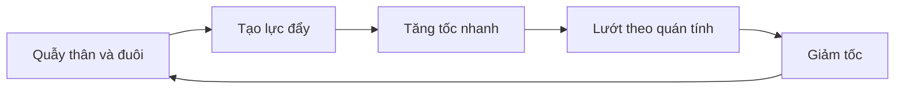
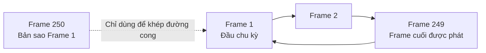
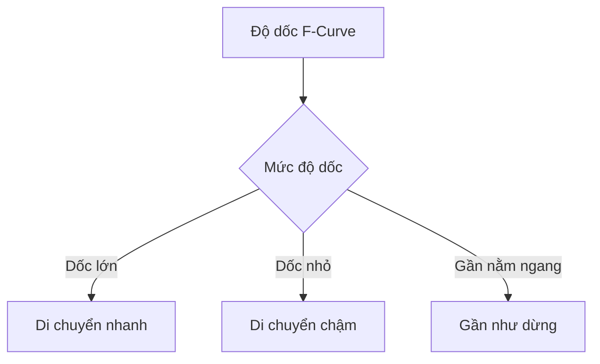
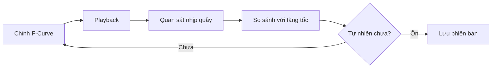
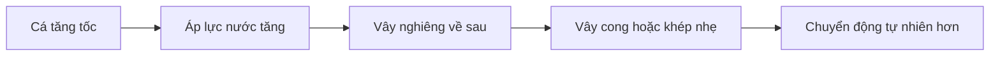
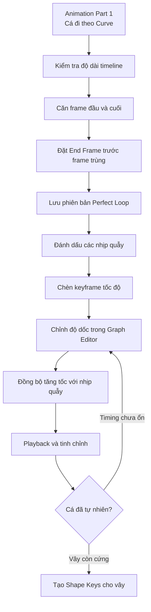

# 06 — Animation Part 2

| Thuộc tính       | Nội dung                                                                   |
| ---------------- | -------------------------------------------------------------------------- |
| **Video**        | Learn How to Animate and Render a Fish in Blender! (Beginner Friendly)     |
| **Chương**       | Animation Part 2                                                           |
| **Thời điểm**    | 01:22:35                                                                   |
| **Thời lượng**   | 20:34                                                                      |
| **Chủ đề chính** | Hoàn thiện vòng lặp, tạo speed ramp và đồng bộ tốc độ với nhịp quẫy của cá |

---

## 1. Mục tiêu bài học

Sau chương này, người học có thể:

* Làm cho animation cá bơi **lặp lại liền mạch**, không nhận ra điểm bắt đầu và kết thúc.

* Đồng bộ chính xác vị trí ở frame đầu và frame cuối.

* Hiểu vì sao không nên để cả frame đầu và frame cuối giống hệt nhau trong phạm vi phát animation.

* Sử dụng **Graph Editor** để điều chỉnh tốc độ chuyển động dọc theo quỹ đạo.

* Tạo nhịp:

  * Bơi chậm hoặc lướt trong khoảng thời gian dài.
  * Tăng tốc nhanh khi cá quẫy thân.
  * Giảm tốc trở lại sau mỗi nhịp đẩy.

* Chỉnh nhiều keyframe cùng lúc bằng chế độ Pivot Point **Individual Centers**.

* Chuẩn bị animation nền trước khi tiếp tục tạo biến dạng vây bằng Shape Keys.

---

## 2. Trọng tâm thực tế của chương

Animation ở phần trước đã giúp cá di chuyển theo một đường cong. Tuy nhiên, cá vẫn đang di chuyển với tốc độ tương đối đều, khiến chuyển động thiếu lực đẩy và trông giống như đang được kéo dọc theo quỹ đạo.

Trong thực tế, cá thường không bơi với tốc độ hoàn toàn ổn định. Một chu kỳ chuyển động tự nhiên hơn thường gồm:

1. Cá bắt đầu quẫy thân và đuôi.
2. Lực đẩy được tạo ra.
3. Cá tăng tốc trong thời gian ngắn.
4. Cá lướt theo quán tính.
5. Tốc độ giảm dần.
6. Cá tiếp tục quẫy để tạo lực đẩy mới.



Vì vậy, mục tiêu chính của chương này không phải là thêm nhiều chuyển động mới, mà là **điều chỉnh timing của chuyển động hiện có** để tốc độ của cá phản ứng hợp lý với từng nhịp quẫy.

---

# 3. Mở Graph Editor nhanh hơn

## 3.1. Cách chia vùng làm việc thông thường

Thông thường, để mở thêm một vùng Graph Editor, có thể:

1. Nhấp chuột phải vào đường viền giữa các vùng.
2. Chọn **Split Area**.
3. Chia vùng theo chiều ngang hoặc chiều dọc.
4. Đổi loại Editor mới thành Graph Editor.

Tuy nhiên, việc này khá chậm nếu phải thực hiện nhiều lần.

---

## 3.2. Gán phím tắt cho Split/Move Area

Blender cho phép gán phím tắt tùy chỉnh cho nhiều lệnh trong giao diện.

Quy trình được sử dụng trong video:

1. Nhấp chuột phải vào nút chọn loại Editor ở góc vùng làm việc.
2. Mở menu liên quan đến phần Header.
3. Tìm lệnh **Split/Move Area**.
4. Nhấp chuột phải vào lệnh.
5. Chọn **Assign Shortcut**.
6. Gán phím:

```text
Ctrl + W
```

Sau khi gán, có thể nhấn `Ctrl + W` để nhanh chóng:

* Chia vùng làm việc.
* Di chuyển ranh giới vùng.
* Gộp hai vùng lại với nhau.

> `Ctrl + W` là phím tắt tùy chỉnh trong video, không phải thiết lập mặc định của Blender.

---

## 3.3. Chuyển vùng hiện tại thành Graph Editor

Đặt con trỏ chuột trong vùng vừa tạo rồi nhấn:

```text
Shift + F6
```

Phím này chuyển vùng hiện tại sang **Graph Editor**.

Quy trình nhanh:

```text
Ctrl + W
→ Chia vùng
→ Di chuột vào vùng mới
→ Shift + F6
→ Graph Editor
```

---

# 4. Điều hướng trong Graph Editor

## 4.1. Các thao tác cơ bản

| Thao tác                          | Phím hoặc thao tác      |
| --------------------------------- | ----------------------- |
| Chọn tất cả keyframe              | `A`                     |
| Di chuyển keyframe                | `G`                     |
| Di chuyển theo trục thời gian     | `G`, sau đó `X`         |
| Di chuyển theo giá trị            | `G`, sau đó `Y`         |
| Xoay keyframe hoặc tay nắm        | `R`                     |
| Scale keyframe hoặc tay nắm       | `S`                     |
| Hiển thị toàn bộ keyframe đã chọn | `Numpad .`              |
| Mở/đóng Sidebar                   | `N`                     |
| Chuyển sang Graph Editor          | `Shift + F6`            |
| Phóng to theo trục                | Giữ `Ctrl` + chuột giữa |
| Phóng to toàn vùng                | `Ctrl + Space`          |

> Trong Graph Editor, trục ngang biểu diễn thời gian. Tuy nhiên, transcript gọi thao tác di chuyển đồ thị lên hoặc xuống là `G`, `Y`, vì người hướng dẫn đang điều chỉnh giá trị của đường cong.

---

## 4.2. Phóng to để chỉnh chính xác

Khi cần căn keyframe đầu và cuối, nên phóng to nhiều lần thay vì chỉnh ở góc nhìn quá xa.

Có thể sử dụng:

* Con lăn chuột.
* Thanh cuộn của Graph Editor.
* `Ctrl + Middle Mouse`.
* `Numpad .` để tập trung vào các keyframe đã chọn.

Việc phóng to rất quan trọng vì sai lệch rất nhỏ giữa frame đầu và frame cuối vẫn có thể tạo ra một cú giật khi animation lặp lại.

---

# 5. Tạo vòng lặp animation hoàn hảo

## 5.1. Vấn đề của animation hiện tại

Cá đã gần quay về cùng vị trí ở đầu và cuối animation, nhưng “gần giống nhau” vẫn chưa đủ.

Nếu vị trí ở frame cuối lệch nhẹ so với frame đầu, khi animation quay về đầu sẽ xuất hiện:

* Cú giật nhỏ.
* Dịch chuyển đột ngột.
* Motion blur không liên tục.
* Cảm giác vòng lặp bị “khựng”.

Mục tiêu là:

```text
Trạng thái ở frame đầu = Trạng thái tại điểm kết thúc chu kỳ
```

---

## 5.2. Dùng Annotation để đánh dấu vị trí

Để so sánh vị trí cá ở đầu và cuối animation, người hướng dẫn sử dụng công cụ Annotation.

### Tạo đường đánh dấu

1. Chuyển đến frame đầu tiên.
2. Giữ `D`.
3. Vẽ một đường sát với một điểm dễ nhận biết trên mesh cá.

Ví dụ:

* Đầu cá.
* Mép thân.
* Một đỉnh polygon rõ ràng.
* Gốc đuôi.

### Xóa Annotation

```text
Giữ D + nhấp chuột phải
```

---

## 5.3. Tắt Lock to Frame cho Annotation

Theo mặc định, Annotation có thể bị gắn với frame hiện tại. Điều đó khiến đường đánh dấu biến mất khi chuyển sang frame khác.

Để đường Annotation luôn xuất hiện:

1. Nhấn `N`.
2. Mở tab **View**.
3. Tìm phần Annotation.
4. Tắt tùy chọn:

```text
Lock to Frame
```

Khi đã tắt, đường đánh dấu sẽ giữ nguyên trong viewport khi di chuyển qua các frame khác nhau.

---

## 5.4. Căn frame cuối theo frame đầu

Sau khi vẽ đường đánh dấu ở frame đầu:

1. Chuyển tới frame cuối.
2. Quan sát độ lệch giữa cá và đường Annotation.
3. Trong Graph Editor, chọn keyframe cuối.
4. Nhấn:

```text
G → Y
```

5. Di chuyển keyframe cho đến khi cá ở frame cuối trùng chính xác với vị trí frame đầu.
6. Phóng to và tiếp tục chỉnh nếu cần.

Có thể kiểm tra liên tục bằng cách chuyển qua lại:

```text
Frame đầu → Frame cuối → Frame đầu → Frame cuối
```

Khi không còn thấy cá “nhảy” vị trí, hai trạng thái đã được căn đúng.

---

# 6. Loại bỏ frame trùng ở cuối vòng lặp

Giả sử animation bắt đầu tại frame `1` và keyframe kết thúc nằm ở frame `250`.

Nếu frame `1` và frame `250` giống hệt nhau, đồng thời phạm vi phát cũng kết thúc tại frame `250`, Blender sẽ phát hai hình giống nhau liên tiếp:

```text
... → Frame 249 → Frame 250 → Frame 1 → Frame 2 ...
```

Trong đó:

```text
Frame 250 = Frame 1
```

Điều này tạo ra một khoảng dừng nhỏ tương đương một frame.

## Cách khắc phục

Giữ keyframe vòng lặp ở frame `250`, nhưng đặt End Frame thành:

```text
249
```

Khi đó trình tự phát sẽ là:

```text
Frame 1 → Frame 2 → ... → Frame 248 → Frame 249 → Frame 1
```

Frame `250` vẫn đóng vai trò là điểm tham chiếu giúp đường cong nội suy đúng, nhưng không được render hoặc phát như một frame riêng biệt.



---

# 7. Tại sao vòng lặp này an toàn cho Motion Blur?

Motion blur của Blender không chỉ dựa vào vị trí của vật thể tại một frame. Blender còn xem xét chuyển động trước và sau frame đó để tính hướng và độ dài vệt mờ.

Nếu đường cong chuyển động bị gãy hoặc dừng đột ngột tại đầu/cuối animation, motion blur có thể:

* Đổi hướng bất thường.
* Xuất hiện vệt mờ sai.
* Bị mất ở điểm nối vòng lặp.
* Tạo cảm giác vật thể khựng lại.

Trong video, animation sử dụng:

* **Linear Extrapolation** bên ngoài phạm vi keyframe.
* Tay nắm keyframe được điều chỉnh để đường cong tiếp tục hợp lý.
* Frame kết thúc chu kỳ khớp với frame bắt đầu.

Nhờ đó, Blender vẫn có thông tin chuyển động trước frame đầu và sau frame cuối để tính motion blur ổn định hơn.

---

# 8. Xác định các thời điểm cá quẫy

Sau khi vòng lặp đã hoàn chỉnh, bước tiếp theo là đánh dấu những thời điểm cá thực hiện chuyển động quẫy thân.

Người hướng dẫn quan sát animation và đặt keyframe trên kênh chuyển động chính tại các vị trí tương ứng với:

* Bắt đầu nhịp quẫy.
* Giữa nhịp quẫy.
* Kết thúc lực đẩy.
* Đoạn lướt dài trước nhịp tiếp theo.

Các keyframe mới được đặt trên kênh **X Location** của object hoặc kênh điều khiển chuyển động dọc theo đường cong.

## Chèn keyframe trong Graph Editor

1. Chọn F-Curve cần thao tác.
2. Đặt playhead tại frame mong muốn.
3. Đưa chuột vào Graph Editor.
4. Nhấn `I`.
5. Chọn chèn keyframe trên kênh đang chọn.

Có thể chèn trực tiếp từ Object Properties bằng cách nhấn nút hình kim cương cạnh giá trị **X Location**.

---

# 9. Lưu phiên bản trước khi chỉnh sâu

Trước khi biến đổi nhiều keyframe, người hướng dẫn tạo một bản lưu tăng dần:

```text
Ctrl + Alt + S
```

Ví dụ:

```text
fish_animation_v004.blend
fish_animation_v005.blend
```

Trong changelog, có thể ghi:

```text
Version 4 — Perfect loop timing
Version 5 — Basic animation timing
```

Việc lưu tăng dần giúp:

* Quay về vòng lặp hoàn chỉnh nếu chỉnh speed ramp thất bại.
* So sánh các phiên bản.
* Tránh phải làm lại bước căn frame đầu và cuối.
* Thử nghiệm mạnh tay hơn mà không lo mất kết quả tốt trước đó.

---

# 10. Tạo Speed Ramp trong Graph Editor

## 10.1. Nguyên lý đọc độ dốc F-Curve

Trong đồ thị vị trí theo thời gian:

* Đường cong càng dốc → vật thể di chuyển càng nhanh.
* Đường cong càng thoải → vật thể di chuyển càng chậm.
* Đường gần nằm ngang → vật thể gần như dừng.
* Đường dốc thay đổi nhanh → vật thể tăng hoặc giảm tốc mạnh.



Mục tiêu là làm cho đường cong dốc hơn trong các nhịp quẫy và thoải hơn trong các đoạn lướt.

---

## 10.2. Đặt Pivot Point thành Individual Centers

Người hướng dẫn muốn chỉnh nhiều đoạn đường cong cùng lúc nhưng vẫn giữ mỗi keyframe xoay quanh chính nó.

Hãy đổi Pivot Point từ:

```text
Bounding Box Center
```

sang:

```text
Individual Centers
```

Sau đó:

1. Nhấn `A` để chọn tất cả keyframe.
2. Nhấn `R`.
3. Xoay đồng thời nhiều keyframe hoặc tay nắm.

Với **Individual Centers**, mỗi keyframe được xoay quanh tâm riêng, thay vì toàn bộ nhóm xoay như một khối.

Điều này giúp thay đổi độ dốc của nhiều đoạn tương tự nhanh hơn rất nhiều.

---

## 10.3. Xoay các keyframe để tạo nhịp tăng tốc

Sau khi chọn các keyframe:

```text
A → R
```

Người hướng dẫn xoay chúng để:

* Đoạn ứng với nhịp quẫy trở nên dốc hơn.
* Đoạn lướt trở nên thoải hơn.
* Tốc độ tăng lên đúng lúc cá tạo lực đẩy.

Kết quả mong muốn:

```text
Quẫy → đường cong dốc → cá tăng tốc
Lướt → đường cong thoải → cá giảm tốc
```

---

## 10.4. Scale tay nắm để tạo cú tăng tốc nhanh

Tiếp theo, chọn các tay nắm phía dưới hoặc phía trước của những keyframe ứng với nhịp quẫy.

Nhấn:

```text
S
```

Sau đó kéo giãn để tạo một đoạn dốc mạnh hơn.

Hiệu ứng tạo ra:

* Cá “bắn” về phía trước trong thời gian ngắn.
* Tốc độ phản ứng rõ ràng với nhịp quẫy.
* Chuyển động có lực đẩy thay vì trượt đều.

---

## 10.5. Thu nhỏ tay nắm phía sau để tạo đoạn lướt

Chọn các tay nắm phía sau keyframe tăng tốc:

1. Giữ `Shift` để chọn nhiều tay nắm.
2. Nhấn `S`.
3. Thu nhỏ hoặc nén chúng.

Mục đích là tạo phần chuyển tiếp:

```text
Tăng tốc nhanh → giảm tốc từ từ → lướt
```

Đường cong lúc này có hình dạng gần giống:

```text
____/‾‾‾\____/‾‾‾\____
    ↑       ↑
  lực đẩy  lực đẩy
```

Đây không phải biểu diễn chính xác giá trị vị trí, nhưng giúp hình dung nhịp tăng tốc và lướt.

---

# 11. Đồng bộ speed ramp với nhịp quẫy

Sau khi chỉnh tốc độ, người hướng dẫn nhận thấy tốc độ tăng lên hơi muộn:

```text
Cá bắt đầu quẫy
→ một lúc sau mới tăng tốc
```

Điều này thiếu tự nhiên vì lực đẩy nên xuất hiện gần thời điểm cá bắt đầu quẫy mạnh.

Do các keyframe đều bị lệch cùng một lượng, có thể sửa hàng loạt:

1. Nhấn `A` để chọn toàn bộ keyframe tốc độ.
2. Nhấn:

```text
G → Y
```

3. Di chuyển toàn bộ đường cong lên hoặc xuống để thay đổi pha của vòng lặp.
4. Giữ `Shift` khi kéo để điều chỉnh chính xác hơn.

Trong trường hợp này, việc di chuyển giá trị tuần hoàn lên hoặc xuống làm thay đổi thời điểm mà các đoạn dốc xuất hiện trong vòng lặp, nhưng không phá vỡ thời lượng chu kỳ.

> Cần kiểm tra lại vòng lặp sau khi dịch chuyển toàn bộ đường cong để bảo đảm điểm nối vẫn khớp.

---

# 12. Quy trình xem thử và tinh chỉnh

Speed ramp gần như không thể hoàn thiện chỉ trong một lần chỉnh. Quy trình thực tế trong video là:



Các câu hỏi cần tự kiểm tra:

* Cá có tăng tốc đúng lúc bắt đầu quẫy không?
* Đoạn tăng tốc có quá mạnh không?
* Cá có trượt quá lâu không?
* Tốc độ có giảm quá nhanh không?
* Có đoạn nào cá gần như đứng yên bất thường không?
* Điểm nối vòng lặp còn liền mạch không?

---

# 13. Tắt Overlay để quan sát chuyển động rõ hơn

Các đường Curve, xương, Annotation hoặc biểu tượng điều khiển có thể làm khó việc đánh giá chuyển động.

Dùng:

```text
Alt + Shift + Z
```

để bật hoặc tắt Overlay trong viewport.

Khi tắt Overlay, tập trung quan sát:

* Nhịp tăng tốc.
* Cảm giác quán tính.
* Sự liên tục của vòng lặp.
* Hình dáng tổng thể của cá.
* Vây có bị cứng hoặc thiếu chuyển động hay không.

---

# 14. Vấn đề mới: vây cá quá tĩnh

Sau khi speed ramp được cải thiện, một hạn chế mới trở nên rõ ràng: cá di chuyển nhanh hơn nhưng toàn bộ hệ thống vây vẫn gần như giữ nguyên hình dạng.

Điều này khiến cá trông giống như:

* Một mô hình cứng đang trượt trong nước.
* Một vật thể được kéo theo Curve.
* Một con cá “đông cứng” thay vì sinh vật sống.

Người hướng dẫn so sánh hiện tượng này với một cái cây trong gió:

> Nếu cây đang chuyển động trong không khí, lá và cành chắc chắn phải phản ứng. Tương tự, khi cá chuyển động trong nước, vây không thể hoàn toàn bất động.

---

## 14.1. Nguyên nhân từ model photogrammetry

Model cá được tạo từ photogrammetry hoặc scan ảnh. Tư thế được quét có thể là tư thế cá đứng yên, trong đó:

* Vây đang mở rộng.
* Vây lưng và vây bụng giữ nguyên hình dạng.
* Các màng vây không bị nước ép về phía sau.
* Toàn bộ cá có dáng giống một mẫu vật tĩnh.

Tư thế này có thể phù hợp khi cá đứng yên, nhưng không phù hợp hoàn toàn khi cá bơi nhanh.

---

## 14.2. Hướng xử lý ở chương tiếp theo

Người hướng dẫn quyết định tạo Shape Keys để:

* Ép các vây nghiêng về phía sau khi cá tăng tốc.
* Làm vây cong hoặc xẹp nhẹ.
* Tạo cảm giác nước tác động lên vây.
* Giảm cảm giác cá là một khối cứng.
* Đồng bộ hình dạng vây với tốc độ bơi.



Vì vậy, Animation Part 2 chủ yếu hoàn thiện **timing và tốc độ**, còn biến dạng chi tiết của vây sẽ được xử lý bằng Shape Keys ngay sau đó.

---

# 15. Quy trình thực hành đề xuất

## Bước 1 — Mở Graph Editor

* Chia một vùng làm việc.
* Chuyển vùng đó thành Graph Editor bằng `Shift + F6`.
* Chọn object cá.
* Hiển thị kênh điều khiển chuyển động theo quỹ đạo.

---

## Bước 2 — Kiểm tra thời lượng animation

* Phát toàn bộ animation.
* Quan sát xem phạm vi 250 frame có quá dài hoặc quá ngắn không.
* Không thay đổi thời lượng quá sớm nếu chưa quan sát đủ một vòng.

---

## Bước 3 — Căn vòng lặp

* Chuyển đến frame đầu.
* Vẽ Annotation làm mốc.
* Tắt **Lock to Frame**.
* Chuyển tới keyframe cuối.
* Điều chỉnh keyframe cuối để cá trùng với vị trí đầu.

---

## Bước 4 — Đặt End Frame

Nếu frame `1` và frame `250` giống nhau:

```text
Start Frame: 1
End Frame: 249
```

Giữ keyframe ở frame `250` để đường cong khép kín nhưng không phát frame đó.

---

## Bước 5 — Lưu bản sao tăng dần

```text
Ctrl + Alt + S
```

Đặt tên hoặc ghi chú phiên bản:

```text
Perfect Loop Timing
```

---

## Bước 6 — Đánh dấu nhịp quẫy

Quan sát animation và chèn keyframe tại:

* Đầu mỗi nhịp quẫy.
* Đỉnh lực đẩy.
* Đầu đoạn lướt.
* Cuối đoạn lướt.

---

## Bước 7 — Tạo speed ramp

* Chuyển Pivot Point sang **Individual Centers**.
* Xoay keyframe để tăng độ dốc ở nhịp quẫy.
* Scale tay nắm để tăng tốc nhanh hơn.
* Thu nhỏ tay nắm phía sau để tạo đoạn lướt dài.

---

## Bước 8 — Đồng bộ pha

Nếu cá tăng tốc quá sớm hoặc quá muộn:

* Chọn tất cả keyframe tốc độ.
* Dịch chuyển đồng đều.
* Playback lại để so sánh nhịp quẫy với thời điểm tăng tốc.

---

## Bước 9 — Xem không có Overlay

```text
Alt + Shift + Z
```

Quan sát cá như một cảnh render thực tế thay vì chỉ nhìn đường cong kỹ thuật.

---

## Bước 10 — Xác định phần còn thiếu

Nếu chuyển động tốc độ đã ổn nhưng cá vẫn cứng:

* Không tiếp tục phóng đại speed ramp.
* Chuyển sang tạo Shape Keys cho vây.
* Đồng bộ độ cong hoặc độ khép vây với tốc độ cá.

---

# 16. Phím tắt và công cụ liên quan

| Thao tác                         | Phím tắt                                |
| -------------------------------- | --------------------------------------- |
| Chuyển vùng sang Graph Editor    | `Shift + F6`                            |
| Chọn tất cả keyframe             | `A`                                     |
| Chèn keyframe trong Graph Editor | `I`                                     |
| Di chuyển keyframe               | `G`                                     |
| Di chuyển theo một trục          | `G` rồi chọn trục                       |
| Xoay keyframe hoặc handle        | `R`                                     |
| Scale keyframe hoặc handle       | `S`                                     |
| Chọn thêm nhiều handle           | Giữ `Shift`                             |
| Hiển thị toàn bộ phần đã chọn    | `Numpad .`                              |
| Mở/đóng Sidebar                  | `N`                                     |
| Phóng to vùng hiện tại           | `Ctrl + Space`                          |
| Bật/tắt Overlay                  | `Alt + Shift + Z`                       |
| Vẽ Annotation                    | Giữ `D` và kéo                          |
| Xóa Annotation                   | Giữ `D` + chuột phải                    |
| Lưu phiên bản tăng dần           | `Ctrl + Alt + S`                        |
| Lưu file                         | `Ctrl + S`                              |
| Split/Move Area                  | `Ctrl + W` — phím tùy chỉnh trong video |

---

# 17. Lỗi thường gặp

## 17.1. Frame cuối và frame đầu gần giống nhưng chưa trùng

### Biểu hiện

* Cá giật nhẹ khi vòng lặp khởi động lại.
* Vệt motion blur thay đổi đột ngột.
* Camera cố định vẫn làm lộ điểm nối.

### Cách sửa

* Dùng Annotation hoặc một Empty làm mốc.
* Phóng to.
* Điều chỉnh keyframe cuối chính xác hơn.

---

## 17.2. Phát cả hai frame giống nhau

### Biểu hiện

Animation dừng nhẹ ở điểm lặp dù vị trí đã khớp hoàn toàn.

### Nguyên nhân

Frame đầu và frame cuối giống nhau nhưng đều được phát.

### Cách sửa

```text
Keyframe cuối: 250
End Frame: 249
```

---

## 17.3. Cá tăng tốc sau khi đã quẫy xong

### Biểu hiện

* Thân cá quẫy trước.
* Cá chỉ tăng tốc sau một khoảng trễ không hợp lý.

### Cách sửa

Dịch pha của F-Curve tốc độ để đoạn dốc bắt đầu gần thời điểm cá tạo lực đẩy.

---

## 17.4. Speed ramp quá mạnh

### Biểu hiện

* Cá bắn về phía trước đột ngột.
* Có cảm giác teleport.
* Cá trượt quá xa sau một nhịp nhỏ.
* Chuyển động trông phóng đại.

### Cách sửa

* Giảm góc xoay của keyframe.
* Giảm độ dài handle.
* Làm đoạn tăng tốc dài hơn một chút.
* Kiểm tra từ nhiều góc camera.

---

## 17.5. Đoạn lướt quá dài

### Biểu hiện

* Cá di chuyển nhưng không quẫy trong thời gian dài.
* Vây mở cứng khiến cá giống mô hình đồ chơi.
* Tốc độ không phản ánh chuyển động cơ thể.

### Cách sửa

* Rút ngắn khoảng cách giữa các nhịp lực đẩy.
* Giảm tốc độ trong đoạn lướt.
* Bổ sung chuyển động vây bằng Shape Keys.

---

## 17.6. Chỉnh từng keyframe quá mất thời gian

### Cách khắc phục

Đặt Pivot Point thành:

```text
Individual Centers
```

Sau đó chọn nhiều keyframe và chỉnh bằng `R` hoặc `S`.

Chỉ tinh chỉnh từng keyframe riêng lẻ sau khi hình dạng tổng thể của đường cong đã hợp lý.

---

## 17.7. Annotation biến mất khi đổi frame

### Nguyên nhân

Annotation đang bật **Lock to Frame**.

### Cách sửa

```text
N → View → Annotation → Tắt Lock to Frame
```

---

# 18. Thông số khởi đầu gợi ý

Không có một bộ thông số cố định phù hợp với mọi con cá, nhưng có thể bắt đầu bằng các nguyên tắc sau:

| Thành phần           | Gợi ý                                         |
| -------------------- | --------------------------------------------- |
| Đoạn tăng tốc        | Ngắn, rõ ràng nhưng không đột ngột            |
| Đoạn lướt            | Dài hơn đoạn tăng tốc khoảng 2–4 lần          |
| Nhịp quẫy            | Nằm ngay trước hoặc trùng với lúc tăng tốc    |
| Điểm tốc độ cao nhất | Sau khi thân bắt đầu quẫy một khoảng rất ngắn |
| Giảm tốc             | Mượt, không tạo góc gãy                       |
| Frame cuối phát      | Frame ngay trước keyframe trùng với frame đầu |

Đối với cá bơi nhẹ:

```text
Quẫy ngắn → tăng tốc vừa → lướt dài
```

Đối với cá hoảng sợ hoặc lao nhanh:

```text
Quẫy mạnh → tăng tốc lớn → nhiều nhịp liên tiếp → ít thời gian lướt
```

---

# 19. Checklist thực hành

## Vòng lặp

* [ ] Frame cuối của chu kỳ đã trùng với frame đầu.
* [ ] Không có cú giật tại điểm lặp.
* [ ] End Frame đã loại bỏ frame trùng lặp.
* [ ] Motion blur không bị đổi hướng bất thường tại điểm nối.

## Graph Editor

* [ ] Đã xác định đúng F-Curve điều khiển chuyển động.
* [ ] Đã đặt Pivot Point thành **Individual Centers**.
* [ ] Đã thử xoay keyframe để thay đổi độ dốc.
* [ ] Đã scale handle để kiểm soát tăng tốc và giảm tốc.

## Timing

* [ ] Cá tăng tốc gần thời điểm bắt đầu quẫy.
* [ ] Đoạn tăng tốc không quá đột ngột.
* [ ] Đoạn lướt không quá dài.
* [ ] Nhịp tốc độ được phân bố không hoàn toàn đều đặn một cách máy móc.

## Chuẩn bị cho bước tiếp theo

* [ ] Đã nhận diện các vây trông quá cứng.
* [ ] Đã xác định tư thế nghỉ của model photogrammetry.
* [ ] Đã lưu một phiên bản trước khi tạo Shape Keys.

---

# 20. Sơ đồ tổng thể quy trình



---

# 21. Tóm tắt

Animation Part 2 tập trung vào hai vấn đề quan trọng: **vòng lặp hoàn hảo** và **biến thiên tốc độ**.

Trước tiên, frame đầu và frame kết thúc chu kỳ được căn chính xác để cá trở về cùng một vị trí. Frame trùng ở cuối không được đưa vào phạm vi phát, nhờ đó vòng lặp không bị giữ lại thêm một frame và có thể hoạt động ổn định với motion blur.

Tiếp theo, Graph Editor được sử dụng để thay đổi độ dốc của F-Curve. Các đoạn ứng với nhịp quẫy được làm dốc hơn để cá tăng tốc, trong khi các đoạn giữa các nhịp được làm thoải hơn để tạo cảm giác lướt theo quán tính. Các keyframe và handle được chỉnh hàng loạt bằng Pivot Point **Individual Centers**, sau đó toàn bộ đường cong được dịch pha để tốc độ khớp với chuyển động quẫy.

Kết quả là cá không còn di chuyển với tốc độ đều như một vật thể bị kéo theo Curve, mà bắt đầu có nhịp:

```text
Quẫy → tăng tốc → lướt → giảm tốc → quẫy tiếp
```

Tuy nhiên, khi timing đã tốt hơn, sự cứng nhắc của các vây trở nên rõ ràng. Vì vậy, bước tiếp theo sẽ là sử dụng **Shape Keys** để làm vây cong, khép hoặc nghiêng theo áp lực nước và tốc độ chuyển động.
