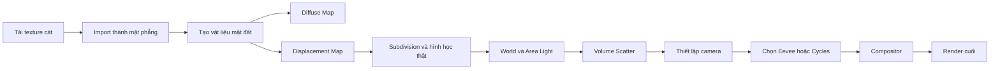
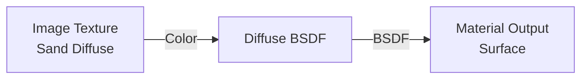
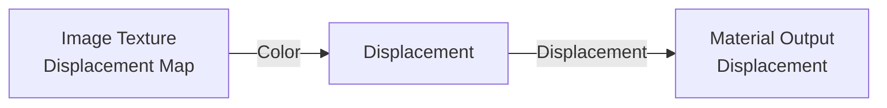
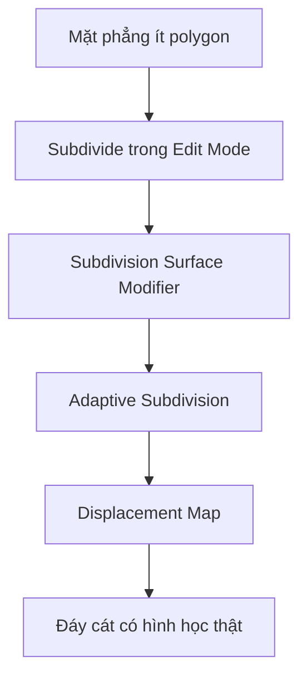
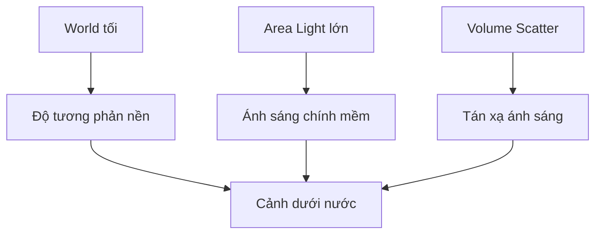
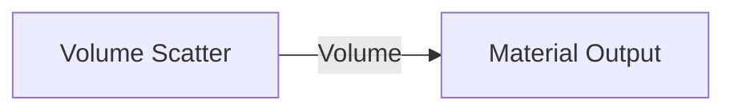
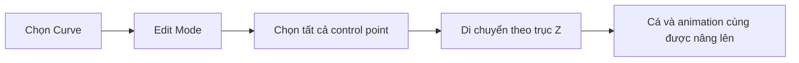
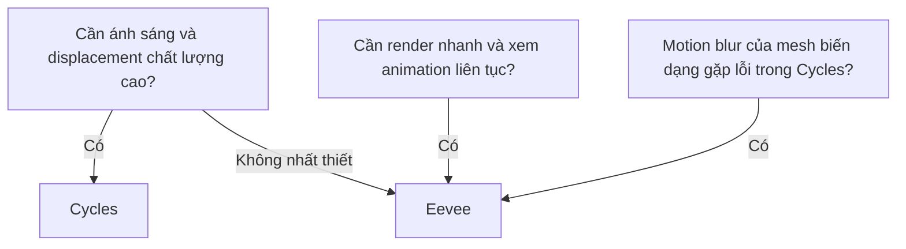
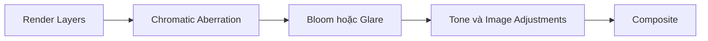

# 08 — Texturing & Lighting

| Thuộc tính       | Nội dung                                                               |
| ---------------- | ---------------------------------------------------------------------- |
| **Video**        | Learn How to Animate and Render a Fish in Blender! (Beginner Friendly) |
| **Chương**       | Texturing & Lighting                                                   |
| **Thời điểm**    | `02:02:13`                                                             |
| **Thời lượng**   | `32:04`                                                                |
| **Chủ đề chính** | Dựng đáy đại dương, displacement, ánh sáng thể tích và hậu kỳ hình ảnh |

---

## 1. Mục tiêu bài học

Sau chương này, bạn có thể:

* Tạo một mặt đáy đại dương từ texture cát có sẵn.
* Sử dụng **Diffuse Map** và **Displacement Map** trong Shader Editor.
* Tạo hình học gồ ghề thật cho mặt đất bằng subdivision và displacement.
* Thiết lập ánh sáng dịu, có độ tương phản phù hợp với cảnh dưới nước.
* Tạo sương và độ sâu không gian bằng **Volume Scatter**.
* Bố trí camera để quan sát chuyển động của cá rõ ràng hơn.
* So sánh nhiều phiên bản render bằng **Render Slots**.
* Thêm quang sai màu, bloom và độ sắc nét trong **Compositor**.
* Lựa chọn giữa **Cycles** và **Eevee** dựa trên chất lượng hình ảnh và motion blur.

> [!IMPORTANT]
> Trọng tâm thực tế của chương này không phải là tạo shader vảy cá procedural. Nội dung chủ yếu tập trung vào việc xây dựng **môi trường dưới nước** xung quanh cá.

---

## 2. Tổng quan quy trình



Quy trình có thể chia thành bốn nhóm công việc:

1. **Dựng môi trường:** tạo đáy cát và displacement.
2. **Tạo không khí:** ánh sáng, World và thể tích dưới nước.
3. **Bố cục:** điều chỉnh camera và vị trí đường bơi.
4. **Hoàn thiện:** motion blur, quang sai màu, bloom và sharpening.

---

# Phần I — Tạo đáy đại dương

## 3. Tải texture cát

Tác giả sử dụng texture cát từ **Poly Haven**, một thư viện asset miễn phí phù hợp cho các dự án Blender.

Các texture cần tải:

* **Diffuse Map:** chứa màu sắc bề mặt cát.
* **Displacement Map:** chứa thông tin độ cao để làm bề mặt lồi lõm.
* Độ phân giải được sử dụng trong video: khoảng `4K`.
* Định dạng được ưu tiên: `EXR` để giữ dải giá trị sáng tốt hơn.

Khi chọn texture, cần tránh những hình ảnh có:

* Cỏ mọc trên bề mặt.
* Dấu chân hoặc vật thể nhân tạo.
* Những chi tiết phẳng nhưng đáng lẽ phải có hình học thật.
* Hoa văn dễ nhận ra khi texture bị lặp.

Ví dụ, một vùng cỏ nằm trực tiếp trong ảnh diffuse sẽ trông giả khi camera đến gần vì cỏ không có chiều sâu hoặc hình học riêng.

---

## 4. Import texture thành mặt phẳng

Thay vì tạo một Plane rồi tự điều chỉnh tỉ lệ, tác giả import ảnh trực tiếp dưới dạng mặt phẳng:

```text
Shift + A
└── Image
    └── Images as Planes
```

Cách này có lợi ở chỗ:

* Tự giữ đúng tỉ lệ chiều rộng và chiều cao của ảnh.
* Không cần tính toán lại aspect ratio.
* Texture được gán sẵn vào material.
* Phù hợp khi làm việc với ảnh có tỉ lệ đặc biệt như `16:9`.

Sau khi import:

1. Chọn mặt phẳng.
2. Nhấn `S` để tăng kích thước.
3. Đổi tên object thành tên dễ hiểu, chẳng hạn:

```text
Ground
Ocean_Floor
Sand_Ground
```

4. Đổi tên material tương ứng:

```text
MAT_Sand_Ground
```

Việc đặt tên rõ ràng giúp tránh nhầm lẫn khi scene có thêm nhiều object, vật liệu và texture.

---

## 5. Cấu trúc vật liệu mặt đất

Trong video, tác giả thay **Principled BSDF** bằng **Diffuse BSDF** để giữ node đơn giản.

### Sơ đồ node phần màu



Cách kết nối:

```text
Image Texture: Color
        ↓
Diffuse BSDF: Color
        ↓
Material Output: Surface
```

### Vì sao dùng Diffuse BSDF?

`Diffuse BSDF` chỉ tập trung vào phản xạ khuếch tán nên:

* Dễ hiểu đối với người mới.
* Ít tham số cần điều chỉnh.
* Phù hợp với bề mặt cát mờ.
* Tránh những highlight bóng không mong muốn.

Tuy nhiên, trong dự án thực tế, vẫn có thể dùng **Principled BSDF** nếu cần kiểm soát thêm:

* Roughness.
* Specular.
* Normal.
* Subsurface.
* Coat.

---

## 6. Thêm Displacement Map

Diffuse Map chỉ làm thay đổi màu sắc. Để bề mặt cát thật sự gồ ghề, cần thêm Displacement Map.

### Sơ đồ node displacement



Thiết lập đề xuất:

| Thiết lập       | Giá trị                         |
| --------------- | ------------------------------- |
| **Color Space** | Non-Color                       |
| **Projection**  | Flat                            |
| **Extension**   | Repeat                          |
| **Midlevel**    | Khoảng `0.5`                    |
| **Scale**       | Điều chỉnh theo kích thước cảnh |

> [!NOTE]
> Displacement Map là dữ liệu độ cao, không phải dữ liệu màu. Vì vậy, nên đặt **Color Space = Non-Color** để Blender không áp dụng biến đổi màu lên dữ liệu này.

### Kết nối node

```text
Image Texture: Color
        ↓
Displacement: Height
        ↓
Material Output: Displacement
```

Nếu displacement quá mạnh, đáy cát sẽ trông giống núi đá. Có thể giảm bằng cách:

* Giảm `Scale` trong node Displacement.
* Chia giá trị hiện tại cho hai:

```text
Giá trị hiện tại / 2
```

Blender hỗ trợ nhập phép toán trực tiếp vào ô giá trị.

Ví dụ:

```text
0.5 / 2
```

Kết quả sẽ trở thành:

```text
0.25
```

---

# Phần II — Tạo hình học cho mặt đất

## 7. Subdivide mặt phẳng

Displacement cần đủ số lượng vertex để thay đổi hình dạng bề mặt.

Thực hiện:

1. Chọn mặt phẳng cát.
2. Nhấn `Tab` để vào Edit Mode.
3. Nhấn `A` để chọn toàn bộ.
4. Nhấp chuột phải.
5. Chọn **Subdivide**.
6. Đặt số lần chia khoảng `20–30`.

```text
Ground Plane
    ↓
Edit Mode
    ↓
Select All
    ↓
Subdivide 20–30 lần
```

Không nên chia quá nhiều ngay từ đầu vì có thể:

* Làm scene nặng.
* Tăng thời gian render.
* Tiêu tốn RAM và VRAM.
* Làm Blender phản hồi chậm.

---

## 8. Subdivision Surface và Adaptive Subdivision

Sau khi chia mặt phẳng cơ bản, thêm **Subdivision Surface Modifier**.

```text
Modifiers
└── Add Modifier
    └── Subdivision Surface
```

Nếu dùng Cycles, có thể bật **Adaptive Subdivision** để Blender chỉ tăng chi tiết ở những vùng camera nhìn thấy.

### Quy trình



Adaptive Subdivision hoạt động dựa trên kích thước pixel:

* Vùng gần camera được chia nhỏ nhiều hơn.
* Vùng xa camera được chia ít hơn.
* Giảm lượng hình học không cần thiết.
* Tạo displacement chi tiết hơn ở vùng quan trọng.

Giá trị có thể bắt đầu thử:

| Tham số              | Giá trị thử nghiệm |
| -------------------- | -----------------: |
| Viewport subdivision |              `0–1` |
| Render subdivision   |              `1–2` |
| Dicing/Pixel size    |    Khoảng `1–2 px` |

Các giá trị này phụ thuộc vào:

* Độ phân giải render.
* Khoảng cách camera.
* Kích thước mặt đất.
* Mức độ chi tiết của displacement.

---

## 9. Chọn chế độ Displacement

Trong phần cài đặt material, Blender thường cung cấp các chế độ:

* **Bump Only**
* **Displacement Only**
* **Displacement and Bump**

### So sánh

| Chế độ                    | Đặc điểm                                          |
| ------------------------- | ------------------------------------------------- |
| **Bump Only**             | Chỉ giả lập ánh sáng, không làm thay đổi hình học |
| **Displacement Only**     | Thay đổi hình học thật                            |
| **Displacement and Bump** | Kết hợp hình học lớn và chi tiết nhỏ              |

Đối với mặt đáy đại dương, có thể thử:

```text
Displacement and Bump
```

Nếu kết quả quá nặng hoặc không ổn định, chuyển sang:

```text
Displacement Only
```

Sau cùng, nhấp chuột phải vào mặt đất và chọn:

```text
Shade Smooth
```

Nếu không bật Shade Smooth, bề mặt sẽ lộ các mặt polygon và trông giống đồ họa low-poly.

---

## 10. Điều chỉnh UV và lặp texture

Khi phóng to mặt phẳng, texture có thể bị kéo giãn hoặc chỉ xuất hiện trên một phần bề mặt.

Để tăng mật độ texture:

1. Chọn mặt đất.
2. Chuyển một cửa sổ sang **UV Editor**.
3. Nhấn `Tab` để vào Edit Mode.
4. Nhấn `A` chọn toàn bộ UV.
5. Nhấn `S` để tăng kích thước UV island.

Ví dụ:

```text
S → 2 → Enter
```

Khi UV lớn hơn vùng ảnh `0–1`, texture cần được phép lặp.

Trong cả hai node Image Texture:

```text
Extension: Repeat
```

Cần đặt `Repeat` cho:

* Diffuse Map.
* Displacement Map.

Nếu một texture để `Repeat` còn texture kia để `Clip`, màu sắc và displacement sẽ không khớp nhau.

### Sơ đồ UV

```text
UV nhỏ
┌───────────────┐
│ Một ảnh cát   │
│ phủ toàn sàn  │
└───────────────┘

UV phóng lớn
┌───────┬───────┬───────┐
│ Cát   │ Cát   │ Cát   │
├───────┼───────┼───────┤
│ Cát   │ Cát   │ Cát   │
└───────┴───────┴───────┘
```

Phóng UV giúp texture lặp nhiều hơn, làm các chi tiết cát nhỏ lại và có cảm giác độ phân giải cao hơn.

---

# Phần III — Ánh sáng dưới nước

## 11. Thêm Area Light

Tác giả sử dụng **Area Light** làm nguồn sáng chính.

```text
Shift + A
└── Light
    └── Area
```

Sau khi thêm:

1. Nhấn `G`, sau đó `Z` để đưa đèn lên phía trên.
2. Tăng công suất ánh sáng.
3. Tăng kích thước Area Light để bóng mềm hơn.
4. Thay đổi vị trí và góc chiếu để tạo chiều sâu.

### Ảnh hưởng của kích thước Area Light

```text
Area Light nhỏ
→ bóng sắc
→ tương phản mạnh
→ cảm giác ánh sáng nhân tạo

Area Light lớn
→ bóng mềm
→ ánh sáng khuếch tán
→ phù hợp môi trường dưới nước
```

Trong video, công suất được thử ở các mức khá cao, từ khoảng `2.000` đến `17.000`, đặc biệt sau khi thêm thể tích.

> [!WARNING]
> Công suất ánh sáng phụ thuộc hoàn toàn vào kích thước scene, Color Management, engine và mật độ volume. Không nên sao chép máy móc một con số cố định.

---

## 12. Thiết lập World tối

Trong **World Properties**, tác giả giảm ánh sáng nền để tạo độ tương phản lớn hơn.

```text
World Properties
└── Surface
    └── Strength: 0 hoặc rất thấp
```

Kết quả:

* Phần nền trở nên tối.
* Mặt đất chỉ được chiếu bởi nguồn sáng chính.
* Cá nổi bật hơn.
* Cảnh có cảm giác sâu và bí ẩn.
* Không gian ngoài vùng đèn giống đáy đại dương vô tận.

Tuy nhiên, không nhất thiết phải dùng màu đen tuyệt đối. Có thể sử dụng:

```text
Xanh navy rất đậm
Xanh lục lam đậm
Xanh xám gần đen
```

Điều này giúp cảnh vẫn giữ được sắc thái dưới nước.

---

## 13. Mô hình ánh sáng đơn giản



Một thiết lập tối giản có thể gồm:

```text
World tối
    +
Một Area Light lớn phía trên
    +
Volume Scatter mật độ thấp
```

Không cần thêm quá nhiều đèn nếu mục tiêu là tạo cảnh đơn giản, có chiều sâu và tập trung vào chuyển động của cá.

---

# Phần IV — Tạo thể tích dưới nước

## 14. Tạo Volume Cube

Để tạo cảm giác nước có mật độ và ánh sáng bị tán xạ, tác giả sử dụng một khối Cube bao quanh toàn bộ scene.

### Các bước thực hiện

1. Thêm Cube:

```text
Shift + A
└── Mesh
    └── Cube
```

2. Đổi tên:

```text
Volume_Cube
```

3. Nhấn `S` để phóng lớn Cube, bảo đảm nó bao phủ:

* Cá.
* Đường bơi.
* Mặt đất.
* Camera hoặc vùng camera nhìn thấy.
* Nguồn sáng cần tác động lên thể tích.

4. Tạo material mới:

```text
MAT_Underwater_Volume
```

5. Xóa kết nối Surface.
6. Thêm node **Volume Scatter**.
7. Kết nối vào cổng **Volume** của Material Output.

### Sơ đồ node



```text
Volume Scatter: Volume
        ↓
Material Output: Volume
```

Không kết nối Volume Scatter vào cổng `Surface`.

---

## 15. Điều chỉnh mật độ Volume

Khi mới thêm, sương thường rất dày và che gần như toàn bộ con cá.

Cần giảm:

```text
Volume Scatter → Density
```

Mật độ nên đủ để:

* Nhìn thấy tia sáng.
* Tạo khoảng cách giữa camera và chủ thể.
* Làm những vùng xa mờ hơn.
* Vẫn giữ được hình dáng và màu sắc của cá.

### Mật độ quá thấp

```text
Cảnh quá trong
→ giống không khí hơn là nước
→ thiếu chiều sâu
```

### Mật độ quá cao

```text
Cá bị che khuất
→ màu sắc bị mất
→ render nhiều nhiễu
→ cần tăng đèn quá mạnh
```

Nguyên tắc là chỉ sử dụng lượng volume vừa đủ để người xem cảm nhận được môi trường nước.

---

## 16. Quản lý Volume Cube trong viewport

Volume Cube rất lớn nên thường cản trở việc chọn cá hoặc các object bên trong.

Có hai cách xử lý.

### Cách 1 — Hiển thị dạng Wire

Chọn Volume Cube:

```text
Object Properties
└── Viewport Display
    └── Display As: Wire
```

Cube chỉ hiển thị dưới dạng khung dây, giúp quan sát các object bên trong dễ hơn.

### Cách 2 — Tắt khả năng chọn

Trong Outliner:

1. Bật cột **Selectable**.
2. Tắt biểu tượng chọn của Volume Cube.

Kết quả:

* Không vô tình chọn Cube trong viewport.
* Vẫn có thể chọn Cube từ Outliner khi cần chỉnh material.
* Dễ thao tác với cá, camera và đường bơi hơn.

---

# Phần V — Điều chỉnh vị trí cá và đường bơi

## 17. Nâng đường bơi khỏi mặt đất

Sau khi thêm đáy cát, cá có thể:

* Xuyên vào mặt đất.
* Bị displacement che khuất.
* Quẫy đuôi quá gần cát.
* Tạo cảm giác cần có mô phỏng bụi cát.

Thay vì di chuyển từng keyframe, tác giả di chuyển toàn bộ các điểm của đường dẫn.

### Thực hiện

1. Chọn Curve dùng làm quỹ đạo.
2. Nhấn `Tab` để vào Edit Mode.
3. Nhấn `A` để chọn tất cả control point.
4. Nhấn:

```text
G → Z
```

5. Di chuyển toàn bộ quỹ đạo lên cao.



Ưu điểm:

* Không phá keyframe animation.
* Không thay đổi timing.
* Giữ nguyên quan hệ giữa cá và đường dẫn.
* Không cần di chuyển riêng từng object.

Nên giữ cá cách mặt đất một khoảng đủ lớn để đuôi không quét trực tiếp vào cát.

---

## 18. Hạn chế tương tác không cần thiết

Nếu cá bơi quá sát đáy, về mặt vật lý, chuyển động đuôi có thể:

* Khuấy cát.
* Tạo bụi.
* Làm cát chuyển động.
* Tạo bóng và hạt lơ lửng.

Đây là các hiệu ứng tốn nhiều công sức mô phỏng.

Một giải pháp sản xuất hợp lý là:

```text
Cho cá nhìn thấy đáy
nhưng
không để cá tương tác trực tiếp với đáy
```

Đây là ví dụ về việc đơn giản hóa scene mà vẫn giữ được cảm giác chân thực.

---

# Phần VI — Thiết lập camera

## 19. Căn camera theo góc nhìn hiện tại

Sau khi tìm được góc nhìn phù hợp trong viewport:

```text
Ctrl + Alt + Numpad 0
```

Lệnh này căn camera đang hoạt động theo góc nhìn hiện tại.

Nếu không có bàn phím số, có thể sử dụng menu:

```text
View
└── Align View
    └── Align Active Camera to View
```

Để xem qua camera:

```text
Numpad 0
```

Hoặc nhấn biểu tượng Camera trong viewport.

---

## 20. Di chuyển camera theo trục cục bộ

Để đưa camera tiến hoặc lùi theo hướng nó đang nhìn:

```text
G → Z → Z
```

Nhấn `Z` hai lần giúp chuyển từ trục toàn cục sang trục cục bộ của camera.

Hiệu ứng này gần giống chuyển động **dolly**:

```text
Camera tiến tới chủ thể
hoặc
Camera lùi khỏi chủ thể
```

Có thể kết hợp:

* `G` để di chuyển.
* `R` để xoay.
* `R → X → X` để xoay theo trục cục bộ.
* Điều chỉnh **Focal Length** trong Camera Properties.

---

## 21. Focal Length và phối cảnh

Hai cách tạo khung hình gần hơn:

### Cách 1 — Đưa camera lại gần

```text
Camera gần
→ phối cảnh mạnh
→ đầu và đuôi cá có chênh lệch kích thước rõ
→ cảm giác năng động
```

### Cách 2 — Đưa camera ra xa và tăng tiêu cự

```text
Camera xa + tiêu cự lớn
→ phối cảnh nén
→ hình dáng cá ít bị méo
→ cảm giác điện ảnh hơn
```

Với cá có thân cao và dẹt như Angelfish, tiêu cự dài vừa phải có thể giúp giữ hình dáng thân ổn định hơn.

---

## 22. Chọn góc quan sát chuyển động

Tác giả nhận thấy chuyển động quay của cá có thể trông hơi cứng khi nhìn ngang nhưng tự nhiên hơn khi quan sát từ trên cao.

Điều này cho thấy chất lượng animation phụ thuộc cả vào góc camera.

```text
Cùng một animation
├── Góc ngang: dễ lộ thân bị xoay cứng
├── Góc chính diện: dễ lộ thiếu uốn thân
└── Góc trên cao: quỹ đạo và chuyển động tổng thể tự nhiên hơn
```

Trước khi sửa rig hoặc animation, cần kiểm tra xem vấn đề có thực sự nằm ở chuyển động hay chỉ nằm ở góc nhìn.

---

## 23. Tạo viewport camera riêng

Để luôn theo dõi kết quả qua camera trong khi vẫn chỉnh scene, có thể chia viewport thành hai phần:

```text
┌──────────────────────┬──────────────────────┐
│ Viewport thao tác    │ Camera Preview       │
│                      │                      │
│ Solid hoặc Material  │ Rendered View        │
│ chỉnh object         │ xem kết quả cuối     │
└──────────────────────┴──────────────────────┘
```

Trong Camera Preview:

* Chuyển sang Rendered View.
* Bật Camera View.
* Tắt Overlay.
* Tắt Gizmo.
* Ẩn Toolbar bằng `T`.
* Có thể ẩn Tool Settings trên Header.

Cách bố trí này giúp xem ngay tác động của:

* Ánh sáng.
* Volume.
* Camera.
* Material.
* Compositor.
* Vị trí chuyển động.

> [!NOTE]
> `Ctrl + W` được dùng để chia cửa sổ trong video có thể là phím tắt tùy chỉnh của tác giả. Trong Blender mặc định, bạn có thể kéo từ góc của một vùng Editor để chia màn hình.

---

# Phần VII — Eevee và Cycles

## 24. Làm việc trong Cycles

Cycles có ưu điểm:

* Bóng mềm tự nhiên.
* Ánh sáng chân thực.
* Volume có chất lượng cao.
* Displacement và adaptive subdivision mạnh.
* Phản xạ và tán xạ vật lý tốt hơn.

Tác giả sử dụng Cycles trong quá trình tinh chỉnh để hình dung chất lượng ánh sáng tốt nhất có thể đạt được.

---

## 25. Render cuối bằng Eevee

Trong dự án của video, Eevee được cân nhắc cho render cuối vì:

* Render nhanh hơn.
* Preview gần thời gian thực.
* Motion blur của chuyển động biến dạng cá hoạt động phù hợp hơn.
* Dễ kiểm tra animation liên tục.
* Chất lượng hình ảnh đã khá gần Cycles trong scene này.



> [!WARNING]
> Khả năng motion blur có thể thay đổi giữa các phiên bản Blender. Cần kiểm tra trực tiếp bằng engine và phiên bản được dùng để render dự án.

---

## 26. Kiểm tra Motion Blur

Motion blur giúp:

* Chuyển động đuôi bớt giật.
* Vây trông mềm hơn.
* Cá có cảm giác di chuyển nhanh.
* Giảm cảm giác các frame đứng riêng lẻ.

Tuy nhiên, motion blur không sửa được animation xấu. Nếu thân cá quay quá cứng, vẫn cần:

* Giảm góc xoay.
* Làm mượt F-Curve.
* Tăng uốn thân.
* Thêm độ trễ cho đuôi.
* Điều chỉnh quỹ đạo.

Motion blur chỉ nên là lớp hoàn thiện cuối.

---

# Phần VIII — So sánh kết quả render

## 27. Sử dụng Render Slots

Blender cho phép lưu tạm nhiều kết quả render trong các **Render Slots**.

Ví dụ:

| Render Slot | Phiên bản                           |
| ----------: | ----------------------------------- |
|         `1` | Displacement ban đầu                |
|         `2` | Giảm displacement còn một nửa       |
|         `3` | UV được phóng lớn                   |
|         `4` | Texture đã bật Repeat               |
|         `5` | Slot trống cho lần render tiếp theo |

Sau mỗi thay đổi:

1. Chọn một Render Slot mới.
2. Render ảnh.
3. Nhấn số tương ứng để chuyển giữa các kết quả.
4. So sánh trực tiếp.

```text
Slot 1 ↔ Slot 2 ↔ Slot 3 ↔ Slot 4
```

Cách này hiệu quả hơn việc dựa vào trí nhớ để đánh giá:

* Displacement nào tự nhiên hơn.
* Texture có đủ chi tiết không.
* Ánh sáng nào đẹp hơn.
* Volume có quá dày không.

Trước khi quay lại viewport, nên chọn một slot trống để lần render tiếp theo không ghi đè kết quả cần so sánh.

---

# Phần IX — Hậu kỳ bằng Compositor

## 28. Bật Compositor

Chuyển một vùng Editor sang:

```text
Compositor
```

Sau đó:

1. Nhấn **New** hoặc **Use Nodes**.
2. Bật compositing trong viewport nếu phiên bản Blender hỗ trợ.
3. Kết nối các node hiệu ứng giữa Render Layers và Composite.

### Chuỗi hậu kỳ tổng quát



---

## 29. Quang sai màu

Quang sai màu làm các kênh đỏ, xanh lá và xanh lam lệch nhẹ ở rìa hình ảnh.

Trong cảnh dưới nước, hiệu ứng này có thể gợi cảm giác camera đang quay qua:

* Kính bảo vệ.
* Housing chống nước.
* Lớp nước dày.
* Hệ thống thấu kính không hoàn hảo.

Có thể sử dụng node quang sai màu hoặc **Lens Distortion/Dispersion**, tùy phiên bản Blender.

Giá trị trong video được thử khoảng:

```text
0.07–0.08
```

Hiệu ứng phải rất nhẹ.

### Quang sai quá mạnh

* Viền màu xuất hiện rõ quanh cá.
* Hình ảnh trông giống lỗi kỹ thuật.
* Mất độ sắc nét.
* Gây khó chịu khi xem animation.

Nguyên tắc:

```text
Người xem cảm nhận được hiệu ứng
nhưng
không nên chú ý trực tiếp đến hiệu ứng
```

---

## 30. Bloom hoặc Glare

Bloom làm các vùng sáng lan nhẹ ra xung quanh.

Hiệu ứng này phù hợp với:

* Ánh sáng xuyên qua nước.
* Highlight trên thân cá.
* Các vùng phát sáng.
* Không khí mờ và có độ ẩm.

Trong video, cường độ được giữ khá thấp, khoảng:

```text
0.12
```

Cần điều chỉnh thêm:

* Threshold.
* Size.
* Strength.
* Mix.

Không nên để bloom phủ toàn bộ hình vì sẽ làm scene bị đục và mất chi tiết.

---

## 31. Tone và Image Adjustments

Sau volume, motion blur và bloom, hình ảnh có thể trở nên mềm.

Tác giả thêm một lượng nhỏ các điều chỉnh như:

* Color.
* Clarity.
* Detail.
* Sharpen.

Giá trị thử nghiệm:

```text
Khoảng 0.1 cho mỗi hiệu ứng
```

Mục tiêu không phải làm hình ảnh sắc gắt, mà chỉ lấy lại khoảng `5%` cảm giác rõ nét bị mất do:

* Volume.
* Motion blur.
* Bloom.
* Nén video.
* Tán xạ ánh sáng.

### Nguyên tắc hậu kỳ

```text
Hậu kỳ tốt
→ làm hình ảnh hoàn thiện hơn
→ không làm người xem nhận ra đang có hiệu ứng

Hậu kỳ quá mạnh
→ viền sắc
→ màu bão hòa quá mức
→ bloom trắng xóa
→ hình ảnh giả
```

---

# Phần X — Sơ đồ node tổng hợp

## 32. Material đáy cát

```text
┌──────────────────────┐
│ Image Texture        │
│ Sand Diffuse         │
│ Color Space: sRGB    │
└──────────┬───────────┘
           │ Color
           ▼
┌──────────────────────┐
│ Diffuse BSDF         │
└──────────┬───────────┘
           │ BSDF
           ▼
┌──────────────────────┐
│ Material Output      │
│ Surface              │
└──────────────────────┘


┌──────────────────────────┐
│ Image Texture            │
│ Sand Displacement        │
│ Color Space: Non-Color   │
│ Extension: Repeat        │
└────────────┬─────────────┘
             │ Color
             ▼
┌──────────────────────────┐
│ Displacement             │
│ Midlevel: 0.5            │
│ Scale: tùy chỉnh         │
└────────────┬─────────────┘
             │ Displacement
             ▼
┌──────────────────────────┐
│ Material Output          │
│ Displacement             │
└──────────────────────────┘
```

---

## 33. Material thể tích

```text
┌──────────────────────────┐
│ Volume Scatter           │
│ Density: thấp            │
└────────────┬─────────────┘
             │ Volume
             ▼
┌──────────────────────────┐
│ Material Output          │
│ Volume                   │
└──────────────────────────┘
```

---

## 34. Compositor

```text
┌───────────────┐
│ Render Layers │
└───────┬───────┘
        ▼
┌────────────────────────┐
│ Chromatic Aberration   │
│ Mức độ rất nhẹ         │
└───────────┬────────────┘
            ▼
┌────────────────────────┐
│ Bloom / Glare          │
│ Strength thấp          │
└───────────┬────────────┘
            ▼
┌────────────────────────┐
│ Tone / Image Adjust    │
│ Clarity, Detail 0.1    │
│ Sharpen 0.1            │
└───────────┬────────────┘
            ▼
┌────────────────────────┐
│ Composite              │
└────────────────────────┘
```

---

# Phần XI — Phím tắt và công cụ

## 35. Bảng phím tắt

| Thao tác                     | Phím tắt                |
| ---------------------------- | ----------------------- |
| Thêm object hoặc node        | `Shift + A`             |
| Phóng to hoặc thu nhỏ object | `S`                     |
| Di chuyển object             | `G`                     |
| Di chuyển theo trục Z        | `G`, `Z`                |
| Di chuyển theo trục Z cục bộ | `G`, `Z`, `Z`           |
| Xoay object                  | `R`                     |
| Vào hoặc thoát Edit Mode     | `Tab`                   |
| Chọn tất cả                  | `A`                     |
| Nhân đôi node hoặc object    | `Shift + D`             |
| Đổi tên object               | `F2`                    |
| Xóa node hoặc object         | `X`                     |
| Camera View                  | `Numpad 0`              |
| Căn camera theo viewport     | `Ctrl + Alt + Numpad 0` |
| Ẩn hoặc hiện Toolbar         | `T`                     |
| Render ảnh                   | `F12`                   |
| Xem kết quả render           | `F11`                   |
| Chọn Rendered View           | `Z` → Rendered          |

> [!NOTE]
> Một số phím tắt trong video có thể đã được tác giả tùy chỉnh và không hoàn toàn trùng với Blender mặc định.

---

# Phần XII — Lỗi thường gặp

## 36. Texture bị kéo giãn

**Nguyên nhân:**

* Scale object chưa được Apply.
* UV không đúng tỉ lệ.
* Mặt phẳng bị phóng lớn nhưng UV không được điều chỉnh.

**Cách xử lý:**

```text
Ctrl + A → Apply Scale
```

Sau đó kiểm tra lại UV trong UV Editor.

---

## 37. Texture chỉ xuất hiện một lần

**Nguyên nhân:**

Image Texture đang để:

```text
Extension: Clip
```

**Cách xử lý:**

Chuyển cả Diffuse Map và Displacement Map sang:

```text
Extension: Repeat
```

---

## 38. Displacement không hoạt động

Kiểm tra:

* Mặt phẳng đã đủ vertex chưa?
* Đã thêm Subdivision Surface chưa?
* Displacement đã nối vào Material Output chưa?
* Material Settings có đang để Bump Only không?
* Render Engine có hỗ trợ thiết lập đang dùng không?
* Displacement Map đã để Non-Color chưa?

---

## 39. Bề mặt bị low-poly

**Nguyên nhân:**

* Thiếu subdivision.
* Chưa bật Shade Smooth.
* Render subdivision quá thấp.

**Cách xử lý:**

```text
Right Click → Shade Smooth
```

Sau đó tăng subdivision một cách hợp lý.

---

## 40. Displacement quá mạnh

**Biểu hiện:**

* Cát giống đá nhọn.
* Mặt đất biến dạng quá sâu.
* Cá có vẻ quá nhỏ so với địa hình.

**Cách xử lý:**

* Giảm Scale của node Displacement.
* Chia giá trị hiện tại cho `2`.
* Kiểm tra lại Midlevel.
* Kiểm tra Color Space của bản đồ.

---

## 41. Volume che mất cá

**Nguyên nhân:**

* Density quá cao.
* Đèn quá yếu.
* Camera nhìn qua vùng volume quá dài.
* World quá tối.

**Cách xử lý:**

* Giảm Density.
* Đưa đèn gần chủ thể hơn.
* Tăng kích thước Area Light.
* Giảm khoảng cách camera.
* Thêm một nguồn sáng phụ rất nhẹ nếu cần.

---

## 42. Khó chọn object bên trong Volume Cube

**Cách xử lý:**

```text
Viewport Display → Display As: Wire
```

Hoặc tắt khả năng chọn của Volume Cube trong Outliner.

---

## 43. Cá xuyên vào đáy cát

**Cách xử lý tốt nhất:**

* Chọn đường Curve.
* Vào Edit Mode.
* Chọn tất cả control point.
* Nâng toàn bộ quỹ đạo theo trục Z.

Không nên sửa từng keyframe nếu toàn bộ animation đã hoạt động đúng.

---

## 44. Cá quay quá cứng

Đây không phải lỗi lighting nhưng trở nên rõ hơn sau khi thêm camera và render.

Có thể xử lý bằng cách:

* Giảm mức nghiêng của cá theo quỹ đạo.
* Làm quỹ đạo bớt tròn.
* Tạo các đoạn thẳng và đường cong chuyển tiếp dài hơn.
* Giảm Tilt của Curve.
* Làm mượt F-Curve.
* Tăng uốn thân khi đổi hướng.
* Chọn góc camera che bớt phần chuyển động chưa hoàn thiện.

---

## 45. Hậu kỳ quá mạnh

### Biểu hiện

* Viền đỏ, xanh quá rõ.
* Highlight trắng xóa.
* Hình ảnh có viền sharpen.
* Màu cá quá bão hòa.
* Volume và bloom làm mất chi tiết.

### Cách xử lý

Giảm lần lượt:

```text
Chromatic Aberration
Bloom Strength
Clarity
Detail
Sharpen
Saturation
```

Mỗi hiệu ứng chỉ nên đóng góp một lượng nhỏ.

---

# Phần XIII — Checklist thực hành

## 46. Mặt đất và texture

* [ ] Đã chọn texture cát không có chi tiết gây giả như cỏ hoặc dấu chân.
* [ ] Đã tải Diffuse Map và Displacement Map.
* [ ] Đã import hoặc tạo mặt phẳng đáy.
* [ ] Đã đặt tên object và material rõ ràng.
* [ ] Đã nối Diffuse Map vào shader.
* [ ] Đã đặt Displacement Map thành Non-Color.
* [ ] Đã nối Displacement Map vào Material Output.
* [ ] Đã bật Repeat cho cả hai texture.
* [ ] Đã điều chỉnh UV để texture không bị kéo giãn.

## 47. Hình học

* [ ] Mặt đất có đủ subdivision.
* [ ] Đã thêm Subdivision Surface Modifier.
* [ ] Đã bật Adaptive Subdivision nếu dùng Cycles.
* [ ] Đã chọn đúng chế độ displacement.
* [ ] Đã bật Shade Smooth.
* [ ] Displacement không quá mạnh.

## 48. Ánh sáng và môi trường

* [ ] Đã thêm Area Light.
* [ ] Kích thước đèn đủ lớn để tạo bóng mềm.
* [ ] World đã được giảm sáng hoặc đổi sang màu tối.
* [ ] Ánh sáng vẫn làm cá nổi bật khỏi nền.
* [ ] Đã thêm Volume Cube.
* [ ] Volume Scatter được nối đúng vào cổng Volume.
* [ ] Density đủ thấp để vẫn nhìn rõ cá.
* [ ] Volume Cube được đặt dạng Wire hoặc tắt khả năng chọn.

## 49. Camera và animation

* [ ] Cá không xuyên vào mặt đất.
* [ ] Đường bơi đã được nâng lên nếu cần.
* [ ] Camera đã được căn theo góc nhìn phù hợp.
* [ ] Focal Length không làm biến dạng cá quá mạnh.
* [ ] Đã thử ít nhất một góc nhìn ngang và một góc nhìn trên cao.
* [ ] Có một viewport riêng để xem Camera Preview.
* [ ] Đã kiểm tra motion blur bằng engine render dự kiến.

## 50. Hậu kỳ

* [ ] Đã dùng Render Slots để so sánh các phiên bản.
* [ ] Quang sai màu chỉ xuất hiện rất nhẹ.
* [ ] Bloom không làm cháy vùng sáng.
* [ ] Sharpen không tạo viền giả.
* [ ] Màu sắc vẫn phù hợp môi trường dưới nước.
* [ ] Đã xem thử một đoạn animation, không chỉ một frame tĩnh.

---

# 51. Tóm tắt chương

Trong chương này, cảnh cá được chuyển từ một animation trên nền trống thành một không gian dưới nước hoàn chỉnh.

Quy trình cốt lõi gồm:

```text
Texture cát
    ↓
Diffuse và Displacement
    ↓
Subdivision và hình học đáy biển
    ↓
Area Light và World tối
    ↓
Volume Scatter
    ↓
Camera và bố cục
    ↓
Eevee hoặc Cycles
    ↓
Compositor
    ↓
Render cuối
```

Ba yếu tố ảnh hưởng mạnh nhất đến chất lượng cảnh là:

1. **Displacement vừa phải:** đủ tạo chiều sâu nhưng không biến đáy cát thành núi đá.
2. **Volume có kiểm soát:** tạo không khí dưới nước mà không che mất chủ thể.
3. **Camera phù hợp với animation:** góc nhìn tốt có thể làm chuyển động trông tự nhiên hơn đáng kể.

Phần texturing, lighting và compositing không chỉ làm hình ảnh đẹp hơn. Chúng còn giúp phát hiện những vấn đề trước đó trong animation, chẳng hạn cá quay quá cứng, quỹ đạo quá tròn hoặc thân cá đi quá sát mặt đất. Vì vậy, đây cũng là giai đoạn cần tiếp tục tinh chỉnh animation trước khi render cuối.
