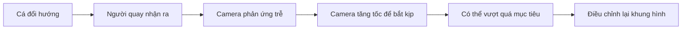
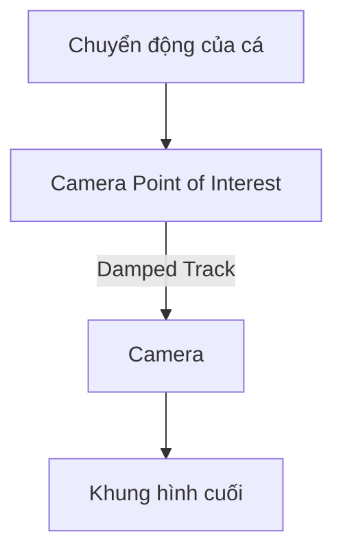
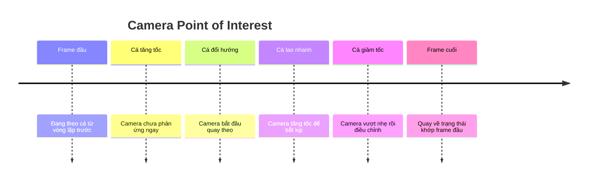
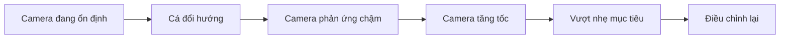
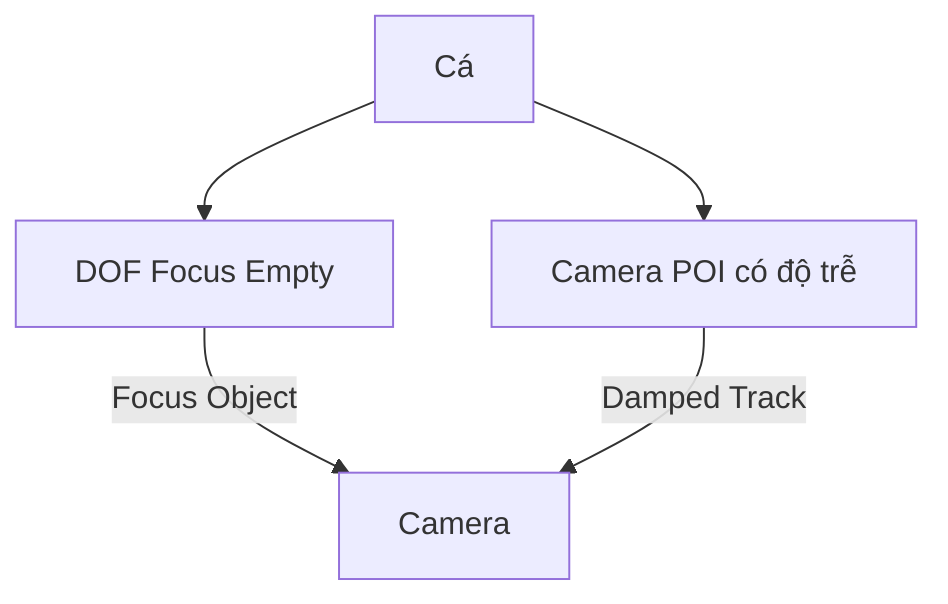

# 09 — Camera Movement

| Thuộc tính       | Nội dung                                                                                                     |
| ---------------- | ------------------------------------------------------------------------------------------------------------ |
| **Video**        | *Learn How to Animate and Render a Fish in Blender! (Beginner Friendly)*                                     |
| **Chương**       | Camera Movement                                                                                              |
| **Thời điểm**    | `02:34:17`                                                                                                   |
| **Thời lượng**   | `23:58`                                                                                                      |
| **Chủ đề chính** | Điều khiển hướng nhìn bằng Empty, tạo camera phản ứng trễ theo cá và xây dựng chuyển động quay phim tự nhiên |

---

## 1. Mục tiêu bài học

Sau chương này, người học có thể:

* Tạo một **Empty** làm điểm quan tâm để camera luôn hướng về chủ thể.
* Sử dụng **Damped Track Constraint** thay cho việc keyframe thủ công góc xoay camera.
* Animate riêng vị trí của điểm quan tâm để mô phỏng người quay phim đang cố gắng theo dõi con cá.
* Tạo độ trễ giữa chuyển động của cá và phản ứng của camera.
* Chỉnh F-Curve để chuyển động máy quay mềm mại, có trọng lượng và không quá cơ học.
* Tạo một chuyển động camera có thể lặp lại liền mạch.
* Điều chỉnh tiêu cự và bố cục để tăng cảm giác điện ảnh.
* Tránh lỗi phát sinh khi sử dụng **Auto Keying**.

---

## 2. Tư duy cốt lõi của chương

Điểm quan trọng nhất của phần này không chỉ là làm cho camera nhìn theo con cá, mà là mô phỏng cách một người thật sẽ quay một sinh vật đang di chuyển khó đoán.

Một camera quá hoàn hảo thường tạo cảm giác nhân tạo:

* Camera biết chính xác cá sắp đi đâu.
* Chủ thể luôn nằm đúng giữa khung hình.
* Camera đổi hướng đồng thời với cá.
* Không có phản ứng chậm, bắt hụt hoặc điều chỉnh lại.

Trong thực tế, người quay phim phải:

1. Quan sát cá bắt đầu đổi hướng.
2. Nhận ra chuyển động.
3. Phản ứng sau một khoảng trễ ngắn.
4. Di chuyển camera để bắt kịp.
5. Có thể vượt quá mục tiêu một chút.
6. Điều chỉnh lại bố cục.



Chính độ trễ và những sai lệch nhỏ này làm cho cảnh quay trông giống như được ghi lại bằng một camera thật.

---

## 3. Cấu trúc điều khiển camera

Thay vì animate trực tiếp cả vị trí lẫn góc xoay của camera, tác giả tách hệ thống thành hai phần:

* **Camera**: quyết định vị trí quan sát.
* **Camera Point of Interest**: quyết định camera đang nhìn vào đâu.

Camera được gắn **Damped Track Constraint** và luôn hướng về Empty.



Lợi ích của cấu trúc này:

* Không cần tự keyframe Rotation của camera.
* Dễ thay đổi hướng nhìn.
* Có thể tạo độ trễ bằng cách animate Empty chậm hơn cá.
* Camera vẫn có thể được di chuyển độc lập.
* Việc chỉnh F-Curve đơn giản và trực quan hơn.

---

# 4. Tạo điểm quan tâm cho camera

## 4.1. Đưa 3D Cursor về tâm cảnh

Nhấn:

```text
Shift + C
```

Thao tác này:

* Đưa 3D Cursor về tâm tọa độ thế giới.
* Reset góc nhìn trong viewport.
* Giúp việc tạo Empty ở vị trí dễ kiểm soát hơn.

---

## 4.2. Tạo Empty

Thực hiện:

```text
Shift + A
→ Empty
→ Plain Axes
```

Empty không xuất hiện khi render. Nó chỉ được sử dụng làm đối tượng điều khiển trong viewport.

Nếu Empty quá nhỏ:

1. Chọn Empty.
2. Mở **Object Data Properties** hoặc phần thiết lập hiển thị của Empty.
3. Tăng **Display Size**.

Việc tăng kích thước chỉ giúp Empty dễ nhìn và dễ chọn hơn, không ảnh hưởng đến kết quả render.

---

## 4.3. Đổi tên Empty

Chọn Empty và nhấn:

```text
F2
```

Đặt tên rõ ràng, chẳng hạn:

```text
Camera_Point_of_Interest
```

Có thể dùng tên ngắn hơn:

```text
Camera_POI
```

Đặt tên rõ ràng đặc biệt hữu ích khi cảnh có nhiều Empty, Curve, Light và đối tượng điều khiển.

---

# 5. Gắn Damped Track Constraint cho camera

## 5.1. Thêm constraint

1. Chọn Camera.
2. Mở **Object Constraint Properties**.
3. Chọn:

```text
Add Object Constraint
→ Damped Track
```

4. Trong trường **Target**, chọn:

```text
Camera_Point_of_Interest
```

Camera lúc này sẽ tự động xoay để hướng về Empty.

---

## 5.2. Chọn đúng trục theo dõi

Camera của Blender nhìn về hướng âm của trục Z cục bộ. Vì vậy, thiết lập thường dùng là:

```text
Track Axis: -Z
```

Nếu chọn sai trục, camera có thể:

* Quay ngược ra phía sau.
* Nằm ngang bất thường.
* Hướng sai khỏi Empty.
* Xoay lộn khi Empty di chuyển.

Trong phần thực hành, tác giả thử các trục khác nhau và xác định `-Z` là hướng phù hợp.

---

## 5.3. Vì sao dùng Damped Track?

So với Track To, Damped Track thường đơn giản và ổn định hơn khi camera chỉ cần nhìn về một chủ thể.

| Constraint       | Đặc điểm                                                                                           |
| ---------------- | -------------------------------------------------------------------------------------------------- |
| **Track To**     | Cho phép xác định cả Track Axis và Up Axis nhưng có thể xuất hiện hiện tượng xoay lộn ở một số góc |
| **Damped Track** | Tự xoay theo hướng ngắn nhất, phù hợp với camera bám một điểm quan tâm                             |
| **Locked Track** | Khóa một trục, phù hợp với các trường hợp điều khiển đặc biệt                                      |

Trong cảnh cá bơi tự do, **Damped Track** là lựa chọn phù hợp vì ít thiết lập và tạo chuyển động xoay mềm mại hơn.

---

# 6. Kiểm tra hệ thống camera

Sau khi thêm constraint:

1. Chọn Camera.
2. Nhấn `G`.
3. Di chuyển Camera quanh cảnh.

Camera phải luôn hướng về Empty.

Tiếp theo:

1. Chọn `Camera_Point_of_Interest`.
2. Nhấn `G`.
3. Di chuyển Empty.

Hướng nhìn của camera sẽ thay đổi theo vị trí Empty.

Điều này tạo ra hai lớp điều khiển độc lập:

| Đối tượng                    | Chức năng                                   |
| ---------------------------- | ------------------------------------------- |
| **Camera**                   | Vị trí người quay phim                      |
| **Camera Point of Interest** | Vị trí mà người quay đang cố gắng nhìn theo |

---

# 7. Điều chỉnh kích thước hiển thị của camera

Camera trong viewport có thể quá nhỏ và khó quan sát.

Có thể chọn Camera rồi nhấn:

```text
S
```

Việc Scale camera object:

* Chỉ thay đổi kích thước biểu tượng camera trong viewport.
* Không thay đổi tiêu cự.
* Không thay đổi góc nhìn render.
* Không ảnh hưởng đến animation.

Để thay đổi góc nhìn thực tế, cần chỉnh **Focal Length** trong Camera Data Properties.

---

# 8. Điều chỉnh tiêu cự

Tác giả tăng tiêu cự để phóng gần con cá hơn.

Có thể thực hiện bằng một trong các cách:

### Cách 1: Camera Data Properties

```text
Camera Data Properties
→ Lens
→ Focal Length
```

### Cách 2: Menu chuột phải

Trong một số ngữ cảnh, có thể chọn camera và dùng lệnh điều chỉnh focal length từ menu chuột phải.

Focal Length lớn hơn:

* Khung hình hẹp hơn.
* Chủ thể trông gần hơn.
* Camera khó giữ cá trong khung hơn.
* Chuyển động camera được cảm nhận rõ hơn.

Focal Length nhỏ hơn:

* Khung hình rộng hơn.
* Dễ theo dõi cá.
* Ít tạo cảm giác camera đang vật lộn để bắt chủ thể.
* Có thể làm cảnh trông phẳng hơn.

> Việc phóng gần nhẹ giúp các sai lệch nhỏ của camera trở nên rõ ràng và tạo cảm giác người quay phim thật hơn.

---

# 9. Animate Camera Point of Interest

## 9.1. Đặt keyframe đầu tiên

1. Chọn `Camera_Point_of_Interest`.
2. Đưa timeline về frame đầu tiên.
3. Nhấn:

```text
K
```

4. Chọn:

```text
Location
```

Không cần keyframe Rotation vì Empty chỉ đóng vai trò mục tiêu.

---

## 9.2. Animate vị trí Empty theo cá

Di chuyển dọc timeline và đặt Empty gần vị trí con cá.

Quy trình cơ bản:

```text
Chuyển đến frame mới
→ Nhấn G
→ Di chuyển Camera Point of Interest
→ Nhấn K
→ Location
```

Mục tiêu ban đầu chưa phải tạo chuyển động hoàn hảo. Trước tiên chỉ cần tạo một đường chuyển động thô để Empty đi theo cá.

Sau đó mới chỉnh:

* Timing.
* Độ trễ.
* Tốc độ.
* Khoảng vượt mục tiêu.
* Hướng phản ứng.
* Đường cong chuyển động.

---

# 10. Sử dụng Auto Keying

Để tránh liên tục nhấn `K`, tác giả bật **Auto Keying**.

Nút Auto Keying có biểu tượng hình tròn màu đỏ trên Timeline.

Khi Auto Keying được bật:

1. Di chuyển đến một frame.
2. Nhấn `G`.
3. Di chuyển Empty.
4. Xác nhận bằng chuột trái.

Blender sẽ tự động tạo keyframe mới.

---

## 10.1. Vì sao Auto Keying nguy hiểm?

Auto Keying áp dụng cho mọi đối tượng đang được chỉnh sửa.

Nếu quên tắt, các thao tác như:

* Di chuyển Camera.
* Scale mặt đất.
* Di chuyển Light.
* Chỉnh vị trí một object phụ.

đều có thể vô tình tạo keyframe.

Kết quả:

* Object tự chuyển động ngoài ý muốn.
* Scene xuất hiện animation khó hiểu.
* Graph Editor chứa nhiều curve rác.
* Mất thời gian tìm và xóa keyframe.

> Khi bật Auto Keying, chỉ nên chọn và animate đúng đối tượng đang cần xử lý.

Trong phần này, đối tượng cần tập trung là:

```text
Camera_Point_of_Interest
```

Sau khi hoàn thành đường chuyển động thô, nên tắt Auto Keying ngay.

---

# 11. Đặt điểm quan tâm đúng độ cao

Ban đầu Empty có thể nằm sát mặt đất, trong khi cá bơi cao hơn trong không gian.

Nếu camera nhìn xuống một Empty nằm dưới đất:

* Camera có thể luôn cúi xuống.
* Cá không nằm đúng vùng nét.
* Bố cục có cảm giác nặng về phía dưới.
* Camera không thực sự nhìn vào thân cá.

Cần đặt Camera Point of Interest gần:

* Tâm thân cá.
* Vùng đầu hoặc mắt cá.
* Độ cao mà người xem cần tập trung.

Không nhất thiết phải đặt chính xác tại Origin của cá. Đôi khi đặt Empty hơi phía trước đầu cá sẽ tạo **leading room** tốt hơn.

---

# 12. Tối ưu hiển thị viewport

## 12.1. Chuyển mặt đất sang chế độ Wire hoặc Bounds

Mặt phẳng nền quá sáng có thể che khuất cá khi nhìn từ trên xuống.

Có thể chọn mặt đất rồi mở:

```text
Object Properties
→ Viewport Display
→ Display As
```

Chọn một trong các chế độ:

* `Wire`
* `Bounds`

Điều này chỉ thay đổi cách object xuất hiện trong viewport, không ảnh hưởng đến render.

### Wire

Hiển thị các cạnh của mesh.

### Bounds

Chỉ hiển thị hộp giới hạn của object, giúp viewport sạch và nhẹ hơn.

---

## 12.2. Bật Passepartout

Khi nhìn qua camera, vùng bên ngoài khung render có thể gây mất tập trung.

Chọn Camera và mở:

```text
Camera Data Properties
→ Viewport Display
→ Passepartout
```

Tăng **Opacity** lên gần `1.0`.

Kết quả:

* Vùng ngoài khung hình chuyển sang màu đen.
* Dễ tập trung vào bố cục thực tế.
* Dễ nhận ra khi cá ra khỏi khung hình.
* Gần giống trải nghiệm xem kết quả render.

---

# 13. Tạo đường chuyển động camera thô

Tác giả tiến dọc timeline và liên tục di chuyển Camera Point of Interest theo vị trí của cá.

Ở giai đoạn này, nên:

* Đặt keyframe tại các thời điểm cá đổi hướng rõ rệt.
* Không đặt keyframe ở mọi frame.
* Chưa cần chỉnh quá chi tiết.
* Tập trung vào hướng chuyển động tổng thể.
* Đảm bảo camera vẫn giữ được cá trong hoặc gần khung hình.

Một cấu trúc keyframe đơn giản có thể như sau:



---

# 14. Không để camera “dự đoán tương lai”

Đây là lỗi quan trọng nhất trong phần camera.

Nếu keyframe của Camera Point of Interest đổi hướng đồng thời hoặc sớm hơn cá, người xem sẽ có cảm giác:

* Camera biết trước cá sắp bơi đi đâu.
* Chuyển động đã được dàn dựng quá rõ.
* Người quay phim không phản ứng mà đang điều khiển cá.
* Cảnh quay mất tính quan sát tự nhiên.

## Nguyên tắc

Camera phải phản ứng **sau** chuyển động của cá một khoảng ngắn.

```text
Cá bắt đầu đổi hướng
        ↓
Trễ vài frame
        ↓
Camera Point of Interest bắt đầu đổi hướng
        ↓
Camera tăng tốc để bắt kịp
```

Độ trễ không cần quá lớn. Chỉ cần đủ để người xem cảm nhận camera đang phản ứng.

---

## 14.1. Ví dụ timing

Giả sử cá đổi hướng tại frame `50`.

Camera Point of Interest có thể bắt đầu phản ứng tại:

```text
Frame 54–60
```

Tùy tốc độ chuyển động:

* Cá bơi nhẹ: trễ khoảng `3–5 frame`.
* Cá tăng tốc đột ngột: trễ khoảng `5–10 frame`.
* Camera phong cách điện ảnh ổn định: trễ ít hơn.
* Camera cầm tay hoặc quan sát tự nhiên: trễ nhiều hơn.

Không có một con số cố định. Cần đánh giá bằng cảm giác khi phát animation.

---

# 15. Chỉnh chuyển động trong Graph Editor

Sau khi tạo đường keyframe thô, tác giả chuyển sang Graph Editor để tinh chỉnh.

Mở Graph Editor và xem các channel:

* X Location.
* Y Location.
* Z Location.

Mỗi trục đại diện cho một thành phần chuyển động của Camera Point of Interest.

---

## 15.1. Chuyển Handle Type sang Automatic

Chọn toàn bộ keyframe:

```text
A
```

Nhấn:

```text
V
```

Chọn:

```text
Automatic
```

Automatic Handle giúp đường cong:

* Mềm mại hơn.
* Không đổi hướng đột ngột.
* Có cảm giác gia tốc và giảm tốc.
* Phù hợp với chuyển động hữu cơ.

Tuy nhiên, Automatic đôi khi có thể overshoot quá mức. Khi đó có thể dùng:

```text
Auto Clamped
```

### So sánh

| Handle Type      | Đặc điểm                                       |
| ---------------- | ---------------------------------------------- |
| **Automatic**    | Mềm mại, có thể vượt quá giá trị keyframe      |
| **Auto Clamped** | Mềm mại nhưng hạn chế overshoot                |
| **Vector**       | Đường thẳng, đổi hướng sắc                     |
| **Aligned**      | Hai tay nắm thẳng hàng, phù hợp chỉnh thủ công |
| **Free**         | Hai tay nắm độc lập hoàn toàn                  |

---

# 16. Chỉnh phản ứng của camera

Sau khi chuyển sang Automatic Handle, chuyển động mềm hơn nhưng vẫn cần chỉnh timing.

Các thao tác chính trong Graph Editor:

## 16.1. Di chuyển keyframe theo thời gian

Nhấn:

```text
G
→ X
```

Dùng để:

* Đẩy phản ứng camera muộn hơn.
* Tạo độ trễ so với cá.
* Kéo dài thời gian camera bắt kịp.
* Điều chỉnh nhịp chuyển động.

---

## 16.2. Di chuyển keyframe theo giá trị

Nhấn:

```text
G
→ Y
```

Dùng để:

* Tăng hoặc giảm biên độ chuyển động.
* Hạn chế camera đi quá xa.
* Tạo overshoot nhẹ.
* Chỉnh vị trí nhìn lên, xuống hoặc sang hai bên.

---

## 16.3. Scale khoảng thời gian

Chọn một nhóm keyframe rồi nhấn:

```text
S
→ X
```

Dùng để:

* Làm phản ứng diễn ra nhanh hơn.
* Kéo dài phản ứng.
* Điều chỉnh tốc độ bắt kịp.
* Tạo nhịp nhanh ở đoạn cá bứt tốc và chậm ở đoạn cá lượn.

---

## 16.4. Nhân đôi keyframe

Nhấn:

```text
Shift + D
```

Dùng khi cần:

* Tạo thêm một giai đoạn giữ hướng.
* Thêm điểm kiểm soát mà không phá đường cong hiện có.
* Sao chép trạng thái đầu sang cuối để tạo vòng lặp.
* Tạo một phản ứng tương tự ở đoạn khác.

Sau khi nhân đôi, có thể nhấn:

```text
X
```

để chỉ di chuyển theo trục thời gian trong Graph Editor.

---

# 17. Tạo cảm giác người quay phim đang theo dõi cá

Chuyển động tự nhiên thường bao gồm ba trạng thái:

## 17.1. Phản ứng chậm

Camera bắt đầu di chuyển sau khi cá đã đổi hướng.

## 17.2. Bắt kịp

Camera tăng tốc để đưa cá trở lại vùng bố cục mong muốn.

## 17.3. Điều chỉnh quá mức

Camera có thể:

* Đi quá xa một chút.
* Hướng sai nhẹ.
* Dừng chậm hơn cá.
* Phải quay lại để căn khung.



Overshoot chỉ nên ở mức tinh tế. Nếu quá lớn, người quay phim sẽ trông quá nghiệp dư và gây khó chịu cho người xem.

---

# 18. Cân bằng giữa hiện thực và khả năng theo dõi

Camera quá hoàn hảo sẽ thiếu tự nhiên, nhưng camera quá vụng về cũng khiến cảnh khó xem.

Cần tìm điểm cân bằng:

| Quá hoàn hảo                  | Cân bằng                 | Quá hỗn loạn                      |
| ----------------------------- | ------------------------ | --------------------------------- |
| Cá luôn ở chính giữa          | Cá lệch tâm nhẹ          | Cá thường xuyên biến mất          |
| Camera đoán trước chuyển động | Camera phản ứng trễ      | Camera phản ứng quá muộn          |
| Không có overshoot            | Overshoot nhẹ            | Liên tục quay quá mục tiêu        |
| Chuyển động đều tuyệt đối     | Có thay đổi tốc độ       | Rung và giật khó chịu             |
| Cảm giác máy móc              | Cảm giác người quay thật | Cảm giác người quay mất kiểm soát |

Trong video, tác giả cố gắng làm cho camera có vẻ đang vật lộn một chút, nhưng vẫn phải giữ cảnh quay thú vị và dễ xem.

---

# 19. Cố tình đánh lừa người quay phim

Một chi tiết thú vị là camera có thể phản ứng với tín hiệu giả.

Ví dụ:

1. Cá hướng đầu như chuẩn bị tăng tốc.
2. Camera bắt đầu di chuyển để đón trước.
3. Cá không tăng tốc như dự đoán.
4. Camera phải điều chỉnh lại.

Điều này tạo cảm giác:

* Cá là một sinh vật có hành vi riêng.
* Người quay phim chỉ đang quan sát.
* Chuyển động không hoàn toàn được dàn dựng.
* Cảnh quay có tính ngẫu nhiên và chân thực hơn.

Tuy nhiên, chỉ nên dùng rất nhẹ. Nếu camera liên tục đoán sai, cảnh quay sẽ trở nên hài hước hoặc khó chịu.

---

# 20. Tạo camera loop liền mạch

Vì animation cá là một vòng lặp, camera cũng phải lặp lại mà không bị giật ở điểm nối.

## 20.1. Sao chép keyframe đầu sang cuối

Chọn các keyframe đầu tiên:

```text
Shift + D
→ X
```

Di chuyển bản sao đến frame cuối.

Các keyframe cuối phải có cùng giá trị với keyframe đầu.

---

## 20.2. Xóa keyframe trùng hoặc sai

Nếu việc nhân đôi tạo ra nhiều keyframe chồng lên nhau:

1. Chọn keyframe không cần thiết.
2. Nhấn:

```text
X
```

3. Chọn Delete Keyframes.

Cần đảm bảo tại frame cuối chỉ còn đúng trạng thái cần thiết.

---

## 20.3. Khớp độ dốc của F-Curve

Chỉ có cùng giá trị chưa đủ. Độ dốc của đường cong tại điểm đầu và cuối cũng cần tương thích.

Nếu độ dốc không khớp:

* Vị trí không giật nhưng tốc độ sẽ giật.
* Camera có thể dừng đột ngột tại điểm nối.
* Hướng chuyển động thay đổi rõ rệt khi loop quay lại đầu.

Cần kiểm tra:

* Góc của tay nắm Bezier.
* Hướng đi vào frame cuối.
* Hướng đi ra khỏi frame đầu.
* Tốc độ trước và sau điểm nối.

---

## 20.4. Linear Extrapolation

Trong Graph Editor, chọn các keyframe biên và nhấn:

```text
Shift + E
```

Chọn:

```text
Linear Extrapolation
```

Linear Extrapolation kéo dài chuyển động dựa trên độ dốc của đoạn curve cuối.

Nó hữu ích để:

* Quan sát hướng tiếp tục của chuyển động.
* Đánh giá độ dốc đầu và cuối.
* Căn tay nắm sao cho vòng lặp liên tục.

Tuy nhiên, Linear Extrapolation không tự động bảo đảm loop hoàn hảo. Vẫn cần sao chép giá trị và chỉnh slope thủ công.

---

# 21. Dùng toàn màn hình khi chỉnh Graph Editor

Khi cần quan sát chi tiết F-Curve, đưa con trỏ chuột vào Graph Editor rồi nhấn:

```text
Ctrl + Space
```

Thao tác này phóng vùng Editor hiện tại ra toàn màn hình.

Nhấn lại:

```text
Ctrl + Space
```

để quay về bố cục cũ.

Chế độ toàn màn hình giúp:

* Dễ nhìn độ dốc của curve.
* Chỉnh tay nắm chính xác hơn.
* Phát hiện keyframe trùng.
* So sánh chuyển động ở đầu và cuối vòng lặp.

---

# 22. Bố cục khung hình

Camera không nhất thiết phải giữ cá ở chính giữa.

## 22.1. Leading Room

Nên chừa khoảng trống ở phía trước hướng cá đang bơi.

```text
Không tốt:
[        ← Cá][rất ít khoảng trống phía trước]

Tốt hơn:
[Cá →              ][khoảng trống phía trước]
```

Leading room giúp:

* Người xem cảm nhận hướng chuyển động.
* Khung hình bớt ngột ngạt.
* Cá có không gian để bơi vào.
* Camera trông chủ động hơn.

---

## 22.2. Rule of Thirds

Có thể bật Composition Guides:

```text
Camera Data Properties
→ Viewport Display
→ Composition Guides
→ Thirds
```

Đặt cá gần một trong các giao điểm của lưới thay vì luôn ở tâm.

Với cá bơi ngang:

* Thân cá có thể nằm gần một đường dọc một phần ba.
* Phía trước đầu cá nên có nhiều không gian hơn phía sau.
* Không nên để vây dài chạm sát mép khung hình.

---

# 23. Chuyển sang góc nhìn Camera

Phím mặc định để bật hoặc tắt góc nhìn camera là:

```text
Numpad 0
```

Các lệnh liên quan:

| Thao tác                             | Phím tắt                                 |
| ------------------------------------ | ---------------------------------------- |
| Bật hoặc tắt Camera View             | `Numpad 0`                               |
| Căn Camera theo góc nhìn hiện tại    | `Ctrl + Alt + Numpad 0`                  |
| Đưa Editor hiện tại ra toàn màn hình | `Ctrl + Space`                           |
| Bật Lock Camera to View              | Sidebar `N` → View → Lock Camera to View |

> `Ctrl + Numpad 0` không phải phím mặc định để chuyển sang camera đang hoạt động trong cấu hình Blender tiêu chuẩn. Phím thường dùng là `Numpad 0`.

---

# 24. Depth of Field

Mặc dù phần transcript được cung cấp tập trung chủ yếu vào chuyển động camera và điểm quan tâm, cùng Empty này cũng có thể được tái sử dụng để điều khiển Depth of Field.

## 24.1. Bật Depth of Field

Chọn Camera:

```text
Camera Data Properties
→ Depth of Field
→ Enable
```

Đặt:

```text
Focus Object: Camera_Point_of_Interest
```

Khi Empty di chuyển theo cá, mặt phẳng lấy nét cũng tự động di chuyển theo.

---

## 24.2. Chọn vị trí Focus Object

Focus Object nên nằm gần:

* Mắt cá.
* Đầu cá.
* Tâm thân cá.
* Vùng texture quan trọng nhất.

Nếu Empty nằm quá xa thân cá, cá có thể bị mất nét dù camera vẫn đang nhìn đúng hướng.

Một giải pháp tốt hơn là dùng hai Empty riêng:

```text
Camera_POI
DOF_Focus
```

* `Camera_POI`: điều khiển hướng camera, có thể phản ứng chậm và overshoot.
* `DOF_Focus`: bám sát thân cá để giữ chủ thể luôn nét.



Cấu trúc này tránh việc chuyển động sai lệch có chủ ý của Camera POI làm tiêu điểm bị lệch khỏi cá.

---

## 24.3. F-Stop

Giá trị F-Stop kiểm soát độ sâu vùng nét.

|    F-Stop | Hiệu ứng                          |
| --------: | --------------------------------- |
| `0.5–1.0` | Mờ rất mạnh, khó kiểm soát        |
| `1.2–2.0` | Điện ảnh, vùng nét khá mỏng       |
| `2.8–4.0` | Cân bằng giữa chủ thể và hậu cảnh |
|    `5.6+` | Nhiều vùng trong cảnh rõ hơn      |

Với model cá có vảy và texture chi tiết, có thể bắt đầu khoảng:

```text
F-Stop: 2.8–4.0
```

Sau đó giảm dần nếu cần hậu cảnh mờ hơn.

F-Stop quá thấp có thể làm:

* Mắt cá nét nhưng đuôi bị mờ.
* Vây dài mất chi tiết.
* Texture vảy không còn rõ.
* Chủ thể liên tục ra khỏi vùng nét khi quay ngang.

---

# 25. Rung camera hữu cơ

Phần thực hành chính của video tạo chuyển động bằng keyframe thủ công thay vì dựa hoàn toàn vào Noise Modifier.

Tuy nhiên, sau khi chuyển động chính đã ổn định, có thể thêm rung rất nhẹ bằng F-Curve Modifier.

## 25.1. Cách thêm Noise

1. Chọn Camera.
2. Mở Graph Editor.
3. Chọn một channel Location hoặc Rotation.
4. Mở Sidebar bằng `N`.
5. Vào tab **Modifiers**.
6. Chọn:

```text
Add Modifier
→ Noise
```

---

## 25.2. Thiết lập gợi ý

Với Camera Location:

```text
Strength: 0.002–0.02
Scale: 30–80
```

Với Camera Rotation:

```text
Strength: 0.001–0.01 rad
Scale: 40–100
```

Giá trị thực tế phụ thuộc vào tỷ lệ của scene.

Không nên thêm cùng một Noise cho tất cả trục. Có thể:

* Xoay rất nhẹ trên X và Y.
* Rung Location ít hơn Rotation.
* Đặt Phase khác nhau giữa các channel.
* Tránh Noise mạnh trên trục tiến gần chủ thể.

> Chuyển động camera chính nên đến từ keyframe có chủ ý. Noise chỉ là lớp vi chuyển động bổ sung.

---

# 26. Quy trình thực hành hoàn chỉnh

## Giai đoạn 1 — Thiết lập

1. Nhấn `Shift + C` để đưa 3D Cursor về tâm.
2. Tạo `Empty > Plain Axes`.
3. Đổi tên thành `Camera_Point_of_Interest`.
4. Tăng Display Size của Empty.
5. Chọn Camera.
6. Thêm `Damped Track`.
7. Đặt Target là Camera Point of Interest.
8. Chọn Track Axis `-Z`.
9. Kiểm tra bằng cách di chuyển Camera và Empty.

---

## Giai đoạn 2 — Đặt khung hình

1. Chuyển sang Camera View bằng `Numpad 0`.
2. Điều chỉnh vị trí Camera.
3. Điều chỉnh Focal Length.
4. Bật Passepartout.
5. Bật Composition Guides nếu cần.
6. Đặt Empty gần thân hoặc đầu cá.

---

## Giai đoạn 3 — Tạo chuyển động thô

1. Chọn Camera Point of Interest.
2. Đặt keyframe Location tại frame đầu.
3. Bật Auto Keying.
4. Tiến dọc timeline.
5. Di chuyển Empty theo chuyển động cá.
6. Tạo các keyframe tại các thay đổi lớn.
7. Tắt Auto Keying sau khi hoàn thành.

---

## Giai đoạn 4 — Chỉnh F-Curve

1. Mở Graph Editor.
2. Chọn toàn bộ keyframe.
3. Nhấn `V > Automatic`.
4. Dịch các keyframe sang phải để tạo độ trễ.
5. Scale timing ở những đoạn phản ứng quá nhanh.
6. Giảm biên độ ở những đoạn camera đi quá xa.
7. Thêm keyframe kiểm soát khi cần.
8. Kiểm tra chuyển động trong Camera View.

---

## Giai đoạn 5 — Tạo loop

1. Sao chép keyframe đầu sang cuối.
2. Đảm bảo giá trị đầu và cuối giống nhau.
3. Xóa keyframe trùng.
4. Kiểm tra slope đầu và cuối.
5. Dùng `Shift + E > Linear Extrapolation` để hỗ trợ đánh giá.
6. Chỉnh tay nắm để tốc độ tại điểm nối liên tục.
7. Phát lặp nhiều lần để phát hiện cú giật.

---

## Giai đoạn 6 — Hoàn thiện

1. Bật Depth of Field.
2. Tạo Focus Empty riêng nếu cần.
3. Chỉnh F-Stop.
4. Thêm Noise rất nhẹ.
5. Kiểm tra cá có ra khỏi khung quá lâu không.
6. Render thử một đoạn ngắn.
7. Kiểm tra lại loop ở chất lượng render thực tế.

---

# 27. Phím tắt và công cụ liên quan

| Thao tác                           | Phím tắt hoặc vị trí                      |
| ---------------------------------- | ----------------------------------------- |
| Đưa 3D Cursor về tâm               | `Shift + C`                               |
| Thêm Empty                         | `Shift + A → Empty → Plain Axes`          |
| Đổi tên object                     | `F2`                                      |
| Di chuyển object                   | `G`                                       |
| Scale biểu tượng camera hoặc Empty | `S`                                       |
| Chèn keyframe                      | `K`                                       |
| Chọn toàn bộ keyframe              | `A`                                       |
| Nhân đôi keyframe                  | `Shift + D`                               |
| Xóa keyframe                       | `X`                                       |
| Chọn Handle Type                   | `V`                                       |
| Extrapolation Mode                 | `Shift + E`                               |
| Camera View                        | `Numpad 0`                                |
| Căn camera theo góc nhìn           | `Ctrl + Alt + Numpad 0`                   |
| Phóng Editor toàn màn hình         | `Ctrl + Space`                            |
| Damped Track                       | Object Constraint Properties              |
| Passepartout                       | Camera Data Properties → Viewport Display |
| Composition Guides                 | Camera Data Properties → Viewport Display |
| Depth of Field                     | Camera Data Properties → Depth of Field   |
| Noise Modifier                     | Graph Editor → Modifiers                  |

---

# 28. Lỗi thường gặp

## 28.1. Camera quay sai hướng

**Nguyên nhân:** Chọn sai Track Axis.

**Cách sửa:**

```text
Damped Track
→ Track Axis
→ -Z
```

---

## 28.2. Camera biết trước cá sắp đi đâu

**Nguyên nhân:** Keyframe Camera POI xuất hiện quá sớm.

**Cách sửa:**

* Dịch keyframe sang phải trong Graph Editor.
* Tạo khoảng trễ vài frame.
* Cho camera tăng tốc sau khi cá đã bắt đầu đổi hướng.

---

## 28.3. Camera phản ứng đồng thời với cá

**Nguyên nhân:** Camera POI được parent cứng trực tiếp vào cá hoặc dùng đúng cùng animation.

**Cách sửa:**

* Animate Camera POI độc lập.
* Chỉ dùng chuyển động của cá làm tham chiếu.
* Không sao chép nguyên keyframe chuyển động của cá sang Empty.

---

## 28.4. Camera đi quá xa

**Nguyên nhân:**

* Automatic Handle tạo overshoot.
* Biên độ keyframe quá lớn.
* Focal Length quá dài.

**Cách sửa:**

* Dùng `Auto Clamped`.
* Giảm giá trị keyframe theo trục Y trong Graph Editor.
* Giảm tiêu cự hoặc đưa camera ra xa hơn.

---

## 28.5. Cá thường xuyên biến mất khỏi khung hình

**Nguyên nhân:**

* Độ trễ quá lớn.
* Camera phóng quá gần.
* Overshoot quá mạnh.
* Camera POI đặt sai độ cao.

**Cách sửa:**

* Rút ngắn thời gian phản ứng.
* Giảm Focal Length.
* Thêm keyframe bắt kịp.
* Đặt Empty gần tâm thân cá hơn.

---

## 28.6. Loop bị giật tại điểm nối

**Nguyên nhân:**

* Giá trị frame đầu và cuối không giống nhau.
* Độ dốc F-Curve không khớp.
* Có keyframe trùng tại cuối timeline.
* Frame đầu và cuối đều được render dù chúng giống nhau.

**Cách sửa:**

* Sao chép chính xác keyframe đầu sang cuối.
* Chỉnh Bezier handles.
* Xóa keyframe thừa.
* Khi xuất loop, cân nhắc render từ frame đầu đến trước frame trùng cuối.

Ví dụ:

```text
Loop thiết kế: Frame 1 = Frame 121
Khoảng render: Frame 1–120
```

---

## 28.7. Object khác vô tình có animation

**Nguyên nhân:** Quên tắt Auto Keying.

**Cách sửa:**

1. Tắt Auto Keying.
2. Chọn object bị ảnh hưởng.
3. Mở Dope Sheet hoặc Graph Editor.
4. Xóa các keyframe không mong muốn.

---

## 28.8. Depth of Field bị lệch khỏi cá

**Nguyên nhân:** Dùng chung Camera POI có overshoot làm Focus Object.

**Cách sửa:**

* Tạo một Empty DOF riêng bám sát cá.
* Dùng Camera POI chỉ cho Damped Track.
* Dùng DOF Focus Empty cho Focus Object.

---

## 28.9. Camera rung quá mạnh

**Nguyên nhân:** Noise Strength quá lớn hoặc Noise Scale quá nhỏ.

**Cách sửa:**

* Giảm Strength.
* Tăng Scale để chuyển động chậm hơn.
* Chỉ thêm Noise cho một vài channel.
* Render thử thay vì chỉ xem viewport.

---

# 29. Checklist thực hành

## Thiết lập camera

* [ ] Đã tạo `Camera_Point_of_Interest`.
* [ ] Đã tăng Display Size để Empty dễ nhìn.
* [ ] Đã thêm Damped Track vào Camera.
* [ ] Đã đặt Target đúng Empty.
* [ ] Đã chọn Track Axis `-Z`.
* [ ] Camera luôn hướng đúng vào Empty.

## Animation

* [ ] Đã đặt keyframe Location cho Empty.
* [ ] Đã tạo đường chuyển động thô theo cá.
* [ ] Đã tắt Auto Keying sau khi sử dụng.
* [ ] Camera phản ứng trễ hơn chuyển động của cá.
* [ ] Camera có overshoot nhẹ nhưng không quá mạnh.
* [ ] Cá không biến mất khỏi khung hình quá lâu.

## Graph Editor

* [ ] Đã chuyển Handle Type sang Automatic hoặc Auto Clamped.
* [ ] Đã chỉnh timing của các phản ứng.
* [ ] Đã giảm những đoạn tăng tốc quá nhanh.
* [ ] Đã kiểm tra từng trục X, Y và Z.
* [ ] Không còn keyframe thừa hoặc chồng lên nhau.

## Loop

* [ ] Keyframe đầu và cuối có cùng giá trị.
* [ ] Độ dốc đầu và cuối tương thích.
* [ ] Không có cú giật ở điểm nối.
* [ ] Đã xem animation lặp lại nhiều lần.

## Bố cục và hình ảnh

* [ ] Đã bật Passepartout.
* [ ] Đã kiểm tra leading room.
* [ ] Cá không luôn nằm chính giữa khung.
* [ ] Đã cân nhắc Composition Guides.
* [ ] Đã điều chỉnh Focal Length hợp lý.
* [ ] Đã bật DOF nếu cần.
* [ ] Chủ thể vẫn giữ được chi tiết texture và vảy.

---

# 30. Tóm tắt

Trong chương này, camera được điều khiển bằng một hệ thống tách biệt:

```text
Camera Position
        +
Camera Point of Interest
        +
Damped Track Constraint
        =
Camera bám chủ thể linh hoạt
```

Thay vì để camera theo cá một cách hoàn hảo, tác giả animate điểm quan tâm như thể một người quay phim thật đang cố gắng bắt kịp một con cá có chuyển động khó đoán.

Các yếu tố tạo nên cảm giác chân thực gồm:

* Camera phản ứng trễ.
* Camera không biết trước hướng bơi.
* Chuyển động có gia tốc và giảm tốc.
* Có overshoot và điều chỉnh nhẹ.
* F-Curve sử dụng Automatic Handle.
* Bố cục không giữ cá cố định tuyệt đối ở tâm.
* Điểm đầu và cuối được căn chỉnh để tạo vòng lặp liền mạch.
* Tiêu cự, Passepartout và Depth of Field được sử dụng để tăng cảm giác điện ảnh.

Nguyên tắc quan trọng nhất là:

> **Đừng animate camera như một hệ thống tự động biết chính xác chuyển động của cá. Hãy animate nó như một người quay phim đang quan sát, phản ứng và cố gắng bắt kịp chủ thể.**

---

# Bài luyện tập

## Mục tiêu


## Đề bài


## Yêu cầu hoàn thành

- [ ] 
- [ ] 
- [ ] 

## Kết quả / lời giải


## Ghi chú
