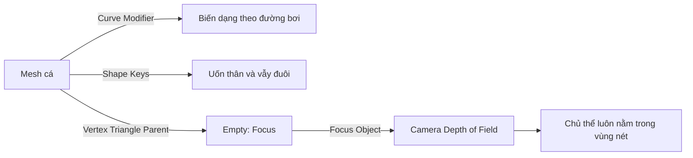
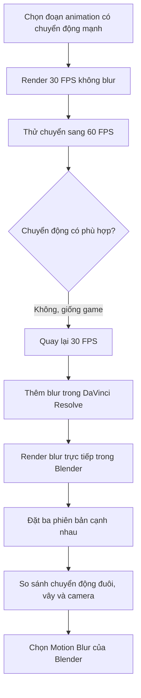
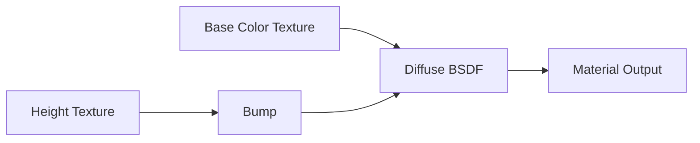

# 10 — Motion Blur R&D

| Thuộc tính       | Nội dung                                                                    |
| ---------------- | --------------------------------------------------------------------------- |
| **Video**        | Learn How to Animate and Render a Fish in Blender! (Beginner Friendly)      |
| **Chương**       | Motion Blur R&D                                                             |
| **Thời điểm**    | 02:58:15                                                                    |
| **Thời lượng**   | 23:04                                                                       |
| **Chủ đề chính** | Thử nghiệm motion blur, tốc độ khung hình và Depth of Field cho cảnh cá bơi |

---

## 1. Mục tiêu bài học

Sau chương này, người học có thể:

* Hiểu vì sao motion blur ảnh hưởng mạnh đến cảm giác chuyển động của cá.
* Phân biệt motion blur dựng trực tiếp trong Blender và motion blur giả lập ở hậu kỳ.
* Thử nghiệm tốc độ `30 FPS` và `60 FPS` để lựa chọn phong cách chuyển động phù hợp.
* Thiết lập Depth of Field để camera luôn tập trung vào con cá.
* Đánh giá kết quả bằng bản render thực tế thay vì chỉ dựa vào Rendered Viewport.
* Chọn được thiết lập cuối cùng cân bằng giữa chất lượng hình ảnh và thời gian render.

---

## 2. Vấn đề cần giải quyết

Trong cảnh hiện tại, cả hai thành phần đều chuyển động:

1. Con cá bơi dọc theo một đường Curve.
2. Camera di chuyển và rung nhẹ để bám theo con cá.

Khi bật motion blur, chuyển động của camera có thể khiến toàn bộ cảnh bị nhòe. Trong Rendered Viewport, kết quả ban đầu tạo cảm giác như:

* Con cá được ghép lên một đoạn phim nền đã bị làm mờ.
* Camera được animate sau khi cảnh đã render.
* Toàn bộ hình ảnh bị nhòe đồng đều, trong khi chủ thể không nổi bật.
* Chuyển động trông thiếu tự nhiên hoặc khó quan sát.

Vì vậy, không nên quyết định chỉ bằng việc nhìn viewport. Cần render nhiều phiên bản rồi so sánh trực tiếp.

---

## 3. Các phương án được thử nghiệm

Ba phương án chính được kiểm tra:

| Phương án                        | Thiết lập                                                 | Ưu điểm                                                         | Nhược điểm                                                            |
| -------------------------------- | --------------------------------------------------------- | --------------------------------------------------------------- | --------------------------------------------------------------------- |
| **Không có motion blur**         | Render trực tiếp tại 30 FPS                               | Hình ảnh sắc nét, render nhanh                                  | Chuyển động nhanh có thể bị giật hoặc cứng                            |
| **Motion blur giả trong hậu kỳ** | Render không blur rồi thêm hiệu ứng trong DaVinci Resolve | Có thể điều chỉnh sau khi render                                | Dễ xuất hiện hiệu ứng giả, viền nhòe hoặc chuyển động không chính xác |
| **Motion blur của Blender**      | Bật Motion Blur trong render engine                       | Chất lượng tự nhiên, phản ánh chuyển động thật của cá và camera | Tốn thêm thời gian render                                             |

---

## 4. Thử nghiệm tốc độ 60 FPS

### 4.1. Ý tưởng

Một phương án được đưa ra là:

1. Tăng tốc độ khung hình từ `30 FPS` lên `60 FPS`.
2. Kéo giãn toàn bộ animation để giữ nguyên thời lượng.
3. Render không có motion blur.
4. Thêm motion blur ở hậu kỳ.

Mục tiêu là tạo ra nhiều frame trung gian hơn, giúp phần mềm hậu kỳ có đủ dữ liệu để mô phỏng chuyển động mượt.

---

### 4.2. Chuyển animation từ 30 FPS sang 60 FPS

Trong Graph Editor:

1. Chọn toàn bộ keyframe bằng `A`.
2. Đặt Pivot Point thành **2D Cursor**.
3. Đặt 2D Cursor ở frame đầu tiên.
4. Nhấn:

```text
S → X → 2
```

Thao tác này kéo giãn animation theo trục thời gian lên gấp đôi.

Ví dụ:

```text
Animation ban đầu: 1 → 250 frame tại 30 FPS
Animation mới:     1 → 500 frame tại 60 FPS
```

Thời lượng thực tế gần như không đổi, nhưng số lượng frame tăng gấp đôi.

---

### 4.3. Kết quả ở 60 FPS

Animation trở nên rất mượt nhưng tạo cảm giác giống:

* Game thời gian thực.
* Video quay bằng camera tốc độ cao.
* Chuyển động quá sạch và quá rõ.
* Thiếu chất điện ảnh hoặc cảm giác phim tài liệu.

Đặc biệt, chuyển động lắc thân và vây cá không còn mang cảm giác mềm mại như ở 30 FPS.

### Kết luận thử nghiệm

`60 FPS` không phù hợp với phong cách hình ảnh mong muốn của dự án.

Dự án quay trở lại:

```text
30 FPS
```

---

## 5. Chuyển animation trở lại 30 FPS

Để đưa animation đã kéo giãn về trạng thái ban đầu:

1. Chọn toàn bộ keyframe trong Graph Editor.
2. Đặt Pivot Point tại 2D Cursor.
3. Nhấn:

```text
S → X → 0.5
```

Hoặc sử dụng phép chia:

```text
S → X → 1 / 2
```

Sau đó vào:

```text
Output Properties
└── Frame Rate
    └── 30 FPS
```

### Lưu ý

Khi thay đổi FPS, cần kiểm tra lại:

* Tốc độ Noise Modifier.
* Chu kỳ Shape Keys.
* Animation lắc đuôi.
* Camera shake.
* Thời điểm bắt đầu và kết thúc vòng lặp.

Các chuyển động được tạo bằng Noise Modifier có thể thay đổi cảm giác khi FPS hoặc thời lượng animation bị thay đổi.

---

## 6. Thiết lập Depth of Field theo con cá

Motion blur không phải yếu tố duy nhất giúp hình ảnh tự nhiên. Nếu toàn bộ cảnh đều sắc nét, kết quả vẫn dễ tạo cảm giác giống đồ họa game.

Một lớp Depth of Field nhẹ giúp:

* Tách con cá khỏi môi trường.
* Tăng chiều sâu cho cảnh.
* Làm mềm các vùng tiền cảnh và hậu cảnh.
* Tạo cảm giác camera thật đang quay dưới nước.

---

## 7. Tạo đối tượng lấy nét cho camera

Không nên dùng trực tiếp tâm Object của con cá làm điểm lấy nét, vì con cá đang bị biến dạng bởi:

* Curve Modifier.
* Shape Keys.
* Chuyển động uốn thân.
* Chuyển động quay và lắc.

Điểm lấy nét cần bám theo một vị trí cụ thể trên phần thân cá.

### Quy trình thực hiện

#### Bước 1 — Tạm tắt Curve Modifier

Chọn model cá và tạm thời tắt Curve Modifier để dễ chọn phần thân chính xác.

#### Bước 2 — Đặt 3D Cursor lên thân cá

1. Chuyển sang Edit Mode.
2. Chọn một mặt hoặc tam giác nằm gần vùng trung tâm thân cá.
3. Đặt 3D Cursor vào vị trí đó.

Có thể sử dụng:

```text
Shift + S
└── Cursor to Selected
```

#### Bước 3 — Tạo Empty

Tạo một Empty tại vị trí 3D Cursor:

```text
Shift + A
└── Empty
    └── Plain Axes
```

Đổi tên:

```text
Focus
```

Giảm kích thước hiển thị của Empty để không làm rối viewport.

#### Bước 4 — Parent Empty với một mặt của mesh

1. Chọn Empty `Focus`.
2. Giữ `Shift` và chọn model cá.
3. Chuyển sang Edit Mode.
4. Chọn ba đỉnh tạo thành một tam giác trên thân cá.
5. Nhấn:

```text
Ctrl + P
└── Vertex Triangle
```

Khi sử dụng **Vertex Triangle Parent**, Empty sẽ:

* Di chuyển theo con cá.
* Xoay theo thân cá.
* Bám theo biến dạng của mesh.
* Tiếp tục đúng vị trí khi Curve Modifier và Shape Keys hoạt động.

#### Bước 5 — Bật lại Curve Modifier

Sau khi hoàn tất parenting, bật lại Curve Modifier và kiểm tra Empty có đi theo cá hay không.

---

## 8. Gán đối tượng lấy nét cho camera

Chọn Camera rồi vào:

```text
Camera Data Properties
└── Depth of Field
    ├── Enable Depth of Field
    └── Focus Object: Focus
```

Từ thời điểm này, camera sẽ luôn lấy nét vào Empty `Focus`, và Empty sẽ luôn đi theo thân cá.

### Sơ đồ quan hệ



---

## 9. Điều chỉnh độ sâu trường ảnh

Không nên sử dụng Depth of Field quá mạnh.

Nếu khẩu độ quá lớn hoặc giá trị F-Stop quá thấp:

* Hình ảnh trông giả.
* Cá có thể bị mất nét một phần.
* Hiệu ứng giống mô hình thu nhỏ.
* Người xem chú ý vào hiệu ứng hơn là chuyển động.

Thiết lập nên mang tính tinh tế:

```text
Con cá: tương đối rõ nét
Tiền cảnh: hơi mờ
Hậu cảnh: hơi mờ
Độ chuyển nét: mềm
```

### Nguyên tắc

> Depth of Field trong cảnh này có nhiệm vụ làm mềm hình ảnh, không phải biến vùng nét thành một dải cực kỳ mỏng.

Việc khóa điểm lấy nét hoàn hảo vào cá có thể không hoàn toàn thực tế đối với camera quay dưới nước, nhưng thường cho kết quả dễ nhìn hơn so với việc cố tình tạo hiệu ứng autofocus liên tục bị trượt nét.

---

## 10. Render phiên bản không có motion blur

Trước khi bật motion blur, render một phiên bản chuẩn để làm mốc so sánh.

### Thiết lập

```text
Frame Rate: 30 FPS
Motion Blur: Off
Depth of Field: On
Render Engine: Eevee
```

Nên sử dụng tên file rõ ràng, chẳng hạn:

```text
fish_v01_no_motion_blur_
```

Dấu gạch dưới ở cuối tên giúp phân tách tên animation với số frame mà Blender tự động thêm vào.

Ví dụ:

```text
fish_v01_no_motion_blur_0001
fish_v01_no_motion_blur_0002
fish_v01_no_motion_blur_0003
```

Thay vì:

```text
fish_v01_no_motion_blur0001
```

---

## 11. Thử motion blur giả trong DaVinci Resolve

Sau khi render phiên bản không blur, video được nhập vào DaVinci Resolve để thử thêm motion blur ở hậu kỳ.

### Quy trình tổng quát

```text
Render từ Blender
        ↓
Nhập vào Media Pool
        ↓
Đưa clip vào Timeline
        ↓
Tìm hiệu ứng Motion Blur
        ↓
Điều chỉnh Motion Range
        ↓
Điều chỉnh Blur Amount
        ↓
Xuất video thử nghiệm
```

Một số thiết lập được thử:

* Motion Range: `Large`
* Quality: mức cao hơn
* Motion Blur Amount: khoảng `50`

### Kết quả

Motion blur hậu kỳ có thể làm chuyển động mềm hơn, nhưng chưa thuyết phục:

* Đường nhòe không hoàn toàn bám theo biến dạng của cá.
* Các vùng vây và đuôi có thể tạo vệt không chính xác.
* Chuyển động của camera làm hiệu ứng khó kiểm soát.
* Hình ảnh mang cảm giác được xử lý bằng filter.
* Một số tính năng motion blur nâng cao trong DaVinci Resolve có thể yêu cầu phiên bản trả phí.

Đây là phương pháp nhanh để thử nghiệm, nhưng không phải lựa chọn tốt nhất cho cảnh này.

---

## 12. Render bằng Motion Blur của Blender

Sau đó, bật lại motion blur trong Blender và render một phiên bản thứ hai.

### Thiết lập cơ bản

```text
Render Properties
└── Motion Blur: On
```

Đổi tên file:

```text
fish_v01_motion_blur_
```

Sau khi render, nhập cả ba phiên bản vào cùng một timeline để so sánh:

1. Không có motion blur.
2. Motion blur giả từ DaVinci Resolve.
3. Motion blur thực từ Blender.

---

## 13. Kết quả so sánh

| Tiêu chí                       |    Không blur |         Blur hậu kỳ |          Blur từ Blender |
| ------------------------------ | ------------: | ------------------: | -----------------------: |
| Độ sắc nét                     |       Rất cao |          Trung bình |                      Tốt |
| Cảm giác chuyển động           |      Hơi cứng |   Mềm hơn nhưng giả |                 Tự nhiên |
| Chuyển động vây và đuôi        |    Dễ bị giật | Có thể tạo artifact | Được mô tả chính xác hơn |
| Phản ứng với camera            | Không có blur |         Khó dự đoán |         Đồng bộ với cảnh |
| Khả năng điều chỉnh sau render |          Thấp |                 Cao |                     Thấp |
| Chất lượng tổng thể            |    Trung bình |          Trung bình |                 Tốt nhất |

Motion blur dựng trực tiếp trong Blender cho kết quả tốt hơn rõ rệt so với hiệu ứng hậu kỳ.

Điểm đáng chú ý là motion blur trong Rendered Viewport có thể trông quá mạnh hoặc không tự nhiên, nhưng kết quả render cuối lại được tính toán tốt hơn. Vì vậy:

> Không nên đánh giá motion blur chỉ bằng viewport. Hãy render một đoạn ngắn trước khi quyết định.

---

## 14. Quy trình R&D được sử dụng



---

## 15. Cải thiện material của cá

Trong giai đoạn kiểm tra cuối, material của cá cũng được điều chỉnh để hình ảnh bớt mang cảm giác nhựa hoặc game.

Một thử nghiệm được thực hiện là so sánh:

```text
Principled BSDF
```

với:

```text
Diffuse BSDF
```

Diffuse BSDF có thể mang lại bề mặt mềm hơn và phù hợp với phong cách hình ảnh đang hướng tới.

Có thể giữ thêm một lượng Bump hoặc Displacement rất nhẹ để:

* Làm bề mặt cá bớt phẳng.
* Gợi cảm giác vảy nhỏ.
* Bắt sáng tốt hơn.
* Không phá vỡ silhouette của model.

### Node cơ bản



Không nên đặt Bump quá mạnh vì có thể khiến da cá trông thô, khô hoặc giống đá.

---

## 16. Phát hiện về chuyển động quay của cá

Khi xem lại kết quả có motion blur, một vấn đề mới được phát hiện: chuyển động quay hướng của con cá vẫn chưa hoàn toàn tự nhiên.

### Chuyển động chưa đúng

Cá bị xoay quá mượt theo đường Curve:

```text
Bơi thẳng
   ↓
Thân xoay đều
   ↓
Đổi hướng hoàn toàn
```

Kiểu quay này khiến con cá giống một vật thể được điều khiển bằng đường dẫn hơn là sinh vật sống.

### Chuyển động tự nhiên hơn

Khi cá đổi hướng, cơ thể cần tham gia vào chuyển động:

```text
Đầu bắt đầu đổi hướng
        ↓
Thân cong sang một bên
        ↓
Đuôi quét ngược hướng
        ↓
Toàn thân nghiêng nhẹ
        ↓
Cá ổn định theo hướng mới
```

### Nguyên tắc quan trọng

> Cá không chỉ xoay theo quỹ đạo. Nó phải chủ động uốn thân để tạo ra chuyển động quay.

Khi xây dựng animation tiếp theo, nên bổ sung:

* Banking nhẹ khi vào cua.
* Tăng biên độ quẫy đuôi trong lúc đổi hướng.
* Độ trễ giữa đầu, thân và đuôi.
* Thay đổi tốc độ khi vào và ra khỏi khúc cua.
* Chuyển động không hoàn toàn đối xứng.

---

## 17. Gợi ý tăng độ chân thực cho cảnh

Ngoài motion blur và Depth of Field, có thể bổ sung:

### 17.1. Gợn nước

Đặt một mặt phẳng phía trên cảnh và sử dụng:

* Noise Texture.
* Normal Map.
* Displacement nhẹ.
* Ánh sáng chiếu xuyên qua bề mặt.

Mục tiêu là tạo biến dạng ánh sáng hoặc caustics nhẹ trên cá và nền.

### 17.2. Hạt trong nước

Thêm các hạt nhỏ trôi chậm để:

* Thể hiện môi trường nước.
* Tăng cảm giác chiều sâu.
* Làm chuyển động camera dễ nhận biết hơn.

### 17.3. Âm thanh môi trường

Nếu camera được mô phỏng như đang quan sát từ ngoài mặt nước, âm thanh nên phù hợp với vị trí người quay:

* Chim.
* Gió.
* Cỏ hoặc cây.
* Xe cộ ở xa.
* Tiếng nước nhẹ.

Không nhất thiết phải sử dụng âm thanh bị bóp nghẹt như camera đang đặt dưới nước.

---

## 18. Lỗi thường gặp

### 18.1. Motion blur trong viewport trông quá mạnh

**Nguyên nhân:** Viewport không phản ánh hoàn toàn kết quả render cuối.

**Cách xử lý:** Render thử một đoạn từ 5–20 frame trước khi thay đổi toàn bộ thiết lập.

---

### 18.2. 60 FPS trông giống trò chơi

**Nguyên nhân:** Chuyển động quá rõ và quá mượt so với phong cách điện ảnh.

**Cách xử lý:** Quay lại 24 hoặc 30 FPS, sau đó dùng motion blur vừa phải.

---

### 18.3. Blur hậu kỳ tạo vệt sai

**Nguyên nhân:** Phần mềm hậu kỳ phải suy đoán hướng chuyển động từ các frame đã render.

**Cách xử lý:** Sử dụng motion blur trực tiếp trong Blender đối với các chuyển động biến dạng phức tạp.

---

### 18.4. Depth of Field quá mạnh

**Nguyên nhân:** F-Stop quá thấp hoặc Focus Distance không phù hợp.

**Cách xử lý:** Tăng F-Stop và sử dụng một Empty làm Focus Object.

---

### 18.5. Điểm lấy nét không đi theo phần thân cá

**Nguyên nhân:** Empty chỉ được parent với Object thay vì vùng mesh đang biến dạng.

**Cách xử lý:** Sử dụng `Vertex Triangle Parent`.

---

### 18.6. Cá đổi hướng quá cơ học

**Nguyên nhân:** Model chỉ xoay theo Curve mà không có animation uốn thân hỗ trợ.

**Cách xử lý:** Thêm banking, quét đuôi và độ trễ khi vào cua.

---

## 19. Checklist thực hành

### Tốc độ khung hình

* [ ] Đã thử animation ở 30 FPS.
* [ ] Đã kiểm tra cảm giác chuyển động ở 60 FPS.
* [ ] Đã chọn FPS phù hợp với phong cách dự án.
* [ ] Đã kiểm tra lại Noise Modifier sau khi thay đổi thời gian.

### Depth of Field

* [ ] Đã tạo Empty `Focus`.
* [ ] Empty được parent bằng Vertex Triangle.
* [ ] Empty đi theo biến dạng của cá.
* [ ] Camera sử dụng Empty làm Focus Object.
* [ ] Depth of Field đủ nhẹ và không làm mất chi tiết cá.

### Motion Blur

* [ ] Đã render phiên bản không có motion blur.
* [ ] Đã thử motion blur trong hậu kỳ.
* [ ] Đã render phiên bản bật motion blur trong Blender.
* [ ] Đã so sánh các phiên bản trong cùng một timeline.
* [ ] Đã kiểm tra kỹ đuôi, vây và các đoạn đổi hướng.

### Render

* [ ] Tên file có hậu tố rõ ràng.
* [ ] Có dấu gạch dưới trước số frame.
* [ ] Đã render thử một đoạn ngắn.
* [ ] Đã kiểm tra vòng lặp animation.
* [ ] Đã lưu riêng từng phiên bản thử nghiệm.

---

## 20. Thiết lập cuối cùng được lựa chọn

```yaml
render_engine: Eevee
frame_rate: 30 FPS
motion_blur: enabled
motion_blur_source: Blender
depth_of_field: enabled
focus_object: Empty parented to fish mesh
post_motion_blur: not used
material_adjustment: subtle diffuse and bump
```

---

## 21. Kết luận

Chương này thể hiện đúng tinh thần của quá trình R&D trong sản xuất animation: không lựa chọn thiết lập dựa trên giả định mà tạo nhiều phiên bản, render thử và so sánh trực tiếp.

Các kết luận quan trọng gồm:

1. `60 FPS` tạo chuyển động mượt nhưng không phù hợp với phong cách phim tài liệu hoặc điện ảnh của cảnh.
2. `30 FPS` mang lại cảm giác chuyển động tự nhiên hơn.
3. Motion blur giả trong hậu kỳ có thể sử dụng để thử nhanh nhưng không xử lý tốt chuyển động biến dạng phức tạp của cá.
4. Motion blur của Blender cho kết quả thuyết phục nhất.
5. Rendered Viewport có thể gây hiểu nhầm; cần đánh giá bằng render cuối.
6. Depth of Field nhẹ giúp cảnh bớt sắc nét kiểu trò chơi.
7. Điểm lấy nét nên được parent trực tiếp với vùng mesh cá đang biến dạng.
8. Chuyển động quay của cá cần có sự phối hợp giữa đầu, thân và đuôi, không nên chỉ dựa vào hướng của Curve.

Quy trình lựa chọn cuối cùng:

```text
30 FPS
   +
Motion Blur trong Blender
   +
Depth of Field nhẹ
   +
Focus Object bám theo thân cá
   +
Material mềm và Bump tinh tế
   =
Chuyển động cá tự nhiên và có chiều sâu hơn
```
