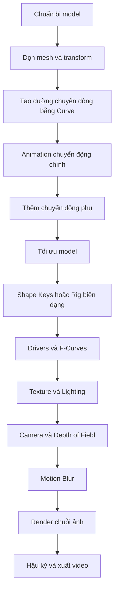

# 11 — Final Result

| Thuộc tính       | Nội dung                                                                 |
| ---------------- | ------------------------------------------------------------------------ |
| **Video**        | *Learn How to Animate and Render a Fish in Blender! (Beginner Friendly)* |
| **Chương**       | Final Result                                                             |
| **Thời điểm**    | `03:21:19`                                                               |
| **Thời lượng**   | Đến hết video                                                            |
| **Chủ đề chính** | Render cuối cùng, hậu kỳ và tổng kết toàn bộ quy trình                   |

---

## 1. Mục tiêu bài học

Sau chương này, người học có thể:

* Chốt các thiết lập render cuối cùng như **Render Engine**, **Samples**, **Denoising**, độ phân giải và phạm vi frame.
* Áp dụng phương pháp **Motion Blur** đã thử nghiệm ở chương trước.
* Render animation an toàn dưới dạng chuỗi ảnh hoặc video.
* Thực hiện hậu kỳ nhẹ trong **Compositor**.
* Đánh giá kết quả cuối bằng cách đối chiếu với mục tiêu ban đầu của dự án.
* Tổng hợp lại toàn bộ quy trình tạo animation cho một sinh vật bơi trong Blender.

---

## 2. Kết quả cuối cùng

Chương cuối trình bày cảnh animation hoàn chỉnh sau khi đã đi qua toàn bộ quy trình:

```text
Model cá
   ↓
Tạo đường bơi bằng Curve
   ↓
Animation chuyển động chính
   ↓
Thêm chuyển động phụ
   ↓
Tối ưu model
   ↓
Shape Keys và Drivers
   ↓
Texture và Lighting
   ↓
Camera Movement và DOF
   ↓
Motion Blur
   ↓
Render và hậu kỳ
```

Kết quả cuối cùng cần thể hiện được ba yếu tố quan trọng:

1. **Chuyển động bơi tự nhiên**

   Thân cá uốn mềm, đuôi và vây có độ trễ, không chuyển động cứng hoặc lặp lại quá máy móc.

2. **Hình ảnh có chiều sâu**

   Texture, ánh sáng dưới nước, Depth of Field và chuyển động camera phối hợp để làm nổi bật chủ thể.

3. **Cảm giác chuyển động thuyết phục**

   Motion Blur giúp các phần chuyển động nhanh như đuôi và vây không bị đóng băng cứng trên từng frame.

---

## 3. Kiểm tra trước khi render

Trước khi bắt đầu render toàn bộ animation, cần kiểm tra lại các thiết lập quan trọng trong **Render Properties** và **Output Properties**.

### 3.1. Render Engine

Có thể lựa chọn:

| Render Engine | Ưu điểm                                         | Hạn chế                                    |
| ------------- | ----------------------------------------------- | ------------------------------------------ |
| **Cycles**    | Ánh sáng, phản xạ và bóng đổ chân thực hơn      | Thời gian render lâu                       |
| **Eevee**     | Render nhanh, phù hợp preview hoặc thiết bị yếu | Chất lượng ánh sáng vật lý thấp hơn Cycles |

Nếu mục tiêu là sản phẩm cuối có chất lượng cao, nên ưu tiên **Cycles**. Nếu cần render nhanh hoặc thử nghiệm nhiều lần, có thể dùng **Eevee**.

---

### 3.2. Samples

Số lượng Samples ảnh hưởng trực tiếp đến:

* Độ sạch của hình ảnh.
* Mức độ noise.
* Thời gian render mỗi frame.

Không nhất thiết phải đặt Samples quá cao. Nên kết hợp:

```text
Samples vừa đủ
      +
Denoising
      ↓
Hình ảnh sạch hơn với thời gian render hợp lý
```

Nên render thử một số frame đại diện trước khi render toàn bộ animation, đặc biệt là:

* Frame đầu.
* Frame giữa.
* Frame có chuyển động nhanh nhất.
* Frame có ánh sáng hoặc Depth of Field phức tạp nhất.

---

### 3.3. Độ phân giải và tỉ lệ khung hình

Trong **Output Properties**, cần kiểm tra:

* Resolution X.
* Resolution Y.
* Percentage Scale.
* Frame Rate.
* Tỉ lệ khung hình phù hợp với nền tảng sử dụng.

Ví dụ:

| Mục đích             | Độ phân giải gợi ý         |
| -------------------- | -------------------------- |
| Video ngang Full HD  | `1920 × 1080`              |
| Video dọc điện thoại | `1080 × 1920`              |
| Video vuông          | `1080 × 1080`              |
| Preview nhanh        | `1280 × 720` hoặc thấp hơn |

Cần bảo đảm **Frame Rate** khi render trùng với Frame Rate đã sử dụng khi làm animation.

---

### 3.4. Frame Range

Kiểm tra lại:

* **Start Frame**.
* **End Frame**.
* Animation có frame tĩnh thừa ở đầu hoặc cuối hay không.
* Chuyển động camera có kết thúc đúng thời điểm hay không.
* Motion Blur có hoạt động ổn định trong toàn bộ đoạn render hay không.

Một lỗi phổ biến là animation hoàn chỉnh chỉ kéo dài đến frame 240 nhưng Output Properties lại render đến frame 300, tạo ra nhiều frame đứng yên không cần thiết.

---

## 4. Áp dụng Motion Blur

Phương pháp Motion Blur được sử dụng cần dựa trên kết quả thử nghiệm ở chương 10.

Hai hướng tiếp cận chính:

### Cách 1 — Motion Blur của Render Engine

Motion Blur được tính trực tiếp trong quá trình render.

**Ưu điểm:**

* Kết quả tự nhiên.
* Phản ánh chính xác chuyển động của vật thể.
* Không cần xử lý nhiều trong Compositor.

**Hạn chế:**

* Có thể làm tăng thời gian render.
* Cần render lại nếu muốn thay đổi cường độ blur.

---

### Cách 2 — Vector Blur trong Compositor

Render dữ liệu chuyển động trước, sau đó tạo blur bằng node **Vector Blur**.

**Ưu điểm:**

* Có thể điều chỉnh sau khi render.
* Linh hoạt hơn trong hậu kỳ.
* Phù hợp khi cần thử nhiều mức blur.

**Hạn chế:**

* Có thể xuất hiện lỗi ở viền vật thể.
* Các phần mỏng như vây cá hoặc sợi vây dài có thể tạo artefact.
* Cần bật đúng Render Pass chứa dữ liệu vector chuyển động.

---

## 5. Quy trình render đề xuất

Quy trình an toàn nhất là render animation thành **chuỗi ảnh**, sau đó ghép thành video.

```text
Animation hoàn chỉnh
        ↓
Render từng frame thành PNG
        ↓
Kiểm tra frame lỗi
        ↓
Ghép Image Sequence trong Video Sequencer
        ↓
Thêm âm thanh nếu cần
        ↓
Xuất video MP4
```

### Bước 1 — Chọn thư mục xuất

Vào:

```text
Output Properties
└── Output
    └── Chọn thư mục lưu frame
```

Nên tạo một thư mục riêng, ví dụ:

```text
fish_animation/
├── frames/
├── preview/
└── final_video/
```

---

### Bước 2 — Chọn định dạng ảnh

Định dạng đề xuất:

* **PNG**: an toàn, chất lượng tốt, dễ sử dụng.
* **OpenEXR**: phù hợp khi cần hậu kỳ màu và ánh sáng chuyên sâu.
* **JPEG**: dung lượng thấp nhưng mất dữ liệu ảnh, không nên dùng cho render chính.

Thiết lập phổ biến:

```text
File Format: PNG
Color: RGB hoặc RGBA
Color Depth: 8 hoặc 16
Compression: tùy chọn
```

Chọn **RGBA** nếu cần nền trong suốt.

---

### Bước 3 — Render Animation

Sử dụng:

```text
Render → Render Animation
```

Hoặc phím tắt:

```text
Ctrl + F12
```

Blender sẽ render lần lượt từ Start Frame đến End Frame.

---

### Bước 4 — Kiểm tra chuỗi ảnh

Sau khi render, cần kiểm tra:

* Có frame nào bị đen hay không.
* Có frame bị mất texture hay không.
* Có vật thể xuyên mesh không.
* Motion Blur có quá mạnh không.
* Camera có rung bất thường không.
* Depth of Field có làm chủ thể bị mất nét không.
* Ánh sáng có nhấp nháy giữa các frame không.

---

### Bước 5 — Ghép thành video

Trong Blender:

```text
Chuyển sang Video Editing Workspace
        ↓
Add → Image/Sequence
        ↓
Chọn toàn bộ chuỗi ảnh
        ↓
Kiểm tra Frame Rate
        ↓
Chọn FFmpeg Video
        ↓
Render Animation
```

Thiết lập video phổ biến:

```text
File Format: FFmpeg Video
Container: MPEG-4
Video Codec: H.264
Audio Codec: AAC
```

---

## 6. Vì sao nên render thành chuỗi ảnh?

Render trực tiếp thành video có vẻ nhanh và tiện lợi, nhưng tiềm ẩn nhiều rủi ro.

### Render trực tiếp ra video

```text
Render frame 1 → frame 2 → ... → frame 200
                            ↓
                     Blender bị crash
                            ↓
                 Video có thể bị hỏng hoàn toàn
```

### Render thành chuỗi ảnh

```text
Frame 1.png
Frame 2.png
Frame 3.png
...
Frame 200.png
```

Nếu Blender dừng ở frame 150, chỉ cần tiếp tục render từ frame 151.

Vì vậy, với animation dài hoặc render bằng Cycles, chuỗi ảnh là phương án an toàn hơn.

---

## 7. Hậu kỳ trong Compositor

Sau khi render, có thể thêm một lớp hậu kỳ nhẹ bằng **Compositor**.

Hậu kỳ chỉ nên dùng để tinh chỉnh hình ảnh, không nên thay thế cho texture, lighting hoặc camera chưa được thiết lập đúng.

### Sơ đồ node cơ bản

```text
Render Layers
      ↓
Color Balance
      ↓
Glare
      ↓
Lens Distortion
      ↓
Composite
```

Không bắt buộc phải sử dụng tất cả node. Chỉ thêm node thực sự cần thiết.

---

### 7.1. Glare

Node **Glare** tạo hiệu ứng lóa sáng tại các vùng có cường độ sáng cao.

Đường dẫn:

```text
Shift + A
└── Filter
    └── Glare
```

Có thể dùng để làm nổi bật:

* Ánh sáng xuyên qua mặt nước.
* Điểm sáng phản chiếu trên vảy cá.
* Vùng highlight trên mắt hoặc vây.
* Các hạt bụi hoặc bong bóng dưới nước.

Không nên đặt Glare quá mạnh vì có thể làm mất chi tiết texture.

---

### 7.2. Color Balance

**Color Balance** giúp tinh chỉnh màu cuối cùng của cảnh.

Có thể sử dụng để:

* Làm vùng tối ngả xanh.
* Làm vùng sáng ấm hơn.
* Tạo cảm giác môi trường dưới nước.
* Đồng nhất màu sắc giữa cá và background.

Nguyên tắc chung:

```text
Lighting tạo hình khối chính
Color Balance chỉ tinh chỉnh tông màu cuối
```

Không nên dùng Color Balance để sửa một hệ thống ánh sáng đã thiết lập sai hoàn toàn.

---

### 7.3. Lens Distortion

**Lens Distortion** có thể tạo cảm giác giống hình ảnh được ghi lại bằng camera thật.

Có thể thêm:

* Distortion nhẹ.
* Chromatic Aberration rất nhỏ.
* Hiệu ứng cong nhẹ ở rìa khung hình.

Hiệu ứng này cần được sử dụng tinh tế. Giá trị quá cao sẽ làm hình ảnh trông giả hoặc gây khó chịu.

---

### 7.4. Vignette nhẹ

Có thể tạo vignette bằng mask hoặc ellipse để làm tối nhẹ các góc ảnh.

Mục đích:

* Hướng sự chú ý vào con cá.
* Giảm sự phân tán ở background.
* Tăng cảm giác chiều sâu.

Vignette không nên tạo thành một vòng tối rõ ràng quanh khung hình.

---

## 8. Đánh giá kết quả cuối

Sau khi render, cần đối chiếu kết quả với phần giới thiệu ở chương 01.

### Tiêu chí đánh giá

| Nhóm               | Câu hỏi kiểm tra                                                 |
| ------------------ | ---------------------------------------------------------------- |
| **Chuyển động**    | Cá có bơi mềm mại và có trọng lượng không?                       |
| **Thân cá**        | Chuyển động uốn có liên tục từ đầu đến đuôi không?               |
| **Đuôi và vây**    | Có độ trễ tự nhiên hay chuyển động đồng thời cứng nhắc?          |
| **Đường bơi**      | Quỹ đạo có tự nhiên hay quá giống một đường ray cố định?         |
| **Camera**         | Camera có bám đúng chủ thể và chuyển động mượt không?            |
| **Depth of Field** | Chủ thể có được giữ nét ở các thời điểm quan trọng không?        |
| **Lighting**       | Cá có tách khỏi background không?                                |
| **Texture**        | Chi tiết vảy và bề mặt có còn rõ sau hậu kỳ không?               |
| **Motion Blur**    | Có hỗ trợ cảm giác chuyển động hay làm hình ảnh bị nhòe quá mức? |
| **Tổng thể**       | Kết quả có đạt được hình dung ban đầu của dự án không?           |

---

## 9. Những kỹ thuật quan trọng nhất của toàn bộ video

Toàn bộ dự án có thể được rút gọn thành năm hệ thống chính.

### 9.1. Curve và Follow Path

Dùng để xác định quỹ đạo tổng thể của con cá.

```text
Curve
  ↓
Follow Path Constraint
  ↓
Cá di chuyển dọc theo đường bơi
```

---

### 9.2. Animation chuyển động chính

Tạo chuyển động tiến về phía trước, xoay thân và thay đổi tốc độ.

Đây là lớp animation quyết định:

* Hướng bơi.
* Nhịp độ.
* Khoảng tăng tốc.
* Khoảng giảm tốc.
* Các đoạn đổi hướng.

---

### 9.3. Shape Keys và Drivers

Dùng để tạo biến dạng mềm cho thân cá.

```text
Biến đổi hoặc giá trị điều khiển
              ↓
            Driver
              ↓
      Giá trị Shape Key
              ↓
        Thân cá uốn lượn
```

Ưu điểm của hệ thống này là chuyển động có thể được tự động hóa và tái sử dụng.

---

### 9.4. Chuyển động phụ

Các phần như đuôi, vây lưng, vây hậu môn và vây ngực không nên chuyển động đồng thời tuyệt đối với thân.

Chúng cần có:

* Độ trễ.
* Biên độ nhỏ hơn.
* Tần số khác nhau.
* Một chút Noise hoặc biến thiên.

```text
Chuyển động thân
        ↓
Độ trễ theo chuỗi
        ↓
Đuôi và vây phản ứng sau
        ↓
Chuyển động tự nhiên hơn
```

---

### 9.5. Camera và Motion Blur

Camera giúp người xem cảm nhận không gian, trong khi Motion Blur giúp chuyển động nhanh trông tự nhiên hơn.

Hai yếu tố này không sửa được animation kém, nhưng có thể làm animation tốt trở nên thuyết phục hơn.

---

## 10. Quy trình tổng thể có thể tái sử dụng

Các kỹ thuật trong video không chỉ áp dụng cho cá.



Quy trình này có thể áp dụng cho:

* Cá.
* Cá voi.
* Rắn biển.
* Lươn.
* Sứa.
* Chim bay.
* Rồng.
* Sinh vật giả tưởng.
* Tàu hoặc vật thể di chuyển theo quỹ đạo.

Tùy từng sinh vật, chỉ cần thay đổi kiểu biến dạng và chuyển động phụ.

---

## 11. Quy trình thực hành gợi ý

1. Kiểm tra lại toàn bộ animation trong viewport.
2. Xác nhận Start Frame và End Frame.
3. Render thử các frame đại diện.
4. Chốt Render Engine, Samples và Denoising.
5. Chọn độ phân giải và Frame Rate.
6. Áp dụng phương pháp Motion Blur đã chọn.
7. Chọn thư mục output riêng cho chuỗi ảnh.
8. Render bằng `Ctrl + F12`.
9. Kiểm tra các frame lỗi.
10. Ghép chuỗi ảnh thành video.
11. Thêm hậu kỳ nhẹ trong Compositor.
12. So sánh kết quả cuối với mục tiêu ban đầu.
13. Ghi chú các vấn đề cần cải thiện cho dự án tiếp theo.

---

## 12. Phím tắt và công cụ liên quan

| Thao tác                           | Phím tắt hoặc vị trí                                 |
| ---------------------------------- | ---------------------------------------------------- |
| Render một frame                   | `F12`                                                |
| Render toàn bộ animation           | `Ctrl + F12`                                         |
| Hủy render                         | `Esc`                                                |
| Thiết lập độ phân giải             | Output Properties → Format                           |
| Thiết lập Frame Range              | Output Properties → Frame Range                      |
| Chọn định dạng output              | Output Properties → Output                           |
| Thêm Glare                         | Compositor → `Shift + A` → Filter → Glare            |
| Thêm Color Balance                 | Compositor → `Shift + A` → Color → Color Balance     |
| Thêm Lens Distortion               | Compositor → `Shift + A` → Distort → Lens Distortion |
| Thêm chuỗi ảnh vào Video Sequencer | `Shift + A` → Image/Sequence                         |
| Xem animation trong viewport       | `Spacebar`                                           |
| Chuyển đến frame đầu               | `Shift + Left Arrow`                                 |
| Chuyển đến frame cuối              | `Shift + Right Arrow`                                |

---

## 13. Lưu ý và lỗi thường gặp

### 13.1. Frame Range không đúng

Có thể dẫn đến:

* Thừa frame đứng yên ở đầu hoặc cuối.
* Mất đoạn animation quan trọng.
* Camera dừng trước khi cá ra khỏi khung hình.
* Loop bị thiếu frame.

---

### 13.2. Render trực tiếp ra video

Nếu Blender bị crash hoặc máy mất điện giữa quá trình render, video có thể bị hỏng hoặc mất toàn bộ tiến độ.

Nên ưu tiên:

```text
Render PNG Sequence
        ↓
Ghép video sau
```

---

### 13.3. Samples quá cao

Samples quá cao không phải lúc nào cũng tạo ra sự khác biệt rõ ràng, nhưng có thể làm thời gian render tăng mạnh.

Nên thử nghiệm trên một vài frame trước khi quyết định.

---

### 13.4. Motion Blur quá mạnh

Motion Blur quá mạnh có thể:

* Làm mất hình dạng đuôi.
* Xóa chi tiết vây.
* Tạo cảm giác cá chuyển động quá nhanh.
* Làm chủ thể khó nhận diện.

Blur nên hỗ trợ chuyển động, không che mất chuyển động.

---

### 13.5. Depth of Field sai điểm lấy nét

Nếu Focus Object hoặc Focus Distance không đúng, con cá có thể bị mờ ở những thời điểm quan trọng.

Nên kiểm tra toàn bộ animation bằng chế độ preview hoặc render thử nhiều frame.

---

### 13.6. Hậu kỳ quá tay

Glare, Color Balance, Lens Distortion hoặc vignette quá mạnh có thể làm mất:

* Chi tiết vảy.
* Hình dạng vây.
* Độ tương phản tự nhiên.
* Tính chân thực của ánh sáng.

Hậu kỳ nên là bước tinh chỉnh cuối, không phải bước che giấu lỗi.

---

### 13.7. Không cần sao chép chính xác kết quả của tác giả

Nếu sử dụng model, texture, ánh sáng hoặc đường bơi khác, kết quả sẽ không giống hoàn toàn video gốc.

Điều quan trọng là hiểu và tái sử dụng được quy trình:

```text
Quỹ đạo
+
Biến dạng thân
+
Chuyển động phụ
+
Camera
+
Motion Blur
=
Animation sinh vật thuyết phục
```

---

## 14. Checklist trước khi xuất bản

### Animation

* [ ] Chuyển động thân cá liên tục và không bị giật.
* [ ] Đuôi và vây có độ trễ tự nhiên.
* [ ] Đường bơi không quá cứng hoặc quá đều.
* [ ] Không có hiện tượng mesh xuyên nhau nghiêm trọng.
* [ ] Camera luôn giữ được chủ thể trong khung hình.

### Render

* [ ] Đã chốt Render Engine.
* [ ] Đã chốt Samples và Denoising.
* [ ] Độ phân giải đúng với nền tảng sử dụng.
* [ ] Frame Rate đúng với animation.
* [ ] Frame Range không thừa hoặc thiếu.
* [ ] Motion Blur đã được kiểm tra.

### Output

* [ ] Đã chọn đúng thư mục lưu file.
* [ ] Đã render thành chuỗi ảnh nếu animation dài.
* [ ] Không có frame đen, lỗi texture hoặc mất vật thể.
* [ ] Đã ghép chuỗi ảnh thành video.
* [ ] Video cuối có codec và định dạng phù hợp.

### Hậu kỳ

* [ ] Glare không quá mạnh.
* [ ] Color Balance không làm sai màu texture.
* [ ] Depth of Field giữ được chủ thể rõ nét.
* [ ] Lens Distortion chỉ được dùng ở mức tinh tế.
* [ ] Kết quả cuối đã được xem lại toàn bộ từ đầu đến cuối.

---

## 15. Bài học tổng kết

Dự án này cho thấy một animation sinh vật thuyết phục không đến từ một công cụ duy nhất. Kết quả cuối là sự kết hợp của nhiều lớp chuyển động và nhiều quyết định nhỏ:

```text
Model phù hợp
      +
Quỹ đạo chuyển động rõ ràng
      +
Animation chính có nhịp độ
      +
Chuyển động phụ có độ trễ
      +
Biến dạng thân mềm mại
      +
Camera có chiều sâu
      +
Lighting và Texture hợp lý
      +
Motion Blur vừa đủ
      =
Cảnh animation hoàn chỉnh
```

Một số bài học quan trọng:

* Không nên cố hoàn thiện mọi thứ ngay từ lần đầu.
* Nên làm animation theo nhiều pass.
* Luôn kiểm tra chuyển động lớn trước khi chỉnh chi tiết nhỏ.
* Chuyển động phụ là yếu tố quan trọng tạo cảm giác sống.
* Render thử giúp tiết kiệm rất nhiều thời gian.
* Chuỗi ảnh an toàn hơn render video trực tiếp.
* Hậu kỳ chỉ nên nâng cao chất lượng hình ảnh đã có.
* Quy trình và khả năng giải quyết vấn đề quan trọng hơn việc sao chép chính xác một sản phẩm mẫu.

---

## 16. Lời kết của tác giả

Ở phần cuối video, tác giả cảm ơn người xem đã theo dõi toàn bộ hướng dẫn và mời mọi người đề xuất chủ đề cho các video hướng dẫn dài tiếp theo.

Người xem có thể:

* Để lại bình luận về chủ đề muốn tác giả thực hiện.
* Thả thích cho những đề xuất mà mình đồng ý.
* Sử dụng lượt thích như một hình thức bình chọn cho các chủ đề hướng dẫn tiếp theo.

Nội dung lời kết có thể được diễn đạt lại như sau:

> Cảm ơn bạn rất nhiều vì đã xem video. Hãy để lại bình luận về chủ đề mà bạn muốn tôi thực hiện trong một hướng dẫn lớn tiếp theo. Nếu bạn thấy một đề xuất mà mình đồng ý, hãy thả thích cho bình luận đó để chúng ta có thể sử dụng lượt thích như một hệ thống bình chọn. Cảm ơn bạn đã theo dõi và hẹn gặp lại trong dự án tiếp theo.

Phần âm thanh cuối video chủ yếu là nhạc outro; một số từ rời rạc trong transcript như “Nhiệt” hoặc “Này” có khả năng là lỗi nhận dạng tự động và không mang nội dung hướng dẫn đáng kể.

---

## 17. Tóm tắt

Chương **Final Result** khép lại hành trình hơn ba giờ, từ một model cá tĩnh đến một cảnh animation hoàn chỉnh gồm:

* Đường bơi được điều khiển bằng Curve.
* Chuyển động chính và chuyển động phụ.
* Shape Keys và Drivers để uốn thân.
* Texture và ánh sáng dưới nước.
* Camera bám theo chủ thể.
* Depth of Field.
* Motion Blur.
* Render chuỗi ảnh.
* Hậu kỳ và xuất video.

Các kỹ thuật cốt lõi:

```text
Curve + Follow Path
Shape Keys + Drivers
F-Curves + Noise
Constraints cho Camera
Motion Blur hoặc Vector Blur
Compositor
```

Đây là một bộ kỹ thuật có khả năng tái sử dụng cao cho nhiều loại animation sinh vật di chuyển theo quỹ đạo, không chỉ riêng cá.

---

# Bài luyện tập

## Mục tiêu


## Đề bài


## Yêu cầu hoàn thành

- [ ] 
- [ ] 
- [ ] 

## Kết quả / lời giải


## Ghi chú
