# 01 — Giới thiệu và tổng quan dự án

| Thuộc tính            | Nội dung                                           |
| --------------------- | -------------------------------------------------- |
| **Phân đoạn**         | Mở đầu                                             |
| **Thời điểm**         | 00:00–00:36                                        |
| **Chủ đề**            | Tạo đàn cá bơi theo một vật thể dẫn đầu            |
| **Công cụ chính**     | Particle System, Boids, Object Instance, Animation |
| **Phiên bản Blender** | Blender 2.8                                        |

---

## 1. Mục tiêu bài học

Sau phần này, người học có thể:

* Hiểu **kết quả cuối cùng** của dự án.
* Hiểu vai trò của **Particle System** trong việc tạo số lượng lớn cá.
* Biết vì sao cần sử dụng **Boids** thay cho chuyển động hạt thông thường.
* Hiểu khái niệm **Leader** — vật thể dẫn đường cho đàn cá.
* Nắm được pipeline tổng quát từ **mô hình cá → đàn cá → chuyển động → animation → render**.

---

## 2. Ý tưởng chính của dự án

Thay vì tạo và animate từng con cá riêng lẻ, dự án sử dụng một mô hình cá duy nhất rồi để **Particle System** nhân bản mô hình đó thành cả đàn.

```text
1 mô hình cá
     │
     ▼
Particle System
     │
     ├── Cá 01
     ├── Cá 02
     ├── Cá 03
     ├── Cá 04
     └── ...
```

Tuy nhiên, Particle System chỉ giải quyết vấn đề:

> **Làm thế nào để tạo ra nhiều con cá?**

Để các con cá có thể chuyển động giống một đàn sinh vật, hệ thống **Boids** sẽ được sử dụng.

Boids chịu trách nhiệm mô phỏng các hành vi như:

* di chuyển theo đàn;
* tránh va chạm với nhau;
* duy trì khoảng cách;
* điều chỉnh hướng bơi;
* tìm mục tiêu;
* đi theo một vật thể dẫn đầu.

---

## 3. Các thành phần chính

### 3.1. Fish Model — Mô hình cá

Đầu tiên cần tạo một mô hình cá đơn giản.

Mô hình không cần quá chi tiết vì nó sẽ được nhân bản thành rất nhiều cá trong cảnh.

Yêu cầu chính:

* số lượng polygon thấp;
* hình dáng dễ nhận biết;
* thân tương đối tròn và mềm;
* hướng của mô hình phải phù hợp với hướng chuyển động của Particle System.

```text
      đầu
       ↓
   ┌─────────╮
───│  thân cá │────► hướng bơi
   └─────────╯
        ╲
         ╲ đuôi
```

---

### 3.2. Single Vertex — Điểm phát sinh cá

Một **Single Vertex** được sử dụng làm emitter.

Thay vì sử dụng một Plane hoặc một khối lớn, tất cả các particle có thể được sinh ra từ gần cùng một vị trí.

```text
          Cá
        ↗
      Cá
    ↗
● ───────► Cá
    ↘
      Cá
        ↘
          Cá

● = Single Vertex / Emitter
```

Điều này tạo cảm giác đàn cá bắt đầu từ một khu vực nhỏ rồi dần phân tán thành đàn.

---

### 3.3. Particle System — Tạo đàn cá

Particle System chịu trách nhiệm tạo ra số lượng cá.

Thay vì render các particle dưới dạng chấm hoặc vật thể mặc định, hệ thống sẽ sử dụng:

> **Render As → Object**

Mô hình cá được chọn làm:

> **Instance Object**

Cấu trúc có thể hình dung như sau:

```text
Emitter
   │
   ▼
Particle System
   │
   ├── Particle 01 ──► Fish Instance
   ├── Particle 02 ──► Fish Instance
   ├── Particle 03 ──► Fish Instance
   ├── Particle 04 ──► Fish Instance
   └── ...
```

Nhờ đó, chỉ cần tạo **một mô hình cá gốc** nhưng có thể sinh ra hàng chục hoặc hàng trăm con cá.

---

## 4. Vì sao sử dụng Boids?

Particle thông thường chủ yếu hoạt động theo các yếu tố vật lý như:

* vận tốc ban đầu;
* trọng lực;
* lực;
* hướng phát;
* tuổi thọ particle.

Ví dụ:

```text
Emitter
   │
   ├────────►
   ├────────►
   ├────────►
   └────────►
```

Các particle chủ yếu bay theo hướng được thiết lập và không có khái niệm về **hành vi bầy đàn**.

Trong khi đó, **Boids** mô phỏng các cá thể có khả năng phản ứng với nhau.

```text
        🐟
     ↗

🐟 ─────► 🐟 ─────► Leader

     ↘
        🐟
```

Mỗi cá thể sẽ điều chỉnh chuyển động dựa trên:

* các cá thể xung quanh;
* khoảng cách giữa chúng;
* hướng chuyển động chung;
* mục tiêu cần đi tới.

---

## 5. Các hành vi Boids quan trọng

Boids có thể kết hợp nhiều rule để tạo chuyển động tự nhiên.

### Separation — Tách nhau

Giúp các con cá không bơi chồng lên nhau.

```text
Không tốt:

🐟🐟🐟🐟


Tốt:

🐟      🐟

    🐟

       🐟
```

---

### Cohesion — Tập hợp thành đàn

Khuyến khích các cá thể duy trì vị trí gần đàn.

```text
       🐟
    ↗
🐟 → 🐟 ← 🐟
    ↘
       🐟
```

Nếu Cohesion quá thấp, đàn cá có thể phân tán quá xa.

---

### Alignment — Đồng bộ hướng

Giúp các con cá cố gắng bơi theo hướng tương tự nhau.

```text
🐟 ─────►
🐟 ─────►
🐟 ─────►
🐟 ─────►
```

Kết quả là chuyển động của đàn trở nên đồng nhất hơn.

---

### Goal / Follow Leader — Đi theo mục tiêu

Một vật thể được sử dụng làm **Leader**.

Boids cố gắng di chuyển về phía Leader.

```text
🐟 ───┐
      │
🐟 ───┼──────► Leader
      │
🐟 ───┘
```

Khi Leader di chuyển, toàn bộ đàn cá sẽ dần thay đổi hướng để đi theo.

---

## 6. Leader — Vật thể dẫn đầu

Leader không nhất thiết phải là một con cá thật.

Nó có thể chỉ là:

* Empty;
* Mesh đơn giản;
* Object ẩn khỏi render.

Vai trò của Leader là cung cấp **mục tiêu chuyển động** cho đàn cá.

Ví dụ:

```text
Frame 1

🐟 🐟 🐟 ─────────► ●


Frame 50

          🐟 🐟
       🐟
                  ●


Frame 100

                   🐟
              🐟 🐟
                         ●
```

Trong đó:

```text
● = Leader
```

Chỉ cần animate Leader, đàn cá sẽ tự tính toán để cố gắng đi theo.

---

## 7. Pipeline tổng thể

Toàn bộ bài thực hành có thể chia thành bốn giai đoạn chính.

```mermaid
flowchart LR
    A["1. Dựng mô hình cá"] --> B["2. Tạo Single Vertex"]
    B --> C["3. Tạo Particle System"]
    C --> D["4. Render As Object"]
    D --> E["5. Instance mô hình cá"]
    E --> F["6. Chuyển Physics sang Boids"]
    F --> G["7. Thiết lập Boid Rules"]
    G --> H["8. Tạo Leader"]
    H --> I["9. Animate Leader"]
    I --> J["10. Kiểm tra đàn cá"]
    J --> K["11. Lighting + Camera"]
    K --> L["12. Render"]
```



Có thể rút gọn thành:

$$
\text{Fish Model}
\rightarrow
\text{Particle System}
\rightarrow
\text{Boids}
\rightarrow
\text{Leader}
\rightarrow
\text{Animation}
\rightarrow
\text{Render}
$$

---

## 8. Luồng hoạt động của hệ thống

Khi animation chạy, hệ thống hoạt động gần như sau:

```text
Leader thay đổi vị trí
        │
        ▼
Boids phát hiện vị trí mục tiêu
        │
        ▼
Từng particle tính hướng di chuyển
        │
        ├── tránh các cá thể khác
        ├── giữ khoảng cách
        ├── đồng bộ hướng
        └── tiến về Leader
        │
        ▼
Particle thay đổi vị trí + rotation
        │
        ▼
Fish Instance đi theo particle
        │
        ▼
Đàn cá chuyển động
```

Điểm quan trọng là:

> **Không animate từng con cá. Animate Leader và để hệ thống Boids tạo chuyển động của cả đàn.**

---

## 9. Các thông số ảnh hưởng đến chuyển động

Chuyển động cuối cùng của đàn cá phụ thuộc vào nhiều thông số.

| Thông số               | Ảnh hưởng                         |
| ---------------------- | --------------------------------- |
| **Number**             | Số lượng cá                       |
| **Lifetime**           | Thời gian tồn tại của particle    |
| **Velocity**           | Tốc độ ban đầu                    |
| **Boid Speed**         | Tốc độ di chuyển của đàn          |
| **Personal Space**     | Khoảng cách tối thiểu giữa các cá |
| **Air Personal Space** | Mức tránh các cá thể khác         |
| **Rule Weight**        | Độ mạnh của từng hành vi          |
| **Goal Strength**      | Mức độ đàn cá muốn đi tới Leader  |
| **Instance Scale**     | Kích thước cá                     |
| **Scale Randomness**   | Độ khác nhau về kích thước        |

Các thông số này cần được cân bằng.

Ví dụ:

```text
Goal quá mạnh
      ↓
🐟🐟🐟🐟🐟► Leader
      ↓
cá dồn vào một điểm


Separation quá mạnh
      ↓
🐟           🐟

       🐟

             🐟
      ↓
đàn bị phân tán


Cân bằng
      ↓

   🐟     🐟
      🐟
 🐟       🐟
        ─────► Leader
```

---

## 10. Kết quả mong đợi

Sau khi hoàn thiện, cảnh sẽ có:

* nhiều cá được sinh từ một emitter;
* mỗi cá là một instance của cùng một mô hình;
* cá không di chuyển hoàn toàn độc lập;
* cả đàn hình thành hành vi bầy đàn;
* các cá thể tránh chồng lên nhau;
* đàn cá dần thay đổi hướng theo Leader;
* Leader có thể được animate để tạo quỹ đạo bơi theo mong muốn.

Luồng chuyển động cuối cùng:

```text
Emitter
   │
   ▼
🐟 🐟 🐟
   🐟
      🐟
       ╲
        ╲
         ╲
          🐟 🐟
             🐟 ─────────► Leader
```

---

## 11. Lưu ý khi thực hành

### Giữ mô hình cá nhẹ

Do một mô hình có thể được instance hàng chục hoặc hàng trăm lần:

> Không nên sử dụng mô hình có quá nhiều polygon.

Ví dụ:

```text
1 cá = 2.000 vertices
100 cá ≈ 200.000 vertices

1 cá = 100.000 vertices
100 cá ≈ 10.000.000 vertices
```

Mô hình càng nhẹ thì viewport và render càng dễ xử lý.

---

### Không cần quá chi tiết ở bước modeling

Trọng tâm của bài này là:

> **Particle System + Boids + Leader Animation**

không phải sculpt hoặc modeling cá chi tiết.

Chỉ cần mô hình cá:

* có silhouette dễ nhận biết;
* đúng hướng;
* scale hợp lý;
* origin hợp lý;
* không có topology quá nặng.

---

### Kiểm tra hướng của mô hình cá

Nếu trục của mô hình không phù hợp với hướng chuyển động của particle, cá có thể:

* bơi ngang;
* quay ngược;
* bơi bằng đuôi;
* xoay sai trục.

Vì vậy cần kiểm tra **Forward Axis** của mô hình trước khi tăng số lượng particle.

---

## 12. Tư duy quan trọng của bài học

Có thể hiểu toàn bộ dự án bằng ba lớp:

```text
┌────────────────────────────────────┐
│         LAYER 3 — LEADER           │
│      Quyết định đàn đi đâu         │
└─────────────────┬──────────────────┘
                  │
                  ▼
┌────────────────────────────────────┐
│          LAYER 2 — BOIDS           │
│  Quyết định từng cá di chuyển      │
│  và phản ứng với đàn như thế nào   │
└─────────────────┬──────────────────┘
                  │
                  ▼
┌────────────────────────────────────┐
│      LAYER 1 — PARTICLE SYSTEM     │
│      Tạo ra số lượng cá cần thiết  │
└─────────────────┬──────────────────┘
                  │
                  ▼
             Fish Instance
```

Hay ngắn gọn:

> **Particle System tạo đàn → Boids tạo hành vi → Leader điều khiển hướng đi.**

---

## 13. Ghi nhớ nhanh

| Thành phần             | Vai trò                        |
| ---------------------- | ------------------------------ |
| **Fish Mesh**          | Mô hình cá gốc                 |
| **Single Vertex**      | Điểm emitter                   |
| **Particle System**    | Sinh nhiều cá                  |
| **Instance Object**    | Biến particle thành mô hình cá |
| **Boids**              | Tạo hành vi bầy đàn            |
| **Separation**         | Giữ cá không chồng nhau        |
| **Alignment**          | Đồng bộ hướng                  |
| **Cohesion**           | Giữ cá trong đàn               |
| **Goal**               | Hướng đàn tới mục tiêu         |
| **Leader**             | Điều khiển quỹ đạo chung       |
| **Keyframe Animation** | Tạo chuyển động cho Leader     |

---

## 14. Tóm tắt

Dự án sử dụng một cách tiếp cận rất hiệu quả để tạo đàn cá:

$$
\boxed{
\text{Một Fish Model}
+
\text{Particle System}
+
\text{Boids}
+
\text{Leader}
=============

\text{Đàn cá có chuyển động bầy đàn}
}
$$

Thay vì phải tạo và animate từng con cá, Blender sẽ tự sinh các instance và tính toán chuyển động cho từng cá thể thông qua Boids.

Người làm animation chủ yếu cần kiểm soát:

1. **Mô hình cá** trông như thế nào.
2. **Số lượng cá** trong Particle System.
3. **Hành vi Boids** của đàn.
4. **Quỹ đạo Leader**.
5. Camera, ánh sáng và render cuối cùng.

Đây chính là nền tảng cho các cảnh như **đàn cá dưới biển, đàn chim, đàn côn trùng hoặc các sinh vật chuyển động theo bầy**.
