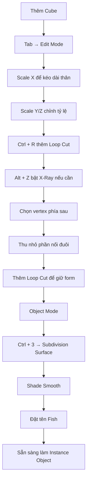

# 02 — Dựng mô hình cá đơn giản

| Thuộc tính          | Nội dung                                                      |
| ------------------- | ------------------------------------------------------------- |
| **Phân đoạn**       | Dựng hình                                                     |
| **Thời điểm**       | 00:36–02:13                                                   |
| **Chủ đề**          | Tạo một mô hình cá nhẹ để dùng làm hạt                        |
| **Đối tượng chính** | `Fish`                                                        |
| **Công cụ chính**   | Edit Mode, Scale, Loop Cut, Subdivision Surface, Shade Smooth |

---

## 1. Mục tiêu bài học

Sau phần này, người học có thể:

* Tạo **thân cá cơ bản** từ một Cube.
* Điều chỉnh tỷ lệ thân cá theo các trục `X`, `Y`, `Z`.
* Sử dụng **Loop Cut** để bổ sung hình học ở các vùng cần kiểm soát.
* Thu nhỏ phần cuối mesh để tạo vùng nối với đuôi.
* Làm mô hình tròn và mềm hơn bằng **Subdivision Surface**.
* Làm mượt bề mặt bằng **Shade Smooth**.
* Chuẩn bị một object cá nhẹ để sử dụng làm **Instance Object** cho Particle System.

---

## 2. Mục đích của mô hình cá

Trong dự án này, mô hình cá không phải là phần trọng tâm.

Mục tiêu chính là tạo một mesh:

* đủ đơn giản;
* có hình dáng giống cá;
* dễ nhận biết từ xa;
* ít polygon;
* phù hợp để nhân bản hàng chục hoặc hàng trăm lần.

Có thể hình dung pipeline như sau:

```text
Cube
  │
  ▼
Kéo dài thân
  │
  ▼
Thêm Loop Cut
  │
  ▼
Tạo đầu + thân + phần nối đuôi
  │
  ▼
Subdivision Surface
  │
  ▼
Shade Smooth
  │
  ▼
Fish
  │
  ▼
Instance Object
```

---

# 3. Bắt đầu từ Cube

## Bước 1 — Thêm Cube

Tạo một Cube mới:

```text
Shift + A
   ↓
Mesh
   ↓
Cube
```

Cube sẽ đóng vai trò là hình học ban đầu của thân cá.

---

## Bước 2 — Chuyển sang Edit Mode

Chọn Cube và nhấn:

```text
Tab
```

để chuyển từ:

```text
Object Mode
    ↓
Edit Mode
```

Trong Edit Mode, ta có thể chỉnh trực tiếp:

* Vertex;
* Edge;
* Face.

---

# 4. Tạo tỷ lệ cơ bản cho thân cá

## Bước 3 — Kéo dài thân

Sử dụng:

```text
S → X
```

để kéo dài Cube theo trục `X`.

Ví dụ:

```text
Ban đầu:

┌─────┐
│     │
└─────┘


Sau khi Scale X:

┌───────────────────┐
│                   │
└───────────────────┘
```

Kết quả là một khối dài giống phần thân cơ bản của cá.

---

## Bước 4 — Điều chỉnh độ rộng và chiều cao

Tiếp tục sử dụng:

```text
S → Y
```

để điều chỉnh độ dày/thân theo một trục ngang.

Và:

```text
S → Z
```

để điều chỉnh chiều cao.

Có thể hiểu như sau:

```text
             Z
             ↑
             │
       ┌──────────┐
       │          │
       │   Fish   │
       │          │
       └──────────┘
             │
             └────────────► X

Y = chiều sâu / độ dày của thân
```

Mục tiêu là tạo một hình khối có:

* thân dài;
* chiều cao vừa phải;
* chiều dày nhỏ hơn chiều dài.

---

# 5. Thêm hình học bằng Loop Cut

## Bước 5 — Sử dụng Loop Cut

Nhấn:

```text
Ctrl + R
```

để thêm **Loop Cut**.

Loop Cut chia mesh thành nhiều phần hơn để có thể kiểm soát hình dáng.

Ví dụ:

```text
Mesh ban đầu:

┌──────────────────────┐
│                      │
└──────────────────────┘


Sau khi thêm Loop Cut:

┌─────┬──────┬──────┬─────┐
│     │      │      │     │
└─────┴──────┴──────┴─────┘
```

---

## Vì sao cần Loop Cut?

Subdivision Surface sẽ cố gắng làm mượt toàn bộ mesh.

Nếu mesh quá ít cạnh:

```text
Cube
   ↓
Subdivision
   ↓
hình dạng quá tròn / khó kiểm soát
```

Loop Cut giúp xác định:

* vùng đầu;
* vùng giữa thân;
* phần thu hẹp về phía đuôi.

---

# 6. Sử dụng X-Ray để chọn vertex

Trong một số trường hợp, khi nhìn từ một phía, Blender chỉ chọn các vertex đang nhìn thấy.

Để chọn cả vertex ở mặt trước và mặt sau, có thể bật **X-Ray**.

Phím tắt:

```text
Alt + Z
```

Khi X-Ray được bật:

```text
Mặt trước   +   Mặt sau
      ╲         ╱
       ╲       ╱
        ▼     ▼
      đều có thể chọn
```

Điều này đặc biệt hữu ích khi chỉnh toàn bộ một vòng vertex của thân cá.

---

# 7. Tạo phần cuối thân và đuôi

## Bước 6 — Chọn phần cuối mesh

Chọn nhóm vertex ở phía sau thân cá.

Ví dụ:

```text
Đầu                                 Đuôi

██████████████████████████████████░░
                                   ↑
                          vùng cần chỉnh
```

---

## Bước 7 — Thu nhỏ phần sau

Sử dụng Scale để thu nhỏ phần cuối.

Ví dụ:

```text
S → Z
```

để giảm chiều cao.

Có thể kết hợp:

```text
S → Y
```

để giảm độ dày.

Kết quả:

```text
Trước:

┌────────────────────────────┐
│                            │
└────────────────────────────┘


Sau:

┌───────────────────────╮
│                       ╰───
│                       ╭───
└───────────────────────╯
```

Phần cuối thân bắt đầu thu hẹp, tạo vùng chuyển tiếp sang đuôi.

---

# 8. Kiểm soát hình dạng đầu và đuôi

Thêm một số Loop Cut gần:

* đầu;
* giữa thân;
* phần nối với đuôi.

Ví dụ:

```text
       Đầu           Thân              Đuôi
        ↓             ↓                  ↓

   ╭───────┬─────────┬───────────┬──────╮
  /        │         │           │       ╲
 /         │         │           │        ╲
╰──────────┴─────────┴───────────┴─────────╯
          ↑                     ↑
      Loop Cut              Loop Cut
```

Loop Cut đặt gần nhau sẽ giữ vùng đó chắc hơn khi subdivision.

---

# 9. Subdivision Surface

Sau khi tạo hình dáng cơ bản, thêm **Subdivision Surface**.

Có thể sử dụng:

```text
Ctrl + 3
```

để thêm modifier Subdivision Surface với mức subdivision tương ứng.

> Thông thường thao tác này được thực hiện khi đang ở **Object Mode**.

Kết quả:

```text
Mesh góc cạnh
      │
      ▼
Subdivision Surface
      │
      ▼
Mesh mềm và tròn
```

---

## Trước và sau Subdivision

```text
Trước:

      ┌──────────────┐
   ┌──┘              └──┐
   └─────────────────────┘


Sau:

       ╭────────────╮
    ╭──╯            ╰──╮
    ╰──────────────────╯
```

Subdivision Surface không nhất thiết phải tạo thêm chi tiết thủ công.

Nó nội suy bề mặt dựa trên topology hiện tại.

---

# 10. Vai trò của Loop Cut với Subdivision

Khoảng cách giữa các edge ảnh hưởng mạnh đến độ cong của mesh.

### Edge xa nhau

```text
|             |
```

Subdivision tạo vùng cong mềm.

### Edge gần nhau

```text
|| 
```

Subdivision giữ hình dạng chặt hơn.

Có thể hiểu:

```text
Edge thưa
   ↓
Mềm / tròn


Edge dày
   ↓
Cứng / giữ form
```

Do đó:

* muốn đầu cá tròn → không cần quá nhiều edge gần nhau;
* muốn giữ phần nối đuôi → thêm Loop Cut gần khu vực đó.

---

# 11. Shade Smooth

Sau khi subdivision, bề mặt vẫn có thể hiển thị các mặt polygon.

Chọn object → nhấp chuột phải → chọn:

> **Shade Smooth**

Luồng xử lý:

```text
Mesh
 │
 ├── Subdivision Surface
 │
 └── Shade Smooth
        ↓
     bề mặt mềm
```

---

## Subdivision Surface và Shade Smooth khác nhau

Hai thao tác này không giống nhau.

| Công cụ                 | Vai trò                                     |
| ----------------------- | ------------------------------------------- |
| **Subdivision Surface** | Làm tăng độ mịn hình học                    |
| **Shade Smooth**        | Nội suy cách ánh sáng hiển thị giữa các mặt |

Có thể hình dung:

```text
Subdivision Surface
        ↓
thay đổi hình học


Shade Smooth
        ↓
thay đổi cách bề mặt được hiển thị
```

Thông thường nên sử dụng cả hai.

---

# 12. Đặt tên object

Sau khi hoàn thành mô hình:

```text
Object
   ↓
Rename
   ↓
Fish
```

Tên object:

```text
Fish
```

Việc đặt tên rõ ràng sẽ rất hữu ích ở bước Particle System, khi object này được chọn làm:

```text
Instance Object → Fish
```

---

# 13. Cấu trúc mô hình hoàn chỉnh

Mô hình cuối cùng có thể được hiểu gồm ba vùng:

```text
             FISH

      Đầu          Thân          Đuôi
       │             │             │
       ▼             ▼             ▼

     ╭───────╮──────────────────╮
   ╭─╯                           ╰─╮
  │                                ╲
   ╰─╮                           ╭─╯
     ╰───────────────────────────╯
```

Trong đó:

### Đầu

* tương đối tròn;
* lớn hơn phần nối đuôi.

### Thân

* dài;
* có thể hơi phình ở giữa.

### Cuống đuôi

* thu nhỏ;
* giúp tạo silhouette giống cá.

---

# 14. Phím tắt chính

| Phím tắt   | Công dụng                                        |
| ---------- | ------------------------------------------------ |
| `Tab`      | Chuyển giữa Object Mode và Edit Mode             |
| `S`        | Scale                                            |
| `S`, `X`   | Scale theo trục X                                |
| `S`, `Y`   | Scale theo trục Y                                |
| `S`, `Z`   | Scale theo trục Z                                |
| `Ctrl + R` | Thêm Loop Cut                                    |
| `Alt + Z`  | Bật/tắt X-Ray                                    |
| `Ctrl + 3` | Thêm Subdivision Surface với mức subdivision cao |
| `Z`        | Mở Pie Menu của Viewport Shading                 |

---

# 15. Nguyên tắc tối ưu mesh

Mô hình này sẽ được Particle System nhân bản nhiều lần.

Ví dụ:

```text
Fish
 │
 ├── Fish Instance 01
 ├── Fish Instance 02
 ├── Fish Instance 03
 ├── Fish Instance 04
 ├── ...
 └── Fish Instance 100
```

Vì vậy không nên tạo mesh quá nặng.

---

## Ví dụ

Giả sử:

```text
1 Fish = 500 vertices
```

Với 100 cá:

$$
500 \times 100 = 50,000
$$

vertex tương đương cần được xử lý trong cảnh.

Nếu:

```text
1 Fish = 50.000 vertices
```

thì:

$$
50,000 \times 100 = 5,000,000
$$

vertex.

Do đó:

> **Đối với hệ thống đàn cá, silhouette và chuyển động thường quan trọng hơn chi tiết hình học nhỏ.**

---

# 16. Nếu cá bị biến dạng sau Subdivision

Một lỗi phổ biến:

```text
Mesh ban đầu
      ↓
Subdivision
      ↓
đầu quá tròn
hoặc
đuôi bị co mạnh
```

Cách xử lý:

### Cách 1 — Thêm Loop Cut

```text
Ctrl + R
```

đặt edge gần vùng cần giữ form.

### Cách 2 — Điều chỉnh vị trí vertex

Chọn các vertex và dùng:

```text
G
```

để dịch chuyển.

### Cách 3 — Điều chỉnh Scale

Sử dụng:

```text
S
S → X
S → Y
S → Z
```

để tinh chỉnh tỷ lệ.

---

# 17. Kiểm tra hướng của Fish

Đây là bước quan trọng trước khi dùng cá làm Particle Instance.

Mô hình phải có hướng rõ ràng:

```text
Đuôi                           Đầu
  │                              │
  ▼                              ▼

<===== Fish =====================►
                                  hướng bơi
```

Nếu trục của Fish không phù hợp với hướng particle, các instance sau này có thể:

* quay ngang;
* bơi ngược;
* xoay sai;
* không hướng theo vận tốc.

Do đó nên xác định rõ:

> **Đâu là phía trước của Fish trước khi tạo Particle System.**

---

# 18. Workflow hoàn chỉnh



---

# 19. Checklist hoàn thành

* [ ] Đã tạo mô hình bắt đầu từ Cube.
* [ ] Thân cá được kéo dài theo trục chuyển động.
* [ ] Tỷ lệ chiều rộng và chiều cao hợp lý.
* [ ] Đã thêm Loop Cut để kiểm soát hình dạng.
* [ ] Phần cuối thân thu nhỏ về phía đuôi.
* [ ] Không có vùng bị biến dạng quá mức.
* [ ] Đã thêm Subdivision Surface.
* [ ] Bề mặt đã được Shade Smooth.
* [ ] Mesh vẫn đủ nhẹ để instance nhiều lần.
* [ ] Hướng đầu và đuôi đã được xác định rõ.
* [ ] Object được đặt tên là `Fish`.

---

# 20. Ghi nhớ nhanh

```text
Cube
 ↓
Scale
 ↓
Loop Cut
 ↓
Tạo silhouette cá
 ↓
Subdivision
 ↓
Shade Smooth
 ↓
Fish
```

Cốt lõi của phần này là:

> **Tạo một mô hình cá đơn giản, nhẹ và có silhouette rõ ràng — không cần chi tiết cao vì Fish sẽ được nhân bản nhiều lần trong Particle System.**

Sau bước này, object `Fish` đã sẵn sàng để được sử dụng làm **Instance Object** cho hệ thống đàn cá.

---

# Bài luyện tập

## Mục tiêu


## Đề bài


## Yêu cầu hoàn thành

- [ ] 
- [ ] 
- [ ] 

## Kết quả / lời giải


## Ghi chú
