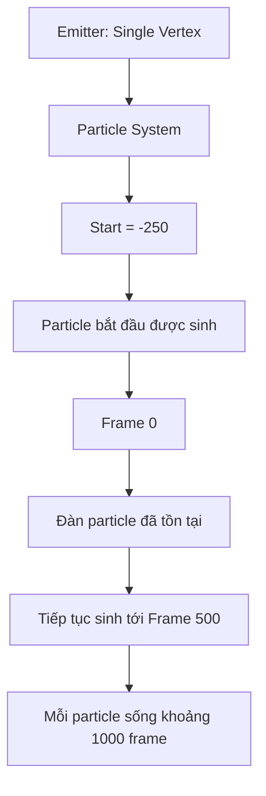
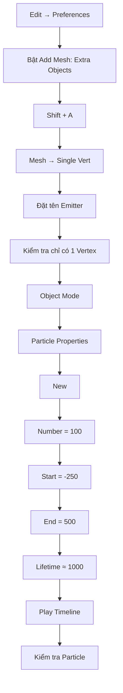

# 03 — Tạo emitter từ một Single Vertex

| Thuộc tính | Nội dung |
|---|---|
| **Phân đoạn** | Particle Emitter |
| **Thời điểm** | 02:13–04:07 |
| **Chủ đề** | Tạo một điểm phát và Particle System |
# 03 — Tạo Emitter từ một Single Vertex

| Thuộc tính        | Nội dung                                                    |
| ----------------- | ----------------------------------------------------------- |
| **Phân đoạn**     | Particle Emitter                                            |
| **Thời điểm**     | 02:13–04:07                                                 |
| **Chủ đề**        | Tạo một điểm phát và Particle System                        |
| **Object chính**  | `Emitter`                                                   |
| **Công cụ chính** | Single Vertex, Particle Properties, Emitter Particle System |

---

## 1. Mục tiêu bài học

Sau phần này, người học có thể:

* Tạo một object chỉ chứa **một vertex duy nhất**.
* Hiểu vai trò của vertex này như một **điểm phát hạt**.
* Tạo **Particle System** trên object `Emitter`.
* Thiết lập các thông số cơ bản như:

  * số lượng hạt;
  * thời điểm bắt đầu phát;
  * thời điểm kết thúc phát;
  * thời gian tồn tại của hạt.
* Kiểm tra hoạt động của Particle System trước khi gán mô hình cá.

---

# 2. Emitter là gì?

Trong Particle System, **Emitter** là object chịu trách nhiệm sinh ra các particle.

Thông thường emitter có thể là:

* Plane;
* Cube;
* Sphere;
* một mesh bất kỳ.

Trong bài này, emitter được đơn giản hóa thành **một vertex duy nhất**.

```text
Thông thường:

┌─────────────────┐
│     Emitter     │
│   • • • • •     │
└─────────────────┘
       ↓
 Particle sinh ra
 trên cả bề mặt


Trong bài này:

        ●
        │
        ▼
      Particle

● = Single Vertex
```

Ưu điểm của cách này là tất cả cá sẽ xuất hiện từ một khu vực rất nhỏ thay vì từ cả một bề mặt lớn.

---

# 3. Tại sao dùng Single Vertex?

Mục tiêu của dự án là tạo đàn cá bắt đầu từ một điểm rồi sau đó được Boids điều khiển.

Nếu dùng Plane:

```text
┌─────────────────────────┐
│ ↑     ↑      ↑      ↑   │
│   ↑      ↑       ↑      │
└─────────────────────────┘
```

các particle sẽ có thể xuất hiện trên nhiều vị trí khác nhau.

Trong khi đó, Single Vertex tạo ra:

```text
             ↗ Particle
           ↗
        ● ───────► Particle
           ↘
             ↘ Particle
```

Tức là:

> **Một điểm phát → nhiều particle → nhiều cá.**

---

# 4. Bật Add-on Add Mesh: Extra Objects

Trong Blender 2.8, lựa chọn tạo **Single Vert** có thể được cung cấp thông qua add-on:

> **Add Mesh: Extra Objects**

## Các bước

Mở:

```text
Edit
 ↓
Preferences
 ↓
Add-ons
```

Trong ô tìm kiếm, nhập:

```text
Add Mesh: Extra Objects
```

Sau đó bật add-on.

Quy trình:

```text
Edit
  ↓
Preferences
  ↓
Add-ons
  ↓
Search
  ↓
Add Mesh: Extra Objects
  ↓
Enable
```

Sau khi bật, có thể đóng cửa sổ Preferences.

---

# 5. Tạo Single Vertex

## Bước 1 — Mở menu Add

Trong 3D Viewport, nhấn:

```text
Shift + A
```

Chọn:

```text
Mesh
 ↓
Single Vert
```

Sau thao tác này, scene sẽ có một object rất nhỏ chỉ chứa một vertex.

```text
Emitter

      ●
```

---

## Bước 2 — Đặt tên object

Đổi tên object thành:

```text
Emitter
```

Cấu trúc scene lúc này có thể giống:

```text
Scene
│
├── Fish
│
└── Emitter
```

Trong đó:

* `Fish` = mô hình cá;
* `Emitter` = nguồn phát Particle System.

---

# 6. Kiểm tra Emitter

Có thể nhấn:

```text
Tab
```

để vào Edit Mode.

Nếu object được tạo đúng, chỉ nên thấy:

```text
●
```

tức là:

```text
Vertices = 1
Edges    = 0
Faces    = 0
```

Sau khi kiểm tra, nhấn:

```text
Tab
```

để quay lại **Object Mode**.

---

# 7. Nếu không có Single Vert

Nếu không tìm thấy:

```text
Shift + A
 → Mesh
 → Single Vert
```

có thể tạo thủ công.

## Cách làm

Tạo một mesh bất kỳ, ví dụ Cube:

```text
Shift + A
 ↓
Mesh
 ↓
Cube
```

Sau đó:

```text
Tab
 ↓
Edit Mode
```

Chọn toàn bộ:

```text
A
```

Xóa tất cả vertex:

```text
X
 ↓
Vertices
```

Sau đó tạo lại một vertex bằng công cụ phù hợp hoặc sử dụng add-on để bổ sung Single Vertex.

Mục tiêu cuối cùng vẫn là:

```text
Emitter
   │
   └── 1 Vertex
```

---

# 8. Tạo Particle System

Sau khi đã có `Emitter`, bước tiếp theo là thêm Particle System.

## Bước 1 — Chọn Emitter

Trong Outliner hoặc 3D Viewport, chọn:

```text
Emitter
```

Đảm bảo đang ở:

```text
Object Mode
```

---

## Bước 2 — Mở Particle Properties

Trong Properties Editor, mở:

> **Particle Properties**

Biểu tượng thường đại diện cho Particle System.

Sau đó nhấn:

```text
New
```

Blender sẽ tạo một Particle System mới cho `Emitter`.

---

# 9. Cấu trúc hệ thống lúc này

Sau bước này:

```text
Emitter
   │
   ▼
Particle System
   │
   ├── Particle 01
   ├── Particle 02
   ├── Particle 03
   ├── Particle 04
   └── ...
```

Nhưng hiện tại particle chưa phải là cá.

Chúng vẫn có thể xuất hiện dưới dạng:

* điểm;
* halo;
* object hiển thị mặc định của hệ thống.

Mô hình `Fish` sẽ được gán ở bước sau.

---

# 10. Kiểm tra Particle System

Nhấn:

```text
Space
```

hoặc nút:

```text
▶ Play
```

trên Timeline.

Quan sát Viewport.

Nếu hệ thống hoạt động, các particle sẽ bắt đầu được sinh ra từ vị trí của `Emitter`.

```text
Frame nhỏ:

●


Sau một thời gian:

● •
   •
     •
       •
```

Ở giai đoạn này chưa cần quan tâm đến chuyển động đẹp.

Mục tiêu chỉ là xác nhận:

> **Emitter có thực sự sinh particle hay không.**

---

# 11. Thiết lập số lượng Particle

Thông số:

```text
Number = 100
```

có nghĩa Particle System sẽ tạo tối đa khoảng:

```text
100 particle
```

Trong dự án này, mỗi particle sau đó sẽ trở thành một cá.

Do đó:

$$
100\ \text{particles}
\approx
100\ \text{fish instances}
$$

Có thể hình dung:

```text
Particle 01 → Fish
Particle 02 → Fish
Particle 03 → Fish
...
Particle 100 → Fish
```

---

# 12. Thiết lập thời điểm phát Particle

Các thông số ban đầu:

| Thông số        |             Giá trị |
| --------------- | ------------------: |
| **Number**      |               `100` |
| **Frame Start** |              `-250` |
| **Frame End**   |               `500` |
| **Lifetime**    | khoảng `1000` frame |

---

## Frame Start

Thiết lập:

```text
Start = -250
```

có nghĩa hệ thống bắt đầu phát particle từ trước frame `0`.

Timeline có thể hình dung như sau:

```text
-250                 0                         500
  │                  │                          │
  ├──────────────────┼──────────────────────────┤
  ↑                  ↑                          ↑
Bắt đầu phát      Cảnh bắt đầu              Kết thúc phát
```

---

# 13. Vì sao dùng Frame Start âm?

Nếu Particle System chỉ bắt đầu ở frame `0`:

```text
Frame 0

●
```

thì ngay lúc animation bắt đầu, đàn cá vẫn chưa hình thành.

Một thời gian sau:

```text
Frame 50

●    🐟
   🐟
       🐟
```

Điều này có thể không phù hợp nếu muốn cảnh mở đầu đã có sẵn một đàn cá.

Dùng Start âm:

```text
Frame -250
     ↓
Particle bắt đầu chạy
     ↓
     ↓
Frame 0
     ↓
Đàn đã được hình thành
```

Có thể hiểu đây là một dạng:

> **Pre-roll simulation**

tức cho mô phỏng chạy trước khi cảnh chính bắt đầu.

---

# 14. Frame End

Thiết lập:

```text
End = 500
```

có nghĩa particle tiếp tục được sinh ra cho tới khoảng frame `500`.

Ví dụ:

```text
Start                         End
-250                          500
  │                            │
  ├────────────────────────────┤
     Particle được sinh ra
```

Khoảng Start → End quyết định **thời gian emission**, không phải thời gian particle tồn tại.

---

# 15. Lifetime

Thông số:

```text
Lifetime ≈ 1000
```

quyết định mỗi particle tồn tại bao lâu sau khi được sinh ra.

Ví dụ:

```text
Particle sinh tại frame 20

20
│
├──────────────────────────────►
                              1020

Lifetime ≈ 1000 frame
```

Nếu Lifetime quá ngắn, cá có thể biến mất giữa animation.

---

# 16. Phân biệt Start, End và Lifetime

Đây là ba thông số rất dễ nhầm.

| Thông số     | Ý nghĩa                                    |
| ------------ | ------------------------------------------ |
| **Start**    | Frame bắt đầu sinh particle                |
| **End**      | Frame cuối cùng sinh particle              |
| **Lifetime** | Một particle tồn tại trong bao nhiêu frame |

Ví dụ:

```text
Start = 1
End = 100
Lifetime = 500
```

có nghĩa:

```text
Frame 1 ───────── Frame 100
     Particle được sinh

Particle sinh ở frame 50
          │
          └──────── tồn tại thêm 500 frame
```

---

# 17. Luồng hoạt động của Particle System



---

# 18. Mối quan hệ giữa Emitter và Fish

Ở thời điểm hiện tại:

```text
Emitter
   │
   ▼
Particles
```

Chưa có liên kết:

```text
Particles
   ✕
 Fish
```

Bước tiếp theo của dự án sẽ biến cấu trúc thành:

```text
Emitter
   │
   ▼
Particle System
   │
   ▼
Particles
   │
   ▼
Fish Instance
```

Tức là:

> Mỗi particle trở thành một bản sao của object `Fish`.

---

# 19. Lỗi thường gặp

## 19.1. Không thấy Particle

Nếu nhấn Play nhưng không thấy gì, kiểm tra:

### Kiểm tra Particle System

Object `Emitter` phải thực sự có Particle System.

```text
Emitter
   └── Particle System
```

---

### Kiểm tra Start và End

Timeline phải nằm trong phạm vi phù hợp.

Ví dụ:

```text
Start = 100
End   = 200
```

nhưng đang xem:

```text
Frame = 10
```

thì particle chưa được phát.

---

### Kiểm tra Number

Đảm bảo:

```text
Number > 0
```

---

# 20. Particle xuất hiện quá nhiều

Nếu viewport khó quan sát, giảm:

```text
Number
```

xuống:

```text
50
```

hoặc:

```text
100
```

Trong giai đoạn thử nghiệm, không cần sử dụng hàng nghìn particle.

Workflow hợp lý:

```text
Test
 ↓
50–100 particle
 ↓
Tinh chỉnh Boids
 ↓
Kiểm tra hiệu năng
 ↓
Tăng số lượng nếu cần
```

---

# 21. Không tìm thấy Single Vert

Nếu menu không xuất hiện:

```text
Shift + A
 → Mesh
 → Single Vert
```

hãy kiểm tra:

```text
Edit
 ↓
Preferences
 ↓
Add-ons
 ↓
Add Mesh: Extra Objects
```

Nếu vẫn không có, có thể tạo một mesh một đỉnh bằng phương pháp thủ công.

Điểm quan trọng không phải công cụ tạo nó, mà là kết quả:

```text
Emitter
│
└── đúng 1 vertex
```

---

# 22. Particle phát không đúng vị trí

Particle sẽ xuất hiện tại vị trí của vertex.

Do đó:

```text
Emitter Location
       │
       ▼
      ●
       │
       ▼
Particle Spawn Position
```

Nếu muốn thay đổi nơi đàn cá xuất hiện, có thể di chuyển object `Emitter`.

Ví dụ:

```text
G
```

sau đó chọn trục:

```text
G → X
G → Y
G → Z
```

---

# 23. Vì sao nên đặt tên Emitter?

Khi scene bắt đầu phức tạp, có thể có:

```text
Camera
Light
Fish
Cube
Empty
Curve
Particle Object
...
```

Nếu không đặt tên rõ ràng, rất khó biết object nào thực hiện chức năng gì.

Cấu trúc tốt:

```text
Scene
│
├── Camera
├── Light
├── Fish
├── Emitter
└── Leader
```

Tên `Emitter` cho biết ngay:

> Đây là object chịu trách nhiệm phát đàn cá.

---

# 24. Workflow hoàn chỉnh



---

# 25. Sơ đồ tổng thể đến thời điểm hiện tại

Sau ba phần đầu tiên, dự án đang có cấu trúc:

```text
PROJECT
│
├── Fish
│    │
│    └── Mesh cá đơn giản
│
└── Emitter
     │
     └── Single Vertex
           │
           ▼
     Particle System
           │
           ├── Particle 01
           ├── Particle 02
           ├── Particle 03
           └── ...
```

Chưa có:

```text
Boids
Instance Fish
Leader
```

Các thành phần này sẽ được bổ sung ở những bước tiếp theo.

---

# 26. Checklist hoàn thành

* [ ] Đã bật **Add Mesh: Extra Objects** nếu cần.
* [ ] Đã tạo một Single Vertex.
* [ ] Object được đặt tên là `Emitter`.
* [ ] `Emitter` chỉ có một vertex.
* [ ] Đã chuyển về Object Mode.
* [ ] Đã mở Particle Properties.
* [ ] Đã tạo Particle System bằng nút **New**.
* [ ] `Number` được đặt khoảng `50–100` để dễ kiểm tra.
* [ ] `Frame Start` được thiết lập phù hợp.
* [ ] `Frame End` được thiết lập phù hợp.
* [ ] `Lifetime` đủ dài để particle không biến mất sớm.
* [ ] Đã nhấn Play để kiểm tra Particle System.

---

# 27. Ghi nhớ nhanh

```text
Single Vertex
      │
      ▼
   Emitter
      │
      ▼
Particle System
      │
      ▼
 100 Particles
      │
      ▼
 Fish Instances
     (bước sau)
```

Cốt lõi của phần này là:

> **Tạo một điểm phát cực đơn giản và dùng nó làm nguồn cho toàn bộ đàn cá.**

Thiết lập `Start` ở frame âm giúp Particle System có thời gian chạy trước, nhờ đó khi animation chính bắt đầu ở frame `0`, đàn cá có thể đã xuất hiện và sẵn sàng cho bước thiết lập **Fish Instance và Boids**.
## Tạo Single Vertex

Trong Blender 2.8, công cụ tạo Single Vertex có thể nằm trong add-on **Add Mesh: Extra Objects**.

1. Mở **Edit > Preferences > Add-ons**.
2. Tìm `Add Mesh: Extra Objects`.
3. Bật add-on nếu chưa được bật.
4. Đóng Preferences.
5. Nhấn `Shift + A`.
6. Chọn **Mesh > Single Vert**.
7. Đặt tên object là `Emitter`.

Nếu menu không có Single Vert, có thể tạo một mesh tạm, vào Edit Mode, xóa toàn bộ đỉnh rồi thêm lại một đỉnh duy nhất.

## Tạo Particle System

1. Chọn `Emitter`.
2. Chuyển sang Object Mode.
3. Mở tab **Particle Properties**.
4. Nhấn **New**.
5. Kiểm tra bằng cách nhấn Play.

Ở giai đoạn này, hạt thường hiển thị dưới dạng điểm hoặc vật thể mặc định. Chưa cần gán mô hình cá ngay.

## Thông số ban đầu

- **Number:** 100
- **Frame Start:** -250
- **End:** 500
- **Lifetime:** khoảng 1.000 frame

Frame Start âm cho phép hệ thống có thời gian chuẩn bị trước khi bắt đầu quan sát cảnh từ frame 0. Có thể dùng các giá trị nhỏ hơn nếu cần cảnh ngắn.

## Lỗi thường gặp

### Không thấy hạt

Kiểm tra xem đã tạo Particle System chưa và timeline có đang nằm trong khoảng Start đến End hay không.

### Hạt phát ra quá nhiều

Giảm **Number** xuống khoảng 50–100 để dễ kiểm tra.

### Không tìm thấy Single Vert

Bật add-on **Add Mesh: Extra Objects** hoặc tạo mesh một đỉnh thủ công.

## Checklist

- [ ] Đã tạo object `Emitter`.
- [ ] Emitter chỉ có một đỉnh.
- [ ] Đã tạo Particle System.
- [ ] Số lượng hạt được giảm xuống mức dễ kiểm tra.

---

# Bài luyện tập

## Mục tiêu


## Đề bài


## Yêu cầu hoàn thành

- [ ] 
- [ ] 
- [ ] 

## Kết quả / lời giải


## Ghi chú
