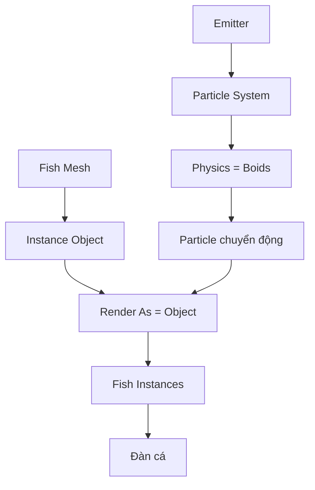
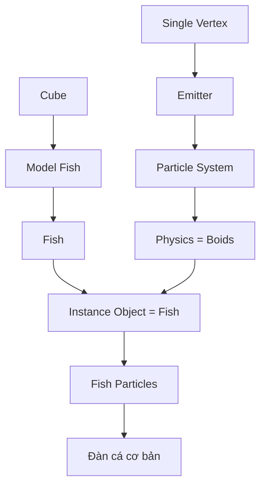

# 04 — Cấu hình Particle System và Instance Object

| Thuộc tính               | Nội dung                              |
| ------------------------ | ------------------------------------- |
| **Phân đoạn**            | Thiết lập hạt                         |
| **Thời điểm**            | 04:07–05:25                           |
| **Chủ đề**               | Dùng mô hình cá thay cho hạt mặc định |
| **Object phát hạt**      | `Emitter`                             |
| **Object được nhân bản** | `Fish`                                |
| **Physics**              | Boids                                 |
| **Render Type**          | Object                                |

---

## 1. Mục tiêu bài học

Sau phần này, người học có thể:

* Chuyển hệ thống hạt từ vật lý mặc định sang **Boids**.
* Hiểu vai trò cơ bản của `Mass` trong mô phỏng.
* Sử dụng object `Fish` để thay thế hình dạng particle mặc định.
* Kiểm tra hệ thống Fish Instance trong Viewport.
* Phát hiện và sửa các vấn đề liên quan đến:

  * hướng của cá;
  * kích thước;
  * scale;
  * thời điểm xuất hiện;
  * object cá gốc.

Mục tiêu chính của phần này là chuyển hệ thống:

```text
Particle
   ↓
Điểm / Halo mặc định
```

thành:

```text
Particle
   ↓
Fish Instance
   ↓
🐟
```

---

# 2. Trạng thái hệ thống trước khi cấu hình

Sau phần trước, scene đã có hai object chính:

```text
Scene
│
├── Fish
│
│   └── Mesh cá gốc
│
└── Emitter
    │
    └── Particle System
```

Particle System đã có khả năng sinh hạt, nhưng các particle chưa được hiển thị thành cá.

Có thể hình dung:

```text
Emitter
   │
   ▼
Particle System
   │
   ├── •
   ├── •
   ├── •
   ├── •
   └── •
```

Sau phần này, cấu trúc sẽ trở thành:

```text
Emitter
   │
   ▼
Particle System
   │
   ├── 🐟
   ├── 🐟
   ├── 🐟
   ├── 🐟
   └── 🐟
```

---

# 3. Chuyển Physics sang Boids

## Bước 1 — Chọn Emitter

Trong Outliner hoặc 3D Viewport, chọn:

```text
Emitter
```

Điều quan trọng là phải chọn đúng object chứa Particle System.

Nếu chọn `Fish`, các thiết lập Particle Properties của `Emitter` sẽ không xuất hiện.

---

## Bước 2 — Mở Particle Properties

Trong Properties Editor, mở:

> **Particle Properties**

Tại đây có thể truy cập các nhóm thiết lập như:

* Emission;
* Physics;
* Render;
* Rotation;
* Field Weights;
* Boid Brain;
* Display.

---

## Bước 3 — Tìm phần Physics

Trong phần:

```text
Physics
```

chuyển loại vật lý sang:

```text
Boids
```

Luồng thay đổi:

```text
Particle System
       │
       ▼
Physics
       │
       ▼
Boids
```

---

# 4. Vì sao sử dụng Boids?

Nếu sử dụng Particle System thông thường, các particle chủ yếu chịu ảnh hưởng bởi:

* vận tốc ban đầu;
* trọng lực;
* lực vật lý;
* field;
* lifetime.

Chúng không thực sự có hành vi bầy đàn.

Ví dụ:

```text
Particle thông thường

• ─────►
• ─────►
• ─────►
• ─────►
```

Trong khi đó, Boids cho phép mỗi particle hoạt động giống một cá thể.

```text
                 Leader
                   ●
                  ↗
      🐟 → 🐟 → 🐟
        ↗      ↘
      🐟        🐟
```

Mỗi con cá có thể phản ứng với:

* cá khác;
* mục tiêu;
* khoảng cách;
* tốc độ;
* hướng của đàn.

Do đó:

> **Particle System tạo số lượng cá, còn Boids tạo hành vi cho đàn cá.**

---

# 5. Thiết lập Mass

Sau khi chuyển Physics sang Boids, tìm thông số:

```text
Mass
```

Có thể đặt giá trị khởi đầu:

```text
Mass ≈ 0.2 kg
```

Đây là một giá trị thử nghiệm phù hợp để bắt đầu tinh chỉnh.

---

## Vai trò của Mass

`Mass` có thể ảnh hưởng đến cách particle phản ứng với một số yếu tố vật lý và các lực trong hệ thống.

Có thể hiểu đơn giản:

```text
Mass nhỏ
   ↓
Particle nhẹ
   ↓
dễ phản ứng hơn với lực


Mass lớn
   ↓
Particle nặng hơn
   ↓
phản ứng khác với lực
```

Tuy nhiên:

> `Mass` không phải thông số duy nhất quyết định chuyển động của Boids.

Chuyển động cuối cùng còn phụ thuộc vào:

* Boid Rules;
* Max Speed;
* Min Speed;
* Acceleration;
* Personal Space;
* Goal;
* Leader;
* các force field khác.

---

# 6. Cấu hình Render Particle thành Object

Particle hiện tại vẫn có thể được hiển thị dưới dạng mặc định.

Để mỗi particle trở thành một cá, cần thay đổi phần **Render**.

---

## Bước 1 — Mở Render

Trong Particle Properties, tìm:

```text
Render
```

---

## Bước 2 — Đổi Render As

Chuyển:

```text
Render As
```

sang:

```text
Object
```

Luồng:

```text
Render
  │
  ▼
Render As
  │
  ▼
Object
```

Khi chọn `Object`, Blender cho phép dùng một object có sẵn trong scene để đại diện cho từng particle.

---

# 7. Chọn Instance Object

Tại:

```text
Instance Object
```

chọn:

```text
Fish
```

Khi đó:

```text
Particle 01 → Fish
Particle 02 → Fish
Particle 03 → Fish
Particle 04 → Fish
...
```

Mỗi particle không tạo một mesh cá mới hoàn toàn độc lập.

Thay vào đó, hệ thống sử dụng mô hình `Fish` làm object được instance.

---

# 8. Instance là gì?

Có thể hiểu `Instance` là:

> Nhiều bản thể hiện cùng sử dụng một object gốc.

Ví dụ:

```text
             Fish gốc
                │
       ┌────────┼────────┐
       │        │        │
       ▼        ▼        ▼
    Fish 01  Fish 02  Fish 03
```

Về mặt logic:

```text
1 Mesh Fish
     ↓
Particle System
     ↓
100 Instances
```

thay vì phải tạo thủ công:

```text
Fish.001
Fish.002
Fish.003
Fish.004
...
Fish.100
```

Đây là một cách hiệu quả hơn khi cần tạo đàn lớn.

---

# 9. Kiểm tra bằng Timeline

Sau khi chọn:

```text
Render As → Object
Instance Object → Fish
```

nhấn:

```text
Space
```

hoặc nút:

```text
▶ Play
```

trên Timeline.

Nếu cấu hình đúng, particle sẽ xuất hiện dưới dạng cá.

```text
Trước:

•   •     •
    •
       •


Sau:

🐟   🐟     🐟
    🐟
        🐟
```

Đây là dấu hiệu cho thấy `Fish Instance` đã hoạt động.

---

# 10. Cấu trúc hoàn chỉnh của hệ thống

Sau bước này, pipeline đã trở thành:

```text
Fish Mesh
    │
    │ Instance Object
    ▼
Particle System
    ▲
    │
Emitter
    │
    ▼
Boids Physics
    │
    ▼
Fish Particles
```

Hoặc mô tả theo thứ tự xử lý:

```text
Emitter
   ↓
Sinh Particle
   ↓
Boids điều khiển Particle
   ↓
Mỗi Particle lấy hình dạng Fish
   ↓
Đàn cá xuất hiện
```

---

# 11. Sơ đồ tổng thể



Điểm quan trọng:

```text
Boids
  ↓
quyết định CHUYỂN ĐỘNG

Fish
  ↓
quyết định HÌNH DẠNG
```

---

# 12. Ẩn mô hình Fish gốc

Khi sử dụng object `Fish` làm Instance Object, object gốc vẫn tồn tại trong scene.

Do đó có thể xảy ra:

```text
Fish gốc             Đàn Fish Instance
   🐟               🐟 🐟 🐟 🐟
```

Nếu Fish gốc nằm trong khung camera, người xem có thể tưởng đó là một thành viên của đàn.

Có một số cách xử lý.

---

## Cách 1 — Di chuyển Fish gốc

Có thể đưa Fish gốc ra ngoài vùng camera.

Ví dụ:

```text
Camera View
┌─────────────────────────┐
│ 🐟 🐟 🐟                │
│     🐟      🐟          │
│                         │
└─────────────────────────┘


Fish gốc → đặt ngoài khung
```

---

## Cách 2 — Ẩn Fish gốc

Có thể kiểm soát khả năng hiển thị của object gốc tùy theo phiên bản Blender và workflow.

Mục tiêu là:

```text
Fish gốc
   │
   └── dùng làm nguồn instance

nhưng

Fish gốc
   │
   └── không xuất hiện trong render cuối
```

---

# 13. Kiểm tra hướng của cá

Một trong những lỗi dễ thấy nhất sau khi gán `Fish` là cá quay sai hướng.

Ví dụ:

```text
Particle đi sang phải:

────────────►


Nhưng cá:

◄🐟
```

Kết quả:

> Cá trông như đang bơi lùi.

---

# 14. Vì sao cá quay sai hướng?

Particle System dựa vào orientation của object gốc.

Nếu object `Fish` được dựng với đầu nằm theo trục không phù hợp, khi particle quay theo vận tốc thì Fish Instance cũng có thể bị lệch.

Ví dụ mô hình:

```text
+X
────────────────────────►

🐟 quay theo +X
```

sẽ cho kết quả khác với:

```text
+X
────────────────────────►

     🐟
     ↑
Fish lại hướng theo +Y
```

---

# 15. Xác định Forward Axis

Trước khi tiếp tục, cần xác định:

> Trục nào là hướng bơi về phía trước của Fish?

Ví dụ:

```text
                 +X
                  →
       ──────────────────

Đuôi               Đầu
  ╲                 ╭──
   ╲════════════════🐟──►
```

Nếu Fish bơi theo `+X`, đầu cá nên hướng về `+X`.

Tương tự nếu hệ thống được thiết kế theo `+Y` hoặc trục khác.

---

# 16. Sửa hướng cá

Nếu Fish Instance quay sai:

1. Chọn object `Fish`.
2. Xoay object bằng:

```text
R
```

hoặc:

```text
R → X
R → Y
R → Z
```

3. Đưa Fish về đúng hướng.
4. Kiểm tra lại Particle System.

Ví dụ:

```text
Sai:

   ↑ Fish
   🐟

Particle ─────────►


Đúng:

Particle ─────────► 🐟
```

---

# 17. Lưu ý về Apply Rotation

Nếu đã xoay object để sửa hướng nhưng hệ thống vẫn có biểu hiện không như mong muốn, có thể cần kiểm tra transform.

Workflow thường dùng:

```text
Object Mode
    ↓
Ctrl + A
    ↓
Rotation
```

hoặc:

```text
Ctrl + A
 ↓
Rotation & Scale
```

Mục tiêu là đưa transform hiện tại về trạng thái chuẩn.

Ví dụ:

```text
Trước Apply:

Rotation Z = 90°


Sau Apply:

Rotation Z = 0°

nhưng hướng nhìn của cá vẫn giữ nguyên
```

Điều này giúp giảm các vấn đề liên quan đến transform khi object được instance.

---

# 18. Kiểm tra kích thước cá

Sau khi gán `Fish`, có thể gặp:

```text
🐟 quá lớn
```

hoặc:

```text
.🐟
```

quá nhỏ so với scene.

---

## Nếu cá quá lớn

Giảm Scale:

```text
S
```

Ví dụ:

```text
S → 0.5
```

---

## Nếu cá quá nhỏ

Tăng Scale:

```text
S → 2
```

---

# 19. Nên Apply Scale

Sau khi điều chỉnh kích thước object `Fish`, nên kiểm tra Scale trong Transform.

Ví dụ:

```text
Scale X = 0.2
Scale Y = 0.2
Scale Z = 0.2
```

Có thể Apply Scale:

```text
Ctrl + A
 ↓
Scale
```

Sau đó:

```text
Scale X = 1
Scale Y = 1
Scale Z = 1
```

nhưng kích thước nhìn thấy của Fish vẫn được giữ nguyên.

---

# 20. Vì sao Apply Scale quan trọng?

Một số hệ thống trong Blender sử dụng transform của object làm dữ liệu đầu vào.

Nếu Fish có scale bất thường:

```text
X = 0.01
Y = 2.5
Z = 10
```

có thể gây khó kiểm soát khi:

* instance;
* rotation;
* parenting;
* constraint;
* modifier;
* export.

Workflow sạch hơn:

```text
Model Fish
     ↓
Chỉnh kích thước
     ↓
Ctrl + A
     ↓
Apply Scale
     ↓
Scale = 1, 1, 1
```

---

# 21. Kiểm tra thời gian xuất hiện của cá

Do Particle System trước đó đã thiết lập:

```text
Start = -250
End   = 500
Lifetime ≈ 1000
```

khi chuyển particle thành cá, các Fish Instance cũng tuân theo thời gian này.

Tức:

```text
Particle xuất hiện
        ↓
Fish xuất hiện


Particle chết
        ↓
Fish biến mất
```

---

# 22. Start âm và Fish Instance

Nếu Start được đặt âm:

```text
Start = -250
```

một phần particle có thể đã được sinh trước frame `0`.

Do đó ở frame đầu tiên của animation:

```text
Frame 0
```

scene có thể đã chứa một lượng cá.

```text
Frame -250

Emitter
   ●


Simulation chạy trước
      ↓


Frame 0

🐟   🐟
   🐟   🐟
       🐟
```

Điều này hữu ích để tránh cảnh mở đầu quá trống.

---

# 23. Lỗi — Particle vẫn là điểm

Nếu sau khi chọn `Fish`, particle vẫn xuất hiện như điểm, kiểm tra:

```text
Render As = Object
```

và:

```text
Instance Object = Fish
```

Pipeline phải là:

```text
Render
  ↓
Object
  ↓
Fish
```

---

# 24. Lỗi — Không thấy Fish Instance

Nếu không thấy cá, kiểm tra:

### Fish có tồn tại không?

```text
Scene
 └── Fish
```

### Instance Object đã chọn đúng chưa?

```text
Instance Object
      ↓
     Fish
```

### Scale có quá nhỏ không?

Nếu Fish rất nhỏ, có thể các instance đã xuất hiện nhưng gần như không nhìn thấy.

### Timeline có đúng không?

Kiểm tra:

```text
Start
End
Lifetime
Current Frame
```

---

# 25. Lỗi — Cá khổng lồ

Ví dụ:

```text
┌──────────────────────┐
│        🐟🐟🐟         │
│        🐟🐟🐟         │
└──────────────────────┘
```

Fish Instance quá lớn và chồng lên nhau.

Cách xử lý:

1. giảm Scale của `Fish`;
2. Apply Scale;
3. kiểm tra lại;
4. sau này tinh chỉnh thêm Personal Space của Boids.

---

# 26. Lỗi — Cá bơi ngang

Ví dụ particle chuyển động:

```text
────────────►
```

nhưng Fish lại:

```text
   ↑
  🐟
```

Nguyên nhân thường là orientation của object gốc.

Sửa:

```text
Fish
 ↓
Rotate
 ↓
Apply Rotation
 ↓
Check
```

---

# 27. Lỗi — Cá bơi bằng đuôi

Nếu:

```text
Particle ───────►

◄🐟
```

Fish đang quay ngược 180°.

Có thể sửa bằng:

```text
R → Z → 180
```

hoặc trục thích hợp tùy orientation của mô hình.

Sau đó Apply Rotation nếu cần.

---

# 28. Mối quan hệ giữa ba thành phần chính

Tới đây hệ thống có ba thành phần quan trọng:

| Thành phần | Vai trò                                   |
| ---------- | ----------------------------------------- |
| `Emitter`  | Sinh particle                             |
| `Boids`    | Điều khiển hành vi/chuyển động            |
| `Fish`     | Hình dạng được hiển thị trên mỗi particle |

Có thể tóm tắt:

```text
Emitter
   │
   │ tạo
   ▼
Particle
   │
   │ điều khiển bởi
   ▼
Boids
   │
   │ hiển thị bằng
   ▼
Fish
```

---

# 29. Điều gì chưa được hoàn thiện?

Sau phần này, hệ thống đã có nhiều Fish Instance nhưng đàn cá chưa chắc đã chuyển động đẹp.

Có thể vẫn thấy:

* cá tụ lại;
* cá bay lung tung;
* đàn không có mục tiêu;
* cá xoay đột ngột;
* cá không giữ khoảng cách;
* chuyển động thiếu tự nhiên.

Đó là vì:

```text
Boids Physics
     ✓

nhưng

Boid Rules
     chưa hoàn thiện
```

Các hành vi như:

```text
Separation
Alignment
Cohesion
Goal
Avoid
Follow Leader
```

sẽ quyết định chất lượng chuyển động ở các bước tiếp theo.

---

# 30. Pipeline từ đầu dự án đến hiện tại



---

# 31. Cấu trúc Scene hiện tại

```text
Scene
│
├── Fish
│   │
│   ├── Fish Mesh
│   ├── Subdivision
│   └── Shade Smooth
│
└── Emitter
    │
    └── Particle System
        │
        ├── Physics
        │   └── Boids
        │
        └── Render
            │
            ├── Render As: Object
            └── Instance Object: Fish
```

Sau này sẽ bổ sung:

```text
Leader
   │
   └── Animation
```

và:

```text
Boid Rules
```

---

# 32. Thiết lập tham khảo

| Thuộc tính          | Giá trị khởi đầu             |
| ------------------- | ---------------------------- |
| **Physics Type**    | `Boids`                      |
| **Mass**            | khoảng `0.2 kg`              |
| **Render As**       | `Object`                     |
| **Instance Object** | `Fish`                       |
| **Fish Rotation**   | Hướng theo chiều bơi         |
| **Fish Scale**      | Phù hợp với kích thước scene |
| **Applied Scale**   | Khuyến nghị `1, 1, 1`        |

Các giá trị này chỉ là điểm khởi đầu.

Sau khi hệ thống hoạt động, có thể tiếp tục tinh chỉnh dựa trên kích thước scene và kiểu chuyển động mong muốn.

---

# 33. Checklist hoàn thành

* [ ] Đã chọn đúng object `Emitter`.
* [ ] Đã mở Particle Properties.
* [ ] Physics đã chuyển sang **Boids**.
* [ ] `Mass` đã có giá trị khởi đầu phù hợp.
* [ ] Đã mở phần Render.
* [ ] `Render As` được đặt thành **Object**.
* [ ] `Instance Object` được đặt thành `Fish`.
* [ ] Particle đã hiển thị thành cá.
* [ ] Cá có kích thước phù hợp.
* [ ] Hướng đầu và đuôi của cá đúng với hướng di chuyển.
* [ ] Đã kiểm tra Rotation của `Fish`.
* [ ] Đã kiểm tra Scale của `Fish`.
* [ ] Đã Apply Rotation/Scale nếu cần.
* [ ] Fish gốc không gây ảnh hưởng đến khung hình.
* [ ] Timeline hiển thị cá đúng thời điểm mong muốn.

---

# 34. Ghi nhớ nhanh

```text
Emitter
   ↓
Particle System
   ↓
Boids
   ↓
Particle chuyển động
   ↓
Render As: Object
   ↓
Instance Object: Fish
   ↓
🐟 🐟 🐟 🐟 🐟
```

Công thức cốt lõi của phần này là:

$$
\boxed{
\text{Particle}
+
\text{Boids Physics}
+
\text{Fish Instance}
====================

\text{Cá có khả năng tham gia mô phỏng bầy đàn}
}
$$

Điểm quan trọng nhất cần ghi nhớ:

> **Boids quyết định particle di chuyển như thế nào, còn `Fish` chỉ là hình dạng được gắn lên particle.**

Sau bước này, hệ thống đã thực sự chuyển từ một Particle System thông thường thành nền tảng của một **đàn cá Boids**, sẵn sàng cho bước tiếp theo là cấu hình các hành vi bầy đàn và vật thể `Leader`.

---

# Bài luyện tập

## Mục tiêu


## Đề bài


## Yêu cầu hoàn thành

- [ ] 
- [ ] 
- [ ] 

## Kết quả / lời giải


## Ghi chú
