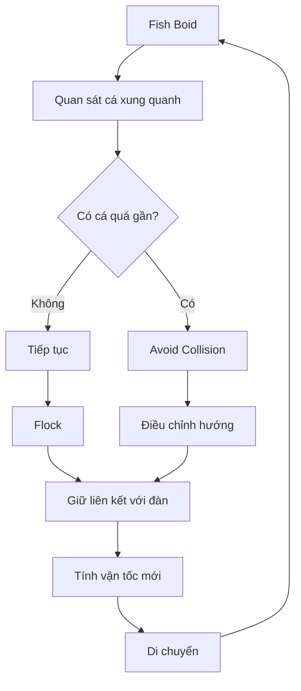
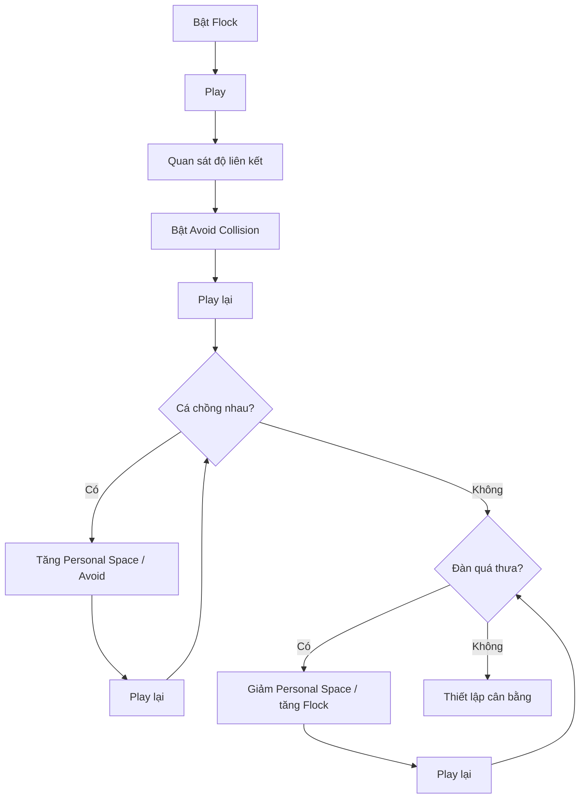

# 05 — Thiết lập hành vi đàn cá

| Thuộc tính         | Nội dung                                          |
| ------------------ | ------------------------------------------------- |
| **Phân đoạn**      | Boids Behavior                                    |
| **Thời điểm**      | 05:25–06:59                                       |
| **Chủ đề**         | Flock và Avoid Collision                          |
| **Hệ thống chính** | Boids                                             |
| **Hành vi chính**  | Flock, Avoid Collision                            |
| **Mục tiêu**       | Tạo đàn cá liên kết nhưng không chồng lấn quá mức |

---

## 1. Mục tiêu bài học

Sau phần này, người học có thể:

* Thiết lập **hành vi bầy đàn** cho các Fish Particle.
* Làm cho cá phản ứng với những cá thể xung quanh.
* Giữ đàn cá có xu hướng di chuyển cùng nhau.
* Hạn chế việc các mô hình cá:

  * chồng lên nhau;
  * xuyên qua nhau;
  * tập trung thành một khối quá dày.
* Điều chỉnh **Personal Space** để kiểm soát mật độ đàn.
* Hiểu cách cân bằng giữa:

  * **Flock** — giữ đàn liên kết;
  * **Avoid Collision** — giữ khoảng cách.

---

# 2. Trạng thái hệ thống trước bước này

Ở phần trước, Particle System đã được cấu hình:

```text
Emitter
   │
   ▼
Particle System
   │
   ▼
Physics = Boids
   │
   ▼
Render As = Object
   │
   ▼
Instance Object = Fish
```

Kết quả là các particle đã được hiển thị thành cá:

```text
🐟      🐟
    🐟
        🐟
 🐟
```

Tuy nhiên, chỉ bật `Boids` chưa đủ để tạo ra một đàn cá tự nhiên.

Cần thiết lập **Boid Brain / Behavior Rules** để quyết định cách từng cá thể phản ứng với những cá thể khác.

---

# 3. Boid Brain là gì?

Có thể hiểu **Boid Brain** là tập hợp các quy tắc hành vi được gán cho từng particle.

Mỗi con cá sẽ liên tục thực hiện quá trình:

```text
Quan sát môi trường
        │
        ▼
Phát hiện cá xung quanh
        │
        ▼
Áp dụng Boid Rules
        │
        ├── Giữ đàn
        ├── Tránh va chạm
        ├── Tìm mục tiêu
        └── Điều chỉnh hướng
        │
        ▼
Tính hướng di chuyển mới
```

Do đó, thay vì chuyển động hoàn toàn ngẫu nhiên, mỗi Fish Particle có thể phản ứng dựa trên trạng thái của đàn.

---

# 4. Hai hành vi quan trọng trong phần này

Phần này tập trung vào hai quy tắc:

```text
Boid Brain
   │
   ├── Flock
   │      ↓
   │   Giữ đàn liên kết
   │
   └── Avoid Collision
          ↓
       Tránh va chạm
```

Hai hành vi này cần được cân bằng.

Nếu chỉ tập trung vào việc tụ đàn:

```text
       🐟🐟
      🐟🐟🐟
       🐟🐟
```

cá có thể chồng lên nhau.

Nếu chỉ tập trung vào tránh nhau:

```text
🐟                 🐟


          🐟


                        🐟
```

đàn có thể bị phân tán.

Mục tiêu là:

```text
      🐟        🐟

          🐟

    🐟         🐟
         🐟

     → cùng di chuyển
```

---

# 5. Thiết lập Flock

## Bước 1 — Chọn Emitter

Chọn object:

```text
Emitter
```

Sau đó mở:

```text
Particle Properties
```

và tìm khu vực liên quan đến:

```text
Boid Brain
```

hoặc:

```text
Behavior
```

tùy giao diện của phiên bản Blender.

---

## Bước 2 — Thêm Flock

Thêm rule:

> **Flock**

Cấu trúc lúc này:

```text
Emitter
   │
   ▼
Particle System
   │
   ▼
Boids
   │
   ▼
Boid Brain
   │
   └── Flock
```

---

# 6. Flock có tác dụng gì?

`Flock` giúp các Boid phản ứng với các cá thể cùng đàn ở gần chúng.

Có thể hiểu đơn giản:

```text
Một cá thể
    │
    ▼
Quan sát cá xung quanh
    │
    ▼
Ước lượng chuyển động của đàn
    │
    ▼
Điều chỉnh hướng của chính nó
```

Kết quả là đàn cá bắt đầu có cảm giác:

* cùng di chuyển;
* cùng thay đổi hướng;
* không hoạt động như những particle hoàn toàn độc lập.

---

# 7. Trước và sau khi có Flock

### Trước

Các cá thể có thể chuyển động thiếu liên kết:

```text
🐟 ─────►


             🐟 ↗


   🐟 ▼


                       🐟 ◄────
```

Không có cảm giác rõ ràng về một đàn.

---

### Sau

Với Flock:

```text
        🐟 ───►
   🐟 ───►
          🐟 ───►
      🐟 ───►
```

Các cá thể có xu hướng phản ứng với nhau và tạo thành một nhóm chuyển động.

---

# 8. Flock không có nghĩa tất cả cá phải giống nhau

Một đàn cá tự nhiên không nên có dạng:

```text
🐟 🐟 🐟 🐟 🐟
🐟 🐟 🐟 🐟 🐟
```

với khoảng cách và hướng hoàn toàn giống nhau.

Mục tiêu tốt hơn là:

```text
       🐟
   🐟        🐟

       🐟
            🐟
     🐟
```

Các cá thể:

* cùng có xu hướng di chuyển;
* nhưng vẫn có sai lệch nhỏ về:

  * vị trí;
  * tốc độ;
  * hướng;
  * khoảng cách.

Chính sự sai lệch này làm chuyển động trông tự nhiên hơn.

---

# 9. Thêm Avoid Collision

Sau khi Flock hoạt động, thêm rule:

> **Avoid Collision**

Cấu trúc:

```text
Boid Brain
│
├── Flock
│
└── Avoid Collision
```

---

# 10. Vai trò của Avoid Collision

Nếu không có cơ chế tránh va chạm, nhiều Boid có thể cố gắng chiếm cùng một vùng không gian.

Ví dụ:

```text
Không tránh va chạm:

       🐟
      🐟🐟
     🐟🐟🐟
      🐟🐟
```

Vì Fish chỉ là object được instance lên particle, chúng có thể nhìn như đang:

* xuyên qua nhau;
* nhập vào nhau;
* chồng mesh.

Avoid Collision giúp giảm hiện tượng này.

```text
Có tránh va chạm:

🐟        🐟

    🐟

        🐟
             🐟
```

---

# 11. Logic của Avoid Collision

Có thể hình dung mỗi cá có một vùng an toàn xung quanh.

```text
       Personal Space
       ┌───────────┐
       │           │
       │    🐟     │
       │           │
       └───────────┘
```

Khi một cá khác đi vào vùng này:

```text
       ┌───────────┐
       │ 🐟 → 🐟   │
       └───────────┘
```

Boid sẽ cố gắng điều chỉnh hướng để tăng khoảng cách:

```text
🐟 ↖

       🐟 ↘
```

---

# 12. Personal Space

Một trong những thông số quan trọng nhất khi tạo đàn cá là:

> **Personal Space**

Có thể hiểu đây là khoảng không gian mà một Boid muốn giữ xung quanh chính nó.

---

## Personal Space thấp

```text
🐟🐟🐟
 🐟🐟
🐟🐟🐟
```

Đàn trở nên:

* rất dày;
* dễ chồng mesh;
* có thể trông như một khối.

---

## Personal Space cao

```text
🐟


             🐟


       🐟


                       🐟
```

Đàn có thể:

* thưa;
* phân tán;
* mất cảm giác liên kết.

---

## Personal Space cân bằng

```text
     🐟       🐟

         🐟

   🐟       🐟

          🐟
```

Đây thường là kết quả mong muốn.

---

# 13. Flock và Personal Space đối lập nhau như thế nào?

Có thể hình dung hai lực chính:

```text
Flock
  ↓
"Kéo tôi về với đàn"


Personal Space / Avoid Collision
  ↓
"Đừng đứng quá gần tôi"
```

Một Fish Particle phải cân bằng hai yêu cầu:

```text
          Flock
            ↓
     ←──── 🐟 ────→
            ↑
      Avoid Collision
```

Kết quả tự nhiên xuất hiện khi:

$$
\text{Cohesion của đàn}
\approx
\text{Khoảng cách cá thể hợp lý}
$$

---

# 14. Trường hợp đàn cá dồn thành một khối

Nếu kết quả giống:

```text
        🐟🐟
      🐟🐟🐟🐟
       🐟🐟🐟
```

thì các cá thể đang ở quá gần nhau.

Có thể thử:

1. Tăng **Personal Space**.
2. Tăng ảnh hưởng của **Avoid Collision**.
3. Kiểm tra mức ảnh hưởng của Flock.
4. Giảm các lực hút quá mạnh nếu có.

---

## Quy trình điều chỉnh

```text
Cá chồng nhau
     │
     ▼
Tăng Personal Space
     │
     ▼
Play
     │
     ├── Tốt → Giữ
     │
     └── Vẫn dồn
            │
            ▼
     Tăng Avoid Collision
```

---

# 15. Trường hợp đàn cá tách quá xa

Nếu kết quả giống:

```text
🐟


                    🐟


         🐟


                              🐟
```

thì đàn đã bị phân tán quá mức.

Có thể:

* giảm `Personal Space`;
* tăng ảnh hưởng của `Flock`;
* giảm hành vi tránh quá mạnh;
* giảm các thay đổi hướng quá đột ngột.

---

## Quy trình

```text
Đàn quá thưa
     │
     ▼
Giảm Personal Space
     │
     ▼
Play
     │
     ├── Tốt → Giữ
     │
     └── Vẫn phân tán
            │
            ▼
        Tăng Flock
```

---

# 16. Trường hợp đàn rung hoặc đổi hướng quá mạnh

Một lỗi khác có thể xuất hiện:

```text
🐟 ↗ ↘ ↗ ↘ ↗
```

Cá liên tục sửa hướng và tạo cảm giác rung hoặc giật.

Nguyên nhân có thể là:

* lực tránh quá mạnh;
* Personal Space quá lớn;
* tốc độ hoặc khả năng đổi hướng quá cao;
* nhiều rule cùng cạnh tranh với nhau.

Mục tiêu tốt hơn:

```text
🐟 ───╮
       ╰──────►
```

thay vì:

```text
🐟 ↗↘↗↘↗↘
```

---

# 17. Ưu tiên chuyển động mượt

Đối với đàn cá, thay đổi hướng thường nên có độ trễ nhất định.

Ví dụ:

### Không tự nhiên

```text
──────►
       │
       ▼
```

đổi hướng gần như tức thời.

### Tự nhiên hơn

```text
────────╮
         ╰────╮
              ╰────►
```

Do đó, khi tinh chỉnh Boids, không chỉ nhìn vào vị trí của cá mà còn cần quan sát:

* tốc độ quay;
* độ cong quỹ đạo;
* mức tăng tốc;
* tốc độ phản ứng với cá khác.

---

# 18. Nguyên tắc thử nghiệm từng thông số

Một nguyên tắc quan trọng:

> **Chỉ thay đổi một nhóm thông số tại một thời điểm.**

Ví dụ không nên cùng lúc thay đổi:

```text
Personal Space
Flock
Speed
Acceleration
Avoid Collision
```

rồi Play lại.

Nếu kết quả tốt hoặc xấu, rất khó biết nguyên nhân.

---

## Workflow tốt

```text
Giữ nguyên tất cả
       │
       ▼
Thay Personal Space
       │
       ▼
Play
       │
       ▼
Quan sát
       │
       ▼
Ghi nhận kết quả
       │
       ▼
Thay thông số tiếp theo
```

---

# 19. Cách thử nghiệm có hệ thống

Có thể sử dụng bảng ghi chú:

| Lần thử | Personal Space |      Flock | Avoid Collision | Kết quả       |
| ------- | -------------: | ---------: | --------------: | ------------- |
| 1       |           thấp | trung bình |      trung bình | Cá chồng nhau |
| 2       |           tăng | trung bình |      trung bình | Tốt hơn       |
| 3       |            cao | trung bình |             cao | Đàn quá thưa  |
| 4       |            vừa |   tăng nhẹ |             vừa | Cân bằng      |

Cách này giúp tìm được thiết lập phù hợp nhanh hơn thay vì điều chỉnh ngẫu nhiên.

---

# 20. Quan sát từ nhiều góc

Đàn cá là chuyển động **3D**.

Không nên chỉ kiểm tra từ một góc camera.

Ví dụ từ Front View:

```text
🐟    🐟
   🐟
       🐟
```

có vẻ khoảng cách tốt.

Nhưng từ Top View có thể là:

```text
🐟🐟🐟🐟
```

các cá thực tế đang nằm gần như cùng một vị trí theo chiều sâu.

Do đó nên kiểm tra:

```text
Perspective View
Front View
Side View
Top View
```

để đánh giá khoảng cách chính xác hơn.

---

# 21. Kích thước Fish ảnh hưởng đến khoảng cách

Nếu Fish Instance lớn:

```text
🐟🐟
```

chỉ một khoảng cách nhỏ giữa particle cũng có thể khiến mesh chồng lên nhau.

Nếu Fish nhỏ:

```text
🐟       🐟
```

cùng khoảng cách particle có thể trông rất rộng.

Vì vậy:

> **Personal Space cần được đánh giá tương đối với kích thước Fish.**

Có thể hình dung:

$$
\text{Khoảng cách đàn hợp lý}
\propto
\text{Kích thước Fish}
$$

---

# 22. Personal Space không phải Collision vật lý chính xác

Điều quan trọng cần hiểu:

Boids được thiết kế để tạo **hành vi bầy đàn**, không phải mô phỏng collision chính xác như hệ thống rigid body.

Vì vậy, ngay cả khi có Avoid Collision, đôi lúc vẫn có thể thấy:

```text
🐟🐟
```

hai mesh giao nhau trong một vài frame.

Mục tiêu thường là:

> Giảm hiện tượng chồng lấn xuống mức khó nhận thấy trong animation.

Không nhất thiết phải đảm bảo từng polygon của từng con cá không bao giờ chạm nhau.

---

# 23. Vai trò của Rule Order

Khi hệ thống Boids có nhiều rule, thứ tự và mức ưu tiên của chúng có thể ảnh hưởng đến hành vi cuối cùng.

Sau này hệ thống có thể có:

```text
Boid Brain
│
├── Goal
├── Avoid Collision
├── Flock
└── ...
```

Một cá thể có thể đồng thời phải quyết định:

```text
"Đi theo Leader"
       +

"Không va vào cá khác"
       +

"Không rời khỏi đàn"
```

Do đó cần cân bằng các rule thay vì đặt mọi hành vi ở mức rất mạnh.

---

# 24. Ví dụ tình huống

Giả sử Leader nằm bên phải:

```text
                         ● Leader
```

Đàn cá đang di chuyển tới Leader:

```text
🐟     🐟
    🐟        ─────────► ●
 🐟     🐟
```

Một cá bắt đầu đi quá gần cá khác:

```text
🐟🐟 ─────────► ●
```

Avoid Collision tạo một thay đổi nhỏ:

```text
🐟 ↗
       ───────► ●
🐟 ↘
```

Sau khi vượt qua nhau:

```text
  🐟
        🐟 ───────────► ●
```

Flock lại giúp chúng quay về cấu trúc đàn.

Đây chính là sự kết hợp cần đạt được.

---

# 25. Vòng lặp hành vi của một Fish Boid



Quá trình này được lặp lại trong suốt simulation.

---

# 26. Sự cân bằng mong muốn

Ba trạng thái dễ gặp:

### Quá dày

```text
🐟🐟🐟🐟
 🐟🐟🐟
```

**Vấn đề:** collision / overlap.

---

### Quá thưa

```text
🐟             🐟


       🐟


                         🐟
```

**Vấn đề:** mất cảm giác đàn.

---

### Cân bằng

```text
      🐟
  🐟      🐟

      🐟
          🐟
   🐟
```

**Mục tiêu:** đàn có khoảng cách nhưng vẫn liên kết.

---

# 27. Quy trình tinh chỉnh đề xuất



---

# 28. Luồng Particle System hiện tại

Sau phần này, pipeline đã được mở rộng:

```text
Fish
  │
  └────────────┐
               ▼
Emitter → Particle System
               │
               ▼
             Boids
               │
               ▼
           Boid Brain
               │
         ┌─────┴─────┐
         ▼           ▼
       Flock     Avoid Collision
         │           │
         └─────┬─────┘
               ▼
        Fish Instances
               │
               ▼
        Đàn cá cơ bản
```

---

# 29. Sự khác biệt giữa các thành phần

| Thành phần          | Nhiệm vụ                          |
| ------------------- | --------------------------------- |
| **Particle System** | Tạo các cá thể                    |
| **Fish Instance**   | Quyết định hình dạng cá           |
| **Boids**           | Hệ thống hành vi                  |
| **Flock**           | Tạo cảm giác bầy đàn              |
| **Avoid Collision** | Giảm va chạm                      |
| **Personal Space**  | Điều chỉnh khoảng cách cá thể     |
| **Leader**          | Điều khiển hướng chung ở bước sau |

---

# 30. Điều gì sẽ xảy ra nếu chỉ dùng Flock?

Nếu chỉ có:

```text
Boid Brain
   └── Flock
```

đàn có thể giữ liên kết khá tốt nhưng dễ:

```text
🐟🐟🐟
```

tập trung quá gần nhau.

---

# 31. Điều gì sẽ xảy ra nếu chỉ dùng Avoid Collision?

Nếu chỉ có:

```text
Boid Brain
   └── Avoid Collision
```

các cá có thể tránh nhau nhưng không có lý do mạnh để duy trì đội hình đàn.

Kết quả có thể:

```text
🐟


               🐟


                           🐟
```

---

# 32. Vì sao cần kết hợp?

Hai hành vi bổ sung cho nhau:

$$
\boxed{
\text{Flock}
+
\text{Avoid Collision}
======================

\text{Đàn cá có tổ chức}
}
$$

Trong đó:

```text
Flock
  ↓
Giữ đàn

Avoid Collision
  ↓
Giữ khoảng cách
```

Kết quả:

```text
      🐟
 🐟       🐟
      🐟
   🐟       🐟
        ↓
   đàn liên kết
   nhưng không
   chồng quá mức
```

---

# 33. Lỗi thường gặp

## Cá chồng lên nhau quá nhiều

**Biểu hiện:**

```text
🐟🐟🐟🐟
```

**Cách xử lý:**

* tăng Personal Space;
* tăng Avoid Collision;
* kiểm tra kích thước Fish;
* giảm các lực hút quá mạnh.

---

## Đàn cá bị phân tán

**Biểu hiện:**

```text
🐟              🐟


          🐟


                             🐟
```

**Cách xử lý:**

* giảm Personal Space;
* tăng Flock;
* giảm Avoid Collision nếu quá mạnh.

---

## Cá rung liên tục

**Biểu hiện:**

```text
🐟 ↗↘↗↘↗
```

**Có thể thử:**

* giảm phản ứng tránh;
* giảm tốc độ đổi hướng;
* giảm Personal Space;
* kiểm tra xem nhiều rule có đang cạnh tranh quá mạnh hay không.

---

## Đàn tốt ở một góc nhưng xấu ở góc khác

Nguyên nhân có thể là khoảng cách theo chiều sâu chưa hợp lý.

Kiểm tra từ:

```text
Front
Side
Top
Perspective
```

---

# 34. Checklist hoàn thành

* [ ] Đã chọn đúng `Emitter`.
* [ ] Particle System đang sử dụng Physics `Boids`.
* [ ] Đã mở phần **Boid Brain / Behavior**.
* [ ] Đã thêm hoặc kích hoạt **Flock**.
* [ ] Đã Play để kiểm tra phản ứng giữa các cá.
* [ ] Đã thêm **Avoid Collision**.
* [ ] Cá không chồng lên nhau quá mức.
* [ ] `Personal Space` phù hợp với kích thước Fish.
* [ ] Đàn cá không bị phân tán quá xa.
* [ ] Chuyển động vẫn giữ được cảm giác liên kết.
* [ ] Không có hiện tượng rung hoặc đổi hướng quá mạnh.
* [ ] Đã kiểm tra simulation từ nhiều góc nhìn.
* [ ] Mỗi lần thử chỉ thay đổi một hoặc một nhóm nhỏ thông số.

---

# 35. Ghi nhớ nhanh

```text
            BOIDS
              │
      ┌───────┴───────┐
      │               │
      ▼               ▼
    Flock      Avoid Collision
      │               │
      ▼               ▼
 Giữ thành đàn    Tránh quá gần
      │               │
      └───────┬───────┘
              ▼
       Personal Space
              │
              ▼
      Đàn cá cân bằng
```

Cốt lõi của phần này là:

> **Flock giữ các cá thể liên kết thành đàn, còn Avoid Collision và Personal Space giúp chúng không tập trung quá gần nhau.**

Có thể tóm tắt bằng:

$$
\boxed{
\text{Đàn cá tự nhiên}
======================

\text{Liên kết}
+
\text{Khoảng cách}
+
\text{Chuyển hướng mượt}
}
$$

Sau bước này, đàn cá đã có **hành vi nội bộ cơ bản**. Bước tiếp theo thường là bổ sung **Goal hoặc Leader**, để toàn bộ đàn không chỉ bơi cùng nhau mà còn có một **mục tiêu và quỹ đạo chuyển động chung**.

---

# Bài luyện tập

## Mục tiêu


## Đề bài


## Yêu cầu hoàn thành

- [ ] 
- [ ] 
- [ ] 

## Kết quả / lời giải


## Ghi chú
