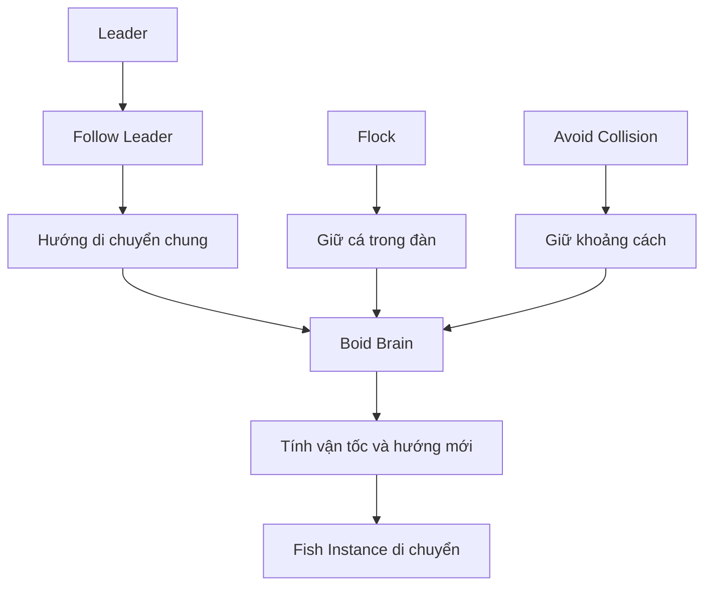
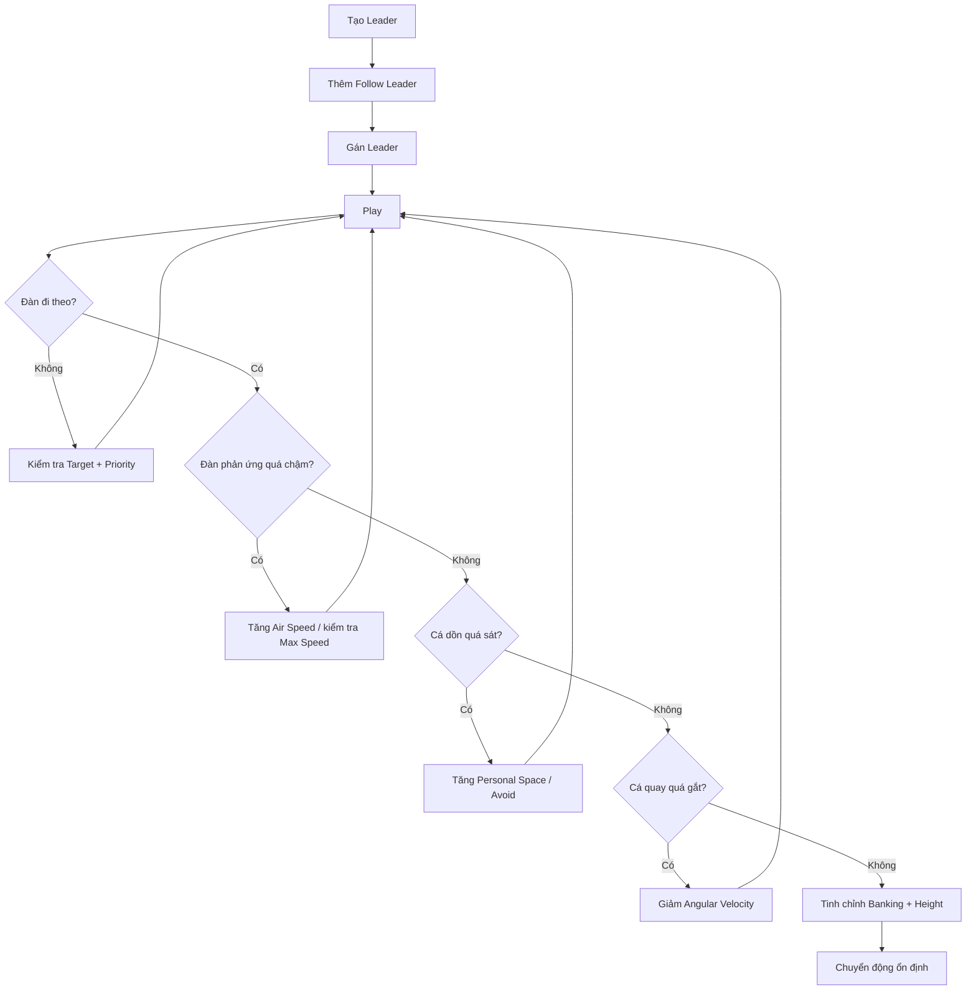
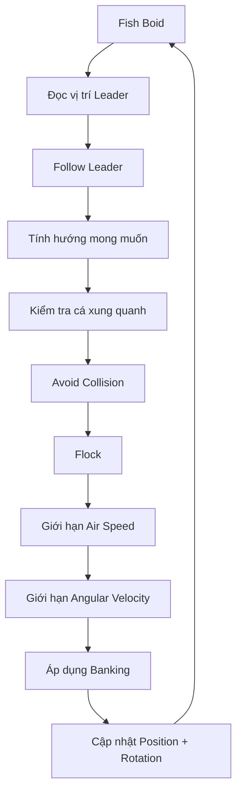

# 06 — Tạo và tinh chỉnh vật thể Leader

| Thuộc tính          | Nội dung                                    |
| ------------------- | ------------------------------------------- |
| **Phân đoạn**       | Follow Leader                               |
| **Thời điểm**       | 06:59–10:08                                 |
| **Chủ đề**          | Tạo vật thể dẫn đầu và làm đàn cá đi theo   |
| **Object chính**    | `Leader`                                    |
| **Boid Rule chính** | Follow Leader                               |
| **Mục tiêu**        | Điều khiển hướng di chuyển chung của đàn cá |

---

## 1. Mục tiêu bài học

Sau phần này, người học có thể:

* Tạo một object riêng để làm **Leader** cho đàn cá.
* Hiểu rằng Leader chỉ là một **mục tiêu điều khiển**, không nhất thiết phải là một con cá.
* Gán object `Leader` cho hành vi **Follow Leader** trong Boids.
* Điều chỉnh mức ưu tiên của Follow Leader so với các Boid Rule khác.
* Kiểm soát:

  * tốc độ di chuyển;
  * tốc độ quay;
  * khoảng cách giữa cá;
  * độ nghiêng khi đổi hướng;
  * mức dao động của đàn.
* Làm cho đàn cá đổi hướng theo Leader một cách mềm mại và tự nhiên hơn.

---

# 2. Vai trò của Leader

Ở phần trước, đàn cá đã có các hành vi nội bộ như:

```text
Flock
     ↓
Giữ đàn liên kết

Avoid Collision
     ↓
Giữ khoảng cách
```

Nhưng đàn vẫn chưa có một **mục tiêu chung rõ ràng**.

Leader sẽ giải quyết vấn đề này.

```text
🐟      🐟
    🐟
  🐟       🐟
             \
              \
               ► Leader
```

Có thể hiểu:

> **Leader quyết định đàn cá nên đi về đâu.**

Boids sẽ tự quyết định cách từng cá thể điều chỉnh chuyển động để đi theo mục tiêu đó.

---

# 3. Mối quan hệ giữa Leader và đàn cá

Leader không trực tiếp kéo các mesh cá.

Thay vào đó:

```text
Leader thay đổi vị trí
        │
        ▼
Follow Leader đọc vị trí mục tiêu
        │
        ▼
Boids tính hướng mới
        │
        ▼
Particle thay đổi vận tốc + rotation
        │
        ▼
Fish Instance đi theo
```

Vì vậy cấu trúc tổng thể là:

```text
Leader
   │
   ▼
Follow Leader
   │
   ▼
Boids
   │
   ▼
Particles
   │
   ▼
Fish Instances
```

---

# 4. Tạo vật thể Leader

## Bước 1 — Thêm một object mới

Nhấn:

```text
Shift + A
```

Sau đó có thể chọn:

```text
Mesh
  ↓
Icosphere
```

hoặc:

```text
Mesh
  ↓
UV Sphere
```

Cả hai đều phù hợp vì hình dạng của Leader không quan trọng đối với simulation.

---

## Bước 2 — Thu nhỏ Leader

Dùng:

```text
S
```

để giảm kích thước.

Ví dụ:

```text
S → 0.2
```

Leader chỉ cần đủ dễ nhìn trong Viewport.

Không cần tạo object lớn.

---

## Bước 3 — Đặt Leader phía trước đàn cá

Dùng:

```text
G
```

hoặc:

```text
G → X
G → Y
G → Z
```

để di chuyển Leader.

Ví dụ:

```text
Đàn cá                        Leader

🐟   🐟
   🐟      🐟  ───────────────► ●
      🐟
```

Leader nên đặt ở phía trước hướng mà ta muốn đàn cá di chuyển.

---

# 5. Đặt tên object

Đổi tên object thành:

```text
Leader
```

Scene lúc này có thể có:

```text
Scene
│
├── Fish
├── Emitter
└── Leader
```

Tên rõ ràng giúp thao tác dễ hơn khi chọn object trong Boid Rule.

---

# 6. Leader không cần xuất hiện trong render

Leader chỉ đóng vai trò như một object điều khiển.

Do đó nó không nhất thiết phải xuất hiện trong video cuối cùng.

Có thể hiểu:

```text
Viewport:

🐟 🐟 🐟 ─────► ● Leader


Render:

🐟 🐟 🐟 ─────►
```

Tùy workflow, Leader có thể:

* được ẩn khỏi render;
* đặt ngoài vùng camera;
* sử dụng một object đơn giản chỉ để điều khiển.

---

# 7. Gán Leader cho Boids

## Bước 1 — Chọn Emitter

Chọn:

```text
Emitter
```

vì Boid Rules nằm trong Particle System của Emitter.

Sau đó mở:

```text
Particle Properties
```

---

## Bước 2 — Mở Boid Brain

Tìm phần:

```text
Boid Brain
```

hoặc khu vực chứa các **Behavior Rules**.

Hiện tại có thể đã có:

```text
Boid Brain
│
├── Flock
└── Avoid Collision
```

---

# 8. Thêm Follow Leader

Thêm rule:

> **Follow Leader**

Sau đó cấu trúc trở thành:

```text
Boid Brain
│
├── Follow Leader
├── Flock
└── Avoid Collision
```

---

# 9. Chọn object Leader

Trong Follow Leader, tìm trường chọn object.

Có thể sử dụng:

> **Eyedropper**

rồi click vào object:

```text
Leader
```

Luồng thiết lập:

```text
Follow Leader
      │
      ▼
Target Object
      │
      ▼
   Leader
```

Sau bước này, Boids đã biết:

> Object nào là mục tiêu cần đi theo.

---

# 10. Kiểm tra Follow Leader

Nhấn:

```text
Space
```

hoặc:

```text
▶ Play
```

trên Timeline.

Nếu cấu hình đúng, đàn cá sẽ bắt đầu có xu hướng tiến về Leader.

```text
Frame đầu:

🐟       🐟

    🐟
                         ●


Sau một thời gian:

       🐟
            🐟
                🐟 ─────► ●
            🐟
```

---

# 11. Thử di chuyển Leader

Dừng animation, di chuyển Leader sang vị trí khác rồi Play lại.

Ví dụ:

### Trạng thái 1

```text
🐟 🐟 🐟 ───────────► ●
```

### Leader chuyển hướng

```text
                         ●
                       ↗
🐟 🐟 🐟 ────────────
```

### Đàn phản ứng

```text
       🐟
          ╲
   🐟      ╲
       🐟   ╰────────► ●
```

Nếu đàn thay đổi hướng theo vị trí mới của Leader, Follow Leader đang hoạt động.

---

# 12. Ưu tiên của Follow Leader

Một Boid có thể đồng thời thực hiện nhiều quy tắc.

Ví dụ:

```text
Follow Leader
     +
Flock
     +
Avoid Collision
```

Một cá thể có thể đồng thời phải xử lý:

```text
"Đi theo Leader"

"Ở cùng đàn"

"Không va vào cá khác"
```

Do đó, **thứ tự hoặc mức ưu tiên của rule** có thể ảnh hưởng đáng kể đến kết quả.

---

# 13. Đưa Follow Leader lên ưu tiên cao

Nếu Follow Leader có mức ưu tiên quá thấp:

```text
Boid Brain

1. Avoid Collision
2. Flock
3. Follow Leader
```

đàn có thể tập trung vào việc giữ đội hình nhưng phản ứng yếu với Leader.

Có thể thử đưa Follow Leader lên cao:

```text
Boid Brain

1. Follow Leader
2. Avoid Collision
3. Flock
```

Ý tưởng là:

```text
Leader
   ↓
Quyết định hướng chung

Avoid Collision
   ↓
Điều chỉnh để không va nhau

Flock
   ↓
Giữ cấu trúc đàn
```

Tuy nhiên, không nên hiểu rằng Follow Leader luôn phải áp đảo hoàn toàn các rule khác.

Mục tiêu vẫn là **cân bằng**.

---

# 14. Hệ thống hành vi sau khi có Leader



---

# 15. Air Speed

Một trong những thông số quan trọng cần tinh chỉnh là:

> **Air Speed**

Dù đối tượng đang mô phỏng cá trong nước, Boids của Blender sử dụng các thuật ngữ liên quan tới chuyển động trong không gian.

Có thể hiểu Air Speed đơn giản là:

> **Tốc độ di chuyển cơ bản của Boid.**

---

## Air Speed thấp

```text
🐟 ──►
```

Đàn:

* di chuyển chậm;
* phản ứng chậm với Leader;
* có thể bị tụt xa phía sau.

---

## Air Speed cao

```text
🐟 ───────────────►
```

Đàn:

* di chuyển nhanh;
* bám Leader nhanh hơn;
* nhưng có thể đổi hướng mạnh hoặc thiếu tự nhiên.

Do đó cần tìm tốc độ phù hợp với kích thước scene.

---

# 16. Maximum Air Speed

Thông số:

> **Maximum Air Speed**

đặt giới hạn cho vận tốc tối đa của Boid.

Có thể hình dung:

```text
Boid muốn tăng tốc
       │
       ▼
Current Speed
       │
       ▼
Maximum Air Speed
       │
       └── Không vượt quá giới hạn này
```

Điều này giúp tránh trường hợp cá tăng tốc quá mức khi Leader di chuyển nhanh.

---

# 17. Air Speed và Maximum Air Speed

Có thể hiểu đơn giản:

| Thông số              | Vai trò                 |
| --------------------- | ----------------------- |
| **Air Speed**         | Tốc độ hoạt động cơ bản |
| **Maximum Air Speed** | Giới hạn tốc độ tối đa  |

Ví dụ:

```text
Air Speed = tốc độ mong muốn

Maximum Air Speed = tốc độ trần
```

Khi Leader ở xa:

```text
🐟 -------------------------- ●
```

Boid có thể muốn tăng tốc để bắt kịp.

Maximum Air Speed giúp kiểm soát việc tăng tốc này.

---

# 18. Maximum Angular Velocity

Thông số:

> **Maximum Angular Velocity**

kiểm soát tốc độ Boid có thể đổi hướng.

Đây là thông số rất quan trọng đối với cá.

---

## Angular Velocity quá cao

Cá có thể:

```text
──────►
       │
       ▼
```

đổi hướng gần như tức thời.

Kết quả:

* cá giật;
* quay gấp;
* chuyển động thiếu trọng lượng.

---

## Angular Velocity hợp lý

Cá đổi hướng theo đường cong:

```text
────────────╮
             ╰──────╮
                    ╰────►
```

Trông giống chuyển động bơi hơn.

---

# 19. Leader đổi hướng và khả năng quay của cá

Giả sử Leader đang ở bên phải:

```text
🐟 ─────────────► ●
```

Sau đó Leader chuyển lên trên:

```text
                   ●
                   ↑

🐟 ────────────────
```

Nếu Angular Velocity quá lớn:

```text
🐟 ─────┐
        │
        ▼
```

cá quay rất gấp.

Nếu Angular Velocity thấp hơn:

```text
🐟 ──────╮
          ╰────╮
               ╰────► ●
```

đường bơi mềm hơn.

---

# 20. Personal Space

`Personal Space` vẫn giữ vai trò quan trọng sau khi thêm Leader.

Khi tất cả cá cùng muốn đi về một mục tiêu:

```text
         ● Leader
       ↗ ↑ ↖
     🐟 🐟 🐟
```

chúng rất dễ dồn lại thành một cụm.

Nếu xảy ra:

```text
         ●

       🐟🐟🐟
      🐟🐟🐟🐟
```

hãy thử tăng:

```text
Personal Space
```

hoặc tăng ảnh hưởng của Avoid Collision.

---

# 21. Không tăng Personal Space quá mức

Nếu Personal Space quá lớn:

```text
🐟


             🐟


      🐟


                       🐟
```

đàn có thể mất cấu trúc.

Do đó cần cân bằng:

$$
\text{Follow Leader}
+
\text{Flock}
+
\text{Avoid Collision}
$$

để đạt:

```text
      🐟        🐟
          🐟

    🐟        🐟
         🐟
            \
             \────► Leader
```

---

# 22. Banking

Thông số:

> **Banking**

liên quan đến cách Boid nghiêng khi chuyển hướng.

Có thể hình dung tương tự cách:

* chim nghiêng khi rẽ;
* máy bay bank khi vào cua;
* cá hơi nghiêng thân trong một số chuyển động.

---

## Không Banking

```text
🐟 ──────╮
          ╰────►
```

cá đổi hướng nhưng thân gần như giữ nguyên góc nghiêng.

---

## Có Banking

```text
🐟 ──────╮
          ╲
           ╰────►
```

cá có thêm cảm giác nghiêng khi vào cua.

---

# 23. Không nên Banking quá mạnh

Nếu giá trị quá cao:

```text
🐟
 ↘
  ↘
```

cá có thể nghiêng quá mức hoặc lật thân, làm chuyển động giống máy bay hơn cá.

Đối với đàn cá thông thường, nên dùng Banking ở mức vừa phải.

Mục tiêu:

> Thêm biến thiên nhỏ, không biến cá thành vật thể nhào lộn.

---

# 24. Height

Thông số liên quan tới `Height` có thể ảnh hưởng tới cách đàn phân bố hoặc dao động theo chiều cao trong hành vi Boids, tùy thiết lập và phiên bản Blender.

Về mặt hình ảnh, mục tiêu là tránh đàn cá trở thành một mặt phẳng hoàn toàn.

Không nên:

```text
🐟 🐟 🐟 🐟 🐟
────────────────
```

Tốt hơn:

```text
          🐟

    🐟          🐟

        🐟

  🐟          🐟
```

Tức đàn có phân bố 3D.

---

# 25. Chuyển động đàn cá trong không gian 3D

Một đàn cá tự nhiên thường có chuyển động theo cả:

```text
X → ngang

Y → sâu

Z → cao
```

Thay vì chỉ:

```text
X ─────────────────────►
```

có thể tạo:

```text
                ↗
       ───────╮
              ╰──────►
         ↘
```

Điều này tạo cảm giác đàn cá thực sự bơi trong một thể tích nước.

---

# 26. Tại sao không nên để đàn hoàn toàn đồng nhất?

Nếu mọi cá:

* cùng tốc độ;
* cùng hướng;
* cùng khoảng cách;
* cùng độ cao;
* cùng thời điểm đổi hướng;

kết quả sẽ giống:

```text
🐟 🐟 🐟 🐟
🐟 🐟 🐟 🐟
────────────►
```

giống một đội hình máy móc.

Một đàn tự nhiên hơn:

```text
       🐟
  🐟       🐟
         🐟

    🐟
              🐟
          ───────►
```

vẫn có hướng chung nhưng tồn tại biến thiên nhỏ giữa từng cá thể.

---

# 27. Các loại biến thiên nên giữ

Có thể duy trì một lượng nhỏ sai khác về:

* khoảng cách;
* chiều cao;
* hướng;
* tốc độ;
* thời điểm quay;
* Banking.

Có thể hiểu:

$$
\text{Chuyển động đàn tự nhiên}
===============================

\text{Hướng chung}
+
\text{Sai lệch nhỏ giữa cá thể}
$$

---

# 28. Nếu đàn cá gom thành cụm quá chặt

Biểu hiện:

```text
             ● Leader
               ↑

          🐟🐟🐟
         🐟🐟🐟🐟
```

Có thể thử theo thứ tự:

1. tăng `Personal Space`;
2. tăng hoặc kiểm tra `Avoid Collision`;
3. giảm khả năng quay quá nhanh;
4. kiểm tra Leader có đứng quá gần đàn không;
5. kiểm tra Follow Leader có đang quá mạnh so với các rule khác không.

---

# 29. Vì sao giảm Angular Velocity có thể giúp?

Nếu cá có thể quay quá nhanh, mọi cá thể có thể lập tức hướng thẳng vào cùng một điểm:

```text
     ↘
🐟 ───► ●
     ↗
```

Điều này dễ làm chúng hội tụ.

Nếu cá cần thời gian để quay:

```text
🐟 ─────╮
         ╰──────►


     🐟 ────╮
             ╰────►
```

đàn sẽ trải ra tự nhiên hơn khi thay đổi hướng.

---

# 30. Nếu đàn phản ứng quá chậm với Leader

Biểu hiện:

```text
🐟 🐟 🐟


                             ● Leader
```

Leader đã đi xa nhưng đàn vẫn chậm.

Kiểm tra:

* `Air Speed`;
* `Maximum Air Speed`;
* Follow Leader có được bật không;
* object Leader có được gán đúng không;
* mức ưu tiên của Follow Leader;
* khả năng quay của Boids.

---

# 31. Quy trình sửa khi đàn bám Leader quá chậm

```text
Đàn phản ứng chậm
       │
       ▼
Kiểm tra Follow Leader
       │
       ▼
Kiểm tra Target = Leader
       │
       ▼
Tăng Air Speed nhẹ
       │
       ▼
Kiểm tra Maximum Air Speed
       │
       ▼
Kiểm tra Angular Velocity
       │
       ▼
Play lại
```

---

# 32. Nếu đàn bám Leader quá sát

Kết quả:

```text
        🐟🐟
      🐟 ● 🐟
       🐟🐟
```

các cá tụ quanh Leader.

Có thể:

* tăng Personal Space;
* tăng Avoid Collision;
* điều chỉnh Rule Priority;
* cho Leader di chuyển ổn định hơn;
* tránh để Leader đứng yên quá lâu giữa đàn.

---

# 33. Leader nên đi trước đàn

Một thiết lập thường tự nhiên hơn:

```text
🐟     🐟
    🐟
       🐟
          \
           \
            \───────► ● Leader
```

Leader nằm phía trước để đàn có không gian dự đoán và thay đổi hướng.

Nếu Leader nằm ngay giữa đàn:

```text
       🐟
    🐟 ● 🐟
       🐟
```

nhiều cá có thể cố tập trung về cùng một điểm.

---

# 34. Khoảng cách Leader hợp lý

Leader không nên:

### Quá gần

```text
🐟🐟●🐟
```

dễ gây tụ cụm.

### Quá xa

```text
🐟 🐟


                                   ●
```

đàn có thể phải tăng tốc quá mạnh.

### Hợp lý

```text
🐟     🐟
    🐟
        🐟 ─────────────► ●
```

Khoảng cách cần được điều chỉnh dựa trên:

* tốc độ cá;
* tốc độ Leader;
* kích thước cảnh.

---

# 35. Tinh chỉnh Leader trước khi animate

Trước khi tạo keyframe cho Leader, nên kiểm tra bằng cách:

1. đặt Leader ở vị trí A;
2. Play;
3. xem đàn đi tới A;
4. di chuyển Leader sang B;
5. Play lại;
6. quan sát khả năng chuyển hướng.

Ví dụ:

```text
A ●
   \
    \
     \ đàn cá
      🐟 🐟
```

sau đó:

```text
🐟 🐟
    \
     \
      \
       ● B
```

Nếu đàn chuyển hướng mềm, hệ thống đã sẵn sàng cho animation.

---

# 36. Các thông số cần thử nghiệm

| Thông số                     | Ảnh hưởng chính           |
| ---------------------------- | ------------------------- |
| **Air Speed**                | Tốc độ bơi cơ bản         |
| **Maximum Air Speed**        | Giới hạn tốc độ           |
| **Maximum Angular Velocity** | Khả năng đổi hướng        |
| **Personal Space**           | Khoảng cách giữa cá       |
| **Flock**                    | Mức liên kết đàn          |
| **Avoid Collision**          | Khả năng tránh cá khác    |
| **Follow Leader**            | Khả năng bám mục tiêu     |
| **Banking**                  | Độ nghiêng khi rẽ         |
| **Height**                   | Biến thiên theo chiều cao |

---

# 37. Quan hệ giữa các thông số

```text
                     Follow Leader
                          │
                          ▼
                  Hướng tới mục tiêu
                          │
             ┌────────────┼────────────┐
             │            │            │
             ▼            ▼            ▼
         Air Speed     Angular       Personal
                        Velocity       Space
             │            │            │
             ▼            ▼            ▼
          Tốc độ        Độ rẽ        Mật độ đàn
             │            │            │
             └────────────┼────────────┘
                          ▼
                    Chuyển động
                       tổng thể
```

---

# 38. Tư duy tinh chỉnh

Không có một bộ số cố định phù hợp cho mọi scene.

Giá trị đúng phụ thuộc vào:

* kích thước Fish;
* số lượng particle;
* quy mô cảnh;
* tốc độ Leader;
* quỹ đạo Leader;
* loại cá;
* phong cách animation mong muốn.

Do đó nên dùng:

> **Quan sát → thay một thông số → Play → so sánh → tiếp tục tinh chỉnh.**

---

# 39. Quy trình thử nghiệm đề xuất



---

# 40. Ví dụ một chuyển động tự nhiên

Leader đi theo đường cong:

```text
                                   ●
                              ╭────╯
                         ╭────╯
                    ╭────╯
             ╭──────╯
🐟 🐟 🐟 ────╯
```

Đàn cá không lập tức xoay toàn bộ cùng lúc.

Thay vào đó:

```text
🐟 ─────────╮
     🐟 ─────╮
   🐟 ────────╮
        🐟 ───────►
```

mỗi cá có một chút khác biệt.

Đây là kiểu chuyển động nên hướng tới.

---

# 41. Luồng xử lý của một cá thể



---

# 42. Cấu trúc Scene hiện tại

Sau phần này:

```text
Scene
│
├── Fish
│   └── Mesh cá gốc
│
├── Leader
│   └── Object mục tiêu
│
└── Emitter
    │
    └── Particle System
        │
        ├── Render
        │   └── Instance Object = Fish
        │
        └── Boids
            │
            └── Boid Brain
                │
                ├── Follow Leader → Leader
                ├── Avoid Collision
                └── Flock
```

---

# 43. Kiến trúc điều khiển đàn cá

Có thể chia hệ thống thành ba tầng:

```text
┌───────────────────────────────────┐
│          LEADER LAYER             │
│      Quyết định đi về đâu         │
└─────────────────┬─────────────────┘
                  │
                  ▼
┌───────────────────────────────────┐
│          BEHAVIOR LAYER           │
│ Follow Leader / Flock / Avoid     │
└─────────────────┬─────────────────┘
                  │
                  ▼
┌───────────────────────────────────┐
│          MOTION LAYER             │
│ Speed / Angular / Banking / etc.  │
└─────────────────┬─────────────────┘
                  │
                  ▼
             Fish Movement
```

Đây là cách tư duy rất hữu ích khi tinh chỉnh.

---

# 44. Lỗi thường gặp

## Đàn hoàn toàn không theo Leader

Kiểm tra:

```text
Follow Leader
      │
      ├── Rule đã bật?
      ├── Target đã là Leader?
      └── Priority có phù hợp?
```

---

## Cá lao thẳng vào Leader

Có thể:

* Follow Leader quá mạnh;
* Personal Space thấp;
* Angular Velocity quá cao;
* Avoid Collision yếu.

---

## Cá quay rất gắt

Giảm:

```text
Maximum Angular Velocity
```

và kiểm tra tốc độ Leader.

---

## Cá không bắt kịp Leader

Tăng nhẹ:

```text
Air Speed
```

và kiểm tra:

```text
Maximum Air Speed
```

Leader cũng không nên di chuyển nhanh hơn đáng kể so với khả năng của cá.

---

## Cá tụ thành một cục

Tăng:

```text
Personal Space
```

hoặc ảnh hưởng của:

```text
Avoid Collision
```

---

## Đàn trông quá máy móc

Thêm một lượng biến thiên nhỏ về:

* Banking;
* chiều cao;
* khoảng cách;
* tốc độ;
* hướng.

Không nên làm mọi cá thể phản ứng hoàn toàn giống nhau.

---

# 45. Checklist hoàn thành

* [ ] Đã tạo một Icosphere hoặc UV Sphere làm Leader.
* [ ] Leader đã được thu nhỏ.
* [ ] Leader nằm phía trước đàn cá.
* [ ] Object được đặt tên là `Leader`.
* [ ] Đã chọn `Emitter`.
* [ ] Đã mở Boid Brain.
* [ ] Đã thêm **Follow Leader**.
* [ ] Target của Follow Leader là `Leader`.
* [ ] Follow Leader có mức ưu tiên phù hợp.
* [ ] Đàn cá có thể thay đổi hướng khi Leader thay đổi vị trí.
* [ ] `Air Speed` đủ để đàn theo Leader.
* [ ] `Maximum Air Speed` không quá cao.
* [ ] `Maximum Angular Velocity` tạo đường rẽ mềm.
* [ ] `Personal Space` giữ khoảng cách hợp lý.
* [ ] Avoid Collision vẫn hoạt động.
* [ ] Flock vẫn giữ đàn liên kết.
* [ ] Banking không quá mạnh.
* [ ] Đàn có một lượng dao động 3D nhỏ.
* [ ] Cá không tụ thành một khối quanh Leader.
* [ ] Chuyển động tổng thể trông tự nhiên.

---

# 46. Ghi nhớ nhanh

```text
              Leader
                 │
                 ▼
          Follow Leader
                 │
        ┌────────┴─────────┐
        │                  │
        ▼                  ▼
      Flock        Avoid Collision
        │                  │
        └────────┬─────────┘
                 ▼
             Boid Motion
                 │
        ┌────────┼────────┐
        ▼        ▼        ▼
      Speed    Turning   Banking
        │        │        │
        └────────┼────────┘
                 ▼
          🐟 🐟 🐟 🐟
```

Cốt lõi của phần này là:

> **Leader quyết định hướng đi chung, còn Boids quyết định cách từng cá thể đi theo Leader mà vẫn duy trì cấu trúc đàn.**

Có thể tóm tắt bằng:

$$
\boxed{
\text{Follow Leader}
+
\text{Flock}
+
\text{Avoid Collision}
+
\text{Motion Limits}
====================

\text{Đàn cá bám mục tiêu tự nhiên}
}
$$

Sau khi hệ thống này hoạt động ổn định, bước tiếp theo có thể tập trung vào **animate quỹ đạo của Leader**. Khi đó, thay vì phải keyframe hàng chục con cá, chỉ cần animate một object `Leader` và để Boids tự tạo chuyển động của toàn bộ đàn.
