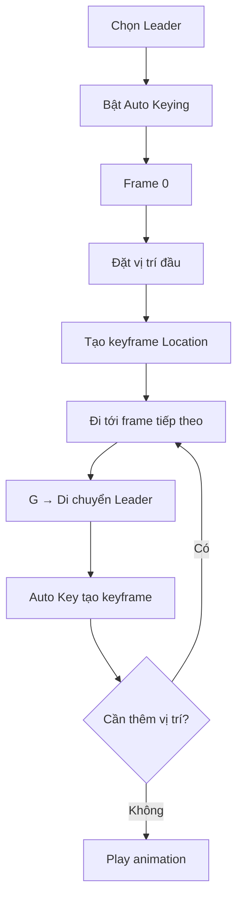
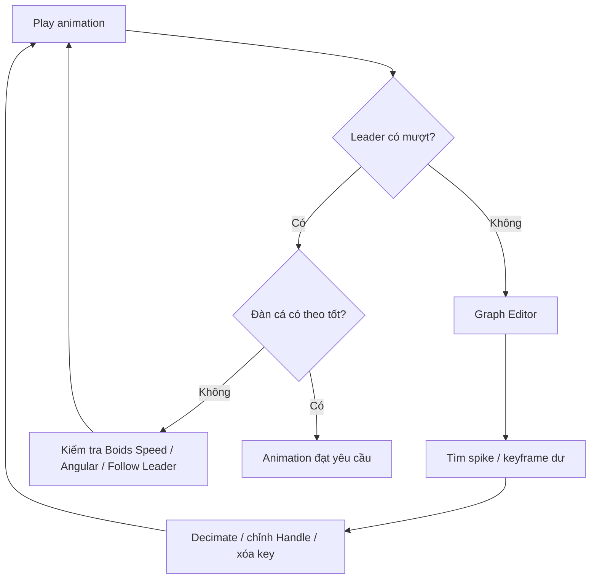
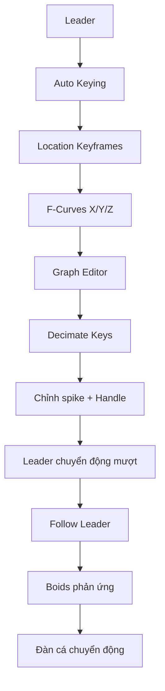

# 07 — Hoạt hình và làm mượt chuyển động của Leader

| Thuộc tính        | Nội dung                                                    |
| ----------------- | ----------------------------------------------------------- |
| **Phân đoạn**     | Animation                                                   |
| **Thời điểm**     | 10:08–13:45                                                 |
| **Chủ đề**        | Auto Keying, Graph Editor và Decimate Keys                  |
| **Object chính**  | `Leader`                                                    |
| **Công cụ chính** | Auto Keying, Timeline, Graph Editor, F-Curve, Decimate Keys |
| **Mục tiêu cuối** | Tạo quỹ đạo Leader mượt để đàn cá bám theo tự nhiên         |

---

## 1. Mục tiêu bài học

Sau phần này, người học có thể:

* Tạo animation vị trí cho object `Leader`.
* Sử dụng **Auto Keying** để tự động ghi lại các thay đổi transform.
* Tạo một đường chuyển động gồm nhiều đoạn cho Leader.
* Quan sát phản ứng của đàn cá khi Leader thay đổi vị trí.
* Phát hiện những đoạn:

  * đổi hướng quá gấp;
  * tăng tốc đột ngột;
  * giảm tốc bất thường;
  * khiến đàn cá không theo kịp.
* Sử dụng **Graph Editor** để chỉnh F-Curve.
* Giảm số lượng keyframe dư thừa bằng **Decimate Keys**.
* Làm mượt chuyển động mà vẫn giữ được hình dạng tổng thể của quỹ đạo.

---

# 2. Vai trò của animation Leader

Ở bước trước, hệ thống đã có:

```text
Leader
   │
   ▼
Follow Leader
   │
   ▼
Boids
   │
   ▼
🐟 🐟 🐟 🐟
```

Nhưng nếu Leader đứng yên:

```text
🐟 🐟 🐟 ─────────► ● Leader
```

đàn cá cuối cùng cũng chỉ tập trung quanh một khu vực.

Để đàn cá thực sự bơi qua cảnh, cần làm Leader di chuyển:

```text
Frame 0

🐟 🐟 ─────────────► ●


Frame 50

          🐟 🐟
               ╲
                ╲──────► ●


Frame 100

                       🐟
                  🐟
                     ╲
                      ╲──► ●
```

Như vậy:

> **Animation của Leader chính là animation cấp cao của toàn bộ đàn cá.**

---

# 3. Tư duy điều khiển chuyển động

Thay vì animate từng con cá:

```text
Fish 01 → keyframe
Fish 02 → keyframe
Fish 03 → keyframe
Fish 04 → keyframe
...
```

chỉ cần animate:

```text
Leader
   │
   ▼
Boids tự phản ứng
   │
   ▼
Toàn bộ đàn cá chuyển động
```

Đây là ưu điểm lớn của hệ thống Leader + Boids.

---

# 4. Bật Auto Keying

## Bước 1 — Chọn Leader

Trong 3D Viewport hoặc Outliner, chọn:

```text
Leader
```

---

## Bước 2 — Bật Auto Keying

Trong Timeline, bật nút:

> **Auto Keying**

Biểu tượng thường là một nút tròn màu đỏ.

Có thể hiểu:

```text
Auto Keying OFF
      ↓
Di chuyển object
      ↓
Không tự tạo keyframe


Auto Keying ON
      ↓
Di chuyển object
      ↓
Blender tự ghi keyframe
```

---

# 5. Tạo keyframe đầu tiên

Đưa Timeline về:

```text
Frame 0
```

Đặt Leader tại vị trí bắt đầu.

Ví dụ:

```text
Frame 0

🐟 🐟 🐟

                      ● Leader
```

Để chắc chắn có keyframe đầu tiên, có thể:

```text
I
 ↓
Location
```

hoặc thay đổi vị trí khi Auto Keying đang bật.

> Việc có một keyframe rõ ràng ở frame đầu giúp tránh Leader bắt đầu animation từ trạng thái không mong muốn.

---

# 6. Tạo vị trí thứ hai

Chuyển Timeline tới một frame khác, ví dụ:

```text
Frame 40
```

Nhấn:

```text
G
```

và di chuyển Leader.

Ví dụ:

```text
Frame 0                     Frame 40

● ───────────────────────────► ●
```

Khi Auto Keying đang bật, Blender tự tạo keyframe cho `Location`.

---

# 7. Tiếp tục tạo đường đi

Tiếp tục với một số frame khác.

Ví dụ:

```text
Frame 0
     ●
      ╲
       ╲
Frame 40 ●
          ╲
           ╲
            ● Frame 80
           ╱
          ╱
 Frame 120 ●
```

Một ví dụ khác tự nhiên hơn cho đàn cá:

```text
● Frame 0
 ╲
  ╲
   ╰──────● Frame 40
           ╲
            ╰─────● Frame 80
                  ╲
                   ╰────────● Frame 120
```

Mục tiêu không nhất thiết là tạo một đường thẳng.

Leader có thể:

* bơi ngang;
* lên nhẹ;
* xuống nhẹ;
* đổi hướng;
* đi gần hoặc xa camera;
* tạo các đường cong lớn.

---

# 8. Workflow Auto Keying



---

# 9. Quỹ đạo Leader nên như thế nào?

Nếu mục tiêu là đàn cá tự nhiên, Leader nên có:

* đường cong rộng;
* chuyển hướng từ từ;
* khoảng cách hợp lý giữa các keyframe;
* tốc độ không biến đổi quá đột ngột.

Ví dụ tốt:

```text
────────────╮
             ╰──────╮
                    ╰────────►
```

Thay vì:

```text
───────┐
       │
       └────────────►
```

---

# 10. Vì sao Leader không nên đổi hướng quá gấp?

Boids có giới hạn về:

* tốc độ;
* acceleration;
* angular velocity.

Nếu Leader thực hiện:

```text
────────►
        │
        │
        ▼
```

trong thời gian rất ngắn, đàn cá phải cố quay gấp.

Kết quả có thể:

```text
          Leader
             ▼

🐟 ─────►
🐟 ─────►
       ↘
         🐟
           ↘
             🐟
```

đàn bị kéo dài hoặc tách thành nhiều nhóm.

---

# 11. Đường cong Leader và phản ứng đàn cá

Một Leader chuyển động mềm:

```text
Leader Path

──────────╮
           ╰──────╮
                  ╰──────►
```

cho phép đàn:

```text
🐟 ─────╮
   🐟 ───╮
      🐟 ──╮
           ╰──────►
```

phản ứng dần dần.

Đây thường là kết quả tự nhiên hơn.

---

# 12. Kiểm tra animation

Sau khi tạo một số keyframe:

```text
Space
```

hoặc:

```text
▶ Play
```

và quan sát toàn bộ simulation.

Không chỉ quan sát Leader.

Cần nhìn đồng thời:

```text
Leader
   +
Fish School
```

---

# 13. Các câu hỏi cần kiểm tra

Trong khi Play, hãy quan sát:

### Leader có đi đúng đường không?

```text
Start
  ↓
● ─────╮
        ╰─────╮
              ╰────► End
```

---

### Đàn cá có theo kịp không?

Tốt:

```text
🐟 🐟 🐟 ─────────► ●
```

Không tốt:

```text
🐟 🐟 🐟


                               ●
```

---

### Đàn có dồn thành một cụm không?

Không tốt:

```text
           ●
        🐟🐟🐟
       🐟🐟🐟🐟
```

---

### Đàn có bị kéo dài quá mức không?

```text
🐟
      🐟
             🐟
                       🐟
                                  ●
```

Điều này cho thấy các cá thể đang phản ứng không đồng đều hoặc Leader quá nhanh.

---

# 14. Nếu cá không theo kịp Leader

Có hai hướng xử lý chính.

## Cách 1 — Điều chỉnh Boids

Có thể tăng nhẹ:

* Air Speed;
* Maximum Air Speed;
* khả năng phản ứng;
* mức ưu tiên Follow Leader.

---

## Cách 2 — Sửa animation Leader

Thay vì bắt đàn cá bơi cực nhanh:

```text
Frame 0                     Frame 10

● ─────────────────────────────► ●
```

có thể kéo dài thời gian:

```text
Frame 0                     Frame 60

● ─────────────────────────────► ●
```

Leader di chuyển chậm hơn và đàn có thời gian phản ứng.

---

# 15. Khoảng cách keyframe ảnh hưởng tới tốc độ

Giả sử Leader đi từ A đến B.

### Chỉ mất 10 frame

```text
A ● ───────────────────► ● B
0                       10
```

Tốc độ cao.

### Mất 100 frame

```text
A ● ───────────────────► ● B
0                      100
```

Tốc độ thấp hơn.

Về nguyên tắc:

$$
v \approx \frac{d}{\Delta t}
$$

Trong đó:

* $v$ = tốc độ;
* $d$ = khoảng cách;
* $\Delta t$ = khoảng thời gian giữa keyframe.

---

# 16. Tại sao cần Graph Editor?

Timeline chủ yếu cho biết:

```text
Frame nào có keyframe?
```

Nhưng Graph Editor cho biết:

```text
Giá trị transform thay đổi như thế nào theo thời gian?
```

Ví dụ đối với vị trí:

```text
Location X
Location Y
Location Z
```

mỗi trục sẽ có một **F-Curve** riêng.

---

# 17. Mở Graph Editor

Có thể chuyển một vùng giao diện sang:

> **Graph Editor**

Sau khi chọn Leader, Graph Editor sẽ hiển thị các animation channel của nó.

Ví dụ:

```text
Leader
│
└── Object Transforms
    │
    ├── X Location
    ├── Y Location
    └── Z Location
```

---

# 18. F-Curve là gì?

F-Curve biểu diễn:

> **Giá trị của một thuộc tính thay đổi theo thời gian.**

Ví dụ:

```text
Value
  ↑
  │                 ●
  │             ╭───╯
  │         ●───╯
  │      ╭──╯
  │   ●──╯
  │
  └────────────────────────► Frame
```

Mỗi điểm:

```text
●
```

là một keyframe.

Đường nối giữa chúng mô tả cách Blender nội suy chuyển động.

---

# 19. F-Curve của vị trí Leader

Nếu Leader di chuyển trong 3D:

```text
X Location
Y Location
Z Location
```

sẽ tạo ba F-Curve.

Ví dụ:

```text
X ─────────╮────────

Y ─────╮
       ╰────────────

Z ──╮────╯────╮────
```

Sự kết hợp của ba curve tạo thành quỹ đạo 3D của Leader.

---

# 20. Chọn toàn bộ keyframe

Trong Graph Editor, nhấn:

```text
A
```

để chọn toàn bộ các keyframe đang hiển thị.

Hoặc chỉ chọn những keyframe trong vùng muốn chỉnh.

---

# 21. Vấn đề quá nhiều keyframe

Nếu animation được tạo từ nhiều thao tác nhỏ hoặc dữ liệu ghi liên tục, F-Curve có thể có rất nhiều keyframe.

Ví dụ:

```text
●●●●●●●●●●●●●●●●●●●●●●
```

Điều này khiến:

* khó chỉnh sửa;
* khó phát hiện keyframe gây lỗi;
* F-Curve phức tạp;
* chuyển động có thể chứa rung nhỏ.

Một curve dễ kiểm soát hơn:

```text
●──────●───────●────────●
```

---

# 22. Decimate Keys

Graph Editor cung cấp công cụ:

> **Key → Decimate Keys**

Công cụ này giảm số lượng keyframe trong khi cố gắng giữ hình dạng tổng thể của F-Curve.

Ví dụ:

### Trước

```text
●─●─●─●─●─●─●─●─●─●─●
```

### Sau

```text
●────●─────●───────●
```

Nhưng đường cong tổng thể vẫn tương đối giống ban đầu.

---

# 23. Quy trình Decimate Keys

1. Chọn `Leader`.
2. Mở Graph Editor.
3. Chọn F-Curve cần xử lý.
4. Nhấn:

```text
A
```

5. Chọn:

```text
Key
 ↓
Decimate Keys
```

6. Điều chỉnh mức giảm.
7. Quan sát F-Curve.
8. Play lại animation.

---

# 24. Mục tiêu của Decimate

Không phải:

> "Xóa càng nhiều keyframe càng tốt."

Mà là:

> **Giữ chuyển động gần như cũ với ít keyframe cần thiết hơn.**

Có thể biểu diễn:

$$
\text{Animation tốt}
====================

\text{Ít keyframe hợp lý}
+
\text{Giữ đúng chuyển động}
$$

---

# 25. Không nên Decimate quá mạnh

Ví dụ quỹ đạo ban đầu:

```text
●──╮
   ╰──●──╮
         ╰──●──╮
               ╰──●
```

Nếu giảm quá nhiều:

```text
●──────────────────●
```

đường cong sẽ mất hình dạng.

Leader có thể:

* đi sai vị trí;
* cắt qua khu vực không mong muốn;
* mất chuyển động lên/xuống;
* thay đổi tốc độ.

---

# 26. Quy tắc sau mỗi lần Decimate

Luôn thực hiện:

```text
Decimate
   ↓
Play
   ↓
Quan sát Leader
   ↓
Quan sát đàn cá
   ↓
So sánh kết quả
```

Không nên chỉ đánh giá bằng hình dạng F-Curve.

> Animation trông tốt quan trọng hơn F-Curve trông đẹp.

---

# 27. Điểm nhọn trên F-Curve

Một vấn đề phổ biến là xuất hiện điểm nhọn:

```text
Value
  ↑
  │          /\
  │         /  \
  │────────/    \────────
  │
  └──────────────────────► Frame
```

Điểm nhọn có thể khiến Leader:

* tăng tốc đột ngột;
* đổi hướng;
* giật;
* dừng rồi tăng tốc lại.

---

# 28. Ví dụ cú giật do F-Curve

Quỹ đạo mong muốn:

```text
────────╮
         ╰────────►
```

Nhưng F-Curve gây:

```text
───────╮
       ╰─╮
         ╰───────►
```

Leader có thể có một cú chuyển hướng nhỏ nhưng rất nhanh.

Boids sau đó sẽ phản ứng:

```text
Leader giật
    ↓
Follow Leader đổi hướng
    ↓
Fish quay đột ngột
    ↓
Đàn bị rung / tách
```

---

# 29. Cách xử lý keyframe gây giật

Có thể:

### Xóa keyframe

Chọn keyframe gây lỗi và nhấn:

```text
X
```

nếu keyframe đó không cần thiết.

---

### Di chuyển keyframe

Dùng:

```text
G
```

để thay đổi:

* frame;
* giá trị.

---

### Chỉnh Handle

Điều chỉnh các handle của keyframe để tạo đường cong mềm hơn.

---

# 30. Bezier Handle

F-Curve thường sử dụng Bezier interpolation.

Một keyframe có thể hình dung:

```text
────────○────●────○────────
        ↑         ↑
      Handle    Handle
```

Trong đó:

```text
● = Keyframe
○ = Handle
```

Handle kiểm soát độ cong trước và sau keyframe.

---

# 31. Handle mềm

Ví dụ:

```text
────────╮
         ╰─────────
```

chuyển động thay đổi từ từ.

---

# 32. Handle quá gắt

```text
───────┐
       └───────────
```

có thể tạo thay đổi vận tốc rất mạnh.

Đối với đàn cá, thường nên hướng tới chuyển động có độ cong mềm.

---

# 33. Interpolation và tốc độ

Nếu dùng Bezier mặc định, Blender thường tạo:

```text
Chậm
 ↓
Tăng tốc
 ↓
Nhanh
 ↓
Giảm tốc
 ↓
Chậm
```

giữa các keyframe.

Có thể hình dung:

```text
Speed

     ╭────────╮
    ╱          ╲
───╯            ╰───
```

Điều này phù hợp với nhiều animation tự nhiên.

Tuy nhiên, quá nhiều keyframe gần nhau có thể làm tốc độ liên tục thay đổi.

---

# 34. Keyframe quá gần nhau

Ví dụ:

```text
Frame:
0        40 42 44          100
●────────●──●──●────────────●
```

Các keyframe `40`, `42`, `44` có thể tạo:

```text
smooth
  ↓
giật
  ↓
giật
  ↓
smooth
```

Nếu không cần thiết, có thể giảm còn:

```text
0           42             100
●────────────●──────────────●
```

---

# 35. Quỹ đạo tốt cho đàn cá

Đối với đàn cá, Leader thường nên đi theo các curve có bán kính tương đối lớn.

Ví dụ:

```text
               ╭─────────►
          ╭────╯
     ╭────╯
─────╯
```

Thay vì:

```text
─────┐
     │
     └────┐
          │
          └────►
```

Boids dễ theo các curve mềm hơn.

---

# 36. Tránh quá nhiều zigzag

Ví dụ không tự nhiên:

```text
/\/\/\/\/\/\/\
```

Leader liên tục đổi hướng.

Kết quả đàn cá:

```text
🐟 ↗↘↗↘↗↘↗↘
```

Có thể trông giống rung hoặc mất phương hướng.

Tốt hơn:

```text
──────╮
       ╰────╮
            ╰────────►
```

---

# 37. Tạo biến thiên theo chiều cao

Không nên để Leader luôn đi trên một mặt phẳng hoàn toàn cố định.

Ví dụ:

```text
Z

      ╭─────╮
──────╯     ╰──────╮
                   ╰────►
```

Một lượng nhỏ chuyển động theo chiều cao giúp đàn cá phân bố 3D hơn.

---

# 38. Tuy nhiên không nên dao động quá mạnh

Không nên:

```text
Z

/\/\/\/\/\/\/\/\/\
```

Nếu Leader lên xuống quá nhanh:

```text
🐟 ↗
   ↘
     ↗
       ↘
```

đàn cá dễ chuyển động như đang rung.

Nên dùng:

```text
────╮
    ╰────╮
         ╰──────
```

với độ cao thay đổi từ từ.

---

# 39. Quan hệ giữa Leader Path và Boids

Animation cuối cùng có hai tầng:

```text
Tầng 1
Leader Animation
      │
      ▼
"Đàn nên đi đâu?"


Tầng 2
Boids Simulation
      │
      ▼
"Các cá thể sẽ đi tới đó như thế nào?"
```

Do đó nếu animation trông xấu, cần xác định lỗi nằm ở tầng nào.

---

# 40. Phân biệt lỗi Leader và lỗi Boids

## Nếu Leader tự giật

```text
● ──► ● ↗ ●
```

→ sửa **Animation / F-Curve**.

---

## Nếu Leader mượt nhưng cá quay gắt

```text
Leader
──────╮
       ╰────►

Fish
────►│
     ▼
```

→ kiểm tra:

* Maximum Angular Velocity;
* Air Speed;
* Follow Leader;
* Personal Space.

---

## Nếu Leader quá nhanh

```text
🐟 🐟


                             ●
```

→ giảm tốc animation hoặc tăng khả năng bám của Boids.

---

# 41. Workflow chẩn đoán



---

# 42. Đường chuyển động không chỉ là vị trí

Một animation Leader tốt phải kiểm soát đồng thời:

```text
Position
   +
Timing
   +
Spacing
```

Trong animation:

> **Spacing** giữa các vị trí theo thời gian quyết định cảm giác tốc độ.

Ví dụ:

### Khoảng cách mỗi frame gần bằng nhau

```text
●  ●  ●  ●  ●  ●
```

→ tốc độ tương đối đều.

### Khoảng cách tăng dần

```text
● ●  ●   ●     ●
```

→ Leader đang tăng tốc.

### Khoảng cách giảm dần

```text
●     ●   ●  ● ●
```

→ Leader đang giảm tốc.

---

# 43. Timing cho đàn cá

Leader thường không nên:

```text
đứng yên rất lâu
        ↓
lao đi cực nhanh
        ↓
dừng đột ngột
```

trừ khi đó là hiệu ứng chủ ý.

Tốt hơn:

```text
bắt đầu chậm
     ↓
tăng tốc
     ↓
di chuyển ổn định
     ↓
đổi hướng mềm
     ↓
giảm tốc
```

Điều này cho Boids đủ thời gian để điều chỉnh.

---

# 44. Ví dụ animation hoàn chỉnh

Một animation có thể được bố trí:

| Frame | Hành động Leader       |
| ----: | ---------------------- |
|   `0` | Vị trí bắt đầu         |
|  `40` | Di chuyển nhẹ về trước |
|  `80` | Đi lên và sang một bên |
| `120` | Bắt đầu vòng cua       |
| `170` | Hoàn thành vòng cua    |
| `220` | Đi xuống nhẹ           |
| `280` | Tiếp tục ra xa         |
| `340` | Giảm tốc               |

Quỹ đạo:

```text
Start ●
       ╲
        ╲
         ╰────●
               ╲
                ╰────●
                       ╲
                        ╰────╮
                             ╰────●
                                   ╲
                                    ╰─────● End
```

Đây chỉ là cấu trúc minh họa; số frame thực tế phụ thuộc cảnh.

---

# 45. Đừng tạo quá nhiều keyframe ngay từ đầu

Workflow tốt hơn:

```text
4–6 keyframe lớn
        ↓
Play
        ↓
Kiểm tra quỹ đạo
        ↓
Thêm keyframe khi thật sự cần
```

thay vì:

```text
Tạo 30 keyframe
      ↓
Đường đi phức tạp
      ↓
Khó chỉnh
```

---

# 46. Keyframe quan trọng và keyframe phụ

Có thể chia:

### Keyframe chính

Xác định:

* điểm bắt đầu;
* điểm cua;
* điểm cao nhất;
* điểm thấp nhất;
* điểm kết thúc.

### Keyframe phụ

Dùng khi cần:

* chỉnh tốc độ;
* kiểm soát độ cong;
* sửa một đoạn cụ thể.

Nguyên tắc:

> **Ưu tiên ít keyframe có mục đích rõ ràng.**

---

# 47. Decimate phù hợp khi nào?

Decimate hữu ích khi:

* animation có quá nhiều keyframe;
* keyframe được tạo từ dữ liệu dày;
* đã chỉnh quá nhiều điểm nhỏ;
* muốn đơn giản hóa F-Curve.

Không nhất thiết cần Decimate nếu animation ban đầu chỉ có:

```text
●────────●────────●────────●
```

và đã chuyển động tốt.

---

# 48. So sánh trước và sau Decimate

## Trước

```text
Value
  ↑
  │      ● ● ●
  │    ●       ●
  │  ●           ● ●
  │●                 ●
  └────────────────────────►
```

## Sau

```text
Value
  ↑
  │        ●
  │     ╭──╯╲
  │  ●──╯    ╰──●
  │●              ╰──●
  └────────────────────────►
```

Curve đơn giản hơn nhưng vẫn giữ hình dạng tổng thể.

---

# 49. Quy trình làm sạch F-Curve

```text
Graph Editor
    │
    ▼
Chọn curve
    │
    ▼
Tìm keyframe dư
    │
    ▼
Decimate Keys
    │
    ▼
Tìm spike
    │
    ▼
Chỉnh / xóa key
    │
    ▼
Chỉnh handle
    │
    ▼
Play lại
```

---

# 50. Kiểm tra toàn bộ animation

Không chỉ xem một đoạn ngắn.

Luôn kiểm tra:

```text
Frame Start
    │
    ▼
toàn bộ animation
    │
    ▼
Frame End
```

Một lỗi có thể chỉ xuất hiện ở:

* đoạn cua;
* đoạn Leader tăng tốc;
* đoạn Leader đi gần đàn;
* đoạn cuối simulation.

---

# 51. Kiểm tra từ Camera View

Sau khi movement cơ bản ổn định, nên kiểm tra từ:

```text
Numpad 0
```

để xem Camera View.

Một quỹ đạo trông tốt trong Perspective View chưa chắc tốt khi nhìn qua camera.

Ví dụ:

```text
3D View:
Quỹ đạo rất rộng ✓

Camera:
Leader và đàn rời khỏi khung ✕
```

---

# 52. Kiểm tra từ nhiều góc

Nên quan sát:

```text
Perspective
Front
Side
Top
Camera
```

đặc biệt khi Leader di chuyển theo 3D.

Điều này giúp phát hiện:

* quỹ đạo quá phẳng;
* dao động chiều sâu quá lớn;
* cá va vào nhau ở trục khó nhìn thấy;
* Leader đi ra khỏi vùng mong muốn.

---

# 53. Quan hệ giữa tốc độ Leader và Fish

Có thể xem:

$$
v_{\text{Leader}}
\lesssim
v_{\text{Fish Max}}
$$

trong phần lớn animation.

Nếu:

$$
v_{\text{Leader}}
\gg
v_{\text{Fish Max}}
$$

đàn sẽ liên tục bị bỏ lại.

Ví dụ:

```text
Fish Max Speed
────────►

Leader Speed
────────────────────────►
```

khiến Follow Leader rất khó tạo chuyển động đẹp.

---

# 54. Khoảng cách giữa Leader và đàn

Leader nên giữ một khoảng cách tương đối ổn định phía trước đàn.

Tốt:

```text
🐟 🐟
   🐟       ─────────► ●
```

Không tốt:

```text
🐟 🐟 ●
```

quá gần.

Hoặc:

```text
🐟 🐟


                                 ●
```

quá xa.

Animation Leader cũng cần được thiết kế để duy trì khoảng cách hợp lý này.

---

# 55. Luồng animation hoàn chỉnh



---

# 56. Cấu trúc hệ thống tới thời điểm hiện tại

```text
Scene
│
├── Fish
│   └── Fish Mesh
│
├── Leader
│   │
│   └── Animation
│       │
│       ├── X Location
│       ├── Y Location
│       └── Z Location
│
└── Emitter
    │
    └── Particle System
        │
        ├── Instance Object = Fish
        │
        └── Boids
            │
            ├── Follow Leader → Leader
            ├── Avoid Collision
            └── Flock
```

---

# 57. Hệ thống điều khiển tổng thể

```text
               KEYFRAMES
                   │
                   ▼
               Leader
                   │
                   ▼
            Follow Leader
                   │
                   ▼
                Boids
         ┌─────────┼─────────┐
         │         │         │
         ▼         ▼         ▼
       Flock     Avoid     Speed
                  │
                  ▼
            Fish Particles
                  │
                  ▼
              🐟 🐟 🐟
```

---

# 58. Lỗi thường gặp

## Leader không có animation

Kiểm tra:

* Auto Keying đã bật chưa;
* có keyframe Location không;
* Leader có được di chuyển ở các frame khác nhau không.

---

## Leader nhảy vị trí

Kiểm tra Graph Editor xem có:

```text
spike
```

hoặc keyframe quá gần nhau không.

---

## Leader đi đúng đường nhưng tốc độ không đều

Kiểm tra:

* khoảng cách giữa keyframe;
* Bezier handle;
* F-Curve.

---

## Cá bị bỏ lại

Có thể:

* Leader quá nhanh;
* Air Speed thấp;
* Maximum Air Speed thấp;
* Follow Leader không đủ ưu tiên.

---

## Cá quay gắt tại điểm cua

Có thể:

* Leader đổi hướng quá mạnh;
* Maximum Angular Velocity quá cao;
* điểm cua trên F-Curve quá nhọn.

---

## Animation xấu sau Decimate

Hoàn tác bằng:

```text
Ctrl + Z
```

hoặc giảm mức Decimate.

Không nên giữ kết quả chỉ vì curve có ít keyframe hơn.

---

# 59. Checklist hoàn thành

* [ ] Đã chọn object `Leader`.
* [ ] Đã bật Auto Keying.
* [ ] Leader có keyframe vị trí ban đầu.
* [ ] Đã tạo nhiều vị trí cho Leader trên Timeline.
* [ ] Leader có một quỹ đạo rõ ràng.
* [ ] Quỹ đạo không đổi hướng quá gấp.
* [ ] Đã Play để kiểm tra Leader.
* [ ] Đàn cá có phản ứng với Leader.
* [ ] Cá không bị bỏ lại quá xa.
* [ ] Cá không tụ quá chặt quanh Leader.
* [ ] Đã mở Graph Editor.
* [ ] Đã kiểm tra các F-Curve `X/Y/Z Location`.
* [ ] Đã giảm keyframe dư thừa nếu cần.
* [ ] Decimate Keys không làm thay đổi mạnh quỹ đạo.
* [ ] Đã tìm và sửa các spike trên F-Curve.
* [ ] Các handle tạo chuyển động đủ mềm.
* [ ] Không còn những cú giật lớn.
* [ ] Đã kiểm tra animation từ đầu tới cuối.
* [ ] Đã kiểm tra từ Camera View.
* [ ] Đã kiểm tra từ nhiều góc nhìn.

---

# 60. Ghi nhớ nhanh

```text
Leader
  │
  ▼
Auto Keying
  │
  ▼
Location Keyframes
  │
  ▼
Graph Editor
  │
  ├── Decimate Keys
  ├── Xóa key dư
  ├── Sửa spike
  └── Chỉnh Handle
  │
  ▼
Leader Path mượt
  │
  ▼
Follow Leader
  │
  ▼
Boids
  │
  ▼
🐟 🐟 🐟 🐟
```

Cốt lõi của phần này là:

> **Đường chuyển động của Leader càng mượt và dễ dự đoán, đàn cá càng có cơ hội phản ứng tự nhiên.**

Có thể tóm tắt:

$$
\boxed{
\text{Leader Path tốt}
+
\text{Timing hợp lý}
+
\text{F-Curve mượt}
===================

\text{Đàn cá chuyển động tự nhiên hơn}
}
$$

Và nguyên tắc quan trọng nhất khi làm sạch keyframe là:

> **Không giảm keyframe chỉ để Graph Editor trông đẹp. Hãy giảm keyframe khi chuyển động thực tế vẫn giữ đúng quỹ đạo và trở nên dễ kiểm soát hơn.**

Sau bước này, hệ thống đã có một `Leader` được animation hoàn chỉnh, trong khi **Boids tự động biến quỹ đạo đó thành chuyển động bầy đàn của toàn bộ đàn cá**.
