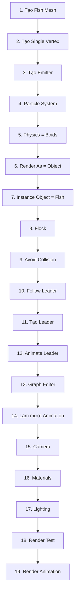

# 08 — Camera, ánh sáng và render cuối

| Thuộc tính        | Nội dung                             |
| ----------------- | ------------------------------------ |
| **Phân đoạn**     | Hoàn thiện cảnh                      |
| **Thời điểm**     | 13:45–14:13                          |
| **Chủ đề**        | Bố cục, vật liệu, ánh sáng và render |
| **Công cụ chính** | Camera, Material, Light, Render      |
| **Mục tiêu cuối** | Hoàn thiện và xuất cảnh đàn cá       |

---

## 1. Mục tiêu bài học

Sau phần này, người học có thể:

* Đặt Camera để quan sát rõ chuyển động của đàn cá.
* Chọn bố cục giúp người xem dễ nhận ra:

  * hướng di chuyển;
  * cấu trúc đàn;
  * mối quan hệ giữa đàn cá và Leader.
* Tạo vật liệu đơn giản cho cá và môi trường.
* Thiết lập ánh sáng đủ để tách cá khỏi nền.
* Kiểm tra toàn bộ simulation trước khi render.
* Render thử một frame để phát hiện lỗi.
* Thiết lập khoảng frame và xuất animation hoàn chỉnh.

---

# 2. Trạng thái dự án trước khi render

Tới thời điểm này, hệ thống đã gần hoàn chỉnh:

```text
Fish
  │
  ▼
Fish Mesh
  │
  ▼
Instance Object

Emitter
  │
  ▼
Particle System
  │
  ▼
Boids
  │
  ├── Flock
  ├── Avoid Collision
  └── Follow Leader
          │
          ▼
       Leader
          │
          ▼
      Animation
```

Phần cuối cùng là đưa toàn bộ hệ thống vào một cảnh có:

```text
Camera
+
Lighting
+
Materials
+
Render Settings
```

---

# 3. Mục tiêu của bước hoàn thiện

Một simulation tốt trong Viewport chưa chắc tạo ra một hình ảnh đẹp khi render.

Cần kiểm soát thêm:

```text
Simulation
     │
     ▼
Composition
     │
     ▼
Lighting
     │
     ▼
Materials
     │
     ▼
Render
```

Có thể hiểu:

> **Boids quyết định chuyển động, còn Camera và Lighting quyết định người xem nhìn thấy chuyển động đó như thế nào.**

---

# 4. Đặt Camera

## Bước 1 — Chọn Camera

Trong Outliner hoặc 3D Viewport, chọn:

```text
Camera
```

Nếu scene chưa có Camera:

```text
Shift + A
   ↓
Camera
```

---

## Bước 2 — Xem qua Camera

Nhấn:

```text
Numpad 0
```

để chuyển sang:

> **Camera View**

Có thể hình dung:

```text
3D Scene
   │
   ▼
Camera
   │
   ▼
┌───────────────────────────┐
│                           │
│       🐟   🐟             │
│    🐟        🐟      ●    │
│                           │
└───────────────────────────┘
       Render Frame
```

---

# 5. Điều chỉnh vị trí Camera

Có thể di chuyển Camera bằng:

```text
G
```

và xoay bằng:

```text
R
```

hoặc theo từng trục:

```text
G → X
G → Y
G → Z

R → X
R → Y
R → Z
```

Mục tiêu là đặt Camera sao cho:

* đàn cá nằm trong khung;
* có đủ không gian phía trước hướng di chuyển;
* không cắt mất quá nhiều cá;
* quỹ đạo chính dễ đọc.

---

# 6. Bố cục cho đàn cá

Một bố cục không tốt:

```text
┌───────────────────────────┐
│                  🐟🐟🐟🐟 │
│                     🐟🐟  │
│                           │
│                           │
└───────────────────────────┘
```

Đàn cá bị dồn sát mép khung.

Tốt hơn:

```text
┌───────────────────────────┐
│                           │
│      🐟       🐟          │
│         🐟         🐟     │
│             🐟            │
│                           │
└───────────────────────────┘
```

Có khoảng trống để đàn cá tiếp tục di chuyển.

---

# 7. Chừa không gian theo hướng chuyển động

Nếu đàn đang bơi sang phải:

```text
🐟 🐟 🐟 ─────────────►
```

Camera nên chừa nhiều không gian hơn phía trước:

```text
┌──────────────────────────────┐
│                              │
│ 🐟 🐟 🐟              →     │
│                              │
└──────────────────────────────┘
```

thay vì:

```text
┌──────────────────────────────┐
│                              │
│              🐟 🐟 🐟 →│    │
│                              │
└──────────────────────────────┘
```

Nguyên tắc này giúp hình ảnh có cảm giác chuyển động tự nhiên hơn.

---

# 8. Chọn góc máy hơi rộng

Một góc nhìn tương đối rộng thường phù hợp với cảnh đàn cá vì người xem cần thấy:

* hình dạng chung của đàn;
* hướng chuyển động;
* độ phân tán;
* thay đổi quỹ đạo.

Nếu Camera quá gần:

```text
┌─────────────────────┐
│       🐟             │
│  🐟🐟🐟🐟           │
│       🐟             │
└─────────────────────┘
```

người xem khó hiểu chuyển động tổng thể.

Camera rộng hơn:

```text
┌────────────────────────────────┐
│                                │
│  🐟     🐟                     │
│      🐟       🐟 ─────────►    │
│          🐟                    │
│                                │
└────────────────────────────────┘
```

giúp đọc đàn dễ hơn.

---

# 9. Không nhất thiết phải thấy Leader

Leader chỉ là object điều khiển.

Trong phần lớn trường hợp, render cuối chỉ cần:

```text
🐟 🐟 🐟 🐟
```

không cần:

```text
🐟 🐟 🐟 ─────► ● Leader
```

Nếu Leader chỉ phục vụ simulation, hãy kiểm tra để tránh nó xuất hiện ngoài ý muốn.

---

# 10. Kiểm tra Leader trong Camera View

Ở một frame bất kỳ:

```text
Numpad 0
```

và kiểm tra:

```text
Leader có nằm trong khung?
```

Nếu có nhưng không muốn render Leader:

* ẩn object khỏi render;
* hoặc đặt nó ngoài vùng Camera khi có thể;
* hoặc sử dụng một object điều khiển không được hiển thị.

Mục tiêu:

```text
Simulation:

🐟 🐟 🐟 ───► ●


Render:

🐟 🐟 🐟 ───►
```

---

# 11. Chọn frame đại diện

Không nên chỉ kiểm tra ở frame đầu.

Hãy chọn một vài frame như:

```text
Start
Middle
Turn
End
```

Ví dụ:

| Frame | Nội dung cần kiểm tra       |
| ----: | --------------------------- |
|   `0` | Vị trí bắt đầu              |
|  `50` | Đàn đang hình thành         |
| `100` | Đang đổi hướng              |
| `150` | Đang đi qua trung tâm khung |
| `200` | Gần cuối animation          |

Frame đại diện tốt thường là nơi:

* có nhiều cá trong khung;
* đàn đang thể hiện rõ chuyển động;
* không quá dồn;
* có chiều sâu.

---

# 12. Vật liệu cho Fish

Không cần shader quá phức tạp.

Có thể sử dụng một vật liệu đơn giản với:

* Base Color;
* Roughness;
* một chút Specular.

Ví dụ:

```text
Fish Material

Base Color → màu cá
Roughness  → trung bình
Specular   → nhẹ
```

Mục tiêu:

> Làm silhouette và hình dạng cá dễ nhận biết khi nhiều instance xuất hiện cùng lúc.

---

# 13. Tránh vật liệu quá phức tạp

Nếu Fish được instance hàng trăm lần, một shader rất nặng có thể tăng thời gian render.

Không nhất thiết cần:

```text
Complex SSS
+
Nhiều procedural texture
+
Displacement nặng
+
Nhiều lớp shader
```

cho một bài tập tập trung vào Boids.

Tốt hơn:

```text
Simple Material
      │
      ├── Base Color
      ├── Roughness
      └── Specular
```

---

# 14. Tạo nền

Có thể sử dụng:

* World Background;
* Plane lớn;
* một backdrop đơn giản.

Một lựa chọn dễ dùng là màu:

```text
Xanh đậm
hoặc
Xanh biển
hoặc
Tông tối
```

để Fish nổi bật hơn.

Ví dụ:

```text
Background
█████████████████████████
     🐟
  🐟     🐟
       🐟
█████████████████████████
```

---

# 15. Độ tương phản giữa cá và nền

Nếu cá và nền quá giống nhau:

```text
Fish = xanh tối
Background = xanh tối
```

silhouette có thể bị mất.

Mục tiêu là:

$$
\text{Fish Contrast}

>

\text{Background Similarity}
$$

Ví dụ:

```text
Nền tối
   +
Cá sáng hơn
   ↓
Dễ quan sát
```

hoặc ngược lại.

---

# 16. Thiết lập ánh sáng cơ bản

Một setup rất đơn giản:

```text
              Key Light
                  ↓

            🐟   🐟
        🐟           🐟

              ↑
          Fill Light
```

Có thể sử dụng:

1. **Key Light** — ánh sáng chính.
2. **Fill Light** — ánh sáng phụ.

---

# 17. Key Light

Key Light quyết định phần lớn hình dạng ánh sáng của cá.

Có thể đặt:

```text
          Light
            ↓
           ╲
            ╲
             🐟
```

từ phía trên hoặc hơi chéo.

Mục tiêu:

* tạo highlight;
* giúp đọc form của cá;
* tách mặt sáng và mặt tối.

---

# 18. Fill Light

Nếu chỉ dùng Key Light, phần tối có thể bị mất hoàn toàn.

Ví dụ:

```text
Key Light
   ↓

🐟
███▒░
```

Fill Light giúp nâng nhẹ vùng tối:

```text
Key Light
   ↓

🐟
██▓▒░

   ↑
Fill
```

Fill thường nên yếu hơn Key.

---

# 19. Không làm ánh sáng quá phẳng

Nếu ánh sáng từ mọi hướng có cường độ gần bằng nhau:

```text
Light ← 🐟 → Light
        ↑
       Light
```

cá có thể mất khối.

Kết quả trông phẳng:

```text
🐟
```

thay vì có cảm giác thể tích.

Nên có một hướng sáng chính rõ hơn.

---

# 20. Ánh sáng và đàn cá

Khi đàn có nhiều cá, cần kiểm tra:

* cá ở phía trước;
* cá ở giữa;
* cá ở phía sau.

Không nên chỉ có một vài cá được chiếu sáng tốt.

Ví dụ:

```text
🐟   🐟     🐟     🐟
✓    ✓      ✕       ✕
```

Nếu cảnh sâu, có thể cần:

* nguồn sáng lớn hơn;
* Fill Light;
* World Lighting nhẹ.

---

# 21. Không cần mô phỏng nước phức tạp

Trọng tâm của bài là:

```text
Particle System
+
Boids
+
Leader
```

Vì vậy không cần bắt buộc xây dựng:

* caustics;
* volumetric water;
* refraction phức tạp;
* ocean simulation;
* underwater particles;
* fog nặng.

Có thể hoàn thành bài với một background đơn giản.

---

# 22. Nếu muốn tạo cảm giác dưới nước

Có thể sử dụng nhẹ:

```text
Màu xanh
+
Ánh sáng mềm
+
Contrast vừa phải
```

Ví dụ:

```text
World Color
     ↓
Blue / Cyan

Key Light
     ↓
Soft

Fish
     ↓
Sáng hơn nền
```

là đủ để tạo cảm giác môi trường nước cơ bản.

---

# 23. Kiểm tra kích thước Fish

Trước render, xác nhận Fish Instance có kích thước phù hợp.

Quá lớn:

```text
🐟🐟🐟🐟
🐟🐟🐟🐟
```

đàn bị chồng kín.

Quá nhỏ:

```text
.   .     .
   .   .
```

không đọc được hình dạng.

Tốt:

```text
🐟      🐟

    🐟       🐟

       🐟
```

---

# 24. Kiểm tra hướng Fish

Một lỗi rất dễ lộ khi render:

```text
Path ─────────────►

Fish ◄────────────
```

Cá trông như đang bơi lùi.

Trước khi render toàn bộ animation, cần chắc chắn:

```text
Particle Velocity ──────►
Fish Head        ──────►
```

cùng hướng.

---

# 25. Kiểm tra overlap

Quan sát các đoạn đàn đông nhất.

Không tốt:

```text
🐟🐟🐟
 🐟🐟
```

Tốt hơn:

```text
🐟       🐟

    🐟

       🐟
```

Nếu overlap quá nhiều:

* tăng Personal Space;
* kiểm tra Avoid Collision;
* giảm mật độ particle;
* giảm kích thước Fish nếu cần.

---

# 26. Kiểm tra đàn ở điểm cua

Điểm cua là nơi dễ xuất hiện lỗi nhất.

Ví dụ:

```text
─────────╮
          ╰──────►
```

Ở đây đàn có thể:

* dồn lại;
* kéo dài;
* quay gắt;
* tách thành nhóm.

Vì vậy nên render thử hoặc kiểm tra kỹ các frame quanh điểm cua.

---

# 27. Kiểm tra Camera bao phủ toàn bộ quỹ đạo

Không chỉ xem frame đầu.

Camera phải phù hợp với:

```text
Start
 ↓
Leader Path
 ↓
Turn
 ↓
End
```

Nếu quỹ đạo:

```text
Start ● ─────╮
             ╰────────╮
                      ╰──────● End
```

Camera cần bao phủ phần quan trọng của đường đi.

---

# 28. Không nhất thiết Camera phải bao phủ mọi thứ

Một Camera quá rộng:

```text
┌─────────────────────────────────────┐
│                                     │
│           . . . .                   │
│                                     │
└─────────────────────────────────────┘
```

có thể khiến cá quá nhỏ.

Do đó cần cân bằng:

$$
\text{Coverage}
\leftrightarrow
\text{Readable Fish Size}
$$

Không cần nhìn thấy toàn bộ quỹ đạo cùng lúc, chỉ cần đàn vẫn nằm trong bố cục hợp lý trong phần lớn animation.

---

# 29. Có thể animate Camera hay không?

Có thể, nhưng không bắt buộc.

Bài cơ bản nên dùng:

```text
Static Camera
```

vì mục tiêu chính là quan sát Boids.

Nếu animate Camera quá nhiều:

```text
Fish Movement
+
Camera Movement
```

người xem có thể khó đánh giá chuyển động thực sự của đàn.

---

# 30. Checklist trước render

Trước khi render, kiểm tra:

* [ ] Fish Instance có kích thước hợp lý.
* [ ] Fish hướng đúng theo chuyển động.
* [ ] Leader không xuất hiện ngoài ý muốn.
* [ ] Emitter không xuất hiện ngoài ý muốn.
* [ ] Đàn cá không dồn thành một điểm.
* [ ] Không có quá nhiều mesh xuyên nhau.
* [ ] Flock vẫn giữ đàn liên kết.
* [ ] Follow Leader hoạt động.
* [ ] Leader Path đủ mượt.
* [ ] Điểm cua không gây giật.
* [ ] Camera giữ được đàn trong khung.
* [ ] Camera có đủ khoảng trống theo hướng bơi.
* [ ] Nền đủ tương phản với Fish.
* [ ] Ánh sáng làm rõ silhouette.
* [ ] Không có vùng Fish bị đen hoàn toàn.
* [ ] Đã kiểm tra một số frame đại diện.

---

# 31. Render thử một frame

Trước khi render cả animation, chọn một frame đại diện.

Ví dụ:

```text
Frame 120
```

Sau đó:

```text
Render
   ↓
Render Image
```

hoặc:

```text
F12
```

Blender sẽ render frame hiện tại.

---

# 32. Tại sao phải render thử?

Viewport không phải lúc nào cũng giống Render.

Một frame test có thể giúp phát hiện:

* vật liệu sai;
* object bị ẩn sai;
* Leader vẫn xuất hiện;
* ánh sáng quá tối;
* Fish quá nhỏ;
* Camera sai;
* render engine cho kết quả khác Viewport.

Workflow:

```text
Viewport OK
     ↓
Render 1 frame
     ↓
Kiểm tra
     ↓
Sửa lỗi
     ↓
Render animation
```

---

# 33. Kiểm tra frame render thử

Sau khi render, tập trung vào:

### Silhouette

Có nhận ra Fish không?

```text
🐟 ✓
```

hay chỉ thấy:

```text
● ✕
```

---

### Contrast

Fish có nổi khỏi nền không?

---

### Composition

Đàn có nằm ở vị trí hợp lý trong khung hình không?

---

### Lighting

Có nhìn thấy form của Fish không?

---

### Overlap

Có vùng nào thành một khối cá không?

---

# 34. Output Properties

Nếu render animation, mở:

> **Output Properties**

Tại đây cần kiểm tra:

```text
Frame Start
Frame End
Resolution
Frame Rate
Output Path
File Format
```

---

# 35. Frame Start và Frame End

Ví dụ:

```text
Start = 0
End   = 250
```

Blender sẽ render:

```text
Frame 0
Frame 1
Frame 2
...
Frame 250
```

Nếu animation thực tế chỉ sử dụng:

```text
0–200
```

không cần render thêm các frame không cần thiết.

---

# 36. Frame Rate

Ví dụ:

```text
24 FPS
```

có nghĩa:

$$
24\ \text{frames}
=================

1\ \text{second}
$$

Do đó:

```text
240 frames
```

tương đương khoảng:

$$
\frac{240}{24}
==============

10\ \text{seconds}
$$

---

# 37. Resolution

Kiểm tra:

```text
Resolution X
Resolution Y
Percentage
```

Ví dụ Full HD:

```text
1920 × 1080
100%
```

Trong quá trình test có thể giảm:

```text
50%
```

để render nhanh hơn.

---

# 38. Chọn thư mục Output

Trong Output Properties, chọn:

```text
Output
   ↓
/đường/dẫn/thư_mục/
```

Đảm bảo thư mục:

* tồn tại;
* có quyền ghi;
* có đủ dung lượng.

Đây là bước rất quan trọng trước khi render animation dài.

---

# 39. Render animation trực tiếp hay Image Sequence?

Có hai cách phổ biến:

```text
Animation
   │
   ├── Video trực tiếp
   │
   └── Image Sequence
```

Đối với bài đơn giản, có thể xuất video trực tiếp.

Tuy nhiên, workflow an toàn hơn cho animation dài thường là:

```text
PNG Sequence
     ↓
Ghép thành video
```

---

# 40. Ưu điểm của Image Sequence

Nếu render:

```text
0001.png
0002.png
0003.png
...
```

và quá trình bị dừng ở frame 150, có thể tiếp tục từ:

```text
151
```

thay vì render lại toàn bộ.

Nếu xuất video trực tiếp mà render bị lỗi giữa chừng, file cuối có thể không hoàn chỉnh.

---

# 41. Render Image

Để kiểm tra một frame:

```text
Render
  ↓
Render Image
```

hoặc:

```text
F12
```

---

# 42. Render Animation

Sau khi kiểm tra xong:

```text
Render
  ↓
Render Animation
```

Blender sẽ xử lý lần lượt toàn bộ các frame trong khoảng Start → End.

Luồng:

```text
Frame Start
    │
    ▼
Render Frame
    │
    ▼
Next Frame
    │
    ▼
...
    │
    ▼
Frame End
```

---

# 43. Kiểm tra simulation trước khi render dài

Vì đây là Particle + Boids simulation, không nên bắt đầu render dài ngay lập tức.

Hãy Play toàn bộ Timeline trước:

```text
Start
  ↓
Play
  ↓
Quan sát toàn bộ
  ↓
End
```

Kiểm tra những đoạn:

* Leader đổi hướng;
* đàn bám Leader;
* cá xuất hiện;
* cá biến mất;
* camera framing.

---

# 44. Render thử nhiều frame quan trọng

Một workflow tốt:

```text
Frame 0
Frame 50
Frame 100
Frame 150
Frame 200
```

render thử từng frame đại diện.

Nếu tất cả đều ổn:

```text
Render Animation
```

Cách này giúp giảm nguy cơ render hàng trăm frame rồi mới phát hiện lỗi.

---

# 45. Pipeline hoàn chỉnh của dự án

Toàn bộ bài học có thể tóm tắt:

```text
Fish Mesh
    │
    ▼
Single Vertex
    │
    ▼
Emitter
    │
    ▼
Particle System
    │
    ▼
Boids
    │
    ├── Flock
    ├── Avoid Collision
    └── Follow Leader
              │
              ▼
           Leader
              │
              ▼
          Animation
              │
              ▼
        Camera + Light
              │
              ▼
            Render
```

---

# 46. Sơ đồ toàn bộ workflow



---

# 47. Phân chia hệ thống theo chức năng

## Modeling Layer

```text
Fish Mesh
```

Quyết định Fish trông như thế nào.

---

## Emission Layer

```text
Emitter
+
Particle System
```

Quyết định có bao nhiêu Fish.

---

## Behavior Layer

```text
Boids
+
Flock
+
Avoid Collision
```

Quyết định Fish tương tác với nhau như thế nào.

---

## Direction Layer

```text
Leader
+
Follow Leader
```

Quyết định đàn đi đâu.

---

## Animation Layer

```text
Keyframes
+
Graph Editor
```

Quyết định Leader di chuyển như thế nào.

---

## Presentation Layer

```text
Camera
+
Material
+
Light
+
Render
```

Quyết định người xem nhìn thấy kết quả như thế nào.

---

# 48. Kiến trúc hoàn chỉnh

```text
┌──────────────────────────────────┐
│          PRESENTATION            │
│ Camera / Light / Material        │
└─────────────────┬────────────────┘
                  │
                  ▼
┌──────────────────────────────────┐
│           ANIMATION              │
│ Leader Keyframes / F-Curve       │
└─────────────────┬────────────────┘
                  │
                  ▼
┌──────────────────────────────────┐
│           DIRECTION              │
│ Follow Leader                    │
└─────────────────┬────────────────┘
                  │
                  ▼
┌──────────────────────────────────┐
│           BEHAVIOR               │
│ Flock / Avoid Collision          │
└─────────────────┬────────────────┘
                  │
                  ▼
┌──────────────────────────────────┐
│           PARTICLES              │
│ Emitter / Particle System        │
└─────────────────┬────────────────┘
                  │
                  ▼
┌──────────────────────────────────┐
│             MODEL                │
│             Fish                 │
└──────────────────────────────────┘
```

---

# 49. Lỗi thường gặp trước render

## Leader xuất hiện trong hình

**Nguyên nhân:**

Leader vẫn được render.

**Khắc phục:**

Ẩn Leader khỏi render hoặc kiểm tra vị trí của nó.

---

## Fish bị đen

Có thể do:

* thiếu ánh sáng;
* normals;
* vật liệu quá tối;
* World quá tối.

---

## Fish biến mất giữa animation

Kiểm tra:

```text
Particle Lifetime
```

Nếu Lifetime quá ngắn, Fish Instance cũng biến mất.

---

## Fish chưa xuất hiện ở frame đầu

Kiểm tra:

```text
Frame Start
```

Có thể dùng Start âm để simulation chạy trước.

---

## Đàn cá đi ra khỏi Camera

Có thể:

* Camera quá gần;
* Leader Path quá rộng;
* cần chỉnh Camera;
* cần sửa Leader Animation.

---

## Fish quá nhỏ trong render

Có thể:

* Camera quá xa;
* Lens quá rộng;
* Scale Fish quá nhỏ.

---

# 50. Lens và cảm giác không gian

Camera Lens ảnh hưởng tới cách cảm nhận chiều sâu.

### Lens rộng

Ví dụ:

```text
24–35 mm
```

thường cho:

* góc nhìn rộng;
* cảm giác không gian lớn;
* dễ quan sát toàn đàn.

### Lens dài

Ví dụ:

```text
85 mm+
```

cho:

* góc nhìn hẹp;
* không gian bị nén;
* khó bao quát đàn lớn.

Đối với bài cơ bản, một góc tương đối rộng thường dễ sử dụng hơn.

---

# 51. Không cần cố làm cảnh quá phức tạp

Một lỗi phổ biến ở bước cuối là thêm quá nhiều:

```text
Water Shader
+
Caustics
+
Volumetric Fog
+
Bubble Particles
+
Coral
+
Ocean Simulation
+
Depth of Field
```

trước khi Boids đã hoạt động ổn định.

Nên ưu tiên:

```text
1. Chuyển động đàn
2. Camera
3. Lighting
4. Render
5. Chi tiết môi trường
```

---

# 52. Thứ tự kiểm tra hợp lý

```text
Simulation
   ↓
Fish Orientation
   ↓
Fish Scale
   ↓
Leader Path
   ↓
Camera
   ↓
Materials
   ↓
Lighting
   ↓
Render Test
   ↓
Final Render
```

Nếu animation còn lỗi, chưa nên mất thời gian xây dựng shader phức tạp.

---

# 53. Checklist render cuối

* [ ] `Fish` được instance đúng.
* [ ] Physics đang sử dụng Boids.
* [ ] Flock hoạt động.
* [ ] Avoid Collision hoạt động.
* [ ] Follow Leader hoạt động.
* [ ] Leader có animation.
* [ ] Leader Path đã được làm mượt.
* [ ] Không có cú giật lớn trên F-Curve.
* [ ] Fish không bơi ngược.
* [ ] Fish không quá lớn hoặc quá nhỏ.
* [ ] Particle Lifetime đủ dài.
* [ ] Cá không chồng nhau quá mức.
* [ ] Leader không xuất hiện ngoài ý muốn.
* [ ] Emitter không xuất hiện ngoài ý muốn.
* [ ] Camera bao quát chuyển động chính.
* [ ] Có khoảng trống theo hướng bơi.
* [ ] Fish có vật liệu dễ quan sát.
* [ ] Background đủ tương phản.
* [ ] Key Light làm rõ form.
* [ ] Fill Light không quá mạnh.
* [ ] Đã Play toàn bộ animation.
* [ ] Đã render thử ít nhất một frame.
* [ ] Đã kiểm tra Frame Start/End.
* [ ] Đã kiểm tra Resolution.
* [ ] Đã kiểm tra Frame Rate.
* [ ] Đã chọn đúng Output Path.
* [ ] Đã chọn đúng File Format.
* [ ] Sẵn sàng Render Animation.

---

# 54. Ghi nhớ nhanh

```text
Fish Mesh
   ↓
Emitter
   ↓
Particle System
   ↓
Boids
   ↓
Flock
   +
Avoid Collision
   +
Follow Leader
   ↓
Leader Animation
   ↓
Camera
   ↓
Lighting
   ↓
Render
```

Công thức tổng quát của toàn bộ bài:

$$
\boxed{
\text{Fish Mesh}
+
\text{Particle System}
+
\text{Boids}
+
\text{Leader Animation}
+
\text{Camera & Lighting}
========================

\text{Animated Fish School}
}
$$

---

# 55. Tóm tắt toàn bộ bài học

Toàn bộ workflow có thể ghi nhớ bằng 8 bước:

```text
1. MODEL
   ↓
Tạo Fish nhẹ

2. EMITTER
   ↓
Tạo Single Vertex

3. PARTICLES
   ↓
Tạo Particle System

4. INSTANCE
   ↓
Dùng Fish thay particle

5. BOIDS
   ↓
Tạo hành vi bầy đàn

6. LEADER
   ↓
Điều khiển hướng chung

7. ANIMATION
   ↓
Animate Leader + làm mượt F-Curve

8. RENDER
   ↓
Camera + Light + Material + Output
```

Điểm quan trọng nhất của toàn bộ dự án là:

> **Không animate từng con cá. Một object `Leader` được animate, còn Particle System và Boids chịu trách nhiệm biến chuyển động đó thành hành vi của cả đàn.**

Đây là nền tảng có thể mở rộng sang nhiều loại chuyển động bầy đàn khác như:

* đàn cá;
* đàn chim;
* côn trùng;
* sinh vật fantasy;
* robot swarm;
* các particle có hành vi tự tổ chức.

---

# Bài luyện tập

## Mục tiêu


## Đề bài


## Yêu cầu hoàn thành

- [ ] 
- [ ] 
- [ ] 

## Kết quả / lời giải


## Ghi chú
