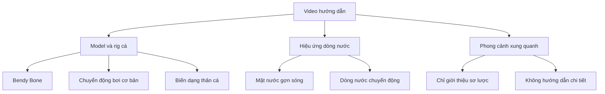

# 01 — Giới thiệu & Tổng quan

| Thuộc tính       | Nội dung                                                                 |
| ---------------- | ------------------------------------------------------------------------ |
| **Video**        | Chưa rõ tên video hoặc kênh — nội dung được tổng hợp từ transcript       |
| **Phân đoạn**    | Mở đầu                                                                   |
| **Thời điểm**    | 00:00–00:56                                                              |
| **Chủ đề chính** | Giới thiệu kỹ thuật rig cá đơn giản bằng Bendy Bone và phạm vi của video |

---

## 1. Mục tiêu bài học

Sau phần này, người học sẽ:

* Hiểu được phạm vi của kỹ thuật rig cá được trình bày trong video.
* Phân biệt rig **đơn giản bằng Bendy Bone** với hệ thống rig cá nâng cao.
* Biết trước những nội dung video sẽ tập trung hướng dẫn.
* Hiểu rằng phần phong cảnh chỉ được giới thiệu sơ lược, không phải trọng tâm chính.
* Chuẩn bị đúng kỳ vọng trước khi bắt đầu dựng model và rig cá.

---

## 2. Tổng quan nội dung

Tác giả mở đầu bằng việc xác định rõ mục tiêu của video: hướng dẫn một phương pháp **đơn giản và nhanh chóng** để tạo một vài con cá, sau đó làm cho chúng có chuyển động bơi cơ bản trong Blender.

Kỹ thuật chính được sử dụng là:

> **Bendy Bone — xương có khả năng uốn cong mềm mại để làm biến dạng thân cá.**

Tác giả nhấn mạnh rằng đây **không phải hệ thống rig nâng cao** từng được trình bày trong một video khác. Thay vào đó, video sử dụng một bộ rig tối giản, phù hợp với người mới hoặc những dự án không yêu cầu quá nhiều điều khiển phức tạp.

Rig này chủ yếu phục vụ các chuyển động như:

* Uốn thân cá sang trái và phải.
* Tạo chuyển động lắc nhẹ khi bơi.
* Điều khiển toàn bộ thân cá bằng một hệ thống xương đơn giản.
* Tạo chuyển động nhanh mà không cần dựng quá nhiều bone riêng lẻ.

---

## 3. Phạm vi của video

Video tập trung vào hai nội dung chính:

1. **Tạo và rig cá bằng Bendy Bone.**
2. **Tạo hiệu ứng dòng nước hoặc mặt nước gợn sóng chuyển động.**

Phần môi trường xung quanh, chẳng hạn như cây cối, đá, bờ suối hoặc phong cảnh hoàn chỉnh, sẽ không được hướng dẫn chi tiết.

### Sơ đồ phạm vi nội dung



---

## 4. Rig đơn giản và rig nâng cao

| Rig đơn giản trong video           | Rig cá nâng cao                             |
| ---------------------------------- | ------------------------------------------- |
| Sử dụng ít bone                    | Sử dụng nhiều bone và controller            |
| Chủ yếu dùng Bendy Bone            | Có thể kết hợp IK, FK, Driver và Constraint |
| Phù hợp với chuyển động bơi cơ bản | Điều khiển chi tiết từng bộ phận            |
| Dễ thiết lập và chỉnh sửa          | Mất nhiều thời gian xây dựng                |
| Phù hợp với người mới              | Phù hợp với animator có kinh nghiệm         |
| Ít điều khiển vây độc lập          | Có thể điều khiển từng vây riêng biệt       |

Rig đơn giản là lựa chọn phù hợp khi:

* Cá xuất hiện ở khoảng cách xa camera.
* Cảnh có nhiều con cá.
* Không cần điều khiển từng chiếc vây.
* Cần hoàn thành animation nhanh.
* Chỉ cần chuyển động bơi nhẹ hoặc lặp lại.

---

## 5. Nội dung không được trình bày chi tiết

Video không tập trung sâu vào:

* Modeling phong cảnh.
* Dựng cây cối hoặc thực vật dưới nước.
* Tạo đá và địa hình phức tạp.
* Rig độc lập cho từng chiếc vây.
* Mô phỏng vảy cá.
* Hệ thống cơ bắp hoặc biến dạng sinh học chính xác.
* Rig cá nâng cao với nhiều controller.
* Lighting và compositing chuyên sâu cho toàn bộ cảnh.

Do đó, người học có thể cần tự bổ sung các phần này nếu muốn xây dựng một cảnh hoàn chỉnh.

---

## 6. Quy trình tổng thể dự kiến

```text
Chuẩn bị Blender
        ↓
Dựng hình cá đơn giản
        ↓
Tạo Armature
        ↓
Thiết lập Bendy Bone
        ↓
Gắn mesh cá với rig
        ↓
Tạo chuyển động bơi
        ↓
Nhân bản thêm nhiều cá
        ↓
Tạo lòng suối và mặt nước
        ↓
Thêm hiệu ứng dòng chảy
        ↓
Hoàn thiện cảnh
```

Quy trình này ưu tiên:

* Tốc độ thiết lập.
* Dễ hiểu.
* Ít controller.
* Chuyển động đủ thuyết phục.
* Khả năng áp dụng cho nhiều con cá trong cùng một cảnh.

---

## 7. Quy trình chuẩn bị gợi ý

### Bước 1: Xác định yêu cầu của dự án

Trước khi bắt đầu, cần xác định mức độ chi tiết cần thiết:

* Cá có xuất hiện gần camera không?
* Có cần điều khiển từng chiếc vây không?
* Có bao nhiêu con cá trong cảnh?
* Chuyển động bơi có cần phức tạp không?
* Animation có được sử dụng theo dạng vòng lặp không?

Nếu cá chỉ xuất hiện trong cảnh rộng hoặc bơi theo nhóm, rig Bendy Bone đơn giản thường đã đủ đáp ứng.

### Bước 2: Chuẩn bị phần mềm

* Mở Blender.
* Tạo một project mới.
* Kiểm tra đơn vị và Frame Rate.
* Chuẩn bị Collection riêng cho cá.
* Lưu file trước khi bắt đầu.

### Bước 3: Chuẩn bị ảnh tham chiếu

Nên có ít nhất:

* Ảnh nhìn ngang của cá.
* Ảnh nhìn từ trên xuống.
* Ảnh tham chiếu cách cá uốn thân khi bơi.
* Video cá bơi thực tế nếu cần animation tự nhiên hơn.

### Bước 4: Xác định phạm vi phong cảnh

Người học nên chuẩn bị tinh thần rằng phần phong cảnh sẽ cần tự phát triển thêm sau khi hoàn thành nội dung chính của video.

---

## 8. Phím tắt và công cụ liên quan

Trong đoạn mở đầu chưa có thao tác kỹ thuật cụ thể trong Blender.

Tuy nhiên, các công cụ có khả năng xuất hiện ở những phần sau gồm:

| Công cụ                 | Công dụng dự kiến                          |
| ----------------------- | ------------------------------------------ |
| **Armature**            | Tạo hệ thống xương cho cá                  |
| **Bendy Bone**          | Uốn cong thân cá mềm mại                   |
| **Pose Mode**           | Điều khiển và tạo dáng cho rig             |
| **Weight Paint**        | Điều chỉnh mức ảnh hưởng của bone lên mesh |
| **Keyframe**            | Ghi lại chuyển động theo thời gian         |
| **Graph Editor**        | Tinh chỉnh nhịp và độ mượt của animation   |
| **Modifiers**           | Tạo hiệu ứng hoặc biến dạng bổ sung        |
| **Shader Editor**       | Thiết lập vật liệu nước                    |
| **Displace hoặc Noise** | Tạo bề mặt nước gợn sóng                   |

---

## 9. Lưu ý quan trọng

### 9.1. Không nên kỳ vọng rig quá chi tiết

Rig trong video được thiết kế để:

* Dễ thực hiện.
* Dễ hiểu.
* Tạo chuyển động nhanh.
* Phù hợp với animation cơ bản.

Rig có thể không phù hợp nếu dự án yêu cầu:

* Close-up khuôn mặt cá.
* Điều khiển từng tia vây.
* Chuyển động miệng và mang cá chi tiết.
* Chuyển động chiến đấu hoặc đổi hướng đột ngột.
* Mô phỏng sinh học chính xác.

### 9.2. Bendy Bone không tự tạo animation

Bendy Bone chỉ giúp thân cá uốn cong mềm mại. Người dùng vẫn phải:

* Tạo keyframe.
* Điều chỉnh nhịp bơi.
* Thiết lập độ trễ giữa đầu, thân và đuôi.
* Tinh chỉnh chuyển động trong Graph Editor.

### 9.3. Phong cảnh cần được bổ sung riêng

Video chỉ hướng dẫn nhanh phần dòng nước. Để có một cảnh suối hoàn chỉnh, có thể cần thêm:

* Đá.
* Cát hoặc bùn.
* Cây thủy sinh.
* Bọt nước.
* Ánh sáng xuyên qua mặt nước.
* Sương mờ dưới nước.
* Vật thể trôi theo dòng chảy.

### 9.4. Rig đơn giản vẫn cần model phù hợp

Mesh cá nên có đủ topology theo chiều dài thân để Bendy Bone có thể uốn cong mượt mà.

Nếu mesh có quá ít cạnh ngang, thân cá có thể:

* Bị gãy khúc.
* Biến dạng cứng.
* Xuất hiện các góc nhọn.
* Không uốn đều theo bone.

---

## 10. Lỗi kỳ vọng thường gặp

| Kỳ vọng chưa phù hợp                | Thực tế của video                                |
| ----------------------------------- | ------------------------------------------------ |
| Rig hoàn chỉnh cho mọi loại cá      | Rig tối giản cho chuyển động cơ bản              |
| Điều khiển độc lập mọi chiếc vây    | Chủ yếu điều khiển thân và đuôi                  |
| Phong cảnh suối được dựng đầy đủ    | Chỉ giới thiệu hiệu ứng nước                     |
| Animation hoàn toàn tự động         | Người dùng vẫn cần tạo keyframe                  |
| Bendy Bone giải quyết mọi biến dạng | Mesh và Weight Paint vẫn phải được chuẩn bị đúng |
| Có thể dùng ngay cho close-up       | Có thể cần bổ sung rig chi tiết hơn              |

---

## 11. Checklist thực hành

### Trước khi bắt đầu

* [ ] Đã hiểu đây là rig cá đơn giản bằng Bendy Bone.
* [ ] Đã phân biệt rig này với hệ thống rig cá nâng cao.
* [ ] Đã xác định mức độ chi tiết cần thiết cho dự án.
* [ ] Đã chuẩn bị Blender và tạo project mới.
* [ ] Đã lưu file làm việc.
* [ ] Đã chuẩn bị ảnh tham chiếu cá nếu cần.
* [ ] Đã hiểu rằng phần phong cảnh không được hướng dẫn đầy đủ.
* [ ] Đã sẵn sàng bắt đầu dựng hình hoặc block-out ở chương tiếp theo.

### Kỳ vọng về kết quả

* [ ] Tạo được thân cá có khả năng uốn cong.
* [ ] Tạo được chuyển động bơi cơ bản.
* [ ] Có thể sử dụng rig cho nhiều con cá.
* [ ] Tạo được hiệu ứng mặt nước hoặc dòng nước đơn giản.
* [ ] Biết những phần cần tự bổ sung để hoàn thiện cảnh.

---

## 12. Tóm tắt

Video hướng dẫn một quy trình **rig cá tối giản bằng Bendy Bone**, tập trung vào khả năng uốn cong thân cá và tạo chuyển động bơi cơ bản mà không cần xây dựng một hệ thống rig quá phức tạp.

Ngoài phần rig và animation cá, tác giả cũng giới thiệu nhanh cách tạo hiệu ứng dòng nước hoặc mặt nước chuyển động. Tuy nhiên, những thành phần phong cảnh xung quanh sẽ không được phân tích chi tiết.

Điểm quan trọng nhất của phần mở đầu là xác định đúng kỳ vọng:

> Đây là một phương pháp nhanh, đơn giản và dễ áp dụng để tạo cá bơi trong Blender, không phải một hệ thống rig sinh vật hoàn chỉnh hoặc chuyên sâu.

---

# Bài luyện tập

## Mục tiêu


## Đề bài


## Yêu cầu hoàn thành

- [ ] 
- [ ] 
- [ ] 

## Kết quả / lời giải


## Ghi chú
