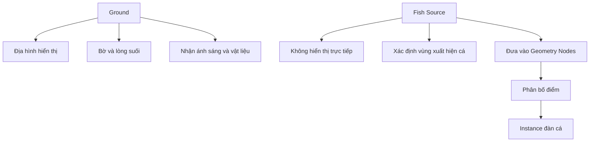

# 02 — Dựng lòng suối cơ bản

| Thuộc tính       | Nội dung                                                                                                 |
| ---------------- | -------------------------------------------------------------------------------------------------------- |
| **Video**        | Không rõ tên/kênh — nội dung được tổng hợp từ transcript                                                 |
| **Đoạn**         | Bước dựng phong cảnh                                                                                     |
| **Thời điểm**    | `00:56–02:25`                                                                                            |
| **Chủ đề chính** | Plane, Subdivide, Circle Select, Proportional Editing, Subdivision Surface và object nguồn `Fish Source` |

---

## 1. Mục tiêu bài học

Sau phần này, bạn có thể:

* Dựng nhanh một bề mặt địa hình đơn giản làm **lòng suối**.
* Tạo đường suối uốn lượn bằng tổ hợp:

  * **Circle Select** — `C`
  * **Proportional Editing** — `O`
* Làm mượt địa hình bằng **Subdivision Surface**.
* Chuẩn bị object phụ có tên **`Fish Source`** để sử dụng trong hệ thống **Geometry Nodes** ở phần sau.
* Phân biệt rõ vai trò của:

  * **`Ground`**: địa hình xuất hiện trong cảnh.
  * **`Fish Source`**: hình học nguồn dùng để phân bố cá.

---

## 2. Tổng quan quy trình


Có thể tóm tắt thành hai nhánh chính:

```text
Plane chính
└── Ground
    ├── Tạo hình lòng suối
    ├── Làm mượt
    ├── Gán vật liệu
    └── Xuất hiện trong render

Plane phụ
└── Fish Source
    ├── Đặt bên dưới Ground
    ├── Không cần vật liệu chi tiết
    ├── Không cần xuất hiện trong render
    └── Làm vùng nguồn phân bố cá
```

---

## 3. Dựng mặt đất ban đầu

### 3.1. Thêm Plane

Bắt đầu bằng cách thêm một **Plane**:

```text
Shift + A → Mesh → Plane
```

Sau đó, scale Plane theo kích thước tổng thể của cảnh:

```text
S → kéo chuột
```

Plane này sẽ trở thành bề mặt địa hình chính và được đặt tên là **`Ground`**.

---

### 3.2. Tăng mật độ lưới bằng Subdivide

Chuyển sang **Edit Mode**:

```text
Tab
```

Chọn toàn bộ mesh, sau đó:

```text
Chuột phải → Subdivide
```

Trong bảng điều chỉnh thao tác, đặt:

```text
Number of Cuts: khoảng 50
```

Mục đích là tạo đủ số lượng vertex để có thể uốn và hạ bề mặt thành một lòng suối mềm mại.

> `50` là giá trị được tác giả sử dụng. Không bắt buộc phải giữ nguyên; có thể giảm hoặc tăng tùy theo kích thước Plane và mức độ chi tiết mong muốn.

---

## 4. Tạo đường lòng suối

### 4.1. Bỏ chọn toàn bộ vertex

Trước khi chọn vùng lòng suối, hãy bỏ chọn toàn bộ mesh:

```text
Alt + A
```

Ở một số thiết lập hoặc phiên bản Blender, có thể dùng:

```text
Double-tap A
```

Transcript đề cập thao tác nhấn `2` hai lần, nhưng đây có thể là thói quen hoặc thiết lập phím riêng của tác giả, không phải phím bỏ chọn mặc định phổ biến của Blender.

---

### 4.2. Chọn vùng bằng Circle Select

Kích hoạt **Circle Select**:

```text
C
```

Sau đó quét dọc theo bề mặt Plane để tạo một vùng chọn có hình dạng giống dòng suối.

Điều khiển Circle Select:

| Thao tác                      | Điều khiển               |
| ----------------------------- | ------------------------ |
| Thay đổi kích thước vùng chọn | Cuộn con lăn chuột       |
| Chọn vertex                   | Giữ hoặc nhấn chuột trái |
| Bỏ chọn vertex                | Giữ chuột giữa           |
| Kết thúc Circle Select        | `Esc` hoặc chuột phải    |

Không cần tạo đường suối quá đều. Một đường hơi cong, thay đổi độ rộng nhẹ và không hoàn toàn đối xứng thường cho cảm giác tự nhiên hơn.

```text
Không nên:

──────────────

Nên:

────╮
    ╰────╮
         ╰────
```

---

## 5. Tạo độ trũng bằng Proportional Editing

### 5.1. Bật Proportional Editing

Sau khi đã chọn các vertex chạy dọc theo lòng suối, bật **Proportional Editing**:

```text
O
```

Proportional Editing cho phép thao tác biến đổi không chỉ ảnh hưởng đến các vertex đang chọn mà còn lan dần sang các vertex xung quanh.

Nhờ đó, địa hình có sự chuyển tiếp mềm thay vì xuất hiện các cạnh gãy đột ngột.

---

### 5.2. Hạ thấp vùng lòng suối

Di chuyển vùng vertex đã chọn xuống theo trục Z:

```text
G → Z
```

Trong lúc đang di chuyển, cuộn con lăn chuột để điều chỉnh bán kính ảnh hưởng:

```text
Lăn lên   → vùng ảnh hưởng nhỏ hơn
Lăn xuống → vùng ảnh hưởng lớn hơn
```

Mục tiêu là tạo một vùng trũng có tiết diện tương đối mềm:

```text
Trước:

────────────────────────

Sau:

────────╲________╱───────
          lòng suối
```

Nếu bán kính quá nhỏ, lòng suối sẽ giống một rãnh sắc:

```text
───────╲__╱───────
```

Nếu bán kính phù hợp, hai bên bờ sẽ chuyển tiếp tự nhiên hơn:

```text
─────╲________╱─────
```

---

## 6. Làm mượt địa hình

Sau khi đã có hình dạng lòng suối cơ bản, thoát khỏi Edit Mode:

```text
Tab
```

Thêm **Subdivision Surface Modifier**:

```text
Ctrl + 2
```

Lệnh này thường tạo Subdivision Surface với mức viewport tương ứng là `2`.

Cũng có thể thêm thủ công:

```text
Modifier Properties
→ Add Modifier
→ Generate
→ Subdivision Surface
```

### Vai trò của Subdivision Surface

* Làm mượt các vùng chuyển tiếp.
* Giảm cảm giác lưới bị gãy hoặc góc cạnh.
* Giúp lòng suối trông hữu cơ hơn.
* Làm bề mặt phù hợp hơn khi render hoặc thêm vật liệu.

> Subdivision Surface không thay thế cho việc có đủ topology. Nếu Plane được chia quá ít, modifier có thể làm mềm bề mặt nhưng vẫn khó tạo được đường suối chi tiết.

---

## 7. Gán vật liệu cơ bản

Trong video, tác giả không đầu tư nhiều vào vật liệu địa hình. `Ground` chỉ được gán một màu đơn giản, gần với:

* Nâu tối.
* Xanh rêu.
* Xanh nâu đậm.
* Màu bùn hoặc đá ẩm.

Quy trình cơ bản:

1. Chọn object `Ground`.
2. Mở **Material Properties**.
3. Tạo material mới.
4. Thay đổi **Base Color** thành màu nâu-xanh đậm.
5. Bật **Material Preview** để xem vật liệu trực tiếp trong viewport.

```text
Ground
└── Material
    └── Principled BSDF
        └── Base Color: nâu-xanh đậm
```

Trong một dự án hoàn chỉnh hơn, có thể bổ sung:

* Texture đất, cát hoặc bùn.
* Normal Map.
* Roughness Map.
* Displacement.
* Đá nhỏ và thực vật bằng Geometry Nodes.
* Các vùng vật liệu khác nhau giữa lòng suối và bờ.

Tuy nhiên, mục tiêu của phần này là dựng nhanh bố cục, không phải hoàn thiện môi trường.

---

## 8. Tạo object `Fish Source`

### 8.1. Thêm Plane thứ hai

Thêm một Plane mới:

```text
Shift + A → Mesh → Plane
```

Plane này không phải là một phần trực quan của cảnh. Nó chỉ đóng vai trò hình học nguồn cho Geometry Nodes.

---

### 8.2. Đặt Plane bên dưới bề mặt

Di chuyển Plane xuống dưới `Ground` một khoảng nhỏ:

```text
G → Z
```

Vị trí tương đối:

```text
Nhìn ngang:

        Ground
─────────╲________╱─────────

          Fish Source
       ───────────────
```

Plane nguồn nên nằm bên dưới khu vực lòng suối, nơi đàn cá dự kiến sẽ xuất hiện.

Tùy vào cách hệ thống Geometry Nodes được xây dựng sau này, `Fish Source` có thể được:

* Scale theo chiều dài lòng suối.
* Biến đổi thành một vùng thể tích.
* Dùng làm mesh đầu vào cho `Distribute Points on Faces`.
* Dùng để xác định phạm vi xuất hiện của đàn cá.

---

### 8.3. Đặt tên object

Đổi tên hai object để tránh nhầm lẫn:

```text
Plane địa hình → Ground
Plane nguồn    → Fish Source
```

Có thể đổi tên nhanh trong **Outliner** hoặc bằng phím:

```text
F2
```

Cấu trúc scene lúc này:

```text
Scene Collection
├── Ground
└── Fish Source
```

---

## 9. Phân biệt `Ground` và `Fish Source`

| Đặc điểm                  | `Ground`           | `Fish Source`              |
| ------------------------- | ------------------ | -------------------------- |
| Vai trò                   | Địa hình/lòng suối | Vùng nguồn để phân bố cá   |
| Xuất hiện trong render    | Có                 | Thường không               |
| Cần vật liệu              | Có                 | Không bắt buộc             |
| Cần tạo hình đẹp          | Có                 | Chỉ cần đúng phạm vi       |
| Dùng trong Geometry Nodes | Có thể             | Có, là nguồn chính         |
| Vị trí                    | Bề mặt cảnh        | Ngay dưới bề mặt lòng suối |

### Sơ đồ vai trò



---

## 10. Quy trình thực hành từng bước

### Bước 1 — Tạo Ground

1. Thêm một Plane.
2. Scale Plane theo kích thước cảnh.
3. Đổi tên thành `Ground`.

### Bước 2 — Tăng mật độ mesh

1. Vào Edit Mode.
2. Chọn toàn bộ vertex.
3. Chuột phải → **Subdivide**.
4. Đặt khoảng `50` lần chia.

### Bước 3 — Vẽ vùng lòng suối

1. Bỏ chọn toàn bộ.
2. Nhấn `C` để bật Circle Select.
3. Quét một đường cong dọc theo Plane.
4. Điều chỉnh kích thước vùng chọn bằng con lăn chuột.

### Bước 4 — Hạ lòng suối

1. Nhấn `O` để bật Proportional Editing.
2. Nhấn `G → Z`.
3. Kéo vùng đã chọn xuống.
4. Cuộn chuột để điều chỉnh bán kính ảnh hưởng.

### Bước 5 — Làm mượt

1. Thoát Edit Mode.
2. Nhấn `Ctrl + 2`.
3. Kiểm tra lại hình dạng địa hình.

### Bước 6 — Gán vật liệu

1. Tạo material mới.
2. Chọn màu nâu-xanh đậm.
3. Bật Material Preview để kiểm tra.

### Bước 7 — Tạo Fish Source

1. Thêm Plane thứ hai.
2. Scale theo vùng lòng suối.
3. Đặt nó ngay dưới `Ground`.
4. Đổi tên thành `Fish Source`.

---

## 11. Phím tắt và công cụ liên quan

| Thao tác                                 | Phím tắt hoặc đường dẫn                             |
| ---------------------------------------- | --------------------------------------------------- |
| Thêm Plane                               | `Shift + A → Mesh → Plane`                          |
| Vào hoặc thoát Edit Mode                 | `Tab`                                               |
| Chọn toàn bộ                             | `A`                                                 |
| Bỏ chọn toàn bộ                          | `Alt + A` hoặc double-tap `A`, tùy phiên bản/keymap |
| Subdivide                                | Chuột phải → `Subdivide`                            |
| Circle Select                            | `C`                                                 |
| Thay đổi kích thước Circle Select        | Con lăn chuột                                       |
| Thoát Circle Select                      | `Esc` hoặc chuột phải                               |
| Bật/tắt Proportional Editing             | `O`                                                 |
| Di chuyển theo trục Z                    | `G → Z`                                             |
| Điều chỉnh bán kính Proportional Editing | Con lăn chuột khi đang transform                    |
| Thêm Subdivision Surface                 | `Ctrl + 2`                                          |
| Đổi tên object                           | `F2`                                                |
| Scale object                             | `S`                                                 |

---

## 12. Lỗi thường gặp và cách khắc phục

### 12.1. Không đủ vertex để tạo đường suối

**Biểu hiện:**

* Đường cong bị vuông.
* Bề mặt gãy mạnh.
* Khó kiểm soát hình dạng bằng Circle Select.

**Nguyên nhân:**

Plane chưa được Subdivide đủ.

**Cách khắc phục:**

* Undo và Subdivide lại với số lần chia lớn hơn.
* Hoặc thêm các edge loop tại vùng cần chi tiết.

---

### 12.2. Lòng suối bị lõm quá sắc

**Biểu hiện:**

```text
──────╲__╱──────
```

**Nguyên nhân:**

* Chưa bật Proportional Editing.
* Bán kính ảnh hưởng quá nhỏ.
* Kéo vertex xuống quá sâu.

**Cách khắc phục:**

* Bật `O`.
* Tăng bán kính ảnh hưởng bằng con lăn chuột.
* Giảm độ sâu theo trục Z.

---

### 12.3. Toàn bộ Plane cùng di chuyển

**Nguyên nhân có thể:**

* Tất cả vertex vẫn đang được chọn.
* Bán kính Proportional Editing quá lớn.

**Cách khắc phục:**

1. Bỏ chọn toàn bộ.
2. Chỉ chọn vùng lòng suối bằng Circle Select.
3. Giảm bán kính ảnh hưởng khi transform.

---

### 12.4. Bề mặt xuất hiện nếp gấp hoặc méo

**Nguyên nhân:**

* Vùng chọn không liên tục.
* Một số vertex bị kéo xuống quá sâu.
* Hình dạng lòng suối đổi hướng quá đột ngột.

**Cách khắc phục:**

* Chuyển sang Vertex Select để kiểm tra vùng chọn.
* Dùng Smooth Vertices.
* Điều chỉnh lại các vùng gấp bằng Proportional Editing.
* Tạo đường cong rộng và chuyển hướng từ từ.

---

### 12.5. `Fish Source` xuất hiện trong render

**Nguyên nhân:**

Object vẫn đang bật khả năng render.

**Cách khắc phục:**

Trong Outliner, tắt biểu tượng camera của `Fish Source`:

```text
Fish Source → Disable in Renders
```

Có thể giữ object hiển thị trong viewport để chỉnh sửa, nhưng không cho xuất hiện trong ảnh render cuối.

---

### 12.6. Nhầm vai trò giữa hai Plane

Không nên chỉnh `Fish Source` như một bề mặt cảnh hoàn chỉnh.

```text
Ground
→ cần hình dạng đẹp
→ cần vật liệu
→ xuất hiện trong render

Fish Source
→ chỉ cần đúng kích thước và vị trí
→ không cần vật liệu
→ không xuất hiện trong render
```

---

### 12.7. Scene bị nặng sau khi Subdivide

Subdivide `50` lần tạo ra số lượng polygon tương đối lớn, đặc biệt khi kết hợp thêm Subdivision Surface.

Cách tối ưu:

* Giảm số lần Subdivide nếu không cần quá nhiều chi tiết.
* Giữ mức Subdivision viewport ở `1` khi dựng cảnh.
* Chỉ tăng lên `2` khi kiểm tra hoặc render.
* Không Apply Subdivision Surface quá sớm.
* Dùng topology tập trung ở khu vực lòng suối thay vì chia đều toàn bộ Plane trong các dự án lớn.

---

## 13. Gợi ý cải thiện hình dạng tự nhiên

Để lòng suối trông bớt nhân tạo, tránh tạo đường có:

* Chiều rộng không đổi hoàn toàn.
* Độ sâu giống nhau trên toàn tuyến.
* Hai bờ đối xứng tuyệt đối.
* Các khúc cua lặp lại đều đặn.

Thay vào đó, có thể tạo:

```text
Đầu suối hẹp
    ↓
Đoạn giữa rộng
    ↓
Khúc cua lệch
    ↓
Vùng trũng sâu hơn
    ↓
Đoạn cuối thu hẹp
```

Ví dụ mặt bằng:

```text
       ╭──────╮
───────╯      ╰────╮
                   ╰──────
```

Ví dụ tiết diện:

```text
Bờ trái       Lòng suối       Bờ phải
───────╲________________╱────────
```

---

## 14. Checklist thực hành

### Ground

* [ ] Đã thêm và scale Plane theo kích thước cảnh.
* [ ] Đã đặt tên object là `Ground`.
* [ ] Đã Subdivide với mật độ vertex phù hợp.
* [ ] Đã dùng Circle Select để tạo đường lòng suối.
* [ ] Đã bật Proportional Editing khi hạ thấp địa hình.
* [ ] Hai bên bờ có chuyển tiếp tương đối mềm.
* [ ] Đã thêm Subdivision Surface.
* [ ] Đã gán vật liệu màu cơ bản.

### Fish Source

* [ ] Đã tạo Plane thứ hai.
* [ ] Đã đặt tên object là `Fish Source`.
* [ ] Plane nằm ngay dưới bề mặt lòng suối.
* [ ] Kích thước Plane bao phủ khu vực cá sẽ xuất hiện.
* [ ] Không đầu tư vật liệu không cần thiết.
* [ ] Đã tắt khả năng xuất hiện trong render nếu cần.
* [ ] Object đã sẵn sàng làm đầu vào cho Geometry Nodes.

---

## 15. Kết quả sau chương

Sau khi hoàn thành, scene sẽ có cấu trúc cơ bản:

```text
Scene Collection
├── Ground
│   ├── Mesh lòng suối
│   ├── Subdivision Surface
│   └── Material nâu-xanh đậm
│
└── Fish Source
    ├── Plane nằm dưới lòng suối
    ├── Không cần vật liệu
    └── Dùng cho Geometry Nodes
```

Ở giai đoạn này:

* Địa hình chưa cần quá chi tiết.
* Chưa cần nước, đá hoặc cây thủy sinh.
* `Fish Source` chưa tạo ra cá ngay lập tức.
* Object nguồn chỉ được chuẩn bị trước để sử dụng trong hệ thống phân bố đàn cá ở chương Geometry Nodes.

---

## 16. Tóm tắt

Phần này xây dựng nền tảng địa hình bằng một quy trình nhanh:

```text
Plane
→ Subdivide
→ Circle Select
→ Proportional Editing
→ Hạ lòng suối
→ Subdivision Surface
→ Gán vật liệu
```

Sau đó, một Plane phụ được đặt bên dưới địa hình và đổi tên thành **`Fish Source`**:

```text
Fish Source
→ xác định khu vực đàn cá
→ đưa vào Geometry Nodes
→ phân bố các instance cá
```

Điểm quan trọng nhất là phân biệt hai object:

* **`Ground`** chịu trách nhiệm về hình ảnh của phong cảnh.
* **`Fish Source`** chịu trách nhiệm cung cấp dữ liệu hình học cho hệ thống phân bố cá.

Bước này ưu tiên **tốc độ, bố cục và khả năng chuẩn bị cho procedural workflow**, thay vì hoàn thiện chi tiết môi trường ngay từ đầu.
