# 03 — Block-out và hoàn thiện mesh cá

| Thuộc tính       | Nội dung                                                                                              |
| ---------------- | ----------------------------------------------------------------------------------------------------- |
| **Video**        | Không rõ tên/kênh — nội dung được tổng hợp từ transcript                                              |
| **Phân đoạn**    | Modeling cá                                                                                           |
| **Thời điểm**    | `02:25–08:17`                                                                                         |
| **Chủ đề chính** | Ảnh tham chiếu, block-out từ Cube, Mirror Modifier, dọn mesh, Subdivision Surface và kiểm tra Normals |

---

## 1. Mục tiêu bài học

Sau phần này, chúng ta có thể:

* Dựng nhanh hình dạng cơ bản của một con cá dựa trên ảnh tham chiếu.
* Tạo mesh đơn giản, đủ tốt để rig và biến dạng ở các chương sau.
* Chỉ model một nửa thân cá bằng **Mirror Modifier**.
* Làm thân cá có độ dày bằng **Proportional Editing**.
* Làm mượt bề mặt bằng **Shade Smooth** và **Subdivision Surface**.
* Kiểm tra và sửa hướng **Normals** trước khi chuyển sang UV và vật liệu.

> [!NOTE]
> Mục tiêu của bước này không phải tạo một model cá hoàn chỉnh, có đầy đủ miệng, vảy và vây. Mesh chỉ cần đủ sạch, đủ khối và biến dạng tốt khi rig.

---

## 2. Tổng quan quy trình

```mermaid
flowchart LR
    A[Đưa ảnh tham chiếu vào Blender]
    --> B[Block-out nửa thân cá từ Cube]
    --> C[Tinh chỉnh đầu, thân và đuôi]
    --> D[Dọn hình học tại mặt phẳng đối xứng]
    --> E[Thêm Mirror Modifier]
    --> F[Làm đầy thân bằng Proportional Editing]
    --> G[Shade Smooth và Subdivision Surface]
    --> H[Kiểm tra Face Orientation]
    --> I[Mesh sẵn sàng cho UV và Material]
```



---

## 3. Chuẩn bị ảnh tham chiếu

### 3.1. Chuyển sang góc nhìn trực giao

Đầu tiên, chuyển viewport sang một góc nhìn theo trục:

* `Numpad 1`: Front View.
* `Numpad 3`: Side View.
* `Numpad 7`: Top View.
* `Numpad 5`: chuyển đổi giữa **Perspective** và **Orthographic**.

Đối với model cá nhìn ngang, **Side Orthographic View** thường là góc nhìn thuận tiện nhất.

### 3.2. Đưa ảnh cá vào viewport

Có thể kéo trực tiếp file ảnh cá từ máy tính vào viewport.

Blender sẽ tự động tạo một:

```text
Empty
└── Image
```

Ảnh này chỉ đóng vai trò tham chiếu, không phải một phần của mesh và không xuất hiện trong render thông thường.

### 3.3. Điều chỉnh ảnh tham chiếu

Đặt ảnh ở vị trí dễ quan sát, sau đó:

* Di chuyển ảnh về đúng tâm scene.
* Scale ảnh đến kích thước phù hợp.
* Đặt ảnh phía sau vùng sẽ model.
* Có thể giảm độ trong suốt để nhìn mesh rõ hơn.

---

## 4. Block-out thân cá từ Cube

### 4.1. Thêm khối cơ bản

Thêm một Cube:

```text
Shift + A
→ Mesh
→ Cube
```

Di chuyển Cube ra phía trước ảnh tham chiếu một khoảng nhỏ để tránh hiện tượng hai bề mặt chồng lên nhau.

### 4.2. Tạo mặt phẳng block-out

Trong **Edit Mode**:

1. Subdivide Cube nếu cần thêm điểm điều khiển.
2. Xóa phần hình học không cần thiết.
3. Chỉ giữ lại phần mesh dùng để dựng một nửa thân cá.
4. Chuyển sang chế độ Wireframe hoặc X-Ray để nhìn xuyên qua mesh và ảnh tham chiếu.

Mục tiêu là tạo một lưới đơn giản bám theo hình dạng thân cá trong ảnh.

### 4.3. Chỉ điều chỉnh theo chiều dài và chiều cao

Trong giai đoạn block-out nhìn ngang, chủ yếu scale theo:

* Trục chiều dài của cá.
* Trục chiều cao của cá.

Không nên tạo độ dày thân quá sớm.

```text
Ảnh nhìn ngang

        Chiều cao
            ↑
      ┌───────────┐
Đầu ← │ Thân cá   │ → Đuôi
      └───────────┘
            ↔
        Chiều dài
```

Độ dày sẽ được tạo sau bằng Mirror Modifier và Proportional Editing.

> [!WARNING]
> Scale nhầm theo trục bề dày trong lúc block-out có thể khiến các đỉnh ở đường giữa không còn nằm trên mặt phẳng đối xứng, làm Mirror Modifier khó ghép kín hai nửa.

---

## 5. Nguyên tắc tạo mesh tối giản

Tác giả chủ động không model quá nhiều chi tiết như:

* Miệng.
* Mang cá.
* Vây ngực.
* Vây lưng chi tiết.
* Vảy.
* Các rãnh nhỏ trên đầu.

Thay vào đó, mesh chỉ cần thể hiện được:

* Khối đầu.
* Khối thân.
* Phần bụng.
* Cuống đuôi.
* Đuôi đơn giản.

### Vì sao nên giữ mesh đơn giản?

Mesh ít đỉnh sẽ:

* Dễ chỉnh sửa hơn.
* Dễ rig hơn.
* Biến dạng mượt hơn.
* Ít xuất hiện lỗi topology.
* Chạy nhẹ hơn trong viewport.
* Dễ kiểm soát khi dùng Subdivision Surface.

Tuy nhiên, vẫn nên có một số edge loop hoặc vertex gần vùng mắt và đầu để giữ form đầu ổn định khi Subdivision hoặc rig.

---

## 6. Tinh chỉnh hình dạng thân và đuôi

### 6.1. Di chuyển đỉnh theo ảnh

Chọn từng đỉnh hoặc nhóm đỉnh rồi dùng:

* `G`: di chuyển.
* `S`: scale.
* `R`: xoay.

Trong lúc transform, giữ `Shift` để giảm độ nhạy của chuột và điều chỉnh chính xác hơn.

```text
G / R / S
+ giữ Shift
→ di chuyển chậm và chính xác
```

Kỹ thuật này đặc biệt hữu ích khi:

* Căn đường cong phần đầu.
* Chỉnh sống lưng.
* Thuôn bụng.
* Chỉnh cuống đuôi.
* Đặt các đỉnh theo biên ảnh tham chiếu.

### 6.2. Thuôn đầu và đuôi

Phần đầu nên được thuôn nhẹ thay vì tạo thành một khối vuông.

Phần nối giữa thân và đuôi cũng cần nhỏ dần:

```text
Đầu           Thân             Cuống đuôi      Đuôi
 ___        __________             __          /\
/   \______/          \___________/  \________/  \
```

Không nên làm cuống đuôi mỏng bằng `0`, vì điều này có thể gây lỗi khi bật Subdivision Surface.

### 6.3. Gộp đỉnh

Ở phần giữa của đuôi, có thể chọn một số đỉnh và dùng:

```text
M
→ Merge
```

Ví dụ, gộp khoảng ba đỉnh giữa thành một điểm để tạo cấu trúc đuôi đơn giản.

Tùy tình huống, có thể chọn:

* At Center.
* At Last.
* At First.
* By Distance.

### 6.4. Bevel góc

Chọn cạnh hoặc nhóm cạnh cần bo tròn rồi nhấn:

```text
Ctrl + B
```

Bevel giúp loại bỏ các góc quá nhọn và tạo đường cong mềm hơn cho:

* Phần đầu.
* Góc bụng.
* Cuống đuôi.
* Viền đuôi.

> [!CAUTION]
> Không nên bevel quá mạnh hoặc thêm quá nhiều segment trong giai đoạn block-out. Bevel quá tay có thể tạo mặt nhỏ, đỉnh sát nhau hoặc topology khó kiểm soát.

---

## 7. Dọn mặt phẳng đối xứng

Trước khi thêm Mirror Modifier, cần đảm bảo rằng chỉ còn một nửa mesh.

Các mặt nằm trên hoặc đi xuyên qua mặt phẳng đối xứng cần được xóa để Mirror Modifier có thể tạo nửa còn lại.

Cấu trúc mong muốn:

```text
Trước Mirror

Mặt phẳng đối xứng
        │
        │████████  ← Chỉ giữ một nửa mesh
        │████████
        │████████
```

Không nên giữ một lớp mặt nằm chính giữa hai nửa, vì có thể tạo ra:

* Mặt bên trong mesh.
* Geometry chồng lên nhau.
* Đường nối không kín.
* Lỗi shading.
* Lỗi khi Subdivision.

---

## 8. Thêm Mirror Modifier

### 8.1. Thiết lập Modifier

Trong **Modifier Properties**:

1. Chọn **Add Modifier**.
2. Thêm **Mirror**.
3. Chọn trục đối xứng phù hợp, trong bài là trục `Y`.
4. Bật **Clipping**.
5. Có thể bật thêm **Merge** nếu chưa được bật.

Thiết lập cơ bản:

```text
Mirror Modifier
├── Axis: Y
├── Merge: On
└── Clipping: On
```

### 8.2. Vai trò của Clipping

**Clipping** ngăn các đỉnh tại đường giữa đi xuyên qua mặt phẳng đối xứng.

Khi một đỉnh đã chạm mặt phẳng giữa, nó sẽ bị giữ lại tại đó.

```text
Không bật Clipping          Bật Clipping

    \    /                      \  /
     \  /                        \/
      \/                         │
      /\                         │
     /  \                        /\
```

Clipping giúp hạn chế:

* Khe hở giữa hai nửa.
* Các đỉnh vượt qua tâm.
* Đường giữa bị lệch.
* Mesh không kín.

---

## 9. Căn các đỉnh vào đường giữa

Nếu hai nửa chưa ghép khít, nguyên nhân thường là các đỉnh biên chưa nằm chính xác trên mặt phẳng đối xứng.

### Cách xử lý

1. Vào **Edit Mode**.
2. Chọn toàn bộ vòng đỉnh tại đường giữa.
3. Scale các đỉnh về `0` trên trục đối xứng:

```text
S
→ Y
→ 0
```

Lệnh này làm tất cả các đỉnh được chọn nằm trên cùng một mặt phẳng theo trục `Y`.

4. Di chuyển vòng đỉnh về đúng vị trí tâm nếu cần:

```text
G
→ Y
```

Khi **Clipping** được bật, các đỉnh sẽ dính vào mặt phẳng giữa và không đi xuyên sang nửa còn lại.

> [!TIP]
> Nếu đường giữa không trùng với Origin của object, Mirror Modifier có thể phản chiếu sai vị trí. Hãy kiểm tra Origin và transform của object trước khi tiếp tục.

---

## 10. Làm thân cá có độ dày

Sau khi Mirror, thân cá có thể vẫn rất mỏng hoặc gần như phẳng.

Để tạo khối 3D tự nhiên hơn, sử dụng **Proportional Editing**.

### 10.1. Chọn vùng cần làm phồng

Trong Edit Mode:

1. Chọn một hoặc một vài đỉnh ở giữa thân.
2. Không chọn các đỉnh ngoài cùng ở đầu và đuôi.
3. Bật Proportional Editing bằng `O`.
4. Di chuyển các đỉnh theo trục bề dày:

```text
G
→ Y
```

5. Cuộn con lăn chuột để thay đổi bán kính ảnh hưởng.

### 10.2. Nguyên lý biến dạng

Proportional Editing làm các đỉnh xung quanh di chuyển theo với mức ảnh hưởng giảm dần:

```text
Ảnh hưởng mạnh
      ↓
  · · ● · ·
 ·       ·
·         ·
```

Kết quả là thân cá được làm đầy một cách mềm mại, thay vì chỉ kéo một đỉnh tạo ra góc nhọn.

### 10.3. Hình dạng mong muốn

Nhìn từ phía trên, thân cá nên có dạng gần giống:

```text
Đầu                         Đuôi
  ________________
 /                \____
|                      \__
 \_____________________/
```

Phần giữa thân dày nhất, sau đó mỏng dần về phía đầu và cuống đuôi.

---

## 11. Hoàn thiện bề mặt

### 11.1. Shade Smooth

Chuyển sang **Object Mode**, nhấp chuột phải lên object và chọn:

```text
Shade Smooth
```

Shade Smooth làm ánh sáng được nội suy giữa các mặt, giúp bề mặt trông mềm hơn.

Lưu ý rằng Shade Smooth:

* Không thêm polygon.
* Không thay đổi hình học.
* Chỉ thay đổi cách hiển thị ánh sáng trên bề mặt.

### 11.2. Thêm Subdivision Surface

Sử dụng phím tắt:

```text
Ctrl + 2
```

Lệnh này thường thêm **Subdivision Surface Modifier** với Viewport Level bằng `2`.

Modifier stack gợi ý:

```text
1. Mirror
2. Subdivision Surface
```

Mirror nên được đặt trước Subdivision để Blender:

1. Tạo nửa đối xứng.
2. Ghép đường giữa.
3. Sau đó mới làm mượt toàn bộ mesh.

---

## 12. Sửa lỗi mesh khi bật Subdivision

Sau khi bật Subdivision Surface, có thể xuất hiện:

* Vết lõm bất thường.
* Phần đuôi bị xoắn.
* Mặt bị kéo nhọn.
* Shading xuất hiện nếp gãy.
* Geometry bị co lại quá mạnh.

### Nguyên nhân thường gặp

* Hai hoặc nhiều đỉnh nằm quá gần nhau.
* Có đỉnh bị trùng.
* Cuống đuôi mỏng bằng `0`.
* Có mặt hoặc cạnh bên trong mesh.
* Bevel tạo ra topology quá nhỏ.
* Đường giữa chưa ghép chính xác.
* Thứ tự Modifier chưa phù hợp.

### Cách kiểm tra

1. Tạm tắt Subdivision Surface.
2. Kiểm tra mesh gốc.
3. Tạm tắt Clipping nếu cần chỉnh các đỉnh sát đường giữa.
4. Kéo tách các đỉnh bị chồng.
5. Đảm bảo phần đuôi có độ dày nhỏ nhưng lớn hơn `0`.
6. Bật lại Mirror và Subdivision để kiểm tra.

Có thể dùng thêm:

```text
M
→ By Distance
```

để gộp các đỉnh bị trùng, nhưng cần kiểm tra kỹ khoảng cách Merge để tránh gộp nhầm các vùng cần giữ riêng.

---

## 13. Kiểm tra Normals

### 13.1. Face Orientation

Mở:

```text
Viewport Overlays
→ Face Orientation
```

Blender sẽ hiển thị hướng mặt bằng màu sắc:

| Màu            | Ý nghĩa                              |
| -------------- | ------------------------------------ |
| **Xanh dương** | Mặt trước, Normal hướng ra ngoài     |
| **Đỏ**         | Mặt sau, Normal đang hướng vào trong |

Đối với object cá, phần bề mặt bên ngoài cần hiển thị màu xanh.

### 13.2. Recalculate Normals

Nếu một số mặt bị đỏ:

1. Chọn object cá.
2. Vào Edit Mode.
3. Chọn tất cả bằng `A`.
4. Nhấn:

```text
Shift + N
```

Lệnh này tính toán lại Normals theo hướng ra ngoài.

### 13.3. Flip Normals thủ công

Nếu chỉ có một vùng nhỏ bị sai:

```text
Alt + N
→ Flip
```

Có thể lật riêng Normals của các mặt được chọn mà không ảnh hưởng đến toàn bộ mesh.

---

## 14. Trường hợp của object “Fish Source”

Khi nhìn từ phía dưới object **Fish Source**, toàn bộ mặt plane có thể hiển thị màu đỏ.

Điều này không nhất thiết là lỗi cần sửa.

```text
Fish Source
└── Object nguồn cho Geometry Nodes
    ├── Có thể bị ẩn trong render
    ├── Không xuất hiện trực tiếp
    └── Chỉ dùng để cung cấp geometry hoặc instance
```

Nếu object này:

* Không được render trực tiếp.
* Không dùng vật liệu phụ thuộc hướng mặt.
* Chỉ đóng vai trò dữ liệu cho Geometry Nodes.

thì hướng Normals của nó có thể không ảnh hưởng đến kết quả cuối cùng.

> [!NOTE]
> Normals của Fish Source vẫn có thể quan trọng nếu Geometry Nodes sử dụng Normal để định hướng instance. Chỉ nên bỏ qua khi chắc chắn node setup không phụ thuộc vào hướng mặt.

---

## 15. Quy trình thực hành từng bước

### Bước 1 — Chuẩn bị tham chiếu

* Đặt 3D Cursor.
* Chuyển sang Orthographic Side View.
* Kéo ảnh cá vào viewport.
* Căn chỉnh kích thước và vị trí ảnh.

### Bước 2 — Tạo block-out

* Thêm Cube.
* Subdivide nếu cần.
* Xóa hình học không cần thiết.
* Chỉ giữ một nửa thân cá.
* Chuyển sang Wireframe hoặc X-Ray.
* Căn mesh theo ảnh tham chiếu.

### Bước 3 — Tạo hình thân và đuôi

* Chỉnh đầu, lưng và bụng bằng `G` và `S`.
* Giữ `Shift` để transform chính xác.
* Gộp các đỉnh cần thiết bằng `M`.
* Bevel các góc lớn bằng `Ctrl + B`.
* Thuôn đầu và cuống đuôi.

### Bước 4 — Chuẩn bị đối xứng

* Xóa các mặt tại mặt phẳng giữa.
* Kiểm tra Origin của object.
* Thêm Mirror Modifier.
* Chọn trục `Y`.
* Bật Merge và Clipping.

### Bước 5 — Ghép kín đường giữa

* Chọn vòng đỉnh giữa.
* Dùng `S`, `Y`, `0`.
* Dùng `G`, `Y` để đưa đỉnh về mặt phẳng tâm.
* Kiểm tra không còn khe hở giữa hai nửa.

### Bước 6 — Làm đầy thân

* Chọn đỉnh ở vùng giữa thân.
* Bật Proportional Editing bằng `O`.
* Dùng `G`, `Y` để tạo độ dày.
* Điều chỉnh bán kính ảnh hưởng bằng con lăn chuột.

### Bước 7 — Làm mượt

* Chọn Shade Smooth.
* Thêm Subdivision Surface bằng `Ctrl + 2`.
* Đảm bảo thứ tự Mirror nằm trước Subdivision.

### Bước 8 — Dọn lỗi

* Kiểm tra phần đuôi và đường giữa.
* Tách các đỉnh nằm quá gần nhau.
* Gộp vertex trùng nếu có.
* Đảm bảo các vùng mỏng vẫn có độ dày tối thiểu.

### Bước 9 — Kiểm tra Normals

* Bật Face Orientation.
* Kiểm tra toàn bộ mặt ngoài của cá có màu xanh.
* Dùng `Shift + N` nếu Normals bị lật.
* Chỉ bỏ qua Fish Source khi chắc chắn nó không ảnh hưởng đến Geometry Nodes.

---

## 16. Phím tắt và công cụ liên quan

| Thao tác                         | Phím tắt/Cách thực hiện                      |
| -------------------------------- | -------------------------------------------- |
| Front View                       | `Numpad 1`                                   |
| Side View                        | `Numpad 3`                                   |
| Top View                         | `Numpad 7`                                   |
| Perspective/Orthographic         | `Numpad 5`                                   |
| Mở Viewport Shading Pie          | `Z`                                          |
| Bật/tắt X-Ray                    | `Alt + Z`                                    |
| Di chuyển                        | `G`                                          |
| Xoay                             | `R`                                          |
| Scale                            | `S`                                          |
| Transform chính xác              | Giữ `Shift` trong khi dùng `G`, `R` hoặc `S` |
| Merge vertex                     | `M`                                          |
| Bevel cạnh                       | `Ctrl + B`                                   |
| Bật/tắt Proportional Editing     | `O`                                          |
| Scale phẳng theo trục Y          | `S` → `Y` → `0`                              |
| Thêm Subdivision Surface Level 2 | `Ctrl + 2`                                   |
| Chọn tất cả trong Edit Mode      | `A`                                          |
| Recalculate Normals ra ngoài     | `Shift + N`                                  |
| Mở menu Normals                  | `Alt + N`                                    |
| Face Orientation                 | Viewport Overlays → Face Orientation         |
| Shade Smooth                     | Chuột phải trong Object Mode → Shade Smooth  |

> [!TIP]
> Phím tắt Viewport Shading có thể khác tùy phiên bản Blender hoặc keymap. Có thể nhấn `Z` để mở Shading Pie và chọn **Wireframe**.

---

## 17. Lỗi thường gặp

### 17.1. Hai nửa cá không ghép kín

**Nguyên nhân:**

* Clipping chưa được bật.
* Các đỉnh giữa chưa nằm trên mặt phẳng đối xứng.
* Origin của object bị lệch.
* Chọn sai trục Mirror.

**Cách khắc phục:**

```text
Chọn vòng đỉnh giữa
→ S, Y, 0
→ G, Y
→ Bật Merge và Clipping
```

---

### 17.2. Xuất hiện mặt bên trong thân cá

**Nguyên nhân:**

Các mặt tại mặt phẳng đối xứng chưa được xóa trước khi thêm Mirror.

**Cách khắc phục:**

* Tắt tạm Mirror.
* Xóa các mặt nằm ở đường giữa.
* Bật lại Mirror.
* Kiểm tra Face Orientation.

---

### 17.3. Đuôi bị lỗi khi Subdivision

**Nguyên nhân:**

* Đuôi mỏng bằng `0`.
* Các vertex nằm quá sát nhau.
* Có vertex trùng.
* Bevel tạo nhiều mặt nhỏ.

**Cách khắc phục:**

* Tạo độ dày nhẹ cho đuôi.
* Dịch các vertex ra xa nhau.
* Dùng Merge by Distance cẩn thận.
* Đơn giản hóa topology.

---

### 17.4. Bề mặt bị lõm hoặc gãy

**Nguyên nhân:**

* Edge flow chưa đều.
* Khoảng cách giữa các edge loop chênh lệch quá lớn.
* Có mặt tam giác hoặc n-gon ở vùng cong mạnh.
* Subdivision Surface đang khuếch đại lỗi của mesh gốc.

**Cách khắc phục:**

* Tạm tắt Subdivision.
* Chỉnh lại mesh low-poly.
* Giữ khoảng cách vertex tương đối đều.
* Hạn chế topology phức tạp ở đầu và đuôi.

---

### 17.5. Toàn bộ cá hiển thị màu đỏ

**Nguyên nhân:**

Normals đang hướng vào trong.

**Cách khắc phục:**

```text
Edit Mode
→ A
→ Shift + N
```

---

## 18. Checklist thực hành

### Ảnh tham chiếu

* [ ] Đã đưa được ảnh cá vào scene.
* [ ] Đã chuyển sang góc nhìn Orthographic.
* [ ] Đã căn ảnh đúng tỉ lệ và vị trí.

### Block-out

* [ ] Đã tạo được hình dạng đầu, thân và đuôi cơ bản.
* [ ] Mesh không có quá nhiều vertex không cần thiết.
* [ ] Đã giữ một nửa mesh để dùng Mirror.

### Mirror Modifier

* [ ] Đã chọn đúng trục đối xứng.
* [ ] Đã bật Merge.
* [ ] Đã bật Clipping.
* [ ] Đường giữa không còn khe hở.
* [ ] Không có mặt thừa bên trong thân cá.

### Tạo khối

* [ ] Thân cá đã có độ dày.
* [ ] Phần giữa thân dày hơn đầu và cuống đuôi.
* [ ] Đuôi có độ dày tối thiểu, không bị phẳng bằng `0`.

### Hoàn thiện

* [ ] Đã áp dụng Shade Smooth.
* [ ] Đã thêm Subdivision Surface.
* [ ] Không còn lỗi lõm, xoắn hoặc geometry chồng nhau.
* [ ] Các mặt ngoài của cá hiển thị màu xanh trong Face Orientation.

---

## 19. Kết quả sau bài học

Sau bước này, scene sẽ có một model cá:

* Có hình dạng tổng thể phù hợp với ảnh tham chiếu.
* Được tạo từ topology tương đối đơn giản.
* Đối xứng nhờ Mirror Modifier.
* Có độ dày và thể tích cơ bản.
* Có bề mặt mượt nhờ Subdivision Surface.
* Không có Normals bị lật ở phần hiển thị.
* Sẵn sàng cho bước UV Mapping, Material và Rigging.

---

## 20. Tóm tắt

Kỹ thuật chính của chương là kết hợp:

```text
Ảnh tham chiếu
+ Block-out tối giản
+ Mirror Modifier
+ Proportional Editing
+ Subdivision Surface
+ Kiểm tra Normals
```

Thay vì dành nhiều thời gian model các chi tiết nhỏ, tác giả ưu tiên tạo một mesh cá đơn giản nhưng có hình khối rõ ràng và topology đủ sạch để biến dạng tốt.

Đây là một cách tiếp cận phù hợp với các project cần:

* Dựng model nhanh.
* Tạo nhiều cá trong một cảnh.
* Rig bằng Armature hoặc Bendy Bones.
* Phân bố cá bằng Geometry Nodes.
* Giữ hiệu năng viewport ổn định.

---

# Bài luyện tập

## Mục tiêu


## Đề bài


## Yêu cầu hoàn thành

- [ ] 
- [ ] 
- [ ] 

## Kết quả / lời giải


## Ghi chú
