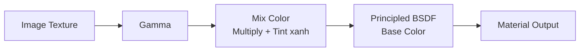
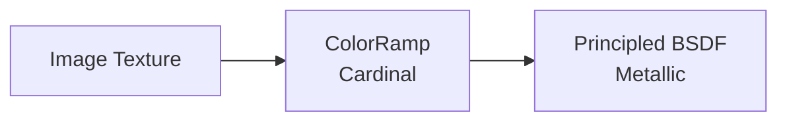
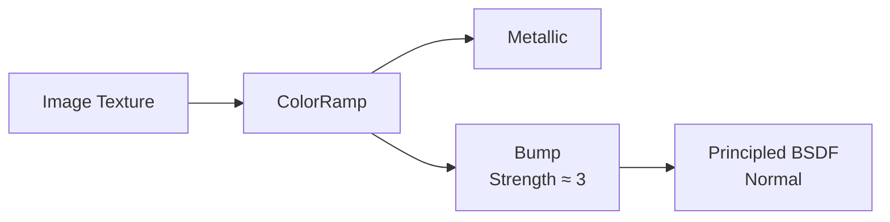
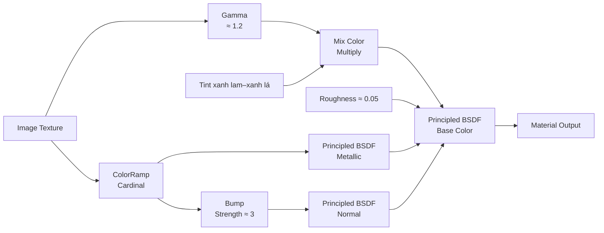

# 04 — UV Unwrapping và Material cho cá

| Thuộc tính       | Nội dung                                                                         |
| ---------------- | -------------------------------------------------------------------------------- |
| **Video**        | Không rõ tên/kênh — chỉ có transcript                                            |
| **Phân đoạn**    | UV & Shading                                                                     |
| **Thời điểm**    | 08:17–11:45                                                                      |
| **Chủ đề chính** | Project from View, Image Texture, Gamma, Color Tint, ColorRamp, Metallic và Bump |

---

## 1. Mục tiêu bài học

Sau chương này, bạn có thể:

* UV unwrap nhanh mesh cá bằng **Project from View**, phù hợp với model đơn giản được dựng theo ảnh tham chiếu.
* Sử dụng chính ảnh tham chiếu làm texture màu cho cá.
* Điều chỉnh màu texture bằng **Gamma** và lớp tint xanh.
* Dùng **ColorRamp** để tạo mask điều khiển độ phản chiếu Metallic.
* Tái sử dụng mask để tạo hiệu ứng gồ ghề cho vảy bằng node **Bump**.
* Chốt cấu trúc mesh trước khi chuyển sang bước rig bằng Armature.

---

## 2. Tổng quan quy trình

```text
Mesh cá đã hoàn thiện
        │
        ▼
Project from View
        │
        ▼
Căn UV theo ảnh tham chiếu
        │
        ▼
Tạo material và nạp Image Texture
        │
        ├──► Gamma ─► Tint xanh ─► Base Color
        │
        └──► ColorRamp
                 ├──► Metallic
                 └──► Bump ─► Normal
        │
        ▼
Apply Mirror Modifier
        │
        ▼
Sẵn sàng cho Rigging
```

---

## 3. UV Unwrapping bằng Project from View

### 3.1. Vì sao dùng Project from View?

Mesh cá đã được block-out dựa trực tiếp trên góc nhìn của ảnh tham chiếu. Vì vậy, phương pháp UV nhanh và phù hợp nhất là chiếu UV theo đúng góc nhìn hiện tại của viewport.

Quy trình:

1. Chuyển sang góc nhìn đã dùng khi dựng cá.
2. Nên sử dụng góc nhìn **Orthographic** để hạn chế biến dạng phối cảnh.
3. Vào **Edit Mode**.
4. Chọn toàn bộ mesh bằng `A`.
5. Nhấn `U`.
6. Chọn **Project from View (Bounds)**.

Tùy chọn **Bounds** sẽ tự động co giãn toàn bộ UV để vừa với vùng UV chuẩn từ `0–1`.

### 3.2. Kết quả mong muốn

UV của thân cá sẽ có hình dạng gần giống với silhouette của ảnh tham chiếu. Khi nạp ảnh vào UV Editor, các bộ phận trên texture sẽ khớp tương đối chính xác với mesh.

```text
Ảnh tham chiếu nhìn ngang
          │
          ▼
Chiếu trực tiếp lên mesh
          │
          ▼
UV có hình dạng gần giống thân cá
```

Tác giả cũng thử phương pháp **Unwrap** thông thường và **Pack Islands**, nhưng kết quả UV bị chia thành nhiều phần không phù hợp với trường hợp này.

### 3.3. Khi nào phương pháp này phù hợp?

**Project from View** đặc biệt hiệu quả khi:

* Model có hình dạng tương đối phẳng.
* Mesh được dựng theo một ảnh nhìn ngang.
* Không cần texture chính xác ở mặt trước, mặt sau hoặc phần bụng.
* Mục tiêu là hoàn thiện nhanh một asset đơn giản.

Phương pháp này không phải lựa chọn tối ưu cho các model 3D phức tạp cần texture đồng đều ở mọi góc nhìn.

---

## 4. Tạo material cơ bản

Tạo một material mới và đặt tên:

```text
fish
```

Trong **Shader Editor**:

1. Thêm node **Image Texture**.
2. Nạp ảnh cá đã dùng làm ảnh tham chiếu.
3. Nối đầu ra `Color` của Image Texture vào chuỗi xử lý màu.
4. Cuối cùng, nối chuỗi này vào `Base Color` của **Principled BSDF**.

Sơ đồ material cơ bản:



Nếu UV được căn đúng, hình ảnh trên texture sẽ hiển thị đúng vị trí trên thân cá.

---

## 5. Điều chỉnh màu texture

### 5.1. Làm tối bằng Gamma

Thêm node **Gamma** sau Image Texture.

Giá trị gợi ý:

```text
Gamma ≈ 1.2
```

Mục đích của node này là điều chỉnh độ sáng của texture trước khi đưa vào material.

> Hiệu ứng thực tế của Gamma phụ thuộc vào texture và không gian màu. Vì vậy, nên quan sát trực tiếp trong Material Preview hoặc Rendered View thay vì chỉ dựa vào con số cố định.

---

### 5.2. Thêm tint xanh bằng Mix Color

Sau Gamma, thêm node **Mix Color** và thiết lập:

| Thuộc tính     | Giá trị gợi ý        |
| -------------- | -------------------- |
| **Blend Mode** | Multiply             |
| **Màu tint**   | Xanh lam pha xanh lá |
| **Factor**     | Khoảng `0.7`         |

Mục đích là tạo tông màu lạnh, giúp cá phù hợp hơn với môi trường dưới nước.

```text
Texture gốc
    │
    ▼
Điều chỉnh Gamma
    │
    ▼
Nhân với màu xanh lam–xanh lá
    │
    ▼
Base Color mang sắc lạnh
```

Nếu màu cá bị xanh quá mạnh, có thể:

* Giảm `Factor`.
* Chọn màu tint nhạt hơn.
* Giảm độ bão hòa của màu tint.
* Chuyển từ Multiply sang một chế độ trộn nhẹ hơn.

---

## 6. Dùng ColorRamp điều khiển Metallic

### 6.1. Tạo mask theo độ sáng texture

Thêm node **ColorRamp** và nối trực tiếp texture gốc vào đầu vào `Fac`.

Thiết lập gợi ý:

| Thuộc tính        | Giá trị            |
| ----------------- | ------------------ |
| **Interpolation** | Cardinal           |
| **Điểm tối**      | Khoảng `0.34–0.35` |
| **Điểm sáng**     | Khoảng `0.55`      |

Việc đặt hai điểm màu khá gần nhau tạo ra một vùng chuyển đổi hẹp và có độ tương phản cao.

```text
Vùng texture tối
        │
        ▼
Metallic thấp hoặc bằng 0

Vùng texture sáng
        │
        ▼
Metallic cao
```

Sau đó, nối đầu ra của ColorRamp vào đầu vào **Metallic** của Principled BSDF.

### 6.2. Ý nghĩa của thiết lập

Các vùng sáng trên ảnh cá thường tương ứng với:

* Vảy đang bắt sáng.
* Vùng có phản xạ mạnh.
* Các chi tiết óng ánh trên bề mặt.

ColorRamp biến những vùng sáng này thành mask, nhờ đó Metallic không được áp dụng đồng đều trên toàn thân.



Cách làm này giúp bề mặt cá có cảm giác phản chiếu chọn lọc và sinh động hơn.

> Da cá không phải kim loại theo nghĩa vật lý. Vì vậy, Metallic ở đây được sử dụng như một thủ thuật tạo hình. Khi cần material sát thực tế hơn, nên dùng Specular, Roughness và lớp ánh xà cừ thay vì đặt Metallic quá cao.

---

## 7. Tạo kết cấu vảy bằng Bump

Thêm node **Bump** và sử dụng chính đầu ra ColorRamp làm dữ liệu chiều cao.

Thiết lập:

| Thuộc tính   | Giá trị gợi ý                      |
| ------------ | ---------------------------------- |
| **Height**   | Đầu ra từ ColorRamp                |
| **Strength** | Khoảng `3`                         |
| **Normal**   | Nối vào Normal của Principled BSDF |

Sơ đồ:



Như vậy, cùng một dữ liệu độ sáng được sử dụng cho hai mục đích:

1. Điều khiển vùng phản chiếu mạnh.
2. Tạo độ lồi lõm giả trên bề mặt vảy.

### Lưu ý

`Strength = 3` là mức khá mạnh. Nếu bề mặt cá trông giống đá hoặc bị gồ ghề quá mức, hãy giảm xuống:

```text
0.2–1.0
```

Ngoài Strength, có thể chỉnh thêm `Distance` để kiểm soát độ sâu của hiệu ứng.

---

## 8. Điều chỉnh Roughness

Tác giả đặt Roughness tổng thể ở mức:

```text
Roughness ≈ 0.05
```

Giá trị này tạo bề mặt rất bóng và phản chiếu mạnh.

Tuy nhiên, Roughness quá thấp có thể khiến cá trông giống:

* Nhựa bóng.
* Kim loại.
* Bề mặt được phủ sơn.
* Đồ chơi 3D.

Trong thực tế, nên thử các khoảng sau:

| Mục tiêu                  | Roughness tham khảo |
| ------------------------- | ------------------: |
| Rất bóng, ướt             |         `0.05–0.15` |
| Da cá ẩm tự nhiên         |          `0.15–0.3` |
| Bề mặt mềm, ít phản chiếu |           `0.3–0.5` |

Giá trị cuối cùng cần được đánh giá trong điều kiện ánh sáng của cảnh hoàn chỉnh.

---

## 9. Sơ đồ node material hoàn chỉnh



Có thể hình dung material được chia thành hai nhánh chính:

```text
NHÁNH MÀU
Image Texture
   └── Gamma
         └── Mix Color
               └── Base Color

NHÁNH CHI TIẾT
Image Texture
   └── ColorRamp
         ├── Metallic
         └── Bump
               └── Normal
```

---

## 10. Chốt mesh trước khi rig

Sau khi hoàn thiện material, tác giả **Apply Mirror Modifier**.

### 10.1. Vì sao Apply Mirror?

Khi Apply Mirror:

* Hai nửa của model trở thành mesh thật.
* Toàn bộ cá trở thành một khối hoàn chỉnh.
* Việc gắn Armature dễ kiểm soát hơn.
* Weight Paint có thể được chỉnh trực tiếp trên cả hai bên.
* Giảm nguy cơ gặp vấn đề với đường nối ở giữa thân.

### 10.2. Điều kiện trước khi Apply

Chỉ Apply Mirror khi đã kiểm tra:

* Hình dáng hai bên cân đối.
* Đường nối giữa thân không bị hở.
* Không còn vertex thừa trên trục đối xứng.
* Tùy chọn `Merge` và `Clipping` hoạt động đúng.
* Không còn nhu cầu chỉnh riêng một nửa model.

> Apply Modifier là thao tác khó hoàn tác sau khi đã lưu và tiếp tục chỉnh sửa. Nên tạo một bản sao dự phòng trước khi Apply.

### 10.3. Giữ nguyên Subdivision Surface

**Subdivision Surface Modifier** vẫn được giữ ở dạng modifier vì:

* Có thể thay đổi số level bất kỳ lúc nào.
* Giúp viewport nhẹ hơn.
* Không làm tăng vĩnh viễn số lượng polygon.
* Không cần thiết phải Apply trước khi rig trong quy trình này.

Thứ tự modifier gợi ý:

```text
Mirror
   │
   ▼
Subdivision Surface
```

Sau khi Apply Mirror:

```text
Armature
   │
   ▼
Subdivision Surface
```

Thứ tự thực tế có thể thay đổi tùy cách rig và kết quả biến dạng mong muốn.

---

## 11. Quy trình thực hành

### Bước 1 — UV unwrap

1. Chọn đúng góc nhìn tham chiếu.
2. Chuyển sang Orthographic View.
3. Vào Edit Mode.
4. Nhấn `A`.
5. Chọn `U > Project from View (Bounds)`.
6. Mở UV Editor và kiểm tra độ khớp với ảnh.

### Bước 2 — Tạo Base Color

1. Tạo material `fish`.
2. Thêm Image Texture.
3. Nạp ảnh tham chiếu.
4. Thêm Gamma với giá trị khoảng `1.2`.
5. Thêm Mix Color ở chế độ Multiply.
6. Chọn tint xanh lam–xanh lá.
7. Điều chỉnh Factor khoảng `0.7`.
8. Nối kết quả vào Base Color.

### Bước 3 — Tạo mask phản chiếu

1. Nối texture gốc vào ColorRamp.
2. Chọn Interpolation là Cardinal.
3. Đặt điểm tối khoảng `0.34–0.35`.
4. Đặt điểm sáng khoảng `0.55`.
5. Nối ColorRamp vào Metallic.

### Bước 4 — Tạo Bump

1. Thêm node Bump.
2. Nối ColorRamp vào Height.
3. Đặt Strength khoảng `3`.
4. Nối Normal của Bump vào Normal của Principled BSDF.

### Bước 5 — Hoàn thiện

1. Đặt Roughness khoảng `0.05`.
2. Kiểm tra material trong Rendered View.
3. Điều chỉnh lại tint, Metallic, Bump và Roughness nếu cần.
4. Tạo bản sao dự phòng của model.
5. Apply Mirror Modifier.
6. Giữ nguyên Subdivision Surface.
7. Chuẩn bị sang bước rigging.

---

## 12. Phím tắt và công cụ liên quan

| Thao tác                          | Phím tắt/Vị trí                        |
| --------------------------------- | -------------------------------------- |
| Chọn toàn bộ mesh trong Edit Mode | `A`                                    |
| Mở menu UV                        | `U`                                    |
| Project from View                 | `U > Project from View`                |
| Project from View (Bounds)        | `U > Project from View (Bounds)`       |
| Chuyển Perspective/Orthographic   | `Numpad 5`                             |
| Thêm node                         | `Shift + A`                            |
| Mở UV Editor                      | Chọn Editor Type > UV Editor           |
| Đổi ColorRamp Interpolation       | Menu Interpolation trên node ColorRamp |
| Apply Modifier                    | Menu mũi tên của modifier > Apply      |
| Xem material                      | Material Preview hoặc Rendered View    |

> `Ctrl + A` trong Object Mode chủ yếu mở menu **Apply Transform** như Location, Rotation và Scale; đây không phải phím tắt mặc định để Apply một modifier.

---

## 13. Lỗi thường gặp và cách xử lý

### 13.1. Texture không khớp với thân cá

**Nguyên nhân:**

* Góc nhìn khi Project from View không giống góc nhìn tham chiếu.
* Viewport đang ở Perspective.
* UV bị xoay hoặc lật.
* Mesh đã thay đổi nhiều sau khi unwrap.

**Cách xử lý:**

* Quay lại đúng góc nhìn ngang.
* Chuyển sang Orthographic.
* Project from View lại.
* Xoay, scale hoặc di chuyển UV thủ công trong UV Editor.

---

### 13.2. Hai bên thân cá dùng cùng một hình ảnh

Project from View có thể khiến UV của hai mặt chồng lên nhau. Điều này phù hợp nếu hai bên cá được phép dùng cùng một texture.

Nếu muốn hai mặt khác nhau, cần:

* Tách UV của hai bên.
* Đặt chúng vào hai vùng riêng trên texture.
* Chuẩn bị texture có hình ảnh cho cả mặt trái và mặt phải.

---

### 13.3. Metallic bị chia thành các mảng rõ rệt

**Nguyên nhân:**

* Khoảng cách hai điểm trên ColorRamp quá hẹp.
* Cardinal tạo vùng chuyển đổi khá gắt.
* Texture gốc có độ tương phản cao.

**Cách xử lý:**

* Tăng khoảng cách giữa hai điểm.
* Đổi Interpolation sang Linear hoặc Ease.
* Giảm giá trị Metallic tổng thể.
* Làm mờ texture mask trước khi đưa vào ColorRamp.

---

### 13.4. Bump quá mạnh

**Biểu hiện:**

* Vảy giống gai hoặc đá.
* Silhouette ánh sáng bị vỡ.
* Bề mặt xuất hiện nhiễu mạnh.

**Cách xử lý:**

* Giảm Strength.
* Giảm Distance.
* Tăng độ mượt của ColorRamp.
* Dùng một texture vảy riêng thay vì ảnh màu gốc.

---

### 13.5. Material trông giống nhựa

**Nguyên nhân:**

* Roughness quá thấp.
* Metallic quá cao.
* Bump quá mạnh.
* Ánh sáng có nguồn phản chiếu lớn.
* Toàn bộ thân có độ bóng giống nhau.

**Cách xử lý:**

* Tăng Roughness.
* Giảm Metallic.
* Dùng mask để thay đổi Roughness theo từng vùng.
* Giảm Bump.
* Kiểm tra material trong ánh sáng của cảnh hoàn chỉnh.

---

### 13.6. Đường giữa thân bị hở sau khi Apply Mirror

**Nguyên nhân:**

* Vertex không nằm chính xác trên trục Mirror.
* Tùy chọn Merge chưa bật.
* Merge Distance quá nhỏ.
* Clipping chưa được bật.

**Cách xử lý:**

1. Hoàn tác nếu có thể.
2. Bật `Merge`.
3. Bật `Clipping`.
4. Đưa các vertex giữa thân về đúng trục.
5. Kiểm tra lại trước khi Apply.

---

## 14. Checklist thực hành

### UV

* [ ] Đã đặt viewport về đúng góc nhìn tham chiếu.
* [ ] Đã chuyển sang Orthographic View.
* [ ] Đã dùng Project from View hoặc Project from View (Bounds).
* [ ] Đã kiểm tra UV trong UV Editor.
* [ ] Texture khớp đúng với thân cá.

### Material

* [ ] Đã tạo material `fish`.
* [ ] Đã nạp ảnh tham chiếu vào Image Texture.
* [ ] Đã thêm Gamma để điều chỉnh độ sáng.
* [ ] Đã thêm tint xanh bằng Mix Color.
* [ ] Đã dùng ColorRamp làm mask Metallic.
* [ ] Đã nối mask vào Bump.
* [ ] Đã kiểm tra Roughness trong ánh sáng thực tế.
* [ ] Material không quá bóng hoặc quá giống kim loại.

### Mesh

* [ ] Đã kiểm tra đường nối của Mirror.
* [ ] Đã tạo bản sao dự phòng.
* [ ] Đã Apply Mirror Modifier.
* [ ] Đã giữ nguyên Subdivision Surface.
* [ ] Mesh đã sẵn sàng cho Armature và Weight Paint.

---

## 15. Tóm tắt

Chương này trình bày một quy trình nhanh để hoàn thiện UV và material cho model cá đơn giản.

Thay vì thực hiện UV unwrap phức tạp, tác giả sử dụng **Project from View** để chiếu UV theo đúng góc nhìn của ảnh tham chiếu. Chính ảnh này tiếp tục được dùng làm Base Color, sau đó được điều chỉnh bằng Gamma và một lớp tint xanh để phù hợp với môi trường nước.

Dữ liệu độ sáng của texture được đưa qua ColorRamp và tái sử dụng cho cả hai mục đích:

* Điều khiển độ phản chiếu Metallic.
* Tạo chi tiết bề mặt bằng Bump.

Cuối cùng, Mirror Modifier được Apply để biến model thành một mesh hoàn chỉnh, trong khi Subdivision Surface vẫn được giữ lại nhằm duy trì khả năng điều chỉnh độ mượt.

```text
Project from View
        +
Ảnh tham chiếu
        +
Gamma và Tint
        +
ColorRamp → Metallic
        +
ColorRamp → Bump
        =
Material cá nhanh, nhẹ và đủ thuyết phục
```

Đây là giải pháp phù hợp khi mục tiêu là hoàn thiện nhanh một model cá để tiếp tục sang giai đoạn **Armature, Weight Paint và Animation**, thay vì xây dựng một bộ texture PBR chuyên sâu.
