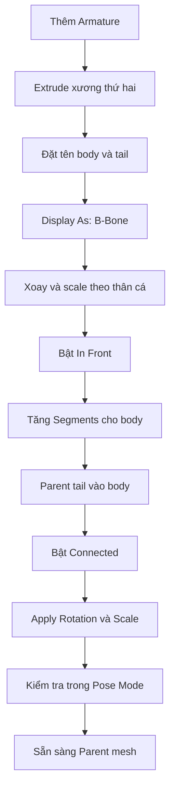

# 05 — Dựng Armature bằng Bendy Bone

| Thuộc tính       | Nội dung                                                                    |
| ---------------- | --------------------------------------------------------------------------- |
| **Video**        | Chưa xác định tên video/kênh — nội dung được tổng hợp từ transcript         |
| **Phần**         | Rigging Part 1                                                              |
| **Thời điểm**    | 11:45–15:48                                                                 |
| **Chủ đề chính** | Armature hai xương, Bendy Bone, B-Bone Segments, Parent Connected, In Front |

---

## 1. Mục tiêu bài học

Sau chương này, chúng ta sẽ:

* Tạo một **Armature tối giản gồm hai xương** để điều khiển thân và đuôi cá.
* Chuyển kiểu hiển thị xương sang **B-Bone**.
* Tăng số lượng **B-Bone Segments** để thân cá có thể uốn cong mượt.
* Kết nối xương đuôi với xương thân bằng quan hệ **Parent + Connected**.
* Bật chế độ **In Front** để Armature luôn hiển thị xuyên qua mesh.
* Căn chỉnh hệ xương nằm đúng bên trong thân cá, chuẩn bị cho bước skinning.

---

## 2. Cấu trúc Armature

Armature trong bài chỉ gồm hai xương nối tiếp:

```text
body
  │
  └── tail
```

Trong đó:

| Xương  | Vai trò                                              |
| ------ | ---------------------------------------------------- |
| `body` | Điều khiển phần thân chính và tạo đường cong uốn mềm |
| `tail` | Điều khiển phần đuôi và hướng chuyển động cuối thân  |

Quan hệ giữa hai xương:

```text
body.tail ───── Connected ───── tail.head
```

Điểm đầu của xương `tail` được khóa vào điểm cuối của xương `body`, giúp hai xương luôn nối liền với nhau.

---

## 3. Nguyên lý của Bendy Bone

Xương thông thường hoạt động gần giống một đoạn thẳng cứng. Khi xoay, toàn bộ xương thay đổi theo một khối duy nhất.

**Bendy Bone**, thường gọi là **B-Bone**, cho phép một xương được chia thành nhiều đoạn nội suy nhỏ. Nhờ đó, xương có thể tạo thành một đường cong liên tục.

```text
Xương thường:

[──────────────]

B-Bone với nhiều Segments:

[──╮
   ╰──╮
      ╰──]
```

Thông số quan trọng nhất là **Segments**:

| Segments | Kết quả                                             |
| -------: | --------------------------------------------------- |
|      `1` | Xương gần như hoạt động như xương cứng thông thường |
|   `5–10` | Đã bắt đầu xuất hiện đường cong tương đối mượt      |
|  `20–25` | Đường cong mượt hơn, phù hợp với thân cá dài        |
|  Quá cao | Mượt hơn nhưng có thể tăng nhẹ chi phí tính toán    |

> Số Segments phù hợp phụ thuộc vào chiều dài xương, mật độ mesh và mức độ uốn mong muốn.

---

## 4. Quy trình thực hiện

### Bước 1 — Thêm Armature

Đặt 3D Cursor gần vị trí con cá, sau đó thêm Armature:

```text
Shift + A
└── Armature
    └── Single Bone
```

Armature mặc định chỉ gồm một xương và thường được hiển thị dưới dạng **Octahedral**.

Di chuyển Armature đến gần phần thân cá để thuận tiện cho việc căn chỉnh.

---

### Bước 2 — Tạo xương đuôi

Chọn Armature và chuyển sang **Edit Mode**.

1. Chọn đầu `tail` của xương hiện tại.
2. Nhấn `E` để Extrude.
3. Di chuyển đoạn xương mới theo chiều dài của thân cá.

Ví dụ:

```text
Xương ban đầu:

[ body ]

Sau khi Extrude:

[ body ][ tail ]
```

Kết quả là một chuỗi gồm hai xương nối tiếp nhau.

---

### Bước 3 — Đặt tên xương

Trong Edit Mode, chọn từng xương và đặt tên:

* Xương phía trước: `body`
* Xương phía sau: `tail`

Việc đặt tên rõ ràng giúp thao tác dễ hơn khi:

* Gán Parent.
* Tạo constraint.
* Weight Paint.
* Điều khiển animation.
* Kiểm tra Vertex Group.

---

### Bước 4 — Chuyển kiểu hiển thị sang B-Bone

Chọn Armature, mở:

```text
Armature Data Properties
└── Viewport Display
    └── Display As
        └── B-Bone
```

Armature sẽ được hiển thị dưới dạng các khối chữ nhật bo cong thay vì hình bát diện.

> **Display As = B-Bone** chủ yếu thay đổi cách hiển thị trong viewport. Khả năng uốn thực tế phụ thuộc vào thiết lập Bendy Bones và cách điều khiển trong Pose Mode.

Có thể điều chỉnh kích thước hiển thị của từng B-Bone để dễ phân biệt xương thân và xương đuôi.

---

### Bước 5 — Xoay Armature theo hướng của cá

Tùy hướng ban đầu của model, có thể cần xoay Armature để trùng với trục dọc của thân cá.

Ví dụ trong transcript:

```text
R → X → 90
R → Z → 90
```

Sau đó:

* Scale Armature theo chiều dài cá.
* Di chuyển Armature vào giữa thân.
* Điều chỉnh điểm nối giữa `body` và `tail` gần vị trí cuống đuôi.
* Giữ toàn bộ hệ xương nằm bên trong mesh.

Sơ đồ vị trí tương đối:

```text
Đầu cá                  Đuôi cá
   ┌─────────────────────────┐
   │       [ body ][ tail ]  │
   └─────────────────────────┘
```

---

### Bước 6 — Bật In Front

Khi Armature nằm bên trong mesh, xương có thể bị bề mặt cá che khuất.

Bật tùy chọn:

```text
Armature Data Properties
└── Viewport Display
    └── In Front
```

Sau khi bật, Armature sẽ luôn xuất hiện phía trước mesh trong viewport.

Điều này giúp:

* Căn chỉnh vị trí xương chính xác hơn.
* Quan sát xương từ nhiều góc nhìn.
* Dễ thao tác trong Edit Mode và Pose Mode.
* Tránh phải liên tục chuyển sang Wireframe hoặc X-Ray.

---

### Bước 7 — Thiết lập B-Bone Segments

Chọn xương `body`, mở:

```text
Bone Properties
└── Bendy Bones
    └── Segments
```

Tăng giá trị từ mặc định `1` lên:

1. Thử `10` để quan sát các đoạn chia.
2. Tăng lên khoảng `20–25` nếu cần đường cong mượt hơn.

Ví dụ:

```text
Segments = 1

[────────────]

Segments = 10

[─][─][─][─][─][─][─][─][─][─]

Khi biến dạng:

[─╮
  ╰─╮
    ╰─╮
      ╰─]
```

Đối với rig cá đơn giản, giá trị khoảng `10–25` thường đủ để tạo chuyển động mềm.

---

### Bước 8 — Parent xương đuôi vào xương thân

Chọn xương `tail`, mở:

```text
Bone Properties
└── Relations
    ├── Parent: body
    └── Connected: Enabled
```

Thiết lập này tạo quan hệ:

```text
body
  └── tail
```

Khi bật **Connected**:

* `tail.head` luôn nằm tại `body.tail`.
* Xương đuôi không thể bị kéo tách khỏi xương thân.
* Chuỗi xương luôn giữ kết nối liền mạch.
* Hạn chế xuất hiện khoảng hở khi pose.

### Cách Parent nhanh bằng phím tắt

Trong Edit Mode:

1. Chọn xương `tail`.
2. `Shift` chọn thêm xương `body`.
3. Nhấn `Ctrl + P`.
4. Chọn **Connected**.

Xương được chọn cuối cùng sẽ trở thành xương cha.

---

### Bước 9 — Apply Transform cho Armature

Nếu Armature đã được xoay hoặc scale trong **Object Mode**, nên Apply Transform trước khi Parent mesh.

Thực hiện trong Object Mode:

```text
Ctrl + A
├── Rotation
└── Scale
```

Hoặc chọn:

```text
Ctrl + A
└── All Transforms
```

Mục tiêu là đưa các giá trị transform về trạng thái sạch:

```text
Rotation: 0°, 0°, 0°
Scale:    1, 1, 1
```

> Không Apply Transform trong Edit Mode. `Ctrl + A` để Apply Rotation và Scale cần được thực hiện khi Armature đang ở Object Mode.

---

### Bước 10 — Kiểm tra cấu trúc rig

Trong Edit Mode, kiểm tra:

* Hai xương có nằm đúng giữa thân cá không.
* Điểm nối `body.tail` và `tail.head` có đúng vị trí cuống đuôi không.
* Xương `tail` có Parent là `body` không.
* Tùy chọn **Connected** đã được bật chưa.
* Xương có bị xoắn hoặc lệch trục bất thường không.

Sau đó chuyển sang **Pose Mode** để kiểm tra biến dạng thực tế.

> Edit Mode dùng để chỉnh cấu trúc và vị trí nghỉ của xương. Pose Mode mới là chế độ phù hợp để thử xoay, uốn và kiểm tra chuyển động của rig.

Nếu xương đang có Rotation trong Pose Mode và cần đưa về trạng thái ban đầu:

```text
Alt + R
```

Có thể dùng thêm:

| Thao tác     | Phím tắt  |
| ------------ | --------- |
| Xóa Location | `Alt + G` |
| Xóa Rotation | `Alt + R` |
| Xóa Scale    | `Alt + S` |

---

## 5. Sơ đồ toàn bộ quy trình



---

## 6. Phím tắt và công cụ liên quan

| Thao tác                          | Phím tắt hoặc vị trí                                     |
| --------------------------------- | -------------------------------------------------------- |
| Thêm Armature                     | `Shift + A > Armature`                                   |
| Chuyển sang Edit Mode             | `Tab`                                                    |
| Extrude xương                     | `E`                                                      |
| Di chuyển                         | `G`                                                      |
| Xoay                              | `R`                                                      |
| Scale                             | `S`                                                      |
| Parent bone                       | `Ctrl + P`                                               |
| Xóa Rotation trong Pose Mode      | `Alt + R`                                                |
| Xóa Location trong Pose Mode      | `Alt + G`                                                |
| Apply Transform trong Object Mode | `Ctrl + A`                                               |
| Đổi kiểu hiển thị thành B-Bone    | Armature Data Properties > Viewport Display > Display As |
| Hiển thị xuyên mesh               | Armature Data Properties > Viewport Display > In Front   |
| Tăng số đoạn B-Bone               | Bone Properties > Bendy Bones > Segments                 |
| Chọn Parent cho bone              | Bone Properties > Relations > Parent                     |
| Khóa nối xương con với xương cha  | Bone Properties > Relations > Connected                  |

---

## 7. Lỗi thường gặp

### 7.1. Không nhìn thấy Armature bên trong cá

**Nguyên nhân:** Armature bị mesh che khuất.

**Khắc phục:**

```text
Armature Data Properties
└── Viewport Display
    └── In Front
```

---

### 7.2. B-Bone vẫn trông giống xương cứng

**Nguyên nhân có thể:**

* `Segments` vẫn đang bằng `1`.
* Chưa chuyển Display As sang B-Bone nên khó quan sát.
* Chưa thiết lập cách điều khiển độ cong.
* Đang thử trong Edit Mode thay vì Pose Mode.

**Khắc phục:**

* Tăng Segments lên `10–25`.
* Chuyển sang Pose Mode để kiểm tra.
* Quan sát kết quả sau khi mesh đã được Parent với Armature.

---

### 7.3. Xương đuôi bị tách khỏi thân

**Nguyên nhân:** Xương `tail` đã Parent nhưng chưa bật **Connected**.

**Khắc phục:**

```text
Bone Properties
└── Relations
    ├── Parent: body
    └── Connected: Enabled
```

---

### 7.4. Armature bị lệch hoặc scale bất thường

**Nguyên nhân:** Armature đã được xoay và scale trong Object Mode nhưng chưa Apply Transform.

**Khắc phục:**

1. Chuyển sang Object Mode.
2. Chọn Armature.
3. Nhấn `Ctrl + A`.
4. Apply Rotation và Scale.

---

### 7.5. Đường cong bị gấp khúc

**Nguyên nhân:**

* Segments quá thấp.
* Mesh cá có quá ít edge loop dọc thân.
* Weight của xương phân bố không đều.

**Khắc phục:**

* Tăng B-Bone Segments.
* Kiểm tra mật độ topology của thân cá.
* Điều chỉnh Weight Paint sau khi Parent mesh.

> B-Bone có nhiều Segments nhưng mesh không đủ vertex vẫn không thể tạo đường cong mượt.

---

### 7.6. Xóa Rotation nhưng hình dạng xương không trở lại như cũ

Cần phân biệt:

* **Edit Mode:** thay đổi Rest Pose của Armature.
* **Pose Mode:** thay đổi tư thế animation.

`Alt + R` trong Pose Mode chỉ xóa Rotation của tư thế hiện tại. Nó không hoàn tác những thay đổi đã thực hiện với cấu trúc xương trong Edit Mode.

---

## 8. Checklist thực hành

### Cấu trúc Armature

* [ ] Đã tạo Armature gồm hai xương.
* [ ] Xương thân được đặt tên là `body`.
* [ ] Xương đuôi được đặt tên là `tail`.
* [ ] `tail` đã được Parent vào `body`.
* [ ] Tùy chọn **Connected** đã được bật.

### Bendy Bone

* [ ] Armature đang hiển thị dưới dạng B-Bone.
* [ ] Xương `body` có nhiều hơn một Segment.
* [ ] Số Segments đủ để tạo đường cong mượt.
* [ ] Vị trí nối giữa thân và đuôi nằm gần cuống đuôi cá.

### Căn chỉnh

* [ ] Armature nằm bên trong mesh cá.
* [ ] Armature chạy dọc theo trục giữa của thân.
* [ ] Đã bật **In Front**.
* [ ] Rotation và Scale của Armature đã được Apply.
* [ ] Đã kiểm tra rig trong Pose Mode.

---

## 9. Ghi nhớ quan trọng

> **B-Bone Segments không làm mesh tự động mượt nếu topology của cá quá thưa.**

Chất lượng biến dạng cuối cùng phụ thuộc vào ba yếu tố:

```text
B-Bone Segments
        +
Mật độ topology của mesh
        +
Weight Paint phù hợp
        =
Chuyển động thân cá mượt
```

Armature hai xương giúp rig đơn giản, nhưng hiệu quả chỉ đạt được khi mesh có đủ vertex để đi theo đường cong của B-Bone.

---

## 10. Tóm tắt

Trong chương này, một Armature tối giản gồm hai xương `body` và `tail` được dựng bên trong thân cá. Xương `body` sử dụng nhiều **B-Bone Segments** để tạo đường cong mềm, trong khi xương `tail` được nối với `body` bằng quan hệ **Parent Connected**.

Tùy chọn **In Front** giúp quan sát Armature xuyên qua mesh, còn việc Apply Rotation và Scale giúp hệ xương có transform sạch trước khi skinning.

```text
Armature hai xương
        ↓
B-Bone nhiều Segments
        ↓
Đường cong thân mềm
        ↓
Parent mesh và Weight Paint
        ↓
Animation cá bơi
```

Đây là nền tảng cho chương tiếp theo: **gắn mesh cá vào Armature và kiểm soát vùng ảnh hưởng của từng xương**.
