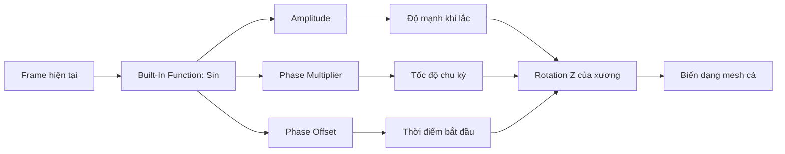
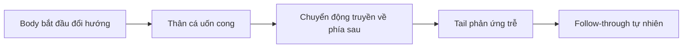

# 07 — Tạo chu kỳ bơi tự động bằng F-Curve Modifier

| Thuộc tính       | Nội dung                                                             |
| ---------------- | -------------------------------------------------------------------- |
| **Video**        | Không rõ tên/kênh — chỉ có transcript                                |
| **Đoạn**         | Animation                                                            |
| **Thời điểm**    | 16:18–19:18                                                          |
| **Chủ đề chính** | Graph Editor, Built-In Function dạng sin, lệch pha giữa thân và đuôi |

---

## 1. Mục tiêu bài học

Sau chương này, chúng ta có thể:

* Tạo một **keyframe nền** tại frame đầu tiên để làm điểm neo cho F-Curve.
* Dùng **F-Curve Modifier — Built-In Function** với hàm sin để tạo chuyển động lắc tuần hoàn tự động.
* Điều khiển tốc độ và độ mạnh của chuyển động bằng các tham số:

  * **Amplitude**
  * **Phase Multiplier**
  * **Phase Offset**
* Sao chép F-Curve Modifier từ xương đuôi sang xương thân.
* Tạo độ lệch pha để:

  * thân cá chuyển động trước;
  * đuôi cá phản ứng sau;
  * hình thành hiệu ứng **follow-through** và **overlapping action** tự nhiên.
* Chuẩn bị chuyển động có độ lệch ngẫu nhiên để nhiều con cá không bơi đồng bộ hoàn toàn.

---

## 2. Nguyên lý tổng quát

Thay vì đặt nhiều keyframe thủ công, Blender có thể tính giá trị xoay của xương bằng một hàm tuần hoàn.

Dạng đơn giản của chuyển động là:

```text
Rotation Z = Amplitude × sin(
    Frame × Phase Multiplier + Phase Offset
)
```

Trong đó:

| Tham số              | Vai trò                                                     |
| -------------------- | ----------------------------------------------------------- |
| **Amplitude**        | Quyết định xương xoay mạnh hay nhẹ                          |
| **Phase Multiplier** | Quyết định tốc độ dao động                                  |
| **Phase Offset**     | Dịch chuyển thời điểm bắt đầu của chu kỳ                    |
| **Value Offset**     | Dịch toàn bộ chuyển động lên hoặc xuống quanh giá trị cơ sở |

> Với kênh Rotation sử dụng Euler, giá trị Amplitude thường được tính theo **radian**.
> Ví dụ: `0.3 rad ≈ 17.2°`, còn `0.1 rad ≈ 5.7°`.

---

## 3. Sơ đồ hoạt động



### Quan hệ giữa thân và đuôi

```text
Thời gian ───────────────────────────────────────────────▶

Body:     ╭──╮      ╭──╮      ╭──╮
         ╭╯  ╰╮    ╭╯  ╰╮    ╭╯  ╰╮
─────────╯    ╰────╯    ╰────╯    ╰────────

Tail:          ╭────╮      ╭────╮
              ╭╯    ╰╮    ╭╯    ╰╮
──────────────╯      ╰────╯      ╰──────────
               ↑
        Đuôi phản ứng trễ hơn thân
```

Hai xương sử dụng cùng tốc độ dao động nhưng khác **Phase Offset**, vì vậy đuôi không đổi hướng đồng thời với thân.

---

## 4. Tạo keyframe nền

Trước khi thêm F-Curve Modifier, cần tạo ít nhất một F-Curve cho thuộc tính muốn điều khiển.

### Thao tác

1. Chuyển Armature sang **Pose Mode**.
2. Chọn xương **tail**.
3. Đưa Playhead về frame đầu tiên của animation.
4. Di chuột vào 3D Viewport.
5. Nhấn `I`.
6. Chèn keyframe cho các thuộc tính biến đổi của xương, chẳng hạn:

   * Location;
   * Rotation;
   * Scale.

Keyframe này đóng vai trò như một **đường cơ sở** để F-Curve Modifier hoạt động.

> Nếu chỉ cần tạo chuyển động xoay, có thể chèn riêng keyframe cho **Rotation** hoặc **Rotation Z** để Graph Editor gọn hơn.

---

## 5. Thêm Built-In Function cho xương đuôi

### 5.1. Chọn đúng F-Curve

Trong **Graph Editor**:

1. Chọn xương `tail`.
2. Mở danh sách kênh của xương.
3. Chọn kênh:

```text
Rotation Z
```

4. Nhấn `N` nếu Sidebar chưa hiển thị.
5. Mở tab **Modifiers**.
6. Chọn:

```text
Add Modifier
└── Built-In Function
```

7. Đảm bảo loại hàm được đặt thành:

```text
Sine
```

---

### 5.2. Thiết lập tham khảo cho đuôi

| Tham số              | Giá trị tham khảo | Ý nghĩa                            |
| -------------------- | ----------------: | ---------------------------------- |
| **Amplitude**        |             `0.3` | Đuôi lắc tương đối mạnh            |
| **Phase Multiplier** |             `0.1` | Tốc độ dao động của chu kỳ         |
| **Phase Offset**     |  Giá trị khác `0` | Dịch thời điểm bắt đầu chu kỳ      |
| **Value Offset**     |               `0` | Dao động quanh vị trí xoay ban đầu |

Sau khi thiết lập, nhấn **Play** để kiểm tra.

Xương đuôi sẽ tự động lắc qua lại mà không cần thêm nhiều keyframe.

---

## 6. Ý nghĩa của Phase Offset ngẫu nhiên

Phase Offset không chỉ được dùng để tạo độ trễ giữa các xương. Nó còn có thể giúp các con cá bắt đầu chu kỳ ở những thời điểm khác nhau.

Ví dụ:

| Cá    | Phase Offset |
| ----- | -----------: |
| Cá 01 |       `-1.1` |
| Cá 02 |        `0.4` |
| Cá 03 |        `1.7` |
| Cá 04 |       `-2.3` |

Mặc dù các con cá có cùng tốc độ và biên độ, chúng không đổi hướng đồng thời.

```text
Không có Phase Offset ngẫu nhiên:

Cá 1:  trái → phải → trái → phải
Cá 2:  trái → phải → trái → phải
Cá 3:  trái → phải → trái → phải
       Tất cả chuyển động giống hệt nhau


Có Phase Offset ngẫu nhiên:

Cá 1:  trái → phải → trái → phải
Cá 2:      phải → trái → phải → trái
Cá 3:  giữa → trái → phải → trái
       Chuyển động lệch nhau tự nhiên hơn
```

Đây là bước chuẩn bị quan trọng cho giai đoạn tạo đàn cá ở chương sau.

---

## 7. Sao chép modifier sang xương thân

Xương thân cần sử dụng cùng loại dao động với đuôi, nhưng có biên độ nhỏ hơn và Phase Offset khác.

### Quy trình

1. Chọn xương **body** trong Pose Mode.
2. Đưa Playhead về frame đầu tiên.
3. Nhấn `I` để chèn keyframe nền.
4. Trong Graph Editor, chọn kênh `Rotation Z` của xương tail.
5. Sao chép F-Curve Modifier bằng nút **Copy** trên panel modifier.
6. Chọn kênh `Rotation Z` của xương body.
7. Nhấn **Paste** để dán modifier.
8. Điều chỉnh lại các tham số cho xương body.

---

## 8. Thiết lập tham khảo cho xương thân

| Tham số              |          Tail |          Body | Giải thích                       |
| -------------------- | ------------: | ------------: | -------------------------------- |
| **Amplitude**        |         `0.3` |         `0.1` | Thân cá dao động nhẹ hơn đuôi    |
| **Phase Multiplier** |         `0.1` |         `0.1` | Hai xương giữ cùng nhịp tổng thể |
| **Phase Offset**     | Khoảng `-1.1` | Khoảng `-0.1` | Tạo độ trễ giữa thân và đuôi     |
| **Value Offset**     |           `0` |           `0` | Dao động quanh tư thế ban đầu    |

Các giá trị trên chỉ là điểm khởi đầu. Cần quan sát animation và tinh chỉnh bằng mắt.

---

## 9. Nguyên lý lệch pha thân–đuôi

### Trường hợp đồng pha

Nếu body và tail có Phase Offset giống nhau:

```text
Body:  trái ─ giữa ─ phải ─ giữa ─ trái
Tail:  trái ─ giữa ─ phải ─ giữa ─ trái
```

Hai xương đổi hướng cùng lúc, khiến con cá trông cứng và máy móc.

### Trường hợp có độ trễ

Nếu Phase Offset của đuôi được dịch so với thân:

```text
Body:  trái ─ giữa ─ phải ─ giữa ─ trái
Tail:      trái ─ giữa ─ phải ─ giữa ─ trái
```

Kết quả:

1. Thân cá bắt đầu đổi hướng.
2. Chuyển động truyền dần về phía sau.
3. Đuôi tiếp tục vỗ theo quán tính.
4. Toàn bộ thân cá tạo cảm giác mềm và có độ đàn hồi.



---

## 10. Vì sao biên độ của thân phải nhỏ hơn đuôi?

Trong chuyển động bơi tự nhiên:

* phần đầu và thân trước tương đối ổn định;
* thân sau bắt đầu dao động rõ hơn;
* đuôi có biên độ lớn nhất để đẩy nước;
* sóng chuyển động tăng dần từ trước ra sau.

Có thể hình dung mức độ dao động như sau:

```text
Đầu          Thân             Cuống đuôi          Đuôi
 │            │                    │                │
 ▼            ▼                    ▼                ▼
Nhỏ ───────▶ Vừa ───────────────▶ Lớn ──────────▶ Lớn nhất
```

Vì vậy:

```text
Body Amplitude < Tail Amplitude
```

Nếu thân có biên độ bằng hoặc lớn hơn đuôi, toàn bộ con cá có thể trông như đang xoay quanh tâm thay vì tạo sóng bơi truyền dọc cơ thể.

---

## 11. Quy trình thực hành hoàn chỉnh

### Bước 1 — Tạo F-Curve cho đuôi

1. Chuyển sang **Pose Mode**.
2. Chọn xương `tail`.
3. Đưa Playhead về frame đầu.
4. Nhấn `I` để chèn keyframe nền.
5. Mở **Graph Editor**.
6. Chọn `Rotation Z`.
7. Mở Sidebar bằng `N`.
8. Vào **Modifiers**.
9. Thêm **Built-In Function**.
10. Chọn hàm **Sine**.

### Bước 2 — Chỉnh chuyển động đuôi

Thiết lập tham khảo:

```text
Amplitude        = 0.3
Phase Multiplier = 0.1
Phase Offset     = giá trị khác 0
```

Nhấn Play và kiểm tra tốc độ lắc.

### Bước 3 — Tạo F-Curve cho thân

1. Chọn xương `body`.
2. Trở về frame đầu.
3. Nhấn `I`.
4. Sao chép Built-In Function từ `tail > Rotation Z`.
5. Dán vào `body > Rotation Z`.

### Bước 4 — Tạo độ trễ

Thiết lập tham khảo:

```text
Tail:
Amplitude        = 0.3
Phase Multiplier = 0.1
Phase Offset     = -1.1

Body:
Amplitude        = 0.1
Phase Multiplier = 0.1
Phase Offset     = -0.1
```

Tiếp tục tinh chỉnh Phase Offset cho đến khi:

* thân đổi hướng trước;
* đuôi phản ứng sau;
* đường uốn truyền mượt từ thân ra đuôi.

### Bước 5 — Kiểm tra mesh

1. Ẩn Armature bằng `H` hoặc biểu tượng con mắt trong Outliner.
2. Phát animation.
3. Chỉ quan sát chuyển động của mesh cá.
4. Kiểm tra:

   * độ mềm của thân;
   * biên độ đuôi;
   * độ trễ giữa thân và đuôi;
   * lỗi weight hoặc vùng mesh bị kéo sai.

---

## 12. Phím tắt và công cụ liên quan

| Thao tác                              | Phím tắt/Vị trí                    |
| ------------------------------------- | ---------------------------------- |
| Mở menu chèn keyframe                 | `I`                                |
| Mở hoặc ẩn Sidebar trong Graph Editor | `N`                                |
| Phát hoặc dừng animation              | `Spacebar`                         |
| Thêm F-Curve Modifier                 | Sidebar → Modifiers → Add Modifier |
| Chọn Built-In Function                | Add Modifier → Built-In Function   |
| Sao chép modifier                     | Nút Copy trong panel modifier      |
| Dán modifier                          | Nút Paste trong panel modifier     |
| Ẩn object đang chọn                   | `H`                                |
| Hiện lại object đã ẩn                 | `Alt + H`                          |
| Chuyển sang Pose Mode                 | `Ctrl + Tab` hoặc menu Mode        |
| Quay về frame đầu                     | `Shift + Left Arrow`               |

---

## 13. Lỗi thường gặp

### 13.1. Không thấy kênh Rotation Z

**Nguyên nhân:**

* Chưa chèn keyframe cho Rotation.
* Chọn sai xương.
* Graph Editor đang hiển thị dữ liệu của object khác.

**Cách xử lý:**

1. Chọn đúng xương trong Pose Mode.
2. Chèn keyframe cho Rotation.
3. Bật tùy chọn chỉ hiển thị dữ liệu của object hoặc bone đang chọn nếu cần.

---

### 13.2. Xương không chuyển động sau khi thêm modifier

Kiểm tra:

* Modifier đã được thêm đúng vào `Rotation Z` chưa?
* Amplitude có đang bằng `0` không?
* Phase Multiplier có quá nhỏ không?
* Modifier có bị tắt hiển thị trong viewport không?
* Rotation Mode của xương có phù hợp không?

---

### 13.3. Cá lắc quá mạnh

Giảm:

```text
Amplitude
```

Ví dụ:

```text
Tail: 0.3 → 0.2
Body: 0.1 → 0.06
```

Không nên giảm Phase Multiplier nếu vấn đề chỉ nằm ở độ mạnh, vì Phase Multiplier chủ yếu điều khiển tốc độ.

---

### 13.4. Cá bơi quá nhanh hoặc quá chậm

Điều chỉnh:

```text
Phase Multiplier
```

* Tăng giá trị → chu kỳ nhanh hơn.
* Giảm giá trị → chu kỳ chậm hơn.

Nên giữ Phase Multiplier của thân và đuôi bằng nhau để chúng không dần mất đồng bộ theo thời gian.

---

### 13.5. Thân và đuôi chuyển động đồng thời

**Nguyên nhân:** Phase Offset của hai xương quá giống nhau.

**Cách xử lý:** Tăng khoảng cách giữa hai giá trị Phase Offset.

```text
Chưa tốt:
Body = -0.1
Tail = -0.2

Rõ độ trễ hơn:
Body = -0.1
Tail = -1.1
```

---

### 13.6. Đuôi chuyển động trước thân

Phase Offset đang tạo độ trễ theo chiều ngược lại.

Hãy điều chỉnh giá trị của body hoặc tail cho đến khi cảm giác chuyển động đúng:

```text
Body dẫn chuyển động
        ↓
Tail phản ứng sau
```

Không cần quá phụ thuộc vào dấu âm hoặc dấu dương, vì kết quả còn phụ thuộc vào:

* hướng local axis của bone;
* chiều xoay của Rotation Z;
* giá trị rotation ban đầu;
* cách bone được dựng trong Armature.

---

### 13.7. Nhiều con cá vẫn lắc đồng bộ

Việc copy object thường cũng copy cùng F-Curve Modifier và Phase Offset.

Để phá đồng bộ, cần tạo Phase Offset khác nhau cho từng cá hoặc từng animation instance.

Ví dụ:

```text
Fish_A: Phase Offset = -1.1
Fish_B: Phase Offset = -0.3
Fish_C: Phase Offset =  0.8
Fish_D: Phase Offset =  1.6
```

---

### 13.8. Mesh bị kéo hoặc móp bất thường

Đây thường không phải lỗi của F-Curve Modifier mà là lỗi skinning:

* Envelope của xương ảnh hưởng sang vùng không mong muốn.
* Một số vertex nhận ảnh hưởng từ cả body và tail quá mạnh.
* Weight chuyển tiếp giữa hai xương chưa mượt.
* Bone Envelope Distance hoặc Radius quá lớn.

Vấn đề này sẽ được xử lý bằng cách chỉnh lại vùng ảnh hưởng của xương ở chương tiếp theo.

---

## 14. Gợi ý tinh chỉnh chuyển động tự nhiên hơn

Sau khi chuyển động cơ bản hoạt động, có thể tiếp tục cải thiện bằng các cách sau.

### Thay đổi tốc độ bơi

| Trạng thái      | Phase Multiplier gợi ý |
| --------------- | ---------------------: |
| Trôi chậm       |            `0.04–0.07` |
| Bơi bình thường |            `0.08–0.12` |
| Bơi nhanh       |            `0.13–0.20` |

### Thay đổi biên độ

| Trạng thái      |        Body |        Tail |
| --------------- | ----------: | ----------: |
| Trôi nhẹ        | `0.03–0.06` | `0.10–0.18` |
| Bơi bình thường | `0.07–0.12` | `0.20–0.35` |
| Tăng tốc        | `0.10–0.16` | `0.35–0.50` |

> Đây chỉ là khoảng tham khảo. Tỉ lệ phù hợp còn phụ thuộc vào chiều dài xương, kích thước cá và loại cá đang mô phỏng.

---

## 15. Checklist thực hành

* [ ] Đã chuyển Armature sang Pose Mode.
* [ ] Đã chèn keyframe nền cho xương tail tại frame đầu.
* [ ] Đã chọn đúng kênh `Rotation Z` của tail.
* [ ] Đã thêm Built-In Function dạng sin.
* [ ] Đã thiết lập Amplitude cho tail khoảng `0.3`.
* [ ] Đã thiết lập Phase Multiplier khoảng `0.1`.
* [ ] Đã đặt Phase Offset khác `0`.
* [ ] Đã chèn keyframe nền cho xương body.
* [ ] Đã copy modifier từ tail sang body.
* [ ] Đã giảm Amplitude của body xuống khoảng `0.1`.
* [ ] Đã giữ Phase Multiplier của body và tail giống nhau.
* [ ] Đã chỉnh Phase Offset để body dẫn và tail theo sau.
* [ ] Đã ẩn Armature và kiểm tra chuyển động thuần của mesh.
* [ ] Đã ghi nhận các vùng mesh bị weight sai để sửa ở chương sau.

---

## 16. Tóm tắt

F-Curve Modifier **Built-In Function** cho phép tạo chuyển động bơi tuần hoàn chỉ với một F-Curve nền và một số tham số toán học.

```text
Một keyframe nền
        ↓
Built-In Function: Sine
        ↓
Amplitude + Phase Multiplier + Phase Offset
        ↓
Chuyển động lắc tuần hoàn tự động
```

Trong thiết lập này:

* **Amplitude** quyết định mức độ uốn.
* **Phase Multiplier** quyết định tốc độ bơi.
* **Phase Offset** quyết định thời điểm của chuyển động.
* Thân có biên độ nhỏ hơn đuôi.
* Thân và đuôi dùng cùng tốc độ nhưng khác Phase Offset.
* Thân dẫn chuyển động, đuôi phản ứng sau.
* Phase Offset khác nhau giữa các cá giúp đàn cá không chuyển động đồng bộ máy móc.

Nhờ đó, một chu kỳ bơi có thể lặp liên tục mà không phải đặt hàng loạt keyframe thủ công, đồng thời vẫn duy trì được cảm giác **follow-through**, mềm mại và tự nhiên.

---

# Bài luyện tập

## Mục tiêu


## Đề bài


## Yêu cầu hoàn thành

- [ ] 
- [ ] 
- [ ] 

## Kết quả / lời giải


## Ghi chú
