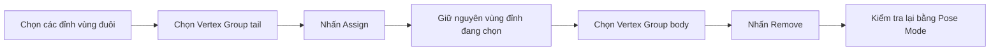

# 08 — Sửa lỗi Weight Paint bị chảy tràn giữa thân và đuôi

| Thuộc tính       | Nội dung                                            |
| ---------------- | --------------------------------------------------- |
| **Video**        | Không rõ tên/kênh — chỉ có transcript               |
| **Phân đoạn**    | Rigging Cleanup                                     |
| **Thời điểm**    | 19:18–20:18                                         |
| **Chủ đề chính** | Weight Paint, Vertex Groups, Select, Assign, Remove |

---

## 1. Mục tiêu bài học

Sau chương này, bạn có thể:

* Nhận diện hiện tượng **weight bleed** — trọng số của xương thân ảnh hưởng nhầm sang vùng đuôi.
* Kiểm tra chính xác những đỉnh đang thuộc một **Vertex Group** bằng nút **Select**.
* Gán vùng đuôi vào đúng nhóm xương bằng **Assign**.
* Xóa ảnh hưởng sai của nhóm thân bằng **Remove**.
* Kiểm tra lại biến dạng trong **Pose Mode** để bảo đảm phần nối thân–đuôi hoạt động chính xác.

---

## 2. Vấn đề cần xử lý

Sau khi tạo chu kỳ bơi tự động ở chương 07, lỗi biến dạng nhỏ từng xuất hiện từ chương 06 trở nên rõ ràng hơn.

Khi chọn mesh cá, chuyển sang **Weight Paint Mode** và kiểm tra Vertex Group `body`, có thể thấy màu trọng số của nhóm này lan sang một phần vùng đuôi.

Điều đó có nghĩa là:

> Một số đỉnh ở đuôi đang chịu ảnh hưởng của xương thân, dù chúng đáng lẽ phải được điều khiển bởi xương đuôi.

Khi xương thân và xương đuôi chuyển động lệch pha, vùng bị gán sai trọng số sẽ:

* Bị kéo theo thân cá.
* Không uốn đúng theo xương đuôi.
* Xuất hiện hiện tượng méo, gãy hoặc co kéo bất thường tại vùng nối thân–đuôi.

### Nguyên nhân

Ở chương 06, mesh được gắn với Armature bằng **Envelope Weights**. Phương pháp này sử dụng vùng ảnh hưởng bao quanh mỗi xương để tính trọng số ban đầu.

Tại vị trí hai xương nằm gần nhau, vùng ảnh hưởng của xương `body` có thể chồng lên khu vực đuôi:

```text
Xương thân              Xương đuôi
   BODY  ──────────────── TAIL
      \___________/
       Vùng ảnh hưởng
        bị chồng lấn
```

Đây là nguyên nhân phổ biến dẫn đến hiện tượng **weight bleed** ở những vùng chuyển tiếp giữa các xương liền kề.

---

## 3. Chẩn đoán bằng Weight Paint

### Bước 1: Kiểm tra nhóm `body`

1. Chọn mesh cá.
2. Chuyển sang **Weight Paint Mode**.
3. Chọn Vertex Group `body`.
4. Quan sát vùng đuôi.

Trong Weight Paint:

| Màu sắc      | Ý nghĩa                    |
| ------------ | -------------------------- |
| Xanh dương   | Trọng số bằng hoặc gần `0` |
| Xanh lá/vàng | Trọng số trung bình        |
| Đỏ           | Trọng số gần `1.0`         |

Nếu vùng đuôi xuất hiện màu xanh lá, vàng hoặc đỏ khi nhóm `body` đang được chọn, nhóm thân đang ảnh hưởng nhầm sang đuôi.

---

## 4. Kiểm tra Vertex Group trong Edit Mode

Weight Paint giúp nhìn thấy vùng ảnh hưởng, nhưng để sửa chính xác, cần chuyển sang **Edit Mode**.

### Kiểm tra nhóm `body`

1. Thoát Weight Paint.
2. Chuyển mesh sang **Edit Mode**.
3. Nhấn `Alt + A` để bỏ chọn toàn bộ đỉnh.
4. Mở:

```text
Object Data Properties
└── Vertex Groups
    └── body
```

5. Chọn nhóm `body`.
6. Nhấn **Select**.

Blender sẽ chọn tất cả các đỉnh đang có trọng số lớn hơn `0` trong nhóm `body`.

Nếu phần đuôi cũng được chọn, điều đó xác nhận rằng nhóm `body` đang chứa các đỉnh không phù hợp.

### Kiểm tra nhóm `tail`

Tiếp tục:

1. Bỏ chọn toàn bộ đỉnh.
2. Chọn Vertex Group `tail`.
3. Nhấn **Select**.

Trong trường hợp của video, không có đỉnh nào được chọn. Điều này cho thấy nhóm `tail` đang rỗng hoặc phần đuôi chưa được gán đúng vào nhóm này.

> Phần đuôi hiện đang phụ thuộc vào trọng số bị chảy tràn từ nhóm `body`, thay vì được điều khiển bởi Vertex Group `tail`.

---

## 5. Quy trình sửa lỗi

Việc sửa lỗi gồm hai thao tác đối nghịch trên cùng một tập đỉnh:

1. **Assign** các đỉnh đuôi vào nhóm `tail`.
2. **Remove** chính các đỉnh đó khỏi nhóm `body`.

### Sơ đồ xử lý



---

## 6. Bước 1 — Gán đỉnh vào nhóm `tail`

Trong **Edit Mode**:

1. Chọn chính xác các đỉnh thuộc vùng đuôi.
2. Chọn Vertex Group `tail`.
3. Đặt **Weight** thành `1.000` nếu muốn xương đuôi kiểm soát hoàn toàn vùng này.
4. Nhấn **Assign**.

Thao tác này gán các đỉnh đang chọn vào nhóm `tail`.

```text
Các đỉnh vùng đuôi
        │
        ▼
Vertex Group: tail
Weight: 1.000
        │
        ▼
      Assign
```

Sau bước này, xương đuôi đã có dữ liệu trọng số để điều khiển phần đuôi mesh.

---

## 7. Bước 2 — Xóa đỉnh khỏi nhóm `body`

Không bỏ chọn các đỉnh vừa thao tác.

1. Giữ nguyên các đỉnh vùng đuôi đang được chọn.
2. Chuyển Vertex Group active sang `body`.
3. Nhấn **Remove**.

Thao tác này xóa hoàn toàn các đỉnh được chọn khỏi nhóm `body`.

```text
Các đỉnh vùng đuôi
        │
        ▼
Vertex Group: body
        │
        ▼
      Remove
        │
        ▼
Không còn chịu ảnh hưởng của xương thân
```

Kết quả mong muốn:

| Khu vực mesh     | Vertex Group chính                                     |
| ---------------- | ------------------------------------------------------ |
| Thân cá          | `body`                                                 |
| Đuôi cá          | `tail`                                                 |
| Vùng chuyển tiếp | Có thể chia trọng số mềm giữa `body` và `tail` nếu cần |

---

## 8. Quy trình thực hành hoàn chỉnh

### Bước 1 — Chẩn đoán

* Chọn mesh cá.
* Vào **Weight Paint Mode**.
* Chọn nhóm `body`.
* Kiểm tra xem màu trọng số có lan sang đuôi hay không.

### Bước 2 — Xác định vùng bị ảnh hưởng

* Chuyển sang **Edit Mode**.
* Bỏ chọn toàn bộ đỉnh.
* Chọn nhóm `body`.
* Nhấn **Select**.
* Xác định các đỉnh vùng đuôi đang nằm nhầm trong nhóm thân.

### Bước 3 — Gán vào nhóm đuôi

* Chọn các đỉnh cần thuộc phần đuôi.
* Chuyển Vertex Group active sang `tail`.
* Đặt Weight phù hợp.
* Nhấn **Assign**.

### Bước 4 — Xóa khỏi nhóm thân

* Giữ nguyên vùng đỉnh đang chọn.
* Chuyển Vertex Group active sang `body`.
* Nhấn **Remove**.

### Bước 5 — Kiểm tra kết quả

* Quay lại **Object Mode**.
* Chọn Armature và chuyển sang **Pose Mode**.
* Xoay hoặc phát animation của xương thân và xương đuôi.
* Kiểm tra vùng nối giữa hai phần.

---

## 9. Phím tắt và công cụ liên quan

| Thao tác                   | Phím tắt/Vị trí                        |
| -------------------------- | -------------------------------------- |
| Chuyển sang Weight Paint   | Mode Dropdown → **Weight Paint**       |
| Chuyển sang Edit Mode      | `Tab`                                  |
| Bỏ chọn toàn bộ đỉnh       | `Alt + A`                              |
| Chọn Vertex Group          | Object Data Properties → Vertex Groups |
| Chọn đỉnh thuộc nhóm       | Nút **Select**                         |
| Gán đỉnh vào nhóm          | Nút **Assign**                         |
| Xóa đỉnh khỏi nhóm         | Nút **Remove**                         |
| Chọn nhanh vùng đỉnh       | `B`, `C` hoặc `L`                      |
| Kiểm tra chuyển động xương | Armature → **Pose Mode**               |
| Phát animation             | `Spacebar`                             |

---

## 10. Phân biệt Assign và Remove

| Lệnh         | Chức năng                                                             |
| ------------ | --------------------------------------------------------------------- |
| **Assign**   | Thêm các đỉnh đang chọn vào Vertex Group active với trọng số hiện tại |
| **Remove**   | Xóa các đỉnh đang chọn khỏi Vertex Group active                       |
| **Select**   | Chọn tất cả đỉnh đang thuộc Vertex Group active                       |
| **Deselect** | Bỏ chọn các đỉnh đang thuộc Vertex Group active                       |

Cần chú ý rằng **Remove không đặt trọng số về 0**, mà xóa hoàn toàn quan hệ giữa đỉnh và Vertex Group đó.

---

## 11. Lưu ý quan trọng

### Chỉ Remove đúng vùng bị lỗi

Không nên chọn toàn bộ mesh rồi nhấn **Remove** trên nhóm `body`.

Thao tác này có thể xóa cả những trọng số hợp lệ ở phần thân, khiến xương thân không còn điều khiển mesh.

Quy trình an toàn:

```text
Xác định vùng lỗi
      ↓
Chỉ chọn đỉnh vùng đuôi
      ↓
Assign vào tail
      ↓
Remove khỏi body
```

### Không chỉ kiểm tra ở tư thế nghỉ

Một bộ trọng số có thể trông bình thường khi Armature ở Rest Position nhưng bị lỗi khi animation chạy.

Vì vậy cần kiểm tra:

* Khi thân cong sang trái.
* Khi thân cong sang phải.
* Khi đuôi đạt biên độ lớn nhất.
* Khi thân và đuôi chuyển động ngược pha.
* Tại điểm nối giữa hai xương.

### Có thể cần trọng số chuyển tiếp mềm

Không phải lúc nào cũng nên tách `body = 0` và `tail = 1` ngay tại đường nối.

Nếu phần chuyển tiếp bị gãy cứng, có thể sử dụng vùng pha trộn:

```text
Thân                          Đuôi
body: 1.0 → 0.75 → 0.5 → 0.25 → 0.0
tail: 0.0 → 0.25 → 0.5 → 0.75 → 1.0
```

Cách phân bố này giúp thân và đuôi uốn liên tục hơn.

Tuy nhiên, trong ví dụ của video, tác giả sử dụng giải pháp đơn giản:

* Gán vùng đuôi vào `tail`.
* Xóa vùng đó khỏi `body`.

---

## 12. Lỗi thường gặp

### Lỗi 1 — Nhấn Assign nhưng không có đỉnh nào được chọn

**Nguyên nhân:** đang ở Edit Mode nhưng chưa chọn vùng mesh.

**Cách sửa:** chọn các đỉnh cần gán trước khi nhấn **Assign**.

---

### Lỗi 2 — Assign nhầm toàn bộ mesh vào `tail`

**Biểu hiện:** khi xương đuôi di chuyển, cả thân cá bị kéo theo.

**Cách sửa:**

1. Chọn nhóm `tail`.
2. Nhấn **Select** để kiểm tra.
3. Chọn các đỉnh thân bị gán nhầm.
4. Nhấn **Remove**.

---

### Lỗi 3 — Đuôi không chuyển động sau khi sửa

**Nguyên nhân có thể:**

* Các đỉnh chưa được Assign vào nhóm `tail`.
* Tên Vertex Group không trùng với tên xương.
* Bone `tail` đã tắt tùy chọn **Deform**.
* Armature Modifier đang trỏ sai Armature.

---

### Lỗi 4 — Vùng nối thân–đuôi bị gãy

**Nguyên nhân:** trọng số chuyển từ `body = 1` sang `tail = 1` quá đột ngột.

**Cách sửa:**

* Dùng công cụ **Blur** trong Weight Paint.
* Dùng **Smooth** cho Vertex Weights.
* Tạo một vùng chuyển tiếp có trọng số chia sẻ giữa hai nhóm.

---

### Lỗi 5 — Không thấy nút Select/Assign/Remove

Các nút này chỉ hoạt động đúng khi:

* Mesh đang ở **Edit Mode**.
* Một Vertex Group đã được chọn.
* Chế độ chọn Vertex, Edge hoặc Face đang được bật.

---

## 13. Checklist thực hành

* [ ] Đã kiểm tra nhóm `body` trong Weight Paint Mode.
* [ ] Đã xác định vùng trọng số bị chảy tràn sang đuôi.
* [ ] Đã kiểm tra các đỉnh thuộc nhóm `body` bằng nút **Select**.
* [ ] Đã kiểm tra Vertex Group `tail`.
* [ ] Đã chọn đúng các đỉnh thuộc vùng đuôi.
* [ ] Đã **Assign** các đỉnh đó vào nhóm `tail`.
* [ ] Đã **Remove** các đỉnh đó khỏi nhóm `body`.
* [ ] Đã kiểm tra lại bằng Weight Paint.
* [ ] Đã chạy toàn bộ chu kỳ bơi trong Pose Mode.
* [ ] Vùng nối thân–đuôi không còn bị méo hoặc kéo sai.

---

## 14. Kết quả sau chương

Sau khi hoàn thành bước cleanup:

* Xương `body` chỉ điều khiển phần thân.
* Xương `tail` điều khiển đúng phần đuôi.
* Chuyển động lệch pha giữa thân và đuôi không còn gây méo mesh.
* Chu kỳ bơi tự động hoạt động ổn định.
* Mesh cá và Armature cơ bản đã hoàn thiện.

Mô hình lúc này đã sẵn sàng để được:

* Nhân bản thành nhiều cá.
* Phân bố bằng Geometry Nodes.
* Tạo độ lệch thời gian giữa các cá.
* Xây dựng thành một đàn cá chuyển động tự nhiên.

---

## 15. Tóm tắt

Hiện tượng **weight bleed** xảy ra khi Vertex Group của một xương ảnh hưởng nhầm sang vùng mesh thuộc xương khác. Trong trường hợp này, nhóm `body` đã lan sang vùng đuôi, trong khi nhóm `tail` chưa chứa đúng các đỉnh cần thiết.

Cách sửa cốt lõi là:

```text
Chọn vùng đuôi
      ↓
Assign vào nhóm tail
      ↓
Giữ nguyên vùng chọn
      ↓
Remove khỏi nhóm body
      ↓
Kiểm tra lại bằng Pose Mode
```

Đây là một bước cleanup nhỏ nhưng rất quan trọng, giúp vùng nối thân–đuôi biến dạng đúng và hoàn tất bộ rig cơ bản trước khi nhân bản cá thành cả đàn.
