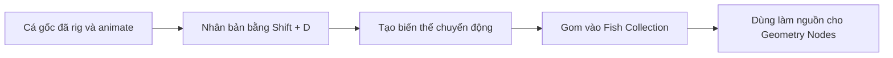
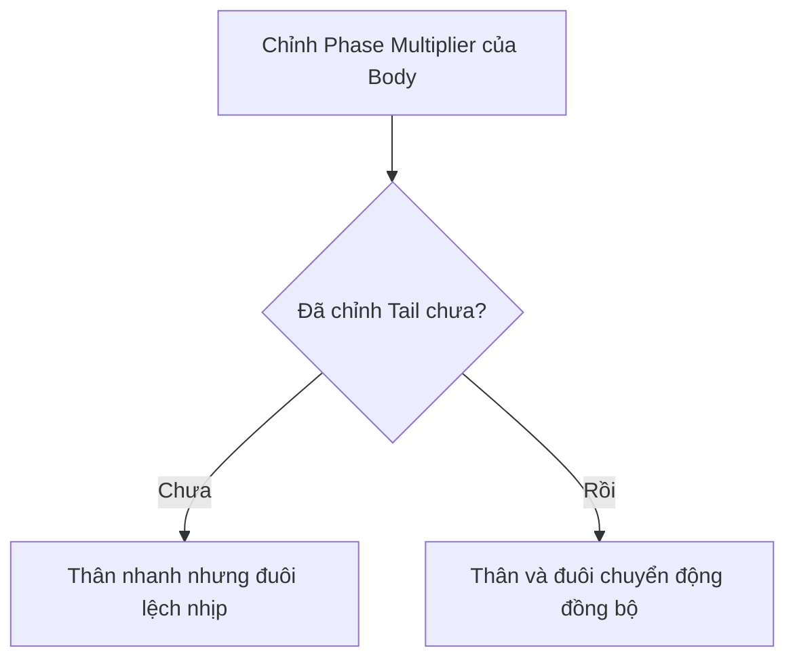
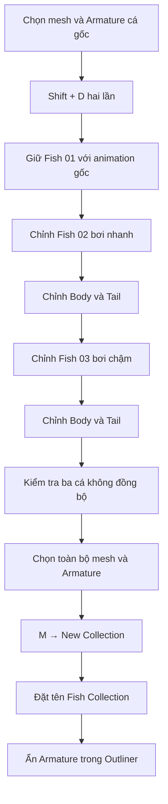

# 09 — Nhân bản và tạo biến thể cho nhiều con cá

| Thuộc tính       | Nội dung                                                                                      |
| ---------------- | --------------------------------------------------------------------------------------------- |
| **Video**        | Không rõ tên/kênh — chỉ có transcript                                                         |
| **Phân đoạn**    | Chuẩn bị đàn cá                                                                               |
| **Thời điểm**    | `20:18–21:47`                                                                                 |
| **Chủ đề chính** | Nhân bản bằng `Shift + D`, tùy chỉnh `Amplitude` và `Phase Multiplier`, gom cá vào Collection |

---

## 1. Mục tiêu bài học

Sau chương này, bạn có thể:

* Nhân bản một con cá đã hoàn thiện, bao gồm:

  * Mesh cá.
  * Armature.
  * Rig.
  * Animation bơi.
* Tạo nhiều kiểu bơi khác nhau bằng cách điều chỉnh các tham số trong **F-Curve Modifier**.
* Tránh hiện tượng toàn bộ đàn cá chuyển động đồng bộ và máy móc.
* Gom các con cá vào một **Collection** để sử dụng làm nguồn instance trong Geometry Nodes.
* Làm gọn viewport bằng cách ẩn các Armature không cần quan sát.

---

## 2. Tư duy tổng quát

Quy trình của chương này gồm ba bước chính:



Mục tiêu không chỉ là tạo thêm nhiều con cá, mà còn phải tạo ra **sự khác biệt trong chuyển động** giữa chúng.

Nếu tất cả các bản sao giữ nguyên cùng một animation, đàn cá sẽ:

* Lắc thân cùng lúc.
* Vẫy đuôi cùng tốc độ.
* Có biên độ chuyển động giống nhau.
* Trông giống các bản sao cơ học hơn là một đàn cá tự nhiên.

---

## 3. Nhân bản cá hoàn chỉnh

Con cá ở chương trước đã bao gồm:

```text
Fish
├── Fish Mesh
└── Fish Armature
    ├── Body Bone
    └── Tail Bone
```

Khi nhân bản, cần chọn **cả mesh và Armature**.

### Thao tác

1. Chuyển sang **Object Mode**.
2. Chọn mesh cá.
3. Giữ `Shift` và chọn thêm Armature.
4. Nhấn:

```text
Shift + D
```

5. Di chuyển bản sao sang vị trí khác.
6. Thực hiện thêm một lần nữa để có tổng cộng ba con cá.

### Kết quả dự kiến

```text
Fish 01 — tốc độ gốc
Fish 02 — tốc độ nhanh
Fish 03 — tốc độ chậm
```

> Kích thước của từng con cá chưa quan trọng ở bước này. Geometry Nodes ở chương sau sẽ tự động randomize scale khi phân bố đàn cá.

---

## 4. Vì sao không nên giữ nguyên animation?

Các bản sao được tạo bằng `Shift + D` sẽ kế thừa animation từ con cá gốc.

Điều này giúp tiết kiệm thời gian, nhưng cũng tạo ra một vấn đề:

> Nếu tất cả các con cá sử dụng cùng thông số F-Curve Modifier, chúng có thể bơi cùng tốc độ và cùng biên độ.

Ngay cả khi đã thiết lập một chút **Phase Offset**, chuyển động tổng thể vẫn có thể trông quá đều khi số lượng cá tăng lên.

Để tạo cảm giác tự nhiên hơn, cần thay đổi ít nhất hai tham số:

| Tham số              | Vai trò                               |
| -------------------- | ------------------------------------- |
| **Amplitude**        | Điều khiển độ mạnh hoặc biên độ lắc   |
| **Phase Multiplier** | Điều khiển tốc độ lặp của chuyển động |

### Nguyên tắc

```text
Amplitude lớn hơn
→ Thân và đuôi lắc mạnh hơn

Phase Multiplier lớn hơn
→ Chu kỳ lặp nhanh hơn
→ Cá bơi nhanh hơn

Phase Multiplier nhỏ hơn
→ Chu kỳ lặp chậm hơn
→ Cá bơi thong thả hơn
```

---

## 5. Tạo biến thể cho con cá thứ hai

Con cá thứ hai được chỉnh theo hướng **nhanh và năng động hơn**.

### Thiết lập gợi ý

* Tăng nhẹ `Amplitude`.
* Tăng `Phase Multiplier` lên khoảng `2`.
* Áp dụng thay đổi cho cả:

  * Xương thân — `Body`.
  * Xương đuôi — `Tail`.

Khi `Phase Multiplier` tăng lên khoảng `2`, chuyển động tuần hoàn sẽ nhanh hơn đáng kể, khiến cá có cảm giác bơi nhanh gấp đôi bản gốc.

### Đồng bộ thân và đuôi



Nếu chỉ chỉnh xương `Body` mà quên xương `Tail`:

* Thân cá sẽ lắc nhanh.
* Đuôi vẫn giữ tốc độ cũ.
* Chuyển động bị lệch nhịp.
* Cá có thể trông như bị giật hoặc biến dạng không tự nhiên.

Sau khi tăng tốc độ, nếu chuyển động trở nên quá mạnh, có thể giảm `Amplitude` xuống khoảng:

```text
0.15
```

Điều này giúp giữ tốc độ nhanh nhưng hạn chế việc thân cá lắc quá mức.

---

## 6. Tạo biến thể cho con cá thứ ba

Con cá thứ ba được chỉnh theo hướng **chậm và nhẹ nhàng hơn**.

### Thiết lập tham khảo

| Tham số              | Giá trị tham khảo |
| -------------------- | ----------------: |
| **Phase Multiplier** |    Khoảng `0.085` |
| **Amplitude**        |     Khoảng `0.15` |

Cần áp dụng `Phase Multiplier` mới cho cả xương `Body` và `Tail`.

### Hiệu ứng đạt được

* Chu kỳ lắc diễn ra chậm hơn.
* Chuyển động thân nhẹ hơn.
* Đuôi vẫy thong thả.
* Con cá có cảm giác bình tĩnh hoặc đang trôi theo dòng nước.

---

## 7. So sánh ba biến thể

| Cá          | Phase Multiplier |     Amplitude | Đặc điểm chuyển động |
| ----------- | ---------------: | ------------: | -------------------- |
| **Fish 01** |      Giá trị gốc |   Giá trị gốc | Kiểu bơi cơ bản      |
| **Fish 02** |       Khoảng `2` | Khoảng `0.15` | Bơi nhanh, linh hoạt |
| **Fish 03** |   Khoảng `0.085` | Khoảng `0.15` | Bơi chậm, thong thả  |

> Các giá trị trên chỉ mang tính tham khảo. Giá trị phù hợp còn phụ thuộc vào kích thước cá, độ dài xương, tỷ lệ scene và phong cách chuyển động mong muốn.

---

## 8. Chế độ thao tác cần lưu ý

Trong quá trình chỉnh sửa, bạn có thể phải chuyển đổi giữa các chế độ:

| Chế độ           | Mục đích                                                |
| ---------------- | ------------------------------------------------------- |
| **Object Mode**  | Chọn hoặc thay đổi Armature, nhân bản và quản lý object |
| **Pose Mode**    | Chọn từng Pose Bone và kiểm tra chuyển động             |
| **Graph Editor** | Chỉnh F-Curve và các Modifier của kênh animation        |

Quy trình tham khảo:

```text
Object Mode
    ↓
Chọn Armature
    ↓
Pose Mode
    ↓
Chọn Body hoặc Tail
    ↓
Graph Editor
    ↓
Chỉnh F-Curve Modifier
```

Nếu không chọn được đúng Armature hoặc không thấy kênh animation cần chỉnh, hãy quay lại **Object Mode**, chọn lại Armature rồi tiếp tục.

---

## 9. Gom các con cá vào Collection

Sau khi đã có ba kiểu bơi khác nhau, cần gom toàn bộ chúng vào một Collection chung.

### Các object cần chọn

```text
Fish 01
├── Mesh
└── Armature

Fish 02
├── Mesh
└── Armature

Fish 03
├── Mesh
└── Armature
```

### Thao tác

1. Chuyển sang **Object Mode**.
2. Chọn tất cả mesh cá và Armature tương ứng.
3. Nhấn:

```text
M
```

4. Chọn:

```text
New Collection
```

5. Đặt tên:

```text
Fish Collection
```

6. Xác nhận tạo Collection.

### Cấu trúc sau khi sắp xếp

```text
Scene Collection
└── Fish Collection
    ├── Fish 01 Mesh
    ├── Fish 01 Armature
    ├── Fish 02 Mesh
    ├── Fish 02 Armature
    ├── Fish 03 Mesh
    └── Fish 03 Armature
```

Collection này sẽ được sử dụng làm nguồn dữ liệu cho hệ thống Geometry Nodes ở chương tiếp theo.

---

## 10. Ẩn Armature trong viewport

Sau khi animation đã hoạt động đúng, không nhất thiết phải tiếp tục nhìn thấy khung xương.

Trong **Outliner**, nhấn biểu tượng con mắt bên cạnh các Armature để tắt hiển thị của chúng.

### Lợi ích

* Viewport gọn hơn.
* Dễ quan sát đàn cá.
* Không bị các đường xương che mesh.
* Thuận tiện khi thiết lập Geometry Nodes.

> Ẩn Armature chỉ làm chúng không xuất hiện trong viewport, không xóa rig hoặc animation của cá.

---

## 11. Quy trình thực hành hoàn chỉnh



### Các bước rút gọn

1. Chọn mesh và Armature của cá gốc.
2. Nhấn `Shift + D` hai lần để tạo ba con cá.
3. Giữ con thứ nhất với tốc độ gốc.
4. Chỉnh con thứ hai:

   * Tăng `Phase Multiplier`.
   * Điều chỉnh `Amplitude`.
   * Chỉnh cả `Body` và `Tail`.
5. Chỉnh con thứ ba:

   * Giảm `Phase Multiplier`.
   * Điều chỉnh `Amplitude`.
   * Chỉnh cả `Body` và `Tail`.
6. Phát animation để kiểm tra sự khác biệt.
7. Chọn tất cả mesh và Armature.
8. Nhấn `M → New Collection`.
9. Đặt tên Collection là `Fish Collection`.
10. Ẩn các Armature trong Outliner.

---

## 12. Phím tắt và công cụ liên quan

| Thao tác                        | Phím tắt/Công cụ     |
| ------------------------------- | -------------------- |
| Nhân bản object                 | `Shift + D`          |
| Chọn thêm object                | `Shift + Click`      |
| Di chuyển object vào Collection | `M`                  |
| Tạo Collection mới              | `M → New Collection` |
| Chuyển sang Object Mode         | `Tab` hoặc menu Mode |
| Chuyển sang Pose Mode           | Menu Mode            |
| Ẩn/hiện object trong Outliner   | Biểu tượng con mắt   |
| Xem và chỉnh F-Curve            | Graph Editor         |

---

## 13. Lỗi thường gặp

### 13.1. Chỉ nhân bản mesh

**Hiện tượng:**

* Cá mới không có rig riêng.
* Animation không hoạt động đúng.
* Mesh có thể vẫn phụ thuộc vào Armature cũ.

**Cách khắc phục:**

* Chọn cả mesh và Armature trước khi nhấn `Shift + D`.

---

### 13.2. Chỉ chỉnh tốc độ của xương thân

**Hiện tượng:**

* Thân cá lắc nhanh.
* Đuôi vẫn chuyển động ở tốc độ cũ.
* Chuyển động bị lệch nhịp.

**Cách khắc phục:**

* Chỉnh `Phase Multiplier` cho cả `Body` và `Tail`.

---

### 13.3. Amplitude quá lớn

**Hiện tượng:**

* Cá uốn quá mạnh.
* Mesh bị méo.
* Chuyển động trông giống rung giật hơn là bơi.

**Cách khắc phục:**

* Giảm `Amplitude`.
* Kiểm tra lại Weight Paint nếu vùng biến dạng bất thường.
* Phát animation ở tốc độ thực để đánh giá.

---

### 13.4. Các con cá vẫn bơi quá giống nhau

**Nguyên nhân:**

* Chỉ thay đổi `Phase Offset`.
* Các bản sao vẫn có cùng `Amplitude`.
* Các bản sao vẫn có cùng `Phase Multiplier`.

**Cách khắc phục:**

Kết hợp nhiều loại biến thể:

```text
Phase Offset
+ Phase Multiplier
+ Amplitude
= Chuyển động đa dạng hơn
```

---

### 13.5. Quên đưa Armature vào Collection

Nếu Collection chỉ chứa mesh:

* Việc quản lý rig trở nên khó khăn hơn.
* Có thể mất liên kết tổ chức giữa mesh và Armature.
* Khó chỉnh sửa animation sau này.

Ở bước chuẩn bị, nên gom cả mesh và Armature vào Collection. Trong chương Geometry Nodes tiếp theo, có thể tách hoặc loại Armature khỏi nguồn instance để tránh nhân bản cả khung xương.

---

## 14. Nguyên tắc tạo đàn cá tự nhiên

Để đàn cá thuyết phục hơn, không nên chỉ randomize vị trí và kích thước. Sự khác biệt cần xuất hiện cả trong chuyển động.

```text
Đàn cá tự nhiên
├── Vị trí khác nhau
├── Hướng bơi khác nhau
├── Kích thước khác nhau
├── Thời điểm vẫy khác nhau
├── Tốc độ vẫy khác nhau
└── Biên độ vẫy khác nhau
```

Trong chương này, ba yếu tố chuyển động chính là:

1. **Phase Offset** — thay đổi thời điểm bắt đầu chu kỳ.
2. **Phase Multiplier** — thay đổi tốc độ chu kỳ.
3. **Amplitude** — thay đổi độ mạnh của chuyển động.

---

## 15. Checklist thực hành

### Nhân bản

* [ ] Đã chọn cả mesh và Armature của cá gốc.
* [ ] Đã nhân bản ít nhất hai lần bằng `Shift + D`.
* [ ] Hiện có tối thiểu ba con cá.

### Tạo biến thể

* [ ] Fish 01 giữ animation gốc.
* [ ] Fish 02 có tốc độ bơi nhanh hơn.
* [ ] Fish 03 có tốc độ bơi chậm hơn.
* [ ] Đã chỉnh cả xương `Body` và `Tail`.
* [ ] Đã kiểm tra animation để bảo đảm thân và đuôi không lệch nhịp.
* [ ] Các con cá không còn chuyển động hoàn toàn giống nhau.

### Quản lý Collection

* [ ] Đã chọn toàn bộ mesh và Armature.
* [ ] Đã tạo Collection mới.
* [ ] Collection được đặt tên `Fish Collection`.
* [ ] Đã ẩn các Armature trong Outliner để làm gọn viewport.

---

## 16. Tóm tắt

Trong chương này, con cá hoàn chỉnh được nhân bản thành nhiều phiên bản bằng `Shift + D`. Thay vì giữ nguyên animation cho tất cả các bản sao, mỗi con cá được điều chỉnh riêng các tham số `Amplitude` và `Phase Multiplier` để tạo ra những kiểu bơi khác nhau:

* Một con giữ tốc độ gốc.
* Một con bơi nhanh hơn.
* Một con bơi chậm và thong thả hơn.

Điểm quan trọng nhất là phải chỉnh đồng bộ cả xương thân và xương đuôi để tránh hiện tượng lệch nhịp.

Cuối cùng, toàn bộ mesh và Armature được gom vào `Fish Collection`. Đây là bước chuẩn bị dữ liệu quan trọng trước khi sử dụng Geometry Nodes để phân bố, nhân bản và randomize một đàn cá với số lượng lớn ở chương tiếp theo.
