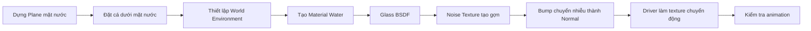
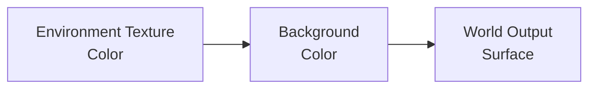
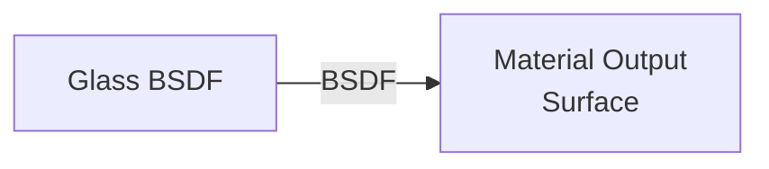
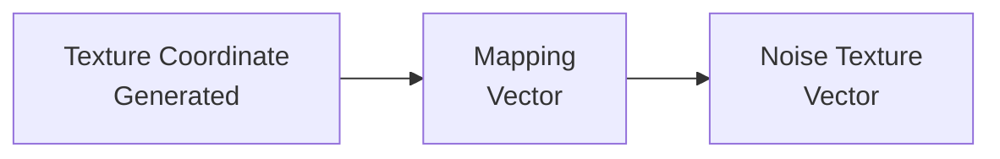
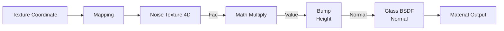
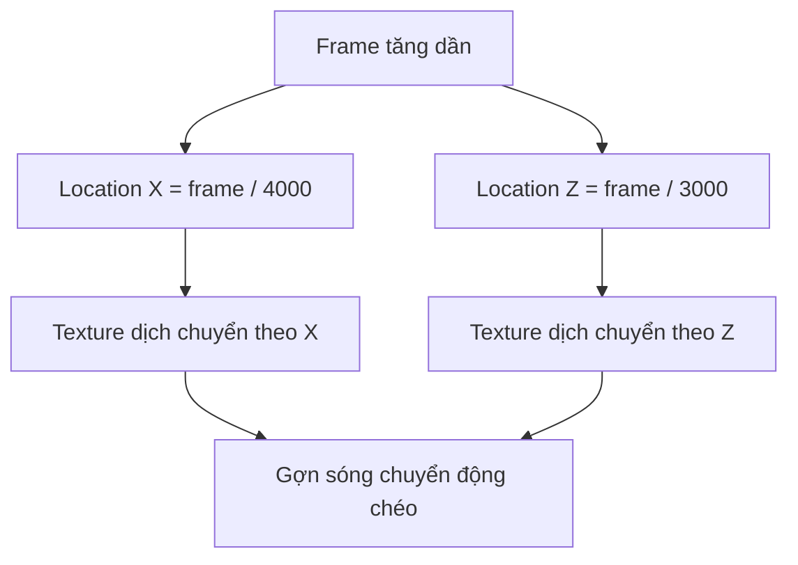
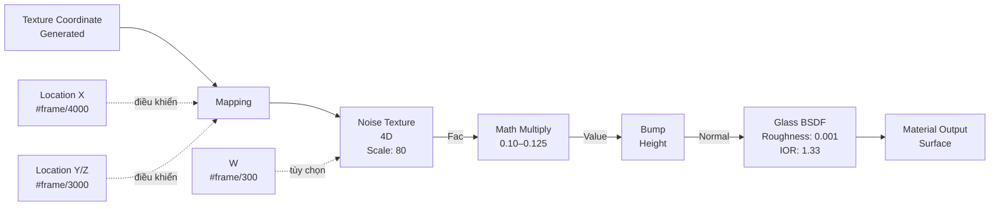

# 11 — Dựng mặt nước động

| Thuộc tính       | Nội dung                                                                                   |
| ---------------- | ------------------------------------------------------------------------------------------ |
| **Video**        | Không rõ tên/kênh — nội dung được tổng hợp từ transcript                                   |
| **Đoạn**         | Water Shading                                                                              |
| **Thời điểm**    | 25:15–29:48                                                                                |
| **Chủ đề chính** | Glass BSDF, World Environment Texture, Noise Texture 4D, Bump và driver nhanh `#frame/...` |

---

## 1. Mục tiêu bài học

Sau chương này, bạn có thể:

* Dựng một mặt phẳng nước và đặt đúng độ cao để đàn cá nằm bên dưới bề mặt.
* Tạo vật liệu nước trong suốt bằng **Glass BSDF**.
* Thiết lập độ nhám và chỉ số khúc xạ phù hợp với nước.
* Tạo gợn sóng bằng **Noise Texture** kết hợp với **Bump**.
* Animate chuyển động của gợn sóng bằng driver nhanh dạng:

```python
#frame/4000
```

* Hiểu vai trò của môi trường phản chiếu đối với vật liệu kính và nước.
* Nhận biết sự khác biệt cơ bản khi dựng nước trong **Cycles** và **Eevee**.

---

## 2. Tổng quan quy trình



Công thức tổng quát của vật liệu:

```text
Glass BSDF
    +
Noise Texture
    +
Bump
    +
Driver theo frame
    =
Mặt nước trong suốt có gợn sóng động
```

---

## 3. Dựng mặt phẳng nước

### 3.1. Thêm mặt nước

Thêm một **Plane** có kích thước đủ lớn để phủ toàn bộ khu vực lòng suối.

```text
Shift + A
└── Mesh
    └── Plane
```

Scale mặt phẳng cho đến khi nó bao phủ toàn bộ vùng cần có nước.

### 3.2. Điều chỉnh độ cao

Mặt phẳng nước phải nằm:

* Phía trên đàn cá.
* Phía trên phần đáy thấp nhất của lòng suối.
* Không quá cao đến mức làm toàn bộ cảnh bị ngập ngoài ý muốn.

Có thể quay lại object **Ground** để đào lòng suối sâu hơn, sau đó nâng hoặc hạ mặt phẳng nước sao cho đàn cá nằm hoàn toàn bên dưới.

```text
Camera nhìn từ trên xuống
        ↓
──────────────────  Mặt nước
       🐟   🐟       Đàn cá
__________________  Đáy suối
```

Nên chuyển sang góc nhìn từ trên xuống để kiểm tra nhanh:

* Vị trí đàn cá.
* Phạm vi mặt nước.
* Khoảng cách giữa cá và bề mặt.
* Bố cục tổng thể của cảnh.

### 3.3. UV Unwrap

Vì mặt nước chỉ là một Plane đơn giản, UV unwrap không cần kỹ thuật phức tạp.

1. Chọn mặt nước.
2. Nhấn `Tab` để vào **Edit Mode**.
3. Chọn toàn bộ vertex bằng `A`.
4. Nhấn:

```text
U → Unwrap
```

---

## 4. Thiết lập môi trường phản chiếu

Một vật liệu nước hoặc kính sẽ khó quan sát nếu môi trường xung quanh chỉ có một màu phẳng. Vì vậy, nên thiết lập **Environment Texture** trước khi tinh chỉnh vật liệu.

### 4.1. Chuyển Shader Editor sang World

Trong Shader Editor, chuyển chế độ từ:

```text
Object → World
```

Bật:

```text
Use Nodes
```

Sau đó thêm:

```text
Shift + A
└── Texture
    └── Environment Texture
```

Nối node như sau:



### 4.2. Tác dụng của Environment Texture

Environment Texture cung cấp các chi tiết sáng tối để bề mặt nước phản chiếu.

Nếu World chỉ có một màu phẳng:

* Phản chiếu rất khó nhìn thấy.
* Mặt nước có thể trông thiếu chiều sâu.
* Việc đánh giá Roughness và IOR trở nên khó khăn.

Khi có Environment Texture:

* Highlight trên mặt nước rõ hơn.
* Hiệu ứng phản chiếu dễ quan sát hơn.
* Việc điều chỉnh shader trực quan hơn.

> Environment Texture trong bước này chủ yếu phục vụ việc quan sát và đánh giá phản chiếu. Có thể thay bằng HDRI phù hợp khi hoàn thiện cảnh.

---

## 5. Tạo vật liệu nước

### 5.1. Kiểm tra Collection

Trước khi tạo material, hãy đảm bảo mặt nước **không nằm trong `Fish Collection`**.

Nếu mặt nước bị đưa nhầm vào collection chứa các mẫu cá, Geometry Nodes có thể coi mặt nước là một object cần phân bố cùng đàn cá.

Cấu trúc Collection nên tương tự:

```text
Scene Collection
├── Ground
├── Water
├── Fish Source
└── Fish Collection
    ├── Fish_01
    ├── Fish_02
    └── Fish_03
```

### 5.2. Tạo material mới

Chọn mặt phẳng nước và tạo một material mới:

```text
Material Name: Water
```

Trong Shader Editor:

1. Xóa node **Principled BSDF** mặc định.
2. Thêm:

```text
Shift + A
└── Shader
    └── Glass BSDF
```

3. Nối Glass BSDF vào Material Output.



### 5.3. Thông số Glass BSDF

| Thông số      |       Giá trị gợi ý | Ý nghĩa                                                 |
| ------------- | ------------------: | ------------------------------------------------------- |
| **Color**     | Trắng hoặc hơi xanh | Màu cơ bản của nước                                     |
| **Roughness** |             `0.001` | Giữ bề mặt gần như nhẵn nhưng không hoàn toàn tuyệt đối |
| **IOR**       |              `1.33` | Chỉ số khúc xạ gần đúng của nước                        |

#### Roughness

Roughness rất thấp giúp mặt nước:

* Phản chiếu rõ.
* Giữ cảm giác trong và bóng.
* Không bị mờ như kính nhám.

Không nhất thiết phải đặt chính xác bằng `0`. Một giá trị rất nhỏ như:

```text
0.001
```

thường dễ kiểm soát hơn trong quá trình render.

#### IOR

**IOR — Index of Refraction** mô tả mức độ ánh sáng bị bẻ cong khi truyền qua vật liệu.

Một số giá trị tham khảo:

| Vật liệu          | IOR gần đúng |
| ----------------- | -----------: |
| Không khí         |       `1.00` |
| Nước              |       `1.33` |
| Băng              |       `1.31` |
| Kính thông thường |  `1.45–1.52` |
| Kim cương         |       `2.42` |

Với mặt nước suối thông thường, có thể dùng:

```text
IOR = 1.33
```

Ở thời điểm này, mặt nước đã có phản chiếu và khúc xạ cơ bản nhưng vẫn phẳng như một tấm kính.

---

## 6. Tạo gợn sóng bằng Noise Texture

### 6.1. Thêm Noise Texture

Thêm node:

```text
Shift + A
└── Texture
    └── Noise Texture
```

Nếu đã bật add-on **Node Wrangler**:

1. Chọn node Noise Texture.
2. Nhấn:

```text
Ctrl + T
```

Blender sẽ tự động thêm:

* **Texture Coordinate**
* **Mapping**

Sơ đồ ban đầu:



### 6.2. Đặt Noise Texture ở chế độ 4D

Trong Noise Texture, chuyển Dimensions thành:

```text
4D
```

Thông số gợi ý:

| Thông số       |                Giá trị gợi ý |
| -------------- | ---------------------------: |
| **Dimensions** |                         `4D` |
| **Scale**      |                  Khoảng `80` |
| **Detail**     | Mặc định hoặc tinh chỉnh nhẹ |
| **Roughness**  |                     Mặc định |
| **Distortion** |            `0` hoặc rất thấp |

Scale cao tạo ra nhiều gợn nhỏ, phù hợp với bề mặt suối nhìn từ trên xuống.

```text
Scale thấp  → Gợn lớn, rộng
Scale cao   → Gợn nhỏ, dày
```

---

## 7. Chuyển Noise thành độ gồ ghề

Đầu ra `Fac` của Noise Texture chỉ là dữ liệu trắng đen. Để dùng nó làm thay đổi pháp tuyến bề mặt, cần đưa dữ liệu qua node **Bump**.

### 7.1. Thêm Math Multiply

Thêm node:

```text
Shift + A
└── Converter
    └── Math
```

Đặt Operation thành:

```text
Multiply
```

Nối:

```text
Noise Texture: Fac
        ↓
Math: Multiply
```

Giá trị nhân ban đầu có thể thử:

```text
0.2
```

Nếu gợn quá mạnh, giảm xuống:

```text
0.1
```

Sau đó tinh chỉnh quanh:

```text
0.125
```

### 7.2. Thêm node Bump

Thêm:

```text
Shift + A
└── Vector
    └── Bump
```

Nối hệ thống:



Sơ đồ dạng văn bản:

```text
Texture Coordinate
        │
        ▼
     Mapping
        │
        ▼
 Noise Texture 4D
        │ Fac
        ▼
 Math: Multiply
        │
        ▼
      Bump
        │ Normal
        ▼
   Glass BSDF
        │
        ▼
 Material Output
```

> Không nên nối trực tiếp giá trị `Fac` vào cổng `Normal` của Glass BSDF. Cổng Normal yêu cầu dữ liệu vector pháp tuyến, vì vậy cần node Bump để chuyển dữ liệu độ cao thành vector thích hợp.

### 7.3. Điều chỉnh cường độ

Có hai vị trí chính để kiểm soát độ mạnh của gợn:

1. Giá trị trong **Math Multiply**.
2. Thông số **Strength** hoặc **Distance** của node Bump.

Ví dụ:

| Hiện tượng                       | Cách điều chỉnh                  |
| -------------------------------- | -------------------------------- |
| Gợn quá mạnh, mặt nước méo nhiều | Giảm Multiply hoặc Bump Strength |
| Gợn gần như không nhìn thấy      | Tăng Multiply hoặc Bump Strength |
| Gợn quá nhỏ và dày               | Giảm Noise Scale                 |
| Gợn quá lớn                      | Tăng Noise Scale                 |
| Bề mặt trông sắc, gắt            | Giảm Bump Distance               |

---

## 8. Animate gợn sóng bằng driver nhanh

### 8.1. Driver nhanh là gì?

Blender cho phép tạo driver trực tiếp trong một trường số bằng cách nhập biểu thức bắt đầu bằng dấu:

```text
#
```

Ví dụ:

```python
#frame/4000
```

Sau khi nhập, trường số chuyển sang **màu tím**, cho biết giá trị đang được điều khiển bởi driver.

Biến `frame` là số frame hiện tại của timeline.

Ví dụ:

| Frame | `frame / 4000` |
| ----: | -------------: |
|     0 |        `0.000` |
|   100 |        `0.025` |
|   500 |        `0.125` |
|  1000 |        `0.250` |

Giá trị tăng rất chậm, phù hợp để làm texture nước trôi nhẹ nhàng.

### 8.2. Animate Location X

Trên node **Mapping**, click vào trường **Location X** và nhập:

```python
#frame/4000
```

Texture sẽ dịch chuyển chậm theo trục X.

### 8.3. Animate thêm một trục

Trong trường **Location Z**, nhập:

```python
#frame/3000
```

Do mẫu số `3000` nhỏ hơn `4000`, chuyển động trên trục này sẽ nhanh hơn một chút.

```text
frame / 4000 → Chậm hơn
frame / 3000 → Nhanh hơn
```

Việc kết hợp hai trục giúp chuyển động không chỉ trượt theo một hướng duy nhất.



> **Lưu ý kỹ thuật:** Animate `Location X/Z` của Mapping làm texture trượt trong không gian. Nếu muốn Noise Texture 4D thực sự “tiến hóa” và thay đổi hình dạng theo chiều thứ tư, hãy animate trực tiếp cổng **W** của Noise Texture.

Ví dụ nhập vào trường `W`:

```python
#frame/300
```

So sánh:

| Cách animate           | Hiệu ứng                                   |
| ---------------------- | ------------------------------------------ |
| Mapping Location X/Y/Z | Texture trượt trên bề mặt                  |
| Noise Texture `W`      | Hình dạng nhiễu tự biến đổi theo thời gian |
| Kết hợp cả hai         | Gợn vừa trôi vừa biến đổi tự nhiên         |

Một thiết lập tự nhiên hơn có thể là:

```text
Mapping Location X: #frame/4000
Mapping Location Y: #frame/5000
Noise Texture W:    #frame/300
```

Tốc độ cụ thể cần được điều chỉnh theo:

* Tổng số frame của animation.
* Kích thước cảnh.
* Góc camera.
* Cảm giác dòng nước mong muốn.

---

## 9. Kiểm tra chuyển động

Nhấn `Spacebar` hoặc nút Play trên Timeline để phát animation.

Khi quan sát, cần kiểm tra:

* Gợn có chuyển động quá nhanh không?
* Gợn có quá mạnh khiến mặt nước giống gel không?
* Hoa văn có bị trượt đều như một tấm texture không?
* Chuyển động có đủ chậm để phù hợp với dòng suối không?
* Phản chiếu có bị rung hoặc tạo nhiều nhiễu không?

### Điều chỉnh tốc độ driver

```text
Mẫu số lớn hơn → Chuyển động chậm hơn
Mẫu số nhỏ hơn → Chuyển động nhanh hơn
```

Ví dụ:

| Biểu thức     | Tốc độ tương đối |
| ------------- | ---------------- |
| `#frame/1000` | Khá nhanh        |
| `#frame/3000` | Chậm             |
| `#frame/4000` | Chậm hơn         |
| `#frame/8000` | Rất chậm         |

---

## 10. Quy trình thực hành hoàn chỉnh

### Bước 1 — Dựng mặt nước

1. Thêm một Plane lớn.
2. Scale để phủ toàn bộ lòng suối.
3. Điều chỉnh Ground nếu lòng suối chưa đủ sâu.
4. Đặt mặt nước phía trên đàn cá.
5. Kiểm tra cảnh từ góc nhìn trên xuống.

### Bước 2 — UV Unwrap

1. Chọn mặt nước.
2. Vào Edit Mode.
3. Nhấn `A`.
4. Chọn `U → Unwrap`.

### Bước 3 — Thiết lập World

1. Chuyển Shader Editor sang World.
2. Bật Use Nodes.
3. Thêm Environment Texture.
4. Nối Environment Texture vào Background.
5. Thêm ánh sáng cơ bản nếu cần.

### Bước 4 — Tạo vật liệu Water

1. Chọn mặt nước.
2. Đưa mặt nước ra khỏi `Fish Collection` nếu đang nằm nhầm trong đó.
3. Tạo material tên `Water`.
4. Xóa Principled BSDF.
5. Thêm Glass BSDF.
6. Đặt Roughness khoảng `0.001`.
7. Đặt IOR khoảng `1.33`.

### Bước 5 — Tạo gợn sóng

1. Thêm Noise Texture.
2. Chuyển sang chế độ `4D`.
3. Đặt Scale khoảng `80`.
4. Thêm Texture Coordinate và Mapping.
5. Thêm Math Multiply.
6. Đặt hệ số khoảng `0.1–0.125`.
7. Thêm Bump.
8. Nối Bump vào Normal của Glass BSDF.

### Bước 6 — Animate

1. Nhập vào Mapping Location X:

```python
#frame/4000
```

2. Nhập vào một trục Mapping khác:

```python
#frame/3000
```

3. Có thể animate thêm Noise Texture `W`:

```python
#frame/300
```

4. Phát Timeline và tinh chỉnh tốc độ.

---

## 11. Phím tắt và công cụ liên quan

| Thao tác                                              | Phím tắt hoặc vị trí                       |
| ----------------------------------------------------- | ------------------------------------------ |
| Thêm Plane                                            | `Shift + A → Mesh → Plane`                 |
| Vào/thoát Edit Mode                                   | `Tab`                                      |
| Chọn toàn bộ                                          | `A`                                        |
| UV Unwrap                                             | `U → Unwrap`                               |
| Tìm node nhanh                                        | `Shift + A`, sau đó nhập tên node          |
| Thêm Texture Coordinate và Mapping bằng Node Wrangler | Chọn texture node rồi nhấn `Ctrl + T`      |
| Nhập driver nhanh                                     | Gõ `#biểu_thức` vào trường số              |
| Phát hoặc dừng Timeline                               | `Spacebar`                                 |
| Chuyển Shader Editor sang World                       | Dropdown `Object/World` trên thanh tiêu đề |

---

## 12. Lỗi thường gặp

### 12.1. Mặt nước bị phân bố cùng đàn cá

**Nguyên nhân:** Object Water đang nằm trong `Fish Collection`.

**Cách sửa:** Kéo Water ra ngoài collection chứa các mẫu cá.

```text
Sai:
Fish Collection
├── Fish_01
├── Fish_02
└── Water

Đúng:
Scene Collection
├── Water
└── Fish Collection
    ├── Fish_01
    └── Fish_02
```

---

### 12.2. Nước trông giống kính

**Nguyên nhân có thể:**

* IOR vẫn đang dùng giá trị mặc định.
* Không có môi trường phù hợp để phản chiếu.
* Gợn sóng quá yếu.
* Màu nước hoàn toàn trắng và cảnh thiếu thể tích.

**Cách sửa:**

* Đặt IOR gần `1.33`.
* Thêm Environment Texture hoặc HDRI.
* Tăng Bump nhẹ.
* Thêm màu xanh rất nhạt nếu phù hợp với phong cách cảnh.

---

### 12.3. Gợn sóng quá mạnh

**Nguyên nhân:**

* Math Multiply quá cao.
* Bump Strength hoặc Distance quá lớn.

**Cách sửa:**

```text
Multiply: 0.2 → 0.125 → 0.1
```

Đồng thời giảm Strength hoặc Distance trong node Bump.

---

### 12.4. Gợn sóng đứng yên

Kiểm tra:

* Driver đã được nhập đúng cú pháp chưa?
* Trường số đã chuyển sang màu tím chưa?
* Timeline có đang phát không?
* Giá trị chia có quá lớn khiến chuyển động gần như không nhìn thấy không?

Ví dụ, tạm thời thử:

```python
#frame/500
```

Nếu chuyển động xuất hiện, hãy tăng dần mẫu số để giảm tốc.

---

### 12.5. Driver báo lỗi

Biểu thức phải bắt đầu bằng dấu `#`.

```python
#frame/4000
```

Không nên nhập:

```python
frame/4000
```

Nếu biểu thức bị lỗi:

1. Click phải vào trường số.
2. Chọn **Delete Driver**.
3. Nhập lại biểu thức đúng.

---

### 12.6. Noise 4D không thay đổi hình dạng

Chỉ animate Mapping Location không làm thay đổi giá trị chiều thứ tư của Noise Texture.

Để hoa văn tự biến đổi, animate cổng:

```text
Noise Texture → W
```

Ví dụ:

```python
#frame/300
```

---

### 12.7. Roughness bằng 0 gây nhiễu

Roughness bằng `0` không phải lúc nào cũng gây lỗi, nhưng trong một số cảnh Cycles có thể xuất hiện:

* Điểm sáng bất thường.
* Fireflies.
* Phản chiếu quá sắc.
* Nhiễu khó xử lý.

Có thể dùng một giá trị rất nhỏ:

```text
0.001–0.01
```

---

## 13. Cycles và Eevee

### Cycles

Ưu điểm:

* Phản chiếu và khúc xạ vật lý chính xác hơn.
* Glass BSDF hoạt động tự nhiên hơn.
* Dễ tạo mặt nước trong suốt có chiều sâu.

Nhược điểm:

* Render chậm hơn.
* Dễ xuất hiện noise hoặc fireflies.
* Cần tăng sample hoặc sử dụng denoise.

### Eevee

Ưu điểm:

* Preview và render nhanh.
* Phù hợp với animation thời gian thực.
* Dễ kiểm tra chuyển động.

Nhược điểm:

* Phản chiếu và khúc xạ cần thiết lập thêm.
* Kết quả phụ thuộc vào phiên bản Blender.
* Vật thể nằm dưới nước có thể không hiển thị đúng nếu chưa bật refraction.

Trong các phiên bản Blender cũ, có thể cần:

* Bật **Screen Space Reflections**.
* Bật **Refraction**.
* Bật **Screen Space Refraction** trong Material Settings.
* Điều chỉnh Blend Mode và Shadow Mode.

Trong các phiên bản Blender mới sử dụng **Eevee Next**, tên và vị trí một số tùy chọn có thể thay đổi, nhưng nguyên tắc vẫn là phải cấu hình thêm hệ thống phản chiếu và khúc xạ thời gian thực.

---

## 14. Thiết lập node đề xuất



### Thông số khởi đầu tham khảo

```text
Glass BSDF
├── Roughness: 0.001
└── IOR: 1.33

Noise Texture
├── Dimensions: 4D
├── Scale: 80
├── Detail: mặc định
└── W: #frame/300

Math Multiply
└── Value: 0.10–0.125

Mapping
├── Location X: #frame/4000
└── Location Y hoặc Z: #frame/3000
```

Các giá trị này chỉ là điểm khởi đầu. Cần điều chỉnh theo kích thước thực tế của cảnh.

---

## 15. Checklist thực hành

* [ ] Đã tạo Plane phủ toàn bộ lòng suối.
* [ ] Đã đặt đàn cá nằm bên dưới mặt nước.
* [ ] Đã UV unwrap mặt nước.
* [ ] Đã thêm Environment Texture hoặc nguồn phản chiếu phù hợp.
* [ ] Đã đưa Water ra khỏi `Fish Collection`.
* [ ] Đã tạo material `Water`.
* [ ] Đã thay Principled BSDF bằng Glass BSDF.
* [ ] Đã đặt Roughness khoảng `0.001`.
* [ ] Đã đặt IOR khoảng `1.33`.
* [ ] Đã thêm Noise Texture ở chế độ `4D`.
* [ ] Đã đặt Scale khoảng `80`.
* [ ] Đã dùng Bump để chuyển Noise thành Normal.
* [ ] Đã giảm cường độ gợn về khoảng `0.1–0.125`.
* [ ] Đã thêm driver vào Mapping Location.
* [ ] Đã cân nhắc animate cổng `W` của Noise Texture.
* [ ] Đã phát Timeline và kiểm tra chuyển động.
* [ ] Đã kiểm tra phản chiếu và khúc xạ trong render engine đang sử dụng.

---

## 16. Tóm tắt

Mặt nước động được xây dựng từ bốn thành phần chính:

```text
Glass BSDF
    → Tạo độ trong suốt, phản chiếu và khúc xạ

Noise Texture 4D
    → Tạo hoa văn gợn sóng

Bump
    → Chuyển hoa văn trắng đen thành thay đổi pháp tuyến

Driver #frame/...
    → Làm gợn sóng chuyển động tự động theo thời gian
```

Công thức node hoàn chỉnh:

```text
Texture Coordinate
→ Mapping có driver
→ Noise Texture 4D
→ Math Multiply
→ Bump
→ Glass BSDF
→ Material Output
```

Với thiết lập này, mặt nước không còn phẳng như kính mà có gợn sóng nhẹ, chuyển động liên tục và phản chiếu môi trường xung quanh. Khi kết hợp với đàn cá bên dưới, lòng suối và ánh sáng phù hợp, cảnh sẽ có cảm giác sống động và có chiều sâu hơn đáng kể.

---

# Bài luyện tập

## Mục tiêu


## Đề bài


## Yêu cầu hoàn thành

- [ ] 
- [ ] 
- [ ] 

## Kết quả / lời giải


## Ghi chú
