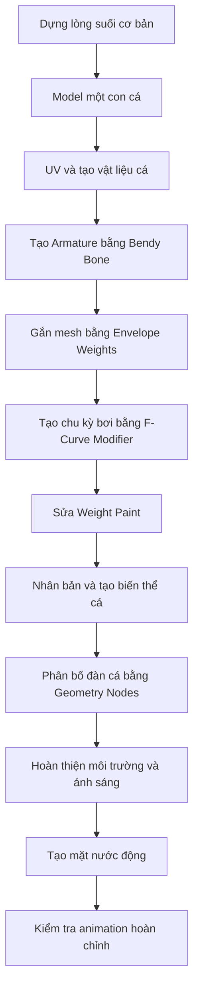

# 12 — Kết thúc

| Thuộc tính       | Nội dung                                                       |
| ---------------- | -------------------------------------------------------------- |
| **Video**        | Không rõ tên video/kênh — nội dung được tổng hợp từ transcript |
| **Đoạn**         | Outro                                                          |
| **Thời điểm**    | 29:48–30:00                                                    |
| **Chủ đề chính** | Lời kết, kêu gọi tương tác và giới thiệu Patreon               |

---

## 1. Mục tiêu bài học

Sau chương cuối này, người học có thể:

* Nắm được các kênh phản hồi và tương tác mà tác giả đề xuất sau khi xem video.
* Biết nơi có thể tìm file dự án gốc để tham khảo trực tiếp cách thiết lập scene.
* Tổng kết lại toàn bộ quy trình dựng cảnh suối và đàn cá bơi đã thực hiện trong các chương trước.
* Hiểu rằng các thông số trong tài liệu chỉ mang tính tham khảo và cần được điều chỉnh theo từng project thực tế.

---

## 2. Nội dung chính

### 2.1. Lời cảm ơn và kêu gọi tương tác

Tác giả kết thúc video bằng lời cảm ơn người xem đã theo dõi toàn bộ hướng dẫn.

Nếu gặp khó khăn trong quá trình thực hành, người xem được khuyến khích để lại:

* Bình luận;
* Câu hỏi;
* Phản hồi về hướng dẫn;
* Các vấn đề phát sinh khi áp dụng kỹ thuật vào project riêng.

Khi đặt câu hỏi, nên mô tả rõ:

* Đang thực hiện bước nào;
* Kết quả mong muốn là gì;
* Kết quả thực tế đang gặp phải;
* Các thông số hoặc node đã sử dụng;
* Phiên bản Blender đang dùng.

Câu hỏi càng cụ thể thì càng dễ kiểm tra và đưa ra giải pháp phù hợp.

---

### 2.2. File dự án gốc trên Patreon

Tác giả nhắc lại rằng file demo gốc của project sẽ được tải lên **Patreon** dành cho những người ủng hộ.

File dự án này có thể hữu ích khi cần kiểm tra chính xác:

* Cấu trúc scene;
* Cách tổ chức Collection;
* Hệ thống Armature;
* Thiết lập F-Curve Modifier;
* Cấu trúc Geometry Nodes;
* Các node vật liệu;
* Giá trị Amplitude, Density, Roughness, IOR;
* Thiết lập ánh sáng, camera và môi trường.

Đây là nguồn tham khảo trực tiếp đáng tin cậy hơn so với việc chỉ dựa vào transcript hoặc các thông số được ước lượng lại trong tài liệu.

> **Lưu ý:** Vì nội dung được cung cấp không có tên video hoặc tên kênh gốc, tài liệu này không thể xác định chính xác đường dẫn Patreon của tác giả.

---

### 2.3. Animation demo cuối video

Phần cuối video trình diễn kết quả animation hoàn chỉnh, bao gồm:

* Lòng suối và địa hình;
* Các con cá đã được rig;
* Chuyển động bơi tuần hoàn;
* Đàn cá được phân bố bằng Geometry Nodes;
* Chuyển động khác nhau giữa từng cá thể;
* Mặt nước trong suốt;
* Gợn sóng động;
* Ánh sáng và môi trường hoàn chỉnh.

Đoạn demo này đóng vai trò như một **bản tham chiếu trực quan** cho kết quả cuối cùng mà người học cần hướng tới.

Thay vì chỉ kiểm tra từng kỹ thuật riêng lẻ, hãy quan sát tổng thể:

* Nhịp chuyển động của đàn cá;
* Mức độ tự nhiên của chuyển động thân và đuôi;
* Khoảng cách giữa các cá thể;
* Độ sâu của cá so với mặt nước;
* Tốc độ chuyển động của gợn sóng;
* Mức độ phản chiếu và khúc xạ của vật liệu nước;
* Sự cân bằng giữa cá, địa hình, ánh sáng và camera.

---

## 3. Tổng kết toàn bộ quy trình

Toàn bộ video có thể được tóm tắt thành chuỗi công việc sau:



### Luồng kỹ thuật tổng quát

```text
Modeling
   ↓
UV & Material
   ↓
Rigging
   ↓
Skinning
   ↓
Animation
   ↓
Weight Cleanup
   ↓
Variation
   ↓
Geometry Nodes
   ↓
Environment
   ↓
Water Shading
   ↓
Final Animation
```

---

## 4. Quy trình thực hành gợi ý

### Bước 1 — Hoàn thiện scene cá nhân

Kiểm tra xem project đã có đầy đủ:

* Địa hình hoặc lòng suối;
* Ít nhất một model cá hoàn chỉnh;
* Armature và chuyển động bơi;
* Nhiều cá thể với biến thể chuyển động;
* Hệ thống Geometry Nodes;
* Vật liệu nước;
* Camera và ánh sáng.

### Bước 2 — Tổng hợp các vấn đề còn tồn tại

Ghi lại các lỗi hoặc điểm chưa hài lòng, chẳng hạn:

* Cá bị biến dạng sai;
* Đuôi chuyển động quá cứng;
* Các cá thể chuyển động giống hệt nhau;
* Cá xuất hiện phía trên mặt nước;
* Geometry Nodes phân bố cá quá dày;
* Mặt nước quá mờ hoặc quá phản chiếu;
* Gợn sóng chuyển động quá nhanh;
* Scene bị chậm khi phát animation.

### Bước 3 — Đặt câu hỏi cụ thể

Thay vì hỏi:

> Tại sao animation của tôi không hoạt động?

Nên mô tả cụ thể:

> Tôi đã thêm Built-In Function Modifier vào kênh Rotation Z của xương thân, nhưng xương không chuyển động khi phát timeline. Xương đã có một keyframe tại frame 1 và Amplitude đang đặt là 0.3.

Cách đặt câu hỏi này giúp việc xác định nguyên nhân nhanh và chính xác hơn.

### Bước 4 — Đối chiếu với demo cuối

Xem lại đoạn animation cuối video và so sánh với project của mình theo các tiêu chí:

| Hạng mục           | Nội dung cần kiểm tra                                       |
| ------------------ | ----------------------------------------------------------- |
| **Chuyển động cá** | Thân và đuôi có chuyển động nối tiếp tự nhiên hay không     |
| **Biến thể**       | Các con cá có khác nhau về tốc độ, pha và biên độ hay không |
| **Phân bố**        | Đàn cá có bị chồng lấn hoặc tập trung quá dày không         |
| **Độ sâu**         | Cá có nằm đúng phía dưới mặt nước không                     |
| **Mặt nước**       | Độ trong, phản chiếu và gợn sóng có hợp lý không            |
| **Ánh sáng**       | Scene có đủ chiều sâu và dễ quan sát không                  |
| **Hiệu năng**      | Animation có thể phát ổn định trong viewport không          |

### Bước 5 — Tham khảo file gốc khi cần

Khi cần độ chính xác tuyệt đối về node hoặc giá trị tham số, nên tìm file dự án gốc của tác giả thay vì phụ thuộc hoàn toàn vào các con số ghi lại từ transcript.

---

## 5. Phím tắt và công cụ liên quan

Đây là đoạn kết nên không có thao tác Blender mới.

Tuy nhiên, toàn bộ video đã sử dụng những nhóm công cụ chính sau:

| Nhóm công cụ                   | Công dụng                                |
| ------------------------------ | ---------------------------------------- |
| **Modeling Tools**             | Dựng lòng suối và mesh cá                |
| **Mirror Modifier**            | Model đối xứng hai bên                   |
| **Subdivision Surface**        | Làm mượt mesh                            |
| **UV Editing**                 | Chiếu texture lên cá                     |
| **Shader Editor**              | Tạo vật liệu cá và nước                  |
| **Armature**                   | Tạo hệ thống xương                       |
| **Bendy Bone**                 | Uốn cong thân cá mượt hơn                |
| **Envelope Weights**           | Gắn mesh vào Armature                    |
| **Weight Paint**               | Kiểm tra và sửa vùng ảnh hưởng của xương |
| **Graph Editor**               | Điều khiển animation bằng F-Curve        |
| **Built-In Function Modifier** | Tạo chuyển động tuần hoàn bằng hàm sin   |
| **Geometry Nodes**             | Phân bố và tạo đàn cá                    |
| **Noise Texture 4D**           | Tạo gợn sóng động trên mặt nước          |
| **Driver Expression**          | Animate thông số node theo frame         |

---

## 6. Lưu ý và lỗi thường gặp

### 6.1. Không xem thông số trong tài liệu là giá trị bắt buộc

Các giá trị như:

* Amplitude;
* Phase Multiplier;
* Phase Offset;
* Density;
* Scale;
* Roughness;
* IOR;
* Noise Scale;
* Noise Detail;

chỉ nên được xem là **điểm khởi đầu**.

Kết quả thực tế còn phụ thuộc vào:

* Kích thước model;
* Tỉ lệ scene;
* Số lượng subdivision;
* Chiều dài xương;
* Hướng trục local;
* Mật độ đàn cá;
* Khoảng cách camera;
* Render Engine;
* Phiên bản Blender.

---

### 6.2. Transcript dịch máy có thể không hoàn toàn chính xác

Bộ tài liệu từ chương 01 đến chương 12 được tổng hợp từ transcript, vì vậy có thể tồn tại:

* Tên node bị dịch sai;
* Tên menu không đúng hoàn toàn;
* Giá trị tham số bị nghe hoặc nhận dạng nhầm;
* Một số thao tác trung gian không xuất hiện trong transcript;
* Khác biệt giữa phiên bản Blender của video và phiên bản hiện tại.

Khi gặp khác biệt, nên ưu tiên kiểm tra:

1. Giao diện Blender hiện tại;
2. Tài liệu Blender chính thức;
3. File project gốc;
4. Hình ảnh trực tiếp trong video;
5. Transcript và ghi chú diễn giải.

---

### 6.3. Không thể xác định chính xác nguồn Patreon

Do không có tên video hoặc tên kênh gốc, không thể liên kết trực tiếp đến:

* Video gốc;
* Kênh tác giả;
* Trang Patreon;
* File Blender demo.

Người học cần xác định lại nguồn video nếu muốn tải file dự án.

---

### 6.4. Không nên sao chép hoàn toàn scene mẫu

Mục tiêu quan trọng nhất của hướng dẫn không phải là tái tạo chính xác từng pixel của scene mẫu, mà là hiểu và áp dụng được các kỹ thuật:

* Rig cá đơn giản bằng Bendy Bone;
* Tạo animation tuần hoàn bằng F-Curve Modifier;
* Tạo biến thể chuyển động;
* Phân bố object bằng Geometry Nodes;
* Tạo mặt nước động bằng shader procedural.

Sau khi hiểu các kỹ thuật này, có thể áp dụng chúng cho:

* Cá biển;
* Cá koi;
* Cá mập nhỏ;
* Lươn;
* Rắn;
* Sứa;
* Rong biển;
* Dây cáp chuyển động;
* Các sinh vật có thân dài và mềm.

---

## 7. Checklist hoàn thành

### Scene và môi trường

* [ ] Đã dựng lòng suối hoặc môi trường nước.
* [ ] Đã hoàn thiện camera và ánh sáng cơ bản.
* [ ] Đã tạo mặt nước với vật liệu phù hợp.
* [ ] Đã tạo chuyển động gợn sóng trên mặt nước.

### Model và vật liệu cá

* [ ] Đã hoàn thiện mesh cá.
* [ ] Đã kiểm tra Normals.
* [ ] Đã UV unwrap.
* [ ] Đã tạo vật liệu cá.
* [ ] Đã kiểm tra texture và bump.

### Rigging và animation

* [ ] Đã tạo Armature gồm xương thân và xương đuôi.
* [ ] Đã thiết lập Bendy Bone.
* [ ] Đã gắn mesh bằng Envelope Weights.
* [ ] Đã kiểm tra biến dạng trong Pose Mode.
* [ ] Đã tạo chu kỳ bơi bằng F-Curve Modifier.
* [ ] Đã tạo độ trễ giữa chuyển động thân và đuôi.
* [ ] Đã sửa các vùng Weight Paint bị ảnh hưởng sai.

### Đàn cá và Geometry Nodes

* [ ] Đã nhân bản nhiều phiên bản cá.
* [ ] Đã tạo khác biệt về Amplitude hoặc Phase.
* [ ] Đã gom các cá thể vào Collection.
* [ ] Đã phân bố đàn cá bằng Geometry Nodes.
* [ ] Đã điều chỉnh mật độ và phạm vi phân bố.
* [ ] Đã kiểm tra cá không xuyên địa hình hoặc nổi trên mặt nước.

### Hoàn thiện

* [ ] Đã xem toàn bộ animation trong viewport.
* [ ] Đã so sánh với demo cuối video.
* [ ] Đã ghi chú các vấn đề còn tồn tại.
* [ ] Đã tinh chỉnh thông số theo tỉ lệ scene thực tế.
* [ ] Đã lưu một phiên bản project hoàn chỉnh.
* [ ] Đã tạo bản sao dự phòng trước khi thay đổi lớn.
* [ ] Tùy chọn: Đã tìm nguồn video hoặc Patreon để tham khảo file gốc.

---

## 8. Kết quả cuối cùng cần đạt được

Sau khi hoàn thành toàn bộ hướng dẫn, scene nên có:

```text
Một lòng suối hoặc môi trường nước
            +
Một model cá đã được rig
            +
Chu kỳ bơi tự động
            +
Nhiều biến thể chuyển động
            +
Đàn cá phân bố bằng Geometry Nodes
            +
Mặt nước trong suốt có gợn sóng
            +
Camera và ánh sáng hoàn chỉnh
```

Kết quả không nhất thiết phải giống hoàn toàn scene mẫu. Điều quan trọng là các thành phần hoạt động ổn định, chuyển động có tính tự nhiên và toàn bộ hệ thống có thể tiếp tục được mở rộng.

---

## 9. Tóm tắt

Video khép lại bằng lời cảm ơn, lời mời người xem đặt câu hỏi và giới thiệu Patreon — nơi tác giả dự kiến cung cấp file dự án gốc cho những người ủng hộ.

Đoạn animation cuối video tổng kết toàn bộ quy trình đã học:

1. Dựng lòng suối;
2. Model và tạo vật liệu cá;
3. Rig cá bằng Bendy Bone;
4. Gắn mesh bằng Envelope Weights;
5. Tạo chu kỳ bơi bằng F-Curve Modifier;
6. Sửa lỗi Weight Paint;
7. Nhân bản và tạo biến thể cho nhiều con cá;
8. Phân bố đàn cá bằng Geometry Nodes;
9. Hoàn thiện môi trường;
10. Tạo mặt nước động;
11. Kiểm tra animation tổng thể.

Điểm quan trọng nhất của khóa hướng dẫn là xây dựng được một quy trình tương đối đơn giản nhưng linh hoạt để tạo đàn cá bơi tự động trong Blender mà không cần tạo thủ công quá nhiều keyframe.

---

# Bài luyện tập

## Mục tiêu


## Đề bài


## Yêu cầu hoàn thành

- [ ] 
- [ ] 
- [ ] 

## Kết quả / lời giải


## Ghi chú
