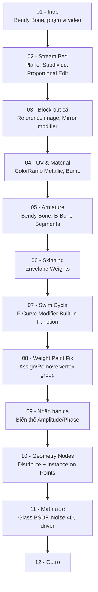

# Creating an Animated School of Fish in Blender

Ghi chú cho một video hướng dẫn Blender (~30 phút) dạng screen-share, trình bày quy trình dựng một **con suối có đàn cá bơi** hoàn chỉnh: model cá cơ bản (block-out từ ảnh tham chiếu), rig bằng **Bendy Bone armature**, animate chu kỳ bơi hoàn toàn bằng **F-Curve Modifier "Built-In Function"** (không cần keyframe thủ công nhiều khung hình), nhân bản và rải cả một đàn cá bằng **Geometry Nodes**, và dựng shader mặt nước động bằng Glass BSDF + Noise Texture 4D.

- **Tên video/kênh:** không được nêu rõ trong nội dung do người dùng cung cấp (chỉ có transcript, không có tiêu đề/kênh/số liệu). Tác giả có nhắc đến việc tải file demo lên **Patreon** cho người ủng hộ, và đây có vẻ là một phần trong loạt hướng dẫn định kỳ của kênh đó.
- **Thời lượng:** ~30 phút (không tính đoạn nhạc nền cuối video)
- **Nguồn ghi chú:** bản dịch máy (tiếng Việt) của transcript gốc, do người dùng cung cấp — các thuật ngữ Blender bị dịch sai đã được diễn giải lại theo đúng ngữ cảnh (ví dụ "khung băm" = ký tự `#` để nhập driver nhanh, "vảy của cá" ở đoạn Geometry Nodes = "scale/kích thước" của cá chứ không phải vảy da, "Phần ứng" = Armature, "đối mặt" = Face/Normal).
- **Quan hệ với các ghi chú khác trong repo:** đây là **kỹ thuật animate cá thứ ba** được ghi chú (khác kênh, khác phương pháp) — so với [Learn How to Animate and Render a Fish in Blender!](../../animate-and-render-a-fish-in-blender/) và [The Secret to Easy Fish Animation in Blender!](../../the-secret-to-easy-fish-animation-in-blender/) của Polyfjord (dùng Curve Modifier). Video này dùng **Armature + Bendy Bone** thay vì Curve, và bổ sung thêm hai mảng mới: **Geometry Nodes để nhân đàn cá** và **shader nước động**.

## Cấu trúc video (theo trình tự thao tác)

| # | Bài học | Thời điểm | Nội dung |
|---|---|---|---|
| [01](01%20-%20Intro%20and%20Overview.md) | Intro & Overview | 00:00–00:56 | Giới thiệu kỹ thuật Bendy Bone đơn giản, phạm vi video |
| [02](02%20-%20Building%20the%20Stream%20Bed%20Landscape.md) | Dựng lòng suối | 00:56–02:25 | Plane, Subdivide, Proportional Editing, Subdivision Surface |
| [03](03%20-%20Blocking%20Out%20and%20Finishing%20the%20Fish%20Mesh.md) | Block-out model cá | 02:25–08:17 | Ảnh tham chiếu, Cube block-out, Mirror modifier, dọn mesh |
| [04](04%20-%20UV%20Unwrapping%20and%20the%20Fish%20Material.md) | UV & Material cá | 08:17–11:45 | Project from View, Shader Editor, ColorRamp Metallic, Bump |
| [05](05%20-%20Building%20the%20Bendy%20Bone%20Armature.md) | Dựng Armature | 11:45–15:48 | Bendy Bone, B-Bone Segments, Parent bone Connected |
| [06](06%20-%20Skinning%20with%20Envelope%20Weights.md) | Gắn mesh vào Armature | 15:48–16:18 | Armature Deform with Envelope Weights |
| [07](07%20-%20Swim%20Cycle%20with%20F-Curve%20Modifiers.md) | Chu kỳ bơi tự động | 16:18–19:18 | Graph Editor, F-Curve Modifier "Built-In Function" |
| [08](08%20-%20Fixing%20Weight%20Paint%20Bleed.md) | Sửa lỗi Weight Paint | 19:18–20:18 | Weight Paint, Vertex Group Assign/Remove |
| [09](09%20-%20Duplicating%20and%20Varying%20Multiple%20Fish.md) | Nhân bản & biến thể cá | 20:18–21:47 | Shift+D, chỉnh Amplitude/Phase Multiplier riêng từng con |
| [10](10%20-%20Scattering%20a%20School%20with%20Geometry%20Nodes.md) | Rải đàn cá bằng Geo Nodes | 21:47–25:15 | Distribute Points in Volume, Instance on Points, Collection Info |
| [11](11%20-%20Building%20an%20Animated%20Water%20Surface.md) | Mặt nước động | 25:15–29:48 | Glass BSDF, Noise Texture 4D, driver `#frame/4000` |
| [12](12%20-%20Outro.md) | Kết thúc | 29:48–30:00 | Lời kết, Patreon |

## Lộ trình học

## Các kỹ thuật cốt lõi rút ra được

- **Bendy Bone (B-Bone)** với **Segments** cao cho phép một xương duy nhất uốn cong mượt liên tục dọc thân, thay vì cần chuỗi nhiều xương cứng nối tiếp.
- **F-Curve Modifier "Built-In Function"** (hàm sin) áp trực tiếp lên kênh Rotation Z của bone, điều khiển bằng Amplitude/Phase Multiplier/Phase Offset — tạo toàn bộ chu kỳ bơi lặp lại **mà không cần keyframe thủ công nhiều khung hình**, chỉ cần một keyframe nền.
- **Lệch pha (Phase Offset) giữa xương thân và xương đuôi** mô phỏng hiệu ứng đuôi "theo sau" thân — cùng nguyên lý follow-through đã thấy ở các kỹ thuật cá khác trong repo, nhưng thực hiện hoàn toàn bằng tham số modifier thay vì keyframe tay.
- **Geometry Nodes: Distribute Points in Volume + Instance on Points + Collection Info** là bộ node tiêu chuẩn để rải nhiều bản sao của các object hoạt hình khác nhau (một "Collection" nhiều con cá) thành một đàn ngẫu nhiên, có biến thiên kích thước qua Random Value + Math (Multiply).
- **Driver nhanh bằng cú pháp `#biểu_thức`** (ví dụ `#frame/4000`) trực tiếp trong một trường số — cách nhanh nhất để animate một giá trị tuyến tính theo frame mà không cần mở Driver Editor đầy đủ.
- **Noise Texture ở chế độ 4D** cho phép animate hoa văn nhiễu theo "thời gian" (dùng thêm một trục W ảo qua Mapping Location) mà không tạo cảm giác trượt ngang thấy rõ như khi chỉ dịch chuyển texture 2D/3D thông thường.

## Cách sử dụng thư mục ghi chú này

- Mỗi file `NN - Tên bài.md` có cấu trúc: mục tiêu, nội dung chính, quy trình thực hành gợi ý, phím tắt/công cụ liên quan, lưu ý & lỗi thường gặp, checklist, tóm tắt — giống các bộ ghi chú fish animation khác trong repo.
- Ghi chú bám sát transcript thật (dù qua dịch máy) nên khá chi tiết về thao tác cụ thể; một số cụm từ chuyên ngành đã được diễn giải lại theo thuật ngữ Blender chuẩn dựa trên ngữ cảnh — nên đối chiếu với video gốc nếu cần độ chính xác tuyệt đối ở một bước cụ thể.
- Vì không rõ tên video/kênh gốc, không có liên kết trực tiếp đến video trong ghi chú này.

## Checklist tổng thể

- [ ] Dựng được lòng suối cơ bản bằng Plane + Subdivide + Proportional Editing + Subdivision Surface.
- [ ] Block-out được một model cá đơn giản từ ảnh tham chiếu, dùng Mirror modifier.
- [ ] UV unwrap và xây dựng material cá (texture + tint + ColorRamp Metallic + Bump).
- [ ] Dựng Armature với Bendy Bone (thân + đuôi), Segments cao, Parent Connected.
- [ ] Gắn mesh vào Armature bằng Envelope Weights.
- [ ] Tạo chu kỳ bơi tự động bằng F-Curve Modifier Built-In Function, lệch pha thân/đuôi.
- [ ] Sửa lỗi Weight Paint bleed giữa nhóm đỉnh body và tail.
- [ ] Nhân bản 2-3 con cá với biến thể tốc độ/biên độ bơi khác nhau.
- [ ] Rải cả đàn cá bằng Geometry Nodes (Distribute Points in Volume + Instance on Points).
- [ ] Dựng mặt nước động với Glass BSDF, Noise Texture 4D và driver animate qua Mapping node.
