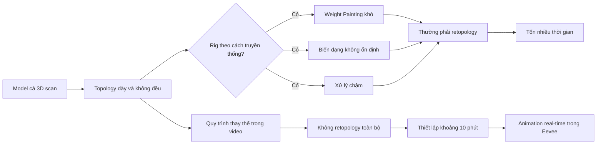

# 01 — Giới thiệu & Đặt vấn đề

## Thông tin chương

| Thuộc tính       | Nội dung                                                                                            |
| ---------------- | --------------------------------------------------------------------------------------------------- |
| **Video**        | *The Secret to Easy Fish Animation in Blender!*                                                     |
| **Phần**         | Mở đầu — Đặt vấn đề                                                                                 |
| **Thời điểm**    | `00:00–00:52`                                                                                       |
| **Chủ đề chính** | Khó khăn khi rig mesh cá 3D scan có topology dày đặc và giới thiệu một quy trình animate nhanh, nhẹ |

---

## 1. Mục tiêu bài học

Sau phần mở đầu này, người học cần:

* Hiểu vấn đề mà video muốn giải quyết: tạo animation cho **model cá được 3D scan hoặc photogrammetry** mà không cần retopology.
* Phân biệt được một model có hình ảnh đẹp với một model có topology phù hợp cho animation.
* Nắm được những cam kết chính của quy trình:

  * Thực hiện trong khoảng **10 phút**.
  * Không cần cài đặt **add-on**.
  * Không sử dụng **asset trả phí**.
  * Có thể xem chuyển động **real-time trong Eevee**.

---

## 2. Vấn đề thực tế

Tác giả bắt đầu từ một quan sát đơn giản: những con cá nhỏ thường di chuyển bằng chuyển động lắc lư mềm mại, liên tục và rất tự nhiên.

Tuy nhiên, khi tái tạo chuyển động này trong Blender, kết quả rất dễ trở nên:

* Cứng nhắc.
* Máy móc.
* Biến dạng không tự nhiên.
* Khó kiểm soát ở phần thân, đuôi và vây.

Khó khăn không chỉ nằm ở animation mà còn đến từ chính model 3D được sử dụng.

### 2.1. Model scan có hình ảnh đẹp nhưng khó rig

Trên internet có nhiều model cá được tạo bằng:

* **3D scanning**.
* **Photogrammetry**.
* Quét vật thể thật từ nhiều góc nhìn.

Các model này thường có:

* Hình dáng chi tiết.
* Texture chân thực.
* Bề mặt giàu thông tin.
* Số lượng polygon rất lớn.

Tuy nhiên, topology của chúng thường:

* Dày đặc.
* Phân bố không đều.
* Có nhiều triangle.
* Không có edge loop rõ ràng.
* Không được xây dựng theo cấu trúc phục vụ deformation.

Vì vậy, một model scan dù rất đẹp vẫn chưa chắc đã phù hợp để rig và animate.

> **Chất lượng hình ảnh cao không đồng nghĩa với khả năng animation tốt.**

---

## 3. Vì sao rig tiêu chuẩn gặp khó khăn?

Quy trình rig truyền thống thường sử dụng:

1. Armature.
2. Bone.
3. Automatic Weights.
4. Weight Painting.
5. Điều chỉnh deformation thủ công.

Phương pháp này hoạt động tốt nhất khi mesh có:

* Topology dạng quad tương đối sạch.
* Edge loop chạy theo cấu trúc cơ thể.
* Mật độ polygon hợp lý.
* Sự phân bố vertex đồng đều.

Ngược lại, mesh scan dày đặc có thể gây ra các vấn đề:

* Automatic Weight phân bố sai.
* Thân cá bị gãy hoặc lõm khi uốn.
* Vây bị kéo theo vùng không mong muốn.
* Weight Painting khó chỉnh sửa.
* Blender xử lý chậm khi số lượng vertex quá lớn.
* Việc sửa deformation tốn nhiều thời gian.

---

## 4. Retopology và hạn chế của nó

Giải pháp thông thường là thực hiện **retopology**.

Retopology là quá trình dựng lại một mesh mới với topology sạch dựa trên bề mặt của model scan ban đầu.

### Retopology có thể tạo ra:

* Mesh nhẹ hơn.
* Edge loop phù hợp với chuyển động.
* Deformation ổn định hơn.
* Rig dễ kiểm soát hơn.

Tuy nhiên, retopology cũng có một số hạn chế:

* Mất nhiều thời gian.
* Yêu cầu hiểu topology.
* Có thể phải chỉnh lại UV.
* Có nguy cơ làm mất chi tiết của model gốc.
* Không phù hợp với một quy trình thử nghiệm nhanh.

Trong video này, tác giả không muốn dành nhiều giờ để dựng lại toàn bộ lưới chỉ để tạo một animation cá bơi đơn giản.

---

## 5. Hướng giải quyết của video

Sau nhiều tuần thử nghiệm, tác giả tìm ra một quy trình giúp animate trực tiếp loại mesh scan dày đặc mà:

* Không cần retopology toàn bộ.
* Không cần add-on.
* Không cần mua asset.
* Không yêu cầu rig phức tạp.
* Vẫn tạo được chuyển động lắc thân tự nhiên.
* Có thể chạy real-time trong Eevee.

### Sơ đồ tổng quan



---

## 6. Các ràng buộc của kỹ thuật

Ngay từ phần mở đầu, tác giả đưa ra bốn tiêu chí quan trọng.

### 6.1. Thực hiện trong khoảng 10 phút

Quy trình được thiết kế để có thể thiết lập nhanh, phù hợp với:

* Prototype.
* Video ngắn.
* Thử nghiệm animation.
* Các project không yêu cầu rig nhân vật quá phức tạp.

Con số 10 phút nên được hiểu là thời gian thiết lập cơ bản khi người thực hiện đã quen với các công cụ.

---

### 6.2. Không cần add-on

Toàn bộ quy trình sử dụng các tính năng có sẵn trong Blender.

Điều này giúp:

* Dễ chia sẻ file project.
* Không phụ thuộc vào plugin bên thứ ba.
* Tránh lỗi không tương thích giữa các phiên bản.
* Người mới có thể thực hiện ngay sau khi cài Blender.

---

### 6.3. Không cần asset trả phí

Model và các tài nguyên được sử dụng có thể tìm từ nguồn miễn phí.

Tuy nhiên, khi tải model từ internet, vẫn cần kiểm tra:

* Giấy phép sử dụng.
* Yêu cầu ghi nguồn.
* Có được phép sử dụng thương mại hay không.
* Có được phép chỉnh sửa và phân phối lại hay không.

---

### 6.4. Chạy real-time trong Eevee

Kỹ thuật đủ nhẹ để animation có thể được preview trực tiếp trong viewport bằng Eevee.

Điều này có lợi vì:

* Dễ quan sát chuyển động thân cá.
* Có thể chỉnh tốc độ và biên độ ngay lập tức.
* Không phải chờ render Cycles.
* Phù hợp cho game, ứng dụng mobile và nội dung tương tác.

---

## 7. So sánh hai hướng tiếp cận

| Tiêu chí                | Rig truyền thống              | Quy trình trong video       |
| ----------------------- | ----------------------------- | --------------------------- |
| **Retopology**          | Thường cần                    | Không cần toàn bộ           |
| **Armature phức tạp**   | Có thể cần                    | Được đơn giản hóa           |
| **Weight Painting**     | Nhiều                         | Hạn chế tối đa              |
| **Thời gian thiết lập** | Có thể mất nhiều giờ          | Khoảng 10 phút              |
| **Phù hợp mesh scan**   | Khó                           | Được thiết kế cho mesh scan |
| **Preview real-time**   | Phụ thuộc độ nặng mesh        | Hướng tới Eevee real-time   |
| **Add-on**              | Có thể cần                    | Không cần                   |
| **Mục tiêu**            | Rig hoàn chỉnh, kiểm soát cao | Animation nhanh và thực tế  |

---

## 8. Quy trình thực hành gợi ý

Ở phần mở đầu chưa có thao tác Blender cụ thể. Tuy nhiên, người học có thể chuẩn bị project như sau.

### Bước 1 — Chuẩn bị Blender

* Mở Blender.
* Tạo một project mới.
* Chuyển Render Engine sang **Eevee**.
* Lưu file trước khi bắt đầu.

### Bước 2 — Xác định loại model

Kiểm tra xem model cá thuộc loại nào:

* Model thủ công với topology sạch.
* Model low-poly.
* Model game-ready.
* Model scan hoặc photogrammetry.
* Model có rig sẵn.
* Model chỉ có mesh và texture.

### Bước 3 — Kiểm tra độ nặng của mesh

Bật thống kê trong viewport:

```text
Viewport Overlays
└── Statistics
```

Quan sát:

* Số vertex.
* Số edge.
* Số face.
* Số triangle.
* Số object trong scene.

### Bước 4 — Xác định mục tiêu animation

Trước khi rig, cần xác định rõ:

* Chỉ cần cá lắc thân tại chỗ.
* Cá cần bơi theo đường Curve.
* Cá cần quay đầu.
* Vây có cần chuyển động riêng không.
* Animation dùng cho video hay ứng dụng real-time.

---

## 9. Phím tắt và công cụ liên quan

Phần giới thiệu chưa sử dụng thao tác kỹ thuật cụ thể. Một số công cụ sẽ hữu ích ở các phần tiếp theo:

| Công cụ                | Công dụng                     |
| ---------------------- | ----------------------------- |
| **Eevee**              | Preview và render real-time   |
| **Statistics Overlay** | Kiểm tra độ nặng của mesh     |
| **Modifiers**          | Tạo deformation không phá hủy |
| **Shape Keys**         | Lưu các trạng thái biến dạng  |
| **Armature**           | Điều khiển mesh bằng bone     |
| **Curve**              | Tạo đường di chuyển           |
| **Graph Editor**       | Điều chỉnh chuyển động lặp    |
| **Drivers**            | Tự động hóa giá trị animation |

---

## 10. Lưu ý quan trọng

### 10.1. Model đẹp chưa chắc dễ animate

Một model scan có thể:

* Rất chân thực khi đứng yên.
* Có texture chất lượng cao.
* Có nhiều chi tiết bề mặt.

Nhưng vẫn có thể rất khó sử dụng cho animation do topology không phù hợp.

---

### 10.2. Không phải model nào cũng cần retopology

Nếu model đã có:

* Topology sạch.
* Edge loop hợp lý.
* Mật độ polygon vừa phải.
* Rig hoặc weight tốt.

Bạn có thể sử dụng trực tiếp phương pháp rig truyền thống và bỏ qua một số bước tối ưu dành riêng cho mesh scan.

---

### 10.3. Không nên giảm polygon quá mức

Nếu Decimate hoặc các phương pháp giảm polygon được sử dụng quá mạnh:

* Silhouette của cá có thể bị vỡ.
* Vây mỏng có thể biến mất.
* Texture bị biến dạng.
* Các chi tiết quanh mắt và miệng bị hỏng.

Mục tiêu không phải làm model nhẹ nhất có thể, mà là đạt sự cân bằng giữa:

```text
Chất lượng hình ảnh
        +
Khả năng biến dạng
        +
Hiệu suất real-time
```

---

### 10.4. Real-time không đồng nghĩa với chất lượng thấp

Eevee vẫn có thể tạo kết quả đẹp nếu thiết lập hợp lý:

* Ánh sáng tốt.
* Material phù hợp.
* Shadow được tối ưu.
* Reflection và Ambient Occlusion vừa đủ.
* Số lượng polygon được kiểm soát.

---

## 11. Checklist thực hành

### Hiểu vấn đề

* [ ] Đã hiểu mesh cá scan thường có topology dày và không đều.
* [ ] Đã hiểu vì sao mesh scan khó rig bằng Armature và Weight Painting.
* [ ] Đã phân biệt được chất lượng hình ảnh với chất lượng topology.

### Hiểu mục tiêu của video

* [ ] Animate mesh cá scan mà không cần retopology toàn bộ.
* [ ] Không sử dụng add-on.
* [ ] Không sử dụng asset trả phí.
* [ ] Thiết lập trong khoảng 10 phút.
* [ ] Có thể preview real-time trong Eevee.

### Chuẩn bị project

* [ ] Đã mở Blender.
* [ ] Đã chọn Eevee làm Render Engine.
* [ ] Đã bật Statistics trong viewport.
* [ ] Đã xác định model cần sử dụng.
* [ ] Đã xác định mục tiêu animation của cá.

---

## 12. Tóm tắt

Phần mở đầu xác định một vấn đề rất cụ thể: các model cá được tạo bằng 3D scan thường có hình ảnh đẹp nhưng topology dày đặc, không đều và khó rig bằng phương pháp truyền thống.

Thay vì dành nhiều thời gian cho retopology, video giới thiệu một quy trình thay thế nhằm giúp mesh cá scan có thể:

* Uốn cong tự nhiên.
* Tạo chuyển động lắc thân.
* Thiết lập nhanh.
* Không cần add-on.
* Không cần tài nguyên trả phí.
* Hoạt động real-time trong Eevee.

Đây là nền tảng để các chương tiếp theo đi vào quá trình tìm model, tối ưu mesh và xây dựng hệ thống animation cá bơi.
