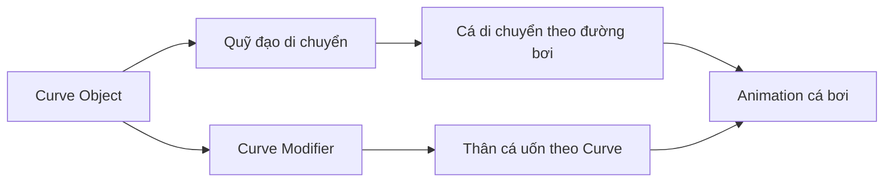
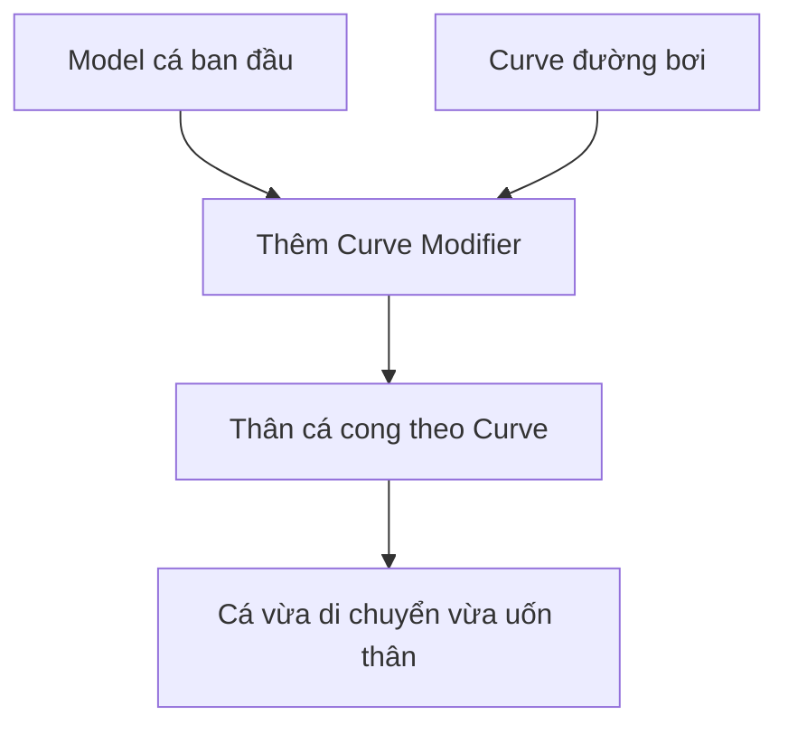

# 02 — Bước 1: Thêm Curve làm đường bơi

| Thuộc tính       | Nội dung                                          |
| ---------------- | ------------------------------------------------- |
| **Video**        | *The Secret to Easy Fish Animation in Blender!*   |
| **Phần**         | Step One                                          |
| **Thời điểm**    | 00:52–01:10                                       |
| **Chủ đề chính** | Tạo Curve Object làm đường dẫn chuyển động cho cá |

---

## 1. Mục tiêu bài học

Sau phần này, người học có thể:

* Hiểu vai trò kép của **Curve** trong hệ thống animation cá:

  * Làm đường bơi cho cá.
  * Làm công cụ uốn cong thân cá ở các bước sau.
* Biết cách thêm một Curve Object trong Blender.
* Biết sử dụng công cụ **Draw** để vẽ đường đi tự do.
* Tạo một đường bơi đơn giản làm nền tảng cho các bước animation tiếp theo.
* Hiểu vì sao chưa cần hoàn thiện Curve quá chi tiết ngay từ đầu.

---

## 2. Vai trò của Curve trong hệ thống animation

Bước đầu tiên là tạo một **Curve Object**. Curve này sẽ đóng vai trò là con đường mà cá di chuyển theo trong suốt animation.

Tuy nhiên, trong kỹ thuật của video, Curve không chỉ là một đường dẫn chuyển động thông thường.

Nó có hai chức năng chính:

```text
Curve Object
├── Quy định quỹ đạo di chuyển của cá
└── Làm cong thân cá bằng Curve Modifier
```

Điều này có nghĩa là hình dạng của Curve sẽ ảnh hưởng đồng thời đến:

1. Vị trí và hướng di chuyển của cá.
2. Độ cong và hình dáng uốn của thân cá.

Vì vậy, Curve là thành phần trung tâm của toàn bộ hệ thống animation.

---

## 3. Nguyên lý hoạt động tổng quát



Khác với cách chỉ sử dụng **Follow Path Constraint**, kỹ thuật này còn dùng hình dạng vật lý của Curve để điều khiển biến dạng của model cá.

Nhờ đó, chuyển động của cá và độ uốn của thân có thể liên kết chặt chẽ với nhau.

---

## 4. Tạo đường bơi bằng Curve

Trong Blender, có thể thêm một Curve bằng cách:

```text
Shift + A
→ Curve
→ Bezier
```

Bezier Curve là lựa chọn phổ biến vì:

* Dễ chỉnh sửa bằng các Control Point.
* Có thể kiểm soát độ cong bằng Handle.
* Phù hợp với Curve Modifier.
* Có thể sử dụng công cụ Draw để vẽ đường tự do.

Sau khi thêm Curve, nhấn `Tab` để chuyển sang **Edit Mode**.

---

## 5. Sử dụng công cụ Draw

Trong Edit Mode của Curve, có thể sử dụng công cụ **Draw** nằm trên thanh công cụ bên trái của 3D Viewport.

Công cụ Draw cho phép vẽ trực tiếp đường đi bằng chuột hoặc bảng vẽ, thay vì phải đặt và chỉnh từng điểm Bezier thủ công.

Quy trình cơ bản:

```text
Thêm Curve
→ Vào Edit Mode
→ Chọn Draw
→ Vẽ đường bơi
→ Điều chỉnh lại các điểm nếu cần
```

Công cụ này đặc biệt hữu ích khi cần tạo:

* Đường bơi dạng chữ S.
* Đường cong mềm mại.
* Quỹ đạo lên xuống tự nhiên.
* Đường đi không hoàn toàn đối xứng.
* Chuyển động có cảm giác hữu cơ.

---

## 6. Vì sao chỉ nên tạo Curve đơn giản ở bước này?

Ở bước đầu, tác giả chủ động sử dụng một Curve tương đối đơn giản.

Nguyên nhân là trong các phần animation sau, Curve sẽ tiếp tục được chỉnh sửa dựa trên nguyên tắc vận động thực tế của cá.

Các thay đổi có thể bao gồm:

* Thêm các đoạn cong.
* Điều chỉnh vị trí Control Point.
* Thay đổi hướng và độ dài Handle.
* Tạo các khúc lượn lớn và nhỏ.
* Điều chỉnh độ cong để tạo nhịp bơi tự nhiên.
* Tinh chỉnh quỹ đạo để tránh chuyển động máy móc.

Nếu hoàn thiện Curve quá chi tiết ngay từ đầu, phần lớn hình dạng đó có thể phải chỉnh sửa lại khi bắt đầu tạo animation.

> Ở bước này, mục tiêu không phải tạo đường bơi hoàn hảo mà là xây dựng một Curve đủ tốt để tiếp tục thiết lập hệ thống.

---

## 7. Mối liên hệ giữa Curve và thân cá

Ở bước 4 của quy trình, model cá sẽ được gắn **Curve Modifier**.

Modifier này làm cho mesh của cá cong theo hình dạng của Curve.



Do đó, Curve có góc cong quá gấp có thể khiến:

* Thân cá bị gập mạnh.
* Đầu hoặc đuôi bị méo.
* Vây bị xuyên qua thân.
* Mesh bị kéo giãn bất thường.
* Chuyển động trông không tự nhiên.

Curve nên được thiết kế bằng các đoạn cong mềm mại, liên tục và không thay đổi hướng quá đột ngột.

---

## 8. Quy trình thực hành đề xuất

### Bước 1: Thêm Curve

Trong Object Mode:

```text
Shift + A
→ Curve
→ Bezier
```

### Bước 2: Chuyển sang Edit Mode

Chọn Curve và nhấn:

```text
Tab
```

### Bước 3: Chọn công cụ Draw

Tại thanh công cụ bên trái của 3D Viewport:

```text
Toolbar
→ Draw
```

Nếu thanh công cụ không hiển thị, nhấn:

```text
T
```

### Bước 4: Vẽ đường bơi

Vẽ một đường đơn giản, chẳng hạn:

```text
Đường thẳng nhẹ
→ Một đoạn cong
→ Đường chữ S đơn giản
```

Không nên tạo quá nhiều điểm hoặc quá nhiều khúc ngoặt trong lần đầu.

### Bước 5: Kiểm tra độ mượt

Quan sát Curve từ nhiều góc nhìn:

* Front View.
* Side View.
* Top View.
* Perspective View.

Đảm bảo Curve không có:

* Góc gấp đột ngột.
* Điểm điều khiển nằm quá sát nhau.
* Đoạn cong bị xoắn.
* Sự thay đổi độ cao bất thường.

---

## 9. Gợi ý hình dạng Curve ban đầu

Một đường bơi đơn giản có thể bắt đầu như sau:

```text
Điểm bắt đầu
     \
      \____
           \____
                \__
                   Điểm kết thúc
```

Hoặc sử dụng dạng chữ S nhẹ:

```text
Bắt đầu
   \
    \____
         \____
              \____
                   Kết thúc
```

Mục tiêu là tạo một dòng chuyển động mềm mại, không phải một đường ngoằn ngoèo phức tạp.

---

## 10. Phím tắt và công cụ liên quan

| Thao tác                 | Phím tắt hoặc vị trí         |
| ------------------------ | ---------------------------- |
| Thêm Curve Object        | `Shift + A > Curve`          |
| Thêm Bezier Curve        | `Shift + A > Curve > Bezier` |
| Vào hoặc thoát Edit Mode | `Tab`                        |
| Hiện hoặc ẩn Toolbar     | `T`                          |
| Chọn công cụ Draw        | Toolbar bên trái 3D Viewport |
| Di chuyển Control Point  | `G`                          |
| Xoay Handle hoặc điểm    | `R`                          |
| Scale khoảng cách điểm   | `S`                          |
| Extrude thêm điểm Curve  | `E`                          |
| Xóa điểm Curve           | `X` hoặc `Delete`            |
| Chọn toàn bộ điểm        | `A`                          |
| Nhìn từ phía trước       | `Numpad 1`                   |
| Nhìn từ bên phải         | `Numpad 3`                   |
| Nhìn từ trên xuống       | `Numpad 7`                   |

---

## 11. Lưu ý quan trọng

### Không tạo đường cong quá gấp

Curve có góc quá nhỏ hoặc thay đổi hướng đột ngột có thể làm thân cá bị gập hoặc biến dạng.

### Không tạo quá nhiều Control Point

Quá nhiều điểm điều khiển sẽ khiến:

* Curve khó chỉnh sửa.
* Đường cong dễ bị gợn.
* Animation khó kiểm soát.
* Mesh cá dễ bị biến dạng không đều.

Nên sử dụng ít điểm nhất có thể nhưng vẫn tạo được hình dạng mong muốn.

### Giữ Curve mượt mà

Đường bơi tự nhiên thường có sự chuyển hướng từ từ.

Thay vì:

```text
Đi thẳng → rẽ gấp → đi thẳng
```

Nên sử dụng:

```text
Đi thẳng → cong dần → đổi hướng → trở lại ổn định
```

### Không xóa Curve sau khi gắn Modifier

Curve sẽ được dùng lại trong các bước sau. Khi cá đã được thiết lập với Curve Modifier, không nên xóa hoặc thay Curve bằng một Object khác nếu chưa cập nhật lại Modifier.

### Chú ý trục của cá

Curve Modifier hoạt động dựa trên một trục biến dạng, thường là:

* `X`
* `-X`
* `Y`
* `-Y`

Model cá cần được xoay và đặt đúng trục trước khi gắn Modifier. Nếu sai trục, thân cá có thể:

* Cong theo chiều ngang sai.
* Bị xoay ngược.
* Biến dạng từ đầu thay vì từ đuôi.
* Lật sang hướng không mong muốn.

---

## 12. Các lỗi thường gặp

### Curve không xuất hiện sau khi nhấn `Shift + A`

Nguyên nhân có thể là đang ở Edit Mode của một Object khác.

Cách xử lý:

```text
Nhấn Tab để về Object Mode
→ Shift + A
→ Curve
```

### Không thấy công cụ Draw

Nhấn `T` để mở Toolbar bên trái 3D Viewport.

Sau đó chọn công cụ **Draw**.

### Curve bị gãy hoặc có góc nhọn

Kiểm tra loại Handle của các điểm Bezier.

Có thể chọn các điểm, sau đó sử dụng:

```text
V
→ Automatic
```

hoặc:

```text
V
→ Aligned
```

Handle dạng **Automatic** thường tạo đường cong mượt nhanh nhất.

### Curve bị xoắn trong không gian 3D

Điều này có thể xảy ra khi các Control Point có tọa độ khác nhau trên nhiều trục.

Hãy kiểm tra Curve ở:

* Front View.
* Side View.
* Top View.

Trong giai đoạn đầu, có thể giữ toàn bộ Curve trên một mặt phẳng để dễ kiểm soát.

### Cá bị biến dạng quá mạnh ở bước sau

Nguyên nhân thường là:

* Curve có góc quá gấp.
* Control Point nằm quá gần nhau.
* Scale của cá hoặc Curve chưa được Apply.
* Chọn sai Deform Axis trong Curve Modifier.

Có thể áp dụng Scale bằng:

```text
Ctrl + A
→ Scale
```

---

## 13. Cấu trúc hệ thống sau bước này

Sau khi hoàn thành bước đầu tiên, scene sẽ có cấu trúc cơ bản:

```text
Scene
├── Fish Model
├── Curve_Path
├── Camera
└── Lighting
```

Ở giai đoạn này, Curve chưa cần điều khiển hoàn toàn model cá. Nó chỉ cần tồn tại như nền tảng để tiếp tục các bước sau.

---

## 14. Checklist thực hành

* [ ] Đã thêm một Curve Object vào scene.
* [ ] Đã chọn Bezier Curve hoặc loại Curve phù hợp.
* [ ] Đã chuyển sang Edit Mode.
* [ ] Đã tìm và thử công cụ Draw.
* [ ] Đã tạo một đường bơi đơn giản.
* [ ] Curve không có góc gấp đột ngột.
* [ ] Curve không có quá nhiều Control Point.
* [ ] Đã kiểm tra Curve từ nhiều góc nhìn.
* [ ] Đã đặt tên Curve rõ ràng, ví dụ `Fish_Path`.
* [ ] Đã lưu file Blender trước khi tiếp tục.

---

## 15. Tóm tắt

Trong kỹ thuật này, Curve đóng vai trò kép:

```text
Curve
├── Là đường bơi của cá
└── Là công cụ uốn cong thân cá
```

Ở bước đầu tiên, chỉ cần tạo một Curve đơn giản, mềm mại và dễ chỉnh sửa. Không nên dành quá nhiều thời gian để hoàn thiện quỹ đạo ngay lập tức, vì Curve sẽ tiếp tục được tinh chỉnh trong các bước animation sau.

Điểm quan trọng nhất là giữ đường cong mượt, tránh góc gấp và nhớ rằng hình dạng Curve sẽ ảnh hưởng trực tiếp đến cả chuyển động lẫn độ biến dạng của thân cá.
