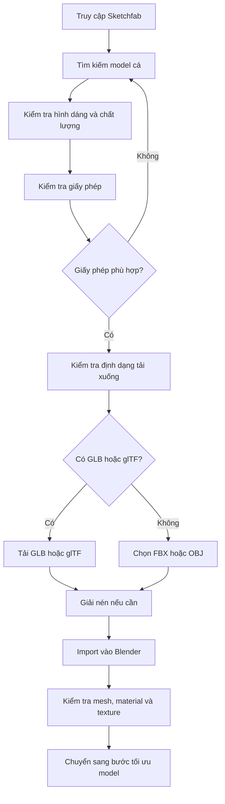

# 03 — Bước 2: Tìm một model cá

| Thuộc tính       | Nội dung                                                                                      |
| ---------------- | --------------------------------------------------------------------------------------------- |
| **Video**        | *The Secret to Easy Fish Animation in Blender!*                                               |
| **Phần**         | Step Two                                                                                      |
| **Thời điểm**    | `01:10–01:30`                                                                                 |
| **Chủ đề chính** | Tìm model cá scan miễn phí trên Sketchfab, kiểm tra giấy phép và lựa chọn định dạng tải xuống |

---

## 1. Mục tiêu bài học

Sau phần này, người học có thể:

* Biết cách sử dụng **Sketchfab** để tìm model cá scan có độ chi tiết cao.
* Hiểu sự khác biệt cơ bản giữa:

  * **Public Domain/CC0**.
  * **CC-BY**.
  * **CC-BY-SA**.
  * Các giấy phép hạn chế sử dụng thương mại.
* Biết cách kiểm tra giấy phép trước khi đưa model vào project.
* Biết ưu tiên định dạng **glTF/GLB** khi tải model để sử dụng trong Blender.
* Chuẩn bị model cho bước kiểm tra và tối ưu mesh tiếp theo.

---

## 2. Vì sao nên tìm model trên Sketchfab?

Tác giả sử dụng **Sketchfab** vì đây là nền tảng có rất nhiều model cá được tạo bằng phương pháp:

* Scan 3D.
* Photogrammetry.
* Điêu khắc kỹ thuật số.
* Modeling thủ công.
* Tái tạo từ mẫu vật thật.

Các model scan thường có:

* Hình dáng sinh học tương đối chính xác.
* Texture chi tiết.
* Màu sắc và hoa văn gần với cá thật.
* Nhiều chi tiết nhỏ trên vây, mắt và bề mặt da.

Điều này giúp tiết kiệm đáng kể thời gian so với việc tự dựng model cá từ đầu.

> **Lưu ý:** Model càng chi tiết thì mesh thường càng nặng. Tuy nhiên, ở bước này chỉ cần chọn model phù hợp. Việc giảm polygon và sửa topology sẽ được thực hiện trong bước tối ưu hóa tiếp theo.

---

## 3. Kiểm tra giấy phép sử dụng

Một model có thể được tải xuống miễn phí nhưng điều đó **không đồng nghĩa** với việc được sử dụng hoàn toàn tự do.

Trước khi tải, cần kiểm tra mục **License** trên trang chi tiết của model.

### So sánh một số loại giấy phép phổ biến

| Giấy phép             | Có cần ghi công? | Dùng thương mại | Có thể chỉnh sửa | Lưu ý                                              |
| --------------------- | ---------------: | --------------: | ---------------: | -------------------------------------------------- |
| **CC0/Public Domain** |            Không |       Thường có |               Có | Lựa chọn thuận tiện nhất                           |
| **CC-BY**             |               Có |       Thường có |               Có | Phải ghi tên tác giả                               |
| **CC-BY-SA**          |               Có |       Thường có |               Có | Sản phẩm phái sinh có thể phải dùng cùng giấy phép |
| **CC-BY-NC**          |               Có |           Không |               Có | Không dùng cho mục đích thương mại                 |
| **Editorial**         |   Tùy trường hợp |         Hạn chế |          Hạn chế | Chủ yếu dùng cho báo chí, minh họa hoặc nghiên cứu |

### Giấy phép nên ưu tiên

Đối với project cá nhân, ứng dụng hoặc sản phẩm có khả năng phát hành thương mại, nên ưu tiên:

1. **CC0**.
2. **Public Domain**.
3. **CC-BY**, nếu có thể ghi công tác giả đầy đủ.

> Luôn đọc nội dung giấy phép trên trang model. Không nên chỉ dựa vào nhãn “Free Download”.

---

## 4. Lựa chọn model cá phù hợp

Trong video, tác giả chọn một model cá cảnh sống ở vùng rạn san hô từ một nghệ sĩ có kinh nghiệm trên Sketchfab.

Tên loài cụ thể không phải yếu tố quan trọng đối với kỹ thuật của bài học. Điều quan trọng là model có:

* Hình dáng cá rõ ràng.
* Thân và các vây không bị thiếu.
* Texture tương đối hoàn chỉnh.
* Mesh có thể tải xuống.
* Giấy phép phù hợp.
* Định dạng có thể import vào Blender.

### Tiêu chí đánh giá nhanh

| Tiêu chí       | Cần kiểm tra                                              |
| -------------- | --------------------------------------------------------- |
| **Hình dáng**  | Silhouette có giống loài cá mong muốn không?              |
| **Vây cá**     | Vây lưng, vây bụng, vây ngực và vây đuôi có đầy đủ không? |
| **Texture**    | Màu sắc có rõ nét, liền mạch và đúng vị trí không?        |
| **Mesh**       | Có lỗi thủng, vỡ hoặc các mảnh mesh rời rõ ràng không?    |
| **Số polygon** | Có quá nặng đối với thiết bị và mục tiêu sử dụng không?   |
| **Giấy phép**  | Có cho phép chỉnh sửa và sử dụng trong project không?     |
| **Định dạng**  | Có cung cấp `.glb` hoặc `.gltf` không?                    |

---

## 5. Vì sao nên ưu tiên glTF?

Nếu model có nhiều định dạng tải xuống, tác giả khuyến nghị ưu tiên:

* `.glb`
* `.gltf`

**glTF** là định dạng hiện đại, được thiết kế để truyền tải model 3D cùng các dữ liệu liên quan một cách hiệu quả.

### Dữ liệu glTF có thể giữ lại

* Mesh.
* UV Mapping.
* Material PBR.
* Texture.
* Normal Map.
* Roughness.
* Metallic.
* Cấu trúc phân cấp của object.
* Animation và rig, nếu model gốc có chứa.

### So sánh nhanh các định dạng

| Định dạng | Ưu điểm                                  | Hạn chế                                             |
| --------- | ---------------------------------------- | --------------------------------------------------- |
| **GLB**   | Đóng gói model và texture trong một file | Khó kiểm tra texture riêng trước khi import         |
| **glTF**  | Cấu trúc rõ ràng, hỗ trợ PBR tốt         | Có thể đi kèm nhiều file texture bên ngoài          |
| **FBX**   | Hỗ trợ rig và animation phổ biến         | Material có thể không được chuyển đổi chính xác     |
| **OBJ**   | Đơn giản, tương thích rộng               | Không hỗ trợ rig và animation; material khá hạn chế |
| **STL**   | Phù hợp in 3D                            | Không có texture, material hoặc rig                 |

### Thứ tự ưu tiên đề xuất

```text
GLB / glTF
    ↓
FBX
    ↓
OBJ
    ↓
STL
```

> Với model cá có texture và material, không nên chọn STL trừ khi chỉ cần hình học để in 3D.

---

## 6. Quy trình thực hành



### Bước 1: Tìm kiếm model

Truy cập Sketchfab và sử dụng các từ khóa như:

```text
fish
reef fish
coral reef fish
tropical fish
angelfish
fish scan
photogrammetry fish
```

Có thể thêm từ khóa mô tả phong cách:

```text
realistic
low poly
scanned
animated
rigged
```

### Bước 2: Kiểm tra giấy phép

Trên trang chi tiết model:

1. Tìm mục **License**.
2. Đọc yêu cầu ghi công.
3. Kiểm tra quyền sử dụng thương mại.
4. Kiểm tra quyền chỉnh sửa.
5. Lưu lại tên tác giả và đường dẫn model nếu giấy phép yêu cầu attribution.

### Bước 3: Kiểm tra preview

Quan sát model ở nhiều góc:

* Mặt bên.
* Chính diện.
* Góc trên.
* Góc dưới.
* Phần đuôi và các vây.
* Khu vực mắt và miệng.

Bật chế độ wireframe trên trình xem nếu Sketchfab hỗ trợ để đánh giá mật độ polygon.

### Bước 4: Tải model

Ưu tiên định dạng theo thứ tự:

1. `GLB`.
2. `glTF`.
3. `FBX`.
4. `OBJ`.

### Bước 5: Giải nén file

Nếu model được tải dưới dạng `.zip`:

1. Giải nén toàn bộ thư mục.
2. Không di chuyển riêng file model khỏi thư mục texture.
3. Kiểm tra các file như:

```text
model.glb
scene.gltf
model.bin
basecolor.png
normal.png
roughness.png
metallic.png
```

### Bước 6: Import vào Blender

Đối với glTF hoặc GLB:

```text
File
└── Import
    └── glTF 2.0 (.glb/.gltf)
```

Sau đó chọn file và nhấn **Import glTF 2.0**.

---

## 7. Kiểm tra model sau khi import

Sau khi import vào Blender, chưa nên bắt đầu rig ngay. Trước tiên cần kiểm tra nhanh model.

### 7.1. Kiểm tra Outliner

Quan sát xem model gồm:

* Một mesh duy nhất.
* Nhiều object mesh.
* Camera hoặc light thừa.
* Armature có sẵn.
* Các object trống hoặc node không cần thiết.

### 7.2. Kiểm tra material

Chuyển viewport sang:

```text
Material Preview
```

hoặc:

```text
Rendered View
```

Kiểm tra:

* Texture có xuất hiện không?
* Màu sắc có đúng không?
* Normal Map có hoạt động không?
* Material có bị quá bóng hoặc quá tối không?

### 7.3. Kiểm tra texture bị mất

Khi texture không hiển thị, thử:

```text
File
└── External Data
    └── Find Missing Files
```

Sau đó chọn thư mục chứa texture.

### 7.4. Kiểm tra kích thước và hướng model

Kiểm tra:

* Cá có quá lớn hoặc quá nhỏ không?
* Đầu cá đang hướng theo trục nào?
* Cá có nằm ngang đúng tư thế không?
* Origin có nằm gần thân cá không?
* Scale có bằng `1, 1, 1` không?

---

## 8. Phím tắt và công cụ liên quan

| Thao tác            | Phím tắt hoặc vị trí                        |
| ------------------- | ------------------------------------------- |
| Import glTF         | `File > Import > glTF 2.0 (.glb/.gltf)`     |
| Import FBX          | `File > Import > FBX (.fbx)`                |
| Import OBJ          | `File > Import > Wavefront (.obj)`          |
| Material Preview    | Nhấn `Z` → chọn **Material Preview**        |
| Frame Selected      | `Numpad .`                                  |
| Chọn toàn bộ object | `A`                                         |
| Xóa object thừa     | `X`                                         |
| Mở Sidebar          | `N`                                         |
| Apply Transform     | `Ctrl + A`                                  |
| Tìm texture bị mất  | `File > External Data > Find Missing Files` |
| Kiểm tra giấy phép  | Trang chi tiết model → **License**          |

---

## 9. Lỗi thường gặp

### 9.1. Model miễn phí nhưng không được dùng thương mại

**Nguyên nhân:** Model sử dụng giấy phép như CC-BY-NC hoặc Editorial.

**Cách xử lý:**

* Chọn model khác có giấy phép CC0/Public Domain.
* Xin phép tác giả.
* Mua giấy phép thương mại nếu có.

---

### 9.2. Import model nhưng không có texture

**Nguyên nhân có thể gồm:**

* Texture không được tải kèm.
* Đường dẫn texture bị thay đổi.
* Người dùng di chuyển file model khỏi thư mục gốc.
* File glTF tham chiếu đến texture bên ngoài bị thiếu.
* Model gốc chỉ có vertex color, không có image texture.

**Cách xử lý:**

1. Giải nén lại toàn bộ thư mục.
2. Không tách riêng file `.gltf` khỏi texture.
3. Sử dụng **Find Missing Files**.
4. Kiểm tra Shader Editor.
5. Tải lại định dạng GLB nếu có.

---

### 9.3. Model có quá nhiều polygon

Model scan có thể chứa:

* Hàng trăm nghìn vertex.
* Hàng triệu polygon.
* Nhiều chi tiết nhỏ không cần thiết.
* Mesh rất khó rig trực tiếp.

Đây chưa phải lỗi nghiêm trọng ở bước lựa chọn model. Vấn đề này sẽ được xử lý bằng:

* Decimate.
* Retopology.
* Remesh.
* Xóa phần mesh thừa.
* Tạo mesh điều khiển đơn giản hơn.

---

### 9.4. Model bị chia thành nhiều mảnh

Một model cá có thể gồm nhiều object:

```text
Body
Eyes
Fins
Teeth
Mouth
Texture shells
```

Không nên gộp toàn bộ ngay lập tức.

Trước tiên cần xác định:

* Bộ phận nào cần biến dạng cùng thân.
* Bộ phận nào cần giữ riêng.
* Bộ phận nào có thể xóa.
* Bộ phận nào cần rig độc lập.

---

### 9.5. Vây quá mỏng hoặc bị rách

Các vây scan thường rất mỏng và có thể:

* Bị thủng.
* Có mặt chồng lên nhau.
* Có normal ngược.
* Không đủ topology để uốn.
* Chứa nhiều phần mesh rời.

Các lỗi này sẽ cần được kiểm tra trước khi rig và tạo animation.

---

## 10. Cấu trúc thư mục đề xuất

Nên lưu model và tài nguyên theo cấu trúc rõ ràng:

```text
fish_animation_project/
├── blender/
│   └── fish_animation.blend
├── source_model/
│   ├── fish_model.glb
│   └── license.txt
├── textures/
│   ├── fish_basecolor.png
│   ├── fish_normal.png
│   └── fish_roughness.png
├── references/
│   └── sketchfab_preview.jpg
└── credits/
    └── attribution.md
```

Nếu model yêu cầu ghi công, có thể lưu thông tin trong `attribution.md`:

```markdown
## Fish Model

- Model: Tên model
- Author: Tên tác giả
- Source: Sketchfab
- License: CC-BY 4.0
- Modifications: Mesh optimization, rigging and animation
```

---

## 11. Checklist thực hành

### Tìm và tải model

* [ ] Đã tìm được model cá phù hợp trên Sketchfab.
* [ ] Đã kiểm tra model từ nhiều góc nhìn.
* [ ] Đã kiểm tra số lượng polygon nếu có thể.
* [ ] Đã đọc kỹ giấy phép sử dụng.
* [ ] Đã xác nhận quyền chỉnh sửa model.
* [ ] Đã xác nhận quyền sử dụng thương mại nếu cần.
* [ ] Đã lưu thông tin tác giả để ghi công.
* [ ] Đã ưu tiên tải định dạng GLB hoặc glTF.

### Sau khi import vào Blender

* [ ] Model đã được import thành công.
* [ ] Texture và material hiển thị đúng.
* [ ] Không thiếu các file texture quan trọng.
* [ ] Đã kiểm tra kích thước và hướng của model.
* [ ] Đã kiểm tra các object thừa trong Outliner.
* [ ] Chưa gộp hoặc xóa mesh trước khi đánh giá cấu trúc.
* [ ] Đã lưu một bản Blender ban đầu trước khi tối ưu.

---

## 12. Tóm tắt

Sketchfab là nguồn hữu ích để tìm các model cá scan có độ chi tiết cao, giúp tiết kiệm thời gian modeling từ đầu. Tuy nhiên, trước khi sử dụng model, cần kiểm tra kỹ:

1. **Giấy phép sử dụng**.
2. **Chất lượng hình dáng và texture**.
3. **Cấu trúc mesh**.
4. **Số lượng polygon**.
5. **Định dạng tải xuống**.

Nên ưu tiên các model có giấy phép **CC0/Public Domain** và tải ở định dạng **GLB/glTF** để bảo toàn tốt hơn mesh, UV, texture và material PBR.

Sau khi import vào Blender, chỉ cần kiểm tra model có đầy đủ dữ liệu hay không. Việc giảm polygon, sửa mesh và chuẩn bị model để rig sẽ được thực hiện trong chương tối ưu hóa tiếp theo.

---

# Bài luyện tập

## Mục tiêu


## Đề bài


## Yêu cầu hoàn thành

- [ ] 
- [ ] 
- [ ] 

## Kết quả / lời giải


## Ghi chú
