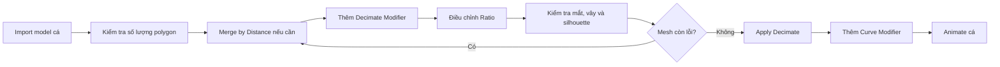

# 04 — Bước 3: Tối ưu hóa model cá

| Thuộc tính       | Nội dung                                                                  |
| ---------------- | ------------------------------------------------------------------------- |
| **Video**        | *The Secret to Easy Fish Animation in Blender!*                           |
| **Đoạn**         | Step Three                                                                |
| **Thời điểm**    | 01:30–02:09                                                               |
| **Chủ đề chính** | Giảm số lượng vertex bằng Decimate và sửa lỗi mesh bằng Merge by Distance |

---

## 1. Mục tiêu bài học

Sau phần này, người học có thể:

* Hiểu vì sao model scan vẫn xoay và quan sát mượt trong viewport nhưng trở nên chậm khi bắt đầu biến dạng.
* Biết sử dụng **Decimate Modifier** như một giải pháp tối ưu nhanh để giảm số lượng polygon.
* Nhận diện hiện tượng mesh bị rách, vỡ hoặc xuất hiện các mặt bất thường sau khi Decimate.
* Sử dụng **Merge by Distance** để gộp các vertex trùng hoặc nằm quá gần nhau.
* Hiểu vì sao cần **Apply Decimate Modifier** trước khi tiếp tục rig và animate.

---

## 2. Vấn đề: Model scan quá nặng

Sau khi import từ Sketchfab, model cá thường có số lượng vertex rất lớn. Đây là đặc điểm phổ biến của các model được tạo bằng:

* Photogrammetry.
* Quét 3D.
* Tái tạo hình học từ nhiều ảnh chụp.

Mesh scan có thể chứa hàng trăm nghìn, thậm chí hàng triệu polygon.

Khi chỉ xoay góc nhìn hoặc quan sát model trong viewport, Blender chủ yếu thực hiện việc hiển thị hình học có sẵn. GPU thường xử lý tác vụ này tương đối tốt.

Tuy nhiên, khi mesh bắt đầu được **deform**, Blender phải tính toán lại vị trí của rất nhiều vertex ở mỗi khung hình.

Trong kỹ thuật của video, quá trình này sẽ xảy ra liên tục khi:

* Gắn **Curve Modifier**.
* Uốn thân cá theo đường Curve.
* Cho cá di chuyển dọc đường bơi.
* Phát lại animation trong viewport.

Vì vậy, một model nhìn có vẻ mượt khi đứng yên vẫn có thể trở nên rất chậm khi bắt đầu animate.

```text
Mesh scan dày đặc
        │
        ├── Chỉ quan sát trong viewport
        │       └── Tương đối mượt
        │
        └── Biến dạng ở mỗi frame
                └── Phải tính lại hàng trăm nghìn vertex
                        └── Viewport chậm, giật hoặc đứng hình
```

---

## 3. Giải pháp nhanh: Decimate Modifier

Giải pháp được sử dụng trong video là **Decimate Modifier**.

Decimate làm giảm số lượng polygon bằng cách thu gọn và đơn giản hóa cấu trúc mesh, trong khi cố gắng giữ lại hình dáng tổng thể của model.

Đây là phương pháp mang tính:

> **Quick and dirty** — nhanh, tiện lợi, đủ dùng nhưng không tạo ra topology sạch như retopology thủ công.

### Ưu điểm

* Thực hiện nhanh.
* Không cần dựng lại topology từ đầu.
* Giảm đáng kể số lượng vertex và face.
* Giúp Curve Modifier và animation chạy mượt hơn.
* Phù hợp với các model scan dùng cho cảnh trung bình hoặc nhìn từ xa.

### Hạn chế

* Không tạo ra hệ thống quad topology sạch.
* Có thể làm mất các chi tiết nhỏ.
* Có thể tạo tam giác dài hoặc phân bố polygon không đều.
* Không lý tưởng cho các cảnh cận hoặc deformation phức tạp.

---

## 4. Thiết lập Decimate Modifier

### Bước 1: Kiểm tra độ nặng của model

Trong 3D Viewport:

1. Mở menu **Viewport Overlays**.
2. Bật **Statistics**.
3. Quan sát các thông số:

   * Vertices.
   * Edges.
   * Faces.
   * Triangles.

Việc này giúp xác định model có thực sự quá nặng hay không và so sánh số polygon trước và sau khi tối ưu.

### Bước 2: Thêm Decimate Modifier

Chọn model cá, sau đó vào:

```text
Modifier Properties
└── Add Modifier
    └── Generate
        └── Decimate
```

Trong Decimate Modifier, chọn chế độ:

```text
Collapse
```

Đây là chế độ phù hợp nhất để giảm polygon tổng thể của một model scan.

### Bước 3: Điều chỉnh Ratio

Thông số **Ratio** quyết định tỷ lệ polygon được giữ lại.

| Ratio | Ý nghĩa tương đối               |
| ----: | ------------------------------- |
| `1.0` | Giữ nguyên gần như toàn bộ mesh |
| `0.5` | Giữ khoảng 50% số face          |
| `0.2` | Giữ khoảng 20% số face          |
| `0.1` | Giữ khoảng 10% số face          |

Không nên nhập ngay một giá trị quá thấp. Hãy giảm dần Ratio và quan sát model trong viewport.

Đặc biệt cần kiểm tra:

* Mắt cá.
* Miệng.
* Mang cá.
* Mép vây.
* Cuống đuôi.
* Các đầu vây mỏng.
* Silhouette tổng thể của thân cá.

### Nguyên tắc lựa chọn

```text
Giảm Ratio
    │
    ├── Viewport mượt hơn
    └── Chi tiết hình học giảm đi

Mục tiêu:
Hiệu năng đủ tốt + hình dáng vẫn chấp nhận được
```

---

## 5. Sửa lỗi mesh bằng Merge by Distance

Sau khi thêm Decimate, mesh có thể xuất hiện các hiện tượng như:

* Mặt bị rách.
* Xuất hiện lỗ hổng.
* Một số vùng trông như bị nổ hoặc bung ra.
* Các mảnh hình học chồng lên nhau.
* Shading xuất hiện đường gãy bất thường.

Một nguyên nhân phổ biến là mesh scan chứa các vertex trùng nhau hoặc nằm cực kỳ gần nhau nhưng chưa được liên kết đúng.

### Cách khắc phục

1. Chọn model cá.
2. Nhấn `Tab` để vào **Edit Mode**.
3. Nhấn `A` để chọn toàn bộ vertex.
4. Thực hiện:

```text
Mesh
└── Merge
    └── By Distance
```

Hoặc sử dụng phím tắt:

```text
M → By Distance
```

Blender sẽ gộp các vertex nằm trong một khoảng cách nhất định thành một vertex duy nhất.

### Kiểm tra kết quả

Sau khi chạy Merge by Distance, Blender thường hiển thị thông báo dạng:

```text
Removed 325 vertices
```

Con số này cho biết có bao nhiêu vertex trùng hoặc quá gần nhau đã được gộp.

Nếu không có vertex nào được loại bỏ, Blender có thể hiển thị:

```text
Removed 0 vertices
```

---

## 6. Điều chỉnh khoảng cách Merge

Nếu mesh vẫn bị lỗi sau lần gộp đầu tiên, có thể ngưỡng khoảng cách mặc định quá nhỏ.

Ngay sau khi thực hiện Merge by Distance:

1. Mở bảng **Adjust Last Operation** ở góc dưới bên trái viewport.
2. Hoặc nhấn `F9`.
3. Tăng nhẹ giá trị **Distance**.
4. Theo dõi trực tiếp sự thay đổi của mesh.

> Không nên tăng Distance quá lớn vì Blender có thể gộp nhầm các vertex vốn cần được giữ tách biệt.

Ví dụ, nếu Distance quá cao, các vùng sau có thể bị dính vào nhau:

* Hai mép của vây mỏng.
* Miệng cá.
* Hai mặt gần nhau của mang cá.
* Các tia vây.
* Những phần hình học nằm sát nhau nhưng không liên kết.

### Nguyên tắc an toàn

```text
Distance quá nhỏ
└── Vertex trùng chưa được xử lý hết

Distance phù hợp
└── Loại bỏ vertex trùng, hình dáng vẫn ổn định

Distance quá lớn
└── Gộp nhầm các bộ phận của mesh
```

---

## 7. Apply Decimate Modifier

Sau khi đã tìm được Ratio phù hợp và mesh không còn lỗi nghiêm trọng, cần **Apply Decimate Modifier**.

Thao tác:

1. Chuyển về **Object Mode**.
2. Mở menu của Decimate Modifier.
3. Chọn **Apply**.

```text
Decimate Modifier
└── Menu ▼
    └── Apply
```

### Vì sao cần Apply?

Khi chưa Apply, Decimate vẫn tồn tại dưới dạng một phép tính trong Modifier Stack.

Mỗi khi Blender cập nhật mesh, đặc biệt khi kết hợp với các modifier khác, chương trình có thể phải tiếp tục đánh giá lại chuỗi modifier.

Sau khi Apply:

* Kết quả giảm polygon trở thành mesh thật.
* Decimate không còn phải được đánh giá trong Modifier Stack.
* Mesh nhẹ hơn trước khi thêm Curve Modifier.
* Viewport ổn định hơn khi phát animation.
* Có thể kiểm tra chính xác số vertex cuối cùng.

> **Lưu ý:** `Ctrl + A` trong Object Mode dùng để Apply Transform như Location, Rotation và Scale; đây không phải phím tắt mặc định để Apply một modifier.

---

## 8. Thứ tự modifier đề xuất

Trong quy trình này, nên hoàn thành việc tối ưu mesh trước khi thêm hệ thống biến dạng.



Trong một số trường hợp, việc thực hiện **Merge by Distance trước Decimate** có thể giúp Decimate hoạt động ổn định hơn vì mesh đầu vào đã được làm sạch.

Quy trình an toàn hơn là:

```text
Import
→ Apply Scale
→ Merge by Distance
→ Recalculate Normals
→ Decimate
→ Kiểm tra
→ Apply Decimate
→ Curve Modifier
→ Animation
```

---

## 9. Quy trình thực hành đề xuất

### Bước 1 — Kiểm tra Statistics

* Chọn model cá.
* Bật **Viewport Overlays > Statistics**.
* Ghi lại số vertex và triangle ban đầu.

### Bước 2 — Apply Scale

Trước khi xử lý mesh, nên bảo đảm Scale của object là:

```text
X = 1
Y = 1
Z = 1
```

Nếu chưa đúng:

```text
Object Mode → Ctrl + A → Scale
```

Apply Scale giúp các công cụ sử dụng khoảng cách, modifier và biến dạng hoạt động ổn định hơn.

### Bước 3 — Làm sạch vertex trùng

```text
Tab → Edit Mode
A → Chọn tất cả
M → By Distance
```

Sau đó kiểm tra số vertex đã được loại bỏ.

### Bước 4 — Kiểm tra Normal

Nếu shading vẫn bất thường:

```text
Edit Mode
A
Shift + N
```

Lệnh **Recalculate Outside** sẽ tính lại hướng Normal của các mặt theo hướng ra ngoài.

### Bước 5 — Thêm Decimate Modifier

* Chọn chế độ **Collapse**.
* Giảm Ratio từ từ.
* Không Apply ngay.

### Bước 6 — Kiểm tra model ở nhiều góc

Quan sát model từ:

* Chính diện.
* Mặt bên.
* Phía trên.
* Phía dưới.
* Góc nhìn ba phần tư.
* Góc gần mắt và vây.

### Bước 7 — Kiểm tra deformation thử

Có thể thêm tạm một Curve Modifier hoặc dùng một Simple Deform Modifier để kiểm tra nhanh mesh sau Decimate có biến dạng ổn định hay không.

### Bước 8 — Apply Decimate

Khi đã hài lòng:

```text
Object Mode
→ Decimate Modifier
→ Menu ▼
→ Apply
```

### Bước 9 — Lưu bản sao

Nên lưu một bản model gốc trước khi Apply:

```text
fish_scan_original
fish_optimized
```

Điều này giúp quay lại model độ phân giải cao nếu kết quả Decimate không đạt yêu cầu.

---

## 10. Phím tắt và công cụ liên quan

| Thao tác                     | Phím tắt hoặc vị trí                            |
| ---------------------------- | ----------------------------------------------- |
| Bật thống kê vertex/face     | `Viewport Overlays > Statistics`                |
| Chuyển Object Mode/Edit Mode | `Tab`                                           |
| Chọn toàn bộ vertex          | `A`                                             |
| Mở menu Merge                | `M`                                             |
| Gộp vertex gần nhau          | `M > By Distance`                               |
| Mở Adjust Last Operation     | `F9`                                            |
| Tính lại Normal ra ngoài     | `Shift + N`                                     |
| Apply Scale                  | `Ctrl + A > Scale`                              |
| Thêm Decimate Modifier       | `Modifier Properties > Add Modifier > Decimate` |
| Apply Modifier               | Menu `▼` trên modifier → `Apply`                |

---

## 11. Lỗi thường gặp

### 11.1. Decimate quá mạnh

**Biểu hiện:**

* Mắt bị méo.
* Miệng mất hình dạng.
* Mép vây trở nên góc cạnh.
* Các vây mỏng bị thủng.
* Silhouette thân cá thay đổi rõ rệt.

**Cách xử lý:**

* Tăng Ratio.
* Giữ nhiều polygon hơn.
* Tách các phần quan trọng thành object riêng trước khi Decimate.
* Sử dụng Vertex Group để giới hạn vùng chịu ảnh hưởng nếu cần.

---

### 11.2. Mesh vẫn bị vỡ sau Merge by Distance

**Nguyên nhân có thể:**

* Distance quá nhỏ.
* Normal bị đảo.
* Mesh có mặt bên trong.
* Có geometry không manifold.
* Một số mặt không được liên kết đúng.
* Decimate đã làm lộ lỗi topology vốn tồn tại từ trước.

**Cách xử lý:**

1. Tăng nhẹ Distance.
2. Nhấn `Shift + N` để tính lại Normal.
3. Kiểm tra:

```text
Select
└── Select All by Trait
    └── Non-Manifold
```

4. Xóa các mặt hoặc vertex rác nếu cần.
5. Thử làm sạch mesh trước rồi mới thêm lại Decimate.

---

### 11.3. Merge by Distance làm mất chi tiết

**Nguyên nhân:**

Ngưỡng Distance được đặt quá cao.

**Cách xử lý:**

* Undo bằng `Ctrl + Z`.
* Chạy lại Merge by Distance.
* Sử dụng Distance nhỏ hơn.

---

### 11.4. Viewport vẫn chậm sau khi Decimate

**Nguyên nhân có thể:**

* Số polygon vẫn còn quá cao.
* Decimate chưa được Apply.
* Modifier Stack có quá nhiều phép tính.
* Texture quá lớn.
* Subdivision Surface vẫn đang bật.
* Curve có độ phân giải quá cao.
* Eevee/Cycles đang dùng thiết lập nặng.
* Có nhiều object scan khác trong scene.

**Cách xử lý:**

* Kiểm tra lại Statistics.
* Tắt tạm các modifier không cần thiết.
* Giảm **Viewport Levels** của Subdivision.
* Giảm độ phân giải của Curve.
* Dùng chế độ **Solid View** khi rig và animate.
* Ẩn các object chưa cần chỉnh sửa.

---

### 11.5. Apply Modifier bị vô hiệu hóa

**Nguyên nhân thường gặp:**

* Object đang ở Edit Mode.
* Object không phải mesh.
* Modifier đang phụ thuộc vào dữ liệu không hợp lệ.
* Có nhiều object được chọn nhưng object cần chỉnh không phải active object.

**Cách xử lý:**

* Chuyển về Object Mode.
* Chọn đúng model cá.
* Đảm bảo model cá là active object.
* Mở lại menu của modifier và chọn Apply.

---

## 12. Decimate và Retopology khác nhau thế nào?

| Tiêu chí                       | Decimate            | Retopology           |
| ------------------------------ | ------------------- | -------------------- |
| Tốc độ thực hiện               | Nhanh               | Chậm                 |
| Topology sạch                  | Không               | Có                   |
| Chủ yếu tạo quad               | Không               | Có thể               |
| Phù hợp thử nghiệm nhanh       | Rất phù hợp         | Không cần thiết      |
| Phù hợp deformation phức tạp   | Hạn chế             | Tốt                  |
| Phù hợp sản phẩm chuyên nghiệp | Tùy trường hợp      | Tốt hơn              |
| Bảo toàn chi tiết              | Tương đối           | Có thể kiểm soát tốt |
| Yêu cầu kỹ năng                | Thấp đến trung bình | Trung bình đến cao   |

Decimate phù hợp khi mục tiêu là:

* Hoàn thành animation nhanh.
* Dùng model scan có sẵn.
* Không cần deformation quá phức tạp.
* Chủ thể không xuất hiện quá gần camera.
* Ưu tiên hiệu năng viewport.

Retopology phù hợp khi:

* Cá xuất hiện cận cảnh.
* Mesh phải uốn nhiều.
* Cần kiểm soát chính xác các vòng edge.
* Model sẽ được dùng trong game hoặc sản phẩm lâu dài.
* Cần rig và skinning chất lượng cao.

---

## 13. Checklist thực hành

### Kiểm tra mesh

* [ ] Đã bật Statistics để xem số lượng vertex và face.
* [ ] Đã Apply Scale trước khi xử lý mesh.
* [ ] Đã lưu một bản sao của model gốc.
* [ ] Đã kiểm tra vertex trùng bằng Merge by Distance.
* [ ] Đã kiểm tra hướng Normal.

### Tối ưu bằng Decimate

* [ ] Đã thêm Decimate Modifier ở chế độ Collapse.
* [ ] Đã giảm Ratio từ từ thay vì giảm đột ngột.
* [ ] Đã kiểm tra mắt, miệng, vây và silhouette.
* [ ] Đã kiểm tra model ở nhiều góc nhìn.
* [ ] Đã thử biến dạng mesh sau khi giảm polygon.
* [ ] Đã Apply Decimate Modifier.

### Trước khi animate

* [ ] Mesh không còn rách hoặc xuất hiện mặt bất thường.
* [ ] Số polygon đã giảm xuống mức phù hợp.
* [ ] Viewport phát lại mượt hơn.
* [ ] Model đã sẵn sàng để thêm Curve Modifier.

---

## 14. Tóm tắt

Model cá được tạo từ quy trình scan thường có topology rất dày. Mặc dù model có thể xoay và hiển thị mượt trong viewport, việc biến dạng hàng trăm nghìn vertex ở mỗi frame sẽ khiến quá trình animation trở nên chậm.

Giải pháp nhanh trong video là:

```text
Làm sạch mesh
→ Merge by Distance
→ Giảm polygon bằng Decimate
→ Kiểm tra hình dáng và lỗi topology
→ Apply Decimate
→ Tiếp tục gắn Curve Modifier
```

**Decimate kết hợp với Merge by Distance** không thay thế hoàn toàn retopology chuyên nghiệp, nhưng là phương pháp nhanh, thực tế và đủ hiệu quả để biến một model cá scan nặng thành một mesh có thể animate gần thời gian thực trong Blender.
