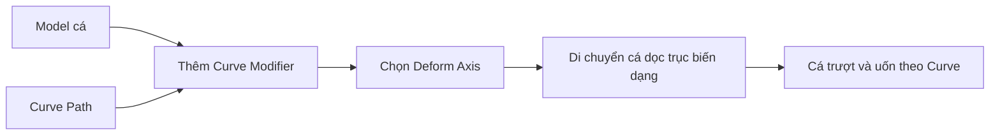
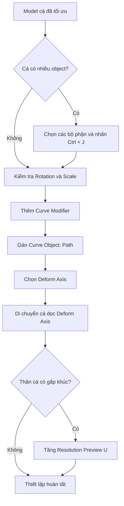

# 05 — Bước 4: Cho cá bám theo Curve bằng Curve Modifier

| Thuộc tính       | Nội dung                                            |
| ---------------- | --------------------------------------------------- |
| **Video**        | The Secret to Easy Fish Animation in Blender!       |
| **Đoạn**         | Step Four                                           |
| **Thời điểm**    | 02:09–02:38                                         |
| **Chủ đề chính** | Curve Modifier, Deform Axis và Resolution Preview U |

---

## 1. Mục tiêu bài học

Sau bài học này, bạn có thể:

* Hiểu sự khác biệt giữa **Curve Modifier** và **Follow Path Constraint**.
* Gắn Curve Modifier vào model cá và liên kết nó với đường Curve đã tạo.
* Xác định đúng **Deform Axis** để cá di chuyển dọc theo Curve.
* Hiểu vì sao Curve Modifier có thể vừa làm cá di chuyển, vừa uốn cong toàn bộ thân cá.
* Khắc phục hiện tượng thân cá bị gấp khúc bằng cách tăng **Resolution Preview U**.
* Chuẩn bị model đúng cấu trúc trước khi tiếp tục sang bước animation.

---

## 2. Curve Modifier hoạt động như thế nào?

Trong các kỹ thuật animation theo đường dẫn thông thường, người dùng thường sử dụng **Follow Path Constraint**.

Follow Path Constraint chủ yếu:

* Di chuyển object dọc theo Curve.
* Xoay object theo hướng của đường đi.
* Không trực tiếp làm biến dạng hình dạng của mesh.

Trong kỹ thuật của video, tác giả sử dụng **Curve Modifier**.

Curve Modifier có thể:

* Uốn toàn bộ mesh theo hình dạng của Curve.
* Cho phép object trượt dọc theo Curve.
* Làm thân cá tự động cong theo đường bơi.
* Tạo nền tảng cho chuyển động lắc thân mà không cần Armature phức tạp.

### So sánh nhanh

| Tiêu chí                             | Follow Path Constraint | Curve Modifier                               |
| ------------------------------------ | ---------------------- | -------------------------------------------- |
| Di chuyển theo Curve                 | Có                     | Có, thông qua vị trí object trên Deform Axis |
| Xoay theo hướng Curve                | Có                     | Có, do mesh bị uốn theo Curve                |
| Làm biến dạng mesh                   | Không                  | Có                                           |
| Phù hợp với thân cá mềm              | Hạn chế                | Rất phù hợp                                  |
| Cần rig xương                        | Không bắt buộc         | Không bắt buộc                               |
| Có thể làm thân cá cong theo quỹ đạo | Không                  | Có                                           |

---

## 3. Nguyên lý biến dạng

Có thể hình dung Curve Modifier giống như việc gắn model cá lên một thanh mềm.

Khi thanh mềm được bẻ cong, toàn bộ model cá cũng bị uốn theo hình dạng của thanh đó.

```text
Mesh cá ban đầu
────────────────────────►

Curve
~~~~~~~╲________╱~~~~~~~~

Sau khi áp dụng Curve Modifier
~~~~~~🐟╲________╱~~~~~~~~
```

Curve không chỉ đóng vai trò là đường di chuyển mà còn là bộ điều khiển trực tiếp hình dạng của thân cá.

Quy trình tổng quát:



---

## 4. Thêm Curve Modifier vào model cá

### Bước 1: Chọn model cá

Trong **Object Mode**, chọn object chứa toàn bộ model cá.

Model nên được đặt tên rõ ràng, ví dụ:

```text
Fish
```

Curve có thể được đổi tên thành:

```text
Path
```

Việc đặt tên giúp dễ nhận biết object khi scene có nhiều thành phần.

---

### Bước 2: Thêm Curve Modifier

Mở:

```text
Modifier Properties
→ Add Modifier
→ Deform
→ Curve
```

Trong các phiên bản Blender mới, có thể sử dụng ô tìm kiếm của menu modifier và nhập:

```text
Curve
```

---

### Bước 3: Gán Curve Object

Trong Curve Modifier, tìm trường:

```text
Curve Object
```

Chọn Curve đã tạo ở bước trước, ví dụ:

```text
Path
```

Cấu trúc liên kết lúc này:

```text
Fish
└── Curve Modifier
    └── Curve Object: Path
```

Sau khi gán Curve Object, model cá có thể thay đổi vị trí hoặc biến dạng ngay lập tức. Đây là hành vi bình thường của Curve Modifier.

---

## 5. Deform Axis là gì?

Curve Modifier cần biết model cá kéo dài theo trục nào.

Trục đó được gọi là:

```text
Deform Axis
```

Các lựa chọn phổ biến gồm:

* Positive X
* Negative X
* Positive Y
* Negative Y
* Positive Z
* Negative Z

Đối với model cá, trục biến dạng thường là trục chạy từ:

```text
Đầu cá → Đuôi cá
```

Ví dụ, nếu đầu và đuôi cá nằm dọc theo trục X:

```text
Đầu cá                        Đuôi cá
  ◀─────────────────────────────▶
                 X
```

Deform Axis phù hợp có thể là:

```text
Positive X
```

hoặc:

```text
Negative X
```

Lựa chọn chính xác phụ thuộc vào hướng ban đầu của model.

---

## 6. Cho cá trượt dọc theo Curve

Sau khi gắn Curve Modifier, cá chưa tự động bơi dọc theo đường dẫn.

Để thay đổi vị trí của cá trên Curve, cần di chuyển object cá dọc theo đúng **Deform Axis**.

Ví dụ, nếu Deform Axis là trục X:

```text
G → X
```

Sau đó di chuyển chuột để thay đổi vị trí.

Cá sẽ không chỉ di chuyển theo một đường thẳng. Curve Modifier sẽ chuyển vị trí đó sang vị trí tương ứng trên Curve.

```text
Vị trí trên trục X của object
              │
              ▼
Vị trí tương ứng trên Curve
              │
              ▼
Cá được uốn và đặt tại vị trí đó
```

### Minh họa

```text
Không có Curve Modifier:

X = 0          X = 5          X = 10
🐟-------------🐟-------------🐟

Có Curve Modifier:

X = 0          X = 5          X = 10
🐟~~~~~~~╲______🐟______╱~~~~~~🐟
```

Như vậy, giá trị vị trí trên trục biến dạng trở thành thông số điều khiển tiến trình di chuyển dọc theo Curve.

---

## 7. Xác định đúng Deform Axis

Nếu chọn sai Deform Axis, model có thể:

* Biến mất khỏi vị trí mong muốn.
* Xoay sai hướng.
* Bị kéo giãn bất thường.
* Bị gấp thành một khối.
* Không di chuyển theo Curve khi thay đổi vị trí.
* Uốn theo chiều cao hoặc chiều ngang thay vì từ đầu đến đuôi.

### Cách kiểm tra

1. Xác định chiều dài chính của model cá.
2. Bật hiển thị trục Local nếu cần.
3. Thử lần lượt `Positive X`, `Negative X`, `Positive Y` hoặc `Negative Y`.
4. Di chuyển object theo trục tương ứng.
5. Quan sát xem đầu và đuôi cá có nằm đúng theo hướng của Curve hay không.

### Quy tắc thực tế

```text
Chiều đầu–đuôi của cá
        phải trùng với
Deform Axis của Curve Modifier
```

---

## 8. Vấn đề mesh bị gấp khúc

Sau khi thiết lập Curve Modifier, thân cá có thể xuất hiện các đoạn gấp khúc hoặc mặt phẳng rõ rệt.

Hiện tượng này có thể trông giống:

```text
Mượt mong muốn:
~~~~~~~~~~~~~~~

Bị gấp khúc:
__/\/\__/\/\__
```

Dấu hiệu thường gặp:

* Thân cá cong theo từng đoạn.
* Các mặt trên mesh tạo thành góc rõ rệt.
* Đường Curve hiển thị không mượt.
* Khi cá di chuyển, các nếp gấp thay đổi theo vị trí.

Trong trường hợp này, nguyên nhân thường không nằm ở mesh cá mà nằm ở độ phân giải của Curve.

---

## 9. Resolution Preview U

Curve trong Blender được nội suy thành nhiều đoạn nhỏ để hiển thị và tính toán.

Thông số kiểm soát số lượng đoạn nội suy là:

```text
Resolution Preview U
```

Đường dẫn thiết lập:

```text
Chọn Curve
→ Object Data Properties
→ Shape
→ Resolution Preview U
```

### Resolution thấp

```text
Điểm điều khiển:
●────────●────────●

Curve được nội suy ít:
●____/────\____●
```

Khi Curve Modifier dùng đường cong này, mesh cũng bị uốn thành từng đoạn.

### Resolution cao

```text
Điểm điều khiển:
●────────●────────●

Curve được nội suy nhiều:
●~~~~~~~~~~~~~~~●
```

Kết quả là thân cá được uốn mượt hơn.

---

## 10. Cách tăng độ mượt

1. Chọn object Curve.
2. Mở **Object Data Properties**.
3. Mở phần **Shape**.
4. Tìm **Resolution Preview U**.
5. Tăng giá trị từng bước.
6. Quan sát lại model cá trong viewport.

Ví dụ:

```text
Resolution Preview U: 4
→ Curve còn hơi góc cạnh

Resolution Preview U: 12
→ Curve mượt hơn rõ rệt

Resolution Preview U: 24
→ Phù hợp với Curve phức tạp hơn
```

Không có một giá trị cố định phù hợp với mọi scene.

Giá trị cần thiết phụ thuộc vào:

* Độ dài Curve.
* Số lượng đoạn cong.
* Mức độ thay đổi hướng.
* Độ chi tiết của mesh cá.
* Hiệu năng máy tính.

Nguyên tắc:

> Tăng đến mức chuyển động và biến dạng đủ mượt, không cần đặt giá trị cao nhất.

---

## 11. Resolution Preview U không phải Subdivision Surface

Hai thông số này giải quyết hai vấn đề khác nhau.

| Thông số                 | Tác dụng                                        |
| ------------------------ | ----------------------------------------------- |
| **Resolution Preview U** | Làm đường Curve mượt hơn                        |
| **Subdivision Surface**  | Tăng độ mượt và mật độ hình học của mesh        |
| **Shade Smooth**         | Làm mượt cách ánh sáng được nội suy trên bề mặt |
| **Decimate**             | Giảm số lượng polygon của mesh                  |

Nếu thân cá bị gấp theo từng đoạn của đường đi, hãy kiểm tra **Resolution Preview U** trước.

Nếu đường bao của cá vẫn thô dù Curve đã mượt, có thể cần kiểm tra topology hoặc Subdivision Surface.

---

## 12. Model cá nên là một object duy nhất

Curve Modifier được áp dụng riêng trên từng object.

Nếu model cá gồm nhiều object tách biệt, chẳng hạn:

```text
Fish_Body
Fish_Left_Eye
Fish_Right_Eye
Fish_Dorsal_Fin
Fish_Tail
```

và chỉ thêm Curve Modifier vào `Fish_Body`, các object còn lại sẽ không tự động uốn đồng bộ.

Điều này có thể gây ra:

* Mắt tách khỏi đầu.
* Vây không đi theo thân.
* Đuôi lệch khỏi vị trí.
* Các bộ phận trượt khỏi nhau khi cá di chuyển.

### Giải pháp đơn giản

Chọn toàn bộ các bộ phận của cá và sử dụng:

```text
Ctrl + J
```

Object được chọn cuối cùng sẽ trở thành object chính.

Sau khi Join:

```text
Fish
├── Thân
├── Vây
├── Mắt
└── Đuôi
```

Tất cả được chứa trong cùng một mesh object và nhận cùng một Curve Modifier.

### Lưu ý

`Ctrl + J` chỉ gộp các object thành một object. Nó không nhất thiết hàn các vertex với nhau.

Điều này thường vẫn đủ để Curve Modifier làm các phần di chuyển đồng bộ.

---

## 13. Origin và Transform

Curve Modifier phụ thuộc nhiều vào:

* Vị trí object.
* Origin.
* Local Axis.
* Scale.
* Rotation.
* Vị trí tương đối giữa mesh và Curve.

Nếu kết quả biến dạng không đúng, nên kiểm tra transform của cả cá và Curve.

Có thể áp dụng:

```text
Ctrl + A
→ Rotation & Scale
```

Nên thực hiện trước khi hoàn thiện thiết lập modifier.

### Không nên áp dụng Location tùy tiện

Apply Location có thể làm thay đổi mối quan hệ không gian giữa cá và Curve. Chỉ sử dụng khi hiểu rõ ảnh hưởng của nó.

---

## 14. Quy trình thực hành hoàn chỉnh

### Bước 1 — Chuẩn bị object

* Đảm bảo model cá đã được tối ưu.
* Kiểm tra cá có phải một object duy nhất hay không.
* Join các bộ phận bằng `Ctrl + J` nếu cần.
* Đặt tên model là `Fish`.
* Đặt tên Curve là `Path`.

### Bước 2 — Kiểm tra hướng model

* Xác định trục chạy từ đầu đến đuôi.
* Kiểm tra Local Axis của cá.
* Apply Rotation và Scale nếu cần.

### Bước 3 — Thêm modifier

```text
Fish
→ Modifier Properties
→ Add Modifier
→ Curve
```

### Bước 4 — Gán đường dẫn

```text
Curve Object: Path
```

### Bước 5 — Chọn Deform Axis

Chọn trục tương ứng với chiều đầu–đuôi của cá.

Ví dụ:

```text
Deform Axis: Positive X
```

### Bước 6 — Thử di chuyển

Nếu dùng trục X:

```text
G → X
```

Quan sát cá trượt và uốn theo Curve.

### Bước 7 — Làm mượt Curve

```text
Path
→ Object Data Properties
→ Shape
→ Resolution Preview U
```

Tăng giá trị đến khi thân cá không còn gấp khúc.

---

## 15. Sơ đồ hệ thống



---

## 16. Phím tắt và công cụ liên quan

| Thao tác                | Phím tắt hoặc vị trí                                  |
| ----------------------- | ----------------------------------------------------- |
| Thêm Curve Modifier     | Modifier Properties → Add Modifier → Deform → Curve   |
| Chọn Curve Object       | Curve Modifier → Curve Object                         |
| Đổi Deform Axis         | Curve Modifier → Deform Axis                          |
| Di chuyển theo trục X   | `G`, sau đó `X`                                       |
| Di chuyển theo trục Y   | `G`, sau đó `Y`                                       |
| Di chuyển theo trục Z   | `G`, sau đó `Z`                                       |
| Gộp nhiều object        | `Ctrl + J`                                            |
| Apply Rotation và Scale | `Ctrl + A` → Rotation & Scale                         |
| Tăng độ phân giải Curve | Object Data Properties → Shape → Resolution Preview U |
| Mở thanh tìm kiếm lệnh  | `F3`                                                  |

---

## 17. Lỗi thường gặp và cách xử lý

### Lỗi 1: Cá không bám theo Curve

**Nguyên nhân có thể:**

* Chưa gán Curve Object.
* Đang di chuyển sai trục.
* Deform Axis không khớp với chiều dài model.
* Curve và cá nằm quá xa nhau.
* Transform của object chưa được chuẩn hóa.

**Cách xử lý:**

1. Kiểm tra trường Curve Object.
2. Kiểm tra Deform Axis.
3. Thử di chuyển theo đúng trục.
4. Kiểm tra vị trí tương đối giữa cá và Curve.
5. Apply Rotation và Scale nếu cần.

---

### Lỗi 2: Cá quay ngược đầu

**Nguyên nhân:**

Deform Axis đúng trục nhưng sai chiều.

Ví dụ:

```text
Positive X
```

cần đổi thành:

```text
Negative X
```

**Cách xử lý:**

Đổi dấu của Deform Axis hoặc xoay lại model trước khi áp dụng transform.

---

### Lỗi 3: Cá bị gấp thành một khối

**Nguyên nhân có thể:**

* Chọn sai Deform Axis.
* Model không kéo dài theo trục đã chọn.
* Origin hoặc vị trí tương đối giữa cá và Curve không phù hợp.

**Cách xử lý:**

Kiểm tra lại trục đầu–đuôi của model và thử các Deform Axis khác.

---

### Lỗi 4: Thân cá bị gấp khúc

**Nguyên nhân phổ biến:**

```text
Resolution Preview U quá thấp
```

**Cách xử lý:**

Tăng Resolution Preview U trong Object Data Properties của Curve.

Không nên vội kết luận rằng mesh bị lỗi hoặc Decimate đã phá topology.

---

### Lỗi 5: Mắt và vây tách khỏi thân

**Nguyên nhân:**

Các bộ phận đang là những object riêng và không cùng nhận Curve Modifier.

**Cách xử lý:**

* Gộp chúng bằng `Ctrl + J`.
* Hoặc thêm cùng Curve Modifier với cùng thiết lập cho từng object.

Đối với kỹ thuật đơn giản trong video, Join thành một object là lựa chọn dễ quản lý hơn.

---

### Lỗi 6: Viewport bị chậm

**Nguyên nhân có thể:**

* Mesh cá vẫn còn quá nhiều polygon.
* Resolution Preview U quá cao.
* Curve quá phức tạp.
* Có nhiều modifier nặng đang hoạt động cùng lúc.

**Cách xử lý:**

* Chỉ tăng Resolution Preview U đến mức cần thiết.
* Tối ưu mesh bằng Decimate hợp lý.
* Tắt tạm các modifier không cần thiết trong viewport.
* Giảm độ phức tạp của Curve nếu có quá nhiều điểm điều khiển.

---

## 18. Thứ tự modifier

Nếu model có nhiều modifier, thứ tự modifier có thể ảnh hưởng đến kết quả.

Một cấu trúc cơ bản có thể là:

```text
Fish
├── Decimate
├── Curve
└── Subdivision Surface
```

Tuy nhiên, thứ tự phù hợp phụ thuộc vào mục tiêu.

Ví dụ:

* **Decimate trước Curve:** Curve xử lý mesh đã được giảm polygon, thường nhẹ hơn.
* **Subdivision sau Curve:** Làm mượt kết quả sau khi thân đã bị uốn.
* **Subdivision trước Curve:** Curve phải biến dạng nhiều vertex hơn, có thể nặng hơn.

Trong kỹ thuật tối ưu cho viewport, nên giữ số lượng vertex vừa đủ trước khi Curve Modifier xử lý.

---

## 19. Checklist thực hành

* [ ] Model cá đã được tối ưu đủ nhẹ để deform trong viewport.
* [ ] Các bộ phận cần thiết của cá đã được Join thành một object.
* [ ] Đã đổi tên model thành `Fish`.
* [ ] Đã đổi tên Curve thành `Path`.
* [ ] Đã thêm Curve Modifier vào model cá.
* [ ] Đã gán đúng `Curve Object`.
* [ ] Đã xác định đúng chiều đầu–đuôi của model.
* [ ] Đã chọn đúng `Deform Axis`.
* [ ] Đã thử di chuyển cá dọc theo trục biến dạng.
* [ ] Cá đã trượt đúng theo Curve.
* [ ] Thân cá đã uốn theo hình dạng Curve.
* [ ] Đã tăng Resolution Preview U nếu xuất hiện gấp khúc.
* [ ] Viewport vẫn hoạt động đủ mượt.
* [ ] Cá không bị tách mắt, vây hoặc đuôi khi di chuyển.

---

## 20. Bài tập thực hành

### Bài tập cơ bản

1. Tạo một Curve đơn giản hình chữ S.
2. Gắn Curve Modifier vào model cá.
3. Xác định đúng Deform Axis.
4. Di chuyển cá từ đầu đến cuối Curve.
5. Tăng Resolution Preview U để thân cá uốn mượt.

### Bài tập mở rộng

Tạo ba phiên bản Curve:

1. Curve gần như thẳng.
2. Curve hình chữ S nhẹ.
3. Curve có nhiều đoạn cong mạnh.

Sau đó so sánh:

* Mức độ biến dạng thân cá.
* Số lượng Resolution Preview U cần thiết.
* Hiệu năng viewport.
* Khả năng xảy ra méo đầu, vây và đuôi.

---

## 21. Kiến thức cốt lõi

```text
Curve Modifier
      │
      ├── Curve Object xác định đường uốn
      ├── Deform Axis xác định chiều dài của cá
      ├── Location trên trục xác định vị trí dọc Curve
      └── Resolution Preview U xác định độ mượt của biến dạng
```

Công thức tư duy đơn giản:

```text
Curve đúng
+ Deform Axis đúng
+ Vị trí object đúng
+ Resolution đủ cao
= Cá bám và uốn mượt theo đường bơi
```

---

## 22. Tóm tắt

Curve Modifier là thành phần trung tâm của kỹ thuật animation cá trong video.

Thay vì chỉ đưa cá di chuyển trên một đường dẫn, modifier này trực tiếp uốn toàn bộ mesh theo hình dạng của Curve. Khi di chuyển object cá dọc theo đúng Deform Axis, cá sẽ trượt dọc quỹ đạo và thân cá đồng thời cong theo đường đi.

Ba thiết lập quan trọng nhất là:

1. **Curve Object** — xác định đường mà cá sẽ bám theo.
2. **Deform Axis** — xác định chiều đầu–đuôi của model.
3. **Resolution Preview U** — kiểm soát độ mượt của Curve và mức độ mượt khi mesh bị biến dạng.

Sau khi hoàn thành bước này, model cá đã có thể di chuyển và uốn theo quỹ đạo. Đây là nền tảng để bước tiếp theo tạo chuyển động lắc thân và nhịp bơi tự nhiên.

---

# Bài luyện tập

## Mục tiêu


## Đề bài


## Yêu cầu hoàn thành

- [ ] 
- [ ] 
- [ ] 

## Kết quả / lời giải


## Ghi chú
