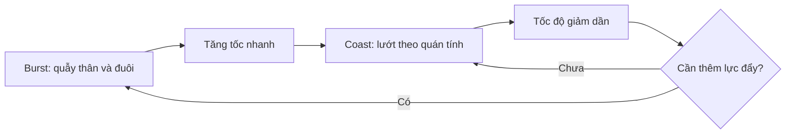

# 06 — Bước 5a: Nguyên lý vận động của cá và các kỹ thuật đã thử

| Thuộc tính       | Nội dung                                                                                      |
| ---------------- | --------------------------------------------------------------------------------------------- |
| **Video**        | *The Secret to Easy Fish Animation in Blender!*                                               |
| **Đoạn**         | Step five — Phần lý thuyết và thử nghiệm                                                      |
| **Thời điểm**    | 02:38–04:27                                                                                   |
| **Chủ đề chính** | Chuyển động robot, các phương pháp biến dạng đã thử và nguyên lý **burst-and-coast swimming** |

---

## 1. Mục tiêu bài học

Sau chương này, bạn sẽ:

* Hiểu vì sao chỉ cho cá di chuyển dọc theo Curve vẫn chưa tạo được cảm giác bơi tự nhiên.
* Nhận biết nguyên nhân khiến chuyển động có vận tốc không đổi trông **phẳng, cơ học và giống robot**.
* Biết những kỹ thuật tác giả đã thử nghiệm trước khi chọn phương pháp cuối cùng.
* Hiểu ưu điểm, hạn chế và phạm vi sử dụng của:

  * Simple Deform Modifier.
  * Lattice Modifier.
  * Cloth Simulation cho vây.
  * Rig dựa trên Curve và Hook Modifier.
* Nắm được nguyên lý sinh học **burst-and-coast swimming**.
* Chuẩn bị tư duy về nhịp độ và tốc độ trước khi tạo keyframe trong Graph Editor.

---

## 2. Vấn đề của chuyển động thẳng đều

Sau khi áp dụng **Curve Modifier** ở chương trước, con cá đã có thể:

* Bám theo đường Curve.
* Di chuyển dọc theo quỹ đạo.
* Uốn hình dạng theo độ cong của đường dẫn.

Tuy nhiên, kết quả vẫn chưa thuyết phục.

Nguyên nhân chính là cá đang di chuyển với **vận tốc gần như không đổi**:

```text
Vị trí
  │
  │                         ●
  │                    ●
  │               ●
  │          ●
  │     ●
  │●
  └──────────────────────────── Thời gian
```

Đường vị trí gần như tuyến tính đồng nghĩa với việc:

```text
Tốc độ
  │
  │ ───────────────────────────
  │
  │
  └──────────────────────────── Thời gian
```

Cá không có:

* Nhịp tăng tốc.
* Nhịp nghỉ.
* Quán tính.
* Cảm giác tạo lực đẩy.
* Sự thay đổi năng lượng trong chuyển động.

Vì vậy, dù quỹ đạo có cong đẹp, chuyển động vẫn tạo cảm giác:

> **Một vật thể đang trượt trên đường dẫn**, thay vì một sinh vật đang tự bơi.

---

## 3. “Nghĩ như một con cá”

Để giải quyết vấn đề, tác giả đặt ra câu hỏi:

> Một con cá có những cơ chế nào để tự đẩy cơ thể về phía trước?

Câu trả lời được trình bày theo cách hài hước nhưng rất quan trọng:

```text
Cơ chế tạo lực đẩy của cá
            │
            └── Lắc thân và đuôi — Wiggle
```

Cá không có động cơ, bánh xe hay chân để đẩy cơ thể về phía trước. Phần lớn lực đẩy được tạo ra bằng cách:

1. Uốn thân.
2. Quẫy đuôi.
3. Đẩy nước về phía sau.
4. Nhận phản lực đưa cơ thể về phía trước.

Điều này có nghĩa là cảm giác sống động của chuyển động không nhất thiết phải đến từ một hệ thống rig cực kỳ phức tạp. Yếu tố quan trọng hơn là mô phỏng đúng:

* **Thời điểm cá tạo lực đẩy.**
* **Mức độ tăng tốc sau mỗi lần quẫy.**
* **Khoảng thời gian cá lướt theo quán tính.**

---

## 4. Các kỹ thuật đã thử nghiệm

Trước khi chọn phương pháp cuối cùng, tác giả đã thử nhiều hướng khác nhau.

### 4.1. Simple Deform Modifier

**Simple Deform** ở chế độ **Bend** có thể làm cong thân cá theo một trục xác định.

#### Ưu điểm

* Thiết lập nhanh.
* Có sẵn trong Blender.
* Phù hợp với những biến dạng cong đơn giản.

#### Hạn chế

* Khó kiểm soát chính xác từng vùng trên cơ thể.
* Chuyển động dễ trông cứng và đồng đều.
* Không tạo được nhịp lắc lan truyền tự nhiên từ thân xuống đuôi.
* Không phù hợp với mesh cá scan có hình dạng phức tạp.

#### Kết luận

Simple Deform quá đơn giản đối với hiệu ứng bơi mà tác giả mong muốn.

---

### 4.2. Lattice Modifier

**Lattice Modifier** sử dụng một khung lồng bao quanh model. Khi chỉnh sửa các điểm của Lattice, mesh bên trong sẽ bị biến dạng theo.

#### Quy trình cơ bản

```text
Lattice bao quanh cá
        │
        ├── Dịch chuyển điểm điều khiển
        ├── Uốn khung Lattice
        └── Mesh cá biến dạng theo
```

#### Ưu điểm

* Không cần chỉnh sửa trực tiếp mesh cá.
* Có thể tạo các biến dạng mềm và tổng quát.
* Phù hợp với việc điều chỉnh hình dáng lớn.

#### Hạn chế

* Khó kiểm soát chính xác chuyển động của thân và đuôi.
* Việc tạo chu kỳ lắc tự nhiên đòi hỏi nhiều điểm điều khiển.
* Dễ tạo ra các vùng biến dạng ngoài ý muốn.
* Quy trình điều khiển không đủ trực quan cho mục tiêu “nhanh và dễ”.

#### Kết luận

Lattice có thể hoạt động, nhưng quá khó điều khiển chính xác cho chuyển động bơi tự nhiên.

---

### 4.3. Weight Paint kết hợp Cloth Simulation

Một thử nghiệm khác là dùng **Cloth Simulation** cho những phần mềm như:

* Vây lưng.
* Vây hậu môn.
* Vây đuôi.
* Các mép vây mỏng.

Ý tưởng là sử dụng **Weight Paint** hoặc Vertex Group để xác định:

* Phần vây được giữ cố định.
* Phần vây được phép dao động.
* Mức độ ảnh hưởng của mô phỏng.

#### Sơ đồ nguyên lý

```text
Chuyển động thân cá
        │
        ▼
Các điểm gốc của vây được giữ cố định
        │
        ▼
Phần đầu vây chịu Cloth Simulation
        │
        ▼
Vây rung và trễ theo chuyển động
```

#### Ưu điểm

* Có thể tạo chuyển động vây mềm và tự nhiên.
* Tự động sinh hiệu ứng:

  * Follow-through.
  * Drag.
  * Dao động.
  * Độ trễ của vây.

#### Hạn chế

* Mesh scan vẫn có số lượng vertex lớn dù đã Decimate.
* Topology không được thiết kế cho simulation.
* Mật độ polygon không đồng đều.
* Cloth Simulation chạy chậm.
* Dễ xuất hiện:

  * Vây xuyên thân.
  * Mesh rung mạnh.
  * Simulation không ổn định.
  * Thời gian tính toán dài.

#### Kết luận

Cloth Simulation không phải phương pháp sai, nhưng không phù hợp với các ràng buộc của video:

* Thực hiện nhanh.
* Không retopology.
* Không cần chuẩn bị mesh phức tạp.
* Chạy mượt trong viewport.

---

### 4.4. Rig dựa trên Curve và Hook Modifier

Tác giả cũng thử xây dựng một rig sử dụng:

* Curve làm cấu trúc điều khiển.
* Hook Modifier để liên kết các điểm hoặc handle của Curve với các object điều khiển.
* Xoay các Hook để tạo chuyển động uốn lượn.

#### Cấu trúc khái quát

```text
Controller / Hook 01
          │
          ▼
Điểm điều khiển đầu Curve
          │
          ▼
Controller / Hook 02
          │
          ▼
Điểm điều khiển giữa Curve
          │
          ▼
Controller / Hook 03
          │
          ▼
Điểm điều khiển đuôi Curve
          │
          ▼
Mesh cá uốn theo Curve
```

#### Ưu điểm

* Cấu trúc rig khá thanh lịch.
* Có thể tạo đường cong liên tục dọc theo cơ thể.
* Có tiềm năng tạo chuyển động mềm và chậm.
* Phù hợp hơn với cá lớn hoặc sinh vật bơi nhẹ nhàng.

#### Hạn chế

* Chuyển động hai phía không hoàn toàn đối xứng.
* Khó kiểm soát trong quá trình animate.
* Việc xoay Hook không trực quan với người mới.
* Cần nhiều thao tác để đạt được chuyển động mong muốn.
* Không đáp ứng tiêu chí “dễ sử dụng trong khoảng 10 phút”.

#### Kết luận

Rig Hook + Curve có tiềm năng, đặc biệt với cá lớn bơi chậm, nhưng không được chọn làm phương pháp chính trong video.

Tác giả cung cấp rig này như một tài nguyên riêng trên Patreon.

---

## 5. Bảng so sánh các kỹ thuật

| Kỹ thuật             | Ưu điểm                                 | Hạn chế chính               | Phù hợp với                          |
| -------------------- | --------------------------------------- | --------------------------- | ------------------------------------ |
| **Simple Deform**    | Nhanh, đơn giản                         | Ít quyền kiểm soát          | Biến dạng cong cơ bản                |
| **Lattice**          | Biến dạng mềm, không sửa trực tiếp mesh | Khó kiểm soát chính xác     | Điều chỉnh hình dáng tổng thể        |
| **Cloth Simulation** | Vây chuyển động tự nhiên                | Chậm, cần topology tốt      | Model đã tối ưu cho simulation       |
| **Curve + Hook Rig** | Thanh lịch, chuyển động mềm             | Khó sử dụng, thiếu đối xứng | Cá lớn bơi chậm                      |
| **Keyframe tốc độ**  | Nhanh, dễ kiểm soát, nhẹ                | Cần hiểu Graph Editor       | Cá nhỏ bơi theo nhịp burst-and-coast |

---

## 6. Nguyên lý burst-and-coast swimming

Sau khi thử các giải pháp kỹ thuật, tác giả quay lại quan sát cách cá thật di chuyển.

Cá nhỏ thường không quẫy đuôi liên tục với cùng một cường độ. Thay vào đó, chúng sử dụng chiến lược:

> **Burst-and-coast swimming — bơi bùng nổ rồi lướt.**

Chu kỳ gồm hai giai đoạn chính.

### 6.1. Burst — Tạo lực đẩy

Trong giai đoạn **burst**, cá:

* Quẫy thân và đuôi.
* Tạo lực đẩy.
* Tăng tốc nhanh.
* Di chuyển về phía trước trong một khoảng thời gian ngắn.

```text
Quẫy thân và đuôi
        │
        ▼
Đẩy nước về phía sau
        │
        ▼
Tạo phản lực
        │
        ▼
Cá tăng tốc về phía trước
```

### 6.2. Coast — Lướt theo quán tính

Sau cú tăng tốc, cá ngừng hoặc giảm chuyển động cơ thể.

Trong giai đoạn **coast**, cá:

* Gần như không quẫy đuôi.
* Tiếp tục tiến về phía trước nhờ quán tính.
* Chậm dần do lực cản của nước.
* Tiết kiệm năng lượng.

```text
Ngừng tạo lực đẩy
        │
        ▼
Cá tiếp tục lướt
        │
        ▼
Lực cản của nước làm giảm tốc
        │
        ▼
Tốc độ giảm đến khi cần burst tiếp theo
```

---

## 7. Chu kỳ chuyển động hoàn chỉnh



Chu kỳ tổng quát:

```text
Burst → Tăng tốc → Coast → Giảm tốc → Burst → Tăng tốc → Coast
```

Đây là dạng chuyển động không đều và có nhịp.

---

## 8. Biểu đồ tốc độ theo thời gian

### Chuyển động robot

```text
Tốc độ
  │
  │ ─────────────────────────────────
  │
  │
  └────────────────────────────────── Thời gian
```

Tốc độ gần như không đổi trong toàn bộ animation.

---

### Chuyển động burst-and-coast

```text
Tốc độ
  │       ╱╲              ╱╲
  │      ╱  ╲            ╱  ╲
  │     ╱    ╲__________╱    ╲________
  │____╱
  └─────────────────────────────────── Thời gian
       Burst   Coast     Burst   Coast
```

Mỗi nhịp bao gồm:

* Đường dốc đi lên nhanh: **Burst**.
* Đường cong giảm xuống từ từ: **Coast**.
* Một khoảng chuyển tiếp trước cú burst tiếp theo.

Điểm quan trọng là tốc độ không thay đổi tuyến tính và đều đặn. Nó phải có:

* Nhịp nhanh.
* Nhịp chậm.
* Khoảng nghỉ.
* Sự bất đối xứng nhẹ.
* Biến thiên tự nhiên.

---

## 9. Vì sao burst-and-coast trông tự nhiên?

Phương pháp này tạo cảm giác cá thật vì nó mô phỏng được mối quan hệ giữa:

```text
Chuyển động cơ thể
        +
Lực đẩy
        +
Quán tính
        +
Lực cản của nước
        =
Cảm giác bơi tự nhiên
```

Người xem không nhất thiết phải nhìn thấy rõ từng lần cá quẫy đuôi. Não bộ có thể nhận ra chuyển động sinh vật thông qua sự thay đổi tốc độ:

* Tăng tốc cho thấy cá vừa tạo lực.
* Giảm tốc cho thấy cá đang lướt.
* Cú tăng tốc tiếp theo cho thấy cá vừa tiếp tục quẫy.

Vì vậy, chỉ cần điều khiển tốt **tốc độ di chuyển theo thời gian**, animation đã có thể thuyết phục hơn rất nhiều mà chưa cần:

* Rig xương phức tạp.
* Cloth Simulation.
* Lattice nhiều điểm.
* Modifier biến dạng nâng cao.
* Retopology toàn bộ model.

---

## 10. Tư duy trước khi tạo keyframe

Trước khi mở Graph Editor, nên chia quỹ đạo thành các đoạn chuyển động.

Ví dụ:

```text
Bắt đầu
   │
   ├── Burst nhẹ
   │
   ├── Coast dài
   │
   ├── Burst mạnh khi đổi hướng
   │
   ├── Coast ngắn
   │
   ├── Burst nhẹ
   │
   └── Coast đến cuối Curve
```

Có thể đánh dấu trực tiếp trên timeline:

```text
Frame:  1        15         35      48        70       85
        │---------│----------│-------│---------│--------│
        Burst     Coast      Burst   Coast     Burst    Coast
```

Không nên đặt các burst cách nhau hoàn toàn bằng nhau. Nhịp quá đều sẽ tạo thành một vòng lặp máy móc khác.

---

## 11. Quy trình thực hành gợi ý

### Bước 1 — Xem lại chuyển động hiện tại

Phát animation từ chương trước và quan sát:

* Cá có di chuyển với tốc độ không đổi không?
* Các đoạn thẳng và đoạn cong có cùng tốc độ không?
* Cá có tăng tốc khi chuẩn bị đổi hướng không?
* Chuyển động có giống một vật thể trượt trên ray không?

---

### Bước 2 — Xác định các đoạn burst

Đánh dấu những vị trí cá cần tạo thêm lực đẩy, chẳng hạn:

* Khi bắt đầu di chuyển.
* Trước một khúc cua.
* Sau một đoạn lướt dài.
* Khi thay đổi hướng bơi.
* Khi cần tránh chướng ngại vật.

---

### Bước 3 — Xác định các đoạn coast

Đặt các đoạn coast:

* Sau mỗi cú burst.
* Trên các đoạn Curve tương đối thẳng.
* Khi cá đang tiến gần mục tiêu.
* Khi muốn tạo cảm giác thư giãn hoặc tiết kiệm năng lượng.

---

### Bước 4 — Phác thảo bản đồ tốc độ

Ví dụ:

| Khoảng frame | Giai đoạn | Hành vi                               |
| ------------ | --------- | ------------------------------------- |
| 1–8          | Burst     | Tăng tốc nhanh từ trạng thái đứng yên |
| 8–30         | Coast     | Lướt và giảm tốc từ từ                |
| 30–36        | Burst     | Tăng tốc để đi qua khúc cua           |
| 36–60        | Coast     | Lướt dài                              |
| 60–66        | Burst     | Cú đẩy nhẹ                            |
| 66–90        | Coast     | Giảm tốc đến cuối animation           |

---

### Bước 5 — Chuẩn bị cho Graph Editor

Ở chương tiếp theo, các giai đoạn này sẽ được hiện thực hóa bằng:

* Keyframe vị trí của cá dọc theo trục biến dạng.
* Điều chỉnh Interpolation.
* Chỉnh tay các handle trong Graph Editor.
* Tạo đoạn tăng tốc nhanh và giảm tốc mượt.

---

## 12. Phím tắt và công cụ liên quan

Đây chủ yếu là phần lý thuyết và nghiên cứu phương pháp, vì vậy chưa có nhiều thao tác cụ thể.

| Công cụ              | Vai trò                                            |
| -------------------- | -------------------------------------------------- |
| **Timeline**         | Chia animation thành các đoạn burst và coast       |
| **Dope Sheet**       | Quan sát khoảng cách giữa các keyframe             |
| **Graph Editor**     | Điều khiển tốc độ và gia tốc                       |
| **Curve Modifier**   | Giữ cá bám và biến dạng theo đường bơi             |
| **Simple Deform**    | Phương pháp biến dạng đã thử nhưng không được chọn |
| **Lattice Modifier** | Phương pháp điều khiển hình dáng đã thử            |
| **Cloth Simulation** | Thử nghiệm chuyển động tự động cho vây             |
| **Hook Modifier**    | Điều khiển các điểm hoặc handle của Curve          |

---

## 13. Lưu ý quan trọng

### Không có một modifier duy nhất làm toàn bộ công việc

Không nên tiếp tục tìm kiếm một modifier có thể tự động:

* Cho cá bơi.
* Tạo lực đẩy.
* Tạo độ trễ.
* Điều khiển tốc độ.
* Làm vây chuyển động.
* Sinh quán tính.

Những yếu tố trên thuộc nhiều lớp chuyển động khác nhau.

Trong phạm vi video, giải pháp hiệu quả nhất là ưu tiên yếu tố có tác động thị giác lớn nhất:

> **Nhịp thay đổi tốc độ của chuyển động tổng thể.**

---

### Cloth Simulation không phải lúc nào cũng phù hợp

Cloth có thể rất hữu ích khi:

* Mesh đã được retopology.
* Các vây là mesh riêng.
* Mật độ polygon đồng đều.
* Có hệ thống collision tốt.
* Có thời gian bake simulation.
* Dự án yêu cầu chất lượng cao.

Nó chỉ không phù hợp với mục tiêu nhanh và nhẹ của video này.

---

### Hook Rig phù hợp với một loại chuyển động khác

Rig Hook + Curve có thể hiệu quả với:

* Cá voi.
* Cá mập lớn.
* Cá đuối.
* Lươn.
* Sinh vật biển bơi chậm.
* Chuyển động uốn dài và mềm.

Đối với cá nhỏ có các cú tăng tốc ngắn, phương pháp burst-and-coast dễ triển khai và dễ điều chỉnh hơn.

---

### Không để burst trở thành nhịp máy móc

Một lỗi phổ biến là đặt burst theo khoảng cách hoàn toàn đều nhau:

```text
Burst → 20 frame → Burst → 20 frame → Burst → 20 frame
```

Điều này tạo cảm giác giống máy móc.

Nên sử dụng nhịp có biến thiên:

```text
Burst → 18 frame → Burst → 27 frame → Burst → 14 frame → Burst
```

Khoảng cách cụ thể phụ thuộc vào:

* Độ cong của Curve.
* Kích thước cá.
* Tính cách chuyển động.
* Trạng thái năng lượng.
* Mục đích của cảnh.

---

## 14. Lỗi thường gặp

### Lỗi 1 — Chỉ làm Curve cong hơn

Curve phức tạp hơn không tự động khiến cá bơi tự nhiên hơn.

```text
Quỹ đạo đẹp + tốc độ không đổi = vẫn trông như robot
```

Cần chỉnh cả:

* Quỹ đạo không gian.
* Nhịp độ thời gian.

---

### Lỗi 2 — Tăng số lượng keyframe quá mức

Nhiều keyframe không đồng nghĩa với chuyển động tốt hơn.

Quá nhiều keyframe có thể:

* Làm Graph Editor rối.
* Tạo thay đổi tốc độ ngoài ý muốn.
* Khó sửa animation.
* Gây rung hoặc giật.

Nên bắt đầu bằng ít keyframe, sau đó bổ sung khi thật sự cần.

---

### Lỗi 3 — Burst quá dài

Burst nên là một cú tạo lực tương đối ngắn. Nếu đoạn tăng tốc kéo dài quá lâu, cá sẽ giống:

* Đang được kéo bằng động cơ.
* Đang bơi liên tục với công suất cố định.
* Đang tăng tốc tuyến tính như phương tiện cơ giới.

---

### Lỗi 4 — Coast hoàn toàn đứng yên

Trong giai đoạn coast, cá vẫn tiếp tục tiến về phía trước. Nó chỉ:

* Giảm tốc.
* Hạn chế chuyển động cơ thể.
* Lướt theo quán tính.

Không nên dừng cá đột ngột giữa các burst, trừ khi đó là chủ ý animation.

---

### Lỗi 5 — Mọi cú burst đều giống nhau

Trong tự nhiên, mỗi cú tạo lực có thể khác nhau về:

* Thời lượng.
* Cường độ.
* Khoảng nghỉ.
* Quãng đường tạo ra.
* Mức giảm tốc sau đó.

Một chút bất đối xứng sẽ làm animation hữu cơ hơn.

---

## 15. Checklist thực hành

### Kiến thức

* [ ] Hiểu vì sao chuyển động với vận tốc không đổi trông giống robot.
* [ ] Hiểu vai trò của chuyển động lắc thân và đuôi trong việc tạo lực đẩy.
* [ ] Biết Simple Deform không cung cấp đủ quyền kiểm soát.
* [ ] Biết Lattice khó điều khiển chính xác cho chuyển động bơi.
* [ ] Hiểu vì sao Cloth Simulation chạy chậm trên mesh scan.
* [ ] Biết Hook Rig có tiềm năng nhưng không phải lựa chọn dễ cho người mới.
* [ ] Hiểu rõ hai giai đoạn burst và coast.

### Chuẩn bị animation

* [ ] Đã xem lại chuyển động từ chương trước.
* [ ] Đã xác định các đoạn cá cần tăng tốc.
* [ ] Đã xác định các đoạn cá sẽ lướt.
* [ ] Đã phác thảo bản đồ tốc độ theo timeline.
* [ ] Không đặt các burst theo nhịp hoàn toàn đều nhau.
* [ ] Sẵn sàng chỉnh keyframe trong Graph Editor.

---

## 16. Tóm tắt

Bí mật của chuyển động cá tự nhiên trong kỹ thuật này không nằm ở một modifier đặc biệt hay một hệ thống rig phức tạp.

Tác giả đã thử nhiều phương pháp:

```text
Simple Deform
      ↓
Không đủ kiểm soát

Lattice
      ↓
Khó điều khiển chính xác

Cloth Simulation
      ↓
Quá chậm với mesh scan

Curve + Hook Rig
      ↓
Thanh lịch nhưng khó sử dụng
```

Giải pháp cuối cùng xuất phát từ việc quan sát sinh học:

```text
Burst
Tạo lực đẩy và tăng tốc
        ↓
Coast
Lướt và giảm tốc
        ↓
Burst tiếp theo
```

Chuyển động không đều, xen kẽ giữa những cú tăng tốc ngắn và các đoạn lướt giảm tốc, chính là yếu tố khiến cá trông giống một sinh vật đang tự bơi thay vì một object đang trượt trên Curve.

Ở chương tiếp theo, nguyên lý này sẽ được chuyển thành keyframe cụ thể và tinh chỉnh bằng **Graph Editor**.

---

# Bài luyện tập

## Mục tiêu


## Đề bài


## Yêu cầu hoàn thành

- [ ] 
- [ ] 
- [ ] 

## Kết quả / lời giải


## Ghi chú
