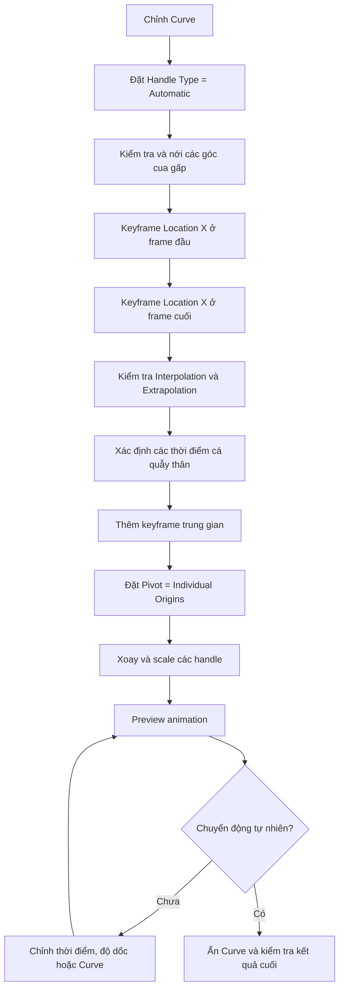

# 07 — Bước 5b: Tạo chuyển động Burst-and-Coast bằng Keyframe trong Graph Editor

| Thuộc tính       | Nội dung                                                                       |
| ---------------- | ------------------------------------------------------------------------------ |
| **Video**        | *The Secret to Easy Fish Animation in Blender!*                                |
| **Đoạn**         | Step five — phần thực hành keyframe                                            |
| **Thời điểm**    | 04:27–08:00                                                                    |
| **Chủ đề chính** | Keyframe `Location X`, chỉnh F-Curve và handle để tạo nhịp bơi burst-and-coast |

---

## 1. Mục tiêu bài học

Sau phần này, bạn có thể:

* Chuẩn bị hình dạng Curve đủ mềm để cá uốn theo mà không bị biến dạng quá mạnh.
* Tạo chuyển động nền bằng hai keyframe `Location X` ở đầu và cuối animation.
* Thêm các keyframe trung gian tại đúng thời điểm cá thực hiện cú quẫy thân.
* Chỉnh handle trong **Graph Editor** để tạo chu kỳ:

  * tăng tốc nhanh;
  * đạt tốc độ cao sau cú quẫy;
  * giảm tốc dần khi cá lướt;
  * tiếp tục tăng tốc ở cú quẫy tiếp theo.
* Điều chỉnh tốc độ tổng thể mà không phải làm lại toàn bộ keyframe.

---

## 2. Nguyên lý chuyển động Burst-and-Coast

**Burst-and-coast** là kiểu chuyển động trong đó cá không duy trì tốc độ hoàn toàn đều.

Thay vào đó, chuyển động diễn ra theo chu kỳ:

```text
Quẫy thân mạnh
      ↓
Tăng tốc nhanh
      ↓
Lướt về phía trước
      ↓
Giảm tốc dần
      ↓
Quẫy thân lần tiếp theo
```

Nếu chỉ đặt hai keyframe đầu và cuối với tốc độ đều, cá sẽ trượt dọc theo Curve giống một vật thể máy móc:

```text
Tốc độ
  │
  │  ─────────────────────────  Chuyển động đều
  │
  └─────────────────────────── Thời gian
```

Chuyển động burst-and-coast cần có tốc độ biến đổi liên tục:

```text
Tốc độ
  │       ╭──╮         ╭──╮         ╭──╮
  │      ╱    ╲       ╱    ╲       ╱    ╲
  │ ____╯      ╰_____╯      ╰_____╯      ╰____
  │
  └────────────────────────────────────────── Thời gian
         Burst   Coast   Burst   Coast
```

> Trong Graph Editor, chúng ta không trực tiếp chỉnh đồ thị tốc độ mà chỉnh **đồ thị vị trí theo thời gian**. Độ dốc của F-Curve tại mỗi thời điểm chính là tốc độ chuyển động.

---

## 3. Chuẩn bị hình dạng Curve

Trước khi chỉnh keyframe, cần đảm bảo Curve có hình dạng đủ mềm để cá uốn theo tự nhiên.

### 3.1. Đặt Handle Type thành Automatic

1. Chọn object Curve.
2. Nhấn `Tab` để vào **Edit Mode**.
3. Chọn các control point cần chỉnh hoặc nhấn `A` để chọn tất cả.
4. Nhấn `V`.
5. Chọn **Automatic**.

Blender sẽ tự động tính toán hướng và chiều dài handle nhằm tạo các đoạn cong mượt hơn.

### 3.2. Kiểm tra Curve từ góc nhìn trên xuống

Chuyển sang **Top View** và quan sát toàn bộ đường bơi.

Cần tránh trường hợp có nhiều góc cua gấp liên tiếp:

```text
Không nên:

────╮╭────
    ╰╯
  Hai góc gấp quá gần nhau
```

Nên nới rộng các đoạn cua:

```text
Nên:

────╮
     ╰────╮
          ╰────
```

Curve quá gấp có thể khiến:

* thân cá bị bẻ cong quá mức;
* đầu hoặc đuôi bị xoắn;
* mesh bị co, kéo hoặc xuyên vào chính nó;
* chuyển động trông giống cá đang bị giật mạnh.

---

## 4. Thiết lập hai keyframe nền

### 4.1. Mở Graph Editor

Chia giao diện Blender thành hai khu vực:

* một vùng hiển thị **3D Viewport**;
* một vùng hiển thị **Graph Editor**.

Sơ đồ bố trí gợi ý:

```text
┌───────────────────────────────┬───────────────────────────────┐
│                               │                               │
│         3D Viewport           │         Graph Editor          │
│                               │                               │
│  Quan sát cá và đường Curve   │  Chỉnh keyframe Location X    │
│                               │                               │
└───────────────────────────────┴───────────────────────────────┘
```

### 4.2. Keyframe ở frame đầu

1. Chọn object cá.
2. Di chuyển Timeline đến frame bắt đầu.
3. Mở bảng **Transform** hoặc **Object Properties**.
4. Đặt giá trị `Location X` tại vị trí bắt đầu.
5. Di chuột lên trường `Location X`.
6. Nhấn `I` để chèn keyframe.

### 4.3. Keyframe ở frame cuối

1. Di chuyển Timeline đến frame cuối.
2. Thay đổi `Location X` để cá đi hết đoạn Curve mong muốn.
3. Nhấn `I` trên trường `Location X`.

Sau bước này, F-Curve chỉ có hai điểm chính:

```text
Location X
  │                              ● Điểm cuối
  │                         ╱
  │                    ╱
  │               ╱
  │          ╱
  │     ╱
  │ ● Điểm đầu
  └──────────────────────────────── Thời gian
```

---

## 5. Extrapolation và Interpolation

Trong Graph Editor, chọn hai keyframe bằng phím `A`, sau đó nhấn:

```text
Shift + E → Linear Extrapolation
```

Tuy nhiên, cần phân biệt hai khái niệm khác nhau.

| Khái niệm         | Chức năng                                               | Phím tắt    |
| ----------------- | ------------------------------------------------------- | ----------- |
| **Interpolation** | Quy định hình dạng chuyển động giữa các keyframe        | `T`         |
| **Extrapolation** | Quy định hành vi F-Curve bên ngoài keyframe đầu và cuối | `Shift + E` |

### Interpolation

Interpolation quyết định object di chuyển như thế nào giữa hai keyframe:

* Linear;
* Bezier;
* Constant.

### Extrapolation

Extrapolation quyết định đường cong tiếp tục như thế nào trước keyframe đầu hoặc sau keyframe cuối.

> `Shift + E → Linear` không tự động làm toàn bộ phần giữa các keyframe trở thành đường thẳng. Nếu cần chuyển động tuyến tính giữa các keyframe, hãy kiểm tra thêm Interpolation bằng phím `T`.

---

## 6. Xác định thời điểm tạo Burst

Phát animation và quan sát thời điểm cá đi qua từng đoạn lượn trên Curve.

Mỗi đoạn lượn chính có thể được xem như một thời điểm cá thực hiện cú quẫy thân để đẩy mình về phía trước.

```text
Curve nhìn từ trên:

Bắt đầu
   │
   ▼
──────╮        ╭────────╮        ╭──────
      ╰────────╯        ╰────────╯
          ▲                 ▲
       Burst 1           Burst 2
```

Tại mỗi thời điểm đó:

1. Dừng Timeline.
2. Chọn kênh `X Location` trong Graph Editor.
3. Nhấn `I` khi con trỏ đang nằm trong Graph Editor.
4. Chèn một keyframe mới trên F-Curve.

Kết quả:

```text
Location X
  │                                   ●
  │                         ●
  │                ●
  │       ●
  │ ●
  └──────────────────────────────────── Thời gian
      Bắt đầu   Burst 1  Burst 2   Kết thúc
```

Các keyframe trung gian này là điểm neo để tạo nhịp tăng tốc và giảm tốc.

---

## 7. Chỉnh handle để tạo Burst-and-Coast

### 7.1. Đặt Pivot Point thành Individual Origins

Trong thanh Header của Graph Editor:

```text
Pivot Point → Individual Origins
```

Chế độ này giúp mỗi keyframe hoặc cụm handle được biến đổi quanh chính tâm của nó.

Nếu sử dụng một pivot chung, khi xoay hoặc scale nhiều điểm, toàn bộ F-Curve có thể bị méo quanh một vị trí không mong muốn.

---

### 7.2. Xoay handle

Chọn keyframe hoặc các handle cần chỉnh, sau đó nhấn:

```text
R
```

Xoay handle giúp thay đổi độ dốc của đoạn F-Curve trước và sau keyframe.

Ý nghĩa của độ dốc:

```text
F-Curve càng dốc   → cá di chuyển càng nhanh
F-Curve càng phẳng → cá di chuyển càng chậm
```

Mục tiêu tại mỗi nhịp burst:

* đoạn ngay sau cú quẫy có độ dốc lớn;
* đoạn sau đó dần phẳng hơn để tạo cảm giác lướt và giảm tốc;
* trước cú quẫy tiếp theo, tốc độ bắt đầu tăng trở lại.

---

### 7.3. Scale các handle

Chọn riêng handle cần điều chỉnh và nhấn:

```text
S
```

Có thể giới hạn theo trục:

```text
S, X
```

Việc scale handle thay đổi khoảng thời gian và mức độ ảnh hưởng của đoạn tăng tốc hoặc giảm tốc.

#### Handle dài hơn

* chuyển tiếp diễn ra trong thời gian dài hơn;
* chuyển động mềm;
* tốc độ thay đổi từ từ.

#### Handle ngắn hơn

* chuyển tiếp diễn ra nhanh;
* cú tăng tốc rõ;
* chuyển động có cảm giác mạnh và đột ngột hơn.

Có thể hình dung như sau:

```text
Burst mềm:

────────╮
        ╰────────────

Burst mạnh:

─────╮
     ╰────────────────
```

---

## 8. Hình dạng F-Curve gợi ý

Một F-Curve burst-and-coast có thể có hình dạng gần giống các đoạn chữ S nối tiếp nhau:

```text
Location X
  │
  │                              ╭────────●
  │                       ╭──────╯
  │                ╭──────╯
  │         ╭──────╯
  │ ●───────╯
  │
  └─────────────────────────────────────── Thời gian
       Burst 1      Burst 2      Burst 3
```

Mỗi đoạn có hai pha:

```text
Độ dốc lớn   → Burst: tăng tốc
Độ dốc giảm  → Coast: lướt và chậm dần
```

Không nên tạo các góc nhọn hoặc bước nhảy giá trị:

```text
Không nên:

────────╱│
       ╱ │
         │──────
```

Điều này có thể khiến cá:

* dịch chuyển giật cục;
* thay đổi tốc độ tức thời;
* xuất hiện cảm giác teleport;
* biến dạng mạnh tại điểm keyframe.

---

## 9. Tinh chỉnh tốc độ tổng thể

Nếu nhịp bơi đúng nhưng toàn bộ animation quá chậm, không nhất thiết phải chỉnh từng keyframe.

### Cách nén animation theo thời gian

1. Đặt Timeline hoặc 2D Cursor tại frame đầu.
2. Trong Graph Editor, đặt:

```text
Pivot Point → 2D Cursor
```

3. Chọn tất cả keyframe bằng `A`.
4. Nhấn:

```text
S, X
```

5. Scale các keyframe lại gần frame đầu.

Ví dụ:

```text
Trước khi scale:

●────────●────────●────────●

Sau khi scale theo X:

●────●────●────●
```

Kết quả:

* toàn bộ animation ngắn hơn;
* nhịp bơi nhanh hơn;
* quan hệ tương đối giữa các keyframe vẫn được giữ nguyên.

Nếu animation quá nhanh, scale theo trục X theo hướng ngược lại để giãn thời gian.

---

## 10. Đồng bộ keyframe với hình dạng Curve

Keyframe burst nên trùng với thời điểm cá bắt đầu hoặc đang đi qua một đoạn lượn.

```text
Hình dạng Curve:

──────╮            ╭────────
      ╰────────────╯
          ▲
     Keyframe burst
```

Nếu keyframe đặt quá sớm:

* cá tăng tốc khi vẫn đang ở đoạn thẳng;
* phần thân chưa bắt đầu uốn;
* chuyển động thiếu nguyên nhân trực quan.

Nếu keyframe đặt quá muộn:

* cá đã đi qua đoạn cua mới tăng tốc;
* cú đẩy không khớp với chuyển động thân;
* cảm giác quẫy và tiến về phía trước bị tách rời.

Cách sửa:

1. Chọn keyframe liên quan.
2. Nhấn `G`.
3. Di chuyển keyframe theo trục thời gian.
4. Có thể nhấn `G`, `X` để chỉ thay đổi thời điểm.
5. Preview lại animation.

---

## 11. Quy trình thực hành hoàn chỉnh



---

## 12. Các bước thực hành gợi ý

### Bước 1 — Làm mềm Curve

* Chọn Curve.
* Vào Edit Mode.
* Chọn các control point.
* Nhấn `V`.
* Chọn **Automatic**.
* Quan sát từ Top View.
* Nới rộng các góc cua quá gấp.

### Bước 2 — Tạo chuyển động nền

* Chọn object cá.
* Keyframe `Location X` tại frame đầu.
* Keyframe `Location X` tại frame cuối.
* Kiểm tra chuyển động tuyến tính ban đầu.

### Bước 3 — Thêm các điểm burst

* Phát animation.
* Dừng tại từng thời điểm cá đi qua đoạn lượn.
* Chèn keyframe trên kênh `X Location`.

### Bước 4 — Chỉnh F-Curve

* Đặt Pivot Point thành **Individual Origins**.
* Xoay handle bằng `R`.
* Scale handle bằng `S`.
* Tạo đoạn dốc sau mỗi cú quẫy.
* Làm phẳng dần đoạn lướt phía sau.

### Bước 5 — Preview và sửa

Kiểm tra các yếu tố:

* tốc độ có tăng đúng thời điểm cá quẫy không;
* đoạn coast có đủ dài không;
* có đoạn nào tăng tốc quá mạnh không;
* thân cá có bị uốn quá mức không;
* keyframe có khớp với đoạn lượn trên Curve không.

### Bước 6 — Điều chỉnh tốc độ toàn cục

Nếu animation quá chậm hoặc quá nhanh:

* đặt Pivot thành **2D Cursor**;
* chọn toàn bộ keyframe;
* dùng `S`, `X` để nén hoặc giãn animation theo thời gian.

### Bước 7 — Kiểm tra kết quả cuối

* Ẩn object Curve trong Viewport.
* Xem animation chỉ với model cá.
* Quan sát chuyển động từ nhiều góc camera.
* Kiểm tra các vùng dễ biến dạng như:

  * đầu;
  * cuống đuôi;
  * vây lưng;
  * vây hậu môn;
  * vây đuôi.

---

## 13. Phím tắt và công cụ liên quan

| Thao tác                      | Phím tắt hoặc vị trí             |
| ----------------------------- | -------------------------------- |
| Vào hoặc thoát Edit Mode      | `Tab`                            |
| Chọn tất cả                   | `A`                              |
| Đặt Handle Type cho Curve     | `V`                              |
| Chèn keyframe                 | `I`                              |
| Di chuyển keyframe            | `G`                              |
| Di chuyển theo trục thời gian | `G`, `X`                         |
| Xoay keyframe hoặc handle     | `R`                              |
| Scale keyframe hoặc handle    | `S`                              |
| Scale theo trục thời gian     | `S`, `X`                         |
| Chọn Interpolation Mode       | `T`                              |
| Chọn Extrapolation Mode       | `Shift + E`                      |
| Pivot theo từng điểm          | Pivot Point → Individual Origins |
| Pivot theo 2D Cursor          | Pivot Point → 2D Cursor          |
| Chuyển sang Top View          | Numpad `7`                       |

---

## 14. Lưu ý và lỗi thường gặp

### 14.1. Nhầm Extrapolation với Interpolation

`Shift + E` chỉ điều khiển hành vi của F-Curve bên ngoài phạm vi keyframe đầu và cuối.

Nếu chuyển động giữa các keyframe không đúng, hãy kiểm tra **Interpolation Mode** bằng phím `T`.

---

### 14.2. Quên đặt Individual Origins

Khi chỉnh nhiều keyframe mà Pivot vẫn đặt ở Median Point hoặc 2D Cursor, các keyframe có thể xoay quanh một tâm chung.

Hậu quả:

* F-Curve bị nghiêng toàn bộ;
* giá trị Location thay đổi ngoài ý muốn;
* các nhịp burst không còn độc lập.

---

### 14.3. Đặt quá nhiều keyframe

Quá nhiều keyframe có thể khiến F-Curve:

* khó chỉnh;
* xuất hiện nhiều dao động nhỏ;
* chuyển động bị giật;
* khó kiểm soát tốc độ.

Chỉ nên tạo keyframe ở những thời điểm có ý nghĩa rõ ràng trong chuyển động.

---

### 14.4. Burst không khớp với Curve

Một cú tăng tốc xảy ra trên đoạn Curve hoàn toàn thẳng có thể trông không hợp lý nếu thân cá không thực hiện cú quẫy tương ứng.

Cần đồng bộ ba yếu tố:

```text
Hình dạng Curve
       +
Thời điểm keyframe
       +
Độ dốc F-Curve
       =
Chuyển động thuyết phục
```

---

### 14.5. Góc Curve quá gấp

Nếu cá bị méo khi đi qua một điểm:

* nới rộng đoạn Curve;
* giảm độ cong;
* di chuyển các control point xa nhau hơn;
* kiểm tra hướng trục của Curve Modifier;
* kiểm tra Scale của cá và Curve đã được Apply hay chưa.

---

### 14.6. Chuyển động bị phóng đại

Nếu cá tăng tốc quá mạnh:

* giảm độ dốc của handle;
* kéo dài đoạn chuyển tiếp;
* xoay lại các handle;
* giảm khoảng cách giá trị giữa các keyframe;
* scale toàn bộ F-Curve nhẹ hơn.

---

### 14.7. Motion blur không sửa được animation sai

Motion blur có thể:

* làm chuyển động nhanh trông mềm hơn;
* che bớt các biến dạng nhỏ;
* tăng cảm giác tốc độ.

Nhưng motion blur không thể sửa:

* keyframe sai thời điểm;
* Curve quá gấp;
* tốc độ bị giật;
* mesh bị xoắn nghiêm trọng.

Animation cơ bản vẫn cần được xử lý đúng trước khi render.

---

## 15. Checklist thực hành

### Chuẩn bị Curve

* [ ] Đã đặt Handle Type của Curve thành **Automatic**.
* [ ] Đã kiểm tra Curve từ Top View.
* [ ] Không có hai góc cua quá gấp liên tiếp.
* [ ] Thân cá không bị uốn hoặc xoắn quá mức.

### Thiết lập keyframe

* [ ] Đã keyframe `Location X` tại frame đầu.
* [ ] Đã keyframe `Location X` tại frame cuối.
* [ ] Đã phân biệt rõ Interpolation và Extrapolation.
* [ ] Đã thêm keyframe tại từng thời điểm cá quẫy thân.

### Chỉnh Graph Editor

* [ ] Đã đặt Pivot Point thành **Individual Origins**.
* [ ] Đã chỉnh độ dốc handle tại từng điểm burst.
* [ ] Có đoạn tăng tốc rõ sau mỗi cú quẫy.
* [ ] Có đoạn giảm tốc mềm trong pha coast.
* [ ] Không xuất hiện góc nhọn hoặc bước nhảy trên F-Curve.

### Kiểm tra kết quả

* [ ] Các điểm tăng tốc khớp với đoạn lượn trên Curve.
* [ ] Không có đoạn cá tăng tốc vô lý trên đường thẳng.
* [ ] Nhịp bơi không quá nhanh hoặc quá chậm.
* [ ] Đã ẩn Curve để kiểm tra chuyển động thuần.
* [ ] Đã xem animation từ nhiều góc khác nhau.

---

## 16. Tóm tắt

Điểm quan trọng nhất của kỹ thuật này nằm ở **F-Curve của `Location X`**.

Thay vì để cá di chuyển với tốc độ đều, ta:

1. tạo keyframe đầu và cuối;
2. thêm keyframe tại các thời điểm cá quẫy thân;
3. chỉnh độ dốc và chiều dài handle;
4. tạo các pha tăng tốc nhanh và lướt chậm dần;
5. đồng bộ các pha này với hình dạng của Curve.

Công thức tổng quát:

```text
Curve mềm
    +
Keyframe đúng thời điểm
    +
F-Curve có độ dốc biến đổi
    +
Tinh chỉnh lặp lại
    =
Chuyển động cá tự nhiên hơn
```

Toàn bộ hiệu ứng có thể được xây dựng mà không cần:

* Armature phức tạp;
* Shape Keys;
* simulation;
* add-on bên ngoài.

Đây là một giải pháp nhanh và hiệu quả cho các model cá scan có topology dày, đặc biệt khi mục tiêu là tạo chuyển động bơi thuyết phục trong thời gian ngắn.

---

# Bài luyện tập

## Mục tiêu


## Đề bài


## Yêu cầu hoàn thành

- [ ] 
- [ ] 
- [ ] 

## Kết quả / lời giải


## Ghi chú
